# genmer：生成团簇初始构型结合molclus做团簇结构搜索的超便捷工具

- 原帖 URL：<http://bbs.keinsci.com/thread-2369-1-1.html>
- 论坛板块：量子化学
- 作者：**sobereva**
- 浏览量：232518 | 回复数：133 | 共11页
- 完整性：**全部内容已完整抓取**。

## 楼层正文

### 1 楼（楼主）｜sobereva

注：本文内容对应molclus官网上最新版molclus程序包里的genmer组件

genmer：生成团簇初始构型结合molclus做团簇结构搜索的超便捷工具

genmer: An ultra-convenient tool for generating initial configurations of clusters

文/Sobereva@北京科音First release：2015-Dec-15   Last update: 2022-Mar-3

1 前言

笔者开发过免费的molclus程序用于团簇构型搜索和分子构象搜索，不熟悉的话应必须先看此文搞明白molclus的思想：《使用molclus程序做团簇构型搜索和分子构象搜索》（http://bbs.keinsci.com/thread-577-1-1.html）。简单来说，molclus的主要执行过程就是读取含有多帧结构信息的traj.xyz文件，对每个结构调用Gaussian/MOPAC/ORCA/xtb/OpenBabel进行优化，然后对结果用isostat子程序进行筛选，更多信息见《Molclus FAQ》（http://sobereva.com/730）。

记录初始构型的traj.xyz可以通过多种方式产生，比如分子动力学。本文介绍用molclus中的genmer组件来快速方便地生成molclus所需要的初始构型，读者会发现基于genmer来使用molclus做原子和分子团簇构型搜索超级方便和高效！获得genmer的方法就是到molclus主页（http://www.keinsci.com/research/molclus.html）下载最新版本molclus程序，预编译的genmer就在其中。使用genmer/molclus发表文章时请按照molclus主页的说明进行引用。

目前已经有很多采用genmer+molclus的团簇构型搜索文章发表了，比如J. Mater. Chem. C, 7, 11005 (2019)、J. Phys. Chem. A, 120, 4560 (2016)、J. Theor. Comput. Chem., 16, 1750058 (2017)、Phys. Chem. Chem. Phys., 19, 28434 (2017)、Chem. Phys. Lett., 663, 128 (2016)等。

2 原理

genmer可以把任意种、任意数目的单体（可以是原子或者分子）放在一起通过随机方式生成指定数目的团簇初始构型。

genmer生成团簇初始构型的算法是洒家想出来的，又简单又实用，耗时又极低。就是让被加入的单体的中心从体系的原点出发向着一个随机的方向“发射”，发射过程中单体不断移动，当这个单体被移动到和体系已有的原子没有不合理接触（即被加入单体里的原子和当前团簇的原子间的距离都大于相应两个原子的半径和），这个单体就被加入当前团簇；接下来再这样加下一个单体，反复如此。最开始时的团簇就是第一个单体，随着单体不断加入，团簇就会不断长大，当指定数目的单体全都被加进去时这个团簇的生成就宣告结束。由于每个单体发射的方向都是随机的，还可以允许单体自身随机旋转，所以每次用这个算法生成的团簇构型都可以不一样。在生成团簇的时候可以通过设置一些约束条件来控制产生的团簇的大致形状，比如可以设置单体原子允许的X/Y/Z坐标范围（通过xmin/xmax、ymin/ymax、zmin/zmax指定），再比如可以设置单体中心距离体系中心的最大和最小距离（通过rmax、rmin指定），等等。如果沿着某个方向发射单体过程中，在单体移动到合适的加入位置之前就已经违背了约束条件，那么这次发射就失败了，程序会再尝试向着另一个随机朝向发射，反复如此，最大尝试的次数可以通过maxemit指定。如果超过这个尝试次数还没能成功地将单体加入体系，那么这个团簇的产生就宣告失败。

将上述团簇产生过程画图示意的话就是下面这样。青色的椭圆是已经加入团簇的单体，三个箭头示意了三种随机方向，当要被加入的单体按照箭头所示方向运动到图中黄色椭圆的位置时，由于和团簇里现有的原子已经没有不合理的接触了，此时这个单体就成功加入了，其坐标就被写入到团簇坐标里了。

emit.png (52.39 KB, 下载次数 Times of downloads: 847)

下载附件 Download

2019-3-20 14:23 上传 Uploaded

genmer的这个算法既可以生成分子团簇的初始构型，也可以生成原子团簇的初始构型。对于前者，单体是分子，原子半径使用范德华半径；对于后者，单体是原子，原子半径使用共价半径。

假设设定了团簇由10个A、5个B单体构成，程序会先把10个A都加进去，再把5个B加进去，根据如上算法，得到的团簇中10个A就会倾向于在团簇内层，5个B会倾向于在团簇外层。如果想让它们的出现区域不受设定顺序的影响而是完全随机的，genmer也可以做到自动打乱顺序，这称为shuffle。

在产生团簇时每个分子都被当成是刚性的。但如果一种分子有多种可能的构象都需要考虑，可以提供包含多个构象结构的分子的.xyz文件，并且设定每种构象出现的概率。这样每次加入分子时就会按概率抽取一种构象。

虽然genmer产生的团簇初始构型可能看起来略微松散，但这完全没关系，一做优化就自动收缩变得致密了。molclus用的团簇构型搜索的关键是让初始构型分布得足够随机且全面，这样才可能经过优化后获得尽可能多的极小点构型，特别是采样到能量最低结构。只要让genmer产生的构型数目足够多，是肯定可以达到这个目的的。

3 使用方法

genmer的使用非常容易，只需要提供每种分子的几何结构.xyz文件，设定出现数目就行了。如果你不懂什么叫.xyz格式，看此文：《谈谈记录化学体系结构的xyz文件》（http://sobereva.com/477）。运行参数和分子设定都记录在genmer.ini文件中，直接启动genmer后程序会读取当前目录下的genmer.ini，然后把生成的指定数目的初始构型都输出到当前目录下的traj.xyz当中。之后就可以直接运行molclus来自动调用其它程序去优化其中的每个结构了。对于Windows版，双击genmer.exe图标即可启动，对于Linux版，通过输入genmer可执行文件的路径即可启动。PS：实际上设置文件也不是必须叫genmer.ini且放在当前目录下，genmer启动时如果在当前目录下找不到genmer.ini的话会让你直接输入其文件路径，因此设置文件也可以命名成容易分辨的名字。

参数文件genmer.ini的每个选项在此文件里都有注释，一看就懂，下面介绍一下。通常大家就在程序自带的genmer.ini基础上编辑即可，如果此文件里有的参数没有出现，就会用默认值。

ngen= 50   // 期望生成的团簇构型的数目。默认为1

ngenmust= 0   // 若>0，则ngen选项无效，genmer将无限循环不断产生构型，直到成功产生的构型达到ngenmust。此选项默认为0，代表不做这个要求 

step= 0.1   // 设定每一步移动单体的距离。对于单体数少的情况不用改这个，但如果要产生的团簇里单体数甚巨，想节省时间可以把这个步长值设大，但出现不合理接触的可能性会增加。默认为0.1，一般不需要改

ishuffle= 1    // 0: 不打乱加入单体的顺序  1: 打乱顺序（如果当前只有一种单体的话，此选项设0还是1都不影响结果） -N：前N种单体加入顺序不变，只打乱其余种类分子加入顺序。 默认为0

imoveclust= 1    // 1: 将产生的团簇的中心挪到原点，即(0,0,0)的位置  0: 不挪动。默认为1

irandom= 1   // 0: 输入文件相同的情况下让每次运行结果都相同  1: 让每次运行结果都不同（因为此时每次运行时会使用不同的随机数种子）。默认为1

iradtype= 1    // 0: 使用CSD共价半径来检测原子间接触，适合生成原子团簇  1: 使用Bondi范德华半径检测原子间接触，适合生成分子团簇。默认为1

radscale= 1.0   // 原子半径乘的系数。显然设得越小，单体之间的原子间距离会越近；设得越大，单体之间的原子间距离会越大。默认为1.0，一般不需要改

maxemit= 300   // 生成每个团簇时尝试发射单体的最大次数。默认300，一般不用改。但当约束条件设得比较严、比较复杂而不容易成功产生团簇时，可以加大这个参数增加成功几率

----           这一行必须有且包含"----"字符，告诉程序代表接下来的内容是每类单体的数目（可以附带选项）和.xyz结构文件，单体类型可以有无数多个。

4    //第1类单体数目

examples/H2O.xyz   //第1类单体的结构文件。可以写绝对路径，也可以写这样的相对路径

3    //第2类单体数目

examples/ethanol.xyz   //第2类单体的结构文件

...略

在单体数目后头可以加入以下选项来设置加入此类单体时的特殊设定：

norot：单体不允许随机旋转。默认情况下每次加入单体时都是让单体随机旋转的，以让团簇构型间尽量有差异性

noxrot、noyrot、nozrot：分别让单体不能绕X轴、绕Y轴、绕Z轴旋转。也可以同时写多个，比如同时写noxrot noyrot则体系就只能绕Z轴随机旋转。三个同时写的话效果和写norot相同

cenxyz [XYZ坐标]：定义单体的中心位置，坐标是相对于单体结构文件的坐标。默认情况下是以单体几何中心作为单体的中心位置

rmax [距离]：设定这个单体的中心与体系中心最远距离不能超过多少。默认不做限制

rmin [距离]：这个选项可以要求单体中心与体系中心距离不得小于多少，这实际上是发射单体时与体系中心的最初距离。默认为0

xmax [数值]：要求单体里的所有原子的x坐标不允许大于这个值。默认为不限制

xmin [数值]：要求单体里的所有原子的x坐标不允许小于这个值。默认为不限制

ymax [数值]：要求单体里的所有原子的y坐标不允许大于这个值。默认为不限制

ymin [数值]：要求单体里的所有原子的y坐标不允许小于这个值。默认为不限制

zmax [数值]：要求单体里的所有原子的z坐标不允许大于这个值。默认为不限制

zmin [数值]：要求单体里的所有原子的z坐标不允许小于这个值。默认为不限制

显然，这些选项对于精确控制团簇构型很有用，非常灵活。比如用cenxyz可以直接对某些单体进行定位；rmax可以令单体构成球形团簇；rmax和rmin联用可以实现构建空心团簇；zmax和zmin联用可以产生扁片状团簇；rmax、rmin、zmax、zmin一起联用可以生成环状或者桶装团簇。

以下是单体设置中加入上述选项时的格式示例

3 norot cenxyz 0 1.5 0.2

examples/CH3CH2CH2NO2.xyz

20 rmax 6

examples/H2O.xyz

在输入文件末尾还可以加入一行$distcons，然后在下面通过一行或多行，指定特定元素间必须满足的距离范围（没设的话就不做限制），格式是：[元素名1] [元素名2] [下限] [上限]，上限值可省略，具体看4.13节的例子。例如写H Mg 2.0就代表氢和镁之间距离不能小于2.0埃，Pt Pt 1.8 3.2代表铂之间距离必须在1.8~3.2埃，Na N 0 4.5代表Na和N之间距离必须小于4.5埃。若体系中任意一对原子违背了特定的元素间约束条件，则构型会被视为失败而不输出。利用这个设定，可以尽量避免已知不该成键的两种元素在优化后成键，以及避免本该成键的两种元素由于一开始离得太远而优化后难以出现成键。

在输入文件末尾还可以加入一行$modrad，然后在下面通过一行或多行，对一个或多个元素半径进行修改，比如Pt 3.5就把半径改为了3.5埃。

4 用genmer产生团簇初始构型例子

下面给出几个genmer的例子展现其生成团簇的能力，用到的单体结构文件都是genmer自带的。为了简洁，基本上所有默认的参数都舍掉了。以下图像都是把genmer产生的traj.xyz文件直接拖进VMD程序（http://www.ks.uiuc.edu/Research/vmd/）显示的。分子单体的结构都是用GaussView建的，然后再按照http://sobereva.com/477里说的方式转换为xyz格式。显然，这一节直接用genmer产生的结构不是有实际意义的团簇结构，仅仅是产生给molclus用的初猜结构而已。必须效仿第5节的例子，结合molclus进行依次优化、筛选才能得到最终有实际价值的团簇结构。

4.1 6个水团簇

用以下genmer.ini文件可以得到由6个水组成的20个团簇初始构型

ngen= 20

----

6

examples\H2O.xyz

结果如下：

6H2O.gif (28.2 KB, 下载次数 Times of downloads: 942)

下载附件 Download

2015-12-15 12:16 上传 Uploaded

4.2 3000个水团簇

用以下genmer.ini文件生成1个多达3000个水组成的团簇初始构型，并且水距离体系中心不能超过40埃。由于分子数较多，生成需要一定时间，大约十秒左右。注意rmax不能设得太小，否则会导致有的水在各个方向尝试加入均不成功，最后宣告失败（由于算法有一定随机性，可能这次没生成成功，但下次就成功了）。

ngen= 1

----

3000 rmax 40

examples\H2O.xyz

结果如下：

3000H2O.png (64 KB, 下载次数 Times of downloads: 873)

下载附件 Download

2019-2-12 19:32 上传 Uploaded

4.3 6个水和3个乙醇的团簇

用以下genmer.ini文件可生成6个水和3个乙醇构成的10个团簇，并且打乱乙醇和水的出现顺序

ngen= 10

ishuffle= 1

----

6

examples\H2O.xyz

3

examples\ethanol.xyz

结果如下：

6H2O 3ethanol.gif (74.05 KB, 下载次数 Times of downloads: 903)

下载附件 Download

2019-2-13 11:55 上传 Uploaded

4.4 顺式和反式1,3丁-二烯混合团簇

看过上面的例子，肯定知道怎么获得顺式和反式1,3-丁二烯的混合团簇了，只要提供一个顺式的.xyz文件，一个反式的.xyz文件，设定好各自的数目即可。但如前所述，也可以把多构象的分子的各个构象合一起作为单个.xyz文件提供。这里产生一个由30个1,3-丁二烯构成的团簇，并让顺式、反式出现概率为30%和70%。

1,3-丁二烯.xyz文件结构如下

10

0.3 cis   //顺式的出现比例为0.3（30%）

[顺式的坐标]

10

0.7 trans   //反式的出现比例为0.7（70%）

[反式的坐标]

genmer.ini内容为

ngen= 1

----

30

examples\butadiene_cis_trans.xyz

结果如下：

30butadiene_cis_trans.png (82.63 KB, 下载次数 Times of downloads: 873)

下载附件 Download

2019-2-12 19:32 上传 Uploaded

4.5 多巴胺二聚体

用以下genmer.ini文件可以生成15个多巴胺二聚体初始构型，这算是稍微大一些的分子了。

ngen= 15

----

2

examples\dopamine.xyz

结果如下：

dopamine_dimer.gif (164.4 KB, 下载次数 Times of downloads: 914)

下载附件 Download

2019-2-13 11:34 上传 Uploaded

4.6 水层包围多巴胺

用以下genmer.ini文件可以生成200个水分子紧密包裹在多巴胺附近的10种构型。由于ishuffle设为了0（其实这本身也是默认的），而且多巴胺的结构文件先出现，因此多巴胺被包围在内侧。水的rmax不能太大也不能太小，为了产生接近球形且较为致密的包围多巴胺的水球，可以先尝试比较大的rmax，然后逐渐缩小，直到程序无法成功产生团簇结构为止。

ngen= 10

ishuffle= 0

----

1

examples\dopamine.xyz

200 rmax 15

examples\H2O.xyz

结果如下：

dopamine_water.gif (299.7 KB, 下载次数 Times of downloads: 976)

下载附件 Download

2019-2-13 11:42 上传 Uploaded

前面说过，如果ishuffle设-N，则前N类分子加入的时候还是按顺序加入，而其余的分子则随机顺序加入。这对于构建很多体系很有用，比如下面的例子令多巴胺出现在中心，乙醇和水混合出现在多巴胺附近（水和甲醇同步加入，不分先后次序）。

ngen= 10

ishuffle= -1

----

1

examples\dopamine.xyz

50 rmax 15

examples\ethanol.xyz

100 rmax 15

examples\H2O.xyz

4.7 水分子与多巴胺的氨基形成氢键二聚体

以下genmer.ini生成一个水与一个多巴胺形成的二聚体，共生成20个，要求水必须与多巴胺的氨基接触，目的是优化后可以得到水与氨基通过氢键形成的二聚体。

ngen= 20

imoveclust= 0

----

1 norot cenxyz 4.33709192    0.16551438    0.29362167 

examples\dopamine.xyz

1 rmax 4

examples\H2O.xyz

注意这里对多巴胺用了norot，这样它在团簇里的朝向就和单体结构文件里相同了，而不会随机变化朝向。cenxyz后面的值正是dopamine.xyz里氨基的氮原子的坐标。由于多巴胺是第一个出现的分子，而且其中心被设定在了氮原子上，因此在产生的团簇里，多巴胺的氮原子恰好就是在团簇坐标的原点的位置。由于rmax 4让水的中心（默认是水的几何中心）不能与团簇原点距离超过4埃，所以保证了产生的团簇中水肯定在氨基附近。此例用了imoveclust= 0，使得生成的团簇的笛卡尔坐标原本是什么就在traj.xyz文件里记录什么，而自动不把整个团簇的几何中心在写入traj.xyz之前挪到(0,0,0)的位置，这使得traj.xyz中多巴胺的位置是固定的。如果你把这个例子弄懂了，就差不多算是完全理解genmer的算法了。

运行结果如下。为了看得清楚，这里把所有20个团簇结构叠加在了一起显示，可见水很好地包围了氨基，各个角度都有出现。如果你打开traj.xyz，会看到氮原子的坐标恰好是(0,0,0)。

1dopamine water_NH2.png (36.97 KB, 下载次数 Times of downloads: 797)

下载附件 Download

2019-2-13 12:08 上传 Uploaded

4.8 Li6团簇

用以下genmer.ini文件可以生成6个Li组成的团簇的15个初始构型。注意这里用了共价半径

ngen= 15

iradtype= 0

----

6

examples\Li.xyz

结果如下：

Li6.gif (59.67 KB, 下载次数 Times of downloads: 852)

下载附件 Download

2019-2-13 11:47 上传 Uploaded

4.9 环状的Li30团簇

用以下genmer.ini文件可以生成10个由30个Li组成的环状团簇的初始结构。这些Li只允许出现在径向距离r=5埃至9埃的范围内，并且要求z坐标必须在-1~1埃之间，因此得到的就是螺丝垫片形状的团簇了。由于当前设的约束条件比较多，Li只能出现在相对比较狭小的限定的空间中，为了增加产生的成功几率，这里将尝试发射单体次数maxemit设的比默认值300大得多得多（凡是像这种对单体出现的空间区域要求的比较严的情况，都建议改大maxemit。如果设得很大还是不能成功产生，那要么减少加入的单体数，要么把对空间范围的约束放宽点）

ngen= 10

iradtype= 0

maxemit= 1000

----

30 zmin -1 zmax 1 rmin 5 rmax 9

examples/Li.xyz

结果如下（为了看着更清楚，在VMD里显示的时候令间距小于特定距离的Li-Li显示出了键）

Li30_ring.gif (376.49 KB, 下载次数 Times of downloads: 978)

下载附件 Download

2019-3-20 17:36 上传 Uploaded

4.10 笼状的碳团簇包夹水分子

用以下genmer.ini文件可以生成100个碳组成的笼状团簇，其中包夹一个水分子。由于当前允许碳出现的空间范围很窄，即r=4~5埃，所以maxemit设得较大，但即便设为3000，还是有个别团簇产生失败，当前要求产生10个，实际成功产生了7个。如果把maxemit设得更大，成功产生的会更多。这里C.xyz是只含一个碳原子的xyz文件。

ngen= 10

iradtype= 0

maxemit= 3000

----

100 rmin 4 rmax 5

C.xyz

1

examples/H2O.xyz

结果如下：

C100+H2O.gif (331.08 KB, 下载次数 Times of downloads: 976)

下载附件 Download

2019-3-20 17:59 上传 Uploaded

4.11 CB6主体分子包夹客体分子乙醇

用以下genmer.ini文件可以生成环状主体分子CB6包夹乙醇分子的10个构型。norot使得CB6不会在生成结构时随意旋转。由于CB6里的孔洞很窄，为了让生成容易成功，这里将原子半径设为了默认的0.8倍。由于乙醇如果不出现在主体分子孔洞内的话就没意义了，所以用了rmax 2让它的中心偏离CB6中心（即0,0,0）不得超过2埃，否则有可能会出现乙醇结合到CB6外部的结构。

ngen= 10

radscale= 0.8

----

1 norot

CB6.xyz

1 rmax 2

examples/ethanol.xyz

结果如下

CB6-ethanol.gif (128.78 KB, 下载次数 Times of downloads: 890)

下载附件 Download

2019-5-26 07:27 上传 Uploaded

4.12 18碳环平行堆叠的团簇

18碳环是个很有意思的体系，笔者做过大量理论研究，见http://sobereva.com/carbon_ring.html。假设18碳环的xyz文件在当前目录下，且此文件中18碳环平行于XY平面，genmer.ini里通过下面的设置就可以产生一个分布接近球形的10个18碳环平行堆叠的团簇结构。

10 noxrot noyrot rmax 10

C18.xyz

得到的结构之一

vmdscene.jpg (60.76 KB, 下载次数 Times of downloads: 802)

下载附件 Download

2021-2-11 09:58 上传 Uploaded

4.13 4个Mg和8个H的团簇

下面这个输入文件可以产生4个Mg和8个H组成的团簇，共产生10个。这里用共价半径，但是把Mg的半径改大到了2.0埃（没特殊意图，只是作为演示）。为了避免H和H之间太近可能优化后马上变成氢气，所以把H和H最小距离设为了2埃。

ngenmust= 10

iradtype= 0

----

4 rmin 2.5 rmax 5

Mg.xyz

8 rmax 5.5

H.xyz

$modrad

Mg 2.0

$distcons

H H 2.0

得到的结构之一：

Mg4H8.png (12.62 KB, 下载次数 Times of downloads: 706)

下载附件 Download

2021-9-4 03:57 上传 Uploaded

5 结合molclus做团簇构型搜索

上一节演示了用genmer得到了各种团簇的traj.xyz文件，这一节我们基于这些团簇初始构型，用molclus做构型的批量优化、获得能量，从而筛选出较能量较低，也因此较合理的结构。如果下文的例子没看懂，应当先把前述的《使用molclus程序做团簇构型搜索和分子构象搜索》（http://bbs.keinsci.com/thread-577-1-1.html）一文仔细看一遍了解molclus的基本用法。由于genmer每次产生的团簇构型可能不同（取决于irandom），因此你尝试重复下文的例子的话，结果可能和下文有所不同。

5.1 多巴胺二聚体例子：molclus结合MOPAC做半经验计算

这里我们用molclus调用MOPAC在PM6-DH+级别下优化多巴胺二聚体来得到它们的团簇构型。PM6-DH+是一种适合计算弱相互作用的半经验方法，虽然定量结果算不上精确，但是对弱相互作用体系给出定性正确的结果是足够的。

把前面4.5节得到的含有15个多巴胺二聚初始构型的traj.xyz文件放到molclus目录下，把molclus的settings.ini里的MOPAC路径配置好，将iprog设为2，并确认MOPAC的模板输入文件template.mop里的关键词是PM6-DH+ precise。启动molclus，程序自动调用MOPAC对15个结构依次优化，很快就算完了，结果输出到当前目录下的isomer.xyz里。然后启动isostat，连敲回车三次，即看到按照由低到高排序的能量值，这里只列出前5个：

#    1 Count:    1  E=     -0.243275 a.u.  DGmin=   0.28  DE=    0.00 kcal/mol

#    2 Count:    1  E=     -0.242410 a.u.  DGmin=   0.26  DE=    0.54 kcal/mol

#    3 Count:    1  E=     -0.241462 a.u.  DGmin=   0.40  DE=    1.14 kcal/mol

#    4 Count:    1  E=     -0.240707 a.u.  DGmin=   0.27  DE=    1.61 kcal/mol

#    5 Count:    1  E=     -0.239548 a.u.  DGmin=   0.36  DE=    2.34 kcal/mol

然后可以按回车退出，也可以输入温度，比如300，得到各种构象的波尔兹曼分布比例（如果不知道原理，看此文http://sobereva.com/165。isostat是把单点能近似作为自由能代入公式计算的）

#    1   Count:   1   Ratio:  60.30%

#    2   Count:   1   Ratio:  24.28%

#    3   Count:   1   Ratio:   8.95%

#    4   Count:   1   Ratio:   4.04%

#    5   Count:   1   Ratio:   1.19%

按照能量排序后的结构都输出到了当前目录下的cluster.xyz当中。拖入VMD观看，前5个结构图如下，与上面列出的5个依次对应

1.png (132.85 KB, 下载次数 Times of downloads: 1229)

下载附件 Download

2015-12-15 12:15 上传 Uploaded

为什么第1个结构能量很低是很显然的，因为两个氨基都各自和两个羟基同时形成了氢键。第2个结构是每个氨基和一个羟基形成氢键。第3个结构形成了明显的pi-pi堆积，而且两个氨基之间有氢键。第4个结构有两对氨基与羟基形成的氢键，而且还有一点pi氢键的特征。第5个结构只有一对氢键，但是pi氢键的特征更明显。

由于本例只考虑了15个多巴胺二聚体结构，不算很多，而二聚体极小点构型有很多，还不能确保二聚体最稳定构型就在其中，要想更稳妥应该考虑更多结构。

另外，半经验方法精度终究比较有限，获得能量接近的结构的能量差定量不准确，甚至顺序也不对。如果要得到准确的二聚体结构和能量，建议在PM6-DH+优化完之后用molclus调用Gaussian在B3LYP-D3(BJ)/6-311G*级别下对各个结构再优化一下，然后用molclus调用Gaussian在M06-2X-D3/6-311+G(2d,p)级别下（要求更精确可以用比如B2PLYP-D3(BJ)/jun-cc-pVTZ）计算能量最低的数个结构的单点能。这种“半经验预优化->DFT结合一般基组优化->高精度方法算单点能"是我很推荐的搜索分子团簇的做法，这用molclus实现极其容易，可参考《使用molclus程序做团簇构型搜索和分子构象搜索》中计算水四聚体团簇构型的例子。

5.2 乙醇+水团簇例子：molclus结合Gaussian做分子力场计算

这一节用Gaussian里的UFF力场优化4.3节得到的6个水+3个乙醇的团簇的10个初始构型。力场计算极其便宜，可以比半经验优化更大体系、更大批量构型。（由于MOPAC和xtb速度很快，其实对于当前这样不大的体系，Gaussian做UFF计算比之快不了多少）。

把4.3节的traj.xyz拷到molclus目录下，把template.gjf里的关键词设为UFF=qeq opt，然后确认settings.ini文件里iprog设为了1。启动molclus，约一分钟就把所有构型都优化完了。用isostat统计结果如下

#    1 Count:    1  E=     -0.063488 a.u.  DGmin=   0.50  DE=    0.00 kcal/mol

#    2 Count:    1  E=     -0.063090 a.u.  DGmin=   0.38  DE=    0.25 kcal/mol

#    3 Count:    1  E=     -0.062488 a.u.  DGmin=   0.50  DE=    0.63 kcal/mol

#    4 Count:    1  E=     -0.062053 a.u.  DGmin=   0.38  DE=    0.90 kcal/mol

#    5 Count:    1  E=     -0.058900 a.u.  DGmin=   0.34  DE=    2.88 kcal/mol

#    6 Count:    1  E=     -0.058547 a.u.  DGmin=   0.34  DE=    3.10 kcal/mol

#    7 Count:    1  E=     -0.057159 a.u.  DGmin=   0.53  DE=    3.97 kcal/mol

#    8 Count:    1  E=     -0.056104 a.u.  DGmin=   1.38  DE=    4.63 kcal/mol

#    9 Count:    1  E=     -0.055407 a.u.  DGmin=   2.19  DE=    5.07 kcal/mol

#   10 Count:    1  E=     -0.049182 a.u.  DGmin=   0.39  DE=    8.98 kcal/mol

300K下的分布比例

#    1   Count:   1   Ratio:  44.57%

#    2   Count:   1   Ratio:  29.34%

#    3   Count:   1   Ratio:  15.56%

#    4   Count:   1   Ratio:   9.85%

#    5   Count:   1   Ratio:   0.36%

#    6   Count:   1   Ratio:   0.25%

#    7   Count:   1   Ratio:   0.06%

#    8   Count:   1   Ratio:   0.02%

#    9   Count:   1   Ratio:   0.01%

#   10   Count:   1   Ratio:   0.00%

按能量排序后的结构如下。和4.3节中genmer初始产生的结构对比，可看到经过力场优化后团簇变得明显紧凑了。之后我们可以再让molclus调用量子化学程序进一步优化、计算能量获得更准确的结果。

6H2O_3ethanol_UFF.gif (24.5 KB, 下载次数 Times of downloads: 838)

下载附件 Download

2015-12-15 12:17 上传 Uploaded

5.3 Li6团簇例子：molclus结合Gaussian做DFT计算

这一节我们用molclus调用Gaussian在B3LYP/6-31G*级别下寻找Li6团簇稳定构型。

把4.8节得到的包含15个Li6团簇初猜构型的traj.xyz放到molclus目录下。将Gaussian的模板输入文件template.gjf里的关键词填入B3LYP/6-31G* opt(cartesian,maxcyc=50)，备用模板文件template2.gjf里的关键词填入B3LYP/6-31G* opt(cartesian,maxstep=5,notrust,maxcyc=50,gdiis)。将iprog设为1，igaucontinue设为1。含义就是说，对每个结构先用第一个模板文件的设定优化，如果不收敛或报错，则取最后结构用第二个模板的设定继续优化（若不明白为什么这么用关键词看此文http://sobereva.com/164）。模板文件步数改为50是因为对当前体系Gaussian默认的步数上限太少，所以适当增大。优化过程中可能会由于构成键角、二面角的冗余内坐标原子间排成直线而报错，所以这里用笛卡尔坐标优化来避免。

启动molclus，程序对15个结构依次优化，结果输出到isomer.xyz里。然后启动isostat，连敲回车三次，看到有4种唯一的结构

#    1 Count:    2  E=    -45.110127 a.u.  DGmin=   0.02  DE=    0.00 kcal/mol

#    2 Count:    3  E=    -45.109176 a.u.  DGmin=   0.02  DE=    0.60 kcal/mol

#    3 Count:    7  E=    -45.105556 a.u.  DGmin=   1.55  DE=    2.87 kcal/mol

#    4 Count:    2  E=    -45.103271 a.u.  DGmin=   2.03  DE=    4.30 kcal/mol

相应的结构输出到了cluster.xyz中。从结构看会发现前两个结构其实是一样的，之所以能量有细微差别其实是收敛精度问题而已。所以实际上有三个唯一的团簇结构，如下所示，从左到右能量依次升高

2.png (106.96 KB, 下载次数 Times of downloads: 915)

下载附件 Download

2015-12-15 12:16 上传 Uploaded

这些团簇从图上看都有对称性，而当前优化过程由于收敛精度原因可能最后一步的构型不严格满足实际对称性，故建议自行在gview里把结构做对称化后再优化一下以得到更准确结果（把对称化后的坐标写成traj.xyz的格式，然后用molclus再跑一次就行了）。

5.4 环状Li30团簇例子：molclus结合xtb做半经验级别的DFT计算

在4.9节中提到了怎么产生环状Li30的初始构型。xtb程序（基本使用介绍见http://sobereva.com/421）速度极快，耗时比MOPAC还低，而且xtb程序实现的GFN-xTB方法比MOPAC支持的那些半经验方法普适性好得多，因此明显更适合处理电子结构相对来说比较复杂的原子团簇体系。为了对Li30构型进行快速搜索，在这一节我们用molclus调用xtb对已产生好的那10个Li30初始结构进行优化。之后，如果你想要更准确、更可靠的结果，可以再调用Gaussian或ORCA在更准确的DFT下优化和算能量。

把molclus的settings.ini里的iprog设为4，并且在xtb_arg选项里加上--gfn 1，这代表让xtb使用GFN-xTB方法的1代。这点很重要，目前的（2019-Mar-18发布的）的xtb程序默认用的是GFN2-xTB，即GFN-xTB方法的2代，虽然比1代在原理上更好，但是碰见复杂的原子团簇很容易出现SCF不收敛，因此得强制要求用1代。

启动molclus，在普通4核机子下xtb仅仅几秒钟就可以优化完一个结构，xtb速度超级快！！！然后我们照常用isostat对结果排序，其中能量最低的一个结构如下所示

Li30_xtb.png (133.92 KB, 下载次数 Times of downloads: 889)

下载附件 Download

2019-3-20 18:57 上传 Uploaded

这个结构非常理想，特别有序，凭直觉就能知道应该是个很稳定、很有意义的结构。此例反映出molclus+xtb的组合对于原子数较多的原子团簇的搜索也很合用，可谓黄金组合！

上面是研究Li30的环状团簇，笔者还用molclus结合xtb程序对30个Li构成的笼状团簇做了构型搜索，genmer产生的团簇初始结构和优化后的结构如下所示，细节详见http://bbs.keinsci.com/thread-12509-1-1.html，如图可见得到的结构意想不到地好！genmer一开始给出的初始结构比较乱，但是经过神器xtb一优化，就变得非常有序、漂亮了。

3.png (213.8 KB, 下载次数 Times of downloads: 962)

下载附件 Download

2019-3-19 23:04 上传 Uploaded

6 总结

从以上介绍和例子可见，用genmer+molclus的方式做团簇构型搜索虽然思路简单，没有用到什么高深的技术，但是非常实用，结果理想，操作很简便，对使用者的知识要求很低，完全不用掌握什么复杂的理论知识，强烈推荐大家在实际研究中使用，并且向同行推广！

有一些用户问让genmer产生多少初猜团簇比较合适，这取决于体系大小、特征、研究目的、可接受的计算花费。如果你想得到能量最低的团簇结构，那么显然产生的初猜结构数目越多，最终能获得能量最低结构的几率就越大。对于结构比较简单的小分子构成的二聚体团簇，想获得能量最低的构型，一般产生20个初猜结构就够了。但是如果是复杂、较大的柔性分子构成的二聚体团簇，或者简单小分子构成的比如六聚体团簇，那要产生的初始构型就得很多，起码一百个。对于原子团簇，也是原子数越多，要产生的初猜数就应该越多。受限于用户的实际计算条件，考虑的初猜结构数目得量力决定。

### 2 楼

沙发是娃娃的！！

### 3 楼

谢谢老师介绍这么方便使用的软件！！！

### 4 楼

让我想到了packmol !  Sob老师

### 5 楼

不用跑分子动力学了，减少了不少麻烦啊。

### 6 楼

大赞Sob！

### 7 楼

这软件真好，赞！

### 8 楼

做团簇的福音啊！大赞！

### 9 楼

对于电中性体系非常不错，但是带电荷的体系就不太好，有什么办法来计算带电体系吗？

### 10 楼

之前都是用Packmol来构建团簇的，那个软件的逻辑是你自己设定一个三维空间的尺寸，然后再设定该空间内的原子数目。所以用Packmol经常还要自己预先估算一下多大空间适合放多少分子，有时候数量填多了会报错，填少了又太疏了，总之是用起来不太方便。这个算法只要输入数量就可以自动生成团簇了，确实简单高效啊。

      不知道用该软件可否构建适用于分子动力学模拟的初始构型？如果可以的话，那么用该软件所构筑的团簇的Box尺寸有一起输出吗，此外除了正方体的Box，可否构建适用于其他更复杂形状box的初始构型，比如长方体或截角八面体？我觉得再多加一些限定条件应该就行了。

### 11 楼

幻七熏 发表于 2015-12-28 17:05

对于电中性体系非常不错，但是带电荷的体系就不太好，有什么办法来计算带电体系吗？

如果是正、负电荷离子混杂，需要额外修改程序，增加一些规则，尽量让两类交替出现。

### 12 楼

tzweir 发表于 2015-12-30 17:04

之前都是用Packmol来构建团簇的，那个软件的逻辑是你自己设定一个三维空间的尺寸，然后再设定该空间 ...

此程序目的不在于建立动力学模拟的初始构型，只是用于产生团簇构型搜索的初始构型，还没打算在建模的功能设置上做扩展。

### 13 楼

多谢分享，对于计算化学初学者相当有用。

### 14 楼

虽然genmer产生的团簇初始构型可能看起来略微松散，但这完全没关系，一做优化就自动收缩变得致密了。

这样是说结构优化可以起到分子动力学一样的效果吗？我用genmer产生了几个分子团簇，用高斯结构优化，gview看优化的过程觉得结构优化的过程与分子动力学不一样，这样的未经处理的随机初始构型用来结构优化真的可以做到构象搜索吗？

### 15 楼

zhou 发表于 2016-1-15 11:44

这样是说结构优化可以起到分子动力学一样的效果吗？我用genmer产生了几个分子团簇，用高斯结构优化，gvie ...

无论是genmer这样随意堆积，还是分子动力学，目的都是产生随机分布的构型（团簇要说构型而非构象），在势能面上随机采样，这样优化后就能找到最近的极小点。这种做法搜索分子团簇没有任何问题，又方便效果又好。

### 16 楼

这软件真好，赞！

### 17 楼

多谢分享

### 18 楼

sob老师，请问这个软件可以给出一种离子液体的团簇初始构型吗？

### 19 楼

清岚 发表于 2016-7-5 16:55

sob老师，请问这个软件可以给出一种离子液体的团簇初始构型吗？

可以

### 20 楼

嗯嗯    多谢老师，那这个软件对生成的构型数目有没有限制，如果这个只要一种初始构型，那是不是就不太准确了？

### 21 楼

清岚 发表于 2016-7-6 09:18

嗯嗯    多谢老师，那这个软件对生成的构型数目有没有限制，如果这个只要一种初始构型，那是不是就不太准确 ...

没有限制。

什么叫一种初始构型？如果只得到一个构型，程序显然没法正好给你最合适的。

### 22 楼

那我要是做六分子的离子液体团簇，设定多少数目的初始构型合适，一般该怎么判断我要多少种初始构型?

### 23 楼

清岚 发表于 2016-7-6 09:52

那我要是做六分子的离子液体团簇，设定多少数目的初始构型合适，一般该怎么判断我要多少种初始构型?

体系越大，分子数越多，想找到能量最低结构的几率越大，能承受的计算量越大，就设越大。完全取决于实际情况

### 24 楼

嗯  谢谢sob老师！

### 25 楼

老师，请问如果购买了molclus程序，有相关方面的培训吗？还是只需要看《使用molclus程序做团簇构型搜索和分子构象搜索》（http://bbs.keinsci.com/forum.php?mod=viewthread&tid=577）以及《genmer：生成团簇初始构型的超便捷工具》（http://bbs.keinsci.com/forum.php?mod=viewthread&tid=2369）这两个帖子就可以了？另外里面的genmer软件是免费使用的吗？

### 26 楼

清岚 发表于 2016-7-12 20:14

老师，请问如果购买了molclus程序，有相关方面的培训吗？还是只需要看《使用molclus程序做团簇构型搜索和分 ...

使用很简单，不需要什么专门的培训，仔细看并领会molclus那个帖子，genmer那个，还有gentor那个

gentor：扫描方式做分子构象搜索的便捷工具

http://bbs.keinsci.com/forum.php?mod=viewthread&tid=2388

就够了

免费版molclus程序包里的gentor和genmer都是完整的，没有原子数限制。

### 27 楼

恩恩    好的   谢谢sob老师！

### 28 楼

老师，我现在用文中的H2O做例子，想按照您写的做一遍，第一步用genmer生成了traj.xyz文件，然后将其粘到molclus目录下，设置参数文件如图，

QQ截图20160713212917.jpg (71.91 KB, 下载次数 Times of downloads: 256)

下载附件 Download

2016-7-13 21:30 上传 Uploaded

然后启动molclus程序，发现启动不了。另外还有一个问题，就是我下载的免费版的windows版的，如果用linux版的是不是要把此程序装到服务器上，但是我不懂调用Gaussian是什么意思，因为我看下载的linux版的解压到服务器中并没有molclus.exe等程序？

### 29 楼

清岚 发表于 2016-7-13 21:36

老师，我现在用文中的H2O做例子，想按照您写的做一遍，第一步用genmer生成了traj.xyz文件，然后将其粘到mol ...

要在原始的settings.ini基础上改，不要写新的settings.ini。否则要读的参数读不到就会出错推出。

linux版molclus可执行文件就是molclus。Windows下可执行文件才总有.exe后缀。

### 30 楼

噢噢  谢谢老师    我再试一下

### 31 楼

老师，您好   我按照您说的在原始的settings.ini基础上改的我所需要的参数

2.jpg (86.21 KB, 下载次数 Times of downloads: 303)

下载附件 Download

2016-7-14 10:32 上传 Uploaded

，运行molclus是出现这样的错误attach://5227.jpg，不知道是怎么回事啊，而且生成的isomers.xyz文件是空的。

### 32 楼

清岚 发表于 2016-7-14 10:54

老师，您好   我按照您说的在原始的settings.ini基础上改的我所需要的参数，运行molclus是出现这样的错误at ...

在 控制面板-系统-高级系统设置 里配置好环境变量，否则Gaussian找不到link

在其中把GAUSS_EXEDIR指向lxxx.exe所在目录

无标题.png (15.65 KB, 下载次数 Times of downloads: 286)

下载附件 Download

2016-7-14 21:43 上传 Uploaded

### 33 楼

好的，多谢sob老师指点

### 34 楼

sob老师，请问用genmer工具生成团簇初始构型的依据是什么？在生成初始构型的时候考虑了哪些作用力了吗？

### 35 楼

清岚 发表于 2016-9-12 18:10

sob老师，请问用genmer工具生成团簇初始构型的依据是什么？在生成初始构型的时候考虑了哪些作用力了吗？

帖子里介绍得很详细了，考虑各种随机朝向排布，不需要什么依据，凭最最基本的直觉就知道这必然是合理的

没考虑分子间作用，只考虑不能有强烈位阻

### 36 楼

恩恩，好的，谢谢老师！

### 37 楼

楼主，您好，这个genmer适用于产生包含两种金属元素再加氢原子的团簇吗？我尝试用genmer.Win 来产生RhAlH4+团簇的初始构型，设置产生20个构型，优化后是一种，就是Rh 和 Al 上各连接一个桥连的H2分子。

### 38 楼

jiameiye 发表于 2017-4-17 19:30

楼主，您好，这个genmer适用于产生包含两种金属元素再加氢原子的团簇吗？我尝试用genmer.Win 来产生RhAlH4+ ...

适合。各种初始构型都优化到那个去，即便不是唯一极小点，至少也算是能量很低、极有可能是能量最低的结构了

### 39 楼

sobereva 发表于 2017-4-17 23:05

适合。各种初始构型都优化到那个去，即便不是唯一极小点，至少也算是能量很低、极有可能是能量最低的结构 ...

收到，好的，感谢耐心解答回复。

### 40 楼

请问，用genmer产生包含Rh, Al, H 原子的团簇时，不打乱顺序是否比打乱顺序更合理一些？ 

  // 0: Don't shuffle the sequence of molecular types  1: shuffle the sequence

### 41 楼

另一个问题，当团簇总原子数少于等于20（4,6,8,10,20）的时候，若设置产生20个构型，

这20个构型是所有可能构型种较为合理的那部分吗？会因为设置构型数目过少而遗漏掉能量更低的一些构型吗？谢谢。

### 42 楼

jiameiye 发表于 2017-4-21 18:43

请问，用genmer产生包含Rh, Al, H 原子的团簇时，不打乱顺序是否比打乱顺序更合理一些？ 

  // 0: Don't s ...

建议打乱，要不然结构会有一定规律性

构型数目和原子数目没直接关系。随着原子数目增多，极小点数目往往呈现指数型增长，所以哪怕10个原子，只算20个构型都不算多，都未必保证能找到最小点。

### 43 楼

sobereva 发表于 2016-1-15 21:03

无论是genmer这样随意堆积，还是分子动力学，目的都是产生随机分布的构型（团簇要说构型而非构象），在势 ...

Sob老师，这个生成团簇的软件genmer在哪能下到呢？谢谢老师！

### 44 楼

Do@yourself 发表于 2018-1-18 10:35

Sob老师，这个生成团簇的软件genmer在哪能下到呢？谢谢老师！

我找到了，谢谢老师！

### 45 楼

老师，请问，genmer产生的构型是否能保证大多数情况下，能量是按照traj.xyz从前到后依次升高的呢？（在不进行下一步高精度优化的条件下）

### 46 楼

moonlight2690 发表于 2018-1-25 12:27

老师，请问，genmer产生的构型是否能保证大多数情况下，能量是按照traj.xyz从前到后依次升高的呢？（在不进 ...

根本不会考虑这个，显然不能

你跑完了用isostat一排序就完了

### 47 楼

膜拜！

### 48 楼

社长大大，用genmer生成团簇构型数目时，有标准可言吗？谢谢解答

### 49 楼

zhongyuabc 发表于 2018-10-30 10:47

社长大大，用genmer生成团簇构型数目时，有标准可言吗？谢谢解答

体系的可能异构体数越多，生成的数目就应该越多，凭直觉估计

### 50 楼

sobereva 发表于 2018-10-30 21:39

体系的可能异构体数越多，生成的数目就应该越多，凭直觉估计

好的，谢谢社长大大

### 51 楼

老师，您好！请问该软件可以用于搜索两个靠氢键相互作用的有机分子的最稳定构象吗？

### 52 楼

莫落 发表于 2019-1-10 18:57

老师，您好！请问该软件可以用于搜索两个靠氢键相互作用的有机分子的最稳定构象吗？

可

（群里已经回复过了，同样问题不要24小时内在群里和论坛里问，论坛置顶的新人必读和群文件里群规都强调了这一点）

### 53 楼

molclus 1.6版已发布，对genmer做了重大更新，更新内容见http://bbs.keinsci.com/thread-12134-1-1.html。本文也做了相应大幅更新和补充

### 54 楼

卢老师，用genmer生成初始构型与其他分子动力学产生的有什么区别吗，我看您molclus的实例是用动力学程序找到初始构型的。

### 55 楼

409407227 发表于 2019-3-20 16:24

卢老师，用genmer生成初始构型与其他分子动力学产生的有什么区别吗，我看您molclus的实例是用动力学程序找 ...

用genmer省事得多，不需要学MD程序的使用，而且也不需要考虑有没有合用的力场的问题

### 56 楼

sobereva 发表于 2019-3-20 16:49

用genmer省事得多，不需要学MD程序的使用，而且也不需要考虑有没有合用的力场的问题

谢谢卢老师

### 57 楼

发布了1.8版，对genmer进行了更新，加入了rmin、zmax、zmin选项，对构建特殊形状（笼状、平面、环状、桶状）的团簇极其有用！此更新使得genmer+molclus搜索原子团簇方面的实用性有了显著提升。相应的更新在本文进行了体现，专门增加了4.9、4.10节示例了新选项的用处，并且增加了5.4节演示用genmer+molclus+xtb搜索Li30团簇的过程，展现了很好的效果。

### 58 楼

sobereva 发表于 2015-12-31 00:40

如果是正、负电荷离子混杂，需要额外修改程序，增加一些规则，尽量让两类交替出现。

请问楼主molclus_1.8_Win现在可以很好的做正负离子混杂的构型搜索了吗？最近我要处理的是带正电荷的笼子（属于超分子类型吧）跟阴离子（或者是电中性小分子），做他们二者在一起的构型搜索，希望得到楼主的帮助。谢谢~~谢谢~

### 59 楼

wanghu301 发表于 2019-3-28 05:02

请问楼主molclus_1.8_Win现在可以很好的做正负离子混杂的构型搜索了吗？最近我要处理的是带正电荷的笼子 ...

这个还没有纳入专门的考虑，你需要的话可以具体描述一下你的情况，到时候我试图给genmer增加特殊的处理规则，比如如果检测到有两个阳离子距离小于多少就自动把这个结构去掉

### 60 楼

sobereva 发表于 2019-3-28 07:05

这个还没有纳入专门的考虑，你需要的话可以具体描述一下你的情况，到时候我试图给genmer增加特殊的处理规 ...

笼子（带8个正电荷）正视图.png (207.63 KB, 下载次数 Times of downloads: 264)

下载附件 Download

笼子（带8个正电荷）正视图
2019-3-28 07:44 上传 Uploaded

笼子（带8个正电荷）俯视图.png (173.32 KB, 下载次数 Times of downloads: 292)

下载附件 Download

笼子（带8个正电荷）俯视图
2019-3-28 07:45 上传 Uploaded

BF4（带一个正电荷）.png (23.39 KB, 下载次数 Times of downloads: 272)

下载附件 Download

BF4（带一个正电荷）
2019-3-28 07:45 上传 Uploaded

      笼子（带8个正电荷）正视图                                  笼子（带8个正电荷）俯视图                                  BF4（带一个正电荷）

老师您好，我想做：一个带正电荷的笼子跟多个带负电荷的BF4阴离子混杂的团簇的构型搜索，谢谢~希望能得到您的帮助~谢谢~

### 61 楼

hanmingxi 发表于 2020-4-4 23:12

sob老师，我用genmer生成.xyz文件后修改完setting运行molclus显示找不到.out文件，然后调出来高斯后不运行 ...

1.你没截图出错信息。

2.找不到out不是报错，或者说不是实际报错，无非是调用命令行删除文件提示你没得可删。

3.你的GAUSS_EXEDIR环境变量正确设置了么？设置成包含g09.exe的【目录】的路径。最好把这个路径也添加到环境变量PATH里。

### 62 楼

snljty 发表于 2020-4-4 23:25

1.你没截图出错信息。

2.找不到out不是报错，或者说不是实际报错，无非是调用命令行删除文件提示你没得 ...

您好，之所以没错误信息是因为molclus调出高斯后就停止了，根本就没有开始运算，还有就是gaussian_path= "C:\G09W\G09w.exe" 我是这样设置的，sob老师帖子里用G09.exe，我试过了发现连高斯程序都点不出来了，所以就很苦恼问题具体出在哪里？

### 63 楼

hanmingxi 发表于 2020-4-5 23:22

您好，之所以没错误信息是因为molclus调出高斯后就停止了，根本就没有开始运算，还有就是gaussian_path=  ...

我是说环境变量GAUSS_EXEDIR和PATH，看这个。

使用molclus程序做团簇构型搜索和分子构象搜索

http://bbs.keinsci.com/thread-577-1-1.html

gaussian_path：Gaussian的可执行文件的路径，比如"/sob/g09/g09"、"D:\study\g16w\g16.exe"。也可以只写"g09"，前提是程序所在目录已经加入到了PATH环境变量里。如果路径中有空格，则必须有双引号，没空格的话无所谓，后同

[注意：如果是Windows版Gaussian，gaussian_path必须指向诸如g09.exe而不能是g09w.exe，因为后者只是前者的一个图形界面而已，经常有人在这里犯错。另外，运行前还必须进入“控制面板”-“高级系统设置”-“高级”-“环境变量”，添加GAUSS_EXEDIR环境变量，使之指向Gaussian目录，如D:\study\g09w，否则Gaussian没法以命令行方式运行，也因此molclus将没法调用Gaussian。另外，不要用太老的G09版本，比如年代久远的G09 A.01、A.02版可能没法被molclus支持]

### 64 楼

sobereva 发表于 2015-12-31 00:40

如果是正、负电荷离子混杂，需要额外修改程序，增加一些规则，尽量让两类交替出现。

请问老师如何修改程序，有没有这方面的教程呢

### 65 楼

一条君 发表于 2020-5-18 17:27

请问老师如何修改程序，有没有这方面的教程呢

无

### 66 楼

sob老师，我在学习molclus，在第一步使用genmer生成构型时遇到了问题。在重复Li6团簇的时候一切正常，但当我想找出B6Li8的所有异构体，出现了如下问题。

1.我写了一个B6的xyz文件，

1

boron 

 B                 -1.82403429    0.52217453    0.00000000

又写了一个Li8的xyz文件，同上。

genmer.ini里仿照例子写的，

----

8

examples\8Li.xyz

6

examples\6B.xyz

这时运行不了genmer。

2.我对B6Li8画了初始构型，然后在xyz文件中粘贴坐标，genmer.ini里仿照例子写的，

----

1

examples\B6Li8.xyz

这时得到的结构基本就是我画出来的，改变不大。

请问sob老师，我该怎么解决？

### 67 楼

niubaotian85 发表于 2020-7-17 12:25

sob老师，我在学习molclus，在第一步使用genmer生成构型时遇到了问题。在重复Li6团簇的时候一切正常，但当 ...

1 “Li8的xyz文件”是指什么？xyz文件里有8个Li？显然这样得到的结果会有8*8=64个Li，明显不是你想要的

你应当创建两个xyz文件，一个里面只有一个B，一个里面只有一个Li，这样genmer.ini里分别设6和8才能得到B6Li8

2 这明显是错的。xyz文件里的体系被是作为整个刚性片段来构建团簇的，你此时得到的结构显然和xyz里一模一样。

仔细看帖子里的例子。

### 68 楼

sobereva 发表于 2020-7-18 11:22

1 “Li8的xyz文件”是指什么？xyz文件里有8个Li？显然这样得到的结果会有8*8=64个Li，明显不是你想要的

 ...

谢谢sob老师

### 69 楼

sob老师，求助。我想找到B6Li8团簇的基态结构，遇到了一些问题。

1. 我将使用 genmer生成了的traj.xyz里的坐标使用gview看了一下，大多数的结构中B-B，Li-Li，B-Li的键长有的都超过4埃或者5埃了，是我哪里出错了吗？如下图。2.对于这种B6Li8体系，我在genmer.ini中  ngen设置多少比较合理呢？

3.我的计算条件一般，那么在使用molclus时调用Gaussian、MOPAC，ORCA哪一个更好一点？谢谢sob老师！

genmer.jpg (22.89 KB, 下载次数 Times of downloads: 201)

下载附件 Download

2020-7-19 09:25 上传 Uploaded

### 70 楼

niubaotian85 发表于 2020-7-19 09:26

sob老师，求助。我想找到B6Li8团簇的基态结构，遇到了一些问题。

1. 我将使用 genmer生成了的traj.xyz里的 ...

iradtype应当用0使用共价半径

ngen设个200

先调用xtb预优化，筛选出最低二三十个再用Gaussian通过PBE0/6-31G*进一步优化

### 71 楼

sobereva 发表于 2020-7-19 12:36

iradtype应当用0使用共价半径

ngen设个200

先调用xtb预优化，筛选出最低二三十个再用Gaussian通过PBE0/ ...

sob老师，非常感谢！！

### 72 楼

卢老师你好 ，我想建立一种金属氧化物的原子团簇模型，即用genmer发射原子，产生大量初始构型，再用gaussian结构优化，筛选去重，请问是否可行？

### 73 楼

蒋小乐 发表于 2020-9-1 21:37

卢老师你好 ，我想建立一种金属氧化物的原子团簇模型，即用genmer发射原子，产生大量初始构型，再用gaussia ...

直接用Gaussian做成本太高，建议先结合xtb初步筛选一下，不花什么时间，还可以考虑大批量初始结构

可以试试，这也得看具体这种体系的原子簇特征，有的情况适合genmer有的情况可能不适合

### 74 楼

好的 谢谢老师 我试试

### 75 楼

不好意思打扰，一个小问题（其实无关紧要）

5.3中的把4.7节得到的包含15个Li6团簇初猜构型的traj.xyz放到molclus目录下。4.7应为4.8

### 76 楼

Reminder 发表于 2020-10-18 19:49

不好意思打扰，一个小问题（其实无关紧要）

5.3中的把4.7节得到的包含15个Li6团簇初猜构型的traj.xyz放到m ...

谢谢指正。一个bug都不能放过

### 77 楼

sob老师，好。 我碰到了和前一个同学咨询的类似问题。在我点molclus后，gaussian 可以被调动，但是Gaussian界面出来后，再没有别的反应。

另外的我的gaussian版本是Gaussian version D.01，路径我设置的是  gaussian_path= "C:\g09w\g09w.exe" ，您强调了得写成g09.exe, 但是我这样写的话

连Gaussian 都无法调动出来。另外环境变量也已经设置了，实在找不到问题是出在哪个环节。有没有可能是因为我电脑上按照的Gaussian是盗版的，因为我平时

计算是提交到服务器上进行，电脑上的是网上购买的一个盗版软件。谢谢

### 78 楼

aimoly 发表于 2020-11-7 10:25

sob老师，好。 我碰到了和前一个同学咨询的类似问题。在我点molclus后，gaussian 可以被调动，但是Gaussian ...

明显只可能路径写错了

Gaussian程序文件完全没有正版盗版之分

### 79 楼

本帖最后由 aimoly 于 2020-11-12 09:37 编辑 

sobereva 发表于 2020-11-8 19:32

明显只可能路径写错了

Gaussian程序文件完全没有正版盗版之分

谢谢社长的回复，但是我点击molclus是可以调动Gaussian的，只是Gaussian被打开后，就维持附件图片中的样子，不再变化。D:\molclus截图molclus中也没有报错信息。

### 80 楼

aimoly 发表于 2020-11-12 09:35

谢谢社长的回复，但是我点击molclus是可以调动Gaussian的，只是Gaussian被打开后，就维持附件图片中的样 ...

C:\g09w\g09.exe这个文件存在吗？

### 81 楼

wzkchem5 发表于 2020-11-12 10:31

C:\g09w\g09.exe这个文件存在吗？

这个文件存在的，不存在的话，也没办法成功地调动出来。只是Gaussian被打开后就像我上个帖子发的再无反应。可以手动把gau.gif文件添加到Gaussian里运行，但是不会记录到isomers.xyz中。真是非常烦恼，这个问题纠结很久了。Gaussian的路径见下图。另外我怎么可以利用molclus调动服务器上的Gaussian，我是通过putty和secure file transfer 来提交任务和传输文件的。目前学校封校，不能去学校。仅通过这2个软件能不能实现同时使用molclus和Gaussian? 谢谢~

### 82 楼

aimoly 发表于 2020-11-12 15:50

这个文件存在的，不存在的话，也没办法成功地调动出来。只是Gaussian被打开后就像我上个帖子发的再无反应 ...

我说的是g09.exe，不是g09w.exe

必须调用g09.exe而不是g09w.exe，这个上面已经提到了，所以我才问g09.exe存不存在

### 83 楼

wzkchem5 发表于 2020-11-12 19:05

我说的是g09.exe，不是g09w.exe

必须调用g09.exe而不是g09w.exe，这个上面已经提到了，所以我才问g09.ex ...

g09.exe 不存在，那我再找个版本试试，谢谢

### 84 楼

aimoly 发表于 2020-11-12 09:35

谢谢社长的回复，但是我点击molclus是可以调动Gaussian的，只是Gaussian被打开后，就维持附件图片中的样 ...

我这里都用红字高亮显示了都不看么？

使用molclus程序做团簇构型搜索和分子构象搜索

http://bbs.keinsci.com/thread-577-1-1.html

Clipboard01.png (76.06 KB, 下载次数 Times of downloads: 164)

下载附件 Download

2020-11-13 09:23 上传 Uploaded

不可能不存在g09.exe，真不存在的话你机子里的Gaussian 09根本没法用

### 85 楼

sobereva 发表于 2020-11-13 09:22

我这里都用红字高亮显示了都不看么？

使用molclus程序做团簇构型搜索和分子构象搜索

http://bbs.keinsc ...

谢谢您的回复，是我搞错了，我找到了g09.exe. 然后按照社长的说明重新安装了Gaussian和GaussView,  设置了settings.ini 中的Gaussian 路径，并且在环境变量添加了GAUSS_EXEDIR环境变量。点击molclus后，有gau.gif生成，但是molclus闪退，还是没有办法成功调动Gaussian。生成的gau.gif 可以手动添加到Gaussian中成功运行，所以gau.gif文件和Gaussian本身应该是没问题的。molclus闪退截图如下。

另外社长，能不能考虑把“启动molclus。molclus会载入traj.xyz、settings.ini和模板文件，然后自动调用量子化学或分子力学程序对traj.xyz的每一帧结构进行优化，并将优化好坐标和能量写入到当前目录下的isomers.xyz文件中” 分为2步“点击molclus, molclus会载入traj.xyz、settings.ini和模板文件，生成输入文件，将输入文件上传到服务器上计算生成输出文件，再将输出文件放入molclus的文件夹，点击molclus，将优化好坐标和能量写入到当前目录下的isomers.xyz文件中”。 这样比之前的步骤要繁琐一些，但是对于使用作业提交系统的人，不懂脚本的人，省去了很多麻烦。谢谢~ 也可能是我太笨了。

环境变量截图.png (27.04 KB, 下载次数 Times of downloads: 187)

下载附件 Download

2020-11-13 20:47 上传 Uploaded

setting.ini截图.png (25.77 KB, 下载次数 Times of downloads: 164)

下载附件 Download

2020-11-13 20:47 上传 Uploaded

g09 路径截图.png (53.24 KB, 下载次数 Times of downloads: 169)

下载附件 Download

2020-11-13 20:47 上传 Uploaded

molclus闪退截图.png (87.78 KB, 下载次数 Times of downloads: 158)

下载附件 Download

2020-11-13 20:46 上传 Uploaded

### 86 楼

aimoly 发表于 2020-11-13 20:49

谢谢您的回复，是我搞错了，我找到了g09.exe. 然后按照社长的说明重新安装了Gaussian和GaussView,  设置 ...

从屏幕上提示明显能看出Gaussian的路径都不对，必定是gaussian_path设置有问题，怀疑你的文本编辑器比较诡异，搞出来莫名其妙字符或者特殊的编码。把settings.ini直接上传

molclus专门有xyz2qc工具，仔细看

将多帧xyz文件转化成量子化学输入文件的工具：xyz2QC

http://bbs.keinsci.com/thread-12468-1-1.html（http://sobereva.com/472）

### 87 楼

本帖最后由 aimoly 于 2020-11-14 16:18 编辑 

sobereva 发表于 2020-11-14 02:52

从屏幕上提示明显能看出Gaussian的路径都不对，必定是gaussian_path设置有问题，怀疑你的文本编辑器比较 ...

谢谢老师的回复，附件是setting.ini. 我删除了除microsoft自带的其他文本软件，然后重装了Gaussian和GaussView, 现在比之前有些进步，molclus不再闪退，但还是报错，提示无法找到Gaussian路径，及我的template file 有问题。但是template file就是之前老师提供的一个练习文件中的，针对windows，我只修改了其中以下2项：%nprocs=2 %mem=1400MB。另外点击molclus后，生成gau.gif 可以在

我电脑和学校服务器Gaussian上成功运行。Gaussian的环境变量中设置的路径也没有问题，是指向D:\G09W. setting 中设置的路径是： "D:\G09W\g09.exe"。

http://bbs.keinsci.com/thread-12468-1-1.html 这篇帖子我看了，老师考虑得太周到了。看到帖子里也写了 后续可能开发反向的QC2xyz，

这样我们所有的运算，都可以提交到服务器上进行了，期待~

### 88 楼

aimoly 发表于 2020-11-14 09:38

谢谢老师的回复，附件是setting.ini. 我删除了除microsoft自带的其他文本软件，然后重装了Gaussian和Gaus ...

要从报错上分析

屏幕上提示GAUSS_EXEDIR的路径的D:\前面有个问号，明显是环境变量设置有问题，有什么奇怪的字符

molclus显然在服务器上也可以直接运行啊，还有molclus用户针对在集群上通过PBS作业提交方式使用molclus的方法做了介绍，见：http://bbs.keinsci.com/thread-15598-1-1.html。

### 89 楼

sobereva 发表于 2020-11-14 23:39

要从报错上分析

屏幕上提示GAUSS_EXEDIR的路径的D:\前面有个问号，明显是环境变量设置有问题，有什么奇 ...

昨天把GAUSS_EXEDIR 重新设置了几次都没有用，今天一试就行了。不知道是不是电脑重启的作用。 谢谢老师的回复.

我看下您推介的这个帖子，谢谢~

### 90 楼

sob老师，您之前分享的"计算化学相关的免费的在线数据库及工具"里S66数据集网站进不去了，它是已经更新了吗？

DEGDB：http://www.begdb.com/

简介：包括S22、S66等弱相互作用测试集的由不同理论方法和基组得到的结果，以及这些数据集所含体系的几何结构。

### 91 楼

CYQ@ 发表于 2020-11-20 22:35

sob老师，您之前分享的"计算化学相关的免费的在线数据库及工具"里S66数据集网站进不去了，它是已经更新了吗 ...

网站貌似挂了

这里也有S66的数据

http://schooner.chem.dal.ca/wiki/Benchmark_data

### 92 楼

不知道能不能加个选项，比如

norotxy

指不能绕xy轴旋转。

我想构建一个pi-pi 堆叠的团簇。

希望加入的分子只绕z轴旋转。

### 93 楼

ggdh 发表于 2021-2-7 01:02

不知道能不能加个选项，比如

norotxy

指不能绕xy轴旋转。

这两天抽空加上

### 94 楼

今日更新了molclus 1.9.9.3，其中genmer的settings.ini里支持了新选项

noxrot、noyrot、nozrot：分别让单体不能绕X轴、绕Y轴、绕Z轴旋转。也可以同时写多个，比如同时写noxrot noyrot则体系就只能绕Z轴随机旋转。三个同时写的话效果和写norot相同

### 95 楼

ggdh 发表于 2021-2-7 01:02

不知道能不能加个选项，比如

norotxy

指不能绕xy轴旋转。

已经更新新版本，写noxrot noyrot就能实现你要的效果

用这个新功能弄了个18碳环团簇

10 noxrot noyrot rmax 10

C18.xyz

vmdscene.jpg (60.76 KB, 下载次数 Times of downloads: 212)

下载附件 Download

2021-2-11 09:53 上传 Uploaded

### 96 楼

请问在xyz文件的标题行中设定单体构象出现比例时，genmer自动设别0~1当中的数字当作构象比例?那该行中的其他内容则是否要避免出现数字以防误判？谢谢

### 97 楼

wuyeyangguang 发表于 2021-4-29 19:58

请问在xyz文件的标题行中设定单体构象出现比例时，genmer自动设别0~1当中的数字当作构象比例?那该行中的其 ...

只要那一行第一个是数字，并且后面有空格（或者后面什么都没有）即可

### 98 楼

根据用户需求，molclus发布了1.9.9.5版，改进：

• genmer组件的genmer.ini设置文件里现在可以用xmin、xmax、ymin、ymax用于控制分子出现的X、Y范围，和之前版本里的zmin、zmax用处类似。因此目前可以严格控制指定的分子出现的三维空间范围。

### 99 楼

老师，不知道#11是否回答了，对于，中心单原子离子，周围分子的体系 适用吗，谢谢

### 100 楼

一条君 发表于 2021-12-3 16:59

老师，不知道#11是否回答了，对于，中心单原子离子，周围分子的体系 适用吗，谢谢

适用

构造的时候让那个原子出现在中央，分子出现在周围即可

### 101 楼

请问，我在按5.3做molclus结合Gaussian做DFT计算的时候，改完Gaussian的模板输入文件那个步骤之后，点击molclus没有反应，无法启动是怎么回事呢，不知道有没有前辈可以指教一下。

### 102 楼

种子123 发表于 2022-2-23 10:35

请问，我在按5.3做molclus结合Gaussian做DFT计算的时候，改完Gaussian的模板输入文件那个步骤之后，点击mol ...

点击当然没反应，这是选中此文件，都是计算机最基本常识

如果是双击，说清楚。没法启动说明traj.xyz有问题或者settings.ini内容有问题，不上传文件没法说

### 103 楼

sobereva 发表于 2019-3-28 08:11

你这个体系说实在的很不适合用genmer来构建初始团簇结构，最佳做法是跑动力学产生初始结构。

老师，楼主这个体系不适合用Molclus是不是因外太过复杂，还是因为体系是正负离子

### 104 楼

alonewolfyang 发表于 2022-5-16 16:49

老师，楼主这个体系不适合用Molclus是不是因外太过复杂，还是因为体系是正负离子

要先充分了解genmer的算法

这样的体系用genmer来产生初始结构，大概率几个阴离子都会在笼状体系中央附近出现，这显然偏离现实情况太远。他的这种体系已经不是一般意义的分子团簇层面的结构了，和诸如离子液体大相径庭。离子液体那种阴阳离子交错出现的簇结构用genmer完全没问题。

### 105 楼

sobereva 发表于 2022-5-17 02:20

要先充分了解genmer的算法

这样的体系用genmer来产生初始结构，大概率几个阴离子都会在笼状体系中央附近 ...

谢谢老师

### 106 楼

genmer能适用于产生阴离子和分子在一起的团簇么？类似CN-和CH3CH2Cl，这种算是小体系吧，如果可以生成的话，一般产生多少构型比较合适？

### 107 楼

PESPES 发表于 2022-6-5 11:11

genmer能适用于产生阴离子和分子在一起的团簇么？类似CN-和CH3CH2Cl，这种算是小体系吧，如果可以生成的话 ...

genmer对体系带电状态没有限制

10个就够

### 108 楼

sob老师您好，我对环丙烷cC3H6+H这个氢提取反应的过渡态进行IRC计算后，优化了irc曲线两个端点的结构，发现反应/产物复合物的结构还是和文献提供的结构不符合。之前的提问有老师建议使用genmer进行构型搜索，那么我仿照您“4.7 水分子与多巴胺的氨基形成氢键二聚体”的例子，让环丙烷cC3H6作为第一个单体，设置imoveclust= 0，并且以环丙烷中即将发生H迁移的氢原子的坐标为体系原点，设置氢提取剂H的rmax为合适范围，得到复合物的初猜结构traj.xyz。老师麻烦您看看这样的思路可行吗？

### 109 楼

糖糖糖豆9988 发表于 2022-10-19 17:23

sob老师您好，我对环丙烷cC3H6+H这个氢提取反应的过渡态进行IRC计算后，优化了irc曲线两个端点的结构，发现 ...

这个问题和molclus没什么关系

环丙烷的结构非常简单，抽氢的过渡态也就只有一个结构，没有什么可做搜索的。没具体细节没法说怎么和文献不符

### 110 楼

本帖最后由 糖糖糖豆9988 于 2022-10-19 19:35 编辑 

sobereva 发表于 2022-10-19 18:36

这个问题和molclus没什么关系

环丙烷的结构非常简单，抽氢的过渡态也就只有一个结构，没有什么可做搜索 ...

老师，我利用文献的MP2 cc-pVTZ方法和过渡态结构跑出来的IRC，通过优化IRC两端结构，能够重现出文献里的反应前复合物和反应后的结构。但是如果在文献过渡态结构基础上用um062x 6-311g(d,p)进行opt+freq，再次IRC、优化IRC两端结构就得不到文献里的稳定结构。①看了两篇关于环丙烷氢提取反应，都用的是cc-pVTZ，您觉得这和基组关系大吗？②或者老师您建议采用什么方法最合适呢，就用m062x 6-311g(d,p)优化、CCSD(T)  cc-pVTZ计算单点来得到势能面、计算k可以吗？

### 111 楼

糖糖糖豆9988 发表于 2022-10-19 19:30

老师，我利用文献的MP2 cc-pVTZ方法和过渡态结构跑出来的IRC，通过优化IRC两端结构，能够重现出文献里的 ...

m062x 6-311g(d,p)优化，CCSD(T)下用cc-pVTZ/QZ外推CBS，结果无可置疑

### 112 楼

老師您好，請問genmer能否做到在同一分子裡，要圍繞著多個不同原子擺放CO2分子和H2O分子？

例如ABC為同一分子中的三個片段的中心原子，先固定A座標擺放CO2分子和H2O分子，接著再對B座標，最後對C座標。

### 113 楼

hstime891013 发表于 2023-7-5 10:01

老師您好，請問genmer能否做到在同一分子裡，要圍繞著多個不同原子擺放CO2分子和H2O分子？

例如ABC為同一 ...

运行三次genmer可以实现

### 114 楼

sobereva 发表于 2016-1-15 21:03

无论是genmer这样随意堆积，还是分子动力学，目的都是产生随机分布的构型（团簇要说构型而非构象），在势 ...

假如我使用高斯开始计算了，但是想要降低泛函，我应该如何才能停止计算呢？

### 115 楼

ncepu-stt 发表于 2024-1-30 12:18

假如我使用高斯开始计算了，但是想要降低泛函，我应该如何才能停止计算呢？

直接杀了呗

### 116 楼

本帖最后由 ligninpyrolysis 于 2024-3-8 09:23 编辑 

谢谢

### 117 楼

老师您好，我用genmer生成的99个原子团簇初猜结构traj.xyz文件，放到molclus运行，结果全军覆没，都不收敛，报错都是The optimization failed due to certain reason, e.g. SCF unconvergence, three atoms are lying in the same line，也改了坐标系，老师能帮我看看吗

### 118 楼

595032034 发表于 2024-3-14 17:52

老师您好，我用genmer生成的99个原子团簇初猜结构traj.xyz文件，放到molclus运行，结果全军覆没，都不收敛 ...

完全看不出来你要跑什么团簇

结构极其诡异的体系SCF难收敛是必然的

### 119 楼

老师，请问genmer是否可以直接生成具有对称性的团簇初猜呢

### 120 楼

Acommunist 发表于 2024-8-24 18:12

老师，请问genmer是否可以直接生成具有对称性的团簇初猜呢

不可以

### 121 楼

sobereva 发表于 2024-8-25 01:07

不可以

好的，谢谢老师

### 122 楼

请问老师我想分别生成一个分子的两种不同构象在反应关键位点与两个水分子形成的簇，要求该分子只有一个，水有两个，并且想最后把两种构象放在一起讨论能量，按照帖子里的教程好像不能只用一次genmer就实现，是否可以这样：将该分子的两种构象分别保存为a.xyz和b.xyz，第一次将一个a和2个水一起用genmer生成团簇，第二次将一个b和2个水一起用genmer生成团簇，然后再把两次生成的traj文件里的结构合并成一个再用xtb优化，再进行DFT优化。

### 123 楼

2877321934 发表于 2024-10-1 07:43

请问老师我想分别生成一个分子的两种不同构象在反应关键位点与两个水分子形成的簇，要求该分子只有一个，水 ...

可以这样

另一种做法是跑动力学来产生traj.xyz，就省得分两种构象了

### 124 楼

sobereva 发表于 2024-10-1 08:08

可以这样

另一种做法是跑动力学来产生traj.xyz，就省得分两种构象了

好的，谢谢老师

### 125 楼

请问卢老师，对于水层包围多巴胺的例子，生成各种构型后，做结构优化如何让水层保持近球形而不至于跑散呢？

### 126 楼

喝了假咖啡 发表于 2025-7-6 22:00

请问卢老师，对于水层包围多巴胺的例子，生成各种构型后，做结构优化如何让水层保持近球形而不至于跑散呢？

没法严格实现。但只要初始结构合适，局部优化算法也不至于会把水层跑散

### 127 楼

老师，您好！请问采用下述方法构建的模型能否称为非晶态金属-非金属团簇：

首先通过Genmer随机生成金属与非金属原子的初始构型，后利用Molclus程序进行团簇构型搜索，最终选取能量最稳定的构型。

### 128 楼

Photon 发表于 2025-9-6 12:40

老师，您好！请问采用下述方法构建的模型能否称为非晶态金属-非金属团簇：

首先通过Genmer随机生成金属与 ...

我对这概念不是特别了解，表面上看应该能这么说

### 129 楼

本帖最后由 Uus/pMeC6H4-/キ 于 2025-9-7 11:09 编辑 

Photon 发表于 2025-9-6 12:40

老师，您好！请问采用下述方法构建的模型能否称为非晶态金属-非金属团簇：

首先通过Genmer随机生成金属与 ...

团簇具体有哪些种类和数量的原子？听起来能用“非晶态”描述，也就是和“晶态”相区别的话，得是几十纳米起步的尺寸了，这样有可能仅在重构/修饰的不同“终端”的表面表现得像“非晶态”无序结构，内部还保留有部分类似晶态的有序结构，此时直接取部分已知晶体结构也可以建模。

编辑：另外，务必当心团簇的电子结构是否可能强静态相关，需要多组态/多参考方法才能描述准……

### 130 楼

卢老师您好，我最近在计算alpha环糊精结合表面活性剂的主客体电子密度计算，目前在进行构象的搜索遇到两个问题想请教：1、我目前所采用的方法是参照本贴4.11的例子，一个主体xyz和一个客体xyz去大批量的筛选（ngen≥500），有些时候客体能进去环中，有些不能（我也限定了客体的rmax），我的理想状态是客体都能进去，只是进去的形状位置不同。由此产生一个疑问，为什么不能直接认为把客体放进主体，然后去做构象优化呢？2、同一主客体体系在实验中有很多不同的浓度比，请问这样的情况在计算/建模过程中如何考虑？希望能得到老师的回复！感谢！！

### 131 楼

jermynM 发表于 2025-10-16 22:52

卢老师您好，我最近在计算alpha环糊精结合表面活性剂的主客体电子密度计算，目前在进行构象的搜索遇到两个 ...

1 没法考虑不同朝向、采样不充分

2 量子化学计算不体现浓度。凝聚相分子动力学可以体现浓度

### 132 楼

sobereva 发表于 2025-10-17 01:09

1 没法考虑不同朝向、采样不充分

2 量子化学计算不体现浓度。凝聚相分子动力学可以体现浓度

谢谢卢老师的回复，我尝试了genmer，得到了很多不错的结果，表活链也能进入环糊精的环内。但是由于我给的表活.xyz文件是直链结构，借助genmer生成的构象中表活进入环内的也是直链，我看到一些文献，表活进入主体内部的链会形成弯曲 或者 其他形状，请问如何才能改善这个问题？

### 133 楼

jermynM 发表于 2025-10-20 11:30

谢谢卢老师的回复，我尝试了genmer，得到了很多不错的结果，表活链也能进入环糊精的环内。但是由于我给的 ...

以这样的结构为初始结构跑动力学，表面活性剂会自发弯曲，在这个过程中会自发对构象空间进行采样，然后把得到的轨迹xyz文件交给molclus做构型搜索。步骤和下文的例子类似

使用molclus程序做团簇构型搜索和分子构象搜索

http://bbs.keinsci.com/thread-577-1-1.html

使用Molclus结合xtb做的动力学模拟对瑞德西韦(Remdesivir)做构象搜索

http://bbs.keinsci.com/thread-16255-1-1.html

### 134 楼

sobereva 发表于 2025-10-20 19:00

以这样的结构为初始结构跑动力学，表面活性剂会自发弯曲，在这个过程中会自发对构象空间进行采样，然后把 ...

谢谢卢老师，我目前成功使用molclus结合xtb开展构想搜索！

## 入库完整性评估

- 图片处理：本地保留 22 张附件图，并在下方集中列出；未逐一重定位到具体楼层。

- 主帖全文收录
- 全部回复完整收录

### 本地附件图片

> 本节集中列出本地保留图片，便于 MCP 图片索引；不改变楼层正文。

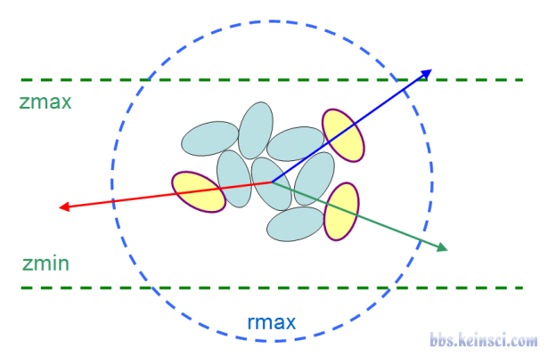

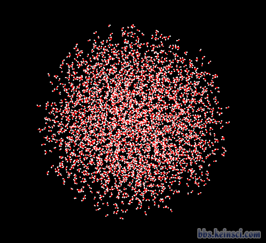

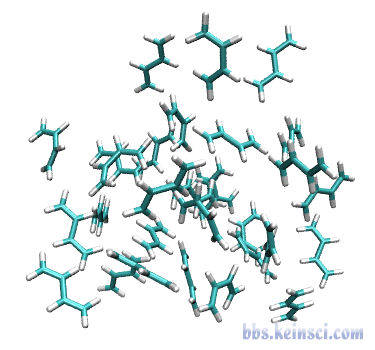

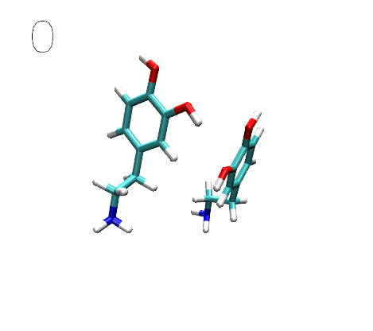

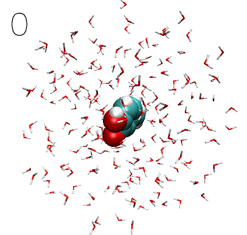

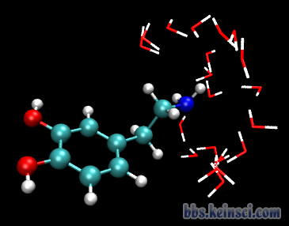

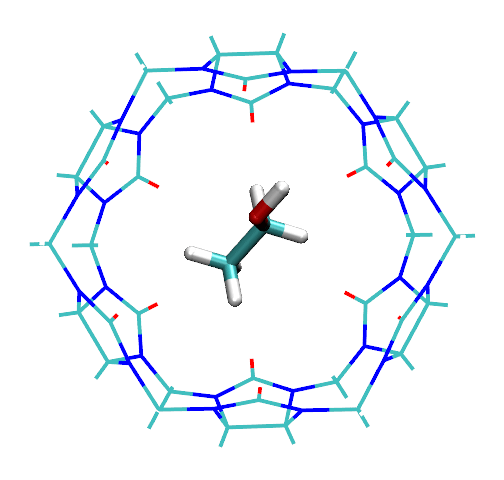

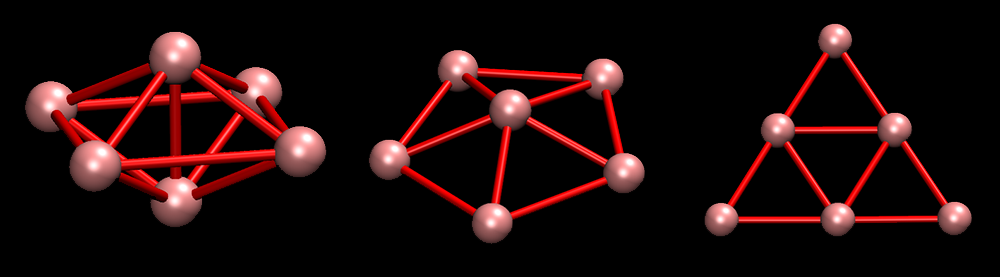

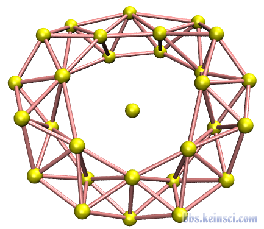

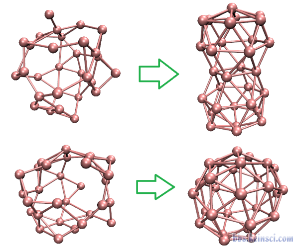

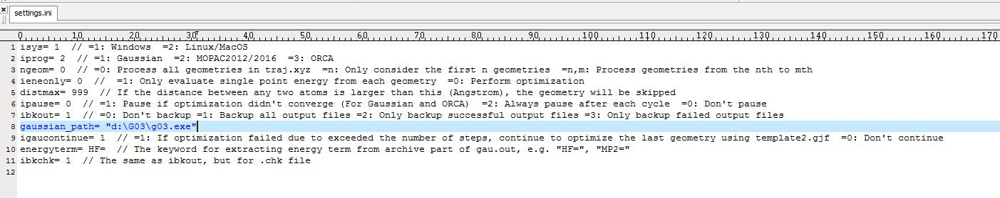

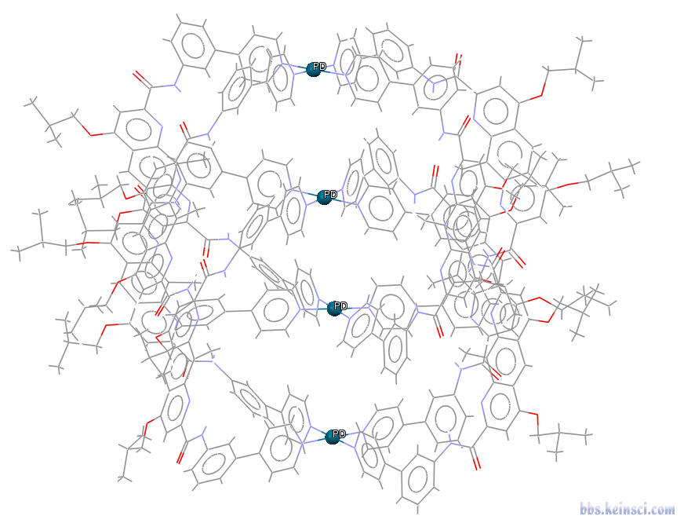

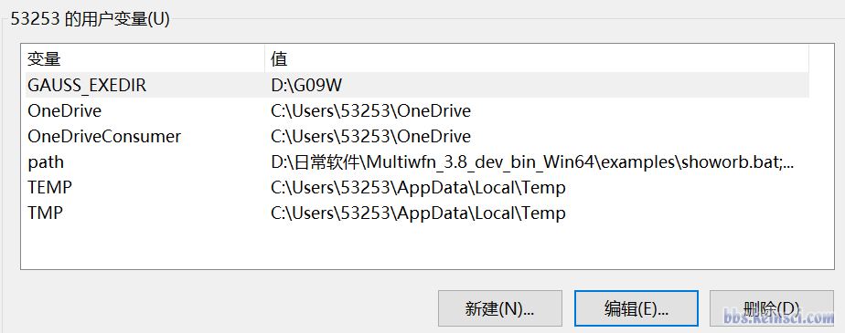

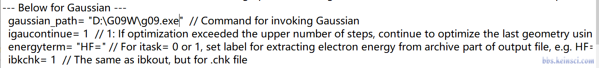

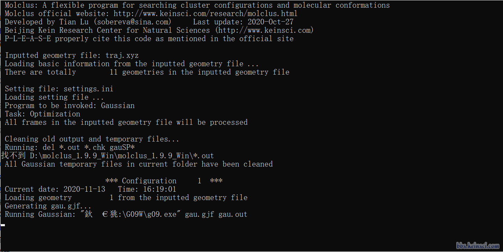

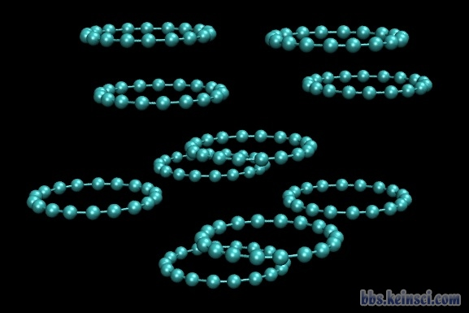
