# Thread 28147

- 原帖 URL：<http://bbs.keinsci.com/thread-28147-1-1.html>

## 楼层正文

### 1 楼（楼主）｜sobereva

使用Multiwfn做IGMH分析非常清晰直观地展现化学体系中的相互作用Performing IGMH analysis by Multiwfn to show interactions in chemical systems very clearly and intuitively

文/Sobereva@北京科音First releas: 2022-Mar-7  Last update: 2024-Oct-29

0 前言

目前已有不少将化学体系中的相互作用以图形化方式展现的方法，如NCI（也称RDG）、aNCI、IGM、aIGM、IRI、ELF、LOL、SCI、价层电子密度，等等，它们各具特点，其中一些已被广为使用。本文将全面介绍笔者近期提出的一种重要的图形化展现自定义片段间和片段内相互作用的方法，称为independent gradient model based on Hirshfeld partition (IGMH），这是对2017年提出的IGM方法的重要改良。此方法已经实现在了知名的波函数分析程序Multiwfn（http://sobereva.com/multiwfn）的最新版中。从本文给出的应用例子读者将会看到，IGMH在展现化学体系中的相互作用方面极其灵活和方便，图像效果非常理想，普适性特别强，有极高的实用价值。

IGMH方法的非常详细的介绍文章已经发表如下，非常欢迎读者们阅读

Tian Lu, Qinxue Chen, Independent gradient model based on Hirshfeld partition: A new method for visual study of interactions in chemical systems, J. Comput. Chem., 43, 539-555 (2022) https://doi.org/10.1002/jcc.26812

此文可以通过此链接直接免费阅览：

https://onlinelibrary.wiley.com/share/author/H659SPFCDKPCSJUVG5YT?target=10.1002/jcc.26812

使用Multiwfn做IGMH分析发表文章时，既需要引用Multiwfn启动时显示的Multiwfn原文，也需要同时引用上面这篇IGMH原文（另：之前已经有大量Multiwfn用户使用IGMH方法的前身IGM发表了共约200篇研究文章。以后如果读者仍使用IGM功能发表文章的话，除IGM和Multiwfn原文外也请引用以上文章，其中对IGM方法以及笔者对IGM的扩展做了系统性的介绍，文中还给出了IGM在Multiwfn中的实现细节）。

2022-Oct-27补充：后来笔者写了一篇对IGMH原文里一个实现细节的勘误文章，并做了相关理论分析，见ChemRxiv (2022) DOI: 10.26434/chemrxiv-2022-g1m34（https://doi.org/10.26434/chemrxiv-2022-g1m34）。建议此文和上述IGMH原文一并引用。

另：《一篇最全面介绍各种弱相互作用可视化分析方法的文章已发表！》（http://sobereva.com/667）和《Angew. Chem.上发表了全面介绍各种共价和非共价相互作用可视化分析方法的综述》（http://sobereva.com/746）介绍的两篇笔者的综述文章中对IGMH有极其充分的介绍并给了大量应用例子，强烈建议阅读并非常欢迎引用！

下文将对IGMH的各个方面进行介绍，包括以下内容

第1节：对IGMH的基本原理做简要说明，使读者快速了解此方法的思想

第2节：给出IGMH用于各类体系的效果展示，使读者明白IGMH分析都能以什么方式研究什么问题

第3节：将IGMH和IRI、NCI、IGM方法进行对比，便于读者了解什么时候适合用什么图形化分析方法

第4节：对Multiwfn中的IGMH功能和所需的输入文件等方面进行说明

第5节：给出使用Multiwfn做IGMH分析的具体例子

第6节：对本文内容做总结

Multiwfn在化学键和弱相互作用分析上极为强大，有众多的功能，IGMH只是其中之一，各种方法汇总介绍见《Multiwfn支持的弱相互作用的分析方法概览》（http://sobereva.com/252）和《Multiwfn支持的分析化学键的方法一览》（http://sobereva.com/471）。在相关 Multiwfn 与波函数分析教程（[已省略培训课程链接]）里笔者也会做非常全面、系统性的讲解。很值得一提的是IRI是笔者提出的另一种相互作用图形化分析方法，已被很多文章使用，介绍见《使用IRI方法图形化考察化学体系中的化学键和弱相互作用》（http://sobereva.com/598），它和IGMH的用处既有共性又有互补性，这在后文将会看到。

1 IGMH的原理简介

IGMH的详细介绍请读者仔细阅读前述的IGMH方法的原文，本节只是把关键信息做简要说明。

1.1 IGMH和IGM方法对相互作用区域的展现

IGMH的基本思想和其前身IGM是共通的，都是使用三维函数δg来把原子间相互作用区域直观展现出来。为了便于说明，我们首先看一个最简单的情况，氢气分子H2。在H-H键轴上，两个氢的电子密度曲线图如下图(a)所示

1.png (100.01 KB, 下载次数 Times of downloads: 251)

下载附件 Download

2022-3-7 08:00 上传 Uploaded

上图(b)中的黑色曲线对应的g代表gradient，是两个H原子电子密度梯度之和。在两个H正中央g精确为0，这是因为在此处两个H的电子密度梯度大小相同但符号相反，正好抵消了。上图(b)中的绿色曲线对应的g_IGM是IGM（independent gradient model，独立梯度模型）型电子密度梯度，相当于两个H原子的电子密度梯度的绝对值加和，因此不会因为符号差异而出现相互抵消，仿佛两个原子是彼此“独立”的。显然g_IGM是g的上限。上图(b)中的蓝色曲线是δg，对应于g_IGM减去g。由图可见在差不多X=1.2埃处，δg达到了极大点。δg在原子间相互作用区域能有这么个峰出现，来自于两个原子的密度存在重叠，也暗示原子间相互作用的存在。在分子的平衡结构下，原子间密度重叠越大，这个峰往往越高，也暗示出原子间相互作用越强因而使得原子间距离越近。如果俩原子间都没有可查觉的相互作用，g和g_IGM就不会有差异，δg也就不会出现峰。

上图(b)中画了一个Y=0.2的虚线，和δg的交点用黑色箭头标注了。这体现出，对这个体系，若把δg绘制成等值面图，在0.2等值面数值（isovalue）的情况下就会出现一个等值面，包裹的区域就是上图中两个箭头之间的区域。可见δg函数的等值面可以用来把原子间存在明显相互作用的区域图形化展示出来，而且等值面数值取得越小，越弱的相互作用区域就越可能也出现相应等值面。而等值面数值取得较大时，则只会有较强的相互作用区域被展现出来。

上面给出的情况是一维情形，实际研究的当然都是三维情况。对于三维情况以如下方式定义g、g_IGM和δg。粗体r是坐标矢量，i循环所有原子，| |符号代表取里面矢量的模，▽是矢量微分算符，ρ_i代表i原子的电子密度。

2.png (10.3 KB, 下载次数 Times of downloads: 231)

下载附件 Download

2022-3-7 08:01 上传 Uploaded

δg可以展现当前体系中所有原子间的相互作用。为了能专注于展现特定片段间（interfragment）和片段内（intrafragment）的相互作用，可分别定义δg_inter和δg_intra，如下所示。其中A循环用户定义的各个片段

3.png (14.65 KB, 下载次数 Times of downloads: 253)

下载附件 Download

2022-3-7 08:01 上传 Uploaded

IGM和IGMH方法不仅能展现相互作用区域，还能将sign(λ2)ρ函数通过不同颜色投影到δg、δg_inter、δg_intra的等值面上展现相互作用类型和强度。λ2是电子密度Hessian矩阵第二大本征值，sign()是取符号的意思。相互作用区域里某个位置的λ2若小于0体现出在此处原子间有吸引作用，大于0则体现互斥作用（但这只是个对多数相互作用区域适用的粗糙的、经验性的判据，切勿教条化理解）。ρ是当前体系实际电子密度，在相互作用区域此值越大暗示相互作用越强。sign(λ2)和ρ相乘得到的sign(λ2)ρ显然有能力对相互作用类型和强度进行区分。在IGMH原文里笔者给出了下图，可以作为IGMH图中sign(λ2)ρ的标准着色方式，不同颜色对应的常规解释也都给出了

4.png (85.58 KB, 下载次数 Times of downloads: 352)

下载附件 Download

2022-3-7 08:01 上传 Uploaded

1.2 IGMH与IGM的差异

以上内容对于IGM和IGMH来说都是完全相同的，这两种方法关键的不同在于原子的电子密度ρ_i怎么定义。IGM方法我之前在《通过独立梯度模型(IGM)考察分子间弱相互作用》（http://sobereva.com/407）和《使用Multiwfn结合CP2K通过NCI和IGM方法图形化考察固体和表面的弱相互作用》（http://sobereva.com/588）专门介绍过。IGM直接用原子在孤立状态下的球对称化的电子密度当做式中的ρ_i，分布仅由元素决定而不体现实际化学环境影响。这么做的好处是计算起来很快，在高效的Multiwfn中算几千个原子都能做到，而且只需要提供体系的坐标和元素信息就能做IGM分析，因为各种元素原子的球对称化的电子密度分布在Multiwfn程序中是直接内置的。但代价是，IGM的物理意义不严格，原子密度分布没有体现体系的实际电子结构，而且最关键的是，往往图像效果烂。如后文示例可见，IGM图中δg和δg_inter函数的等值面往往特别肥厚，不仅丑陋，还经常延伸到距离原子核较近因而电子密度较大的位置，导致在根据弱相互作用区域sign(λ2)ρ的颜色判断时往往会高估作用强度。

为了解决IGM的这些问题，IGMH使用Hirshfeld原子空间划分的方式从体系实际的电子密度中划分出各个原子的电子密度，由于考虑了实际电子结构和化学环境，从物理意义上就比IGM强。这个改进还同时使得IGM等值面太肥厚的问题被理想地解决，IGMH方法的δg/inter/intra等值面总是比较薄且美观，能够纯粹地展现出相互作用区域的特征。IGMH的实现细节在IGMH原文2.2节有具体说明，本文就不再过多叙述了。IGMH和IGM还有个差异在于，IGMH分析中用的sign(λ2)ρ是基于实际电子密度计算的，而IGM分析中的sign(λ2)ρ是基于粗糙的准分子（promolecular）密度算的，准分子密度只是各个原子孤立状态电子密度的简单叠加，没有体现原子间相互作用对电子密度的改变。

由于IGMH要基于实际电子密度做分析，因此输入文件必须包含波函数信息，这需要做量子化学或第一性原理计算得到。另外，IGMH计算形式比IGM更为复杂，计算量更大。显然，做IGMH分析的总耗时是明显高于IGM的。不过以如今主流的几十核双路服务器的计算能力来说，IGMH分析用于几百个原子体系完全没问题。所以，除非真是碰到巨大体系用IGMH确实算不动，否则*强烈*不建议用IGM，而总应当用IGMH。实际上，整个IGM/IGMH分析流程中真正最耗时的是体系的几何优化（一般都是用DFT方法），IGMH和IGM分析本身的耗时通常只占几何优化的零头。从这个角度来说，IGM和IGMH分析能处理的体系尺度并没有实质性区别（除非你用很便宜的分子力场或半经验层面的方法做几何优化，此时的IGM、IGMH分析的准确性无疑会打一定折扣）。

1.3 定量化分析原子和原子对对相互作用的贡献

为了能让IGMH在分析片段间相互作用时也能做一些定量分析讨论，笔者定义了一些指数，它们对于IGM也是同样适用的。

原子对δg指数（atomic pair δg index）记为δG_pair，定义如下。其中A和B是要被考察相互作用的两个片段，i和j分别是两个片段中的原子

5.png (13.09 KB, 下载次数 Times of downloads: 229)

下载附件 Download

2022-3-7 08:01 上传 Uploaded

原子对的δG_pair(%)定义为它的δG_pair占两个片段间所有δG_pair总和的百分比，可以粗略体现原子对对片段间相互作用的贡献程度。

原子δg指数记为δG_atom，它可以衡量各个原子对片段间作用的贡献程度，其定义如下，其中i是一个片段里的原子，j循环另一个片段里的所有原子。相应地还可以定义δG_atom(%)用于衡量某原子对片段间作用贡献的百分比。

6.png (9.57 KB, 下载次数 Times of downloads: 239)

下载附件 Download

2022-3-7 08:01 上传 Uploaded

上面这些指数很有实用性，可以使研究者快速判断哪些原子或原子对对片段间结合起到主要作用。但毕竟这些指数只是以较为简单方式定义的，并没有充分考虑物理层面的因素，因此不要指望能和片段间相互作用能会有太密切联系。它们只适合粗略判断哪些原子和原子对较为重要、比较值得关注。如果要从相互作用能角度考察原子间相互作用的话，可以用《使用Multiwfn做基于分子力场的能量分解分析》（http://sobereva.com/442）里介绍的EDA-FF方法，在《18碳环（cyclo[18]carbon）与石墨烯的相互作用：基于簇模型的研究一例》（http://sobereva.com/615）一文中也有其应用实例。

2 一些典型的IGMH分析结果展示

这一节展示一些IGMH图，以令读者对IGMH有直观的认识、充分了解其重要实用价值。图片都来自IGMH原文，原文里面有详细的说明和讨论，这一节里笔者对每个例子只是简单地提几句。这些图用的sign(λ2)ρ的色彩刻度基本都和前文1.1节给出的一致，有些图为了颜色更便于观察，将色彩刻度下限和上限做了适当的调节。为了图像效果尽可能好，这些图的等值面数值都经过反复调节，选取了最能充分、清楚展现感兴趣的相互作用的值。所有结构都用恰当的级别做过几何优化。

我们先看一系列片段间弱相互作用分析例子，这也是IGMH分析最常用的情况。下图是dodecaphenyltetracene体系的IGMH和IGM的sign(λ2)ρ着色的δg_inter等值面图，每个苯基片段定义为一个片段。在IGMH图中相邻苯基间有绿色大面积扁片，基本平行于苯环，这是典型的pi-pi堆积特征。pi-pi堆积作用特征都是作用面积大，而作用区域电子密度很低。关于pi-pi堆积更多知识看《全面探究18碳环独特的分子间相互作用与pi-pi堆积特征》（http://sobereva.com/572）。IGMH图将当前这个侧链很拥挤的分子中的重要的弱相互作用十分清楚地展现了出来，而下图中的IGM图的效果就远不如IGMH了，如粉色箭头所指，个别地方出现了很诡异的颜色。这就是因为前面说的IGM图经常存在的问题，由于等值面太肥厚，导致它延展到了距离原子核较近因而电子密度较高的区域，这显然会对弱相互作用特征造成严重的误判。

7.jpg (160.79 KB, 下载次数 Times of downloads: 256)

下载附件 Download

2022-3-7 08:03 上传 Uploaded

18碳环是几何和电子结构都很奇特的体系，近些年有大量理论研究文章出现，笔者也做了大量理论研究，汇总见http://sobereva.com/carbon_ring.html。有一篇他人的研究工作涉及的体系是将18碳环置入一个[12]CPP大环分子里，当时其作者还用Multiwfn做了IGM分析。将这个体系里18碳环和[12]CPP分别定义为两个片段绘制的IGMH和IGM图如下所示。其中IGMH图里为了令原子对片段间结合的贡献能够直观展现，令原子按照δG_atom值进行了着色，色彩刻度条也在图中给出了。由此图可见，IGMH图非常好地展现出18碳环与[12]CPP之间大面积的色散作用主导的主要相互作用区域，而且图中绿色和棕色把[12]CPP与18碳环相互作用最显著的原子清晰地高亮了出来。IGM图就差远了，由于其过于肥厚的等值面，导致图中虚线标注的区域出现了错误的着色，令人误以为这地方有特殊的相互作用（这个体系研究文章原作者根据IGM图做的结论是The regions colored in blue, on the other hand, reflect a rather different type of interaction，明显是被IGM方法误导了！）。

8.jpg (108.67 KB, 下载次数 Times of downloads: 244)

下载附件 Download

2022-3-7 08:04 上传 Uploaded

下图是AT碱基对和碘代AT碱基对的IGMH和IGM图，两个单体各自定义为一个片段。可见IGMH图很好地将AT碱基对之间两个氢键作用区域展现了出来。对于AT，N...H-N和N-H...O的等值面中心都呈蓝色，因此都是比范德华作用明显更强的吸引作用，结合体系结构可判断这显然是典型的氢键，而由于前者的蓝色要比后者深得多，可以认为N...H-N氢键明显比N-H...O氢键更强。读者若根据笔者在《透彻认识氢键本质、简单可靠地估计氢键强度：一篇2019年JCC上的重要研究文章介绍》（http://sobereva.com/513）中介绍的文章里提出的基于atoms-in-molecules (AIM)理论的判断氢键强度的方法来考察，也会得到同样的结论。AT的图中C-H...O之间有很小的绿色等值面，说明其作用区域电子密度很低，明显这只能算是色散吸引为主的很弱的作用，远达不到一般氢键的强度。在碘代AT碱基对的图中可看到N和I之间的等值面呈现蓝色，这展现出明显的静电作用主导的卤键作用。其它的色散作用主导的相互作用区域在此图中也能清清楚楚地看出来。IGMH图中还标注了几个原子对的δG_pair(%)值，以此体现它们对碱基之间结合的贡献比例。可见给出的数值很能说明问题，其中最大的正是N...I原子对，贡献34.6%，而其它几个原子对的贡献也不容忽视（还是要强调，这个百分比只能粗略体现重要性的高低，切勿当成对作用能的贡献来分析讨论一番）。下图还给了IGM图，可见远不如IGMH图好看，等值面不仅太鼓，还有着色不合理的区域出现（如粉色箭头所指）。此外，IGM图上两个氢键和一个卤键的作用区域颜色都是深蓝色，作用强度差异都难以靠颜色区分。

9.jpg (117.02 KB, 下载次数 Times of downloads: 258)

下载附件 Download

2022-3-7 08:04 上传 Uploaded

下图是一个三重联锁共价有机笼体系，由两个四面体笼嵌套构成，要想分离两个单体需要破坏共价键才行。IGMH分析中将两个单体各做为一个片段。下面(a)图是IGMH着色等值面图，(b)图是将原子按照δG_atom进行着色的图。可见IGMH将两个单体之间色散主导的作用区域，特别是两个分子中央的pi-pi堆积区域充分展现了出来，这也验证了这个体系的合成者在其原文里基于几何结构对pi-pi堆积存在性所作的推断。显然，光从几何结构上凭经验和感觉去分析分子间相互作用，远不如做个IGMH分析直观、严格、有说服力。从δG_atom着色图上可以进一步看出，对两个单体相互作用贡献最大的就是pi-pi堆积涉及的那些原子，其次是周围的原子，而整个体系顶端和底端蓝色区域原子的δG_atom几乎为0，因此对结合的重要性相对很低，这也是因为它们距离另一个单体原子相对较远。

10.jpg (147.93 KB, 下载次数 Times of downloads: 264)

下载附件 Download

2022-3-7 08:04 上传 Uploaded

笔者之前写过《使用量子化学程序基于簇模型计算金属表面吸附问题》（http://sobereva.com/540），专门讲怎么用量子化学程序基于金属的簇模型考察金属表面吸附。这类表面吸附体系也非常适合用IGMH考察吸附作用。下图是Ag(111)表面吸附苯分子的IGMH、IGM和NCI图，在IGMH和IGM分析中苯分子和Ag簇分别定义为两个片段。在IGMH图中，还按照《使用Multiwfn+VMD快速地绘制高质量AIM拓扑分析图（含视频演示）》（http://sobereva.com/445）的做法把金属和苯之间的键临界点（BCP，图中的桔黄色圆球）和相应的键径（图中棕色细线）也同时画了出来，并把BCP位置的电子密度和能量密度标了出来。此外，还对金属原子根据δG_atom(%)进行了着色。从IGMH图上可明显看出苯和Ag之间有色散主导的大面积物理吸附作用区域，对吸附贡献最大的Ag原子就是苯下面正对着的三个。对于大面积的相互作用，AIM理论中的BCP没法将作用区域像IGMH或IRI等方法那样全面充分展现，但BCP出现的位置普遍被认为是相互作用区域中最具代表性的位置，因此将BCP的属性和IGMH或IRI等图形化分析方法相结合还是很有益的，可以将作用区域的特征定量展现，而键径则可以把原子间有代表性的相互作用路径给直观表现出来。不了解BCP、键径这些AIM相关概念的话看《AIM学习资料和重要文献合集》（http://bbs.keinsci.com/thread-362-1-1.html）。从下图可看到苯正好和下面与之作用最强的三个Ag之间有BCP和相应的键径，ρ_BCP的信息定量体现出作用区域的电子密度数值很低，而BCP处的能量密度（E）为正则体现出这个吸附作用的本质是非共价作用，这个判据在《Multiwfn支持的分析化学键的方法一览》（http://sobereva.com/471）中我专门介绍过。下图中的IGM图和之前的例子一样也是等值面太肥，不仅不好看，上面的蓝色区域还令人误以为作用区域电子密度其实不低。下图也给出了这个体系的NCI分析图，NCI方法在《使用Multiwfn结合CP2K通过NCI和IGM方法图形化考察固体和表面的弱相互作用》（http://sobereva.com/588）和《使用Multiwfn图形化研究弱相互作用》（http://sobereva.com/68）中我专门介绍过。下图的NCI图在吸附作用区域和IGMH图很类似，但是在Ag原子间出现了大量等值面，这些等值面虽然无害，但在视觉上妨碍我们考察真正感兴趣的吸附作用区域。

11.jpg (127.75 KB, 下载次数 Times of downloads: 253)

下载附件 Download

2022-3-7 08:05 上传 Uploaded

下图展示的是苄脒阳离子配体与胰蛋白酶之间的相互作用。实际计算时把配体和周围与之作用的残基挖了出来作为簇模型来计算，做法可参考《要善用簇模型，不要盲目用ONIOM算蛋白质-小分子相互作用问题》（http://sobereva.com/597）中的讨论。实际作图时，我还把整个蛋白质用New Cartoon方式显示出来便于观看骨架位置，涉及到的一些操作细节可参照《使用Multiwfn做aNCI分析图形化考察动态过程中的蛋白-配体间的相互作用》（http://sobereva.com/591）。下图(a)和(b)分别是等值面取0.006和0.002 a.u.时候的IGMH等值面图。可见(a)图清楚地把配体和周围残基间的氢键作用（粉色箭头所指）和明显的范德华作用（棕色箭头所指）都展现了出来。(b)图由于用了更小的等值面数值，使得更多区域更弱的相互作用也同时被展现了出来。可见通过等值面数值的不同选取，可以决定是否展现较为次要的相互作用。下图的(c)是NCI分析的图，可见虽然此方法也能展现出蛋白-配体的相互作用，但由于没法像IGMH那样定义片段，导致各种相互作用全都出现，包括配体内的和蛋白质残基之间的，因此图像看着很乱，有些我们感兴趣的等值面还被不感兴趣的等值面所遮挡，给讨论带来了很大麻烦。另外，NCI图对格点质量的敏感性远高于IGMH，当前NCI图和IGMH的格点间距是一样的，IGMH图里的等值面很平滑，而NCI等值面却有很多难看的锯齿。实际上此例用的格点质量已经挺高的了（格点间距为0.15 Bohr，已经很小了），虽然进一步减小格点间距会使得NCI图更光滑，但耗时也会剧增，因为计算量和格点间距的三次方呈反比。

12.jpg (221.16 KB, 下载次数 Times of downloads: 261)

下载附件 Download

2022-3-7 08:05 上传 Uploaded

IGMH分析不仅可以用于分子，也可以用于周期性体系。例如下图是Multiwfn基于CP2K第一性原理程序对冰计算的周期性波函数得到的IGMH图，任意选取的一个水和其它的水分别被定义为两个片段。可见中间的水与周围的水之间的四个氢键被蓝色的等值面展现得非常清楚。

13.jpg (50.34 KB, 下载次数 Times of downloads: 234)

下载附件 Download

2022-3-7 08:05 上传 Uploaded

下图通过IGMH展现了沸石与其中吸附的甲苯之间的相互作用，沸石和甲苯各定义为一个片段，结构使用CP2K做优化得到。由图可见甲苯与周围的沸石原子有大面积的相互作用。由于等值面都是绿色，说明吸附是色散作用主导的物理吸附。

14.jpg (170.02 KB, 下载次数 Times of downloads: 238)

下载附件 Download

2022-3-7 08:05 上传 Uploaded

下图通过IGMH展现了一种多孔共价有机框架化合物（COF）的层间相互作用。可见两层之间有无限延展的大面积的绿色等值面，无疑说明这种COF层间靠广阔的pi-pi堆积作用相结合。由图也可以看到等值面在晶胞边缘处被合理地截断，也体现出Multiwfn中的IGMH可以完美地考虑周期边界条件。

15.jpg (111.49 KB, 下载次数 Times of downloads: 267)

下载附件 Download

2022-3-7 08:05 上传 Uploaded

前面的例子主要是通过IGMH展现弱相互作用，而实际上IGMH对于很强的，甚至化学键程度的作用也同样可以很好地展现。例如下图是冠醚衍生物结合锂离子形成的体系，IGMH分析时将锂离子和冠醚定义为两个片段，由图可见确实IGMH图将锂离子与周围带负电的氧之间的高度离子性相互作用区域很好地展现了出来。另外，此图里还把键临界点和键径一起画了出来，每个临界点的电子密度都在图上给出了，通过这些数据便于定量讨论不同的氧与锂离子作用强度的差异。这有明显益处，毕竟光是从等值面颜色上判断容易有视觉误差、颜色差异较小时难以从视觉上区分，而且看到的颜色还多多少少受可视化程序里光源设置的影响。

16.jpg (58.4 KB, 下载次数 Times of downloads: 229)

下载附件 Download

2022-3-7 08:05 上传 Uploaded

下面的例子是四(三甲基甲硅烷基)四面体体系。下图左上角是此分子的范德华球叠加图，可见这个体系相当拥挤，甲基之间距离很近，理应有明显的范德华作用。对这个体系做IGMH分析时将体系中央的四面体C4部分作为一个片段，上面连接的所有基团作为另一个片段。下图(a)里面给出了IGMH的δg_inter为0.05时的填色等值面图，由于当前等值面数值取得比较大，因此只有两个片段间比较强的相互作用被展现了出来，即C-Si共价键作用区域。当δg_inter等值面数值设小到0.003时，如下图左下角的图所示，甲基之间的范德华作用区域也被展现了出来，但这个时候C-Si键对应的等值面就显得很肥胖，不好看了。前面例子里主要都是分析片段间作用，而下图里还给出了δg_intra为0.1的填色等值面图，用以展现片段内相互作用。可见两个片段内的C-C键、C-Si键、C-H键作用都被蓝色的等值面所展现出来了，蓝色也体现出成键区域电子密度是很大的，这是共价键作用区域的共性（此图的sign(λ2)ρ色彩刻度范围设的是-0.2到0.2 a.u.，蓝色体现出那部分区域的电子密度肯定>=0.2 a.u.）。值得一提的是，对应化学键的等值面周围有一圈红色，这没有明确的物理意义，没必要关注和予以解释。下图的(b)图给出的是sign(λ2)ρ着色的IRI等值面图，可见一张图就把弱相互作用和化学键作用区域同时清楚地展现了出来，C4中的三元环里的强烈的位阻区域也被图中央的红色等值面部分所展现。可见IRI和IGMH各有各的价值，IRI分析虽然没法分片段分析，但能够在一张图里把各种强度的相互作用同时充分展现出来，这是IGMH分析做不到的。

17.jpg (217.07 KB, 下载次数 Times of downloads: 260)

下载附件 Download

2022-3-7 08:06 上传 Uploaded

下图是P4和Li6两种原子团簇结构。这回我们不划分片段，直接用sign(λ2)ρ着色的δg函数来展现体系中的所有相互作用。从下图左上角的IGMH方法的δg图上可以看到P-P化学键区域（等值面为蓝色的部分），以及三个P之间的环形位阻区域和四个P之间的笼形位阻区域（等值面为红色的部分），都被正确地展现了出来。IGM方法的δg函数的图在下图也给出了，可见效果较烂，位阻作用区域描述得乱七八糟，而且本来四面体笼状结构有很强的笼张力，成键区域的电子理应往外凸才对，结果图中描述化学键的蓝色等值面主体出现区域却反倒相对于P-P键轴往里收缩，可见IGM方法在此例表现得很差。下图右上角是P4的IRI图，可见它虽然和IGMH的δg图有异，但也把各种特征作用区域理想地展现了出来，而且相对来说IRI的图还显得更简单干净一些。

18.jpg (118.6 KB, 下载次数 Times of downloads: 256)

下载附件 Download

2022-3-7 08:06 上传 Uploaded

上图的Li6体系边缘的三个Li之间存在明显的三中心键作用，这通过Multiwfn中的大量分析手段都能很好地展现出来，包括电子定域化函数（参看《ELF综述和重要文献小合集》http://bbs.keinsci.com/thread-2100-1-1.html里的相关文章和我写过的大量相关博文）、定域化轨道（见《Multiwfn的轨道定域化功能的使用以及与NBO、AdNDP分析的对比》http://sobereva.com/380）、变形密度图（见《使用Multiwfn作电子密度差图》http://sobereva.com/113）、多中心键级（见《衡量芳香性的方法以及在Multiwfn中的计算》http://sobereva.com/176）、AdNDP（见《使用AdNDP方法以及ELF/LOL、多中心键级研究多中心键》http://sobereva.com/138）等等等等，以及笔者在DOI: 10.3866/PKU.WHXB201709252一文中提出的价层电子密度分析方法。上图右下角给出了价层电子密度图，可见边缘三个Li之间的价层电子密度显著高于中间三个Li之间的，因此有对应于三中心键的等值面出现。IGMH的δg图也完全正确地反映出了三中心键的存在。而上图中的IGM的δg图则对成键方式给出了完全错误的描述，在中心的三个Li之间也给出了明显的等值面，这明显会误令人以为这个地方也同样有三中心键出现。IGM之所以出现这么严重的错误正是在于IGM方法只是基于几何结构做的分析，没有像IGMH那样考虑实际电子结构。

下图出自《8字形双环分子对18碳环的独特吸附行为的量子化学、波函数分析与分子动力学研究》（http://sobereva.com/674）介绍的笔者的Phys. Chem. Chem. Phys., 25, 16707 (2023)文章，绿色的δg_inter=0.002 a.u.等值面非常鲜明地展现出了OPP主体分子对C18客体分子吸附后的相互作用的主要出现区域。与此同时，各个原子对相互作用能的贡献通过《使用Multiwfn做基于分子力场的能量分解分析》（http://sobereva.com/442）里介绍的方法通过对原子着色进行了直观展现。

C18_OPP_IGMH.png (257.74 KB, 下载次数 Times of downloads: 232)

下载附件 Download

2023-7-1 05:27 上传 Uploaded

下图出自《全面揭示各种碳环与富勒烯之间独特的pi-pi相互作用！》（http://sobereva.com/727）介绍的笔者的Chem. Eur. J., 30, e202402227 (2024)文章，绿色和青色的δg_inter等值面分别非常生动地展现出了富勒烯与碳环分子间，以及碳环与碳环间的pi-pi作用。这些图充分展现了富勒烯与不同尺寸的碳环形成的弱相互作用的共性和差异，效果好极了！笔者也非常推荐仔细阅读这篇文章，内容很有意思。

C60_Cring.jpg (337.33 KB, 下载次数 Times of downloads: 211)

下载附件 Download

2024-10-29 00:32 上传 Uploaded

《深入探究18碳环与碱金属离子复合物的结构、相互作用与光学性质》（http://sobereva.com/745）介绍的笔者的研究文章ChemPhysChem, 26, e202500009 (2025)使用IGMH展现了不同碱金属离子与18碳环结合时的相互作用特征，能充分体现出差异，十分推荐进入此博文阅读。

C18M .png (230.85 KB, 下载次数 Times of downloads: 148)

下载附件 Download

2025-9-1 15:44 上传 Uploaded

3 该选择什么方法图形化展现相互作用？

肯定有不少读者之前也都用过Multiwfn做过NCI、IGM、IRI分析，他们都是重要的图形化分析方法。我觉得很有必要专门说一下怎么选用。最完整详细的介绍和讨论见《一篇最全面介绍各种弱相互作用可视化分析方法的文章已发表！》（http://sobereva.com/667）和《Angew. Chem.上发表了全面介绍各种共价和非共价相互作用可视化分析方法的综述》（http://sobereva.com/746）里介绍的文章。

• IGMH：如果你的目就是分析特定片段间或片段内的相互作用，很明确地知道片段该怎么定义，那么IGMH绝对是最理想的选择。从上一节的大量例子可看出，IGMH对各类体系表现得都很理想，图像很美观。

• IRI：如果你想将体系中所有相互作用（不分类型和强弱）在一张图里同时展现出来，肯定要用IRI，这在上文的几个例子里已经有所体现。更多的例子和介绍见《使用IRI方法图形化考察化学体系中的化学键和弱相互作用》（http://sobereva.com/598）以及IRI原文Chemistry—Methods, 1, 231 (2021) DOI: 10.1002/cmtd.202100007。另外，IRI还有个重要优点是可以很好地展现出化学反应过程中化学键和弱相互作用的变化和过渡，还可以做成生动的动画予以动态展现，这在IRI介绍文章里都给出了，一定记得看。此外，IRI还有个变体IRI-pi，对于专门研究pi电子作用极有用处，在上文以及《在Multiwfn中单独考察pi电子结构特征》（http://sobereva.com/432）中都提到了。

• IGM：有了图像效果好得多且物理上更严格的IGMH后，在《通过独立梯度模型(IGM)考察分子间弱相互作用》（http://sobereva.com/407）中介绍的IGM基本就不用再考虑了。IGM仍有点用处的地方也就是这几个：(1)分析巨大体系时出于耗时考虑不得不用IGM (2)仅仅是想很粗略、快速地预览一下片段间弱相互作用出现的区域 (3)有坐标文件，但由于特殊情况不方便得到用于IGMH分析的波函数文件。

• NCI：2010年提出的NCI方法专门用来图形化展现弱相互作用，流行程度很高，Multiwfn用户做NCI分析发表的文章到目前为止大概得有2000篇了。而有了IGMH和IRI后，NCI就基本没用了。IRI比NCI能展现更丰富的信息，尤其是能同时展现出强相互作用。而IGMH由于能自定义片段，比NCI方便灵活太多了，避免了无关区域的等值面妨碍分析，而且IGMH不需要特别精细的格点就能得到较平滑的等值面，从这个角度来说IGMH比NCI耗时还更低，这些在上文的蛋白-配体作用分析例子上都体现了。除此之外，IGMH还能额外给出原子和原子对的定量指标体现它们对相互作用的贡献。所以，若无特殊理由就没必要再用NCI了。

再顺带提一下，IRI、IGMH这样的图形化分析方法和极其流行的AIM理论基于临界点方式的拓扑分析不仅不冲突，还有很强互补性。IRI和IGMH长处是直观、定性分析，而AIM拓扑分析的长处是在定量层面上讨论，可以给你相互作用区域最有代表性的点的各种属性，根据这些属性能做大量分析讨论，在《Multiwfn支持的分析化学键的方法一览》（http://sobereva.com/471）里有很多介绍。此外，AIM理论里的键径可以把原子间最有代表性的相互作用路径描绘出来，光从图形展示的层面上来讲也是有益的。还值得一提的是，有些相互作用只能靠IRI、IGMH等图形分析方法来展现，例如很多体系中明显的内氢键找不到对应的键临界点，因此无法靠AIM拓扑分析来研究，这个问题在IRI原文2.4节里有深入讨论。

4 Multiwfn中的IGMH分析功能

如果你不了解Multiwfn的话，强烈建议看《Multiwfn入门tips》（http://sobereva.com/167）和《Multiwfn FAQ》（http://sobereva.com/452）了解相关常识性知识。做IGMH分析一定要用2022年2月及之后更新的Multiwfn版本。绘制IGMH填色等值面图需要结合免费的VMD程序，可以在http://www.ks.uiuc.edu/Research/vmd/下载，目前强烈建议用VMD 1.9.3版（切勿用bug奇多的1.9.4非正式版）。

在Multiwfn中做IGMH分析非常简单，通常就是以下步骤，这里简要提一下，具体细节看后文的例子

(1)启动Multiwfn，载入波函数文件，进入主功能20的子功能11

(2)输入片段总数，以及每个片段包含的原子序号

(3)设置格点。格点涵盖的范围要至少包含感兴趣的等值面出现的区域。格点间距越小，等值面会越平滑、图像效果越好，但计算耗时越高。关于设定格点的常识性知识看《Multiwfn FAQ》（http://sobereva.com/452）里的Q39。

(4)Multiwfn开始对每个格点计算δg、δg_inter、δg_intra、sign(λ2)ρ这些函数。耗时和体系大小、基组大小、格点数、CPU性能有关。Multiwfn的这部分功能做了充分的并行化，计算量大的情况应当在较好服务器CPU上算，并且记得把settings.ini里的nthreads参数设为CPU实际物理核心数。

(5)计算完毕后出现了后处理菜单，之后：

• 如果要计算δG_pair、δG_atom等前面提到的指数，就选选项6，然后这些指数就会输出到屏幕上提示的文本文件里。还同时可以输出atmdg.pdb，在VMD里基于它就可以对原子着色来展示原子的δG_atom或δG_atom(%)值

• 如果要绘制IGMH等值面图，就选择选项3，将δg、δg_inter、δg_intra、sign(λ2)ρ函数的格点数据导出为各自的cub文件。之后结合Multiwfn文件包里提供的VMD作图脚本IGM_inter.vmd和IGM_intra.vmd就可以分别得到sign(λ2)ρ着色的δg_inter和δg_intra等值面图

如果你之前已经会用Multiwfn做IGM分析，那么IGMH都不用学，因为IGMH和IGM分析操作上的差异仅仅在于进入主功能20之后选主功能11还是10，以及输入文件是否含有波函数信息，其它地方都是完全相同的。

只要是Multiwfn可识别的含有波函数信息的文件都可以当IGMH分析的输入文件。比如wfn、wfx、fch、mwfn、molden等等格式的文件都可以用，主流的量子化学程序如Gaussian、ORCA、GAMESS-US、xtb等至少可以产生其中的一种，读者可参看《详谈Multiwfn支持的输入文件类型、产生方法以及相互转换》（http://sobereva.com/379）里的详细说明，怎么用主流程序产生这些文件在文中也都写明了。如果是研究周期性体系，应当用CP2K产生molden格式的波函数文件，并且需要自行把晶胞信息加入到此文件里，详见《使用Multiwfn结合CP2K通过NCI和IGM方法图形化考察固体和表面的弱相互作用》（http://sobereva.com/588）里的相关说明。

做IGMH分析用的波函数不需要用昂贵的级别产生，用一个对当前体系适合的DFT泛函，结合一个不低于2-zeta档次带极化函数的基组就够了。可见这对计算级别的要求和几何优化相仿佛，因此通常就用几何优化最后顺带产生的波函数做IGMH分析就可以了。对于Gaussian用户，一般用B3LYP-D3(BJ)/6-311G*就可以。对于ORCA用户也可以用这个级别，但用B97-3c或r2SCAN-3c方法明显更划算，不了解这俩方法的话看《详谈Multiwfn产生ORCA量子化学程序的输入文件的功能》（http://sobereva.com/490）中的叙述。对于CP2K用户，一般用PBE-D3(BJ)结合pob-TZVP基组或更便宜些的6-311G*就可以。

如果体系很大，用DFT优化结构太耗时，用xtb等程序通过很廉价的半经验层面的GFN-xTB方法做优化也可以。xtb产生的molden文件也可以用于IGMH分析，结果大多数情况可以接受，但是由于GFN-xTB级别的波函数质量还是明显比DFT要差，基于它做的IGMH图和基于DFT波函数得到的图还是有可查觉的差距。所以最好还是基于像样的半经验方法或GFN-xTB方法优化的结构，用DFT算个单点任务得到用于IGMH分析的波函数文件。

5 用Multiwfn做IGMH分析实例

5.1 对分子和周期性体系做IGMH分析的例子

极度详细、完整、图文并茂的使用Multiwfn对分子体系和周期性体系做IGMH分析的教程可以直接在http://sobereva.com/multiwfn/res/IGMH_tutorial.zip下载（此教程在IGMH原文里提到了，算是官方教程），所有涉及的文件在里面也都一并提供了。此教程多达40页，对IGMH分析的所有操作和要点都描述得特别细致，之前完全没有用过Multiwfn和VMD的读者肯定也能照着此教程顺利作出前文给出的各种各样体系的IGMH图。而且此文档里面还给出了前文没有举例的曲线图、平面填色图、sign(λ2)ρ与δg之间的着色散点图的绘制方法。

另外，《通过独立梯度模型(IGM)考察分子间弱相互作用》（http://sobereva.com/407）和《使用Multiwfn结合CP2K通过NCI和IGM方法图形化考察固体和表面的弱相互作用》（http://sobereva.com/588）里分别给了对分子体系和周期性体系做IGM分析的例子。读者只要把文中在主功能20里面选子功能10的地方替换成子功能11，并且改用含有波函数信息的文件作为输入，得到的就是IGMH分析结果了。因此如果看前面给的IGMH教程中有不理解的地方也可以同时参照这俩IGM教程。

VMD中的一些操作、设置对于IGMH分析和NCI分析是互通的，如果你按照上面的IGMH教程操作的时候在一些地方由于缺乏计算机基本常识、对描述的理解存在偏差等原因卡壳，那么也不妨看一下《使用Multiwfn做NCI分析展现分子内和分子间弱相互作用》（https://www.bilibili.com/video/av71561024）这个用Multiwfn结合VMD做NCI分析全流程的视频演示，仔细看过后之前做IGMH分析卡壳的地方可能也就明白了。

之前笔者写过《用Multiwfn+VMD做RDG分析时的一些要点和常见问题》（http://sobereva.com/291），里面有很多关于改进VMD里作图效果的讨论，对于在VMD中绘制IGMH填色等值面图也是同样适用的，建议读者看完前述教程后参考。

常有人问怎么IGMH图作完了发现上面没有等值面，这大概率是因为片段间相互作用很弱，而默认的等值面数值不够小所致的。把等值面的数值手动改小到比如0.005甚至0.003，肯定能看见。如果此时还看不见等值面，那就说明片段间的相互作用可以完全忽略了，片段间的距离应该很远。

5.2 基于簇模型利用IGMH分析考察分子晶体中的相互作用

这一节的目的是介绍如何便利地通过簇模型做IGMH分析考察分子晶体中的弱相互作用，这个例子在前述教程和相关博文里都没有，因此是对IGMH官方教程的一个补充。请读者务必先把前述教程看了再看本节的这个补充教程。做这一节的例子时，读者务必用2022年3月及以后更新的Multiwfn，否则例子中涉及的功能没有。

这里说的簇模型是指把晶体中的一个分子和与之有直接接触的一圈分子提取出来作为一个簇，中心分子和周围分子分别定义为IGMH分析的两个片段，这样分析结果就能完整展现晶体中的分子与周围环境分子的相互作用了。虽然基于CP2K计算产生的周期性波函数也能做分子晶体的IGMH分析，但使用簇模型来做有几个优点：

(1)计算只考虑中心分子和邻近的一圈分子，可避免计算更外围、和中心分子没直接作用的分子导致浪费计算量。而且由于此时的IGMH分析过程中不需要考虑周期性，计算耗时比考虑周期性时低得多

(2)避免更外围分子的结构显示在图中令图像混乱（虽然作为周期性体系分析时也可以在VMD中恰当设置来避免显示无关分子，但要多花费点步骤）

(3)不需要用第一性原理程序做周期性计算，而只需要用量子化学程序就可以做，因此对量子化学研究者们更方便

本节涉及到的各种文件都可以在http://sobereva.com/attach/621/file.rar里下载。这一节用的例子是尿素晶体，其cif文件是里面的urea.cif。我们将用Gaussian程序做量子化学计算。

首先要做的是基于晶体结构构造尿素团簇。这不需要自己先手动构造超胞，然后再从里面费劲地抠团簇，因为Multiwfn直接就提供了超级便利的一键产生“中心分子+临近一圈分子”的团簇结构的功能。启动Multiwfn，然后输入

urea.cif  //输入cif文件的实际路径

300  //主功能300

7   //几何相关操作。这部分的功能在《Multiwfn中非常实用的几何操作和坐标变换功能介绍》（http://sobereva.com/610）中有全面介绍和示例

25  //构造“中心分子+临近一圈分子”的团簇

1  //当前晶胞里1号原子所在的分子将被作为中心分子（由于尿素晶体里所有分子都是等价的，所以当前随便输入一个原子序号即可）

[回车]  //这代表若一个周围分子与中心分子间最近原子对距离小于这俩原子的范德华半径和的1.2倍，则这个周围分子就被整个纳入团簇

Multiwfn瞬间就构造出了团簇，从屏幕上的提示可看到这个簇有88个原子，并且屏幕上还巨贴心地把中心分子中的原子序号给了出来，当前为1-3,25,32-34,69。把这个序号记下来，之后IGMH分析时要用到。

现在可以选菜单中的选项0看一眼新构造出的团簇是什么样，如下所示，可见非常理想，确实是中心分子被周围一圈分子所围绕

19.jpg (96.6 KB, 下载次数 Times of downloads: 254)

下载附件 Download

2022-3-7 08:06 上传 Uploaded

点图形窗口右上角的RETURN按钮关闭窗口，然后选选项“-3 Output system to .gjf file”，再输入cluster.gjf，当前团簇结构就保存为了当前目录下的cluster.gjf，这是Gaussian的输入文件格式。Multiwfn现在可以关了。

如《实验测定分子结构的方法以及将实验结构用于量子化学计算需要注意的问题》（http://sobereva.com/569）所提到的，X光衍射得到的晶体结构中氢的位置大多是不准的，所以我们要对这个簇里的氢原子位置做优化，而重原子的位置则应固定住，否则在真空中优化后，团簇结构会和晶体状态出现偏离。怎么在Gaussian里只优化氢在《在Gaussian中做限制性优化的方法》（http://sobereva.com/404）中专门说过。把cluster.gjf内容改成下面这样，坐标部分不动。由于当前牵扯氢键，所以特意给氢加了极化函数。

%chk=cluster.chk

#P B3LYP/6-31G** em=GD3BJ opt=readopt

[空行]

Generated by Multiwfn

[空行]

  0  1

[坐标部分略...]

[空行]

noatoms atoms=H

[空行]

[空行]

然后用Gaussian运行cluster.gjf，算完之后当前目录下就出现了cluster.chk，里面记录了优化后的结构的波函数信息。按照《详谈Multiwfn支持的输入文件类型、产生方法以及相互转换》（http://sobereva.com/379）所述，输入formchk cluster.chk命令将之转化为Multiwfn可以直接载入的cluster.fch文件。

下面就是做IGMH计算了。启动Multiwfn，然后输入

cluster.fch

20  //弱相互作用可视化分析

11  //IGMH

2  //定义两个片段

1-3,25,32-34,69  //第一个片段里的序号，此例对应中心分子序号

c  //所有其余原子作为第二个片段，等同于输入4-24,26-31,35-68,70-88

11  //格点设置方式为：选中一批原子，在其四周扩展一定距离定义盒子（即格点分布区域），并指定格点间距。这种模式设置格点最适合当前情况

1-3,25,32-34,69  //盒子所围绕的中心分子中的原子序号

2 A  //在中心分子四周扩展2埃定义盒子，通常这足够大了（如果最终从IGMH图中发现有些等值面被截断，可以再加大）

0.15  //格点间距（Bohr）。越小等值面越光滑，而计算耗时越高。鉴于当前体系较小，耗时必定不高，所以用了这样很精细的格点以得到尽可能理想的图像

算完后在后处理菜单选择3将格点数据导出成当前目录下的cub文件，然后将其中的dg_inter.cub和sl2r.cub挪到VMD目录下，也把Multiwfn文件包里的examples目录下的IGM_inter.vmd脚本挪到VMD目录下。启动VMD，然后输入source IGM_inter.vmd，即看到下图中δg_inter为0.01的图，此图中等值面上的蓝色部分将所有的氢键作用区域都很好地展现了出来。若进入Graphics - Representation，点击其中第二项，把Isovalue从0.1改小为0.004，看到的就是下图右侧的图，可见此图中绿色扁片部分把相对较弱的范德华作用区域也给展现了出来。

20.jpg (166.17 KB, 下载次数 Times of downloads: 233)

下载附件 Download

2022-3-7 08:06 上传 Uploaded

由此例可见，依靠Multiwfn以簇模型方式考察分子晶体中的弱相互作用特别便利。之后大家还可以进一步调整图像效果，比如把中心分子和周围分子用不同显示方式进行区分以凸显中间分子，还可以把键临界点和键径也画上去，如下所示

21.jpg (92.48 KB, 下载次数 Times of downloads: 233)

下载附件 Download

2022-3-7 08:06 上传 Uploaded

下面顺带说一下怎么把上图的中心分子和周围分子间的键临界点（BCP）和键径显示出来，步骤较多，不感兴趣的读者可直接略过。如果你对Multiwfn里拓扑分析功能一无所知的话，先看《使用Multiwfn做拓扑分析以及计算孤对电子角度》（http://sobereva.com/108）和Multiwfn手册4.2节的一堆例子了解基本操作。

按照《使用Multiwfn+VMD快速地绘制高质量AIM拓扑分析图（含视频演示）》（http://sobereva.com/445）的做法在VMD里结合我提供的脚本通过aim命令可以显示出临界点和键径，再运行source IGM_inter.vmd命令，则所有临界点、键径以及IGMH等值面就会一起显示出来，但此时周围尿素分子间的临界点和键径也会出现，令图像较乱。若想只保留中心分子和周围分子间的BCP和键径应当这么做：启动Multiwfn，载入cluster.fch，然后依次输入

2  //拓扑分析

2  //以每个原子核为初猜搜索临界点

3  //以每一对原子中点为初猜搜索临界点

8  //产生键径

-5  //处理键径

8  //只保留连接两个片段间的键径和对应的BCP而删除其它的

1-3,25,32-34,69  //中心分子的原子序号

4-24,26-31,35-68,70-88  //其余分子的原子序号

y  //连接两个片段以外的键径已被删除，这里输入y也删除它们对应的BCP

6  //把当前键径导出为paths.pdb

0  //返回

-4  //修改临界点

2  //删除某些临界点

5  //删除对当前没意义的(3,+1)型临界点

6  //删除对当前没意义的(3,+3)型临界点

0  //返回

6  //把临界点导出为CPs.pdb

现在关闭Multiwfn，把paths.pdb和CPs.pdb挪到VMD目录下，启动VMD，运行aim命令，就会看到只有核临界点、中心分子和周围分子间的BCP和键径被显示了出来。再执行source IGM_inter.vmd，看到的图像就和上面的差不多了。顺带提示一下，在VMD里用选择语句选择中心分子可以用serial 1 to 3 25 32 to 34 69，选择周围分子可以用not {serial 1 to 3 25 32 to 34 69}。上图设了两个representation，中心分子部分Drawing Method是CPK，周围部分是Licorice。

顺带一提，Hirshfeld surface也是一种很有用的考察分子晶体中分子间相互作用的方法，展现信息的形式和IGMH有互补性，见《使用Multiwfn做Hirshfeld surface分析直观展现分子晶体和复合物中的相互作用》（http://sobereva.com/701）。

6 总结

本文对笔者提出的IGMH方法的原理和不少细节做了介绍，给出了大量应用范例，充分体现出了IGMH的图像效果十分理想，在分析化学体系中的相互作用方面具有极高的实用性和很好的普适性。IGMH和IRI、NCI、IGM等图形化相互作用分析方法之间的差异和选用也在文中做了讨论。本文还介绍了强大的Multiwfn波函数分析程序中的IGMH分析的功能，并给出了具体的做IGMH分析的操作示例。可以看到IGMH分析在Multiwfn中使用特别方便，步骤简单，很容易上手。由于IGMH拥有诸多优点，又有不可替代的重要价值，并且有高效、易用的Multiwfn可以对各类体系实现IGMH分析的程序，IGMH显然会非常流行。

《直观解释分子间相互作用如何影响不对称催化：Nature Chemistry上一个很好的IGMH分析范例》（http://sobereva.com/700）是一个其他人的很好的IGMH应用范例，推荐读者一看。

笔者还写了《计算IGMH等值面的面积和体积的方法》（http://sobereva.com/738）。如《全面揭示各种碳环与富勒烯之间独特的pi-pi相互作用！》（http://sobereva.com/727）和《谈谈pi-pi相互作用》（http://sobereva.com/737）所述，IGMH等值面面积和弱相互作用强度有密切联系，某些情况下可以用于讨论或估计某种作用强度。

### 2 楼

老师好 我现在在做一个晶体 中间的分子用oniom的 High层 其余我用的Low层

1.我已经严格按照老师的博文截取了部分团簇 成功计算出了S0态的IGMH 但是我还想算激发态的 于是我现在有两个方案，a.把周围分子都冻住 只把中心分子激发到S1态，再formchk -MS;b.直接整个截取的小团簇不再采用oniom，直接tddft优化激发态

2.老师我用了oniom模型中心分子的RDG散点图和静电势图还可以做吗

### 3 楼

天天121 发表于 2022-4-27 07:27

老师好 我现在在做一个晶体 中间的分子用oniom的 High层 其余我用的Low层

1.我已经严格按照老师的博文截取 ...

应当说明ONIOM的high、low用的级别各是什么

假设你用的是ONIOM(QM:MM)，对于a，本来low层部分也不可能被激发

也应明确说明IGMH要分析的是什么片段间的作用

用ONIOM(QM:MM)时只要让高层部分的波函数保存到fch里，对这部分的任何波函数分析都可以照常做。

### 4 楼

老师，您好，我gromacs进行MD模拟得到了下图中的团簇；想请问您，如果想要分析团簇中的分子间弱相互作用应该如何操作呢，通过IGM可以实现吗？辛苦您

202211031020297253..png (78.25 KB, 下载次数 Times of downloads: 257)

下载附件 Download

2022-11-3 10:20 上传 Uploaded

### 5 楼

xxzj 发表于 2022-11-3 10:19

老师，您好，我gromacs进行MD模拟得到了下图中的团簇；想请问您，如果想要分析团簇中的分子间弱相互作用应 ...

可以

按下文说的做就完了

通过独立梯度模型(IGM)考察分子间弱相互作用

http://sobereva.com/407（http://bbs.keinsci.com/thread-9472-1-1.html）

### 6 楼

请教SOB老师，在计算周期性体系的IGMH时，能够利用Gaussian代替CP2K进行计算么？课题组使用超算中心的服务器进行计算，没有安装CP2K，只有Gaussian。谢谢！

### 7 楼

vigaryang 发表于 2023-3-2 10:55

请教SOB老师，在计算周期性体系的IGMH时，能够利用Gaussian代替CP2K进行计算么？课题组使用超算中心的服务 ...

如果我遇到这种情况时，就会把感兴趣的一小部分挖出来，当作孤立体系去做分析。

### 8 楼

vigaryang 发表于 2023-3-2 10:55

请教SOB老师，在计算周期性体系的IGMH时，能够利用Gaussian代替CP2K进行计算么？课题组使用超算中心的服务 ...

用Gaussian算就得用簇模型，当周期性体系必须用CP2K。没有就装，又不要钱

### 9 楼

社长您好，我用701博文“使用Multiwfn做Hirshfeld surface分析直观展现分子晶体和复合物中的相互作用”做分析，做的是COF吸附分子，COF本身就很大，Multiwfn自动扩胞5*5*5，如何设置不扩胞呢？

### 10 楼

红茶泡枸杞 发表于 2024-9-19 11:06

社长您好，我用701博文“使用Multiwfn做Hirshfeld surface分析直观展现分子晶体和复合物中的相互作用”做分 ...

别借其它帖子提问，严重扰乱论坛秩序。去http://bbs.keinsci.com/thread-43178-1-1.html回帖问

### 11 楼

不好意思社长，已重新提问

## 图片附件

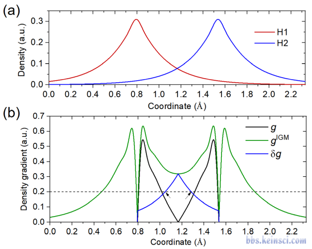

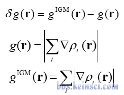

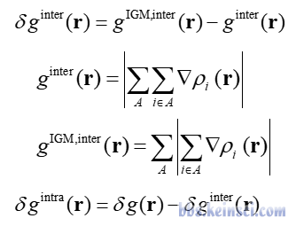

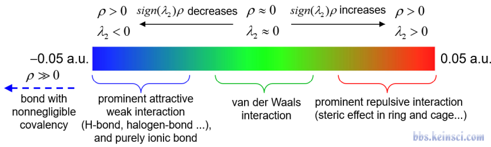

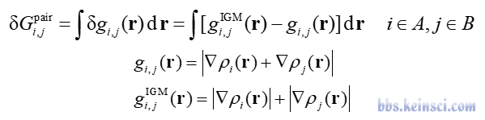

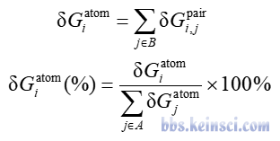

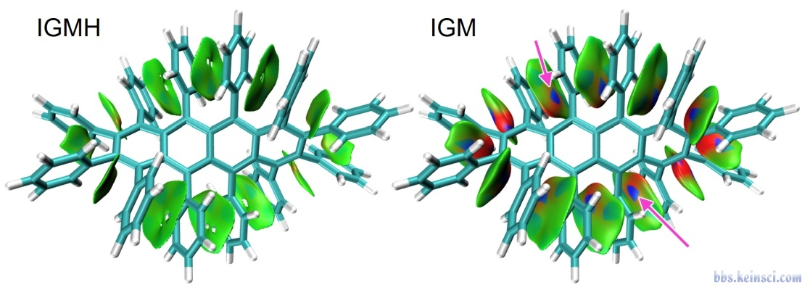

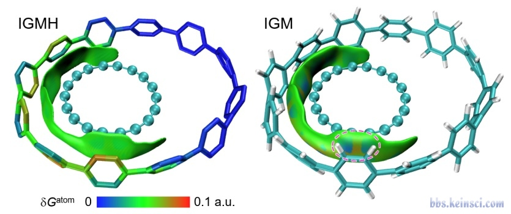

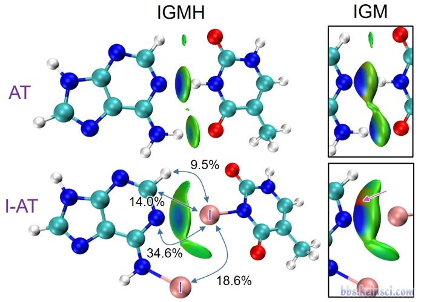

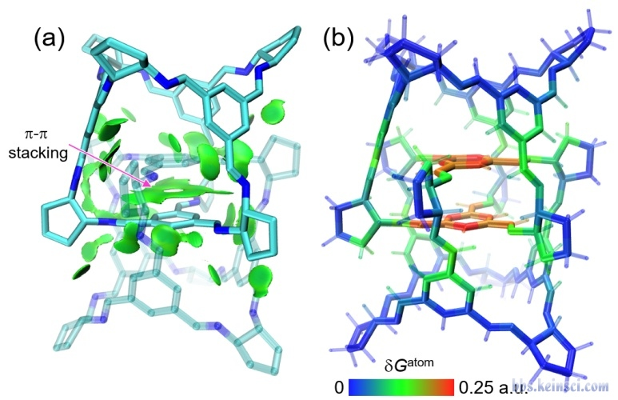

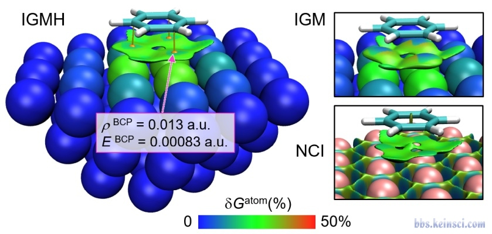

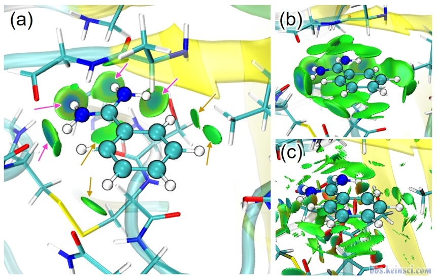

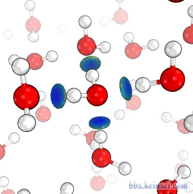

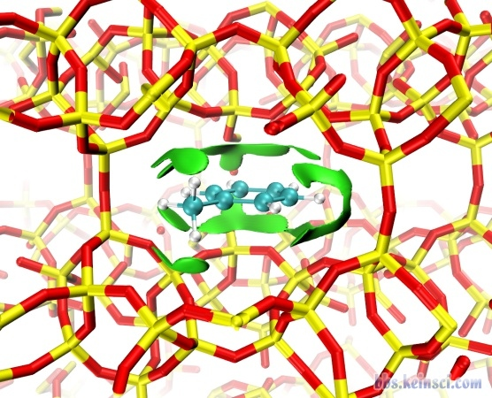

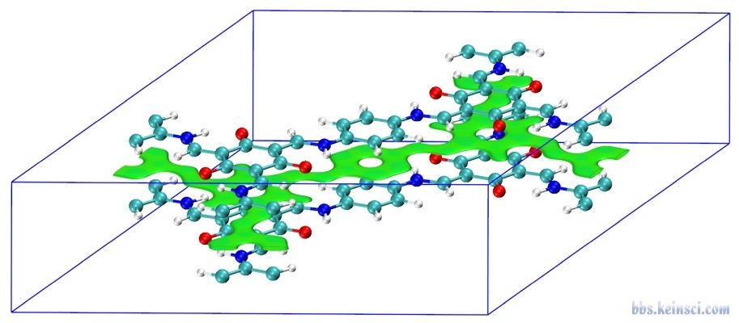

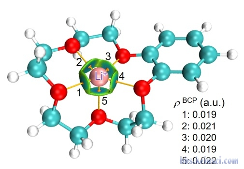

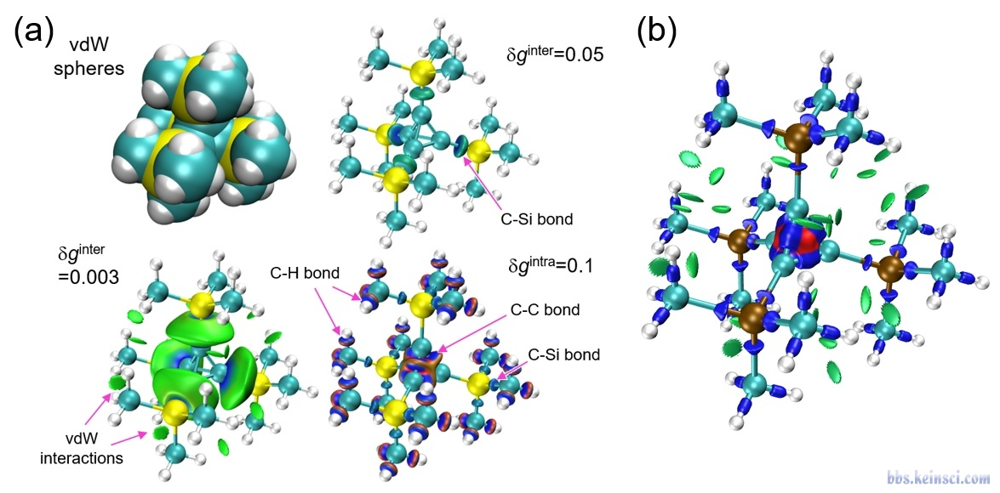

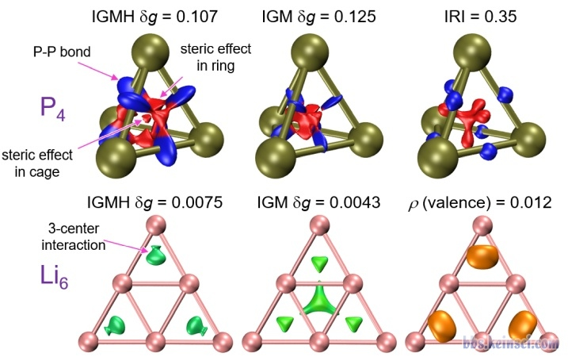

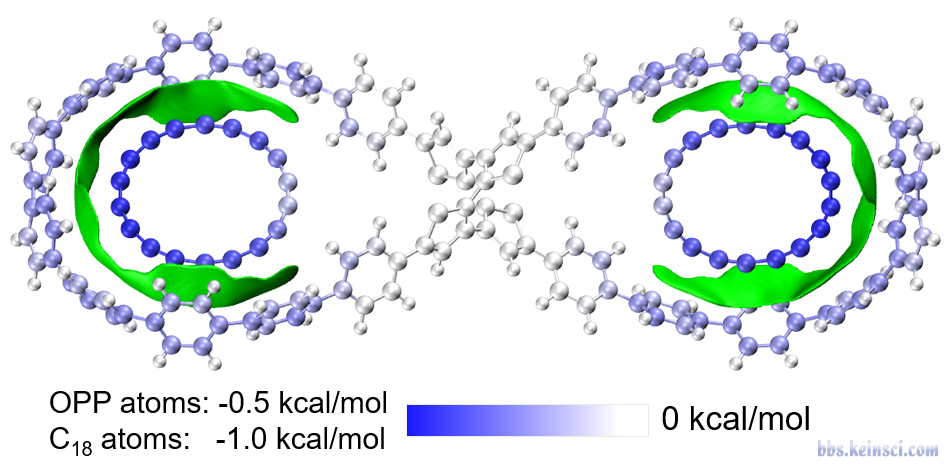

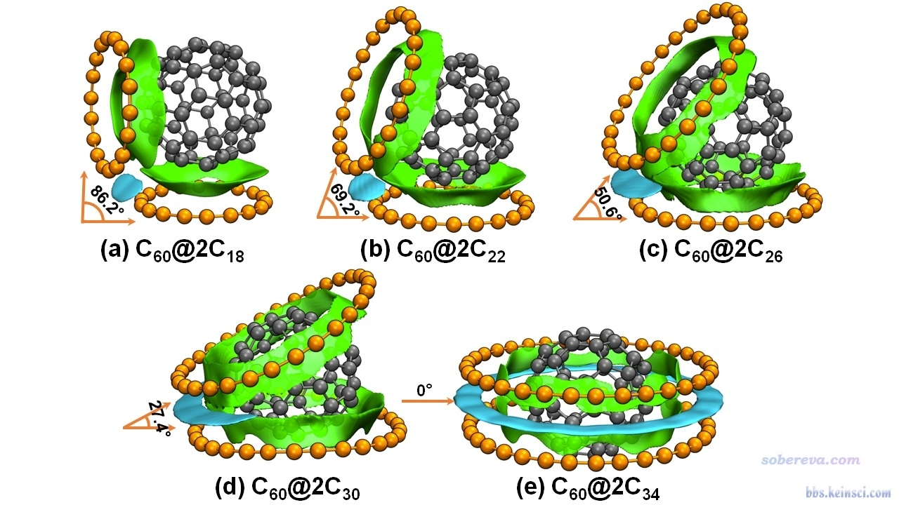

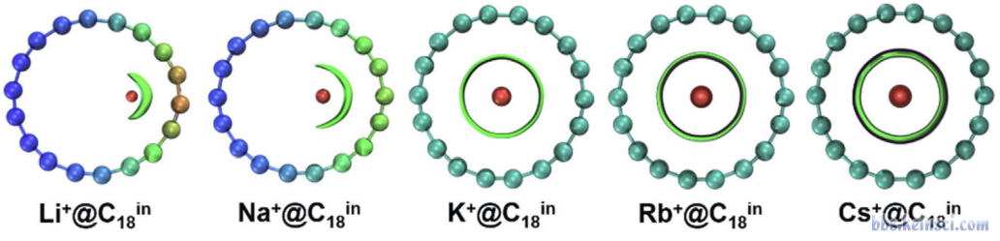

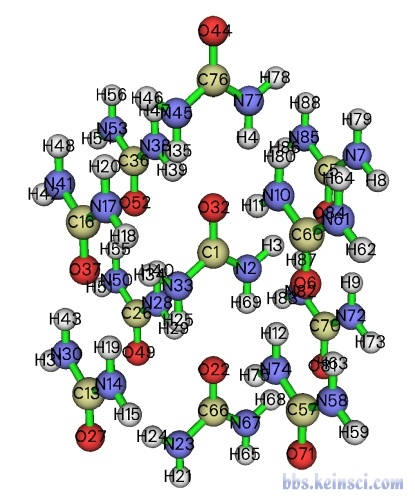

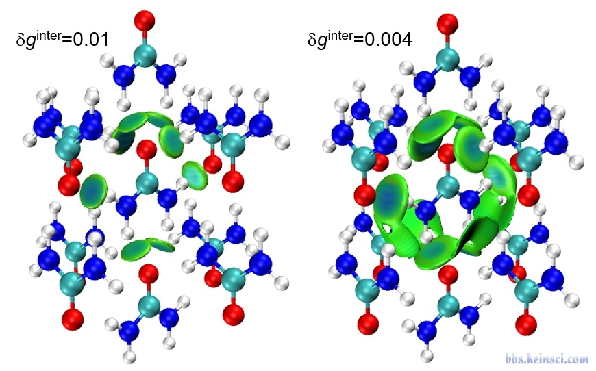

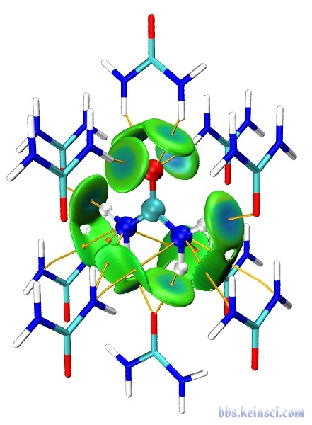

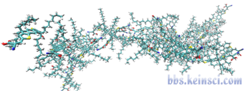

以上为本帖已下载的 25 个图片附件。

## 入库完整性评估

- 全部楼层收录
