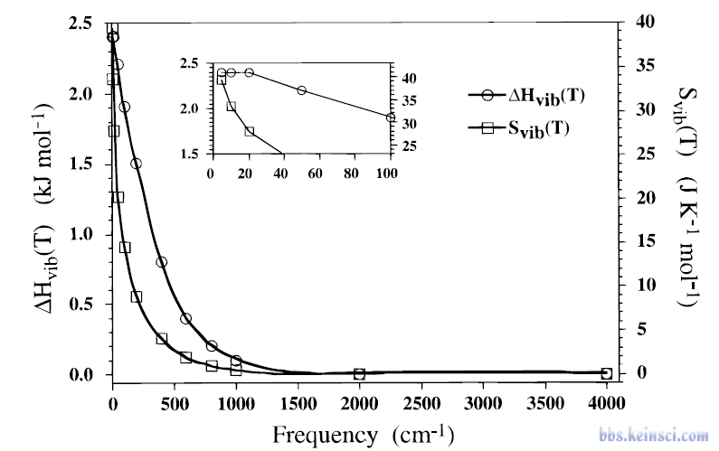
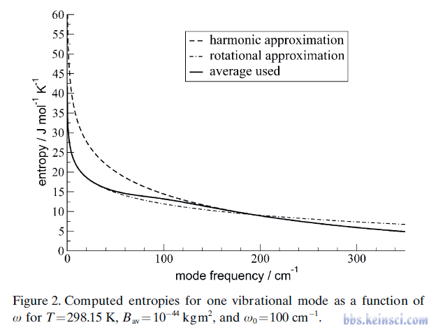
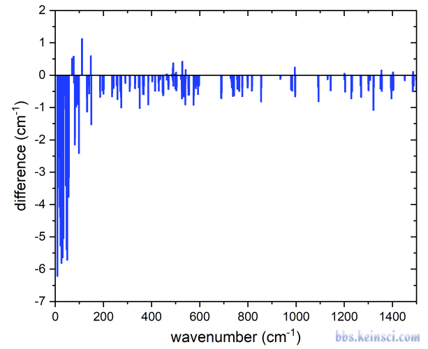
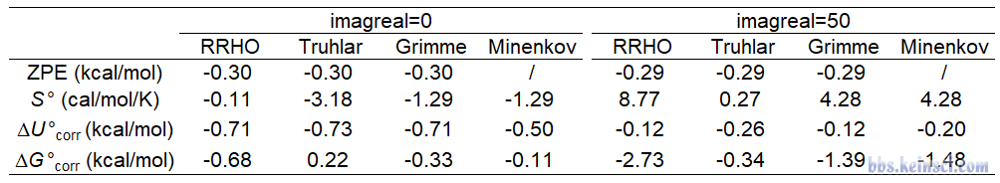

# 谈谈有小虚频时热力学量的计算

- 原帖 URL：<http://bbs.keinsci.com/thread-43116-1-1.html>
- 论坛板块：量子化学
- 作者：**sobereva**
- 浏览量：4640 | 回复数：4 | 共1页
- 完整性：**全部内容已完整抓取**。

## 楼层正文

### 1 楼（楼主）｜sobereva

谈谈有小虚频时热力学量的计算On the calculation of thermodynamic quantities when there are small imaginary frequencies

文/Sobereva@北京科音  2024-Feb-9

0 前言

量子化学研究中在优化完极小点结构然后做振动分析时遇到虚频是家常便饭的烦人的问题。之前我专门写过博文《Gaussian中几何优化收敛后Freq时出现NO或虚频的原因和解决方法》（http://sobereva.com/278）讲了怎么消虚频。除非程序存在bug，否则原理上不存在按上文处理完全解决不掉的虚频。一个现实问题是：虽然靠各种尝试、折腾，最终确实总能消掉虚频，但这个过程对于大体系来说过于浪费计算时间，也耗费研究者的精力。那么是否带有虚频的结构就一定不能拿来算能量相关的问题呢？是否虚频总是要不惜一切代价消除呢？此文就谈谈我个人的看法，给出理论分析，并且通过一个例子对我的观点予以验证。

本文牵扯到热力学数据计算的各种常识知识，没有这些常识的话先看《使用Shermo结合量子化学程序方便地计算分子的各种热力学数据》（http://sobereva.com/552），以及Shermo程序手册的附录，里面有计算原理的简洁易懂的概述。

本文说的小虚频和过渡态必然存在的虚频没有丝毫联系，初学者绝对不要把本文内容胡乱套用到过渡态的情况。

1 导致小虚频的原因

为了避免误解，首先回顾一下优化极小点后振动分析时出现虚频的各种常见原因：

(1)振动分析时用的影响势能面的设置与优化时的不同。这通常是没有基本常识的外行人才会犯的低级错误。注：JCTC, 17, 1701 (2021)中提出的single-point Hessian (SPH)方法通过对势能面添加偏移势，从而允许振动分析用的计算级别低于优化用的级别来节约时间，但这个做法非主流、经验性强，本文不涉及

(2)初始结构的点群高于实际极小点的点群，且如果优化后的结构维持住了初始的对称性，振动分析后就会发现破坏对称性的虚频，即按照虚频方式移动结构会导致结构的对称性下降。有时候这种有虚频的结构恰对应于过渡态

(3)程序bug。比如Gaussian 09 D.01的DFT-D3色散校正对解析Hessian的贡献的计算有bug，容易导致算势能面平缓体系出现虚频。这点在《DFT-D色散校正的使用》（http://sobereva.com/210）我专门做了说明

(4)某些方法对势能面引入明显数值噪音。如Gaussian中的SMD溶剂模型的这个问题就比较明显

(5)几何优化收敛得不精确。几何优化收敛限过于宽松或Hessian的质量不太好会导致这种问题。

(6)积分格点质量不够好。这个问题对于M06-2X等对积分格点敏感的泛函尤为显著。关于量子化学程序用的原子中心的积分格点参考《密度泛函计算中的格点积分方法》（http://sobereva.com/69）。如果是CP2K等利用平面波的第一性原理程序，用的均匀分布的格点依赖于平面波截断能的设置。

以上前四种情况导致的虚频是一定要解决掉的，而且本来解决就非常简单。只要不犯低级错误自然就没有(1)的情况出现，解决(2)按照虚频模式调节结构后进一步优化即可，解决(3)就换成没bug的版本或其它计算程序，解决(4)可以换成其它的能在优化+振动分析中实现基本相同目的而没严重数值噪音的方法，如SMD换成IEFPCM，或者用SMD时结合SAS方式定义溶质孔洞表面。对于(5)和(6)情况带来的虚频，只要计算能力和精力允许，能消尽量要消，但如果由于计算资源或精力所限实在太难消掉、被迫要容忍虚频的存在，那么后续的能量相关问题的计算就是后文讨论的内容了。

对于柔性大分子、弱相互作用复合物这样势能面的某些维度非常平缓的体系，在做完几何优化和振动分析后很容易发现存在大小非常小的虚频，如波数为9.8i、27.3i cm^-1这种，普遍小于50，这一般是前述(5)或(6)情况所导致的。此类虚频的振动模式通常对应于甲基旋转运动、柔性骨架的变形运动、分子间相对运动。这类(5)或(6)情况所导致的虚频以下简称为“小虚频”。但要注意也不是所有波数小于50的虚频都属于这种情况，前述的其它四种情况也完全可能导致数值很小的虚频，所以绝对别光拿虚频大小来判断情况。

2 有小虚频时能量相关问题的计算

当遇到小虚频时，显然最完美的做法（具体选择视情况而定）是用诸如更严格的几何优化收敛限、更好的Hessian、更好的积分格点精度进一步做优化和振动分析，使得虚频完全消除后再计算能量相关问题。但是对于普通泛函算几百个原子有机体系，很可能算一次Hessian就要花一整天时间，几何优化一步也可能花费一个小时左右，最终把虚频完全消掉可能得花几天甚至一个礼拜，十分痛苦，甚至不可能实现。那么，在后续算能量相关问题时怎么考虑？下面根据被计算的量专门讨论。

2.1 计算电子能量

诸如Gaussian这样的主流量子化学程序默认的几何优化收敛限是以受力和位移作为判据的。在默认收敛限下优化正常完成后，即便结构还没有与实际极小点特别精确一致，但通常相差很小。而且当前的最大和平均受力肯定已经很小了（因为收敛限考虑了它们），由于受力对应于能量梯度的负矢量，所以当前结构稍微再挪一点达到精确的极小点的过程中能量变化肯定非常小。即曰，在有小虚频的情况下，计算的电子能量一般是可以用的，也即结果和消掉虚频后再算的能量相差极小。

2.2 计算0 K下的内能U(0)

U(0)是电子能量与零点振动能（ZPE）之和。在谐振近似模型下，每个振动模式对ZPE的贡献是1/2*h*ν，h是普朗克常数，ν是振动频率。频率很低的振动模式对ZPE的贡献是非常小的，每波数的振动频率对ZPE的贡献仅为5.98 J/mol，因此诸如30波数的振动模式只对ZPE有0.18 kJ/mol（0.04 kcal/mol）的贡献，数量级远远低于理论方法、基组、溶剂模型等因素带来的误差。顺带一提，Shermo计算热力学量的时候如果把settings.ini里的prtvib设为1，每个振动模式对热力学量的贡献都会明确输出。

主流量子化学程序，以及Shermo程序在默认情况下，在计算振动对热力学量的贡献时都是不考虑虚频产生的贡献的，因此小虚频对热力学量的贡献会被直接忽略掉，这不会对ZPE的计算造成实际问题。因为如果把这个小虚频消了，从而产生一个实频，其频率肯定也是非常低的，对ZPE的贡献可忽略不计。也就是不管消不消这个虚频，算出的ZPE都没多大差别。不过，实际情况远没这么简单，因为在虚频消掉前后，由于二者所在势能面的位置的些许不同，或改用不同档次积分格点导致频率计算精度的差异，其它的实频模式也会多多少少受到影响，不过频率值受影响相对明显的主要是低频模式（可能影响几个甚至10个左右波数，而高频模式受影响一般小于2波数），它们对ZPE的贡献恰恰又很小，所以虚频消掉前后算的ZPE虽然未必差异小到诸如前面说的0.2 kJ/mol左右这种程度，但至少也不会大，比如对柔性大体系顶多也就影响个1-2 kJ/mol。

如上所述，鉴于是否小虚频对电子能量和ZPE的影响都不太明显，因此算电子能量和U(0)时一般可以容忍一个或多个小虚频的存在。

2.3 计算从0 K升温到当前温度对内能的影响

研究U(0)没太大实际意义，毕竟实际化学过程也不可能在0 K发生。计算有限温度，也就是高于0 K时候的热力学量，就需要考虑从0 K升温到当前温度对内能的改变量，其中振动产生的贡献下面用Uvib(0→T)表示。首先要知道一点，低频对Uvib(0→T)的贡献是明显高于高频模式的。这点从下面的J. Phys. Chem., 100, 16502 (1996)的图1可以明显看出来，图中ΔHvib(T)和这里说的Uvib(0→T)是一码事，图是对T=298.15K的情况绘制的。

2.png (59.76 KB, 下载次数 Times of downloads: 93)

下载附件 Download

2024-2-9 17:11 上传 Uploaded

虽然低频模式的贡献大，但是由图中放大的0-100波数的区间可见，在小几十波数范围以内，频率值对Uvib(0→T)的影响虽然不可忽视，但不算多大，都在2.0-2.4 kJ/mol范围内。这也就是说，由于存在一个小虚频导致少考虑一个实低频模式，会给Uvib(0→298.15K)带来-2.2 kJ/mol左右的误差，这虽然不算小，但还算可以凑合接受。如前所述消虚频后还可能会对其它低频模式产生不可忽视的影响，这对Uvib(0→T)的改变一般也不至于太大。

综上所述，若带着小虚频计算U(T)，会造成一定低估。对于有一个小虚频的情况，低估程度在0.5 kcal/mol左右。如果有多个小虚频，那还是别计算U(T)了，除非T远低于常温，或者结合后文说的把小虚频当成实频的做法。

2.4 计算熵、自由能

低频对熵的贡献远大于高频，而且在很低频区间内，频率越低贡献明显越大。在包括Gaussian在内，大多数量子化学程序（ORCA除外）计算热力学量用的是传统的rigid-rotor harmonic oscillator (RRHO)模型，振动熵的计算完全基于谐振近似模型。此时在低频区间内，随着频率趋近于0，振动模式对熵的贡献猛增，如下面的Chem. Eur. J., 18, 9955 (2012)文中图2的虚线所示。Grimme在这篇文章中还提出了一种quasi-RRHO模型（QRRHO，后来也叫modified RRHO、mRRHO），以下称为QRRHO(Grimme)，它将自由转子和RRHO用的谐振近似模型算的振动熵做插值，频率越接近0自由转子的权重越大、频率越高谐振近似的权重越大，如下图实线所示。QRRHO(Grimme)对高频模式算的熵贡献和RRHO完全一样，而对于低频模式（特别是波数在100以下的）考虑得比RRHO明显更合理。由下图还可见QRRHO(Grimme)算的低频模式的熵比RRHO整体小得多，没有RRHO的严重高估的问题。此外，QRRHO(Grimme)下低频模式的振动熵对频率值的敏感性低于RRHO很多。

1.png (44.48 KB, 下载次数 Times of downloads: 93)

下载附件 Download

2024-2-9 17:11 上传 Uploaded

直接计算熵的用处不大，算熵的主要目的是用来算自由能，因为自由能里有-T*S项。显然低频对熵的贡献计算的准确度显著影响到自由能的计算准确度。假设体系有一个小虚频，并且在消掉之后会多一个20 cm^-1的实频，并且用的是QRRHO(Grimme)算298.15 K的熵，那么在有虚频的结构下由于缺失了这个实频，根据上图可知会造成熵的误差约为-18 J/mol/K，对自由能造成的误差约为-298.15*(-18)/1000=5.4 kJ/mol，略高于1 kcal/mol，这就不小了，都能赶上高质量ωB97M-V泛函结合大基组算普通有机反应的误差了。不过实际中小虚频带来的误差未必那么大，因为有和没有小虚频的结构下实低频模式的频率也往往有不可忽视的不同，例如下面第3节的例子在有虚频的结构下实低频模式的频率比精确极小点结构下的整体偏小（势能面形状原因所致），导致高估了不少实低频模式的熵，藉由-T*S项进而对自由能造成低估，于是和少考虑一个低实频对自由能的高估产生了很大程度的相互抵消，下面管这称为“熵的误差抵消”。

根据以上讨论，有小虚频的情况下计算熵和自由能都有一定风险。如果就有一个小虚频，算常温的情况往往还说得过去，而如果有多个小虚频，或计算高温的情况（注意T越大-T*S越大，熵的误差造成自由能的误差越大），我就不建议冒险带着虚频了。而且就算非要带着小虚频算，也至少应当用QRRHO模型，而切勿用RRHO模型，因为RRHO算的振动熵对低频频率值的敏感程度显著高于QRRHO，因而用有虚频的结构算的熵的误差上限比QRRHO的明显要大。

要注意QRRHO模型不止Grimme提出的这一种。如Shermo手册附录部分所介绍的，Truhlar的QRRHO是把所有小于一定阈值（通常为100 cm^-1，可以由Shermo的ravib参数控制）的低频统一提升为这个阈值再算它们对Uvib(0→T)和熵的贡献，这个做法的物理意义不甚明确，没有QRRHO(Grimme)的插值做法优雅。目前还有一种QRRHO是Minenkov等人在J. Comput. Chem., 44, 1807 (2023)中提出的，它对振动熵部分的考虑和QRRHO(Grimme)一样，但还同时将这种自由转子与谐振近似做插值的思想同时应用到了计算振动对内能的热校正量Ucorr上（此时没法单独计算ZPE），原理更理想，实际结果还略好一点点。这些QRRHO模型在最新版Shermo中都是支持的，通过ilowfreq参数控制。

2.5 将小虚频视为实频的做法

在Angew. Chem. Int. Ed. 2022, e202205735中的3.2节Grimme等人认为存在小虚频的情况下，只要使用QRRHO模型并且将小虚频视为实频处理，比如18i cm^-1直接当做18 cm^-1，则得到的熵就是可以用的、小虚频的存在就不再是个问题。这种做法表面看起来似乎有点莫名其妙、太任性了，但确实有一定道理，可以这么理解：在消除小虚频后，必定会得到相同数目的波数也很小的实频模式，它们都对熵有明显贡献。相对于完全忽略掉这些小虚频的贡献而导致明显低估熵，干脆把他们当做实频处理，从而“凑”出来相应数目的实低频是更好的做法，而且本身在QRRHO模型下，数值在十几、几十波数区间的频率对熵的贡献也都相差不悬殊，因此也用不着对这么人为凑的实频频率太较真。由于如前所述，Uvib(0→T)也对低频数值不敏感而低频的贡献又没小到可以随便忽略的程度，所以计算Uvib(0→298.15K)时也使用这种处理是有道理的。从Shermo 2.5版开始，可以通过settings.ini里的imagreal选项设置视为实频的虚频阈值，比如设为50，就代表大小在50 cm^-1以内的虚频都当做实频处理来计算振动对各种热力学量的贡献，此时从Shermo程序输出的频率信息中也会看到已经没有虚频了。

然而，这种将小虚频视为实频的做法目前很非主流，其思想在我来看过于主观和乐观、把问题想得太简单了，目前也缺乏系统性的检验，我个人不建议轻易使用。这种做法有一个明显问题：如前所述，有小虚频和消掉虚频的两种情况相差的不仅仅是一个小虚频转变成一个小实频，许多其它低频模式的频率也会有不小变化，而且有时是整体明显增加的。不做这个虚频到实频的转换的情况下能够有上一节说的熵的误差抵消效应，而这么做了之后，忽略虚频模式导致对熵的低估问题确实很大程度解决了，但在有小虚频结构下其它频率往往偏低而导致熵的高估带来的误差就没处抵消了。此外，如果当前体系的低频还有很多都是10 cm^-1 左右这种特别低的，这个范围附近即便是QRRHO(Grimme)或QRRHO(Minenkov)模型算的熵也对频率很敏感，问题会更大。

所以，将小虚频视为实频的做法虽然确实对一些情况更好地计算熵和自由能是有帮助的，但也很可能起到负面效果。所以这绝不是普适、稳健、理想的做法，更千万不能一看到存在小虚频就总是想靠这个做法来完全无视虚频。

3 有虚频时算热力学量的实例

笔者最近通过Gaussian 16在ωB97XD/6-311G*级别研究的一个以pi-pi堆积方式形成的共128个原子的三分子复合物，在优化和振动分析后发现存在6.44i cm^-1的小虚频，之后进一步优化时用opt=calcfc关键词提供精确的初始Hessian，优化完再做振动分析就发现没虚频了，此时最低的频率成了10.35 cm^-1。正好这个例子可以拿来考察消虚频前后计算的热力学量的差异，由此检验带着那个小虚频时以不同方式算的热力学量有多大误差。要强调的是，仅仅这么一个测试，显然不足以充分证明某种做法理想，因为这必须通过大量体系做统计分析，但至少误差较大的情况可以用来体现相应做法不够稳健和普适。

先看一下有虚频相对于无虚频时各个实频的频率变化情况。先把实频频率按照由低到高排列，用有虚频时候它们的频率减去无虚频时候的频率作为纵坐标值，而两种情况频率的平均值作为横坐标，作的图如下所示。可见，至少对于此例，有虚频时数值较低的实频是普遍明显偏低不少的，而>200 cm^-1的相对而言的中、高频则受到的影响很小。这种情形虽然不能说是普遍情况，但至少也是挺常见的一种。

3.png (33.11 KB, 下载次数 Times of downloads: 98)

下载附件 Download

2024-2-9 17:11 上传 Uploaded

此例有虚频相对于无虚频的情况计算的电子能量仅仅相差0.04 kcal/mol，小到完全可以忽略不计。用Shermo程序基于Gaussian振动分析输出文件计算的有虚频相对于无虚频时的ZPE和气态标况下的熵、内能、自由能热校正量的差异如以下表格所示。RRHO以及Truhlar、Grimme、Minenkov三种QRRHO分别对应Shermo的ilowfreq=0/1/2/3的情况，imagreal=0和50相当于忽略那个虚频以及把那个虚频当大小相同的实频考虑的情况。

4.png (20.61 KB, 下载次数 Times of downloads: 100)

下载附件 Download

2024-2-9 17:11 上传 Uploaded

首先看常规的忽略虚频贡献的情况。由表格可见：

• ZPE：有虚频时和无虚频时ZPE相差仅-0.3 kcal/mol，属于通常可以接受的差异

• 熵：由于误差抵消的巧合，恰好RRHO下有小虚频时的熵和无虚频时的差异很小。QRRHO(Truhlar)的情况差异挺大，在于它把实低频都统一当成了100 cm^-1，这部分在有和没有小虚频情况之间几乎都抵消了，而有小虚频时相当于少考虑了一个100 cm^-1振动模式对熵的贡献，因此造成熵的严重低估。QRRHO(Grimme)和QRRHO(Minenkov)对熵的部分处理相同，由于前述的熵的误差抵消效应导致有和没有小虚频时熵的差异不算太大

• 内能的热校正量Ucorr：等于ZPE+Uvib(0→T)。由于Uvib(0→T)对低频的具体数值不太敏感，有无小虚频情况下实低频的贡献变化很小，而有小虚频时由于缺失了一个低实频对Uvib(0→T)的贡献，导致有小虚频时Uvib(0→T)偏低不少，Ucorr因此比ZPE偏低得明显更多。QRRHO(Minenkov)用的计算Ucorr的方式和其它模型不同，对于此例使得有小虚频时Ucorr偏低程度比其它模型更小，仅为-0.5 kcal/mol。因此在计算有小虚频情况下的U(T)时，用QRRHO(Minenkov)可能会比其它模型更有优势。

• 自由能的热校正量Gcorr：相对于其它模型，有小虚频相对于无虚频时Gcorr的差异在RRHO下是最大的，这在于有无小虚频时RRHO算的S的差异对此例恰好颇小，导致-T*S项的差异才0.03 kcal/mol，因此没能充分对Ucorr的差异产生抵消效应。而各种QRRHO模型下Gcorr的差异明显较小，这在于这种情况下S的差异不小，而且-T*S项的差异的符号和Ucorr的差异相反，因此相互抵消了很多。其中Gcorr差异最小的是QRRHO(Minenkov)，才-0.11 kcal/mol，体现出它可能适合作为有小虚频情况下算自由能的优先选择。

再来看将小虚频当实频处理的情况。根据以上表格可见，这种处理使得Ucorr在有和没有小虚频情况下计算的结果差异减小很多，因此对于算内能的目的，这种做法有一定意义。但是，除了QRRHO(Truhlar)外，这个做法却造成了有小虚频时算的S和Gcorr与无虚频时的差异变得显著更大，对RRHO最为严重，对QRRHO(Grimme)和QRRHO(Minenkov)问题也挺严重，这来自于有小虚频时实频模式偏低造成的对振动熵的高估无法与因为少考虑一个实低频导致的低估一定程度相抵消。把小虚频当实频处理时结合QRRHO(Truhlar)对此例倒是很不错，有小虚频相对于无虚频时的熵只相差0.27 cal/mol/K，这在于此种QRRHO将低频全都上拉到100 cm^-1，此时又把小虚频转化成了小低频，因此无虚频和有虚频时相当于有同等数目的100 cm^-1的实频，自然两种情况下算的熵很接近。

4 总结

根据以上讨论和实际体系的测试可知，对于因(5)和(6)情况造成有小虚频的情况，算电子能量和U(0)没大问题，不是非得消虚频。

对于计算Ucorr或与之相差RT的焓的热校正量Hcorr，用QRRHO(Minenkov)或QRRHO(Grimme)并同时把小虚频当实频处理是较好选择，不会因为存在小虚频的问题而带来太大误差。

有小虚频时最难搞的是熵，以及温度不很低时候Gcorr的计算，难点在于小虚频消掉前后实低频模式频率也可能受到不小影响且影响情况不易估计，然而即便用QRRHO(Grimme或Minenkov)时低频的具体数值对熵的影响也不算太小，所以明显不是把小虚频当成实频处理以避免少考虑一个实低频模式就能较好解决的，而且如第3节的测试可见，这种做法还可能造成熵和Gcorr在有小虚频时计算结果更差。所以当你对熵、Gcorr要求精度高时，小虚频要尽量消。实在搞不定的话，那就姑且用原理上最好的QRRHO(Minenkov)，并且建议不用小虚频当实频的处理，毕竟此做法非主流而且起到正面效果的可能性很有限。虽然把小虚频当实频并结合QRRHO(Truhlar)的情况下小虚频和无虚频时熵的差异很小，但在J, Comput. Chem., 44, 1807 (2023)的测试中QRRHO(Truhlar)算团簇反应自由能表现得远不如QRRHO(Minenkov)，甚至比RRHO没明显改进，所以我也不推荐。

### 2 楼

从2.5里面可以看到，小虚频存在时，其他频率更像是在真实频率的基础上向负方向平移了一定波数，这个在论坛此前也有讨论，不清楚有无将所有频率正移若干波数的处理方式；

Gaussian这种有解析Hessian的还好，此前论坛里有讨论在VASP中遇到虚频的处理方式http://bbs.keinsci.com/thread-13344-1-1.html

那种只有数值方法求频率的情况，出现虚频的原因就可能比较复杂了，到底是数值噪声，还是结构优化不到位，有时还需要反复尝试。常用的vaspkit处理方式不仅不考虑虚频，而且统一将小于某阈值（一般是50）cm-1的实频波数直接按照50对待。其实感觉哪怕不存在虚频，帖子的方法对实频计算的误差也有意义

### 3 楼

很多时候必须要int=superfine才能消小的虚频，为此统一之前所有的计算内容就很麻烦也没必要。我的处理方法是先用int=superfine格点优化+算频率得到校正量，然后再拿默认设置（比如int=ultrafine）算个单点再加和。

### 4 楼

Stars 发表于 2024-2-9 21:45

从2.5里面可以看到，小虚频存在时，其他频率更像是在真实频率的基础上向负方向平移了一定波数，这个在论坛 ...

这等同于QRRHO(Truhlar)并把Shermo的ravib设为50的情况

"其他频率更像是在真实频率的基础上向负方向平移了一定波数" 当前例子中体现了这一点，但也不算是非常普遍的现象，比如一些情况只有个甲基旋转的小虚频，由于与其它自由度耦合很弱，消不消虚频往往对其它低频模式频率没什么影响。正因为有无小虚频结构下低实频的差异有不同的可能性，所以带着小虚频算熵没有唯一理想做法。虽然小虚频当实频同时用QRRHO(Truhlar)可以极大抑制这种差异，但可惜QRRHO(Truhlar)本身却又不够理想。

### 5 楼

ionexchangeC 发表于 2024-2-9 22:22

很多时候必须要int=superfine才能消小的虚频，为此统一之前所有的计算内容就很麻烦也没必要。我的处理方法 ...

这是正常处理

为了获得热力学量而做振动分析，我不要求所有体系振动分析的积分格点严格一致，不同体系的opt freq过程我接受ultrafine和superfine和混用

## 入库完整性评估

- 图片处理：本地保留 4 张附件图，并在下方集中列出；未逐一重定位到具体楼层。

- 主帖全文收录
- 全部回复完整收录

### 本地附件图片

> 本节集中列出本地保留图片，便于 MCP 图片索引；不改变楼层正文。

