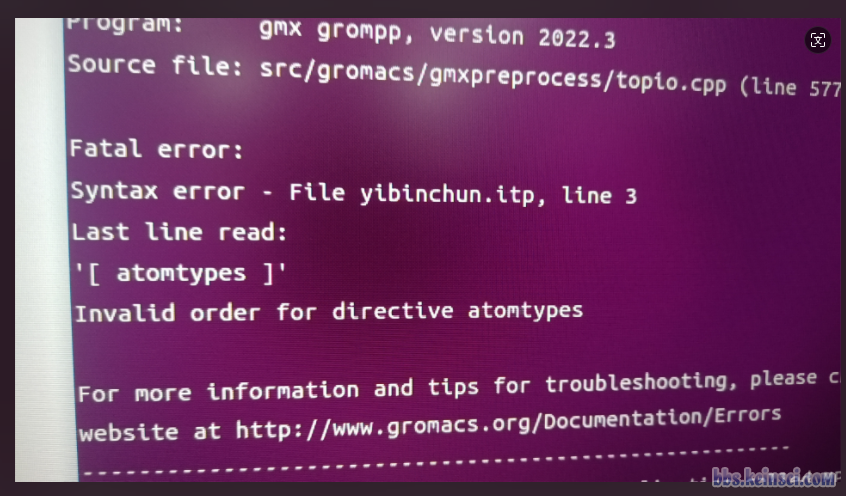
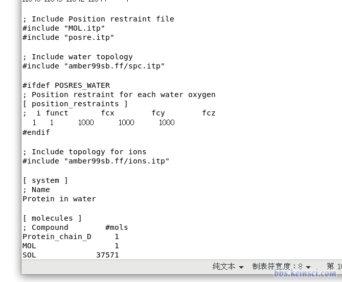
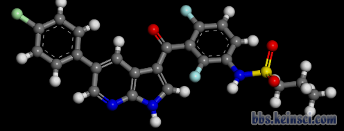
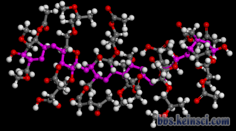
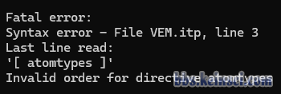

# 老生常谈的grompp提示Invalid order for directive atomtypes报错答疑专帖

- 原帖 URL：<http://bbs.keinsci.com/thread-45783-1-1.html>
- 论坛板块：分子模拟
- 作者：**sobereva**
- 浏览量：8378 | 回复数：29 | 共2页
- 完整性：**全部内容已完整抓取**。

## 楼层正文

### 1 楼（楼主）｜sobereva

现在问GROMACS用grompp时出现Invalid order for directive atomtypes的报错现在在计算化学公社论坛里、思想家公社QQ群里简直成了周经甚至半周经问题，我都在论坛里、群里回复过无数遍。以后再有问这个的，我一律直接合并到本帖里，并且不再重复回复。下面我说得明白得没法更明白，我没有任何可补充的。

为什么出现这种报错、怎么解决，在我讲的北京科音分子动力学与GROMACS培训班（http://www.keinsci.com/KGMX）的下面这页幻灯片里已经体现得没法更清楚。自己仔细检查top中和其中各个被include的itp文件（以及被include的文件中include的文件），确保top中所有被include的文件（以及被include的文件中所include的各种文件）全被展开后，grompp最终看到的拓扑文件里字段顺序正确，即满足下面幻灯片里展示的顺序就完了。显然当前顺序若不合理就必须自己调整字段。一定要搞清楚拓扑文件里#include这种预处理指令是什么！这用来把一个文件里的全部内容插入到另一个文件里。

始终要牢记，grompp最终看到的拓扑文件的内容是所有被include的文件都完全展开后的！而不管有哪些itp文件！别再问某某某itp文件怎么样怎么样、无某某某itp文件这种问题，根本毫无意义。并且，不要问诸如 “我按照这个帖子处理了还不行” 这种问题，grompp出那种报错只可能字段顺序不对，没有任何其它可能，严格按我说的处理完了之后就必然没那个报错了。

directive_order.png (89.08 KB, 下载次数 Times of downloads: 252)

下载附件 Download

2024-5-21 02:30 上传 Uploaded

如果你对gromacs的拓扑文件缺乏了解、始终稀里糊涂搞不明白，以及在GROMACS是初学者阶段，强烈建议参加上述培训班完整、系统性学一遍GROMACS，就一次性全都彻底明白了，节约巨量自己来来回回绕弯路、摸索上花费的宝贵时间！（往届培训资料可以随时购买，见以上培训介绍链接）

### 2 楼

topol.top

(2.12 KB, 下载次数 Times of downloads: 52)

2024-6-18 17:44 上传 Uploaded
点击下载
Click to download

yibinchun.itp

(8.71 KB, 下载次数 Times of downloads: 29)

2024-6-18 17:44 上传 Uploaded
点击下载
Click to download

202406181746133525..png (566.11 KB, 下载次数 Times of downloads: 221)

下载附件 Download

出错的界面
2024-6-18 17:46 上传 Uploaded

### 3 楼

请问老师，这个是怎么处理呢

### 4 楼

很常见的报错，看这个http://bbs.keinsci.com/thread-14401-1-1.html

### 5 楼

各位老师好，我按照论坛首页的蛋白-配体分子分子动力学模拟流程进行，我的topol.top文件是这样的，MOL.itp是我用sobtop产生的配体分子的itp文件，posre.itp是gmx pdb2gmx指令生成的蛋白质限制势itp文件。配体分子的限制势我用gmx genrestr指令产生为posre_mol.itp文件，之后按照流程在MOL.itp文件的末尾进行了相关语句添加，如下图。

选区_007.png (46.09 KB, 下载次数 Times of downloads: 190)

下载附件 Download

2024-6-30 20:03 上传 Uploaded

_______013.png (87.42 KB, 下载次数 Times of downloads: 204)

下载附件 Download

2024-6-30 20:06 上传 Uploaded

但是在我之后进行gmx grompp -f ions.mdp -c solv.gro -o ions.tpr -p topol.top -maxwarn 1后，提示这样的错误，如下图

user@localhost_-data-sob-DPP4_006.png (63.76 KB, 下载次数 Times of downloads: 213)

下载附件 Download

2024-6-30 20:08 上传 Uploaded

想问一下老师们，我是哪一步出错了？

### 6 楼

本帖最后由 student0618 于 2024-6-30 20:21 编辑 

http://bbs.keinsci.com/thread-45783-1-1.html

Try to use the search function of this forum, this is a frequently asked question.

### 7 楼

student0618 发表于 2024-6-30 20:18

http://bbs.keinsci.com/thread-45783-1-1.html

Try to use the search function of this forum, this i ...

好的，谢谢老师

### 8 楼

本帖最后由 dandanhu 于 2024-8-21 20:12 编辑 

各位老师，我想通过gromacs计算有机物小分子与聚合物的分子动力学，这两个分子（结构如下）的拓扑文件都通过Sobtop获得（由于聚合度较小，这两个分子都按照Sob老师给出的 例2 ，基于GAFF力场获得）。

202408211956203261..png (42.73 KB, 下载次数 Times of downloads: 180)

下载附件 Download

2024-8-21 19:56 上传 Uploaded

202408211957548061..png (71.64 KB, 下载次数 Times of downloads: 183)

下载附件 Download

2024-8-21 19:57 上传 Uploaded

在建好盒子，溶剂化后，体系不带电荷未添加离子，直接进行能量最小化，运行 gmx grompp -f minim.mdp -c solv.gro -p topol.top -o em.tpr 命令报错

202408211959324651..png (11.35 KB, 下载次数 Times of downloads: 213)

下载附件 Download

2024-8-21 19:59 上传 Uploaded

不知道是topol.top文件问题还是分子的itp文件的问题，烦请各位老师指教！

附上topol.top文件与itp文件

topol.top文件：

[ defaults ]

; nbfunc        comb-rule       gen-pairs       fudgeLJ    fudgeQQ

     1              2              yes            0.5       0.8333

#include "HPMCAS.itp"

#include "VEM.itp"

; Include water topology

#include "spc.itp"

[ system ]

HPMCAS in water

[ molecules ]

; Molecule      nmols

HPMCAS          4

VEM             6

SOL             32385

itp文件：

VEM.itp

(25.69 KB, 下载次数 Times of downloads: 33)

2024-8-21 20:08 上传 Uploaded
点击下载
Click to download

有机物itp文件

HPMCAS.itp

(232.01 KB, 下载次数 Times of downloads: 24)

2024-8-21 20:09 上传 Uploaded
点击下载
Click to download

聚合物itp文件

### 9 楼

VEM.itp的[atomtypes]出现在了HPMCAS.itp的[molecular type]之后

把两个文件的[atomtypes]字段合并后，放在topol.top文件中的[default]字段下面

看http://bbs.keinsci.com/thread-45783-1-1.html

### 10 楼

本帖最后由 student0618 于 2024-10-4 20:29 编辑 

建议将这帖置顶或放推荐主题。

### 11 楼

各位老师，请问在对NaCl溶液进行能量最小化时，离子选用KBFF力场（https://kbff.chem.k-state.edu/），水分子选用oplsaa.ff力场，建立tpr文件时报错。top文件和报错信息如下所示。

### 12 楼

您好，我按照官网教程（蛋白配体复合物教程）模拟我自己的复合物，我使用的是amber99力场，sobtop生成了配体小分子的top、itp、gro文件，但是在添加离子那一步，输入命令gmx grompp -f ions.mdp -c solv.gro -p topol.top -o ions.tpr。就会报错

Fatal error:Syntax error - File topol.top, line 26

Last line read:

'[ atomtypes ]'

Invalid order for directive atomtypes

我又将拓扑文件进行修改，把

; Include ligand topology

#include "XAN1_fix.itp"两行，放到了

; Include forcefield parameters

#include "amber99.ff/forcefield.itp"下面，就会出现这个报错Fatal error:

There was 1 error in input file(s)。

想请问老师，这改如何解决，我找寻了好几天，仍被困在这里。

### 13 楼

虽然这个问题搜到了一些帖子，而且被sob老师亲切定义为周经问题，但还是很confused，请已经解决的朋友们帮忙解决一下吧。

我做蛋白-小分子复合物的MD的时候，发现用gmx grompp -f ions.mdp -c protein_solv.gro -p topol.top -o ions.tpr 生成离子的tpr文件时候

出现了Fatal error:

Syntax error - File unk.itp, line 3

Last line read:

'[ atomtypes ]'

Invalid order for directive atomtypes

的报错，

通过搜索帖子，有的说是把小分子itp文件里的[ atomtypes ]字段复制到top文件里的itp（前或者后，不确定，有人说前有人说后，都试过了），但还是出错。

参考sob老师提供的PPT截图，atomtypes在moleculetypes，小分子itp文件生成的参数顺序也没错。

所以，请教一下，这个周经问题到底如何解决呢？我的itp和top文件相关字段截图如下，谢谢！

### 14 楼

我前面都使劲强调了，别管什么文件，只管所有被include的文件全都展开后都有什么字段，这么简单的事怎么就不理解呢！？

复制到top文件里的itp（前或者后

还在问itp文件前、后这种事，根本毫无意义，根本没好好认真理解我的话

### 15 楼

您好，我按照官网教程（蛋白配体复合物教程）模拟我自己的复合物，我使用的是amber99力场，sobtop生成了配体小分子的top、itp、gro文件，但是在添加离子那一步，输入命令gmx grompp -f ions.mdp -c solv.gro -p topol.top -o ions.tpr。就会报错

Fatal error:Syntax error - File XAN1_fix.itp, line 8

Last line read:

'[ atomtypes ]'

Invalid order for directive atomtypes。

我将拓扑文件进行修改，把; Include ligand topology  #include "XAN1_fix.itp"两行，放到了; Include forcefield parameters  #include "amber99.ff/forcefield.itp"下面，就会出现这个报错

Fatal error:

There was 1 error in input file(s)。

想请问老师，这该如何解决，我找寻了好几天，仍被困在这里。

### 16 楼

本帖最后由 pkuchemistry 于 2024-12-13 13:13 编辑 

sobereva 发表于 2024-12-13 12:25

我前面都使劲强调了，别管什么文件，只管所有被include的文件全都展开后都有什么字段，这么简单的事怎么就 ...

sob老师不要着急，错误的提示是unk.tpr中的问题，我展开了unk.tpr文件，发现atomtypes是在moleculetypes之前的，如图，这应该可以的吧？

### 17 楼

pkuchemistry 发表于 2024-12-13 12:52

sob老师不要着急，错误的提示是unk.tpr中的问题，我展开了unk.tpr文件，发现atomtypes是在moleculetypes ...

连itp和tpr都分不清

第一句话不是你该说的

### 18 楼

暖身贴 发表于 2024-12-13 12:51

您好，我按照官网教程（蛋白配体复合物教程）模拟我自己的复合物，我使用的是amber99力场，sobtop生成了配 ...

以后别再问这种问题，1L已我说得明确得没法更明确

并且别管那叫官网教程，根本就不是官网，看http://bbs.keinsci.com/thread-48043-1-1.html

### 19 楼

sobereva 发表于 2024-12-13 14:50

以后别再问这种问题，1L已我说得明确得没法更明确

并且别管那叫官网教程，根本就不是官网，看http://b ...

感谢老师的回复，我接触这一块没多久，想请问老师，方不方便分享一下您说的1L，学生在哪可以找到，我非常想学习

### 20 楼

暖身贴 发表于 2024-12-16 11:04

感谢老师的回复，我接触这一块没多久，想请问老师，方不方便分享一下您说的1L，学生在哪可以找到，我非常 ...

在右上角或者右下角有选择帖子显示页码的按钮，点1回到第一页看最顶上右边标1#的楼层不就是1L了……

原来你的问题单独发了一帖，但因为这个问题过于常见而被合并到答疑专帖了，现在1楼的楼主就是社长，解决方法也说得很明确了。

### 21 楼

Uus/pMeC6H4-/キ 发表于 2024-12-16 11:25

在右上角或者右下角有选择帖子显示页码的按钮，点1回到第一页看最顶上右边标1#的楼层不就是1L了……

 ...

是的是的，非常感谢您

### 22 楼

各位老师好，我想模拟碳纳米管和一种叫做PFO的聚合物分子在甲苯中发生相互作用的分子动力学，PFO的聚合度为3，我尝试按照这篇帖子中的方法http://bbs.keinsci.com/thread-19761-1-1.html，把toluene.itp文件内的[atomtypes]内容剪切到了PFO3.itp中，但是依然报错，请问应该如何修改itp文件呢？

第一步：

gmx editconf -f CNT86.10.gro -o CNT_box.gro -d 1               ;构建盒子

第二步：gmx insert-molecules -f CNT_box.gro -ci PFO3.gro -o CNTPFO.gro -nmol 3    ;向盒子中插入3个PFO3，输出命名为CNTPFO.gro

第三步：gmx insert-molecules -f CNTPFO.gro -ci toluene.gro -o CNTPFO_toluene.gro -nmol 600    ;向CNTPFO.gro盒子中插入600个toluene分子，输出命名为CNTPFO_toluene.gro

第四步：修改top文件#include "amber99sb-ildn.ff/forcefield.itp"#include "CNT86.10.itp"#include "PFO3.itp"#include "toluene.itp"

[ system ]CNT86.10 and PFO in toluene

[ molecules ]CNT86.10     1PFO3            3toluene        600

### 23 楼

所有itp的[atomtypes]都剪到top的[ defaults ]后面并且重复的删掉应该就不报错了，itp都是sobtop生成的话不需要amber99的文件

不过首先这PFO结构不对吧。。

### 24 楼

本帖最后由 NGC626 于 2024-12-17 16:52 编辑 

et2ac 发表于 2024-12-17 00:36

所有itp的[atomtypes]都剪到top的[ defaults ]后面并且重复的删掉应该就不报错了，itp都是sobtop生成的话不 ...

谢谢老师，我是将聚合物的单体做优化后，直接在gview里复制粘贴的，请问在插入盒子之前还需要再对聚合物做一次优化吗？

### 25 楼

NGC626 发表于 2024-12-17 16:50

谢谢老师，我是将聚合物的单体做优化后，直接在gview里复制粘贴的，请问在插入盒子之前还需要再对聚合物 ...

我意思是你这根本不是PFO，你再查查PFO长啥样

### 26 楼

本帖最后由 NGC626 于 2024-12-17 17:34 编辑 

et2ac 发表于 2024-12-17 17:00

我意思是你这根本不是PFO，你再查查PFO长啥样

老师您好，这是我之前查到的文献中PFO的结构，之后我在PubChem数据库中下载了单体的sdf文件https://pubchem.ncbi.nlm.nih.gov/compound/16213863

### 27 楼

student0618 发表于 2024-6-30 20:18

http://bbs.keinsci.com/thread-45783-1-1.html

Try to use the search function of this forum, this i ...

如何调整呢

### 28 楼

Seyilaxa 发表于 2024-8-22 00:37

VEM.itp的[atomtypes]出现在了HPMCAS.itp的[molecular type]之后

把两个文件的[atomtypes]字段合并后，放 ...

老师问一下合并是

[ atomtypes ]

; name   at.num      mass       charge   ptype     sigma (nm)    epsilon (kJ/mol)

n4           7    14.006703    0.000000    A      3.249999E-01    7.112800E-01

c3           6    12.010736    0.000000    A      3.399670E-01    4.577296E-01

c            6    12.010736    0.000000    A      3.399670E-01    3.598240E-01

o            8    15.999405    0.000000    A      2.959922E-01    8.786400E-01

ca           6    12.010736    0.000000    A      3.399670E-01    3.598240E-01

oh           8    15.999405    0.000000    A      3.066473E-01    8.803136E-01

hx           1     1.007941    0.000000    A      1.959977E-01    6.568880E-02

hc           1     1.007941    0.000000    A      2.649533E-01    6.568880E-02

ha           1     1.007941    0.000000    A      2.599642E-01    6.276000E-02

ho           1     1.007941    0.000000    A      0.000000E+00    0.000000E+00

hn           1     1.007941    0.000000    A      1.069078E-01    6.568880E-02

n            7    14.006703    0.000000    A      3.249999E-01    7.112800E-01

h1           1     1.007941    0.000000    A      2.471353E-01    6.568880E-02

[ atomtypes ]

; name   at.num      mass       charge   ptype     sigma (nm)    epsilon (kJ/mol)

p5          15    30.973762    0.000000    A      3.741775E-01    8.368000E-01

;c3           6    12.010736    0.000000    A      3.399670E-01    4.577296E-01

;os           8    15.999405    0.000000    A      3.000012E-01    7.112800E-01

;o            8    15.999405    0.000000    A      2.959922E-01    8.786400E-01

c2           6    12.010736    0.000000    A      3.399670E-01    3.598240E-01

n2           7    14.006703    0.000000    A      3.249999E-01    7.112800E-01

n1           7    14.006703    0.000000    A      3.249999E-01    7.112800E-01

cc           6    12.010736    0.000000    A      3.399670E-01    3.598240E-01

;c            6    12.010736    0.000000    A      3.399670E-01    3.598240E-01

nc           7    14.006703    0.000000    A      3.249999E-01    7.112800E-01

na           7    14.006703    0.000000    A      3.249999E-01    7.112800E-01

UF_H         1     1.007941    0.000000    A      2.571134E-01    1.840960E-01

h5           1     1.007941    0.000000    A      2.421463E-01    6.276000E-02

h4           1     1.007941    0.000000    A      2.510553E-01    6.276000E-02

;h1           1     1.007941    0.000000    A      2.471353E-01    6.568880E-02

还是

[ atomtypes ]

; name   at.num      mass       charge   ptype     sigma (nm)    epsilon (kJ/mol)

n4           7    14.006703    0.000000    A      3.249999E-01    7.112800E-01

c3           6    12.010736    0.000000    A      3.399670E-01    4.577296E-01

c            6    12.010736    0.000000    A      3.399670E-01    3.598240E-01

o            8    15.999405    0.000000    A      2.959922E-01    8.786400E-01

ca           6    12.010736    0.000000    A      3.399670E-01    3.598240E-01

oh           8    15.999405    0.000000    A      3.066473E-01    8.803136E-01

hx           1     1.007941    0.000000    A      1.959977E-01    6.568880E-02

hc           1     1.007941    0.000000    A      2.649533E-01    6.568880E-02

ha           1     1.007941    0.000000    A      2.599642E-01    6.276000E-02

ho           1     1.007941    0.000000    A      0.000000E+00    0.000000E+00

hn           1     1.007941    0.000000    A      1.069078E-01    6.568880E-02

n            7    14.006703    0.000000    A      3.249999E-01    7.112800E-01

h1           1     1.007941    0.000000    A      2.471353E-01    6.568880E-02

p5          15    30.973762    0.000000    A      3.741775E-01    8.368000E-01

;c3           6    12.010736    0.000000    A      3.399670E-01    4.577296E-01

;os           8    15.999405    0.000000    A      3.000012E-01    7.112800E-01

;o            8    15.999405    0.000000    A      2.959922E-01    8.786400E-01

c2           6    12.010736    0.000000    A      3.399670E-01    3.598240E-01

n2           7    14.006703    0.000000    A      3.249999E-01    7.112800E-01

n1           7    14.006703    0.000000    A      3.249999E-01    7.112800E-01

cc           6    12.010736    0.000000    A      3.399670E-01    3.598240E-01

;c            6    12.010736    0.000000    A      3.399670E-01    3.598240E-01

nc           7    14.006703    0.000000    A      3.249999E-01    7.112800E-01

na           7    14.006703    0.000000    A      3.249999E-01    7.112800E-01

UF_H         1     1.007941    0.000000    A      2.571134E-01    1.840960E-01

h5           1     1.007941    0.000000    A      2.421463E-01    6.276000E-02

h4           1     1.007941    0.000000    A      2.510553E-01    6.276000E-02

;h1           1     1.007941    0.000000    A      2.471353E-01    6.568880E-02

这样的呢？

### 29 楼

王肖索 发表于 2025-1-22 17:55

老师问一下合并是

[ atomtypes ]

; name   at.num      mass       charge   ptype     sigma (nm)     ...

都可以，把重复出现的行备注掉或者删掉就行

### 30 楼

Seyilaxa 发表于 2025-1-22 21:02

都可以，把重复出现的行备注掉或者删掉就行

好的，谢谢解答

## 图片附件

以上为本帖已下载的 5 个图片附件。

## 入库完整性评估

- 主帖全文收录
- 全部回复完整收录
