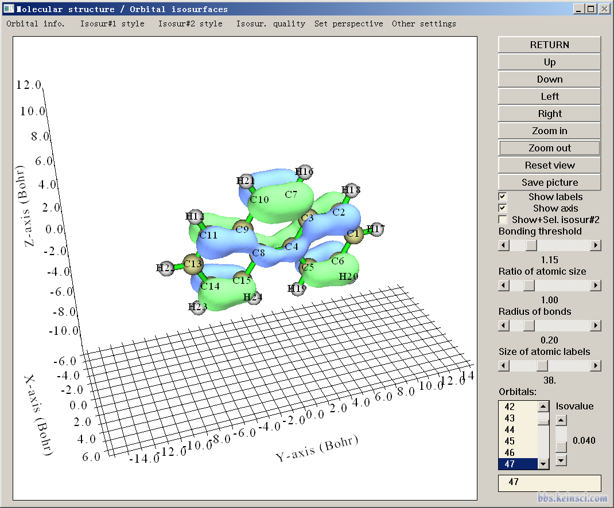
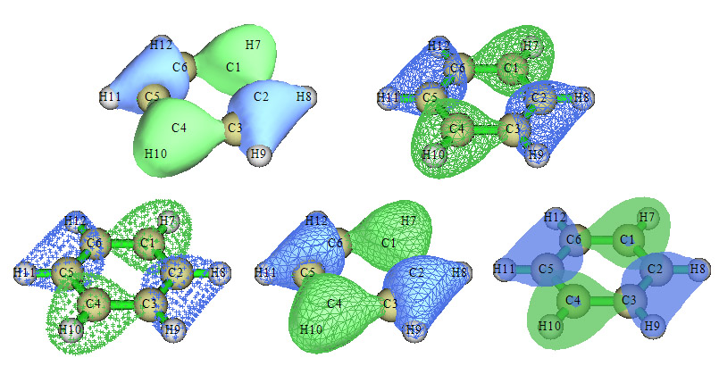
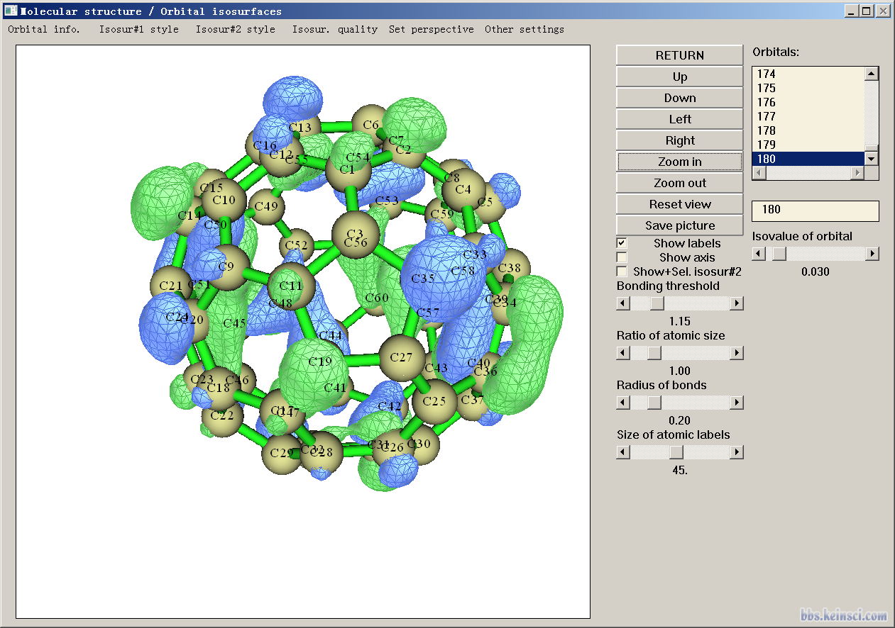
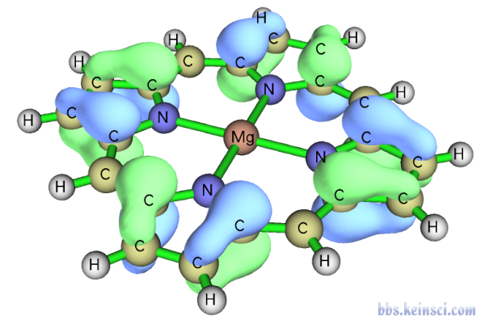
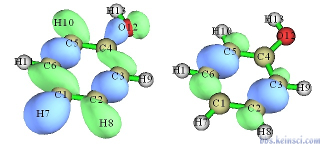
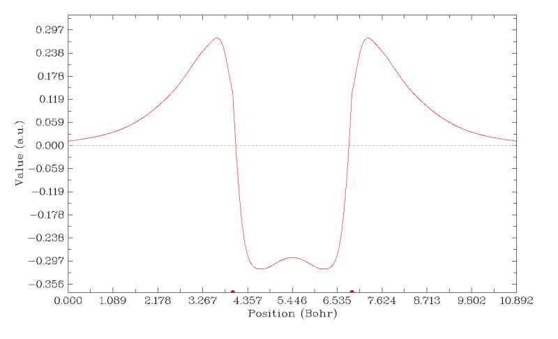
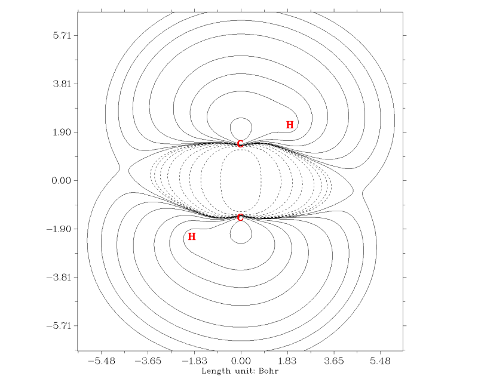
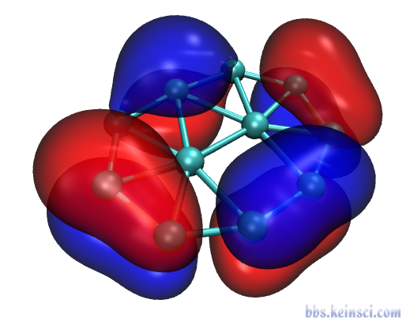
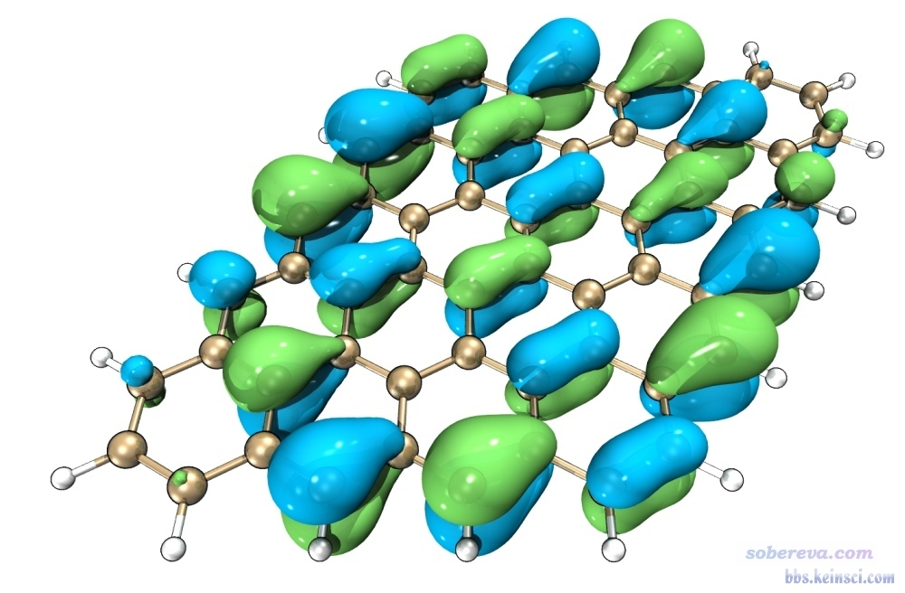
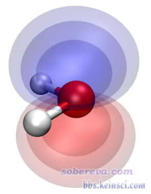

# 使用Multiwfn观看分子轨道

- 原帖 URL：<http://bbs.keinsci.com/thread-462-1-1.html>

## 楼层正文

### 1 楼（楼主）｜sobereva

sobereva 发表于 2017-11-9 15:31

确保用的是最新版本。老版本-3是在主界面里，3.4.1版被挪到主功能6里了。

用的版本是3.4，不知是不是最新的

### 2 楼

wudazhuang509 发表于 2017-11-10 15:05

用的版本是3.4，不知是不是最新的

主页上的总是最新的，现在是3.4.1

### 3 楼

sob老师，我想问下，我想知道某一个氨基酸对应哪些轨道，这个可以看出来吗

### 4 楼

853474282 发表于 2017-12-5 10:36

sob老师，我想问下，我想知道某一个氨基酸对应哪些轨道，这个可以看出来吗

这个问题本身就是错误的

如果你是指的分子轨道，通常是呈高度离域的，没有哪个分子轨道直接对应哪个片段之说。顶多是计算各个分子轨道中，体系中氨基酸那一部分对轨道的贡献是多少。（看《谈谈轨道成份的计算方法》http://sobereva.com/131）

### 5 楼

鉴于貌似有些人由于不会用Multiwfn误以为Multiwfn直接显示的轨道图形效果不好，我在此文第2节末尾加入了“总结：用Multiwfn直接绘制出好看的分子轨道图的一般建议流程”部分，按照这个建议可以很容易得到效果很不错的图，虽然比不上Multiwfn+VMD的组合，但也起码比gview强得多，和chemcraft效果至少能达到持平。

### 6 楼

更新了Multiwfn，支持了此功能：

将当前绘图设置（颜色、视角、分子显示方式、绘制轨道用的格点数等等）保存到当前目录下的GUIsettings.ini。以后只要选择载入GUIsettings.ini的选项，就可以立刻恢复之前的绘图设置

### 7 楼

应Multiwfn用户的需求，今日更新了官网上的Multiwfn，可以在主功能200的子功能3里直接基于HOMO、LUMO序号选择要导出的轨道，相应地在本文中增加了下面这段

在这个界面里，如屏幕上的提示所示，还可以基于HOMO、LUMO来选择要计算的轨道。比如输入h就代表选择HOMO、输入l就代表选择LUMO、h-3代表HOMO-3、l+2代表LUMO+2。对于非限制性开壳层波函数，还可以用比如ha-3代表alpha的HOMO-3、用比如lb+5代表beta的LUMO+5。不过这种方式选择轨道一次只能选择一个。

### 8 楼

社长，请问有通过脚本批量的把一大批分子的HOMO和LUMO轨道保存成图片的方法吗？

### 9 楼

Novice 发表于 2022-6-27 18:38

社长，请问有通过脚本批量的把一大批分子的HOMO和LUMO轨道保存成图片的方法吗？

结合VMD可以。写脚本对一批分子都产生HOMO、LUMO的cub文件，然后在VMD里写tcl脚本，依次读入，并且用绘图命令保存图片

之前论坛上有不止一个相关帖子，比如

http://bbs.keinsci.com/thread-10686-1-1.html

### 10 楼

本帖最后由 Freeman 于 2023-3-26 13:45 编辑 

社长，请问怎么用Multiwfn看gamess-us的局域轨道？gamess-us的局域轨道保存在gms文件的末尾（格式和正则轨道相同但没有轨道能量和虚轨道），用Multiwfn只能看到文件前面的正则轨道。

### 11 楼

Freeman 发表于 2023-3-26 13:42

社长，请问怎么用Multiwfn看gamess-us的局域轨道？gamess-us的局域轨道保存在gms文件的末尾（格式和正则轨 ...

自己写个程序转换格式，或者手动把定域化轨道部分信息覆盖MO部分

### 12 楼

请问一下，multiwfn的分子轨道排序算法是如何处理本征值（CMO的轨道能量，NO的占据数等）存在简并的情形呢？比如有一批结构相似的闭壳层分子都是HOMO二重简并的，如果只用标签h输出multiwfn排序下的HOMO（实际上只是HOMO之一），轨道分布、对应原子处的贡献等特征能保证一致吗？

我知道拿所有简并轨道出来一起展示、讨论是最合理的（就跟非限制性计算后分析两种自旋的alpha和beta轨道类似），但是真这样严谨的文献很难说有多少。

此文介绍了用整体的序号和从HOMO/LUMO开始计的序号选择分子轨道的方法，那么如何不借助外部工具按“在HOMO以下/LUMO以上一定的能量范围内”来选择轨道并批量输出信息呢？

### 13 楼

Uus/pMeC6H4-/キ 发表于 2025-10-22 09:54

请问一下，multiwfn的分子轨道排序算法是如何处理本征值（CMO的轨道能量，NO的占据数等）存在简并的情形呢 ...

即便是简并的MO轨道，实际在计算、记录时由于数值精度问题，一般也不会能量精确相同。

前线轨道简并时，若只拿其中一个轨道讨论分布，是完全误导的、不可接受的

没法不借助外部工具选择一定能量范围内的轨道

### 14 楼

sobereva 发表于 2017-11-9 15:31

确保用的是最新版本。老版本-3是在主界面里，3.4.1版被挪到主功能6里了。

用的版本是3.4，不知是不是最新的

### 15 楼

wudazhuang509 发表于 2017-11-10 15:05

用的版本是3.4，不知是不是最新的

主页上的总是最新的，现在是3.4.1

### 16 楼

sob老师，我想问下，我想知道某一个氨基酸对应哪些轨道，这个可以看出来吗

### 17 楼

853474282 发表于 2017-12-5 10:36

sob老师，我想问下，我想知道某一个氨基酸对应哪些轨道，这个可以看出来吗

这个问题本身就是错误的

如果你是指的分子轨道，通常是呈高度离域的，没有哪个分子轨道直接对应哪个片段之说。顶多是计算各个分子轨道中，体系中氨基酸那一部分对轨道的贡献是多少。（看《谈谈轨道成份的计算方法》http://sobereva.com/131）

### 18 楼

鉴于貌似有些人由于不会用Multiwfn误以为Multiwfn直接显示的轨道图形效果不好，我在此文第2节末尾加入了“总结：用Multiwfn直接绘制出好看的分子轨道图的一般建议流程”部分，按照这个建议可以很容易得到效果很不错的图，虽然比不上Multiwfn+VMD的组合，但也起码比gview强得多，和chemcraft效果至少能达到持平。

### 19 楼

更新了Multiwfn，支持了此功能：

将当前绘图设置（颜色、视角、分子显示方式、绘制轨道用的格点数等等）保存到当前目录下的GUIsettings.ini。以后只要选择载入GUIsettings.ini的选项，就可以立刻恢复之前的绘图设置

### 20 楼

应Multiwfn用户的需求，今日更新了官网上的Multiwfn，可以在主功能200的子功能3里直接基于HOMO、LUMO序号选择要导出的轨道，相应地在本文中增加了下面这段

在这个界面里，如屏幕上的提示所示，还可以基于HOMO、LUMO来选择要计算的轨道。比如输入h就代表选择HOMO、输入l就代表选择LUMO、h-3代表HOMO-3、l+2代表LUMO+2。对于非限制性开壳层波函数，还可以用比如ha-3代表alpha的HOMO-3、用比如lb+5代表beta的LUMO+5。不过这种方式选择轨道一次只能选择一个。

### 21 楼

社长，请问有通过脚本批量的把一大批分子的HOMO和LUMO轨道保存成图片的方法吗？

### 22 楼

Novice 发表于 2022-6-27 18:38

社长，请问有通过脚本批量的把一大批分子的HOMO和LUMO轨道保存成图片的方法吗？

结合VMD可以。写脚本对一批分子都产生HOMO、LUMO的cub文件，然后在VMD里写tcl脚本，依次读入，并且用绘图命令保存图片

之前论坛上有不止一个相关帖子，比如

http://bbs.keinsci.com/thread-10686-1-1.html

### 23 楼

本帖最后由 Freeman 于 2023-3-26 13:45 编辑 

社长，请问怎么用Multiwfn看gamess-us的局域轨道？gamess-us的局域轨道保存在gms文件的末尾（格式和正则轨道相同但没有轨道能量和虚轨道），用Multiwfn只能看到文件前面的正则轨道。

### 24 楼

Freeman 发表于 2023-3-26 13:42

社长，请问怎么用Multiwfn看gamess-us的局域轨道？gamess-us的局域轨道保存在gms文件的末尾（格式和正则轨 ...

自己写个程序转换格式，或者手动把定域化轨道部分信息覆盖MO部分

### 25 楼

请问一下，multiwfn的分子轨道排序算法是如何处理本征值（CMO的轨道能量，NO的占据数等）存在简并的情形呢？比如有一批结构相似的闭壳层分子都是HOMO二重简并的，如果只用标签h输出multiwfn排序下的HOMO（实际上只是HOMO之一），轨道分布、对应原子处的贡献等特征能保证一致吗？

我知道拿所有简并轨道出来一起展示、讨论是最合理的（就跟非限制性计算后分析两种自旋的alpha和beta轨道类似），但是真这样严谨的文献很难说有多少。

此文介绍了用整体的序号和从HOMO/LUMO开始计的序号选择分子轨道的方法，那么如何不借助外部工具按“在HOMO以下/LUMO以上一定的能量范围内”来选择轨道并批量输出信息呢？

### 26 楼

Uus/pMeC6H4-/キ 发表于 2025-10-22 09:54

请问一下，multiwfn的分子轨道排序算法是如何处理本征值（CMO的轨道能量，NO的占据数等）存在简并的情形呢 ...

即便是简并的MO轨道，实际在计算、记录时由于数值精度问题，一般也不会能量精确相同。

前线轨道简并时，若只拿其中一个轨道讨论分布，是完全误导的、不可接受的

没法不借助外部工具选择一定能量范围内的轨道

## 图片附件

以上为本帖已下载的 12 个图片附件。

## 入库完整性评估

- 全部楼层收录
