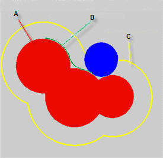

**谈谈分子体积的计算**On the calculation of molecular volume 

文/Sobereva @[北京科音](http://www.keinsci.com)

First release: 2011-Sep-20  Last update: 2022-Jan-14

  
  
我曾在网上数次看到有人问怎么算分子体积，从提问以及很多人的回答上看有不少人对这问题存在错误的认识，本文就来谈谈这个问题，既会说明基本原理，也会说明怎么具体计算。本文用到的Multiwfn程序可以在<http://sobereva.com/multiwfn>免费下载，相关知识见《Multiwfn FAQ》（<http://sobereva.com/452>）。  
    

## 1 分子体积的定义

首先要认识到，分子体积不是一个可观测量，在计算方法上也不可能有唯一的定义，因此“怎么计算分子体积”这个问题本身就是不严格的。  
  
分子体积就是分子表面内部空间的体积，由于分子表面也没有唯一的定义，所以不同的分子表面的定义就会给出不同的分子体积定义。首先看一个简单分子的例子  

红色区域是每个原子的范德华球（以原子核为中心，半径为范德华半径的球体）的叠加，这片区域就是分子的范德华体积，其表面也就被称作范德华表面。图中蓝球代表作为探针的溶剂分子（显然溶剂实际形状并不是球形，所以这个蓝球半径是“等效”的溶剂半径，在计算程序中通常是可调参数），让这个蓝球紧贴着分子范德华表面在各处滚一遍，就产生了图中绿色的轨迹，对应的表面叫做Connolly表面，由于溶剂分子不能触及到这个表面内的空间，所以也被叫做solvent-excluded表面，其内部区域的体积就叫做solvent-excluded体积。图中黄色是蓝球滚动时蓝球中心经过的表面，这个表面叫溶剂可及表面，其表面积就是所谓的SASA。

平时讨论化学问题时最常用的体积就是范德华体积。实际上范德华体积的定义并不唯一，上面说的原子范德华球叠加是比较简单的定义方式。这种定义存在两个缺点：  
(1)原子范德华半径没有唯一定义，不同研究者给出的值往往存在很大分歧，有些研究者给出的半径只包含很少量元素。关于原子半径的知识，看《简谈原子半径》（<http://sobereva.com/255>）  
(2)没有考虑到电子效应。因成键导致的电子转移、电子云变形效果都被忽略了。AIM理论的提出者Bader在J. Am. Chem. SOC., 109, 7968 (1987)提出过一种范德华体积的定义，消除了前述基于原子球叠加定义的弊端，并已被广泛接受，也就是若分子处于气相，则将电子密度为0.001 a.u.的等值面作为范德华表面，这种表面通常能够囊括分子98%以上的电子，这种范德华体积通常比范德华球叠加得到的范德华体积要大一些。而对于处于凝聚态的分子，考虑到分子间挤压、各种形式的相互作用，会使得范德华表面有一定穿透，Bader建议用电子密度为0.002 a.u.的等值面作为范德华表面（显然其体积小于0.001等值面对应的体积）。

用Bader的定义计算范德华体积由于涉及到计算很多点的密度，所以比使用范德华球叠加方式的定义要慢很多，对于大分子，Bader的定义会因为太昂贵而无法使用。如果你是做量子化学计算的人，我总是建议用Bader的定义，因为只要常用的DFT计算能算得动，Bader定义的范德华体积在Multiwfn中也总是能算容易地算出来的。笔者在不少文章里都使用了Bader的这种范德华定义，大家可以在发文章时引用来支持这种定义的使用：  
Carbon, 171, 514-523 (2021)  
J. Mol. Graph. Model., 38, 314-323 (2012)  
J. Phys. Org. Chem., 26, 473-483 (2013)  
Struct. Chem., 25, 1521-1533 (2014)  
如果你要算特大体系，比如蛋白质什么的，就只能算原子球叠加定义的范德华体积了。

下面第2、3节分别介绍两种计算分子体积的方法，在Multiwfn程序里都可以轻松实现。蒙特卡罗法可以用于原子球叠加和Bader定义的范德华体积的计算，MT方法只能用于计算Bader定义的范德华体积。计算Bader定义的范德华体积时我一般建议用MT方法，直接看第3节即可。

## 2 蒙特卡罗方法计算体积

计算范德华体积常用的方法之一是蒙特卡罗方法。首先，设立一个矩形盒子，将整个分子扩住，并且各个方向上都预留一定空间以避免将范德华表面截断，记这个盒子的体积为V_box。然后，在盒子里随机分布m个点，依次检验这些点是否符合条件。对于范德华球叠加方式的定义，如果当前点与任何一个原子核的距离小于相应原子的范德华半径，则认为此点符合条件；而对于Bader的定义，若当前点的电子密度大于阈值（0.001或0.002 a.u.），就认为符合条件。假设最后有n个点符合条件，那么分子的范德华体积就是n/m*V_box。

如果测试点数m较少，那么算出来的体积是不精确的，想要增加精度，就必须增加m。这就像人口普查，统计的人数越多结果越能反映实际国情。当然，分子越大，就需要越多的m，才能保证平均单位体积内随机点的数目不变，即保证统计精度不变。由于每次用蒙特卡罗方法计算体积时随机分布的点的位置都是不同的，因此符合条件的点数也会不同，故算出来的范德华体积的数值每次肯定会不同。m越大，由于统计误差约小，每次计算的结果的波动就会越小，但记住计算耗时与m是成正比的。如果你不知道m设多大的话，可以做个测试，如果算几次结果差异都不大的话，当前结果的数值误差就是较小的，可以用了，反之需要再增加m数。

曾有人问什么程序计算的范德华体积更精确。这个问题太含糊，没法回答。只能笼统地说，如果想较好地计算范德华体积，应当使用Bader的定义，用较高的随机点密度去做蒙特卡罗计算（或者用下一节的MT方法），并且用比较合理的方式产生用于计算电子密度的波函数。

Multiwfn的主功能100的主功能3是用来基于蒙特卡罗方法算分子体积的。在Multiwfn程序的settings.ini文件里，如果MCvolmethod被设为了1，代表使用范德华球叠加方式定义的体积，此时可以用Multiwfn支持的任意包含原子坐标信息的文件作为输入文件，如pdb/xyz/fch/gjf/mol/mol2/molden等等。如果MCvolmethod被设为了2（默认情况），代表使用电子密度等值面定义的体积，因此可以用来算Bader定义的范德华体积，此时需要用Multiwfn支持的含有体系电子波函数信息的文件作为输入文件，比如wfn/wfx/fch/molden/mwfn等（下文统称为波函数文件）。关于Multiwfn支持的文件格式详细介绍，以及含有波函数信息的文件如何生成，详见《详谈Multiwfn支持的输入文件类型、产生方法以及相互转换》（<http://sobereva.com/379>）。

来看具体怎么用Multiwfn算Bader定义的范德华体积。假设MCvolmethod为默认的2，启动Multiwfn，载入体系的波函数文件，然后选100，再选3。程序会提示你输入i、x和k值。这里i代表将会有100 * 2^i个随机点分布在盒子内，x对应等值面的电子密度数值，k代表盒子在分子周围留出的距离为k乘以内置的原子范德华半径。通常情况下，输入9,0.001,1.7就可以了，对于较大的分子，建议将i值设大来得到更准确的结果。输入后程序会立刻给出结果，比如：  
The molecular volume:  171.982 bohr^3, (   25.485 angstrom^3,   15.347 cm^3/mol)

如果要用原子范德华球叠加方式算范德华体积，先把MCvolmethod设为1，然后启动Multiwfn，载入含有体系结构信息的文件，然后选100，再选3。程序会提示你输入i，含义同上，也是越大越准确，输入完毕后就会看到结果。

## 3 基于MT算法计算体积

Marching Tetrahedron (MT)算法简单来说就是一种构建实空间函数等值面的方法，基于格点数据。很多可视化软件读取cube文件后显示的等值面实际上就是用MT方法产生的。Multiwfn的主功能12是做定量分子表面分析的，所涉及的分子表面就是靠MT算法基于电子密度格点数据产生的。程序在输出分子表面统计信息的同时也会一起把体积信息输出出来。如果用的是Multiwfn的默认设置，即使用0.001 a.u.电子密度等值面来定义分子表面，最后输出的体积显然就是Bader定义的范德华体积。

MT方法算的分子体积的精度取决于电子密度格点数据的格点间隔，间隔越小精度越高，但需要算的点数也越多，因此计算耗时越高、越消耗内存。在Multiwfn默认的格点间距下计算精度就已经足够高了。原理上，只要蒙特卡罗方法用的采样点数无穷多，MT算法用的格点间隔无穷小，两种方法的结果是精确相同的。在实际中，我更建议用MT方法来计算Bader的范德华体积，因为这没有蒙特卡罗方法的那种随机性，不用进行测试来判断采样点数是否够多。MT方法的缺点是对大体系耗内存较高，因为需要储存电子密度格点数据。

这里举一个简单的例子说明怎么用Multiwfn通过MT算法计算Bader的范德华体积。启动Multiwfn后，依次输入  
examples\phenol.wfn  //程序自带的苯酚的波函数文件  
12  //主功能12  
6  //做定量分子表面分析，但不考虑被映射的函数  
算完后就会看到输出的范德华体积  
Volume:   838.20232 Bohr^3  ( 124.20880 Angstrom^3)  
同时还输出其它一些信息，包括根据范德华体积和分子质量简单换算出来的密度（这和真实密度相差肯定很大，不要太当回事），以及范德华表面积  
Estimated density according to mass and volume (M/V):    1.2582 g/cm^3  
Overall surface area:         477.44282 Bohr^2  ( 133.69762 Angstrom^2)

默认情况下Multiwfn对分子表面的定义用的是电子密度0.001 a.u.等值面，比如想改成0.002 a.u.等值面来得到凝聚相下分子范德华体积，在选6之前先选1设定表面定义，选择Isosurface of electron density，然后输入0.002即可。

如果你想得到数值精度更高的结果，可以进一步改小格点间距。做法是在选6之前先选3定义格点间距，然后输入一个比屏幕上提示的当前值更小的值，比如0.2或0.18。注意格点间距越小，要算的点数就越多、越耗时，对内存需求也越高。用默认的格点间距得到的数值精度就已经足够好了，一般不需要改。

Multiwfn的主功能12在《使用Multiwfn的定量分子表面分析功能预测反应位点、分析分子间相互作用》（<http://sobereva.com/159>）里有专门的介绍，手册3.15节有更多原理细节的说明。非常详细的关于MT方法的介绍见笔者提出的改进版MT算法的文章J. Mol. Graph. Model., 38, 314 (2012)，这也是Multiwfn的主功能12实际用的算法。大家用主功能12发文章时除了引用Multiwfn启动时屏幕上提示的原文外也建议同时引用这篇文章。

## 4 其它问题

有人在某些数据库上查到“分子体积”或“范德华体积”，这里要强调的是，不要盲目地相信这些查到的数据！很多这些数据库里的数据仅仅是通过非常简单的模型（比如不同元素的原子数和连接关系）估算出来的，显然不如前文所述的方法算出来的体积更有合理性。使用、讨论这些查到的数据之前，一定先搞清楚这数据是怎么得来的！

虽然范德华体积没有唯一的定义，但在实验上一种相对有意义的范德华体积的定义是从物质的密度和分子质量上反推出来的分子体积（下面简称“实验范德华体积”。注意通过其它实验手段也可以定义不同的实验范德华体积）。有人会发觉并且抱有疑问，怎么这种实验范德华体积和电子密度0.002等值面包围的体积数值差距很大？其原因也是很明显的。前文计算分子体积得到的是对单个分子的描述，是单分子的性质。而密度是物质的宏观性质，由此反推出来的实验范德华体积本质上也是宏观性质。分子间的各种各样复杂的相互作用直接影响物质的宏观性质（范德华作用、静电作用、分子间挤压、构象变化等），也因此影响实验范德华体积的因素十分复杂，原理上就不可能仅仅基于单个分子的性质就准确得到这种实验范德华体积，否则就相当于只需要算个单分子就能准确得到物质的密度了。但是，通过前面的方法计算出的分子范德华体积，必然和实验范德华体积有相关性，并且对于同一类物质，偏差会是较为系统的。因此，可以自行拟合一个方程（通常线性的就可以），来将二者关联起来。

Gaussian程序里有个volume关键词也可以算分子体积，这本质上用的是第2节介绍的蒙特卡罗方法基于电子密度等值面算的体积。**我很不建议用这个关键词！**很不方便灵活，采样点数和等值面数值得通过抽象、很难记忆的IOp才能改，**而且在默认设置下算的结果极度不准确（差到根本不能用的程度）**，而把采样点数改得足够大使得结果误差足够小时耗时又特别高，远不如用Multiwfn根据本文第3节的方法来算。volume关键词输出的分子体积一例：  
Molar volume =  532.998 bohr**3/mol ( 47.564 cm**3/mol)  
注意这里bohr**3/mol明显是错的，应为Bohr**3。另外括号里的数据只是通过简单单位换算得到的密度，而并非是通过什么经验公式得到的能和实际物质密度相比较的值。  
PS：Volume关键词还会输出估计的Onsager半径，即Recommended a0 for SCRF calculation后面的数。我发现给出的以埃为单位的这个半径用的公式是：(V/pi)**(1/3) + 0.5，其中V是电子密度0.001 a.u.等值面内包围的以埃^3为单位的分子体积（显然，如上所述，Multiwfn也可以直接给出）。至于这个式子怎么来的我不清楚，手册里也没交代出处，应该有很强的经验性，可能根本都不靠谱，绝对不要当回事，而且Onsager模型对于研究实际问题早就过时了，切勿拿这里给出的半径说事。如果你要算分子半径，看《谈谈分子半径的计算和分子形状的描述》（<http://sobereva.com/190>）和《使用Multiwfn计算分子的动力学直径》（<http://sobereva.com/503>）。

值得一提的是，利用Multiwfn给出的分子范德华体积以及与静电势有关的一些输出，可以预测特定类型分子晶体的密度，见《使用Multiwfn预测晶体密度、蒸发焓、沸点、溶解自由能等性质》（<http://sobereva.com/337>）。

笔者还写过一篇文章，与本文有一点关系，感兴趣的读者可以看看：《使用Multiwfn可视化分子孔洞并计算孔洞体积》（<http://sobereva.com/408>）。

如果你想计算分子表面积，看这篇文章：《使用Multiwfn和VMD计算分子表面积和片段表面积》（<http://sobereva.com/487>）。
