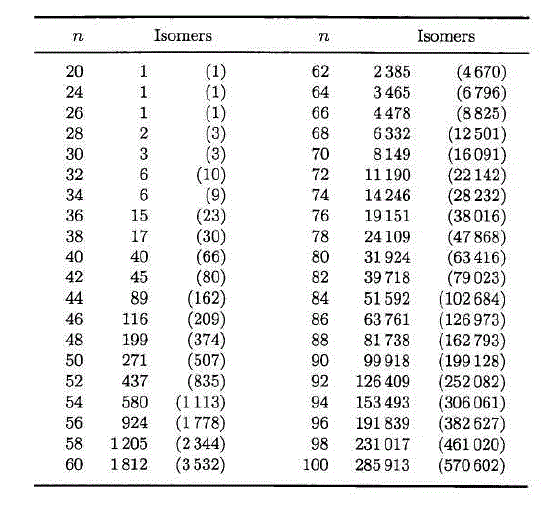
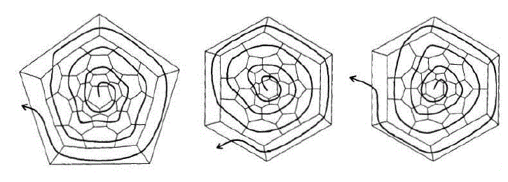
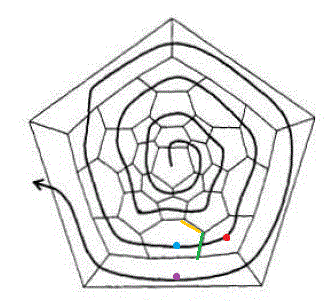
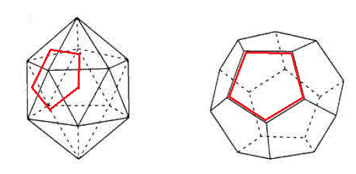
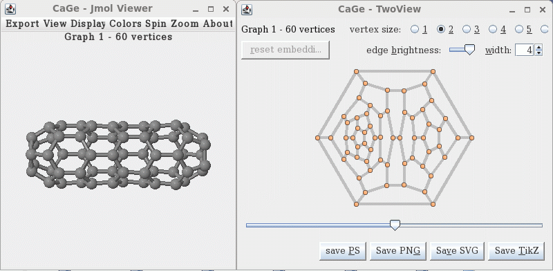
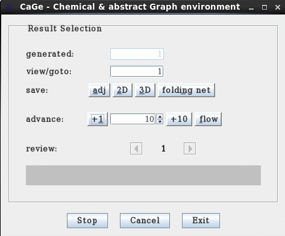

**生成富勒烯的螺旋算法简介以及使CaGe中的编号与Fowler-Manolopoulos编号相符的方法**  
An introduction to the spiral algorithm for generating fullerenes and a way to match the numbering in CaGe to the Fowler-Manolopoulos numbering

文/Sobereva @[北京科音](http://www.keinsci.com)   2011-Oct-4

近日有个网友，投了篇富勒烯包夹三金属氮化物的文章。她用的富勒烯是CaGe生成的，编号用的是CaGe生成时的顺序。然而审稿人要求必须使编号规则满足IUPAC推荐的编号规则，即Fowler-Manolopoulos编号系统。经过探索，现在笔者已找到办法让CaGe的编号顺序和Fowler-Manolopoulos编号系统对应上，将在此文介绍。在介绍具体做法前，将先顺便介绍一下富勒烯的结构、螺旋算法以及spiral和CaGe程序。

## 1 富勒烯结构简介

富勒烯(fullerene)是指由三价碳原子、只由五边形和六边形面构成的球状多面体。最常见的那种C60，即足球烯，是富勒烯的一种。通过欧拉定理可以证明富勒烯都是由偶数个碳原子构成，五边形一定有且只有12个。n个碳原子的富勒烯Cn包含n/2+2个面，n/2-10个是六元环。富勒烯没有原子数上限，最小的是C20，因为再小的话面数将少于12个，也就不可能包含12个五边形了。

IPR规则(isolated pentagon rule)是指富勒烯的五元环彼此之间不共点（与不共边的条件是等价的）。不满足IPR，即存在相连五元环的富勒烯是存在的，但符合IPR的富勒烯通常比不符合IPR的要稳定。最小的满足IPR的富勒烯是C60的最稳定的异构体，即足球烯，再大的就是C70。

一定原子数目的富勒烯可以有很多异构体，不同异构体的原子间连接关系不同。下图列出了各种碳原子数的富勒烯的可能的异构体数。由于所用的螺旋算法不能保证能找到所有可能的异构体，对于碳数多的富勒烯的异构体数可能比图中的更多。另外，C22连一种异构体也没有。图中括号里是考虑了对应异构体的情况。

这些异构体中，只有极少数满足IPR规则。例如C88的异构体中只有35个满足IPR。

## 2 生成富勒烯的算法--螺旋算法简介

生成富勒烯异构体，实际上也就是生成各种异构体中各个原子间的连接关系。连接关系可以以邻接矩阵来表示，这是对称矩阵，维度为n*n，若i,j原子相连接，则i,j矩阵元为1，否则为0。螺旋算法(spiral algorithm)是使用得最为广泛的一种生成富勒烯异构体的算法，原理比较清楚形象，虽然不能保证一定能够得到全部可能的异构体，但是对于380个原子以内的富勒烯是可靠的。螺旋算法比较适合低对称性的多面体构造，由于富勒烯的异构体对称性普遍很低，所以这种算法是适合的。螺旋算法在Fowler和Manolopoulos写的AN ATLAS OF FULLERENES一书(1995)中的第二章有介绍，这里只是说说梗概。

富勒烯可以用平面图来表示连接关系。例如下面的图就是唯一满足IPR的C60的异构体的平面图（先别管曲线），每条直线都是一个C-C键，五元环、六元环都能看得很清楚。注意每种异构体虽然唯一地定义一种连接关系，但是平面图的画法并不是唯一的，比如满足IPR的C60可以取一个六元环当成平面图的中心，即下图中间和右边那种，虽然图看起来和以五元环为中心时，即下图中左边那种不同，但是实际上是等价的。

在说明怎么通过螺旋算法构建异构体前，先来看看如何将一个异构体进行解螺旋。解螺旋时，从平面图的任意一个面开始（为了看起来方便通常取图中间的），一圈一圈穿过各个面，就会得到一个螺旋序列，例如上图左、中、右三种解螺旋路径会分别得到下面这些螺旋序列  
56666656565656566565656565666665  
65655566656656656566566565656566  
66565656566566565665665666565656  
即如果穿过的是五元环，序列中就是5，若是六元环，就写6。解螺旋的路径不是随意的画画圈就行。下一个要到达的面，必须紧埃着刚才的面，且同时挨着上一圈螺旋中第一个敞开的面。例如下图中，当目前位置是红点所在的面时，下一个面必须是蓝点对应的面，因为蓝点的面与刚才的红点的面挨着（绿线），同时和上一个螺旋第一个开放的面挨着（黄线。第二个开放的面就是指黄线左边的横线）。紫色的面不能作为下一个面，因为虽然挨着红点的面，但是不挨着黄线。解螺旋过程未必都能成功，有可能解到某个面时，发现无法找到满足要求的下一个面，此时解螺旋宣告失败。一种异构体，从某些面开始可以成功解螺旋（即所有面都能按要求地经过），而从某些面开始解螺旋则会失败。可以证明最多有6n种可能的解螺旋路径（包括对称等价的路径）。而一些原子数很大的富勒烯，如C380的一种异构体，甚至无法找到任何一种能够成功解螺旋的路径，此时，也就不可能按下文的过程通过螺旋算法来获得这种异构体了，这就是为什么说螺旋算法不保证能找到所有异构体。

同一个异构体的各种螺旋序列是等价的，为了避免模糊性，就有必要从中选一个序列来唯一代表那种异构体，通常选择序列对应的数值最小的那个序列，也叫正则(canonical)螺旋序列。因此，上面给出三种序列中第一种就是正则螺旋序列。

将解螺旋过程反过来，就可以构建异构体。首先，生成所有可能的螺旋序列。n个原子的富勒烯，由于有n/2+2个面，12个五元环，n/2-10个六元环，根据排列组合规则可知，总共有(n/2+2)!/12!/(n/2-10)!种排法。然后，依次尝试将这些螺旋序列按照规则卷起来（解螺旋的逆过程），看看能否成功。所有螺旋中只有少数能够通过这个检测。剩下的螺旋序列中有大量是等价的，因此，需要再把成功卷起来的每种异构体再以全部6n种可能方式解开，找出等价的螺旋序列，并保留正则螺旋序列。这样，寻找异构体的过程就结束了，我们得到了正则螺旋序列，也得到了相应的异构体的面之间邻接关系。在上述过程中，可以很容易地将IPR作为限制条件，搜索出的异构体的数量将会大为减少，搜索速度也会大为加快。

最后还要说一下dual(对偶)概念，会在下文用到。一个多面体的dual，就是将这个多面体的面替换成顶点，并根据原来的面的相邻关系将这些顶点连接起来。例如下图，左边是20面体，它的dual就是12面体。由红线所示，在左侧的一些面的中间取一点，根据面相邻的关系将点相连，就得到了dual的顶点和边。也就是说，多面体的面之间的邻接关系，实际上就是这个多面体的dual的顶点之间的邻接关系，它们包含的信息是相同的。另外值得一提的是，对dual再取dual就恢复为原始多面体；dual中的面的边数就是原始多面体相应顶点的价数（即那个顶点与多少个其它顶点相连）。由于在富勒烯中每个碳都与另外三个碳相连，所以Cn富勒烯的dual就是由n个三角形组成的多面体。

## 3 Fowler-Manolopoulos编号系统和spiral程序

富勒烯的异构体非常多，而且本身原子数也很多，因此如果不在文献中使用一个标准的编号系统，会使交流变得很困难。Fowler-Manolopoulos编号系统是被广为使用的，写为Cn:xxxx形式。n是原子数，xxxx就是这种异构体在Fowler和Manolopoulos编纂的AN ATLAS OF FULLERENES一书的附录中给出的生成富勒烯异构体程序中的生成顺序。例如C60共有1812个异构体，符合IPR的唯一一种C60异构体在书中的程序中是最后一个输出，因此这个异构体就叫C60:1812。

书里的程序在本文中将称为spiral。这个程序功能远没有下面介绍的CaGe那么强大，而且速度颇慢，但是由于只有利用这个程序才能得到异构体的Fowler-Manolopoulos编号，所以十分重要。其它的生成富勒烯异构体的程序还有很多，但是由于使用的算法不同，而即便是使用了螺旋算法的程序，如著名的CaGe，由于在内部生成初猜的螺旋序列的顺序不同，导致输出的异构体的顺序也和Fowler-Manolopoulos编号不符。如何找到CaGe输出的异构体的序号和Fowler-Manolopoulos编号之间的关系（或者说spiral输出的异构体的序号），就是后文要解决的。在此，首先介绍spiral程序的使用。

spiral的代码和编译好的可执行文件（Win32版）可以在这里下载：[/usr/uploads/file/20150610/20150610015730_61465.rar](http://sobereva.com/usr/uploads/file/20150610/20150610015730_61465.rar)  
代码主体是从那本书里搬下来的，为了能够同时输出异构体的指纹（根据邻接矩阵生成的一个能够唯一标识这种异构体的浮点数，详见第五节），笔者在原始代码的基础上进行了改造，编译时还需要blas和lapack库文件，因为生成指纹时用到了lapack的对称矩阵对角化子程序。编译很简单，比如在intel visual fortran里，把那四个.f90文件和blas、lapack库文件都拖到工程的Source Files里，然后编译即可；若是Linux下用ifort，就运行ifort -O3 *.f90 lapack.a blas.a -o spiral。

程序使用很简单，每一步都有提示。  
(1)首先输入碳原子数以及是否需要满足IPR。例如要生成C60全部异构体，符合与不符合IPR的都包括在内，就输入60,0。  
(2)选择是否输出异构体的指纹。如果输入0，就不输出指纹，也不输出邻接矩阵。如果输入1或2，就输出指纹，1代表生成指纹用的邻接矩阵是富勒烯的dual的顶点的邻接矩阵（或者说，是富勒烯的面的邻接矩阵）；若是2，就代表用的是富勒烯的顶点的邻接矩阵。  
(3)如果上一步选择了输出指纹，则程序还会问你是否把邻接矩阵也输出出来。1代表输出。输出的邻接矩阵是什么邻接矩阵，对应于上一步选的是1还是2。

看个例子。这里要生成C36的全部异构体，并输出各种异构体的顶点的邻接矩阵的指纹，同时也输出邻接矩阵本身。于是就依次输入  
32,0  
2  
1  
屏幕上立刻输出总共找到的6种异构体  
-----------------------------------------------------------------------------  
       1   C2   1  2  3  4  5  7 12 14 15 16 17 18   16 x  2  
       2   D2   1  2  3  4  5  8 12 13 15 16 17 18    8 x  4  
       3  D3d   1  2  3  4  5  9 12 13 14 16 17 18    1 x  2,  1 x  6,  2 x 12  
       4   C2   1  2  3  4  7 10 11 12 14 15 17 18   16 x  2  
       5  D3h   1  2  3  4  7 10 11 13 14 16 17 18    1 x  2,  3 x  6,  1 x 12  
       6   D3   1  2  3  5  7  9 10 12 14 16 17 18    1 x  2,  5 x  6  
-----------------------------------------------------------------------------  
第一列，即输出序号，就是这种异构体的Fowler-Manolopoulos编号。第二列是点群。后面12个数字是螺旋序列中12个五元环所在位置。最后一块是13C NMR信号，这里不做讨论。  
同时，各个异构体的顶点的邻接矩阵输出到了当前目录的adjmat.txt里，比如第一个异构体的前四行是  
01010010000000000000000000000000  
10100000100000000000000000000000  
01001000001000000000000000000000  
10001100000000000000000000000000  
....  
说明其中第一个碳原子与2、4、7号碳原子相连，第二个碳原子与1、3、9号碳原子相连...  
同时，当前目录下fp.txt记录了全部异构体的指纹，如下所示  
           1  -7.27828597613050       
           2   41.8007533755431       
           3   41.7891354377565       
           4   23.6786023771991       
           5   43.7753607538324       
           6   48.6561193681689

## 4 CaGe使用简介

CaGe是Linux平台下的历史悠久的生成各种类型多面体结构的程序，还特别包括富勒烯、碳管等类型。该程序不仅可以生成结构，还可以通过基于java的图形界面直接观看结构，十分方便。生成速度也非常快，远远超越spiral。CaGe可以免费从<http://www.mathematik.uni-bielefeld.de/~CaGe/>下载。

在编译CaGe前，系统里必须安装JDK（仅安装java运行环境，即JRE是不够的）。  
解压CaGe安装包后，在其目录下运行./INSTALL，程序一般会说找不到java的路径（哪怕已经将JDK安装在了默认路径下），于是输入?然后输入/usr让程序在此目录下自行寻找java路径。在笔者的RHEL6-U1 64bit系统在安装时已经装了openjdk，于是安装脚本找到了java的路径是/usr/lib/jvm/java-1.6.0-openjdk-1.6.0.0.x86_64/bin，输入1（对应于这个路径的编号），CaGe就开始编译了。

运行cage.sh就可以启动CaGe的图形界面。实际上也可以直接通过命令行方式调用结构生成器而不经过图形界面。各种结构的生成器都在CaGe安装目录下的Generators目录下，比如fullgen就是用来生成富勒烯的程序。

这里以观看C60的异构体为例介绍使用方法。首先启动图形界面，选3-regular plane graphs，选fullerenes标签页，将最小和最大原子数都设成60，然后点next进入输出方式的设定界面。将3D representation和2D representation都勾上，并都选择为Viewer，选Start，就会如下图看到平面图和立体结构。实际上，CaGe是由很多模块构成的，生成器模块只生成邻接关系，而所看到的平面和三维坐标是通过所谓的embed模块通过读取邻接关系后转化而成的。CaGe生成的三维结构并不是准确的，想获得准确结构需要用量子化学方法优化。

同时还出现一个窗口用于选择要生成并显示的异构体，如下图。view/goto里填入指定数字就可以显示指定序号的异构体。advance可以以1为步进或者以指定数目为步进显示后续的异构体。点flow会寻找并显示能够生成的最后一个异构体，对于C60，就会最后在1812号停住。之前浏览过的异构体可以用review的左右按钮来切换。注意异构体是在后台按顺序生成的，如果想浏览第m个异构体，那么程序就会把前m个异构体的邻接关系在后台全都生成出来（即generated所显示的数量），并且接下来只能浏览编号大于m的异构体，而不能返回去浏览漏过去的编号小于m的异构体，除非某些编号小于m的异构体在之前已经浏览过（浏览过的异构体的平面和三维坐标会被记录了下来，可以再次浏览）。看完后点exit可推出程序，cancel则返回主界面。

如果想一次将所有异构体的顶点的邻接关系存到一个文件里，可以在设定输出方式时勾上Adjacency information，并选择File，format选writegraph，点start之后就会看到出现一个小窗口显示生成到了多少，显示finished时代表生成结束。这时可以检查当前目录下full_60.w0d文件，可以用文本编辑器打开，里面记载了各个异构体中每个原子和另外哪三个原子相连。  
如果想把所有异构体的三维结构输出到pdb文件里，则设定输出方式时勾上3D representation，选File，Format选pdb。这样得到的pdb可以用VMD等程序打开，每一帧对应一个异构体。

## 5 寻找CaGe的编号与Fowler-Manolopoulos编号的关联

原理上讲，可以通过修改CaGe的fullgen程序代码让其输出的异构体序号满足Fowler-Manolopoulos编号，但是这个程序里不仅注释，甚至连变量名都是德文，而且代码颇长，很难修改。因此，为寻找CaGe生成的异构体的编号与Fowler-Manolopoulos编号的关联，应通过比较CaGe输出的邻接信息与Spiral输出的邻接信息来实现。显然，最直白的比较方式就是比较邻接矩阵，看看是否相同，相同则为同一个异构体。但是这样做有两个问题：(1)原子编号在CaGe里和spiral里通常不一样，所以必须考虑以各种方式对行和列进行置换后再进行比较，这显然太麻烦，而且十分耗时。(2)对于原子数多的情况，全部邻接矩阵记录下来的话会占很大硬盘。所以，笔者想出一个办法，就是给每个异构体生成一个唯一的数字，可以称之为指纹。通过比较指纹是否相同，来判断异构体是否相同会有效率得多。

如果两个异构体相同，无论原子编号是否一致，它们的邻接矩阵的本征值是一定相同的（改变编号顺序等于做矩阵的相似变换，这不影响本征值）。因此，可以用比较本征值来代替比较矩阵，问题大大简化。然而本征值的数目也是很多的，为了比较更为方便，可以将矩阵的一串本征值压缩成为一个称为指纹的数。构建指纹的算法无穷多，但要求是必须能让不同的异构体的指纹差异比较大，这样一个异构体才能被一个指纹唯一、清楚地代表。笔者尝试了不少构建方法，最后决定用这种形式：  
nint(eig(1))-eig(1)+nint(100*(tmpval-nint(tmpval)))+sum(eig(N-5:N-3))  
其中tmpval=10*(eig(2)+eig(7))，eig是本征值从小到大的序列，nint代表取浮点数最近的整数，N是总原子数。这种定义看似很诡异，的确，这是很随意的，它确实能让指纹差异较大。

（实际上，最好的办法是直接比较异构体的正则螺旋序列是否相同，这才是最清楚、严格的指纹。然而CaGe并不能输出正则螺旋序列，笔者也不打算修改CaGe使之能生成。）

介绍完原理，现在看看具体实现。下面是笔者编写的adjmat2eig程序，它可以读取CaGe生成的富勒烯的顶点的邻接信息（.w0d文件），然后生成邻接矩阵，之后计算指纹，最后与spiral生成的记载了指纹的文件进行比较，输出CaGe的编号与Fowler-Manolopoulos编号的对应表。这个程序的源代码文件和编译好的程序(win32)可以由此下载：[/usr/uploads/file/20150610/20150610015826_27110.rar](http://sobereva.com/usr/uploads/file/20150610/20150610015826_27110.rar)。编译时也需要blas和lapack库。

这里介绍下这个程序的代码  
============================================================  
program Adjmat2eig  
implicit real*8 (a-h,o-z)  
character*80 filename  
real*8,allocatable :: adjmat(:,:),eigvecmat(:,:),eigvalarr(:),fp1(:),fp2(:)  
integer,allocatable :: linkfound(:)  
integer tmparr(4)

write(*,*) "Adjmat2eig"  
write(*,"(a)") "Read adjacent matrix of vertices of fullrene outputted by CaGe (.w0d) and calculate eigenvalues then generate fingerprints"  
write(*,*) "Written by Sobereva ([sobereva@sina.com](mailto:sobereva@sina.com)), 2011-Oct-3"  
write(*,*)  
write(*,*) "Input filename"  
read(*,"(a)") filename  
!读取.w0d文件，其中记录的必须是富勒烯的顶点的邻接信息，而不能是其dual的顶点的邻接信息。如果输入的文件名叫result.txt，则直接从此文件中读取指纹数据，而不利用邻接关系重新生成  
open(10,file=filename,status='old')  
if (filename=="result.txt") write(*,*) "The fingerprints will be loaded from result.txt directly"  
write(*,*) "Input number of atoms"  
read(*,*) natom !富勒烯的原子数  
write(*,*) "Input number of isomers recorded in this file"  
read(*,*) nisomer !此文件内记录的异构体数目  
allocate(adjmat(natom,natom),eigvecmat(natom,natom),eigvalarr(natom),fp1(nisomer),fp2(nisomer),linkfound(nisomer))

if (filename=="result.txt") then  
 do iso=1,nisomer  
  read(10,*) nouse,fp1(iso)  
 end do  
 close(10)  
 goto 1  
end if

write(*,*) "If also output reformatted adjacent matrix? 0/1=no/yes"  
read(*,*) ioutadjmat  
!是否把由CaGe的.w0d文件转化出的邻接矩阵也输出出来  
if (ioutadjmat==1) open(11,file="isomat.txt",status='replace')  
open(12,file="result.txt",status='replace')

write(*,*) "Please wait..."  
do iso=1,nisomer  
 adjmat=0D0  
 read(10,*)  
 do iatom=1,natom !读取.w0d文件  
  read(10,*) tmparr  
  adjmat(iatom,tmparr(2:4))=1D0 !构造邻接矩阵  
 end do  
 if (ioutadjmat==1) then  
  write(11,"(a,i12,a)") "=========== isomer:",iso," ==========="  
  do itmp=1,natom  
   do jtmp=1,natom  
    write(11,fmt="(i1)",advance='no') nint(adjmat(itmp,jtmp)) !输出各个邻接矩阵到isomat.txt  
   end do  
   write(11,*)  
  end do  
 end if  
 call diagsymat(adjmat,eigvecmat,eigvalarr,istat,natom) !将邻接矩阵adjmat对角化，eigvalarr是由小到大排序的本征值数组  
 tmpval=10D0*(eigvalarr(2)+eigvalarr(7))  
 fp1(iso)=nint(eigvalarr(1))-eigvalarr(1)+nint(100D0*(tmpval-nint(tmpval)))+sum(eigvalarr(natom-5:natom-3)) !生成指纹，fp1的第i个元素就是CaGe的第i个异构体的指纹  
 write(*,*) iso,fp1(iso) !输出到屏幕  
 write(12,*) iso,fp1(iso) !也输出到result.txt  
end do

close(10)  
close(11)  
close(12)  
write(*,"(a)") "Done! The results shown above have also been outputted to result.txt in current folder"  
if (ioutadjmat==1) write(*,"(a)") "Reformatted adjacent matrix has been outputted to isomat.txt in current folder"  
write(*,*)

1 write(*,*) "Make connection for the result with which file?"  
read(*,"(a)") filename  
!输入另一个记录了各个异构体指纹的文件的名字，注意格式必须和spiral输出的fp.txt文件或者本程序输出的result.txt一样。此文件内异构体的数目也必须和前面输入的一样  
open(10,file=filename,status='old')  
do iso=1,nisomer !载入另一个文件记录的指纹  
 read(10,*) nouse,fp2(iso)  
end do  
close(10)  
open(11,file="relat.txt",status='replace')  
linkfound=0 !这个数组用于记录当前文件（就是指.w0d文件或者一开始直接载入的result.txt）内的异构体序号与另一个文件内的异构体序号的对应关系  
iwarndouble=0  
iwarnlack=0  
write(*,*) "The connection between isomers recorded in the two files"  
write(*,*) "     Current file                   Another file"  
do iso1=1,nisomer !依次选择当前文件中的每个异构体的指纹，与另一个文件中异构体的每个指纹进行比较  
 do iso2=1,nisomer  
  if (abs(fp1(iso1)-fp2(iso2))<1D-10) then !判据。考虑到数值精度，如果两个指纹间的差异小于1D-10就代表这两个异构体等价  
   if (linkfound(iso2)/=0) then !另一个文件记录的第iso2号异构体此前已经与当前文件的一个异构体linkfound(iso2)有对应关系了，此时说明当前文件内iso1和linkfound(iso2)异构体的指纹太相近，导致都能对应上另一个文件中的iso2异构体的指纹。此时，需要调整指纹的生成算法（别忘了在spiral程序里也对应地修改算法，使二者一致），或者将差异的判据设得更严格  
    warndouble=1  
    write(*,"('Warning: The isomer',i12,' in another file has already linked to isomer',i12,' in current file')") iso2,linkfound(iso2)  
    write(11,"('Warning: The isomer',i12,' in another file has already linked to isomer',i12,' in current file')") iso2,linkfound(iso2) !同时在屏幕上和relat.txt中显示警告信息  
   end if  
   linkfound(iso2)=iso1  
   write(*,"(i12,'           -------->',i12)") iso1,iso2  
   write(11,"(2i12)") iso1,iso2 !同时在屏幕上和relat.txt中输出对应关系  
   exit  
  end if  
  if (iso2==nisomer) then !说明当前文件中第iso1号异构体在另一个文件中找不到等价异构体，即没有相符的指纹。既有可能这是真实情况，也有可能是因为判据太严，且数值精度不够，导致本来是等价构体的指纹间的差异大于判据。此时应放宽判据，但判据放得太宽，就容易导致不是等价的异构体因为指纹相近也被认为是等价的  
   iwarnlack=1  
   write(*,"(a,i12,a)") "Warning: Cannot find connection for isomer",iso1," of current file"  
   write(11,"(i12,a)") iso1,"  ????????"  
  end if  
 end do  
end do  
close(11)  
write(*,"(a)") "Done! The relationship shown above has also been outputted to relat.txt in current folder"  
if (iwarndouble==1) write(*,*) "You may need to tighten the criteria for comparison"  
if (iwarnlack==1) write(*,*) "You may need to lower the criteria for comparison"  
write(*,*) "Press Enter to exit"  
pause  
end program

!下面这个子程序用来将lapack库里面的DSYEV子程序重新封装成简洁形式，因为DSYEV的参数太多，使用不便。DSYEV用来将对称矩阵对角化。如果istat不为0，说明子程序执行出错。  
subroutine diagsymat(mat,eigvecmat,eigvalarr,istat,nsize)  
integer istat  
real*8 mat(nsize,nsize),eigvecmat(nsize,nsize),eigvalarr(nsize)  
real*8,allocatable :: lworkvec(:)  
allocate(lworkvec(3*nsize-1))  
call DSYEV('V','U',nsize,mat,nsize,eigvalarr,lworkvec,3*nsize-1,istat)  
eigvecmat=mat  
mat=0D0  
forall (i=1:nsize) mat(i,i)=eigvalarr(i)  
end subroutine

## 6 实例：寻找C88的CaGe的编号对应的Fowler-Manolopoulos编号

这里，我们将结合使用CaGe、spiral和Adjmat2eig程序来寻找CaGe生成的C88全部异构体的编号对应的Fowler-Manolopoulos编号。

首先，在CaGe里按照前文所述方法，生成C88全部异构体的邻接信息，储存到full_88.w0d，这个文件已经在Adjmat2eig程序压缩包里面提供。然后，使用spiral生成C88全部异构体的指纹，即启动程序后依次输入  
88,0  
2  
0             //邻接矩阵没必要输出，所以选0  
在笔者的机子上(i7-2630QM)经过20分钟左右程序运行完毕。实际上，当程序输出到81738时就可以停掉程序了，因为已知C88只有这么多异构体，这些异构体的指纹也已经同步输出到了fp.txt。fp.txt已在Adjmat2eig程序压缩包里面提供。

启动Adjmat2eig，依次输入  
full_88.w0d  
88   //原子数  
81738  //文件中异构体数  
0   //没必要输出邻接矩阵。而且输出的话很占硬盘，还降低程序运行速度  
现在程序开始生成CaGe生成的异构体的指纹，生成完毕后，输入  
fp.txt  
程序就开始将刚刚生成的指纹与fp.txt里的进行比较，同时在屏幕上输出进程，这些内容也会输出到当前目录下relat.txt文件里。此文件里前几行为  
           1        3646  
           2        4622  
           3        4623  
           4           4  
           5           3  
           6        3660  
           7        3661  
           8        3659  
           9        3658  
......  
也就比如说，CaGe生成的第8号异构体，按照Fowler-Manolopoulos编号就应该写为C88:3659。搜索一下relat.txt，发现没有warning和???字样，说明CaGe的每个异构体都完美地找到了对应的Fowler-Manolopoulos编号。
