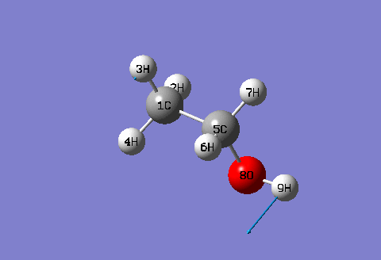

**Gaussian中分析振动模式成份的关键词freq=intmodes**  
The keyword freq=intmodes for analyzing components of vibrational modes in Gaussian

文/Sobereva @[北京科音](http://www.keinsci.com/)   2011-Oct-27

在Gaussian中，在freq关键词中有一个对分析振动模式很有用的选项intmodes，可惜在手册中对它的描述十分晦涩，导致很多人没注意到它。这里简单介绍一下。

freq=intmodes可以把每个简正振动模式分解为各个冗余内坐标的贡献。这可以将振动模式的讨论定量化，也可以帮助指认振动模式的特征。这里以HF/6-31G*下的乙醇为例说明。下面的动画是乙醇的第二个振动模式

用了freq=intmodes后，在热力学数据输出的后面，可以找到这个振动模式中各个冗余内坐标所占成份

                           ----------------------------  
                           ! Normal Mode     2        !  
 --------------------------                            --------------------------  
 ! Name  Definition              Value          Relative Weight (%)             !  
 --------------------------------------------------------------------------------  
 ! D1    D(2,1,5,6)             -0.0977                  3.5                    !  
 ! D2    D(2,1,5,7)             -0.0977                  3.5                    !  
 ! D3    D(2,1,5,8)             -0.1078                  3.9                    !  
 ! D4    D(3,1,5,6)             -0.1015                  3.7                    !  
 ! D5    D(3,1,5,7)             -0.1015                  3.7                    !  
 ! D6    D(3,1,5,8)             -0.1116                  4.0                    !  
 ! D7    D(4,1,5,6)             -0.0977                  3.5                    !  
 ! D8    D(4,1,5,7)             -0.0977                  3.5                    !  
 ! D9    D(4,1,5,8)             -0.1078                  3.9                    !  
 ! D10   D(1,5,8,9)              0.6058                 21.9                    !  
 ! D11   D(6,5,8,9)              0.5882                 21.3                    !  
 ! D12   D(7,5,8,9)              0.5882                 21.3                    !  
 --------------------------------------------------------------------------------

可见，三个二面角D(1,5,8,9)、D(6,5,8,9)和D(7,5,8,9)所占成分很大，总共占了约65%。与动画对照，确实这个数值是比较合理的。D1至D9这些二面角都是对应甲基扭转，总共占约33%。因此，在描述这个振动模式时可以写 33% τ(C-C), 65% τ(C-O)，这里τ符号通常用来表示扭转项。

通过查看冗余内坐标的贡献，不需要通过观看动画，也能很容易地想象出振动方式，例如乙醇的第19个模式  
                           ----------------------------  
                           ! Normal Mode    19        !  
 --------------------------                            --------------------------  
 ! Name  Definition              Value          Relative Weight (%)             !  
 --------------------------------------------------------------------------------  
 ! R1    R(1,2)                 -0.5164                 20.6                    !  
 ! R2    R(1,3)                  0.8206                 32.8                    !  
 ! R3    R(1,4)                 -0.5164                 20.6                    !  
 ! R5    R(5,6)                  0.056                   2.2                    !  
 ! R6    R(5,7)                  0.056                   2.2                    !  
 ! A2    A(2,1,4)                0.0474                  1.9                    !  
 ! A5    A(3,1,5)               -0.0474                  1.9                    !  
 ! D1    D(2,1,5,6)             -0.0358                  1.4                    !  
 ! D2    D(2,1,5,7)             -0.0508                  2.0                    !  
 ! D3    D(2,1,5,8)             -0.0433                  1.7                    !  
 ! D7    D(4,1,5,6)              0.0508                  2.0                    !  
 ! D8    D(4,1,5,7)              0.0358                  1.4                    !  
 ! D9    D(4,1,5,8)              0.0433                  1.7                    !  
 --------------------------------------------------------------------------------  
占成分最大的三个内坐标都是C-H bond项（共占74%），其中R2的Value是正值，R1和R3是负值，即相位相反。因此，这个振动模式主要特征是甲基的不对称伸缩振动。

使用freq=intmodes的时候可以自定义冗余内坐标，给研究振动模式的成份带来很大的灵活性。例如，在乙醇第二个振动模式的动画中，可以看到7号和9号原子之间的距离在振动过程中会有很大变化。于是，可以尝试给7号和9号原子间增加一个冗余内坐标，来了解它对此振动模式的贡献。方法是写上freq=(modredundant,intmodes)，然后在分子坐标后面空一行写B 7 9。此时输出的结果为  
                          ----------------------------  
                           ! Normal Mode     2        !  
 --------------------------                            --------------------------  
 ! Name  Definition              Value          Relative Weight (%)             !  
 --------------------------------------------------------------------------------  
 ! R8    R(7,9)                  0.379                  12.0                    !  
 ! D1    D(2,1,5,6)             -0.0977                  3.1                    !  
 ! D2    D(2,1,5,7)             -0.0977                  3.1                    !  
 ! D3    D(2,1,5,8)             -0.1078                  3.4                    !  
 ! D4    D(3,1,5,6)             -0.1016                  3.2                    !  
 ! D5    D(3,1,5,7)             -0.1016                  3.2                    !  
 ! D6    D(3,1,5,8)             -0.1116                  3.5                    !  
 ! D7    D(4,1,5,6)             -0.0977                  3.1                    !  
 ! D8    D(4,1,5,7)             -0.0977                  3.1                    !  
 ! D9    D(4,1,5,8)             -0.1078                  3.4                    !  
 ! D10   D(1,5,8,9)              0.6057                 19.3                    !  
 ! D11   D(6,5,8,9)              0.5882                 18.7                    !  
 ! D12   D(7,5,8,9)              0.5882                 18.7                    !  
 --------------------------------------------------------------------------------  
新增加的冗余内坐标R8所占成份确实不小，达到12%。由于它描述了部分原本被D10、D11和D12所描述的振动特征，故D10、D11和D12所占成分相比在新增R8之前有所下降。

曾经寡人写过一个用GAR2PED读取Gaussian输出文件做PED分析的帖子，可以将简正振动模式分解成各个基团特征振动模式的贡献，见<http://sobereva.com/75>，其中也介绍了振动模式分解方法的基本原理。虽然freq=intmode和GAR2PED都是用来将振动模式分解，但二者还是有差别的。freq=intmode是以冗余内坐标为基，而GAR2PED是以常见有机基团的特征振动模式为基。它们各有长处。来看乙醇第四种振动模式。freq=intmodes的输出为

                           ----------------------------  
                           ! Normal Mode     4        !  
 --------------------------                            --------------------------  
 ! Name  Definition              Value          Relative Weight (%)             !  
 --------------------------------------------------------------------------------  
 ! A1    A(2,1,3)               -0.044                   1.5                    !  
 ! A3    A(2,1,5)               -0.2291                  7.6                    !  
 ! A4    A(3,1,4)                0.044                   1.5                    !  
 ! A6    A(4,1,5)                0.2291                  7.6                    !  
 ! A7    A(1,5,6)                0.2159                  7.1                    !  
 ! A8    A(1,5,7)               -0.2159                  7.1                    !  
 ! A11   A(6,5,8)                0.0463                  1.5                    !  
 ! A12   A(7,5,8)               -0.0463                  1.5                    !  
 ! D1    D(2,1,5,6)             -0.2361                  7.8                    !  
 ! D2    D(2,1,5,7)             -0.2361                  7.8                    !  
 ! D3    D(2,1,5,8)             -0.0506                  1.7                    !  
 ! D6    D(3,1,5,8)              0.1539                  5.1                    !  
 ! D7    D(4,1,5,6)             -0.2361                  7.8                    !  
 ! D8    D(4,1,5,7)             -0.2361                  7.8                    !  
 ! D9    D(4,1,5,8)             -0.0506                  1.7                    !  
 ! D11   D(6,5,8,9)              0.3223                 10.7                    !  
 ! D12   D(7,5,8,9)              0.3223                 10.7                    !  
 --------------------------------------------------------------------------------  
与前面给出的两个振动模式不同，明显参与这个振动模式的冗余内坐标较多，所以列出了一大串。其中贡献值最大的冗余内坐标也并没有显出很大的优势，分析上有些不便。若想定量分析，需要寻找冗余内坐标与基团特征振动之间的关系，然后再做加和处理。而GAR2PED输出的结果则很清楚：  
4.      886.86      0.25      16( 40.) -12( 33.)  18( 13.) -13( 11.)  
在操作中，已经定义了12、13号基团特征振动属于甲基变形振动，而16、18号为亚甲基变形振动。因此，从GAR2PED的结果很明显看出这个振动模式对应甲基和亚甲基强烈耦合的变形振动。显而易见，对于涉及冗余内坐标过多的简正振动，用GAR2PED比起用freq=intmodes往往更容易考察振动特征。

而GAR2PED相对于freq=intmodes也有很多不足。首先GAR2PED是独立的程序，没关键词用起来方便。而且，GAR2PED在操作界面上设计得挺别扭，指定基团过程麻烦，还需要“摸黑”操作。另外程序也没有说明书或教程。更关键的是，GAR2PED主要面向化学键典型的普通有机分子，内置的基团类型是很有限的，对于很多分子都没法用内置的基团指定完全，而freq=intmodes则是完全普适的。所以，不妨结合使用二者，扬长避短。
