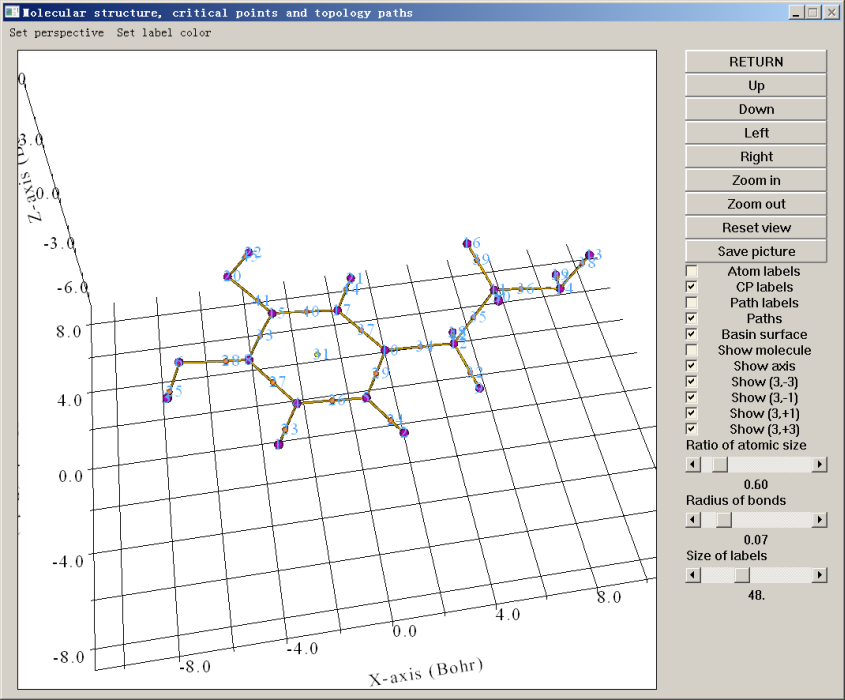
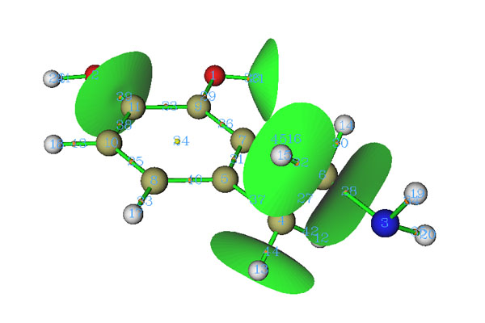
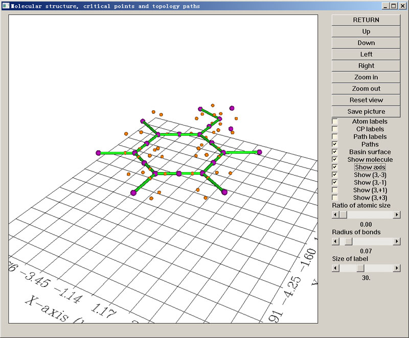
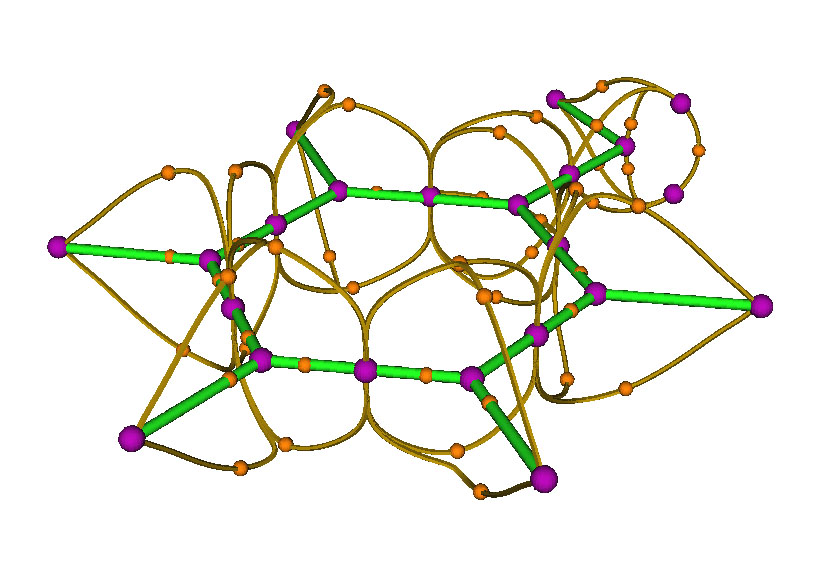
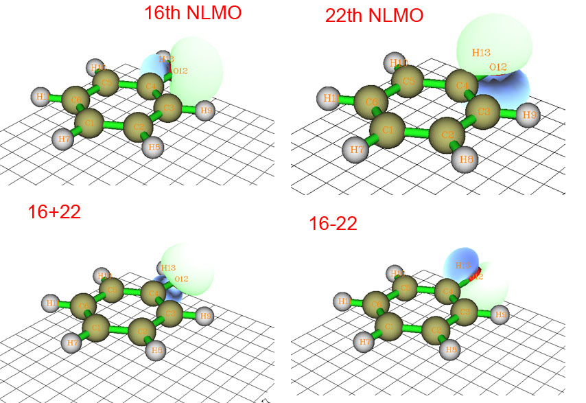
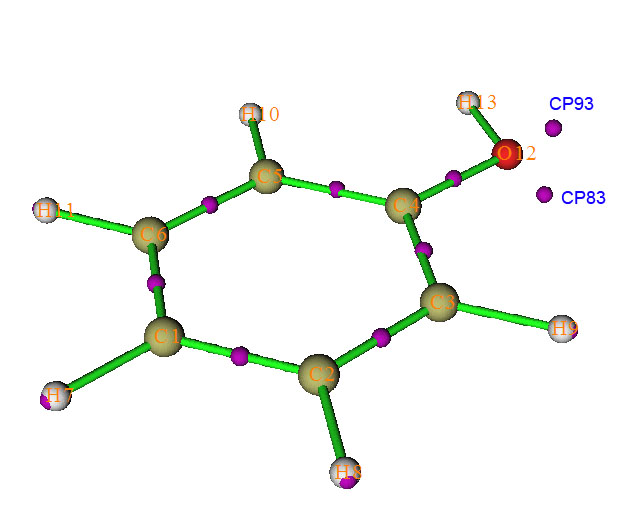
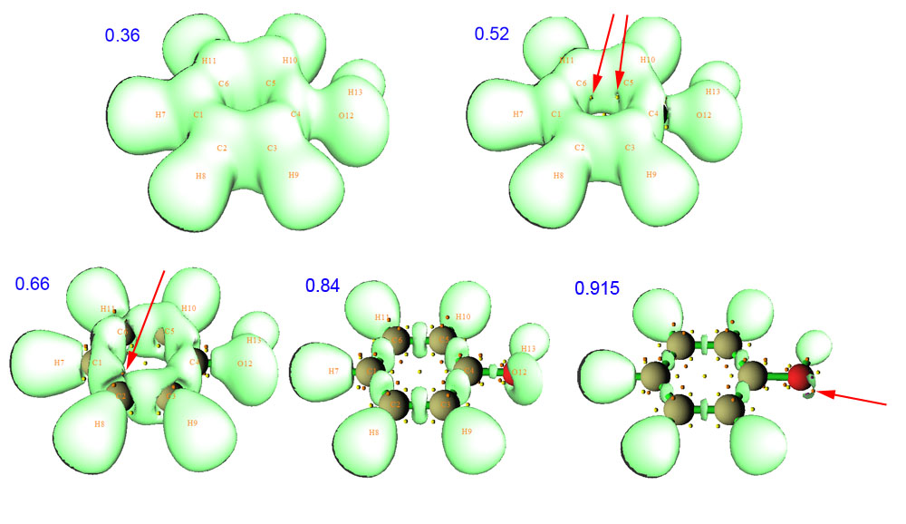

**使用Multiwfn做拓扑分析以及计算孤对电子角度**Using Multiwfn to perform topology analysis and calculate angle of lone pairs

文/Sobereva @[北京科音](http://www.keinsci.com/)  
 First release: 2011-Dec-1 Last update: 2024-Jul-3 

波函数分析程序Multiwfn的拓扑分析模块极为强大、高效、灵活而且普适，原理上可以用于各种实空间函数的拓扑分析，比如电子密度、ELF、LOL、电子密度拉普拉斯函数、轨道波函数等等。电子密度的拓扑分析也是Atoms in molecules (AIM)分析的最重要组成部分之一。本文将简要介绍Multiwfn拓扑分析功能的基本使用方法。Multiwfn程序可以在其主页<http://sobereva.com/multiwfn>免费下载，相关入门知识参见《Multiwfn入门tips》（<http://sobereva.com/167>）、《Multiwfn FAQ》（<http://sobereva.com/452>）。

如果读者不熟悉AIM，建议参看《AIM学习资料和重要文献合集（<http://bbs.keinsci.com/thread-362-1-1.html>）里的资料。如果不熟悉ELF、LOL和电子密度拉普拉斯函数，建议参看《ELF综述和重要文献小合集》（<http://bbs.keinsci.com/thread-2100-1-1.html>）。在《Multiwfn支持的分析化学键的方法一览》（<http://sobereva.com/471>）中笔者对AIM拓扑分析在研究化学键上都能起到什么用处做了详细说明，强烈建议一看。非常推荐参加《量子化学波函数分析与Multiwfn程序培训班》（<http://www.keinsci.com/workshop/WFN_content.html>），在里面我对AIM理论和拓扑分析做了全面展开的介绍并给了大量例子，可以一次性学透彻。

从2024年6月开始，Multiwfn还支持了对周期性体系做AIM拓扑分析，见《使用Multiwfn结合CP2K做周期性体系的atom-in-molecules (AIM)拓扑分析》（<http://sobereva.com/717>）。

## 1 拓扑分析简介

限于篇幅，这里只是对拓扑分析做极简单的说明，或者说是回顾。对于完全不了解AIM理论的人，不妨看看The Quantum Theory of Atoms in Molecules-From Solid State to DNA and Drug Design一书的第一章，对电子密度的拓扑分析有简介、清楚、易懂的介绍，上面的文献合集里有这一章。

实空间函数（以三维空间坐标为变量的函数）的拓扑分析主要是指获取临界点，以及获得连接临界点的拓扑路径。电子密度的拓扑分析是由Bader首先提出的，是AIM理论中的重要组成部分，后来拓扑分析的思路又被Silvi、Savin等人用于分析ELF（电子定域化函数）。

临界点(Critical point, CP)是函数的梯度的模为0的点，分四类，以(3,X)表示。假设实空间函数的Hessian矩阵（3*3的二阶导数矩阵）的本征值有M个正值和N个负值，则X=M-N。  
(3,-3)对应函数的局部极大点。对于电子密度函数，通常出现在离原子核很近的位置。对于ELF函数，通常出现在共价键区域、孤对电子区域、原子核处。  
(3,-1)对应函数的二阶鞍点。函数在一个方向曲率为正，另两个方向为负。对于电子密度函数，通常出现在有相互作用的两个原子之间，也被称为键临界点(BCP)。对于ELF函数，位置不甚确定，经常偏离两个相关的(3,-3)的连线很多。  
(3,+1)对应函数一阶鞍点，如同势能面上的过渡态。对于电子密度函数，通常出现在环体系平面中，如苯环的中心。对于ELF，(3,+1)和下面的(3,+3)通常较少讨论。  
(3,+3)对应函数的局部极小点。对于电子密度函数，通常出现在笼状体系中，例如C60的中心。

寻找临界点通常使用牛顿法。给出一个初猜点，通过反复迭代，就能找到与之最邻近的临界点。但牛顿法不一定每次都成功，有可能一直不收敛，也可能迭代过程中碰到Hessian矩阵为奇矩阵的情况，或者收敛到已找到的临界点位置，此时就要尝试从下一个初猜点开始了。初猜点与期望的临界点位置越近越容易成功收敛到相应的临界点。

电子密度函数的结构很简单，一般都是在原子核处像一个山峰耸立，向着四周呈指数降低，典型体系的各种临界点位置都能大致猜出来，正如上面已经提到的。寻找(3,-3)点的时候初猜点都选在原子核位置。寻找(3,-1)点的时候，初猜点都选在两个原子或者两个已找到的(3,-3)点连线的中点，在这个过程中也可能顺便找到(3,+1)和(3,+3)点。另外也常常将三个原子或四个原子的几何中心作为初猜，这分别适合进一步寻找尚未找到的(3,+1)和(3,-3)点。假设利用这几种初猜方式还是没找到一些期望的临界点，但通过经验可以估计出期望的点出现的大致空间范围，那么就应当在这个空间范围内设定一大堆初猜点来尝试寻找那个临界点。

对于ELF、LOL和电子密度拉普拉斯函数，寻找对应原子内核处的临界点（对应高度定域的1s轨道电子）还是用原子核位置作为初猜。但是对于价层的ELF临界点，由于其分布较难预料，而且数目众多，最好的办法就是直接在每个原子附近都设一大堆初猜点来寻找各个临界点。不过，由于ELF临界点太多而且分布太复杂，想找全所有临界点绝非易事，所以，只要看到化学意义显著的临界点（所有的(3,-3)，以及部分(3,-1)）都已经找到了，临界点的搜索就可以停掉了。除了牛顿法，还有一种基于立方格点的临界点搜索方法，可以通过Multiwfn的盆分析实现，见《使用Multiwfn做电子密度、ELF、静电势、密度差等函数的盆分析》（<http://sobereva.com/179>），此方法虽然可以保证把(3,-3)搜索全，但定位精度低（精度取决于格点间距）。

拓扑路径是连接临界点的路径。一般比较关注的是(3,-1)与(3,-3)之间的路径，沿着(3,-1)的Hessian矩阵本征值为正的本征向量方向分别向前和向后出发，顺着梯度方向不断前进就能找到两个(3,-3)，而经过的轨迹就是拓扑路径。对于电子密度函数，这样的拓扑路径近似于化学键，因此称为键径。对于ELF，通过生成拓扑路径则可以将(3,-1)与(3,-3)临界点之间的关系清晰地表现出来。

## 2 电子密度拓扑分析在Multiwfn中的操作

这里先介绍电子密度拓扑分析的操作，输入文件是Gaussian对多巴胺分子优化得到的wfn文件。用.fch、.molden等格式也都可以，只要用的文件含有GTF信息即可，详见《谈Multiwfn支持的输入文件类型、产生方法以及相互转换》（<http://sobereva.com/379>）。先启动Multiwfn程序，然后依次输入

examples/dopamine.wfn  //此文件是程序文件包里自带的  
2  //拓扑分析功能  
2  //以所有原子核作为初猜点，目的是寻找所有核临界点  
3  //以每一对距离不很远的原子核连线中点作为初猜点，主要用来寻找键临界点  
8  //生成键径  
0  //观看结果  
此时文本界面会输出所有临界点和键径的信息，最后提示你Fine, Poincare-Hopf relationship is satisfied，这是所有临界点都已找到的必要非充分条件，如果这个条件没满足，肯定临界点没找全。同时蹦出来一个图形界面。若点击界面上的CP labels复选框即可把每个临界点的编号也显示出来。如下所示

紫色的球是(3,-3)，与原子核位置基本一致。桔黄色是键临界点，黄色是环临界点。棕色的线是键径。通过图形界面，可以选择显示哪些、不显示哪些，以及旋转缩放等操作。凭借化学直觉，以及Poincare-Hopf关系可知期望的临界点都已经找到了，就没必要再用选项4（三个原子中心作为初猜）、选项5（四个原子中心作为初猜）或选项6（在某个位置附近随机设一大堆点）来进一步找临界点了。

**简而言之，对于一般的体系，找电子密度的临界点就是进入拓扑分析界面后，依次选2、3、4就行了，简单至极！**

值得说明的是Multiwfn的代码经过充分优化，并且支持SMP并行，这使得其拓扑分析速度极快。在一般的主流四核机子上，上面的任务在Multiwfn里眨眼间就完成了。我曾比较过AIM2000和Multiwfn分析一个含900个高斯函数的C60体系，在四核并行的机子上，Multiwfn寻找临界点的速度是AIM2000的约100倍，生成键径速度是其将近30倍，而结果完全一致。AIMALL的速度比AIM2000要快，不过由于算法不很一致，也不好公平地比较，但从实际应用角度上来说，Multiwfn比AIMALL要快一个数量级。另外AIMALL的操作远不如Multiwfn这种交互式程序便利，其结果可视化程序aimstudio还要收费。可以说，想要操作简单、能直接可视化、免费而且速度飞快的AIM拓扑分析程序，Multiwfn是不二之选。

有些临界点比较特殊，在默认的设定下，用选项2~5都找不到临界点，这就需要人为调整一下参数了，在Multiwfn里提供了丰富的可调参数。一种典型的情况是重原子和氢连线上的键临界点找不到，这就需要在CP搜索参数设定界面（-1 Set CP searching parameters）中将Set scale factor for stepsize一项设低，建议设为0.5，然后再重新找临界点。其它选项在Multiwfn手册第三章的拓扑分析一节里都有说明。

有时候找不到临界点是由于初猜位置不合适。初猜点越接近临界点，就越有可能收敛到临界点。对极个别体系，选项2~5的方式设定的初猜点可能都不合适，故而会漏掉某些临界点，此时建议用选项6的方式设定初猜点。这种设定方式比较野蛮但是可靠强大。选项6会定义一个球心，然后让指定数目（通常设几百乃至上千）的初猜点随机分布在球体中来寻找临界点，只要能让初猜点随机分布的范围能够包含或者与潜在的临界点位置比较近，通常就能将那些临界点找出来。选项6的子选项1~6以不同方式定义这个球体的中心，10用来定义球体半径，11用来设定将有多少个初猜点随机分布在球体中，选0就开始执行搜索。如果选择子选项-1，则用户不必设定球心，球心会自动依次定义在每个原子核上，也就是说，每个原子附近都会分布一堆初猜点来搜索临界点。如果用子选项-2，则球心会自动依次定义在指定的原子核上，而非所有原子核上。选项6这种搜索方式对于电子密度临界点搜索用得机会不多，它最适合搜索ELF的临界点，因为ELF比电子密度临界点明显多得多，分布更复杂，见下一节的例子。

Multiwfn还提供了一些选项用于分析、编辑结果。**进入选项****7 Show real space function values at specific CP or all CPs并且输入临界点的编号****，就可以获知这个临界点的一切信息**，包括Multiwfn支持的各种实空间函数的数值（如电子密度、拉普拉斯值、动能密度、势能密度等）和电子密度的梯度以及Hessian矩阵，输出信息例如（如果有看不懂的话，看Multiwfn手册2.6、2.7节对实空间函数的介绍）  
CP Position:   -1.54802279321209    1.64407933432874   -0.36311758584834  
 CP type: (3,-1)  
 Density of all electrons:  0.3333962073E+00  
 Density of Alpha electrons:  0.1666981037E+00  
 Density of Beta electrons:  0.1666981037E+00  
 Spin density of electrons:  0.0000000000E+00  
 Lagrangian kinetic energy G(r):  0.1055976596E+00  
 Hamiltonian kinetic energy K(r):  0.3702940096E+00  
 Potential energy density V(r): -0.4758916692E+00  
 Energy density: -0.3702940096E+00  
 Laplacian of electron density: -0.1058785400E+01  
 Electron localization function (ELF):  0.9499848594E+00  
 Localized orbital locator (LOL):  0.8133846890E+00  
 ...略

Multiwfn还可以将临界点上的各种函数分解为各个轨道的贡献（可以是分子轨道、定域化轨道等），看手册4.2.4节的例子。

Multiwfn的拓扑分析功能可以说是惊人地灵活，本文限于篇幅就不详细说了，相关详细介绍在手册3.14节都有。利用选项-9可以方便地计算临界点间、原子间的距离、角度。用选项-4则可以导入导出已找到的临界点、删除或人为地增加临界点。进入选项-5则可以显示拓扑路径的详细信息（路径轨迹的坐标、路径长度等）并进行编辑和导入、导出，还能绘制各种实空间函数沿着键径上的变化图，见手册4.2.3节的例子。Multiwfn还可以对特定或局部区域做拓扑分析，比如只对选定的分子范围做拓扑分析、只得到连接两个自定义片段间的键径和BCP、只获得对应弱相互作用（低电子密度）区域的临界点和键径等等，见手册4.2.6节的示例。

除了寻找临界点和生成拓扑路径，Multiwfn的拓扑分析模块还能生成并绘制盆分界面，对于电子密度分析，就对应于原子间分界面(Interatom surface, IAS)。在IAS面上没有电子密度梯度线穿过，也称零通量面(zero-flux surface)，每个IAS都经过一个键临界点。IAS将整个分子区域分隔成一个个原子空间，也叫原子盆。从拓扑分析主界面进入选项10后，输入(3,-1)的编号，就能生成穿过这个(3,-1)的IAS。而在编号前加上负号，就说明将已经生成的穿过这个(3,-1)的IAS删掉。如果当前尚未生成任何IAS，输入0就可以生成所有IAS。如果已经有了IAS，输入0就会删掉所有IAS。下图中生成了部分IAS

在Multiwfn手册4.2.1节也有Multiwfn中做电子密度拓扑分析的例子，还有些额外的讨论，强烈建议大家一看。

将Multiwfn与VMD相结合，可以非常简单、快速地绘制出漂亮的含有临界点、键径、分子结构、临界点编号的AIM拓扑分析图，**本文的读者务必阅读《使用Multiwfn+VMD快速地绘制高质量AIM拓扑分析图》（**[**http://sobereva.com/445**](http://sobereva.com/445)**）并且认真观看里面的演示视频**。把Multiwfn的拓扑分析数据搞到VMD里显示比起在Multiwfn的图形界面里看到的明显更好，而且还可以完美解决一些用户抱怨的在Multiwfn窗口里找临界点编号时不容易转到合适的视角的问题。

## 3 ELF拓扑分析在Multiwfn中的操作

这一节以苯酚为例演示一下对ELF的拓扑分析操作。在Multiwfn中对与ELF类似的LOL函数做拓扑分析也是同样的步骤。启动Multiwfn并输入

examples/phenol.wfn  
2  //进入拓扑分析模块  
-11  //清空已有拓扑分析数据并选择新的实空间函数。默认的函数是电子密度  
9  //选择ELF  
6  //在指定半径和中心的球里随机分布指定数目的初猜点来搜索临界点  
-1  //将每个原子核依次作为球中心。由于此分子有13个原子，如果提示中"Points:"此时显示的是比如1000，总共就会以13*1000=13000个初猜点来找临界点。在我的i7-2630QM机子上以四核并行模式运行，仅15秒钟就完成了搜索。  
-9  //返回上一级菜单  
0  //观看结果  
你会看到结果远比电子密度分析时复杂，总共找出了126个临界点，很花哨。为了使结果更清楚，可以将意义不大的(3,+1)和(3,+3)临界点通过右侧复选框关掉。另外，原子球挡住了一些临界点，将Ratio of atomic size滑动条拖到最小，原子球就不显示了，分子此时相当于以棍棒模型显示。如下图所示。

依然是每一个紫球对应一个(3,-3)。可以看到每个原子核都有一个(3,-3)（对于氢原子会偏离些）。如果你发现原子核处没有紫球，说明它们搜索中漏过去了，可以用选项2以原子核位置为初猜再找一下，一般都能找到。C-C和C-O键之间都有紫球，这对应于共价键区域电子定域程度局部最高点。在氧原子旁边还有两个悬着的紫球，它们对应于氧的两个孤对电子的电子定域性局部最大点。从位置上看，按照传统杂化理论可以认为氧是处于sp3杂化状态。

在显示结果的时候，命令行窗口会提示Warning: Poincare-Hopf relationship is not satisfied, some CPs may missing，这表明这一次搜索并没有将所有临界点找全。不过没有关系，因为从图中可见所有有显著化学意义的临界点都找到了。如果你想彻底找全，那么就再次进入选项6，适当选择参数后重新进行临界点搜索，将会找出零星数个剩余的临界点。彻底找全所有类型ELF的临界点，对于不是很小的体系是很困难的事，一般没有必要去做。对于最重要的临界点类型，即(3,-3)，基本上做一次每个原子周围有1000个初猜点的搜索（即本例的操作）后就都能找到。

现在点RETURN关闭图形界面回到拓扑分析主菜单，选8来生成(3,-1)和(3,-3)间的拓扑路径，再次显示结果，如下图所示

原本看起来数目众多、很乱的桔黄色小球，即(3,-1)点，通过拓扑路径与(3,-3)相连后，此时关系变得比较清晰了。

对于个别体系，有时候会发现本该出现的(3,-1)与(3,-3)间的路径没有出现，这很可能是因为生成拓扑路径的默认参数不太适合。比较有效的解决方法是进入选项-2，将Stepsize设得小一些，比如将默认值减小一两倍。注意路径的最大长度是"步长*路径的最大点数"，如果生成路径过程中，迭代次数超过了最大点数还没遇见另外一个临界点，就说明这次路径生成失败。因此，步长设小了，那么路径最大长度就会减小，如果体系中有一些很长的路径，这些路径可能在此时就没法生成了。因此减小步长的同时也应当同时加大路径最大点数。步长越小越容易成功生成复杂的路径（比如曲率特别大的路径），但是由于需要加大路径最大点数，这就会造成计算耗时越多。默认的路径生成参数是折中考虑精度和效率的结果。

LOL和电子密度拉普拉斯函数与ELF有很大相似之处，此节的做法也同样适合这两种函数，只要在选项-11里选择相应的函数然后以本例同样的方法操作即可。另外还可以用这种方法来获得轨道波函数的临界点。

在《在Multiwfn中单独考察pi电子结构特征》（<http://sobereva.com/432>）一文中笔者还举例演示了如何对ELF-pi进行拓扑分析，强烈建议一看。

## 4 谈谈孤对电子角度怎么算

好几次看到有人问孤对电子夹角、二面角怎么算，由于Multiwfn的拓扑分析功能正好能解决这个问题，所以顺便谈谈。如果对此问题没兴趣，可以跳过这节。

在讨论怎么计算角度这个具体问题前，先要搞清楚孤对电子应该如何严格地描述。首先要明确的是，孤对电子本身不是可观测的，只是个概念，也没法唯一地去定义，只能说哪种方式的描述更有物理意义。一般意义上的孤对电子指的就是原子价层某局部空间内运动的两个自旋互相配对的电子。一种将这个概念具现化的方法是轨道定域化方法，它通过对占据的分子轨道（往往有很强离域特征）进行酉变换，获得能够与化学键、孤对电子相对应的轨道，很大程度上重现了lewis模型。这类方法最大缺点是物理意义不严格，酉变换过程是随意的，以什么标准去做酉变换因算法而异，不同的常用的定域化方法虽然能得到相似的图景，但是在多重键、孤对电子的描述上却可能很不相同，所以我并不建议用这类方式讨论孤对电子。NBO也是属于定域化轨道一类，虽然不是通过酉变换得到，但结果上看也通常差不多。从算法上NBO分析对孤对电子的描述在寡人看来也有点不合理性，在NBO分析中是先从密度矩阵的原子对角块搜索完CR、LP型NBO才开始寻找双中心NBO，等于说生成LP的优先级要高于双中心NBO，然而实际上孤对电子和化学键是同时形成的，应当同步考虑。这也导致了NBO的孤对电子轨道看起来和杂化理论显示的图景不符。

下面是HF/6-31G*下的苯酚的16号和22号NLMO轨道图形，以及两个轨道波函数相加和相减后的图形。顺带一提，NLMO是NBO分析方法框架内的一部分，它是由NBO进一步变换得到的，通常和NBO很相似，只是离域性比NBO稍大。NLMO也可以视为是直接通过对占据的分子轨道酉变换得到的。

16和22号NLMO对应氧的孤对电子，乍看上去好像氧是sp2杂化，一个孤对电子在平面上，一个垂直于平面。但实际上我们可以将这两个轨道人为地混合形成两个新的轨道，即16+22和16-22（为了省事未考虑归一化，这对定性分析没影响）。这两个新的轨道也可以说是对应孤对电子的，这样一来氧就成了sp3杂化了，与ELF分析的结果一致。或许会有人问，将16和22号轨道那么混合有道理么？这样混合是没问题的，因为NLMO间都是正交的，因此16+22以及16-22轨道也与其它轨道正交，这等于是对占据轨道再酉变换一下罢了，完全是在轨道定域化的框架内允许的操作。所以说定域化轨道模型有严重的任意性，连孤对电子轨道都不能唯一确定，更甭提再进一步计算孤对电子角度了。

物理意义比较严格的是通过实空间函数分析，具体来说是ELF或LOL函数，结果通常较相似。电子密度拉普拉斯函数也能分析，但它与电子定域化的关系只是间接的，函数行为上也不如ELF和LOL舒服。ELF较大的区域，表明相应区域内的电子定域性较强，可以推断电子的费米穴主要分布在这个区域内，即自旋相同电子间距离会较远，而自旋相反的电子相对来说就容易呆在一起，即说电子在这个区域内配对，这正是孤对电子概念严格的物理解释。如果对电子定域性问题想有进一步了解，可参阅笔者的《电子的定域性与相关穴》一文（<http://sobereva.com/94>）。因此，位置适当的ELF较大的区域就可以说是孤对电子的区域，那么通过拓扑分析给出的ELF较大区域当中的极大点，就可以说是孤对电子出现位置的最大程度的抽象，利用这个点就可以很容易地计算出孤对电子角度了。

比如，按照第三节的方法找完临界点后，我们想计算CP93-O12-CP83的夹角（标号见下图。在图形界面选择CP labels就能显示各个临界点的编号），就在拓扑分析主界面里面选选项-9以进入角度测量的界面，然后输入c93 a12 c83，结果显示为88.228度。这里a代表angle，c代表critical point，a代表atom；想再测量CP83-O12-C4-C5的二面角就输入c83 a12 a4 a5，结果是130.496度。按q可以返回主菜单。值得一提的是每次搜索临界点给出的临界点的编号可能不同，所以对一个体系重复分析时，每次都应在图形界面里看清楚各个临界点的当前编号。

我们也可以看看用LOL和拉普拉斯函数研究这个问题能得到什么结果。在拓扑分析的主菜单选择-11然后选择LOL函数，此时所有刚才ELF的拓扑分析会自动清空，然后重新搜索临界点，我们会看到各个(3,-3)的位置和ELF分析时都差不多。再次计算氧的两对儿孤对电子间的夹角，得到的结果是119.895度，明显大于ELF给出的数值。改用电子密度拉普拉斯函数再算一次，结果是131.244度，更大了。按照一般观念，孤对电子间相互互斥比较强，也应当大于sp3杂化的109度28分。结果在一定程度上显示ELF可能会低估孤对电子的夹角。实际上有时低估得更厉害，乃至于LOL的结论是有两对儿孤对电子出现的时候，ELF却认为两对儿孤对电子合在了一起。我的建议是使用LOL来研究孤对电子，LOL比ELF形式更简单，计算速度稍快，而且一些文章指出LOL也能给出比ELF更清楚的化学图景，而LOL在物理意义上也和ELF差不多。

还有一种展现孤对电子位置的方法是考察静电势极小点，在此文专门进行了介绍：《绘制静电势全局极小点+等值面图展现孤对电子位置的方法》（<http://sobereva.com/493>）。

## 5 临界点与等值面图

我们接下来将通过等值面图讨论ELF的域(Domain)、二分点(Bifurcation point)与(3,-3)及(3,-1)临界点的关系，这有助于理解以及验证拓扑分析的结果。

先按照第三节的过程搜索完ELF临界点，然后直接退回到主菜单，并输入以下命令  
5 //生成格点文件  
9 //ELF函数  
2 //中等精度格点，对于小体系定性分析这就够了。这时开始计算  
-1 //显示等值面

由于已经搜索过了临界点，所以临界点也在等值面图上一起显示了出来。拉动等值面数值的滑动条，可以看到随着数值由小到大，等值面如下图变化（蓝色数字是等值面对应的数值）

由图可见，在数值很小时，等值面连成一个大域（或者叫做盆，是指等值面包含的封闭空间），也表明能超过这个定域性标准的区域非常广。随着数值增加，等值面开始逐渐减小。在0.52时，如红色箭头所指，恰好两个(3,+1)刚刚出现。它们的出现容易理解，因为(3,+1)代表这个点在两个方向上是函数值极小点，而另一个方向是极大点，由等值面随数值的变化过程图可以想象，那两个作为极小点的方向就是顺着等值面的两个正交方向，而作为极大点的方向是基本上垂直于等值面的方向。进一步增加等值面数值，等值面会进一步萎缩，并且很多地方等值面开始分离，联通的大域逐渐分解为小域。在0.66时，红色箭头所指的地方就是一个域开始二分的地方，称为二分点，凡是这种地方都对应于一个(3,-1)点，而拓扑分析时获得的相应(3,-1)点的ELF数值，也就正对应于ELF域在此处二分时的数值。等值面数值增加到比较高的情况，如0.84，从图中可见ELF域已经充分分离了，对应每个成键区域以及氢的高定域性区域已经很清晰明朗，但是氧的两对儿孤对电子的高定域性区域还是没分开。继续增加到0.915时，发现两对儿孤对电子的域恰好分离开，红箭头指出了二分点。如果进一步增加数值，则每个域都只会进一步缩小直至消失，但不会在这个过程中二分成为更小的域，这种不能再二分的域称为不可约域。每个不可约域里面都包含一个(3,-3)临界点，对应于域随着等值面数值增加越变越小最后消失的位置。

等值面图比较直观清楚，各个高定域性区域一目了然，通过不断调节等值面数值，还可以直接确定出(3,-1)和(3,-3)的位置和这些临界点的数值。但是等值面图不便于准确地定量分析，无法得到很精确的临界点的位置和函数数值。而且，这种找临界点的方法也比较累，尤其是通过观察等值面的变化来确定(3,+1)和(3,-3)临界点是很困难的。直接用拓扑分析虽然准确快速，但电子结构复杂时，临界点分布纷繁复杂，不能从图上直观地获知各个空间位置电子定域性的大小、高定域性区域的分布范围。所以，拓扑分析和等值面分析建议结合使用，前者用于精确定量分析，后者用于快速定性分析。另外，通过等值面图观察不可约域的位置，也有助于确定是否在拓扑分析中漏掉了一些(3,-3)临界点，如果某不可约域的范围内没找到(3,-3)，就应当在搜索设置中将球的中心设在那个区域，让大量在球体内随机分布的点作为初猜点来寻找那个(3,-3)。
