**使用Multiwfn作电子密度差图**  
Using Multiwfn to plot difference map for electron density

文/Sobereva @[北京科音](http://www.keinsci.com/)  
First release: 2011-Dec-24   Last update: 2024-Mar-26

## 1 前言

在Multiwfn（<http://sobereva.com/multiwfn>）里可以十分轻松地作密度差图，是绘制密度差图最方便的工具，没有之一。在程序手册里也已经给出几个例子很清楚地介绍了绘制密度差图的方法（4.4.7节的变形密度图，4.5.4、4.13.6、4.18.3节的体系在不同状态间的密度差图、以及4.5.5、4.4.8节的片段密度差图）。在此写个专门帖子通过实例来说说绘制过程，会把每一步都做出详细解释。本文同时也会谈到密度差图的意义、用处。另外，对于作密度差图常常被忽视的原子密度球对称化问题也会着重说一下。在此顺带特别强调，electron density difference的中文是密度差，“差分密度”是对密度差的严重不当称呼，绝对不要用这个词！

本文所说的密度都是指电子密度。利用和本文完全相同的方法，还可以作其它函数的差值图，比如静电势差值图、动能密度差值图、电子定域化函数(ELF)差值图等等，只要在选择实空间函数时选择对应的实空间函数就可以了。

如果读者对Multiwfn不了解，建议参看这些文章：《Multiwfn入门tips》（<http://sobereva.com/167>）、《Multiwfn FAQ》（<http://sobereva.com/452>）。本文只是简单提及了特定情况下产生Multiwfn输入文件的做法，更全面的介绍见《详谈Multiwfn支持的输入文件类型、产生方法以及相互转换》（<http://sobereva.com/379>）。

本文只演示对分子体系绘制密度差图，对周期性体系用Multiwfn绘制密度差图的做法看《使用CP2K结合Multiwfn绘制密度差图、平面平均密度差曲线和电荷位移曲线》（<http://sobereva.com/638>）。

利用类似作密度差的方法还可以得到（超）极化率密度，这对于讨论体系不同区域对（超）极化率的贡献、探究不同计算级别导致（超）极化率计算结果存在差异的原因特别有用，此问题另有专门的帖子，见《使用Multiwfn计算超极化率密度》（<http://sobereva.com/305>）。

## 2 密度差图的种类

“密度差”就是指一些体系在各自特定的状态下彼此间的密度的差值，它是三维实空间函数。有三种情况常会涉及：  
1 某个体系的某个状态的密度减去这个体系在另外一个状态的密度。例如，某分子的激发态的密度减去它在基态时的密度、某分子在有外加电场时的密度减去它在自由状态下的密度。注意在计算这两个状态的密度时分子的笛卡尔坐标必须一致，不能在各自状态下分别优化，而只能共用其中一个状态的几何构型。同时也不能允许量化程序为了能利用分子对称性而自动旋转、平移坐标。否则都导致两个状态下原子坐标没法对应，密度差也就没什么意义。

2 某个体系的密度减去组成它的各个片段的密度。例如，水分子二聚体的密度减去这两个水分子都在孤立时的密度。同样要注意，求各个片段的密度时，它们的笛卡尔坐标必须与在整个体系中的坐标一致。

3 某个体系的密度减去组成它的各个原子在自由状态下的密度，这也被称为变形密度(Deformation density)。这种密度差对于研究分子形成过程中电子密度的变化、探究化学键的本质很有用。变形密度图在《Angew. Chem.上发表了全面介绍各种共价和非共价相互作用可视化分析方法的综述》（<http://sobereva.com/746>）介绍的我的综述文章里也专门给出了介绍，**推荐阅读和引用此综述**。

密度差必须作成图才便于被直观地考察，图分为三类：  
1 曲线图：展现某条直线上密度差的数值，这种图对于密度差的研究用得较少。  
2 平面图：能够清楚地展现一个截面上各处的密度差数值，十分有用，其中最适合展现密度差的是等值线图。平面图的缺点是难以从一个截面上了解整个空间中密度差的数值分布。  
3 等值面图：在等值面上每个点的数值都等于人为指定的数值(这个值被称为isovalue)，通过它可以很直观地了解密度差在三维空间中的分布。但是等值面里面和外面的密度差数值没法一下子看清楚，必须反复调节isovalue考察等值面的变化才能获知。等值面图和平面图的用处是互补的。

## 3 Multiwfn中的自定义运算功能

Multiwfn可以直接计算密度并做曲线、平面、等值面图，Multiwfn也提供了自定义运算(custom operation)功能，用于对多个波函数的密度、静电势等实空间函数进行相互运算，求密度差实际上只是Multiwfn的自定义运算功能的一个具体应用而已。

比如，启动Multiwfn后载入的波函数是A.wfn，在自定义运算中设定有3个波函数将要依次对它进行运算，且算符和文件名分别写  
+,madoka.wfn  
x,TMA.wfn  
-,homura.wfn  
然后，假设要计算的属性选择的是电子密度，那么Multiwfn会依次计算这四个波函数文件的电子密度格点数据，并且对这些格点数据做如下运算：(A.wfn的密度+madoka.wfn的密度) * TMA.wfn的密度 - homora.wfn的密度  
在计算后三个波函数的格点数据时Multiwfn都会自动使用与计算A.wfn格点数据时相同的格点设定，无需用户考虑格点位置的对应性问题。  
Multiwfn可以对无限多个波函数进行自定义运算，支持的算符是+ - x /，对应加减乘除（乘号写为字母x）。

下面将通过一些实例，说明怎么用自定义运算功能绘制各种类型密度差图。

## 4 某体系某状态减去此体系另一个状态的密度差图

### 4.1 施加电场后COCl2电子密度的变化的等值面图

在外场作用下，电子密度分布会被极化。这里考察一下COCl2分子在C-O轴线方向上加上0.03a.u.均匀电场（1a.u.=51.421 V/Angstrom）后电子密度的变化。注意电场作用也会诱导体系几何结构发生改变，但绘制密度差要求几何结构保持不变，所以这里不考虑电场对分子结构的影响，也因此不在电场下重新优化结构。

首先生成COCl2在自由状态下的波函数，将以下内容保存为Gaussian输入文件并执行即可，wfn文件输出路径和文件名可以自定。这个结构是事先在b3lyp/6-31+G*下优化好的。  
# b3lyp/6-31+G* out=wfn nosymm  
[空行]  
COCl2 opted  
[空行]  
0 1  
 C                  0.00000000    0.00000000    0.49676300  
 Cl                 0.00000000    1.46464400   -0.48297200  
 Cl                 0.00000000   -1.46464400   -0.48297200  
 O                  0.00000000    0.00000000    1.68005900  
[空行]  
C:\COCl2.wfn

算完后将这个输入文件的route section部分末尾加上field=z+300关键词，并将输出的wfn文件名改为C:\COCl2_z+300.wfn，然后重新算一次以得到在Z方向上（C-O轴线方向）上加了0.03a.u.均匀电场后的波函数文件。

Gaussian会自动将体系坐标进行旋转、平移使之处于标准朝向下，以便利用对称性节约计算耗时。如果你对Gaussian缺乏经验的话，在计算用于做密度差的波函数文件时建议写上nosymm，并且使用笛卡尔坐标，这样可避免Gaussian自动做这种调整，从而确保了分子在三维空间中的位置、朝向是固定的，和输入文件严格一致。对于外加电场的计算，如果不写nosymm，而且体系在输入文件里的坐标不是处在标准朝向，那么计算时经过Gaussian自动调整体系朝向后，电场和体系的相对方向就乱套了。

我们先来作等值面图。启动Multiwfn，依次输入  
C:\COCl2_z+300.wfn  
5 //生成格点文件  
0 //设定自定义运算  
1 //只有1个文件要对已读入的波函数进行运算  
-,C:\COCl2.wfn //运算符（减号）和文件名  
1 //选电子密度函数。因此接下来得到的就是COCl2_z+300.wfn的密度减去COCl2.wfn的密度  
2 //中等质量格点精度  
现在Multiwfn开始依次计算这两个波函数文件的密度的格点数据，之后自动相减。接下来有诸多选项可以后处理生成的格点数据，用选项2可以将格点数据输出为cube文件，之后可以载入进VMD、GaussView、ChimeraX等软件观看等值面。Multiwfn也自带了观看等值面的功能，这里选择选项-1来进入，如下图所示。由于默认的isovalue为0.05，而密度差数据通常很小，所以要将isovalue值降低一些，比如降到0.005，才能比较清楚地看到密度差图。isovalue的大小的设定没绝对标准，只要设定一个值，能让密度差特征充分清楚地展现出来就行了。设得太大时等值面会很小而看不清楚甚至消失不见，而设得太小会使等值面涵盖的空间范围太大，混在一起，看不出到底哪些区域的电子密度变化较大。

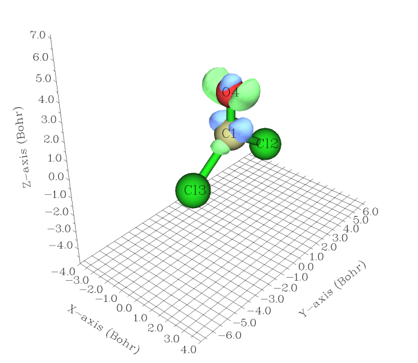

密度差数值与isovalue的符号相同和相反的等值面分别以绿色和蓝色显示。图中isovalue被设为0.005，也就是说绿色等值面上密度差值都为+0.005，体现了加了电场后电子密度增加的区域；蓝色的面上密度差都为-0.005，体现了加了电场后电子密度降低的区域。本例中外加电场矢量是由Z正方向指向负方向的，受其影响电子密度应趋向于向Z轴正方向转移，图中也验证了这一点，可以看到主要发生极化的是C-O键的pi电子云。下个例子将绘制穿过C-O键的垂直于分子平面的截面上的密度差图，这个截面对应于Y=0的XZ平面。

如果你想要更好的绘制效果，建议将导出的cube文件弄到VMD里显示成等值面。在VMD里将cube文件里的格点数据显示成等值面的操作可参考《使用Multiwfn结合VMD绘制自旋密度等值面图》<https://www.bilibili.com/video/av26312131>）。

### 4.2 施加电场后COCl2电子密度的变化的等值线图

如果你刚做完上例子的等值面图，可以在格点数据后处理界面中选择0从而直接退回到主菜单。如果直接做这个例子，那么还是先启动Multiwfn，然后输入C:\COCl2_z+300.wfn来载入之。之后依次输入  
4 //绘制平面图  
0 //设定自定义运算，后面几步和4.1完全相同  
1  
-,C:\COCl2.wfn  
1  
2 //等值线图  
直接按回车使用推荐的格点设定，即平面图中两个方向都是200个点  
2 //XZ平面  
0 //表明这是Y=0的XZ平面  
瞬间就弹出了下面的图

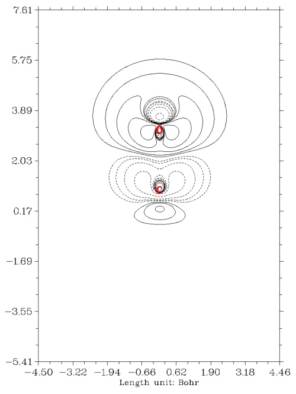

实线代表加电场后电子密度增加的区域，虚线代表减小的区域。这幅图比等值面图展现的密度差更为清楚具体。在图上点击右键关闭它之后可以看到一个菜单，其中有丰富的选项，用于保存图片、调节等值线设定、调节坐标轴刻度、选择是否将等值线的数值标在图中等等，请大家自行尝试，在手册对应的章节也都有细致的说明。从这个例子可见使用Multiwfn做密度差平面图是极其容易的，而且图像精细漂亮，可直接作为文献的插图。既不需要费时费事地去自行计算格点数据，也完全不需要在Sigmaplot、Origin里面折腾数据和调节设定。

在手册的4.13.6节有个绘制聚炔烃在外加电场后电子密度变化的例子，建议看看，其中还额外绘制了电荷转移曲线，对于定量分析密度差变化很有帮助。

### 4.3 电子激发前后的密度差图

还是以COCl2为例子，这次来看看TDDFT计算得到的第一单重激发态(S1)相对于基态的电子密度的变化。如果你对激发态计算一无所知，建议参看《Gaussian中用TDDFT计算激发态和吸收、荧光、磷光光谱的方法》（<http://sobereva.com/314>）。这里还是用4.1节的COCl2的输入文件，但这次将route section改为  
# B3LYP/6-31+G* out=wfn TD(root=1) density  
并且将末尾定义的wfn文件名改为C:\COCl2_S1.wfn。用Gaussian计算之，COCl2_S1.wfn就将包含S1态的波函数信息。此例的root=1可以省，因为默认就是root=1。density关键词一定要加，否则wfn文件包含的是基态波函数，而不是你指定的第root态的（但从后期的G09开始，density可以不用写，因为out=wfn默认用了density）。  
注：这里我们没写nosymm，是因为它对于当前情况没什么用处，因为基态和激发态结构是相同的，Gaussian虽然会自动旋转、平移体系，但这么自动调整之后基态和激发态的坐标依然是一致的。而且我们也没加外电场，体系的朝向无所谓。如果写了nosymm，虽然对结果也没害处，但Gaussian没法利用对称性来节约计算耗时。

做等值面图和做截面图的方法和前两节的过程完全一致，将C:\COCl2_z+300.wfn替换为C:\COCl2_S1.wfn就行了。得到的等值面图如下所示，isovalue=0.03。可以看到在体系从S0垂直激发到S1后，碳和氧的px轨道上电子密度都有所增加，而且增加的区域并没有相连，这是由于电子主要跃迁到了pi反键轨道所致。相应地，氧的py轨道（此例对应于氧的孤对电子）上电子密度有所减小。因此这种激发模式可指认为LP->pi*跃迁。

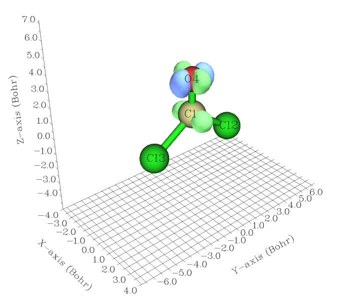

在手册4.18.3节有个绘制D-A体系的电荷转移激发态的密度差的例子，随后还对密度差进一步转化，得到了转移距离、正负电荷区域重叠程度等定量指标，对于分析电子激发模式很有用，建议看看。

笔者还写过一篇文章《使用Multiwfn计算激发态之间的密度差》（<http://sobereva.com/429>）。如果你打算对好多个激发态之间求密度差，那么一个一个生成激发态的波函数文件又耗时又麻烦，而如此文所示的，使用Multiwfn可以一次性产生所有激发态的波函数文件，绘制密度差就省事多了。

### 4.4 计算Fukui函数预测反应位点

Fukui（福井）函数是常用的预测反应位点的实空间函数，尤其适合软酸软碱之间的反应（静电势的分析方法更适合用于分析硬酸硬碱反应）。Fukui函数有三类，分别用于预测亲核、亲电、自由基反应位点。预测亲电反应的函数f- = ρ(N) - ρ(N-1)，其中ρ(N)是分子正常状态下的密度函数，ρ(N-1)是分子少了一个电子，或者说分子的净电荷为+1状态下的密度。f-在哪个原子附近数值越大，说明亲电反应越容易发生在哪个原子上。注意计算ρ(N-1)时几何结构必须使用计算ρ(N)时的，这不仅是绘制密度差图的要求，这也是Fukui函数的定义本身所要求的。

这里计算呋喃的f-函数的等值面图。首先计算正常状态下的波函数文件，Gaussian输入文件如下，结构已在b3lyp/6-31G*下优化好。nosymm不是必需的，理由和上一节一样。  
# b3lyp/6-31g* out=wfn  
[空行]  
opted b3lyp/6-31G*  
[空行]  
0 1  
 C                 -0.66222300   -0.93877200    0.00000000  
 C                  0.69784300   -0.97448500    0.00000000  
 C                  1.13199200    0.39408700    0.00000000  
 C                  0.00000000    1.14881300    0.00000000  
 O                 -1.10670000    0.35104000    0.00000000  
 H                 -1.43048300   -1.69690900    0.00000000  
 H                  1.31938500   -1.85911500    0.00000000  
 H                  2.14981500    0.75868100    0.00000000  
 H                 -0.19078800    2.21116400    0.00000000  
[空行]  
C:\furan.wfn

算完后把净电荷和自旋多重度从0 1改成1 2，C:\furan.wfn改成C:\furan+1.wfn，重算一遍得到N-1电子时的波函数文件。  
之后过程和4.1节完全相同，即在Multiwfn里依次输入  
C:\furan.wfn  
5  
0  
1  
-,C:\furan+1.wfn  
1  
2

算完后选-1预览等值面，适当调节isovalue，以使得等值面区域只集中在个别原子上。当前体系isovalue设为0.015时比较清楚，如下图所示，等值面几乎只在氧的邻位上出现，而且绿色区域显著大于蓝色区域，这显示出氧邻位碳附近的f-函数值非常正，而且明显大于间位碳的，预测了呋喃的亲电反应会发生在氧的邻位碳上，这与实验结论是一致的。

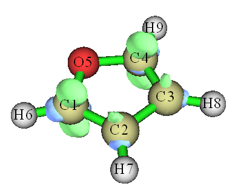

值得一提的是，Multiwfn有一个专门计算概念密度泛函框架里定义的包括福井函数在内的各种量的功能。用这个功能，你甚至都不用手动准备波函数文件了，只要提供一个含有优化后的结构的文件，在Multiwfn里敲击下键盘就能直接给出各类福井函数，方便至极，请阅读：《使用Multiwfn超级方便地计算出概念密度泛函理论中定义的各种量》（<http://sobereva.com/484>）。

如果对于反应活性的预测方法感兴趣，想了解更多理论知识和相应的计算流程，推荐阅读幻灯片《反应位点的预测》（<http://sobereva.com/234>）、Multiwfn手册4.A.4节、《亲电取代反应中活性位点预测方法的比较》（物理化学学报，30，628 (2014)，<http://www.whxb.pku.edu.cn/CN/abstract/abstract28694.shtml>）、《概念密度泛函综述和重要文献合集》（<http://bbs.keinsci.com/thread-384-1-1.html>）。笔者还写过一个相关文章《使用Multiwfn+VMD以原子着色方式表现原子电荷、自旋布居、电荷转移、简缩福井函数》（<http://sobereva.com/425>）。

## 5 绘制某个体系与组成它的各个片段的密度差图实例

这一节以水二聚体为例介绍怎么绘制某个体系与组成它的各个片段的密度差图。二聚体的几何结构直接从S22弱相互作用数据库获得，如下图所示

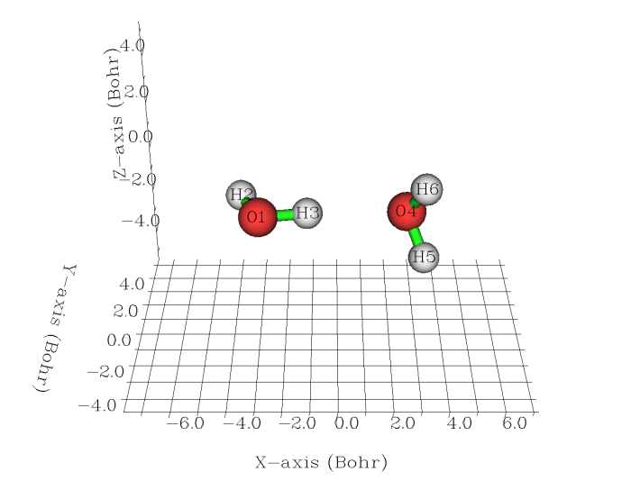

首先获得二聚体的波函数文件，输入文件如下（关于计算电子密度的理论级别的讨论见文末注1）。这个例子必须写nosymm，否则由于Gaussian会自动调整坐标到标准朝向，将导致单体的坐标和它们在复合物中的坐标不对应，使密度差失去意义。  
# B3LYP/6-311G** out=wfn nosymm  
[空行]  
From S22  
[空行]  
0 1  
O  -1.551007  -0.114520   0.000000  
H  -1.934259   0.762503   0.000000  
H  -0.599677   0.040712   0.000000  
O   1.350625   0.111469   0.000000  
H   1.680398  -0.373741  -0.758561  
H   1.680398  -0.373741   0.758561  
[空行]  
C:\waterdimer.wfn

二聚体算完之后，将后三个原子从输入文件中删掉，并将输出波函数文件名改为C:\water1.wfn，然后计算。算完后再将后三个原子恢复回来，而将前三个原子从输入文件中删掉，将输出波函数文件名改为C:\water2.wfn，再次计算。此时water1.wfn和water2.wfn里面就分别是第一个水分子和第二个水分子的波函数信息。  
**强调**：绝对不要单独优化各个片段，别干这种完全多余的事！老有人用Multiwfn绘制整体与片段之间的密度差图时居然把片段又做了优化，显然优化完了之后片段的坐标和它在复合物中的坐标就不对应了，得到的密度差图将毫无意义！产生片段的波函数文件只应当像上面这样做单点计算，且记得必须带nosymm关键词避免被自动调整到标准朝向，且坐标必须是从复合物中直接抠出来的片段的坐标。

启动Multiwfn，依次输入  
 C:\waterdimer.wfn  
4 //绘制平面图  
0 //设定自定义运算  
2 //有两个波函数将从当前载入的波函数中减去  
-,C:\water1.wfn  
-,C:\water2.wfn  
1 //电子密度函数。最终得到的密度就是waterdimer.wfn的密度减去water1.wfn的密度再减去water2.wfn的密度  
2 //等值线图  
直接按回车使用推荐的格点设定  
1  //用XY平面作为绘图平面  
0  //绘制Z=0的XY平面  
马上密度差图就会蹦出来，如下图所示。之后还可以关闭图像，用后处理界面的选项改进图像效果、修改等值线设定。  
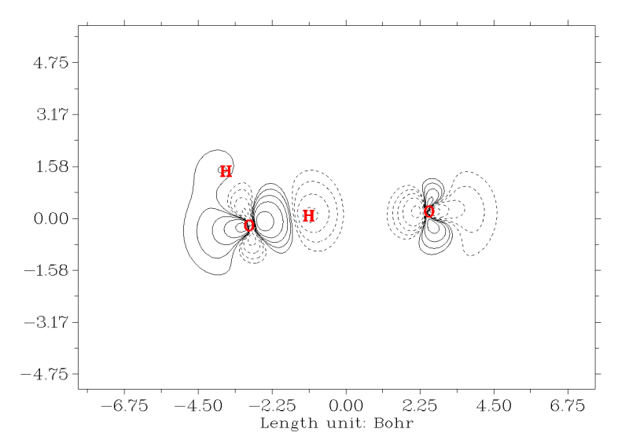  
  
从这幅图上能看出两个水分子形成复合物时电子密度是如何转移的，实线和虚线代表结合后密度增加和减少的区域。从图中看到形成氢键的H和O的电子密度都显著降低，这体现出形成二聚体时由于Pauli互斥作用令电子密度分布彼此排斥。同时，可以看到O-H之间密度变化有个截面，这也反映了O-H键的电子共享程度有一定弱化，使得O-H键被削弱（反映为键长增长，振动频率降低）。  
  
此例要绘制成等值面图也非常容易。启动Multiwfn，依次输入  
C:\waterdimer.wfn  
5  //计算格点数据  
0  //设定自定义运算  
2  //有两个波函数将从当前载入的波函数中减去  
-,C:\water1.wfn  
-,C:\water2.wfn  
1  
2  //中等质量格点  
-1  //观看等值面图  
将isovalue调至0.001，看到下图。绿色和蓝色分别对应密度差=0.001和-0.001的等值面，勾勒出电子密度增加和减少的主要区域。

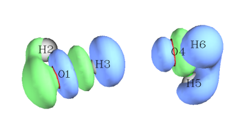

手册4.5.5节也有个绘制片段密度差的例子建议看看。

在Multiwfn中绘制体系与构成它的多个片段间的密度或者其它函数的差值图也非常容易。在Multiwfn手册4.4.8节的例子中展示了对水四聚体绘制密度差的等值线图、等值面图，以及填色图形式的ELF差值图的过程，所得图像分别如下所示：

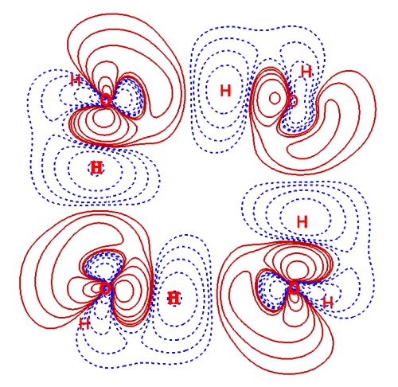

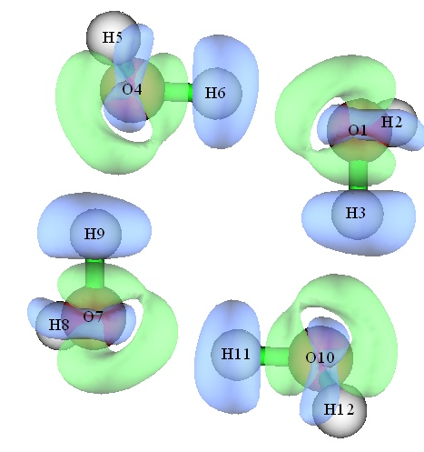

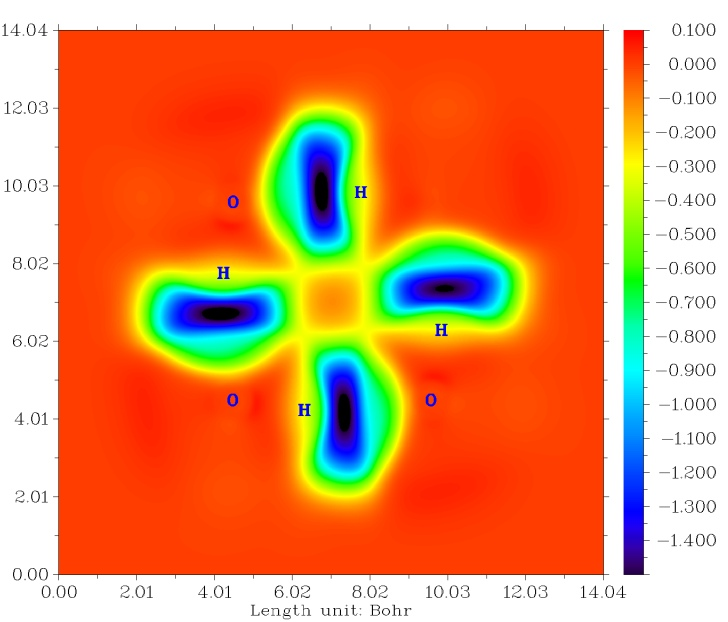

## 6 绘制体系与组成它的每个原子的密度差图

做完上个例子后，一定已经知道怎么做体系与组成它的各原子的密度差图了（下面称为变形密度），只需要在填入每个片段波函数文件名的地方改为填入每个原子的波函数文件名就行了。然而，原子的数目通常很多，依次计算原子的波函数文件并加入自定义运算列表里是很费事的，而且还得手动去做原子密度的球对称化（第8节将谈到）。为了使变形密度图能够方便地绘制出来，Multiwfn提供了特殊的处理方法。有两种情况，一种是让Multiwfn直接调用Gaussian产生原子波函数文件，如下面6.1节所述；另一种方法是直接用Multiwfn自带的原子波函数文件，如下面6.2节所述，这样既不用自己算原子波函数文件也不用调用Gaussian了，最为方便。

### 6.1 自动调用Gaussian生成原子波函数文件

Multiwfn可以自动调用Gaussian生成原子波函数文件并作球对称化，并自动将其中心挪到各个对应的原子位置上，求密度并作差值，完全不用人工干预。

这里来绘制镁卟吩平面的变形密度等值线图。此体系的波函数文件MN.wfn是在B3LYP/6-31G*下生成的，结构如下

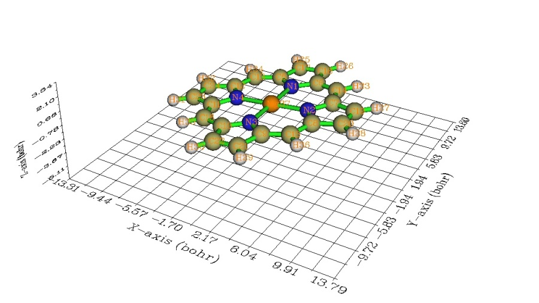

首先确保Gaussian环境变量已经设好，否则Multiwfn在调用Gaussian时会出错。对于Win7，设定方法是进入“系统”-“高级系统设置”-“高级”标签页，点“环境变量”，在用户变量中点击“新建”，变量名填GAUSS_EXEDIR，变量值填Gaussian的安装路径，比如D:\study\g09w。设过一次之后以后就不用再重新设了。

启动Multiwfn依次输入  
MN.wfn  
4  //绘制平面图  
-2  //获取变形属性（注2）。这里的“属性”是指接下来你所选的实空间函数，因为接下来要选电子密度函数，所以将得到变形密度  
b3lyp/6-31G*  //设定计算原子波函数所用的方法和基组  
D:\study\g09w\g09.exe //Gaussian可执行文件的路径。注意可执行文件名是g09.exe而不是g09w.exe。如果你懒得每次做变形密度图时都重新输入一遍路径，那么就在settings.ini文件里将gaupath=后面空一格写上这个路径，并且这路径两边要用双引号扩住，比如gaupath= "D:\study\G09W\g09.exe"。当Multiwfn发现这个路径正确，就不会再让你手动输入路径了。

现在Multiwfn自动调用Gaussian计算每个原子的波函数文件，由于此体系只含C H N Mg这四种元素，所以会调用Gaussian四次。待算完后接着输入  
1  //电子密度函数  
2  //等值线图  
敲回车，用默认格点设定  
4  //由于MN.wfn中镁卟吩不是恰好处在某个XY或YZ或XZ平面上，所以这次还是通过三个原子来定义平面。  
19,22,23  //用19、22、23号原子定义绘图平面。这三个原子位于镁卟吩的三个顶角，因此做出来的图会覆盖整个镁卟吩。（也可以像第5节那样通过设定延展范围来调节作图区域大小）

很快就得到下图

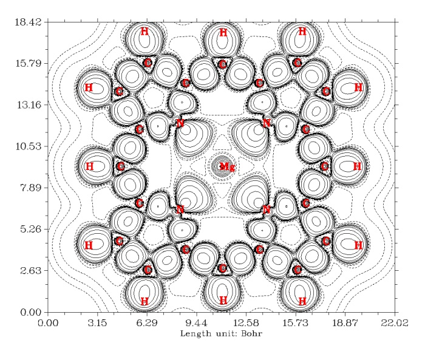

可以看到，在每个共价键之间都有明显的正值区域，表明共价键的形成伴随着电子密度在成键原子间聚集。N和Mg之间是离子键，如预期的，并没有电子密度以两原子之间为中心聚集。由N向着Mg方向凸起来的等值线区域表现的是N与C成键后，在那片区域凝聚起来的孤对电子。

### 6.2 使用自带的原子波函数文件

Multiwfn自带了前四个周期元素的原子波函数文件，在examples\atomwfn里面，如果你的体系只包含前四周期的元素，那么直接利用这些就可以了，最为省事方便。更详细的说明见下一节。

为了利用这些自带的原子波函数文件，要把atomwfn目录拷贝到当前目录下。然后，再去做6.1节的例子。当你选-2后，Multiwfn发现所有要用到的原子波函数文件在当前目录下的atomwfn目录中都找到了，于是就不再提示你用Gaussian来计算了。接下来的操作和前面一样，依次选择电子密度、设定作图类型等等。  
（注：所谓的“当前目录”是调用Multiwfn时所在目录。如果你是通过双击图标来启动Multiwfn，则当前目录就是指Multiwfn可执行文件所在的目录。如果是通过命令行方式调用，比如你是在/sob/love/Mio_Akiyama下调用的Multiwfn，那么/sob/love/Mio_Akiyama这个目录就叫当前目录）

如果你的体系包含第四周期以后的元素，比如Au，那么你就必须自己计算Au原子得到它的.wfn文件（Au.wfn），所用基组或赝势和你计算分子时给Au用的应尽量相同。然后将Au.wfn放到当前目录下的atomwfn目录下，来让Multiwfn自动使用之。（如果原子的密度分布不是球对称的，建议自行对原子波函数文件做球对称化，见第8节）

## 7 Multiwfn处理原子波函数的内部机制

本节介绍Multiwfn处理原子波函数的内部机制，以便用户更灵活地、更方便地运用Multiwfn做变形密度图。如果看了前面的介绍已经能够完全满足你的实际需求，得到了想要的结果，且懒得了解更多细节，此节和下一节都可以跳过去。

在用户启动Multiwfn后选择了作图的类型，并选了-2以获取变形属性时，Multiwfn会执行以下步骤：  
1 删除当前目录下wfntmp文件夹然后重建此文件夹。此文件夹用于储存计算原子波函数的临时文件。  
2 将当前目录下atomwfn目录下所有波函数文件拷贝到wfntmp文件夹内。  
3 检查wfntmp文件夹是否已经有了当前体系中所有元素的波函数文件。例如，如果发现此文件夹里有N .wfn文件（元素符号为单字符时文件名必须留一个空格），它就被认为是氮元素的波函数文件。元素的波函数文件里原子中心必须位于原点。  
4 如果体系中所有元素的波函数文件都能在wfntmp文件夹内找到，就跳到第7步。如果少了任何一个元素的波函数文件，就让用户输入计算它们的理论方法和基组。然后检查settings.ini下gaupath的路径是否正确，如果不正确就让用户输入Gaussian的可执行文件路径。  
5 在wfntmp目录下生成缺失的元素的Gaussian输入文件，调用Gaussian执行之，以得到它们的波函数文件。Gaussian任务的输出文件和波函数文件也都生成在wfntmp目录下。  
6 对上一步生成的元素波函数文件做球对称化处理，这将会改写元素的波函数文件。  
7 将每个元素的波函数文件根据体系中相应元素原子的位置复制成原子的波函数文件。比如体系中3、6、7号原子都是氮原子，则程序会将N .wfn里的原子坐标分别移动到3、6、7号原子位置上并复制一份，分别命名为N    3.wfn、N    6.wfn和N    7.wfn。  
8 将所有原子波函数加入自定义运算列表里，运算符都是负号。表明它们的属性将依次从体系中减去。

如果觉得每次调用Gaussian重新计算各元素的波函数太麻烦，可以自己先手动算好，并做球对称化处理，改成 [元素名].wfn 格式后放到atomwfn目录下。由上述过程描述可知，Gaussian发现已经有了相应元素的波函数文件就不会再通过Gaussian计算了。如前所述，在Multiwfn的examples文件夹里就有一个atomwfn文件夹，里面存的是前四周期在ROHF（主族）或UB3LYP（过渡金属）下结合6-31G*事先计算好的元素波函数文件（已球对称化）。将这个atomwfn文件夹移动到当前目录下，就可以省得再调用Gaussian了。之所以没有自带>=第五周期的元素，是因为这些重原子计算通常需要用赝势，但是赝势种类很多，有大核有小核，也可能有人用全电子基组，所以没法统一提供原子波函数文件，而只有和实际体系所用的对应上，密度差的结果才有意义。

如果想直接得到特定方法和基组下已球对称化好的元素波函数文件，目的是将之放到atomwfn目录下以避免每次都调用Gaussian计算它们，那么可以随便找个包含那些元素的波函数文件载入进Multiwfn，选完绘图类型后选-2，使元素波函数文件在wfntmp下生成，然后将它们拷到atomwfn目录下即可。另外，如果想一次就把前四个周期的元素波函数文件都生成出来，那么可以载入examples目录下的genatmwfn.pdb文件，它包含了前4个周期所有元素，因此用-2选项时就会生成所有这些元素的波函数文件。

Multiwfn只能对前四个周期元素自动通过Gaussian计算波函数文件并球对称化。在提示输入理论方法和波函数时，如果只输入基组，比如6-31G*，那么就会默认用ROHF计算主族元素，用UB3LYP计算过渡金属元素，这也是推荐的方法。或许这样的理论方法和你的体系波函数文件所用方法不符，但实际上没什么问题，因为原子密度对理论方法依赖性并不大，对基组依赖性也不很大，所以examples\atomwfn目录下预置的那些元素波函数文件就足以用于做大部分体系的密度差图了，起码定性是正确的。

如果同时输入方法名和基组名，那么必须严格按照诸如B3LYP/6-31G**这样的格式，不要在前面加上RO、R或者U，因为Multiwfn对于过渡金属会自动加上U，对主族自动加上RO。方法名只能用HF或DFT（双杂化泛函除外），Multiwfn的球对称方法无法处理其它情况。如果在自动调用Gaussian计算波函数文件时出错（现象是突然退出），那么应检查wfntmp目录下自动生成的Gaussian输入文件的route section语法是否正确，以及Gaussian产生的out文件中是否出现错误，比如没能收敛（建议换个泛函）。

如果你的体系是混合基组，尤其是常见的使用赝势的情况，比如计算二茂铁（铁用lanl2TZ、其它原子用6-31G*），那么建议你自行在lanl2TZ下计算出铁的波函数文件（最好也自行对之作球对称化处理），改名为Fe.wfn后放到atomwfn文件下，然后按照正常步骤做变形密度图，填入基组时填6-31G*。这样Multiwfn就会调用Gaussian在6-31G*下生成Fe以外原子的波函数文件，而对Fe直接使用你提供的lanl2TZ下的波函数文件。

## 8 原子密度的球对称化问题

原子在自由状态下的密度是球对称的。变形密度是实际体系与组成它的各个原子在自由状态下密度的差值，这也就要求原子波函数文件对应的密度必须是球对称的。然而，对一些元素的一些状态，在一般量子化学计算中得到的密度却不是球对称的。比如基态为s2p2组态的碳原子，有两个p轨道上占了单电子，还有一个p轨道是空的，所以空着的p轨道方向上电子密度低，碳原子的密度成了扁椭圆的（而在现实中，我们无法观测到空p轨道朝向哪里，只能观测到平均状态--球对称的密度）。原子密度不满足球对称会造成变形密度出现不合理性。比方说CH4的变形密度，本应该是有Td对称性的，如果用了扁椭圆的碳的密度，就会导致变形密度的对称性被破坏，缺失了物理意义。再比如，基态氧分子是s2p4组态，有一个双占据p轨道和两个单占据p轨道，因此氧的电子密度也不是球形的，而是长椭圆形。假设要算O2分子的变形密度，那么计算氧原子的密度时应当让双占据的p朝向什么方向？让双占据p轨道顺着分子轴没什么道理，毕竟两个双占据轨道在一起不会成键；然而如果将它冲着垂直于分子轴的方向，那么变形密度就不是本应有的D∞h对称性了。

因此，生成变形密度时必须要求原子波函数对应的密度是球对称的。对于第一、二、五主族元素，惰性气体元素，半满或满占据的过渡金属元素，一般量化算得的基态波函数的密度本身就是球对称的，所以不必去做球对称化处理。而其它元素就必须考虑如何获得球对称的密度。一般有这么几种办法：  
1 用密度是球对称的组态代替基态。比如C，可以用sp3代替sp2p2，由于C在分子中往往是sp3杂化，所以这么做是有道理的。然而对于基态组态为s2p1的B，就没有合适的生成球对称密度的组态了，如果把p轨道的那个电子激发到3s轨道上，显然密度会太过于弥散，与真实很不符。所以这种球对称方法并不普适。  
2 用分数占据的DFT计算。在这种形式中，不要求每个轨道电子占据数都是整数，比如可以让B的三个p轨道都占1/3个电子，这保证了密度是球对称的。这种方法很好，但是分数占据的DFT计算并没有被广泛支持，Gaussian也不支持（但可以用NWChem，见《使用NWChem做分数占据数的DFT计算》<http://sobereva.com/363>）  
3 做MCSCF计算。最后得到的其中每个组态波函数的密度不是球对称的，但MCSCF波函数的密度会是球对称的，产生的自然轨道及占据数和分数占据的DFT的情况是相似的。然而做这种MCSCF会把问题复杂化。  
4 用一些s型GTF或STO函数拟合非球对称的原子密度，之后由这些s型函数重现出的密度就是球对称的了。这种方法也相对麻烦，费时费事。

在Multiwfn里，对原子密度球对称化的方式简单高效，对不同类型元素用不同处理方法。对于第三主族，将限制性开壳层计算中那个单占据p轨道旋转向其它两个方向并且都复制一份，然后将这三个轨道的占据数都设成1/3；对于第四主族，提供了两种球对称化方法，默认的是使用sp3组态，另一种做法和处理第三主族方式类似，可以通过将settings.ini里的SpherIVgroup设为1来启用；对于六、七主族，由于每个p轨道都是占据轨道（只是占据数不同），而占据轨道间形状差异很小（远小于占据轨道和空轨道的差异），因此直接将p轨道上全部电子在三个p轨道上平摊；对于Sc、Ti、V用的方法和第三主族类似，是将单占据的d轨道向其它方向旋转并复制（Sc的4s轨道被极化得较厉害，所以也通过旋转复制的策略削弱它造成的各向异性）；对于Fe、Co、Ni，将d轨道上beta电子都均摊到5个alpha的d轨道上。

注意在过渡金属原子波函数计算时，所用的理论方法必须能给出正确的4s和3d能级顺序，否则Multiwfn没法正确判断哪些是d轨而无法正确地球对称化。一般的泛函如B3LYP没问题，不能用HF，给出的顺序是错的。Multiwfn对第六、七主族和过渡金属的处理实际上并没有使之密度精确球对称化，但是密度的各向已经已经被削弱到可以忽略的程度。如果不希望Multiwfn自动对元素的波函数文件进行球对称化处理，可以将settings.ini里的ispheratm设为0来关闭之。

---

注1：关于应当用什么泛函生成弱相互作用体系的密度（假设都使用相同的可靠的几何结构），我想在这里表达一下我的观点。目前的泛函全都是近似的，而且不少都没有清楚的物理意义。在完全真实的密度下用这些泛函得不到真实的能量，而能够得到较好的能量/几何结构的泛函产生的密度未必比那些能量/几何结构预测得不好的泛函更好。究竟用什么泛函产生密度更合适，这没有确切结论，如果想获得在原理上很可靠的密度，那就去做高精度post-HF。但所幸，不同泛函之间产生的密度的差异远不像能量/几何结构差异那么大，尤其是对于弱相互作用体系来说。比如，就连公认对氢键等弱相互作用体系描述不好的B3LYP也能获得和MP2很相近的密度（见约化密度梯度分析弱相互作用的原文JACS,132,6498）。所以，第五节就用B3LYP来获得水二聚体的密度。M06-2X对弱相互作用的能量/结构预测上表现得比B3LYP好很多，会有不少人认为使用M06-2X产生密度更合理，表面上来看用它也的确不会有不妥之处，只不过并不能直接论证它的密度会比B3LYP更接近真实。而对于DFT-D类的泛函，对弱相互作用也普遍表现得较好，这是由于它们在原有泛函能量表达式中额外引入了经验校正项的结果，而单电子有效势算符并没有改变。故产生的密度实际上和原有泛函是一致的。（有一些DFT-D泛函在引入经验校正项的时候还重新拟合了原有泛函中的参数，这类泛函在原理上我不建议使用。因为经验校正项不光描述远程相关作用以改进弱相互作用预测能力，也会描述一定程度中程的相关作用，而原有泛函也描述了中程相关。因此重新拟合出的参数会弱化原有泛函展现的中程相关，这将可能导致产生的密度并没有充分体现出电子相关效应的影响，还不如原有泛函的密度更可靠）  

注2：如果选了-1，就会得到promolecule属性，它是体系中每个原子在自由状态下属性的叠加。也就是说，变形属性=体系实际属性-promolecule属性。如果实空间函数选的是电子密度，就将得到promolecule密度，它代表了分子结构刚刚形成，但是电子密度还没来得及弛豫时的密度。生成promolecule属性也需要生成原子波函数文件，和生成变形属性经历的流程是完全一致的。
