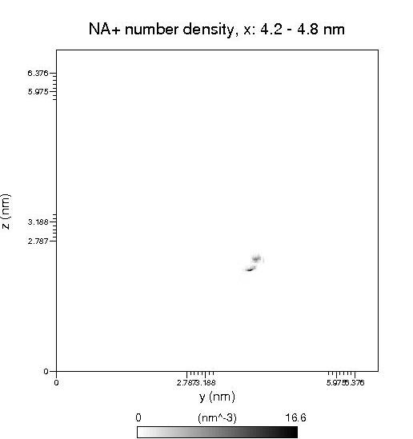
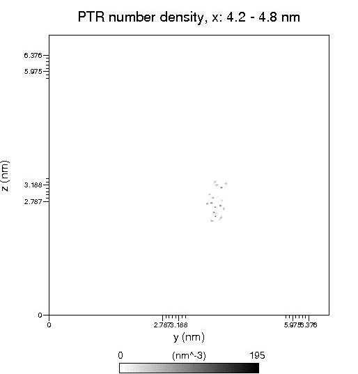
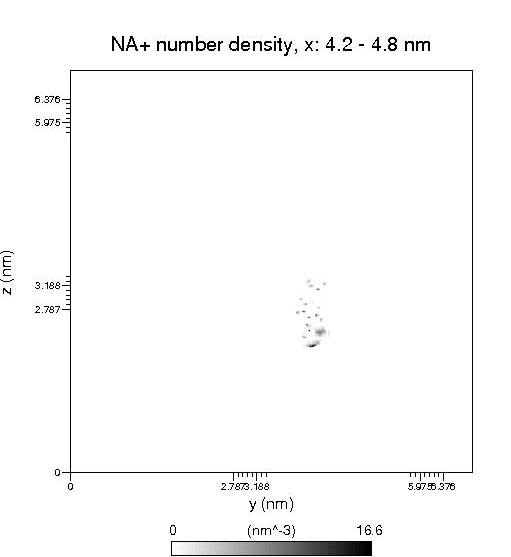

**使用g_densmap得到分子附近二维密度分布图**Using g_densmap to obtain a two-dimensional density distribution map near a molecule  
  
文/Sobereva @[北京科音](http://www.keinsci.com/)   写于约2008年

  
  
Gromacs的g_densmap可以把体系中某个组的出现密度投影到一个平面上，-aver设定一个轴，默认是z，也可以是x和y，投影到的就是垂直于这个轴的面，如z就是xy。-xmin和-xmax设定这个轴上的指定坐标范围内的粒子被投影到那个平面上。得到.xpm图。  
  
g_densmap还可以做轴向-径向密度分布图。用-rmax定义径向最大距离，-amax定义轴向最大范围。需要定义三个组，第一个组的质心和第二个组的质心用来确定轴的方向，这两个组质心的中间点作为坐标零点，方向是第一个组质心向第二个组质心。第三个组就是求密度的组。得到的xpm的横坐标是这个轴的不同位置，纵坐标是径向距离，颜色是密度。也就是这个轴的不同高度位置的垂直于轴的平面的径向分布函数。  
  
  
  
但是有时需要求某些粒子在某个分子周围分布的二维密度图，比如这里要得到一个磷酸化酪氨酸附近的钠离子出现密度，而且苯环与二维图的平面相平行。粒子的三维空间分布见我曾经发的《VMD显示轨迹中粒子的空间密度分布的两种方法》（<http://sobereva.com/14>）。  
  
和g_spatial一样，需要先对那个残基进行fit，但是g_densmap只能求x、y、z方向的投影，并不能自定义投影方向将粒子密度投影到苯环平面上。所以在fit前，需要把初始结构中磷酸化酪氨酸的苯环进行旋转，使其与某两个坐标轴组成的平面平行。这一步可以用VMD，选mouse-move-residue，按住shift拖动鼠标左键或右键旋转分子，这里让苯环与yz平面平行，然后save coordinate保存到新的pdb。  
  
tip:旋转分子的时候可能不好判断是否与坐标轴平行，因为VMD的坐标轴在左下角不好对照。所以可以自行绘制出xyz坐标轴以便参考。在控制台运行：  
draw color red  
draw cylinder { 0 0 0 } { 80 0 0 }  
draw cone { 80 0 0 } { 85 0 0 } radius 4 resolution 20  
draw color green  
draw cylinder { 0 0 0 } { 0 80 0 }  
draw cone { 0 80 0 } { 0 85 0 } radius 4 resolution 20  
draw color blue  
draw cylinder { 0 0 0 } { 0 0 80 }  
draw cone { 0 0 80 } { 0 0 85 } radius 4 resolution 20  
得到的坐标轴的0点就是真实空间的0点，也可以改在分子附近的位置。  
  
然后用trjconv将轨迹向这个结构fit，选磷酸化酪氨酸组作为参考组。  
  
轨迹处理好后，用VMD估一下合适的xmin、xmax范围，也就是苯环平面上下几埃的区域，这里定为z=4.2至4.8nm范围。运行g_densmap -f A.xtc -s A.pdb -aver x -xmin 4.2 -xmax 4.8。组选择钠离子那组。然后再运行一遍这个指令，选磷酸化酪氨酸那组。再把两个xpm图用xpm2ps转为.eps。  
  
钠离子的密度分布图：  
  
  
  
磷酸化酪氨酸的密度分布图：  
  
  
  
之所以要磷酸化酪氨酸的密度分布图，是为了定位用，因为还要把磷酸化酪氨酸分子结构画到钠离子密度分布图的对应位置。用photoshop等软件打开，把这两个图叠起来，如图：  
  
  
  
然后自行将磷酸化酪氨酸的结构图复制到上面即可，图中可以清楚地看到苯环，把结构图大小调整合适将苯环重合就行了，很简单，就不多说了。  
  
这个例子比较糙，没调坐标轴刻度，也忽略了磷酸化酪氨酸的分子内坐标的变化等问题，总之大概意思就是这样了，细节请自行研究。
