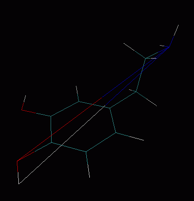
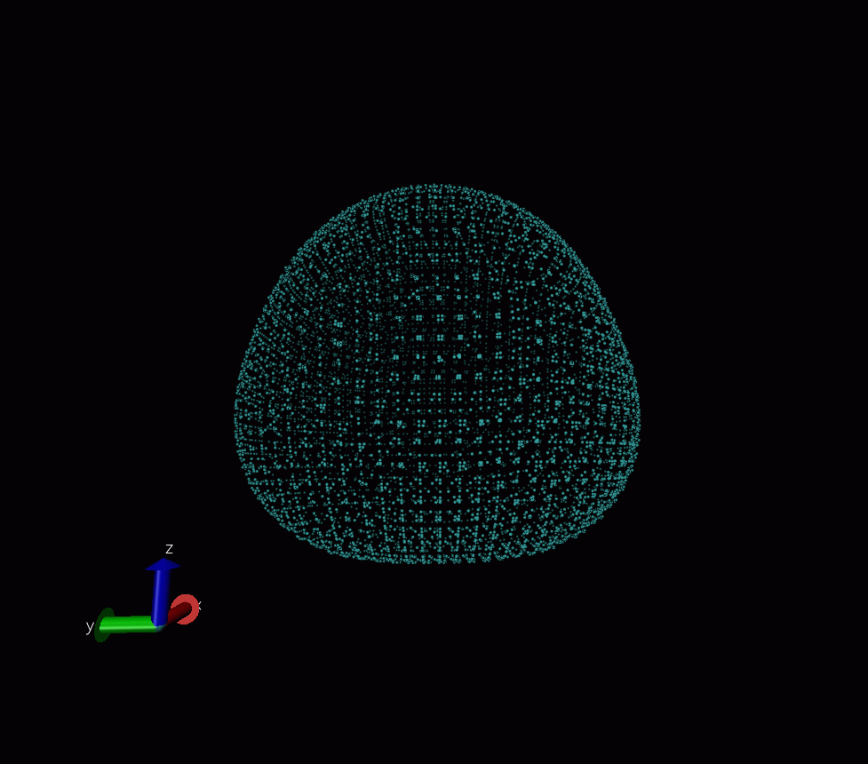
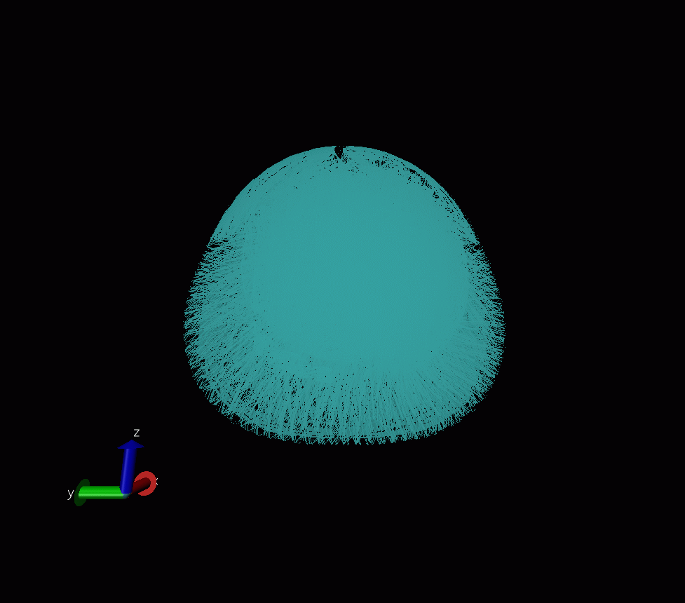
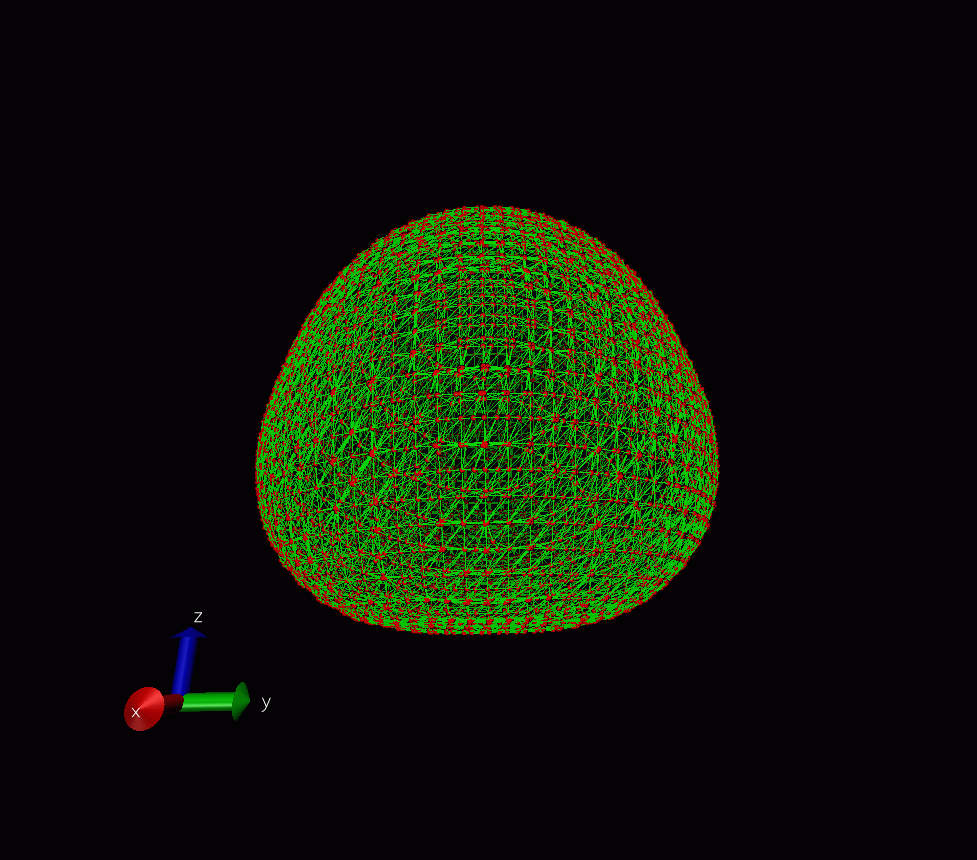

**使VMD根据pdb文件中的CONECT字段设定原子连接关系**Make VMD set the atomic connection relationship according to the CONECT field in the pdb file

文/Sobereva@[北京科音](http://www.keinsci.com)   2012-Jan-25

  
虽然pdb文件当中定义了CONECT字段用于明确定义原子间连接关系，然而VMD并不会利用之，无论有没有CONECT字段，VMD在读取pdb后都是根据距离范围自动猜测原子间连接关系。这种处理方式往往不能满足我们的特殊要求，利用DynamicBonds的显示方式也并不能完全解决问题。虽然也有conect2psf程序（http://www.ks.uiuc.edu/Development/MDTools/conect2psf/）可以将CONECT的连接关系转换为psf文件，载入psf文件后就可以向VMD提供自定义的拓扑信息，然而conect2psf程序只有IRIX 5.x下预编译好的版本，一般用户没法用。本文提供一个Tcl脚本，可以让VMD载入pdb文件时能够根据CONECT字段的信息设定连接关系。  
  
首先简要介绍一下pdb文件中的CONECT字段。CONECT字段一般出现在原子坐标定义之后，诸如这样：  
CONECT 1787 1786 1788 1789                                                        
CONECT 1788 1787 1793    
它代表了1787号原子和1786、1788、1789号原子相连，1788原子和1787、1793号原子相连。普通的残基、水分子不需要CONECT字段描述原子连接关系，因为根据原子类型和键长可以很明确地确定哪些原子是相连的。而对于涉及到非标准键长、特殊残基（比如血红素）、特殊残基与标准残基相连的情况，程序在判断哪些原子间应当相连时存在不确定性，CONECT字段提供的连接信息就用来解决这个问题。另外，二硫键也是靠CONECT来描述的。  
  
在VMD中，每个原子都有连接关系列表，用户可以查看和修改。在Tcl窗口中输入下面的命令选择3至5号原子  
set sel [atomselect top "serial 3 to 5"]  
然后输入$sel getbonds，返回比如：  
{20 8} {10 21} {5 19 18}  
这代表当前选择范围中的1号原子（对应 serial 3）与index 20、index 8原子相连；当前选择范围中的2号原子（对应 serial 4）与index 10、index 21原子相连；当前选择范围中的3号原子（对应 serial 5）与index 5、index 19、index 18原子相连。  
  
我们可以修改连接关系，比如让选择范围中的1号原子只与index 4原子相连，让2号不与任何原子相连，让3号在原有基础上还与index 8原子相连，那么就输入：$sel setbonds {4 {} {5 19 18 8}}  
此时会看到图形窗口中连接关系立刻更新了。你可能会觉得图上显示得很奇怪，有很多化学键只显示了一半。这是因为两个原子的连接关系列表里都有对方时才肯定会显示完整的键，如果A的连接列表里有B，而B里的没有A，那么往往只会显示出从A延伸向B的半个键。  
  
下面这个Tcl脚本就是根据上述原理通过读取CONECT字段来设定VMD中原子间连接关系。拷贝到Tcl窗口下即可运行。  
natm是体系中总原子数，nskipline代表在CONECT段落之前有多少行，这些行会被空过去。itype如果为0，CONECT字段定义的连接关系就是最终原子间连接关系；如果为1，代表CONECT字段定义的是附加的连接关系，而不是将原有连接关系给覆盖掉。  
此脚本允许CONECT字段中每个原子最多与12个其它原子相连（实际上这也是VMD自身的上限）。CONECT字段的第一列，即参考原子的序号，要求从小到大排序。不用给所有原子都用CONECT设定连接关系，需要设哪些原子连接关系就写哪些原子即可。  
  
#Programmed by Sobereva, 2012-Jan-25  
set natm 8312  
set nskipline 8313  
#itype=0 means reset connectivity by user-defined list, =1 means add self-defined connectivity list to the original one  
set itype 0  
set rdpdbcon [open "D://CM//my program//Multiwfn//vtx.pdb" r]  
  
#Skip other lines  
for {set i 1} {$i<=$nskipline} {incr i} {  
gets $rdpdbcon line  
}  
  
#Cycle each atom  
set ird 1  
for {set iatm 1} {$iatm<=$natm} {incr iatm} {  
  
if {$ird==1} {  
 for {set i 1} {$i<=12} {incr i} {set cn($i) 0}  
 gets $rdpdbcon line  
 scan [string range $line 6 84] "%d %d %d %d %d %d %d %d %d %d %d %d %d" self cn(1) cn(2) cn(3) cn(4) cn(5) cn(6) cn(7) cn(8) cn(9) cn(10) cn(11) cn(12)  
  
 set tmplist {}  
 #Formation of connectivity list  
 for {set i 1} {$i<=12} {incr i} {  
  if {$cn($i)==0} {break}  
  lappend tmplist [expr $cn($i)-1]  
 }  
}  
  
if {$self==$iatm} {  
 #puts Atom\ serial:\ $iatm\ \ User-connectivity:\ $tmplist  
 set sel [atomselect top "serial $iatm"]  
 if {$itype==0} {  
  $sel setbonds "{$tmplist}"  
 } else {  
  set orglist [$sel getbonds]  
  $sel setbonds "{[concat [lindex $orglist 0] $tmplist]}"  
 }  
 $sel delete  
 set ird 1  
} else {  
 set ird 0  
}  
  
}  
close $rdpdbcon  
  
  
我们来看一个使用例子。我们想把多巴胺分子的氮原子和对位的羟基氧和羟基氢原子连上。这三个原子分别对应于pdb文件中的3、2、22号原子（对应于VMD里的index 2、index 1、index 22）。那么首先在多巴胺分子的pdb的末尾从  
...  
HETATM   21  H   MOL A   1      -1.829   2.693  -0.089  1.00  0.00           H  
HETATM   22  H   MOL A   1      -3.743  -1.368   0.461  1.00  0.00           H  
END  
改为  
...  
HETATM   21  H   MOL A   1      -1.829   2.693  -0.089  1.00  0.00           H  
HETATM   22  H   MOL A   1      -3.743  -1.368   0.461  1.00  0.00           H   <--注：此为第23行  
CONECT 2 3   <--注：不要写在CONECT 3 2 22的后头，如前所述，必须先定义原子编号小的再定义大的。  
CONECT 3 2 22  
CONECT 22 3  
END  
之后将此pdb文件载入进VMD。根据pdb文件里的信息将脚本中的natm设为22，nskipline设为23，将脚本中的文件路径设对，确认itype为1，然后拷贝进tcl窗口中，图像就会立刻变成这样，和预期的一致：  
  

  
  
实际上，之所以寡人要写这个脚本，是与寡人近期研究工作有关。寡人正在为Multiwfn程序添加一个新功能，也就是利用Marching tetrahedron算法做分子表面分析，这个算法可以将等值面细分为一堆三角形。为了检验程序代码是否正确，寡人将这个算法产生的大量表面顶点作为原子，通过pdb文件载入VMD以显示之，下图的例子是一个水分子的电子密度为0.001的表面，共9654个顶点：  
  
  
  
以line方式绘制出的VMD自动判断的连接关系完全是一团糟：  
  
  
  
寡人写的程序中全部顶点的连接关系会输出到pdb文件的CONECT字段，利用上面的脚本重设原子连接关系后（即itype应为0），得到下面的图，正确显示出分子表面已经被化成一堆三角来描述了。很多分子可视化软件中在显示格点文件等值面图时都可以用mesh方式来显示，会看到网状图案，实际上原理与此处是一致的。  
  

