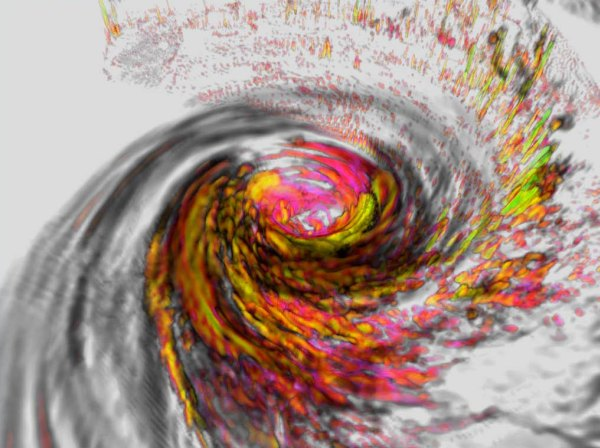
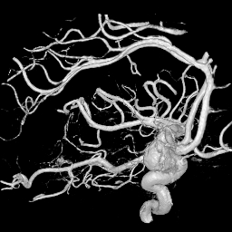
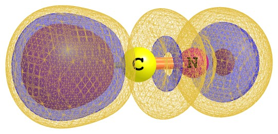
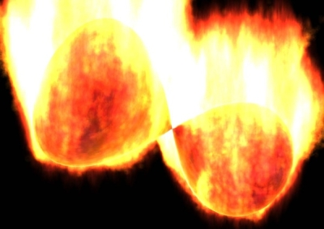
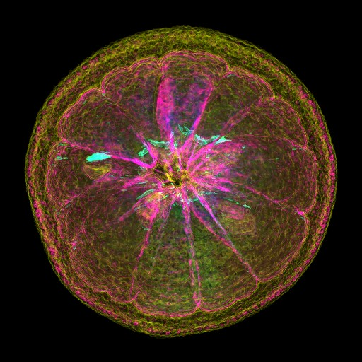
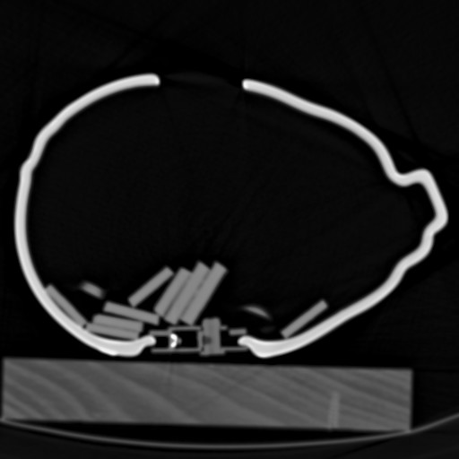
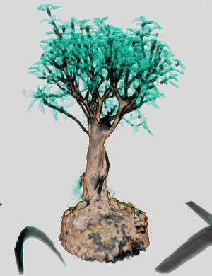
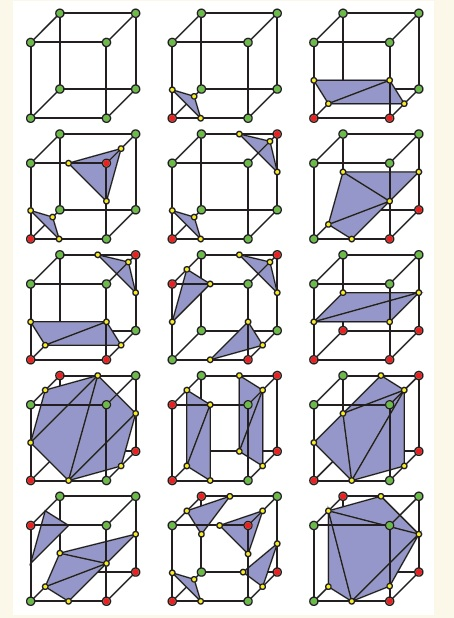

**谈谈体数据1：介绍体数据**  
On the volumetric data 1: Introduction to volumetric data

文/Sobereva  2012-Feb-12

前言：《谈谈体数据》是一系列帖子，写这些帖子的目的，就是让读者了解什么是体数据，尤其是想让计算化学工作者开阔视野，领会到经常分析的诸如轨道波函数等值面图与计算机图形学领域、医疗成像领域及其它计算科学界涉及的普遍意义的体数据之间的本质联系，能够进而利用比起计算化学领域的可视化软件更强大的通用体数据渲染软件绘制出漂亮乃至艺术级的和化学相关的体数据。

## 1 体数据的基本概念

体数据(Volume data)记录了某个三维或多维空间范围内各个离散的格点上的数值，格点数据（Grid data）是体数据的另一种称呼。在计算化学界常用的Gaussian型cube文件就是体数据的一种记录方式。格点间隔区域上的数值可以用离它最近的格点数值来表示，或者使用插值方法通过临近格点数值来生成。

体数据在计算机图形学、生物医学、地质学、计算物理/化学、材料学等诸多领域都有重要用途，将它图形化后可以产生漂亮的效果，或通过直观分析得到有价值的信息。下面给出几个例子

图1 美国大气研究中心模拟的伊莎贝尔龙卷风  

图2 旋转X射线扫描得到的人脑右边的动脉瘤  

图3 氰化氢分子的电子定域化函数图  

图4 模拟火焰燃烧效果  

除了用于可视化，一些科学研究中的数值方法也要借助于格点数据。比如在计算化学中，有一类盆积分方法就是基于格点数据的（用于AIM、电子定域性分析），定量分子表面分析（可用于研究分子反应位点、预测热力学性质、相互作用强度等）也要借助于格点数据。

最常见的体数据记录的是三维笛卡尔空间分布的立方格点上的标量数据。在一些领域，也使用更高维的空间，或者纳入时间的维度，即(x,y,z,t)形式。有时也用其它坐标，如曲线坐标、球面坐标，以及其它类型的格子，比如三斜格子、八面体格子、四面体格子等。每个点上的数据也不都是标量，可以是向量数据（如电场），也可以含有多个量的数值（比如气温、气压、湿度、空气中各物质的浓度）。

## 2 获得体数据的方法

获得体数据的方法主要分两类，一类是测量得到的数据，另一类是计算模拟得到的数据。

能获取体数据的测量技术/仪器有很多，它们需要将测量到的信号进行重新处理后才能得到体数据。比如医学上用的核磁共振(MRI)、计算机辅助X光断层摄影(CT)、正电子发射断层摄影(PET)、弥散张量成像(DTI)；材料学用的超声波扫描显微镜(C-SAM)；生物学上用的激光扫描共聚焦显微镜(CLSM)、冷冻电子显微镜；还有化学上的X光衍射等。不同技术适合不同组成、尺度的物质和不同问题的研究。

计算机模拟可以直接得到很多类型的体数据。比如量子化学上，可以计算轨道波函数、电子密度、电子定域性函数、外磁场下电流密度分布；分子模拟中可以计算不同粒子的密度分布；气象学/海洋学等领域利用流体力学可以模拟温度、速度、密度分布等等。

值得一提的是，断层摄影得到的体数据有很多非常有趣的用途，断层扫描仪如同一台昂贵的大玩具。比如可以了解一个橘子里有没有籽

了解储蓄罐里有多少钢镚

如果有一台断层扫描仪，自家的盆景也可以扫描成体数据

实际上，安检用的就是类似这样的技术。

一些测量或模拟得到的体数据文件可以在一些数据库中下载到，比如  
V3程序的数据库：<http://www9.informatik.uni-erlangen.de/External/vollib/>  
VolrenApp程序的数据库：<http://www.gris.uni-tuebingen.de/edu/areas/scivis/volren/datasets/datasets.html>  
VolrenApp程序的数据库（新）：<http://www.gris.uni-tuebingen.de/edu/areas/scivis/volren/datasets/new.html>  
Stenford的数据库：<http://graphics.stanford.edu/data/3Dscanrep/3Dscanrep.html>

## 3 体数据的可视化

体数据的可视化的基本流程是：  
1 获得体数据：如上一节所介绍的。  
2 体数据的变换：将得到的体数据去噪，过滤异常值，调节数值分布范围，差值或向下采样，与其它体数据融合等。  
3 数据分类(data classification)：这个词有些抽象，原意是通过对数据分类使数据能够最高效地被使用。而对于体数据的可视化，这个词是指通过设定合适的参数，让感兴趣的区域能够清晰地展现出来。具体来说，以显示等值面方式来显示时，就是指设定一个合适的等值面数值(isovalue)；若是用直接体渲染方式，则是设定不同空间或数值范围内的点的色彩（RGB值）和透明度（Alpha值）。  
4 产生图像：有很多方法，将在下面介绍。

产生体数据图像的方法主要分为两类：

1 直接体渲染（direct volume rendering, DVR）包括光线投射算法(Ray-casting)、错切-变形法(Shear-warp)、频域体绘制法(Frequency Domain)、抛雪球算法(Splatting)、Sabella法、V-buffer法等等，这些方法可以直接得到屏幕上像素点的色彩值。目前最为常用的是光线投射算法。

光线投射算法的基本原理是：从屏幕的每个像素径直引出射线，一部分或全部射线将会穿过体数据的各个格子，根据射线依次穿过的位置上的色彩值和不透明值（通过与之相邻的点的在数据分类阶段由用户设定的色彩和不透明度进行插值来得到）对色彩和不透明度进行依次累积，直到光线透过了体数据区域或者不透明度为1时停止。将累积下来的色彩和不透明度相乘，结果就是发出这条射线的像素的色彩值了。在累积过程中还有一些与权重相关的细节问题这里就不提了。

光线投射法与另一个耳熟能详的光线追踪法(Ray-tracing)的区别在于后者发出的光在碰到物体时会反射、折射，不考虑穿越过程的色彩的累积，而只考虑相交处的情况。而光线投射法发出的光会一直径直前进并累积色彩，也因此不会产生阴影效果。

2 间接体渲染(indirect volume rendering, IVR)。用这种方式得到的是等值面图，即这个面上各处的数值都等于用户设的isovalue值。先要构建等值面模型（由一堆三角形构成），再按照标准的图形学渲染方法得到图像，因此是间接的。计算化学的可视化软件几乎全都是用等值面方式展现体数据，若使用mesh方式显示等值面，就可以看到构成它的三角形了，比如本文图3里最外层的那层等值面。

构建等值面的方法非常多，最常用的是Marching cubes方法，这里简单介绍一下基本原理。这种方法是先判断各个点上数值是否大于isovalue，如果大于就记作1，如果小于就记作0。一个格子是由6个点组成的，扫描每个格子，若6个点不都为1也不都为0，就代表这个格子就穿过了等值面。总共有2^6=256种穿越方式，如果考虑对称性的话，可以简化为15种，如下图所示：

 

绿色和红色顶点代表是否这个点的数值大于isovalue。红点和绿点之间的连线显然跨过了等值面，通过线性插值方法近似得到的与等值面相交的点用黄点表示，这些黄点就是等值面上的点了。每三个这样的点构成一个紫色三角形。所有的穿过等值面的格子产生的紫色三角形连起来就构成了等值面。

Marching cubes的一个最大问题是模糊性问题，这会造成生成的等值面在个别地方出现错误。若通过这种IVR方式显示血管时由于等值面构建问题，导致误诊为血管梗塞而做搭桥手术，结果手术失败使患者死亡，那就糟糕了。有很多人提出了不同方法去解决这个问题，有兴趣的读者可参考综述文章Computers & Graphics, 30, 854。另一种构建等值面的方法是Marching tetrahedron，这种方法是把每个格子再切成5、6个或多个三角形然后以类似方法构建等值面上的三角形，这种方法比Marching cubes的优势在于没有了模糊性，而且等值面穿越三角形的方式只有2^4=16个，通过对称性可简化为三种，大大方便了编程。但缺点是会产生比Marching cubes更多的顶点，加重渲染负担，而且三角形的质量更加恶化，总有很多三角形面积非常小（对于等值面模型质量几乎没贡献，故浪费了计算量）。寡人更偏好Marching tetrahedron方法，日后会专门写一个帖子详细介绍原理和算法的实现。

对于数据量很大的情况，第一次构建等值面会花一定时间，一旦等值面模型构建好了，再去旋转缩放视角就非常快了，不需要再去访问体数据了。除非又调整了isovalue，则又得需重新构建一遍模型。DVR方式下每更新一帧都需要重新算一遍，因此旋转缩放视角的过程的计算量会比IVR大很多。好在光线投影算法逐渐被转移到了GPU中实现，这使得计算速度大为加快，旋转缩放等操作可以实时完成。

等值面图虽然可以比DVR得到的图更清楚、准确地定量研究体数据，但是图形效果上做不到DVR那么炫（但使用DVR的话得在数据分类阶段更费心思调节），起码是对于目前这些计算化学可视化软件来说。因此，想做出令人眼前一亮的富有艺术气息的体数据图，计算化学工作者们应当学会那些支持DVR模式的通用的、高级的体数据可视化工具。

另外，考察体数据也可以用二维截面图，这能更清晰地展现特定平面上的细节，但没法同时考察整个空间的体数据，需要不断挪动、旋转截面，难以把握整体。

## 4 体数据的精度、格式

体数据没有固定的格式。不同程序有各自的私有体数据格式，以不同精度、顺序、压缩方式记录数据，并包含一些特定信息，如格子定义、注释等。一些程序影响力比较大则其格式通用性会强一些，比如OpenDX的.dx格式。不同研究领域也有本领域的比较通用的格式，比如计算化学界的Gaussian类型的cube文件，可参考此文的介绍：《Gaussian型cube文件简介及读、写方法和简单应用》（<http://sobereva.com/125>）。

唯一一个跨领域通用的格式是raw格式，这种格式非常简单，就是将全部格点数据以二进制方式按顺序写入，没有经过任何额外处理，且连格子设定都没有在其中记录，也没有定义数据类型。因此，如果没有额外的信息记录各个维度的格点数和平移矢量的长度比例，那么这种数据根本没法利用。高档相机和一些扫描仪等图像采集设备也都能输出raw格式，这种平面图像的raw格式和体数据的raw格式类似，也是没有额外信息也未经压缩而直接写入的二进制数据，但区别是它记录的是二维数据点上的数据而非三维或更高维，而且它记录的一定是色彩信息（灰度信息，或者红、绿、蓝的数值）。

raw形式储存的体数据一般都是使用单字节(8bit数据)或双字节(16bit数据)的整数来表示数值大小的，数据范围分别是0~255和0~65535（假设是无符号整数，后同）。一般这种精度范围足矣区分出不同区域数值大小了。很少见到以4字节整数方式记录（数据范围0~4294967296），因为图形化显示本来也达不到那么高的精确度，而且测量仪器输出精度也有限。以单精度或双精度浮点数记录的raw格式也很少见到。

在一些计算模拟领域中生成的体数据是浮点数，可能有很大的数值范围，而且数值分布也不均匀。比如电子密度是随着远离原子核呈指数型下降的，原子核附近电子密度比化学键区域大得多。对于cube文件，由于是用浮点数储存的，所以储存在这样的格式里没什么问题，但如果转存为比如单字节的整数型raw格式就会越界了。因此，就需要对数据范围进行移动、拉伸，这样才能让数据范围落在0~255以内，并且分布均匀，使作图方便。

体数据为了避免单个文件太大不好处理，或者受限于格式定义，有时会将某个维度拆成单独的文件存放。比如随时间变化的数据可能每个时间点都有单独的体数据，断层扫描的体数据可能把每一层的数据保存为一个个二维面数据。
