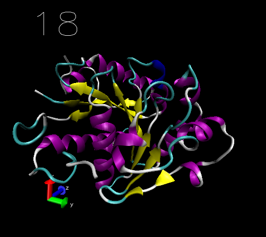

**使VMD播放轨迹时同步显示帧号**Making VMD display frame number synchronously when playing trajectory  
  
文/Sobereva@[北京科音](http://www.keinsci.com)   写于约2008年

  
   
  
把这段内容存为showframe.tcl，保存在vmd文件夹。启动VMD后直接在文本控制台运行source showframe.tcl  
  

```
trace variable vmd_frame(1) w sdf
mol new
proc sdf {args} {global vmd_frame
graphics 0 delete all
graphics 0 color 8
graphics 0 text {0 0 0} "[expr $vmd_frame(1)*1]ps" size 6}
```

  
之后载入轨迹，此时轨迹的ID应该是1，因为上面vmd_frame(1)代表的就是ID=1的体系的当前的帧号，一旦发现它变化了，就调用sdf命令把帧号绘制出来。播放轨迹时帧数会同步显示在三维坐标的0,0,0的位置，位置肯定不好，所以旋转图像使得文字位置合适（比如移到屏幕右下角），然后把ID=0的那层（也就是显示帧数的文字所在的层）fix住（鼠标点ID右边的F字母）即可。  
  
注意播放的轨迹必须是ID=1才可以。这样录制轨迹动画就可以同步地显示帧数了。  
  
   
  
效果如图：  
  


