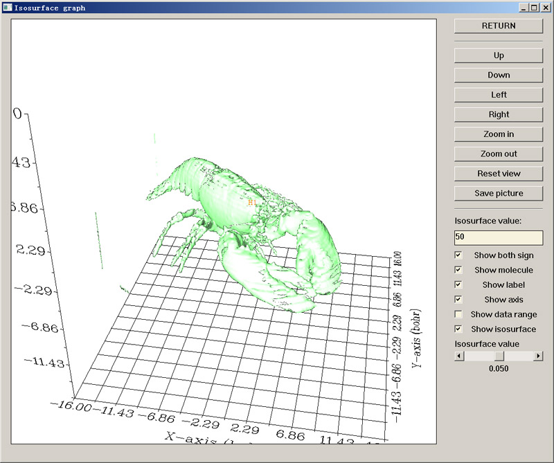
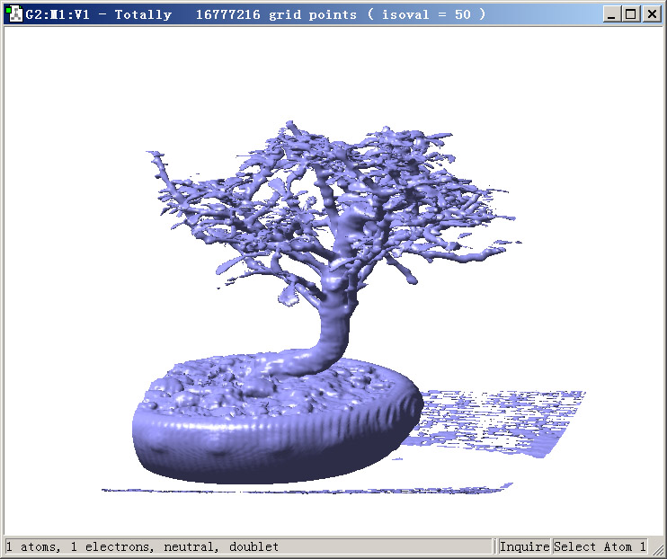
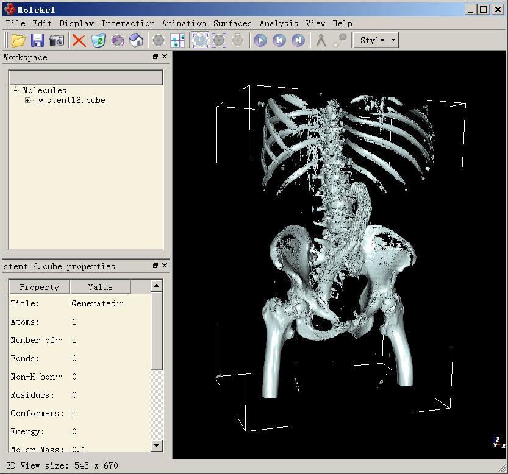
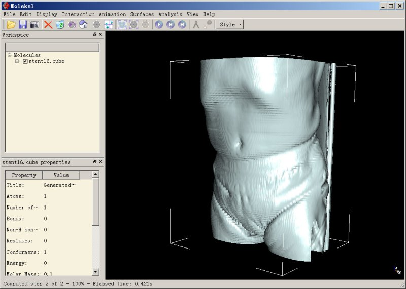
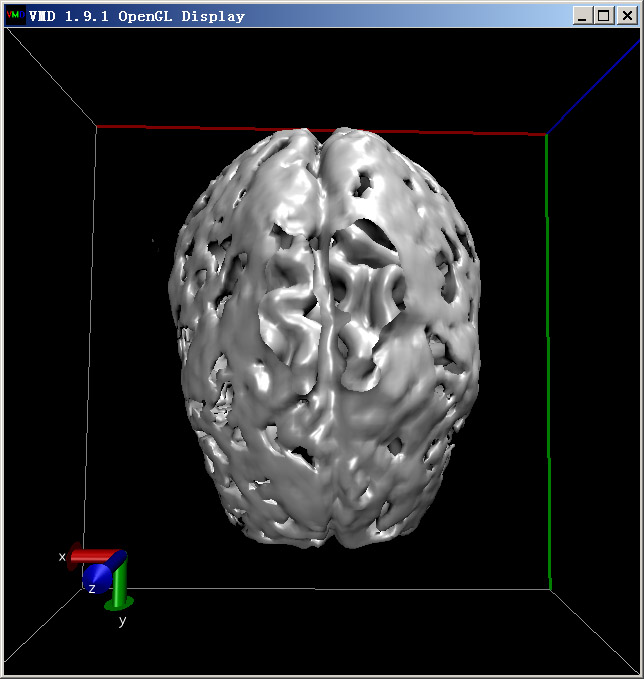
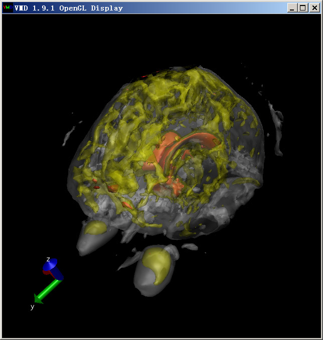
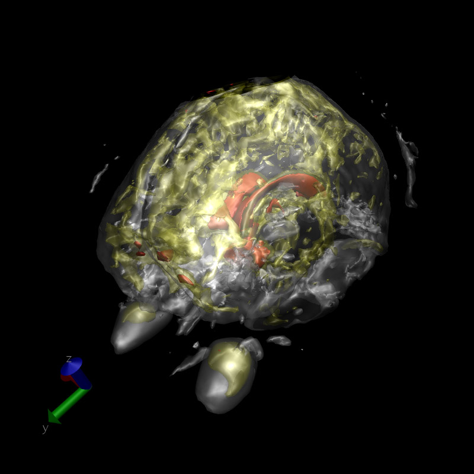
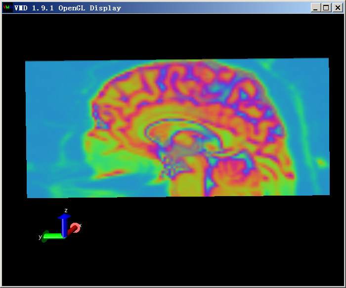
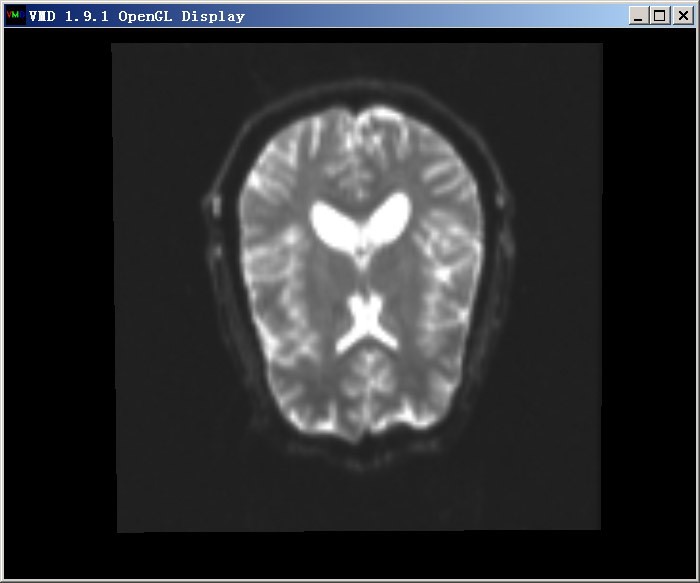
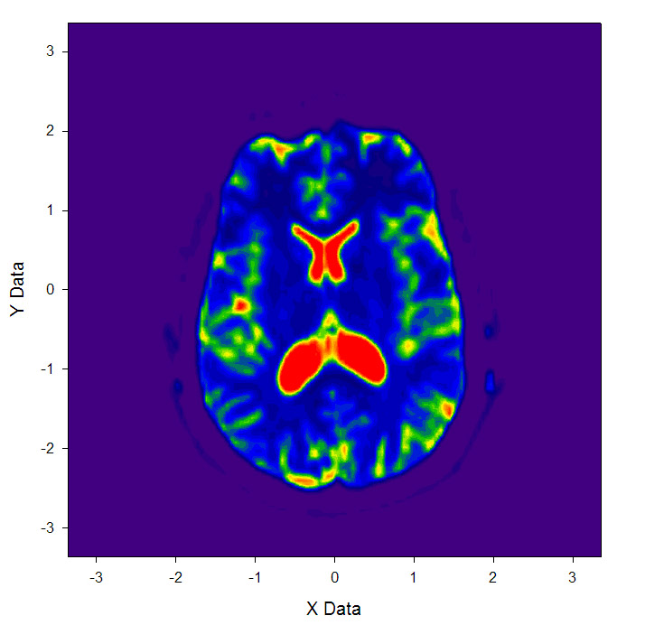

**谈谈体数据3：用Multiwfn、Gaussview、Molekel、VMD观看龙虾、盆景、骨盆、大脑**  
On the volumetric data 3: Using Multiwfn, Gaussview, Molekel, and VMD to view lobsters, bonsai, pelvis, and brain

文/Sobereva @[北京科音](http://www.keinsci.com/)   2012-Feb-22

原本打算标题定为《使用计算化学可视化软件观看与化学无关的体数据》，但感觉太刻板吸引不了眼球，就改成当前这个标题了。这篇帖子是《谈谈体数据》系列文章之三，比较有趣味，将介绍如何用一些常见的计算化学可视化软件，包括GaussView、VMD、molekel，以及Multiwfn（<http://sobereva.com/multiwfn>），通过等值面的方式观看乱七八糟的与化学毫无关系的体数据。这有助于了解显示体数据的操作方法，也有助于了解体数据的意义和价值。此文将涉及到《谈谈体数据》系列的前两篇文章的知识，建议先看一看，第一篇是《谈谈体数据1：介绍体数据》，见<http://sobereva.com/127>。第二篇是《谈谈体数据2：体数据格式转换工具vodaconv的使用及原理》，见<http://sobereva.com/128>。

## 1 用Multiwfn观看龙虾

从Multiwfn2.3开始，Multiwfn可以读入cube文件，可以直接用于显示cube文件的等值面。这里用它来观看盆景的体数据。

用Multiwfn观看龙虾就必须得到相应的体数据文件。在Volrenapp的老版体数据库<http://www.gris.uni-tuebingen.de/edu/areas/scivis/volren/datasets/datasets.html>里面找到龙虾图案并点击，得到lobster.raw.gz。此数据库里的体数据都是8bit精度，这个是龙虾的CT扫描得到的体数据，从旁边的信息得知这个龙虾的体数据的点数是301x324x56，格子比例是1:1:1.4。

在这里下载vodaconv程序：[/usr/uploads/file/20150611/20150611014131_45262.rar](http://sobereva.com/usr/uploads/file/20150611/20150611014131_45262.rar)。将lobster.raw.gz解压为lobster.raw，并拷到vodaconv所在目录下。启动vodaconv.exe，依次输入  
lobster.raw   //文件名  
301,324,56    //各方向的点数  
0.1,0.1,0.14   //各方向格子间距（bohr）。绝对数值无所谓，只要比例是1:1:1.4就行了。设为0.1数量级是因为这种情况下体数据的各方向总长度将会在一般的分子尺度内，方便观看  
[直接敲回车]     //raw格式体数据没有定义原点，这一步直接敲回车的话将vodaconv将自动把原点设定在体数据中心  
1    //表明这是8bit整数数据  
2    //不对数据做scale，保持数据原样  
lobster.cub  //输出的文件名，根据后缀名程序会知道要输出为Gaussian型cube文件

lobster.raw仅有5.2MB，而转换后却有69.5MB。这是因为.raw是二进制文件，一个8bit数据点只占一个字节。而cube文件记录的是字符数据（也有二进制型cube文件，但不被普遍支持），每个数据要用13个字符来表达，即13字节，因此转换后大小约是之前的13倍。

将Multiwfn目录下的settings.ini里的aug3D参数从默认的6改成16并保存，这样方可让坐标轴足够长，而令龙虾能显示完整。  
启动Multiwfn，输入lobster.cub文件的路径，然后选功能0，等一会儿就会出现图像。由于这个体数据的格点数远比一般的分子的体数据要多，因此会显示得颇慢。图像第一次出现时是在默认的0.05的isovalue下做的图，并没显现出龙虾。在isosurface value文本框里输入50，敲回车，等一会儿就会看到龙虾了：

从raw转换为cube文件时为了兼容性考虑，会自动在原点加入一个氢原子，因此会有一个氢原子标签，可以点一下Show label复选框来关掉之。

之所以将isovalue设为50，是因为将它设为这个值的时候对于这个体数据来说图像效果较好。8bit整数范围在0~255，需要在这个范围内反复设定isovalue并作图才能找出一个最合适的isovalue值。一开始作图时由于默认的0.05的isovalue过小，龙虾被CT扫描时产生的数据噪音或者周围空气产生的信号所掩盖了所以看不出来。

Multiwfn提供显示等值面的功能只是为了提供一个方便，对于这样格点数很多的情况显示等值面的速度比Molekel、VMD低得多。

## 2 用Gaussview观看盆景

还是在刚才的数据库中，点击盆景图案下载盆景的CT扫描的体数据文件bonsai.raw.gz，用和上一节完全一样的步骤，通过vodaconv将之转化成bonsai.cub。注意各方向点数应输入256,256,256，输入间距的时候直接敲回车就行了，代表用默认的0.1,0.1,0.1，因为这个体数据文件是1:1:1的格点间距。

启动Gaussview，进入打开文件界面，文件类型选Cube files，选择bonsai.cub。选Results-Surfaces/Contours，此时会看到已经有一个cube文件被载入了。将Density设为50（这也即isovalue的值），然后点Surface Actions-New surface，耐心等一阵子，然后将视角拉远，就会看到盆景了（为了清楚，背景改为了白色。通过在图上点右键-View-Hydrogens可以将额外加入的氢屏蔽掉）：

Gaussview在显示大型体数据的等值面的时候也很慢，因此没什么实际应用价值。显示几百万个点的体数据的等值面的速度尚可，而当前体数据则有256^3=1600万个点。对于精度更高的体数据，比如512^3=1.34亿个点的情况，用Gaussview显示等值面就别想了。

## 3 用Molekel显示骨盆和腹部动脉支架

本节用Molekel显示骨盆和腹部动脉支架。在Volrenapp的新版数据库<http://www.gris.uni-tuebingen.de/edu/areas/scivis/volren/datasets/new.html>里面下载Stented Abdominal Aorta 16Bits对应的stent16.raw.zip，解压成stent16.raw。

这个数据库中的16bit整数记录的体数据都是Little Endian顺序，因此应当使用vodaconv压缩包里的vodaconv_LE.exe来做转换，而不是使用用Big Endian顺序的vodaconv.exe做转换。关于这一点我在《体数据格式转换工具vodaconv的使用及原理》里已经详细说明了。

启动vodaconv_LE.exe，依次输入  
stent16.raw  
512,512,174  
0.8398,0.8398,3.2  
[回车]  
2  //读入的raw文件的数据类型是16bit整数  
2  //不scale数据  
stent16.cube  //后缀名这回写成.cube而非.cub，实际上里面的格式都一样，只是Molekel在读入cube文件时必须要求后缀是.cube

启动Molekel，这里用的是5.4.0.8版。在其中打开stent16.cube，耐心等待读取完毕，然后选Surfaces-Grid data，在Value里填1300。这个体数据很大，如果想全精度地显示出来，那么应保证有1.5GB空余内存；如果想损失一些精度，以节省内存且让显示速度加快，那么可以将Step Multiplier设为2或者更大。

最后点Generate按钮。此时会看到程序左下角生成等值面的进程，待生成完毕后，将视角拉远，就会看到骨架了：

你会发现肚子中央有两条网状的物体，那个就是腹部动脉支架。

如果将Value值设小一些，比如设为700，将会使X射线更容易穿透的区域也被显示出来，因此你将会看到身体表层的结构，以及做扫描时后背贴着的背板的结构：

Molekel的bug略多，生成等值面的过程中可能会崩溃、或者显示不出来等值面，不要觉得奇怪。整体来说，还是下面用的VMD在显示大型体数据的等值面时最稳健，速度也快，而且更为灵活。

## 4 使用VMD显示大脑结构

本例将使用VMD显示DTI（弥散张量成像）方法产生的大脑结构的体数据。DTI是通过外加磁场，根据测定的脑实质中水弥散的各向异性对大脑进行定量成像的方法。

进入<http://www9.informatik.uni-erlangen.de/External/vollib/>，在网页中搜索4977B2FE，点击对应的Downlaod按钮得到DTI-B0.pvm。pvm格式是V3体数据可视化软件专用的格式，必须通过pvm2raw转换成raw格式，再用vodaconv将之转换为cube格式才能用VMD显示。

在这里下载我编译好的V3程序附带的pvm2raw程序：[/usr/uploads/file/20150611/20150611013430_27584.rar](http://sobereva.com/usr/uploads/file/20150611/20150611013430_27584.rar)。其中还包含了raw2pvm，用于将raw转成pvm格式，将在《谈谈体数据》系列后续文章用到。

将DTI-B0.pvm放到pvm2raw.exe所在的目录下。建立一个文本文件，内容是pvm2raw DTI-B0.pvm DTI-B0.raw，然后将此文本文件扩展名改为.bat（即Windows下批处理文件）。再双击此bat文件执行之，就得到了DTI-B0.raw。

将DTI-B0.raw拷到vodaconv目录下。由于这个数据库的体数据都是Big Endian顺序，所以应启动的是vodaconv.exe而非vodaconv_LE.exe，然后依次执行：  
DTI-B0.raw  
128,128,58  
[直接敲回车]  
[直接敲回车]  
2  
2  
DTI-B0.cub

启动VMD，将DTI-B0.cub拖进VMD main窗口。选Graphics-Representation，将第一个显示方式的Drawing Method设成Isosurface，Draw从默认的Points改为Solid surface，拖动Isovalue滑条到500左右，就能看到下面的大脑外层轮廓：

但是这种图没法同时看到大脑内外层结构。一种办法是使用多个不同颜色的对应不同isovalue的透明等值面。先将Display-Rendermode设成GLSL（一些机子上可能因为显卡太老或驱动问题而选不了，这将导致无法产生透明效果）。在Graphics-Representation里建立三个Isosurface风格的显示方式，第一个的isovalue设为260，Material设为Transparent；第二个Isosurface也用Transparent，Isovalue设为720，Coloring Method设为ColorID，并选4（黄色）；第三个Isosurface用Opaque材质，isovalue设1250，Coloring Method设为ColorID，并选1（红色）。另外，将这三个显示方式的Show都从Box+Isosurface改为Isosurface以免盒子边缘碍眼，将看到如下效果：

也可以用免费的外部渲染器POVray渲染一下，效果会更好：

这下，大脑的结构层次就看出来了。最外层等值面会显示出两个大椭球，那就是眼珠了。

接下来，我们在VMD里显示大脑切片图。实际上，这也就是医生经常看的大脑切片照片。首先将Display-depth cueing关掉，这样切片图会更鲜亮。然后建立一个VolumeSlice的显示方式，拖动Slice Offset到不同位置，就能看到不同位置的截面图了。下图是X的offset值为0.5时的图

如果想把截面图弄成黑白的，更有医院的感觉，可以在Graphics-color-Color scale里将Method设为BlkW，然后将截面图显示方式的Coloring Method设为Volume。直接得到的图像效果不好，对比不明显，可以在Trajectory标签页里调节Color Scale Data Range，比如上下限设为0和1000，然后点Set，效果会好很多。也建议在Display里将所有光源都关掉。得到的Z的offset为0.44的截面图如下所示：

另外，还可以同时建立多个截面显示方式，同时显示出大脑不同截面，请自行尝试。

## 5 使用Sigmaplot显示大脑截面图

VMD虽然能直接显示截面图，但是图片不够精细，也不很适合直接拿来作为插图。一种得到更高质量的截面图的办法是用Multiwfn提取出指定平面的数据，然后用Sigmaplot等专业一些的绘图软件绘制平面图。这里，就结合Multiwfn和Sigmaplot绘制上面那张Z的offset为0.44的大脑截面图。

启动Multiwfn，输入DTI-B0.cub的文件路径，在载入数据结束后会出现格点数据的统计信息。从中可看到这个体数据的z范围是从-2.85到2.85bohr。VMD中的Z offset=0.44指的是这个XY平面的Z值为整个体数据Z值范围的44%的位置。因此，我们要提取的是Z值为((2.85*2)*0.44-2.85)*0.5292=-0.181埃的XY平面上的数据。接下来在Multiwfn中输入  
13 //进入主功能13，即格点数据处理功能  
2  //提取某个XY平面  
-0.181  //Z值（埃）  
此时，与Z=-0.181埃最接近的XY的平面上的数据都被输出到了当前目录下的output.txt里了。

启动sigmaplot（本文用的是11.1版），File-import file，选output.txt，然后点import按钮。导入完毕后，在界面左侧找到contour plot按钮，点击后再点击彩色的Filled color按钮，选XYZ Triplet，X,Y,Z分别设为第1、2、4列，点“完成”。在图像上双击，在Plots-Scale里将上下限分别设为100和1100以改善显示效果，点“确定”后就会看到下面的图像，比起VMD显示的精细很多：

## 6 总结

通过本文的实例，显示了计算化学可视化软件不光可以观看化学相关的体数据，即分子轨道、电子定域化函数、电子密度等，还可以像通用的体数据可视化软件一样研究其它各种类型的体数据，这直接沟通了化学软件与生活中的物件以及生命医学间的桥梁。有兴趣的话，不妨利用本文的方法自行从那些数据库中下载感兴趣的体系来观看一下。不过，化学上的软件在显示体数据方面比起专业的软件还显得比较业余，功能、效率和画面效果还有不小差距。在《谈谈体数据》后面的文章中，将介绍利用一些更专业、强大的通用的体数据可视化软件来绘制出很炫的化学相关的图形。
