**使用Multiwfn绘制NBO及相关轨道**  
Using Multiwfn to plot NBO and related orbitals

文/Sobereva @[北京科音](http://www.keinsci.com/)  
First release: 2012-Apr-4    Last update: 2018-May-24

## 1 前言

NBO程序输出的轨道包括NBO（自然键轨道）、NHO（自然杂化轨道）、NAO（自然原子轨道）、NLMO（自然定域化分子轨道），以及前头带P的类型，如PNBO（初自然键轨道）。NBO程序输出的plot文件包含了这些轨道的一切信息。

可视化这些轨道有很多方法：  
(1)对于Gaussian用户，可以用pop=saveNBO或pop=saveNLMO将NBO和NLMO轨道写入chk文件中，再用Gaussview观看。但是对于其它类型轨道就没辙了。  
(2)用ChemCraft。这个软件是收费的，而且我曾发现在基组含有高角动量函数时这个程序给出的图形是明显错误的。  
(3)用NBOView。这个程序也是收费的，而且界面设计非常落伍，操作不便。  
(4)用Zork编写的NBO2molden程序将NBO plot文件转换为Molden的输入文件，然后用Molden程序去看。然而Molden这个程序我认为很不好用。

Multiwfn是强大的波函数分析程序，很早就开始支持读入NBO plot文件来绘制前述各种类型轨道，可以很方便地显示等值面图，也能绘制出各种各样漂亮的平面图、曲线图，操作很方便。而且Multiwfn还可以同时绘制两条轨道，对于分析NBO轨道间重叠并由此讨论超共轭很有用。另外，在轨道生成速度上Multiwfn比任何其它可视化程序都要快。由于Multiwfn灵活、高效、免费，而且图像显示效果好，在绘制与NBO相关的轨道方面Multiwfn是最佳选择。本文将介绍如何用Multiwfn绘制NBO轨道，其过程也同样适用于绘制分子轨道、自然轨道等。在轨道的一般性绘制方面笔者另有文章，里面介绍了很多要点和技巧，强烈建议一看：《使用Multiwfn观看分子轨道》（<http://sobereva.com/269>）。

Multiwfn可以从官网<http://sobereva.com/multiwfn>下载。入门信息看《Multiwfn入门tips》（<http://sobereva.com/167>）和《Multiwfn FAQ》（<http://sobereva.com/452>）。

使用本文的做法绘制轨道发表文章时记得必须按照Multiwfn提示时显示的信息**正确引用Multiwfn**。

顺带一提，如果你对NBO分析不熟悉，不知道怎么正确分析，非常推荐学习我讲授的**“量子化学波函数分析与Multiwfn程序培训班”（<http://www.keinsci.com/WFN>）**课程，其中有大约240页幻灯片专门讲NBO，极其系统、深入、全面、详细讲授NBO分析的各种相关理论知识、应用以及NBO程序的使用，由此可以一次性从入门到精通。

## 2 输入文件

这一节介绍一下怎样产生能够让Multiwfn显示NBO及相关轨道的输入文件。Gaussian的fch文件和NBO plot文件都可以用作Multiwfn的输入文件。**我强烈不建议基于fch文件来看NBO轨道**，在于：(1)如下文所述，此时你需要找NBO输出信息里的轨道序号和fch里的序号的对应关系，很麻烦 (2)此时的fch文件没法用于看分子轨道（因为轨道信息被顶替了），且很多Multiwfn中的波函数分析都没法正常做。

### 2.1 使用fch文件

对于Gaussian用户，可以在route section里写上pop=saveNBO或pop=saveNLMO，这样NBO轨道或NLMO就会分别代替分子轨道储存在chk文件里。然后用formchk程序将chk文件转化为fch文件，就可以读入Multiwfn来看NBO和NLMO了。注意fch文件中的轨道编号和Gaussian的NBO 3.1模块(L607)显示的轨道编号通常不一致，因为Gaussian在储存轨道前会对NBO或NLMO按照能量由低到高进行排序。比如在NBO输出信息最后显示  
Reordering of NBOs for storage:     7    8    3    1    2    4    6    5    9   38 ...  
那么就是说明chk/fch文件里的1号轨道对应于NBO7，2号轨道对应NBO8，3号轨道对应NBO3，4号轨道对应NBO1...无论你用gview看这个chk文件，还是用Multiwfn看相应的fch文件，当你选比如第2号轨道，显示的都是NBO8。

注意如果你打算用.fch文件来让Multiwfn绘制平面图或生成格点数据，那么若你用的是HF或DFT来做的计算，应当用文本编辑器打开.fch文件，在第一行开头写上saveNBOene；如果用的是后HF计算并且写了density关键词，那么第一行开头应该写上saveNBOocc。否则在使用.fch文件绘制平面图或生成轨道波函数格点数据之前，一部分编号靠后的轨道会被自动删掉而无法选择。不过，如果你只是想按照下一节那样通过主功能0来直接观看各个NBO或NLMO轨道，则没必要修改fch文件。

### 2.2 使用NBO plot文件

如果想看NBO和NLMO以外的轨道，就只能用NBO plot文件了。做法是在Gaussian输入文件中加上pop=nboread关键词，在末尾空一行写上比如$NBO plot file=C:\ltwd\NH2COH $END，用Gaussian运行后就会有一批NBO plot文件NH2COH.31、NH2COH.32 ... NH2COH.41在C:\ltwd下面生成。.31文件储存的是基函数信息，.32~.40分别储存的是PNAO/NAO/PNHO/NHO/PNBO/NBO/PNLMO/NLMO/MO的展开系数信息。.41是密度矩阵信息，对绘制轨道没直接用处。

如果用的是独立版本的NBO程序，即GENNBO，比如想在h:\Yuri目录下生成NBO plot文件的话就将GENNBO输入文件(.47)开头的$NBO和$END中间写上plot file=h:\Yuri\NH2COH然后用GENNBO运行即可。

本文的例子都是B3LYP/6-31G**下的甲酰胺，Gaussian输入文件如下  
# B3LYP/6-31G** opt pop=nboread  
  
test  
  
0 1  
 C                 -0.03549095   -0.45781414    0.00000000  
 H                 -0.01702195   -1.52765473    0.00000000  
 O                 -1.28606421    0.23570336    0.00000000  
 N                  1.07346837    0.20822655    0.00000000  
 H                  1.05620762    1.20807757    0.00000000  
 H                  1.94799512   -0.27675072    0.00000000  
  
$NBO plot file=C:\NH2COH $END

与.fch文件不同的是，NBO plot文件内的轨道编号和实际的NBO（或NLMO、NAO等轨道）的编号是完全一致的。所以选择轨道的时候不必像使用.fch文件那样还得麻烦地去查编号转换表。

## 3 绘制轨道等值面图

启动Multiwfn，然后输入.fch文件或.31文件的路径。如果用的是后者，程序会让你再输入.32~.40文件中的一个，输入哪个取决于要绘制哪种轨道，比如要看PNHO，就要输入.34文件的路径，若要看NBO，就要输入.37的路径。假设你先输入的是C:\Rio_rainbow_gate\RioXLina\NH2COH.31，而.37文件就在这个.31文件所在路径下，那么直接输入数字37就可以了，可以免得输入完整的路径。

接下来输入0就会在文本窗口中输出所有原子的坐标，并弹出用于观看分子结构和轨道等值面的窗口，如下所示，图中显示的是12号NBO。

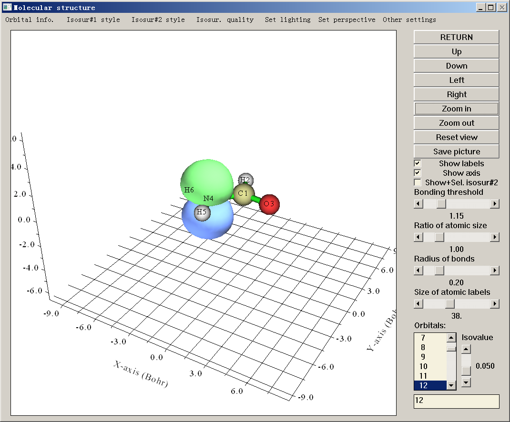

此界面的各个物件的用途稍微玩弄一下就明白了，在手册3.2节也有详细说明。右下角是轨道列表，点击其中一个就会马上在图形窗口中显示相应的等值面，十分方便省事，等值面生成速度也比起Gaussview等程序快得多。注意，如果使用.fch作为输入文件，如前所述其中轨道序号已经被重排，所以选择轨道列表中的第X号所显示的未必是NBO输出信息中的第X号轨道的等值面。

从NBO模块的二阶微扰能的分析结果看，NBO 12（N的孤对电子轨道）和NBO 56（C-O的反π键）之间有很强的相互作用，这能够使体系能量下降62.8kcal/mol。像这种情况，同时绘制两条轨道的图形来分析它们的相位交叠是很有意义的。为了做这样的图，我们先从轨道列表中选12，然后选中Show+Sel. isosur#2复选框（全称是Show and select isosurface #2），再从列表中选56，这两条轨道就都显示出来了，如下所示

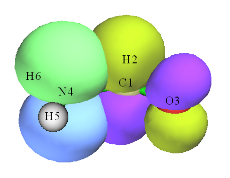

没有选中Show+Sel. isosur#2复选框时选择的轨道所产生的等值面被称为Isosurface #1，选中了此复选框再选的轨道所产生的等值面被称为Isosurface#2。只有已经出现了Isosurface #1时这个复选框才允许选。如果取消选择此复选框，则已出现的Isosurface #2将会消失，若再次选中此复选框，之前消失的那个Isosurface #2又会重新出现。

Isosurface #1的正值和负值部分的等值面用绿色和蓝色表示。为了区分，Isosurface #2的正值和负值部分等值面分别用黄绿色和紫色表示。等值面的风格可以通过界面上方Isosur#1 style和Isosur#2 style中的相应选项设定，可选的风格有：不透明面、网、点、不透明面+网这四种，在下个版本中还会加入透明面的风格。不透明面的颜色以及网/点的颜色也都可以通过Isosur#1 style和Isosur#2 style中的相应选项进行设定，程序会让你输入R,G,B（红、绿、蓝）分量的值，每个分量值的范围应在0.0~1.0以内，例如0,1,0就代表绿色、1,1,0就代表黄色。R,G,B值需要输入两次，第一次是设定等值面正值部分的颜色，第二次是设定负值部分的颜色，文本框内直接出现的数值是当前R,G,B值。风格和颜色在设定后会立刻在屏幕上生效。

上面图中的NBO 12和NBO 56的等值面都是不透明的，分析重叠程度比较困难，将两个等值面都设为网状风格后如下所示，交叠区域看起来清晰了。它们之间存在很明显的交叠，是它们之间二阶微扰能很大的主要原因之一。

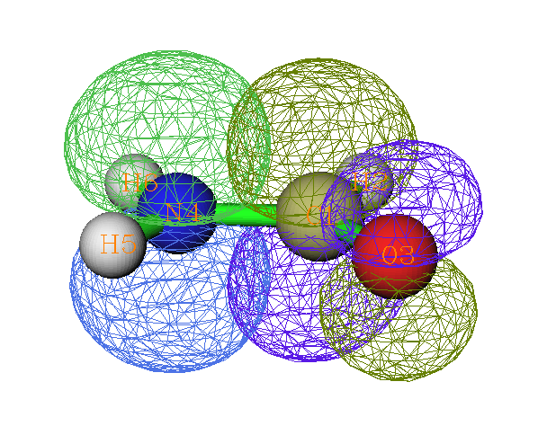

实际上，在显示轨道等值面之前，程序会先计算出一个涵盖整个分子空间范围的轨道波函数的格点数据，这个格点数据的格点密度越大，即相同空间范围内的点数越多，则等值面越精细。为了生成等值面速度比较快，默认的点数并不多。尤其当体系较大时，由于格点密度往往较稀疏，等值面会显得不够光滑，可以通过增加格点数来提高等值面显示效果。方法是选择窗口上方的Isosur. quality，点击其中的按钮后可以输入所期望的格点数。重新设定格点数之后，目前显示的等值面都会自动消除，之后再选择轨道所生成的等值面都会套用刚才输入的设定。

## 4 生成轨道波函数格点文件并用VMD绘图

虽然直接用Multiwfn来产生NBO及相关轨道等值面图一般够用了，但是为了追求更好的显示效果且不嫌麻烦，可以借助于更专业的能够显示格点数据的程序，这里推荐VMD，可以在<http://www.ks.uiuc.edu/Research/vmd/>免费下载，本文用的是1.9版。

这里还是以同时显示NBO 12和NBO 56的等值面图为例。首先需要用Multiwfn分别生成NBO 12和NBO 56对应的.cub格点文件。启动Multiwfn，输入.fch或NBO plot文件名后依次输入  
5  //生成格点数据  
4  //轨道波函数  
12  //NBO 12  
2  //中等质量格点数据  
2  //将生成的格点数据保存到当前目录下MOvalue.cub中。然后我们将此文件改名为NBO12.cub  
0  //返回主界面  
5  //生成格点数据  
4  //轨道波函数  
56  //NBO 56  
2  //中等质量格点数据  
2  //将生成的格点数据保存到当前目录下MOvalue.cub中。然后我们将此文件改名为NBO56.cub

现在关闭Multiwfn，启动VMD，将NBO12.cub和NBO56.cub依次拖进VMD主窗口。选主界面中的Graphics-representations，将新窗口上方的Selected Molecule切换到NBO 12。将已有的那个显示方式的Drawing Method改为CPK。然后点Create Rep，将新产生的显示方式的Drawing Method改为Isosurface，Draw改成Wireframe，Show改成Isosurface，Isovalue改为0.05，将Coloring Method改为ColorID并在旁边选7 Green。然后再以相同的方式建一个显示方式，但ColorID选0 Blue，Isovalue改为-0.05。这时NBO 12的等值面就出现了。之后在Selected Molecule中切换到NBO56，按照处理NBO 12的方法也通过建立两个显示方式来显示NBO 56的等值面。得到的图像如下

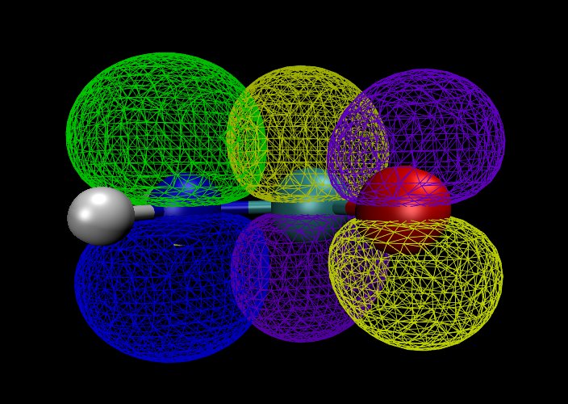

在VMD中这两个轨道的等值面还可以用透明的方式显示。将前面建立的四个显示方式中的Material都设为GlassBubble，然后在主界面里面选Graphics-Colors-Display-Background-8 white将背景变为白色，在主界面里选Display-Rendermode-GLSL，就能看到希望的效果。如果想获得更好效果可以用渲染器（当GLSL无法打开时，也只能通过渲染器才能获得透明效果）。例如，在主界面的File-Render里面选Tachyon (internal, in-memory rendering)然后点Start Rendering，就会出现下面的图，重叠区域显示得相当清楚。

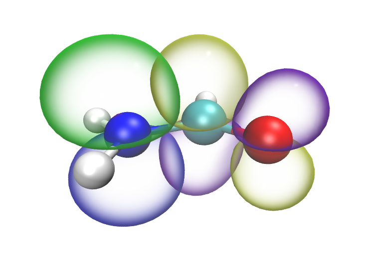

在Multiwfn里不能同时显示多于两条轨道的等值面（因为这种情况一般很少涉及，所以不打算支持）。如果想同时显示三条及以上轨道的等值面的话，就只能用VMD来实现。方法很简单，就是将更多的轨道的cub文件拖进VMD里并进行同样的设置即可，想同时显示多少条轨道都没问题。

下图是J. Mol. Graph. Model., 59, 31 (2015)文章中作者使用Multiwfn+VMD绘制的NBO轨道图，体系比上文例子更大，操作过程完全相同。

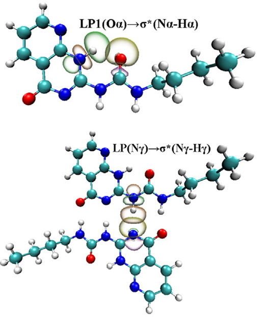

下图是《18碳环等电子体B6N6C6独特的芳香性：揭示碳原子桥联硼-氮对电子离域的关键影响》（<http://sobereva.com/696>）介绍的笔者研究文章Inorg. Chem., 62, 19986 (2023)中用Multiwfn结合VMD绘制18碳环及其两种等电子体B6C6N6和B9N9的各个原子的垂直于环平面的2p轨道的等值面图，轨道能量也标注在了上面

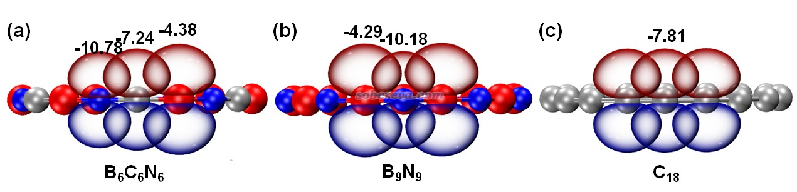

## 5 生成轨道波函数等值线图

Multiwfn能够绘制的平面图种类很多，包括填色图、等值线图、地形图、梯度线图、向量场图。绘制过程很简单，选项也很灵活，在Multiwfn手册的4.4节里给出了很多实例。这里只介绍一下如何作同时含有两个轨道的等值线图（其它类型的图只能一次做一个轨道的）。

这次还是作NBO 12和NBO 56的图，对于表现它们的交叠情况，最合适的作图平面应当是垂直于分子面且穿过N和C的那个平面。这个面不是XY/YZ/XZ面之一，也没法用三个原子坐标来定义。在Multiwfn里定义这个面最好通过指定的三个坐标点来定义。第一个和第二个点的坐标就设为C和N的坐标，而第三个点的坐标设为在C或者N的坐标的基础上往Z方向稍微移动一点（Z轴垂直于分子平面）。

启动Multiwfn，载入.31和.37文件（或载入.fch文件），然后依次输入  
4  //绘制平面图  
4  //轨道波函数  
12,56  //两个NBO轨道的编号。如果只输入一条轨道的编号，做出来的图就是一条轨道的  
直接敲回车，用默认的格点设定  
5  //通过输入三个坐标点来定义作图平面  
0.000000   0.794089   0.000000  //第一个坐标点，即C的位置。X/Y/Z坐标可以用逗号或空格来分隔，单位是bohr。在进入主功能0的时候屏幕上就会出现各个原子的坐标，可以直接将其拷贝下来粘贴到此处，如果不知道怎么拷贝，可以参见手册5.4节  
-1.778942  -1.064235   0.000000  //第二个坐标点，即N的位置  
-1.778942  -1.064235   1.000000  //第三个坐标点，是在N的位置的基础上往Z正方向挪了1 bohr得到的。挪的距离需要反复尝试找到最佳的，不合适的值会使感兴趣的区域不在图的中央。

得到的图是如下这样的，实线和虚线代表正值和负值部分

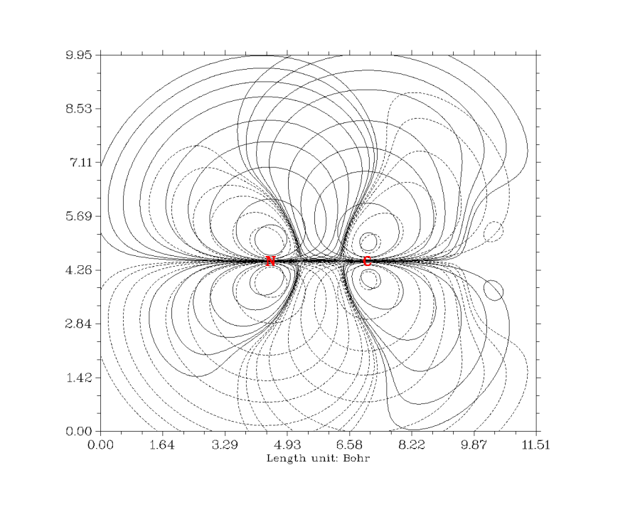

这个图看起来比较乱，这是因为在默认的等值线设定下，数值比较小的等值线也显示了出来，然而这些较小数值的等值线的意义并不大。为了让图看起来比较清楚，应该删除一些数值较小的等值线。因此在图上点鼠标右键关闭之，然后输入  
3  //设定等值线  
5  //删除一批等值线  
1,4  //删除1至4号等值线，即分别为0.001, 0.002, 0.004, 0.008的四条  
5  //再删除一批等值线  
28,31 //删除28至31号等值线，即分别为-0.001, -0.002, -0.004, -0.008的四条。如果嫌每次作类似的图都要删等值线比较麻烦，可以接下来选6来将当前等值线设定保存到指定的外部文本文件里，下次再进入这个设定界面时可以选7来从指定的外部文件中读入等值线设定  
1  //退出等值线设定界面  
2  //令等值线数值显示在图中  
25  //等值线数值的文字大小设为25  
-1  //重新绘制图像  
此时得到如下图像，可见绝对值大小低于0.008的等值线都没了，图像也变得十分清楚，很方便分析交叠区域。关闭图像后，可以选0将此图保存到当前目录下前缀为DISLIN的png格式的图形文件中。

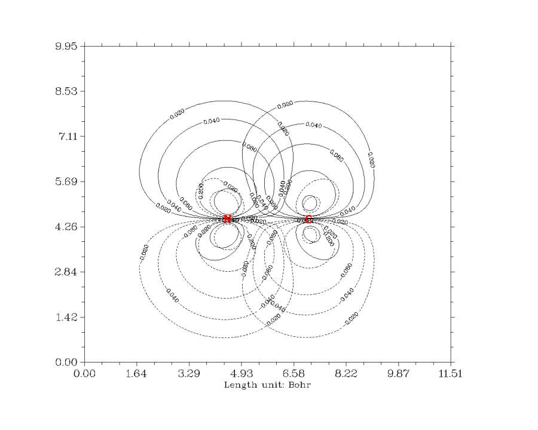

只有与绘图平面垂直距离小于特定距离的原子的符号才会显示在图中，这个距离阈值以及符号大小分别由settings.ini里的disshowlabel和pleatmlabsize参数调节，修改后需重新启动Multiwfn方可生效。

## 6 结合Photoshop同时绘制两条以上轨道的等值线图

个别时候需要分析一个NBO轨道与多个NBO轨道的相互作用，这时可能需要同时绘制三条或更多条的轨道的等值线图。虽然Multiwfn不直接支持这种情况，但是通过利用Photoshop（以下简称ps），可以很容易地实现，而且借助于ps强大的功能，在线条风格上可以更自由地控制。

这个例子中，我们要将NH2CHO的NBO 4的等值线图利用ps叠加在上一节得到的NBO 12和NBO 56的等值线图上。NBO 4是C-N间的σ成键轨道。首先，我们先得到只含NBO 4的等值线图。启动Multiwfn，载入NBO plot文件然后依次输入  
4  //绘制平面图  
4  //轨道波函数  
4  //NBO 4  
2  //等值线图  
直接敲回车  
5  //通过三个点定义绘图平面。这三个点的坐标必须和上一节用的一模一样，只有这样得到的图才能精确地叠加到上一节的图上  
0.000000   0.794089   0.000000  
 -1.778942  -1.064235   0.000000  
 -1.778942  -1.064235   1.000000  
接下来还是和上一节一样，进入等值线设定界面，删掉数值较小的等值线，然后退回到上一级菜单，最后选0将图片保存到当前目录下前缀为DISLIN的png格式的图形文件中。所得图像如下所示

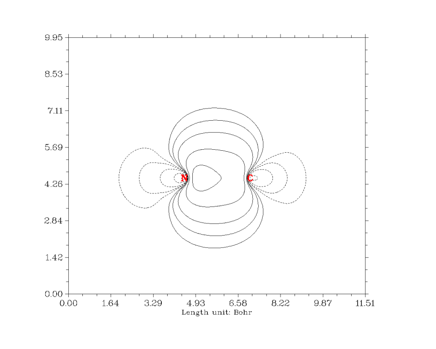

现在打开ps准备将这个图和上一节的图合并，我这里用的是Photoshop CS2版。先将这两幅图都拖进ps里，激活NBO 4的窗口，按Ctrl+A全选并按Ctrl+C复制，切换到NBO 12+NBO 56的窗口中按Ctrl+V粘贴。这时会有两个图层，NBO 12+NBO 56的图层被NBO 4的图层覆盖住了，为了能让前者也同时显示出来，就必须把NBO 4图层的白色背景删掉以变成透明的背景。最便捷的方法就是先确保图层列表里已经选定了NBO 4的图层，然后选ps主菜单的"Select"-"Color Range"，然后将光标移到图上（会变成取色器形状的指针），点一下图中的白色部分，确认Color Range窗口中的Fuzziness为0，然后点OK，这时NBO 4的图层的白色背景就都被选中了，按一下键盘上的del键，背景就透明了，NBO 4、12、56的等值线就同时显示出来了。在图上空白处点一下鼠标来取消选择状态，就能看到这样的图：

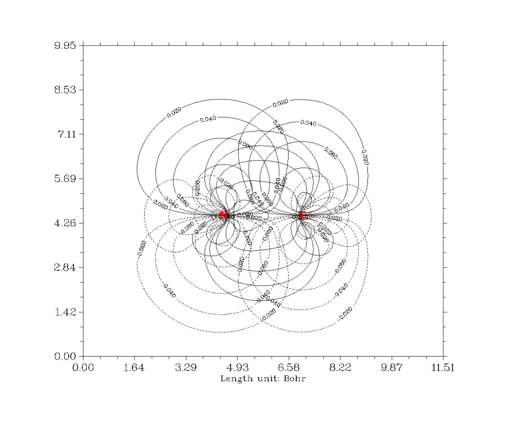

不过，两条轨道以上等值线同时显示出来会很乱，所以这里我们把NBO 4的线条弄成彩色，使之明显一些。方法是在图层列表中将NBO 12+NBO 56的图层选为不可见模式（即点一下眼睛的图标），并确保当前激活的是NBO 4的图层，然后选"Select"-"Color Range"，并且点一下图中的黑色线条（一次点不准可以多点几次），然后点OK就将NBO 4的所有黑色线条选中了。之后选ps主菜单的"Edit"-"Fill"，Use里面选Color然后选一种颜色，点OK，并在空白处点击左键取消选择状态，就会看到黑色线条都变成指定的颜色了。然而坐标轴也变成紫色的了，因此应该删掉这部分，只让NBO 12+NBO 56的图层的黑色坐标轴显示出来。方法是使用范围选择工具将NBO 4的等值线区域选中，然后在主菜单选"Select"-"Inverse"，然后按Del键。最后，将NBO 12+NBO 56的图层恢复为可见模式，就能看到下面的效果

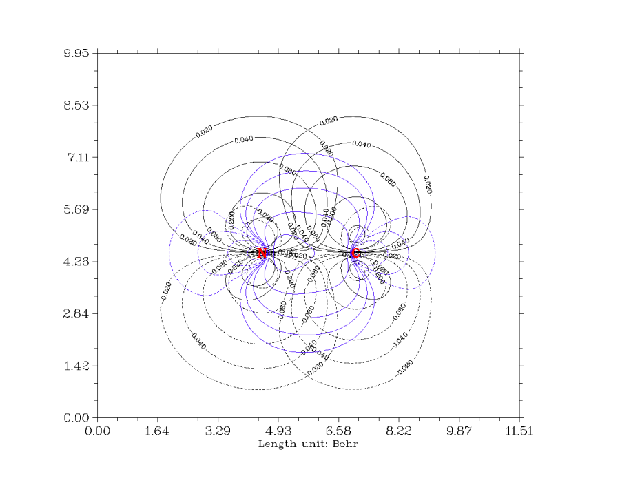

也可以在ps中将等值线加粗使之更鲜明，也就是利用色彩范围选择工具选中线条后，然后在图上点右键选Stork，设好颜色和加粗的宽度后，点OK。

将更多条轨道的等值线图作在同一张图上的步骤也是类似的。

Multiwfn毕竟是一个方便、实用、普适的波函数分析工具，不可能拥有ps的丰富强大的绘图功能，也不可能面面俱到，能作任何特殊类型的图满足所有用户的要求，否则界面将变得冗杂不堪。而将Multiwfn与ps结合使用，就可以十分灵活地得到许多单独靠Multiwfn无法输出的图，希望读者看过此例后能够举一反三。ps的使用不难，只要稍微掌握一点就能解决很多作图上的问题。
