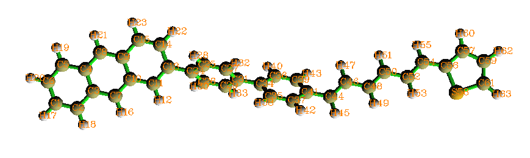
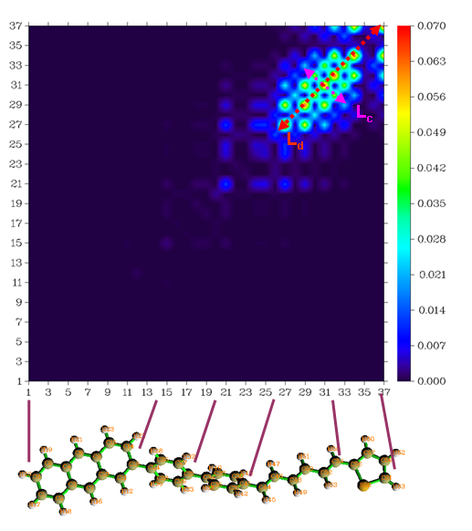
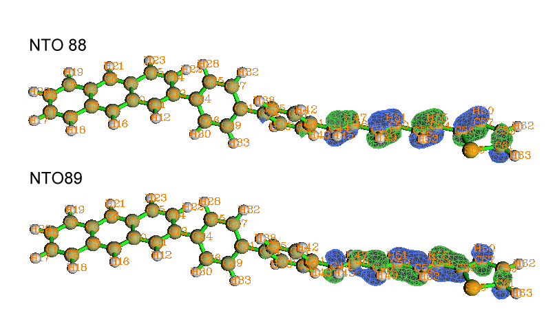
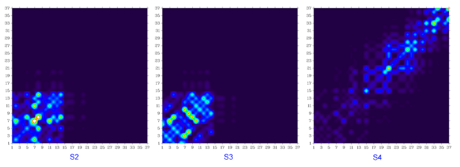
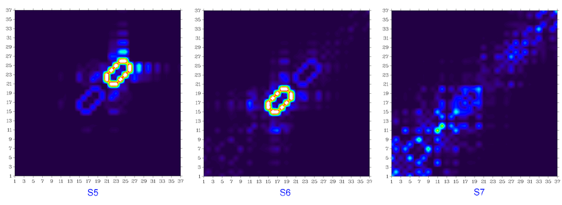
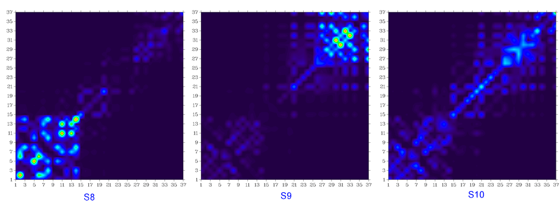

**重要提示：此文已经完全过时了，不要再看。读者务必看笔者后来写的《使用Multiwfn绘制跃迁密度矩阵和电荷转移矩阵考察电子激发特征》**（<http://sobereva.com/436>）

**绘制跃迁密度矩阵平面图分析电子跃迁**Plotting transition density matrix graph to analyze electronic transition  
  
文/Sobereva @[北京科音](http://www.keinsci.com/)  
First release: 2012-Apr-9  Last update: 2018-Jun-10

## 1 原理

已知两个电子态G、E的波函数，就可以构建它们之间的跃迁密度矩阵（下面特指单粒子跃迁密度矩阵）：  
T(r|r')=T(r1|r1')=N*∫∫...∫|ΨG(x1,x2...xN)><ΨE(x1',x2...xN)| ds1 dx2 dx3... dxN  其中N是总电子数，x是自旋+空间坐标，s是自旋坐标，r是空间坐标。  
跃迁密度矩阵含有两个三维空间变量，即是六维变量，是没法直接绘制的。或者说，如何图形化来描绘它的办法不是唯一的。本文讨论的是一种比较常见、有效、简单的图形化分析跃迁密度矩阵的方法。  
  
跃迁密度矩阵用原子中心基函数展开后就变成了含有两个标号的矩阵p，这个矩阵可以根据基函数所属的原子中心进一步收缩成以原子为标号的矩阵P，即使用这种方式变换：  
P(A,B)=∑[i∈A]∑[j∈B] p(i,j)^2   i和j代表原子中心基函数，A和B代表原子  
实际上变换方式也不是唯一的，比如可以将p(i,j)^2改为p(i,j)的绝对值，对最终图像效果有一些影响，但定性结论是一致的。  
  
以原子表示的跃迁密度矩阵的对角元，例如P(A,A)，代表电子态跃迁造成的A原子的电荷变化的程度。而非对角元，比如P(A,B)，代表电子跃迁时A原子与B原子间的电子-空穴的相干程度（某个态的密度矩阵的非对角元经常被当做键级，而两个态之间的跃迁密度矩阵的非对角元就可以理解为跃迁时的“动态键级”，或者说相应两个原子在这个过程中的关联程度）。以原子编号作为横、纵坐标，以颜色来表示数值大小来绘制跃迁密度矩阵，可以很方便地分析电子跃迁所涉及到的原子以及原子间相干范围，对于较大的共轭分子来说尤为有用。  
  
Multiwfn支持以这种方式绘制跃迁密度矩阵，此程序可以免费从<http://sobereva.com/multiwfn>下载。  
  

## 2 例子

这里以绘制下面这个分子的跃迁密度矩阵为例进行说明  
  
  
  
这个分子包含四个部分：蒽、两个苯、己三烯、噻吩。由于分子略大，为了省时间，所以此例用半经验方法ZINDO（亦称INDO/S）来计算。  
  
首先用Gaussian计算这个分子的激发态，输入文件如下，结构已在PM6级别下优化，输出文件假设叫tdmat.out。其中density=transition=1关键词代表将S0->S1的跃迁密度矩阵传递给波函数分析模块L601，而iop(6/8=3)表示L601模块将会把传递来的跃迁密度矩阵输出到输出文件里。算完之后用formchk将tdmat.chk转换为tdmat.fch。  
  
%chk=C:\gtest\tdmat\tdmat.chk  
#P zindo(nstates=10) density=transition=1 iop(6/8=3)  
  
PM6 optimized  
  
0 1  
 C                -12.23469000   -1.59949700   -0.44519000  
 C                -10.90485300   -1.89416000   -0.41362000  
 C                 -9.91985900   -0.84695000   -0.26327300  
 C                -10.36853300    0.50925300   -0.14757300  
 C                -11.78816300    0.77763200   -0.18600400  
 C                -12.68490400   -0.23810600   -0.32928500  
 C                 -8.54611200   -1.12747500   -0.22848900  
 C                 -9.42758700    1.53918300   -0.00043800  
 C                 -8.05447200    1.25843200    0.03458600  
 C                 -7.60516500   -0.09749600   -0.08196600  
 C                 -6.18786600   -0.36800000   -0.04497800  
 H                 -5.86066100   -1.40374200   -0.13102800  
 C                 -5.28440700    0.64776600    0.10266900  
 C                 -5.73932300    2.01359000    0.22081600  
 C                 -7.06844500    2.30452500    0.18588200  
 H                 -8.20526000   -2.15857900   -0.31589600  
 H                -12.98493200   -2.38050500   -0.55800000  
 H                -10.55050800   -2.92028000   -0.50015200  
 H                -12.11524200    1.81256100   -0.09714600  
 H                -13.75638400   -0.04727400   -0.35946000  
 H                 -9.76850900    2.57024400    0.08779900  
 H                 -4.98900200    2.79603800    0.33001500  
 H                 -7.42269600    3.33146800    0.27016300  
 C                 -3.82937400    0.38281300    0.14497700  
 C                 -3.07180600    0.78122600    1.25797700  
 C                 -3.19872100   -0.26881300   -0.92659800  
 C                 -1.70051500    0.52722100    1.30039900  
 H                 -3.55871700    1.28369000    2.09318800  
 C                 -1.82581400   -0.51640200   -0.88722600  
 H                 -3.78299200   -0.57632400   -1.79332700  
 C                 -1.06859000   -0.12149600    0.22711800  
 H                 -1.11579500    0.83834500    2.16540700  
 H                 -1.34032200   -1.02376100   -1.72018900  
 C                  0.38560400   -0.38681600    0.27068500  
 C                  0.93813400   -1.12394500    1.33114400  
 C                  1.22321500    0.09399200   -0.74751000  
 C                  2.30850800   -1.37819000    1.37050900  
 H                  0.29077900   -1.50435900    2.12071100  
 C                  2.59623800   -0.15246000   -0.70346300  
 H                  0.80002700    0.66719000   -1.57182400  
 C                  3.15184900   -0.88857800    0.35651600  
 H                  2.72818100   -1.95283500    2.19495600  
 H                  3.23819700    0.22061400   -1.50028400  
 C                  4.59389600   -1.16777300    0.41952300  
 H                  4.85337000   -2.16976100    0.77201400  
 C                  5.54066100   -0.27393200    0.08828100  
 H                  5.27492800    0.73266200   -0.24674500  
 C                  6.96872800   -0.57538800    0.16207400  
 H                  7.23312600   -1.58986100    0.47261300  
 C                  7.91759000    0.33277900   -0.13184300  
 H                  7.65285400    1.34734100   -0.44101200  
 C                  9.34483400    0.02984200   -0.05794900  
 H                  9.60343700   -0.99039000    0.24037400  
 C                 10.28940200    0.94828300   -0.33477700  
 H                 10.01152800    1.97026400   -0.62174400  
 C                 11.71085200    0.70883500   -0.28149600  
 C                 12.73647700    1.61457500   -0.27342100  
 S                 12.36627800   -0.91644100   -0.23061800  
 C                 14.04355100    1.00496200   -0.21988900  
 H                 12.61225000    2.68805400   -0.29889200  
 C                 14.01162500   -0.35537800   -0.19207600  
 H                 14.94474600    1.60386500   -0.20467900  
 H                 14.83536500   -1.04594500   -0.15352900  
  
启动Multiwfn，然后依次输入  
tdmat.fch  //Multiwfn做跃迁密度矩阵图时需要读入fch文件是为了从fch中得到各原子的元素和基函数与原子的编号对应关系  
18  //电子激发分析  
2  //绘制跃迁密度矩阵  
tdmat.out  //包含了跃迁密度矩阵的Gaussian输出文件  
1  //直接在屏幕上作图  
  
此时将立刻看到如下的图像。注意，由于氢原子对于大共轭分子的电子跃迁几乎没有贡献，所以作图时默认不包含氢原子。因此横纵坐标的编号和分子中的原子编号并不一致，氢原子被空过去了（如果想要让氢原子也显示，则选择4 Switch if take into account hydrogens再作图）。为了对应关系清楚，下图坐标轴上的编号和相应重原子在分子中的位置在图中直接标注了出来。  
  

  
从图中可见，数值比较大的部分都集中在图的右上区域，这说明与这种激发模式主要涉及的是己三烯和噻吩部分的原子。红色双向箭头表示的对角线区域是数值范围整体较大的区域，其长度Ld表现了这种电子激发涉及的空间广度。此图中在靠近对角线的非对角元上也有很大数值，这说明在这种激发模式中主要涉及的原子与临近原子有较强的电子-空穴相干性。图中Lc值描述的对角线的带状区域越宽，代表原子间相干范围越大。  
  
利用NTO分析方法（见《使用Multiwfn做自然跃迁轨道(NTO)分析》<http://sobereva.com/377>），也可以直观地看出S0->S1激发确实是主要发生在己三烯和噻吩部分，这种激发模式的88%的特征可以由NTO 88->NTO 89的跃迁表现，以下是这两个轨道的等值面图  
  
  
  
将density=transition=后面的数值改为感兴趣的态的数值，重新计算得到含有相应跃迁密度矩阵的out文件，重复上面的步骤就可以作出基态到相应态的跃迁密度矩阵的图。fch不必每次重新生成，对所有激发态来说其中要被用到的信息都是一样的。  
  
基态到S2、S3...一直到S10的跃迁密度矩阵图如下所示  
  
  
  

显然，S0到S2、到S3、到S8的跃迁几乎对应的都是蒽片段内的局部跃迁，由于蒽的很强的电子离域性，不难理解在这些跃迁中蒽片段内原子间有明显相干性。S0到S5和到S6的跃迁很明显分别几乎只体现两个苯环内的局部跃迁，并且环内相邻原子在跃迁中相干性很强，这主要是由于结构的扭曲使苯环与周围部分之间失去了很大程度的电子离域能力。诸如S0到S10的跃迁，由于在整个图中的对角线及附近都有一定的数值，可知这种跃迁涉及到整个分子空间。

  

## 3 CIS、TDHF、TDDFT的情况

用CIS、TDHF、TDDFT方法，也可以按照上例方法来作图，输入文件和操作过程和上例没什么区别，区别仅在于激发态输入文件的route section。由于一些初学者对激发态计算不熟悉，这里废话几句。假设研究的是S2  
  
(1)用CIS的情况，route section写为比如：#P CIS(nstates=5)/6-31G* density=transition=2 iop(6/8=3)  
(2)用TDHF的情况，route section写为比如：#P HF/6-31G* TD(nstates=5) density=transition=2 iop(6/8=3)  
(3)用TDDFT的情况，route section写为比如：#P B3LYP/6-31G* TD(nstates=5) density=transition=2 iop(6/8=3)  
  
对于CIS、TDHF、TDDFT方式计算激发态，每次计算比ZINDO明显耗时得多得多。假设用的是CIS方法，刚才分析完了S0->S1态，接下来想对比如S0->S4做分析，当然可以写CIS/6-31G* density=transition=4 iop(6/8=3)，但是这相当于完全地重算一遍，比较费时。较好的办法是写CIS(read)/6-31G* guess=read density=transition=4 iop(6/8=3)，这说明在SCF过程中直接读取check文件里已经收敛的SCF波函数，在CIS过程中（需要Davidson迭代求解）也直接读取check文件里的初猜，这样做会比起重算一遍速度会快不少。对于TDHF、TDDFT也是类似的，例如TDDFT时写成B3LYP/6-31G* TD(read,nstates=5) guess=read density=transition=4 iop(6/8=3)即可。  
  
  
  
**补充说明1**：在个别体系中，如果基组包含弥散函数，则Gaussian输出的跃迁密度矩阵可能是错的（起码在G09 C.01中仍存在此问题），图上表现的跃迁主要涉及的区域和考察跃迁主要涉及的MO的分布所得结论严重不符，这种情况不要用本文的分析方法，或者应当去掉弥散函数。  
  
**补充说明2**：有时候会碰到一种情况，比如一个直链分子A---B，在Gaussian输入文件里原子编号不是从左到右依次排下来的，而是混乱的，比如4号原子在左侧，5号原子在右侧，6号原子在中间...这种情况下显然没法把分子结构和跃迁密度矩阵图中的坐标轴对应起来。解决方法就是重新对原子编号进行排序。比如先手动旋转分子，让A---B分子与X轴尽量平行，然后把输入文件里的坐标都导入到excel里，对X坐标进行排序，然后再把排序过的原子坐标写进高斯输入文件里，这样原子编号和原子在分子中的位置就对应起来了。重新计算并作图后，分子结构就能像本文的例子一样与跃迁密度矩阵图的坐标轴进行对照了。
