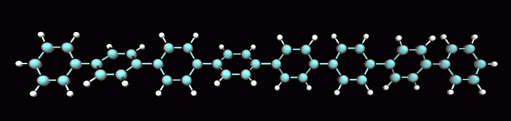
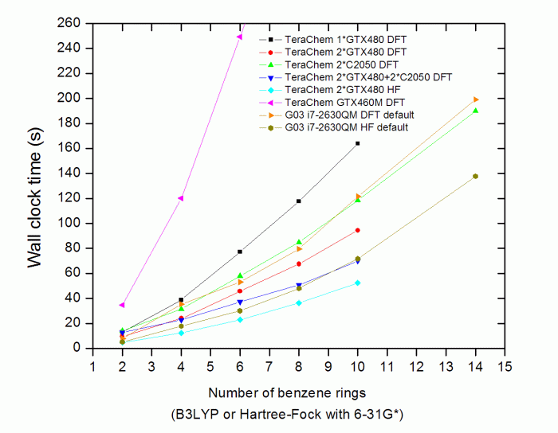
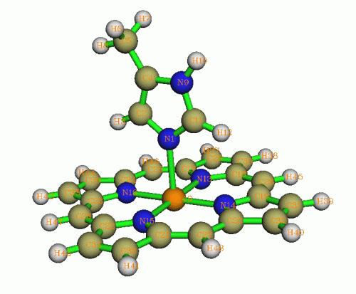
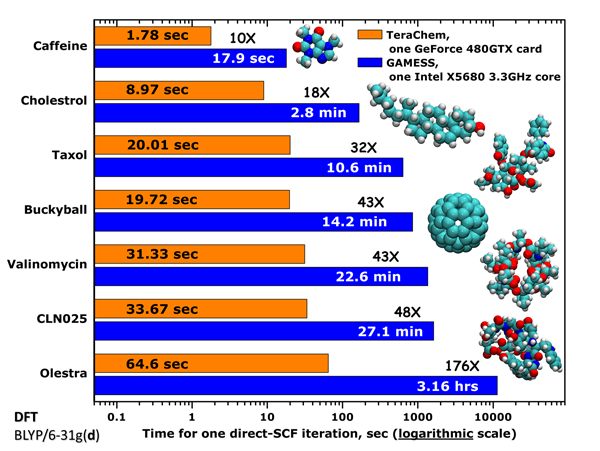

**2019-Mar-3注**：在文末补充了全新的测试，以反映目前主流硬件下的情况

**首个完全基于GPU的量化软件-TeraChem杂谈及真实性能测试**  
The first completely GPU-based quantum chemistry software: Comment and real performance test

文/Sobereva   2012-Apr-30

TeraChem是第一个公布于世的、完全基于GPU运算的从头算量化程序，2010年5月发布第一版。虽然很早就听说过此程序，但直到近日才终于有机会亲自把玩，此文将杂谈此程序的一些特征，并且实际测试一下此程序的性能，看看到底有没有官方吹得那么玄，是否值得为此投资。本文的测试是确保公平的，鉴于寡人知识水平不敢说在讨论上一定正确，但可以保证没有任何偏向。

## 1 简介

TeraChem是2011年刚评上美国科学院院士的Todd Martinez和他的一个俄罗斯博士生Ufimtsev基于CUDA开发的充分利用GPU运算能力号称使计算速度有飞跃式提升的从头算量化程序，算法基础是他们在JCTC上于2008、2009年发的三篇文章（JCTC,4,222、JCTC,5,1004、JCTC,5,2619），分别阐述了利用GPU进行双电子积分、直接SCF、解析梯度的实现方法。虽然也有其它一些程序号称支持GPU加速，比如Q-Chem、Firefly、GAMESS-US等，包括Gaussian也高调宣布与nVidia合作将在未来支持GPU加速，但是它们基本上都是在原有的基于CPU的代码、算法基础上去改造而支持GPU加速，而TeraChem则是第一个完全从头写的，根本目的就是充分发挥GPU运算能力的量化程序。TeraChem要求至少有一个支持CUDA的GPU方可运行。由于目前只有nVidia的GPU支持CUDA，AMD显卡用户就别指望了。

TeraChem现在属于PetaChem公司的产品，也是此公司旗下目前唯一的产品，根据购买量价格从315到900刀不等。在中国由坤成基业公司代理，但价格不明朗，貌似此公司极力想将这款软件连同他们的带Tesla卡的服务器捆绑销售。

此程序虽然还远远不够成熟，功能还很有限，撰文之时此程序最新版本1.5版刚刚发布，直到这个版本才刚刚支持了d基函数（也有说法是1.45版就已经支持了），某种意义上才算刚摘掉了"Toy"的帽子。此程序主要能做的事就是算单点能、几何优化、找过渡态、BOMD、算偶极矩和极化率（超极化率算不了）。支持的理论方法就是HF、GGA/杂化DFT，R/U/RO形式都支持。严重的局限性是尚不支持激发态计算，频率也算不了（起码给个数值Hessian嘛）、不支持任何后HF方法、不支持对称性。隐式溶剂模型、算NMR、BSSE、赝势、外加电场等等零零碎碎的功能更是一概没有。虽说支持QM/MM，但MM区域只能是TIP3P水，因此实用意义很有限，Amber12倒是支持挂着TeraChem做QM/MM。此程序直接支持Grimme的DFT-D2/D3，直接附带了NBO6.0，这倒是挺有眼光，不过NBO6.0分析时还很容易崩溃，而且一些NBO功能不能用，比如NBO deletion（奇怪的是，笔者撰文时NBO的官方最新版本仍然只是5.9，虽然早已听闻6.0的消息，但不明白为何6.0先出现在了TeraChem程序包里）。TeraChem使用的基函数就是一般分子量化软件用的高斯型基函数。

此程序比较新，而它的license是和网卡MAC绑定的，也没有个能够公开下载的体验版，这就造成了此程序很难让广大量子化学研究者有机会接触到它，我想，愿意去花不少钱购买一个很稚嫩又很未知的东西的人不会很多。好像这程序刚开始推广那阵子可以向开发者免费申请试用，但现在已没这个好事了。虽说前些日子在北师大搞的TeraChem培训班倒是让一些人有机会使用，但是产生的影响力我想还是很有限的。据悉可以向和TeraChem交情很深的北师大的于建国教授申请索要两个月的demo license，有兴趣者可以联系他（PS：过期之后改掉系统日期就能继续用）。

## 2 使用感受杂谈

此程序文件结构很简单，包括一个300MB出头的可执行文件、NBO6.0可执行文件、license文件、userguide的pdf文档、基组库文件夹，还有几个零碎的没什么用的文件。基组库文件夹里每种基组对应一个文件，比如6-31+G*基组对应于6-31+gs文件，内容和EMSL基组数据库里的数据是直接对应的。虽然也带了含有高角动量函数的基组，比如cc-pvqz，但由于此程序尚不能支持f及以上角动量，所以这些基组目前也根本没法用。

此程序手册编写得比较简单，才32页而已，只有比较成熟的量化软件手册厚度的1/10的级别（寡人写的Multiwfn的手册厚度都是它的5倍咧）。虽然手册编写得这么省事据说是开发者没时间所致，但我想，费很大力气写了很多代码，但是没个详细描述其功能的手册，用户不会用，那么等于白费力气。好在TeraChem使用起来比较容易，有一定经验的量化工作者稍微摸索一下就会基本使用，但是有些该细说的比如球形边界条件却说得太抽象含糊。

TeraChem 1.5只有Linux版，建议用RHEL5.5及以上版本，要求安装CUDA驱动和CUDA 4.0 Toolkit。貌似不提供源代码包而只提供编译好的文件。只需要将TeraChem环境变量指向license文件就能直接用了，比如export TeraChem=/sob/TeraChem/license.dat。运行时输入比如./TeraChem [输入文件名] 就行了，如果不重定向到文件中的话运算过程的信息会输出在屏幕上，各类结果信息比如几何结构、Mulliken电荷会输出在scr目录下的不同文件中。如果涉及到NBO分析的话，需要设定NBO6.0可执行文件路径的环境变量，例如export NBOEXE=/sob/TeraChem/nbo6.exe。

输入文件的编写比较容易，比如一般的计算任务（这里是结构优化）只需要如下这么写，含义不言自明，前后顺序随意。如果要加注释就写在#号后面。  
basis 6-31gss  
charge 0  
spinmult 1  
method wb97x  
run minimize  
coordinates     MN-NN.xyz  
end  
比如像加上DFT-D3色散校正，加一句dftd d3就行了。手册可以在其网页上免费下载<http://petachem.com/pricing.html>，关键词并不多，有兴趣者不妨看看。目前直接支持的结构文件格式是xyz和pdb。

于建国教授和几个学生开发了一个TeraChem的前端图形界面SimuTera（收费），可以构建分子、创建输入文件、本地/远程提交、观察结果，有点类似Gaussview和Gaussian的关系。TeraChem官方主要是推荐用VMD观看生成的结构、动力学轨迹和分子轨道。TeraChem与VMD结合可以很方便地实现Interactive molecular dynamics(IMD)，也就是在TeraChem输入文件中写个上比如imd 54332，那么TeraChem计算开始前会等待VMD连接，在VMD里进入IMD Connect插件并且填上主机IP和54332这个端口号并点连接，动力学计算就会开始，每一步的结构变化都会实时传到VMD的图形界面上。结构优化、过渡态搜索过程也都支持这种方式观看。据说以后还能像NAMD那样，支持交互式施加外力操作，也就是在VMD图形窗口中通过在某处拖动鼠标来直接给相应区域原子施加特定方向和大小的力。

虽然此程序的几何优化还是常见的算法，包括L-BFGS、共轭梯度、最陡下降法，但是，搜索过渡态居然只支持NEB，这点值得稍微吐槽。NEB方法不常出现在分子量子化学软件中，而常用于第一性原理的软件中，我曾经在《过渡态、反应路径的计算方法及相关问题》（<http://sobereva.com/44>）当中介绍过其原理。NEB方法必须提供过渡态前后两个位置的初猜坐标（这一点类似于QST2），这显然比起常用的基于GDIIS和准牛顿法极其变种那样只需要提供一个过渡态初猜坐标的方法麻烦很多，虽说额外的好处是能顺便得到这两点间的能量极小路径（如果提供的两个坐标就是过渡态连接的两个能量极小点，就得到了IRC）。限于时间，笔者没具体测试这个功能。我认为，在TeraChem中加入一种只需要单个初猜结构的搜索过渡态的功能应该不是什么难事，而且也应该是当务之急。

TeraChem的从头算动力学是主要卖点之一，由于号称运算速度快，可以做较大体系较长时间的动力学。在这方面一个有趣的功能是每隔几帧输出一次分子轨道信息，通过VMD可以看到分子轨道图形在模拟过程中的动态变化过程。虽然这看起来很有趣，在视觉上挺吸引人，但是我倒觉得没太大实际意义。TeraChem的动力学的设定还不算很完善，虽然支持控温，但是没法指定温度变化过程，没法方便地由用户设定初始速度，没法加限制势或拉伸力。此程序只支持比较怪异的球形周期边界条件，竟不支持一般的矩形盒子边界条件。

量化程序之所以没有像分子动力学程序那样那么早就支持GPU加速并付诸于实际应用，一方面是量化涉及到的算法不仅种类多而且过程复杂得多，另一方面是早年间的GPU不支持双精度浮点，这难以满足量化计算数值方法的精度要求（尽管单精度浮点也不是完全在量化中没用，比如专门有人提出基于单精度浮点的MP2算法）。直至nVidia的G200系列GPU开始（即民用的从GTX260开始，Tesla系列从C1060开始）才支持双精度浮点，这才使GPU在量化上的普遍应用成为了可能。因此我起初以为TeraChem是完全的双精度，看了手册才知道原来这程序在内部默认是单双精度混合（这有点像amber的CUDA版的处理），对于数值大小高于阈值的双电子积分以及涉及到数值累加的变量一律用双精度以保证精确度，而数值较小的双电子积分采用单精度。这种混合方法是考虑到目前nVidia家用的Geforce系列GPU的双精度运算能力只有单精度的几分之一，而Tesla和Quadro系列的双精度性能也只有单精度的一半。

我个人比较希望此程序能输出.wfn文件或者Molden输入文件，由于号称此程序算大体系比较容易，这样Multiwfn也就能分析很大体系波函数信息了。也许有空的话我也会尝试想办法将TeraChem的输出信息转换成wfn格式。

手册中说不推荐用GTX580和Tesla C2075运行此程序，这挺麻烦，而现在基于新架构Kepler的GTX680、GT640/630已经推出了，恐怕TeraChem在其上运行会更不如意。TeraChem需要尽快着手支持新硬件。硬件更新换代带来的问题在很多为GPU深度优化的基于CUDA的产品中都存在，amber也是，记得其开发者说当前amber的CUDA版为Fermi架构做了很多优化，直接上GTX680可能会有些问题。

值得一提的是，虽说此程序基本上完全基于GPU，但实际上GPU在运行时CPU仍然有不低的占用率，可以算的尺度也受主机内存大小的限制。

## 3 性能测试

### 3.1 测试的意义和测试环境

TeraChem官方宣称这软件能带来比基于CPU的程序几十倍的性能提升。实际上，每款支持GPU计算的软件都爱这么宣扬，少则说提升7、8倍，一般都说提升几十倍，高则乃至上百倍。每次nVidia的人做报告的时候也是这么使劲吹，好几年来我耳朵听得已经起茧子了。2011年《物理化学学报》27卷2019页的《GPU引发的计算化学革命》也是有很多类似的说法，列了不少数据，都说提升了很多倍。然而我并不喜欢这类含糊的说辞，有大跃进时代鼓吹亩产万斤之嫌。对待GPU加速切不可头脑过热，我们必须明确这惊人的加速比到底来自于什么GPU和什么CPU在比较，究竟这看似引发“革命”的加速比到底靠不靠谱、有无意义，谨慎分析究竟我们要付出多大代价才能享受到这收益，是否能真正给研究工作带来实实在在的效益。比如我用过的一些GPU加速视频转码的软件得到的画质很差，等于GPU加速根本没带来任何用处；而很多宣称支持GPU加速的计算化学软件只在用处不大的功能上性能提升巨大，比如说分子动力学软件在GB溶剂模型下加速比很大，也是每次都被拿来在台面上鼓吹的数据，但最常用的显式溶剂下加速比则明显没那么高，资金投入上未必选择GPU代替CPU更划算，可以参看以前在我写过的一篇《小测Tesla C2050在amber11上的GPU加速性能》（<http://sobereva.com/67>，由于硬件价格的变动文中一些分析可能不再合适了）。我从数年前nVidia刚推广CUDA时就看好GPU加速在计算化学上起到的巨大作用，也不否认“革命”这种说法，但是在现阶段一定要理智。说了这么多主要是想表明为什么我要对TeraChem做真实、客观的性能测试，因为大多数软件的官方数据和说辞历来是不可盲目信从的，往往刻意掩盖重要信息或设定不公平的参数而让自己的成绩远高于对手，报喜不报忧，尤其是打着“GPU加速”这样相对较新概念的旗号时更容易让用户相信一些夸张的宣传。

我们将考察TeraChem计算单点能时随体系尺寸增加计算时间的变化、考察不同配置下性能的差异、考察计算精度，并与最常用、最成熟的量化软件Gaussian的03版相比较看看到底能TeraChem有多大的性能优势。实际上不同量化软件间性能对比测试是很不容易进行的，虽然基本算法都一样，但在具体处理上，比如如何判定已经收敛、用什么样的加速收敛方法、用什么方式加速积分、如何构建初猜等等都是不同的。但我想，作为用户，我们主要关心的是对同一个体系不同软件到底花上多少时间能得到精度差不多的结果。所以我对默认设置不做多余的调整，因为用户一般也并不去调。TeraChem是通过DIIS Error来决定收敛的，这和Gaussian用的能量及密度矩阵变化判据不同因此没法完全一致，但由于G03用户计算单点能时一般就用默认判据，而且G03在默认判据下收敛时DIIS误差通常和TeraChem默认的收敛限0.00003差不多，所以我认为两款程序在默认收敛判据下的耗时是有可比性的。另外，TeraChem默认的DFT数值积分格点精度偏低，这直接影响结果精度和耗时，所以输入文件里用了dftgrid 2，和G03默认的基本在一个级别，即每个原子用六七千个点。TeraChem的数据是程序自身统计出的实际消耗时间，由于运算前还有初始化GPU设备过程，因此实际用时比下文给出的要多出数秒钟。Gaussian的运行时间是Linux的time命令给出的时间。本文所谓时间都是指wall clock time而非CPU时间。若未注明，TeraChem用的一律是默认的动态单双精度混合模式。

测试涉及到C2050和GTX480的结果都是在第三方的带有两块C2050+两块GTX480的双路E5620+24GB的机子获得的结果，估计用的是Intel 5520芯片组，这四张卡各自的PCI-E 2.0口的具体分配不清楚，当然若是4*8x则是最均衡的。涉及到i7-2630QM和GTX460M(1.5GB显存)的结果都是在寡人自己的Toshiba X500-01R笔记本电脑上测的结果（8GB内存，RHEL6U1系统）。TeraChem为1.5版，Gaussian03为E.01。虽然i7-2630QM支持超线程，但对于本文的测试任务在Gaussian下只用4线程更快，所以测试都是nproc=4下进行。

### 3.2 计算速度测试

笔者先用一系列下面这种链状聚苯分子进行测试，后文中的N代表分子中苯环的数目。总原子数是2+10*N。皆C1对称性。计算级别使用对于大体系的经典搭配B3LYP/6-31G*。

测试结果如下  
   
GTX460M在N=8、N=10、N=14时的耗时在图中未显示，分别为387.1s、547.4s、901.3s。

从这个图中，我们可以得到这些结论：  
(1)两块GTX480比起一块GTX480的时候性能提升很多，当原子数多时，提升将近翻倍。两块C2050的性能竟然不如两块GTX480，这是有些出乎意料的，按理说前者的双精度浮点性能比后者强得多。但是，这个结果也在情理之中，因为GTX480的核心及显存频率都比C2050高一些，而且前者的流处理器是480个而后者是448个，因此单精度性能显然GTX480更强。已经提到，TeraChem是单双精度混合运算，所以GTX480在此程序中表现占优是可以理解的。而两块GTX480和两块C2050一起用时并没比两块GTX480时强太多，不知是此程序的问题，还是PCI-E带宽或其它什么原因造成了瓶颈。考虑到C2050比GTX480贵好几倍，从性能上看使用TeraChem完全不值得买Tesla产品，用高端的Geforce系列GPU最划算。  
(2)TeraChem算大一些的体系的时候还是很耗显存的，在计算N=14的聚苯时拥有1.5GB的GTX480已经out of memory了，无论是单块还是两块，或者和C2050混用时都因此报错而无法进行。所以，Tesla产品在TeraChem上相对于Geforce系列产品来说的优势也就是能计算更大的体系（例如C2050和C2070分别为3GB和6GB显存）。然而很多非公版的Geforce产品的显存都比公版标配的大，通常大一倍，但价格仍比较合理，因此我建议选择这些非公版大显存的高端Geforce卡用于TeraChem计算。奇怪的是，尽管寡人的GTX460M也是1.5GB显存，但计算N=14的聚苯时很正常。  
(3)GPU的性能对运算速度影响明显。GTX460M只有192个流处理器，为GTX480的40%，而且显存位宽也只是其一半，频率也更低，因此，运算速度只有GTX480的不到1/3。  
(4)TeraChem的DFT比HF慢的程度相对于G03来说略大一些。  
(5)TeraChem和G03都在N=2至N=14的范畴内显示出线性标度的特征，曲线几乎是直的。虽说这两个程序都没有纳入称得上线性标度的算法，但其实这结果也并不意外，因为线性分子通过简单的积分截断就很容易展现出准线性标度。而实际上很多人专门搞出一些号称线性标度的方法用在日常遇到的非线性体系上效果很不理想。所以，对于日常研究的各种体系，这两款程序一般不会随着原子数的增多而曲线保持这么平坦。  
(6)最后是最关键的一点，也就是，TeraChem的计算速度远远没有它鼓吹得那么快！！！从图可见，i7-2630QM这种折合于普通台式机1000块钱出头的CPU在G03上的运算耗时基本上和2*C2050在TeraChem上的运算速度持平，哪来的号称的神乎其神的几十倍的提升？可以估算出现在主流的双路计算服务器下G03的运算耗时差不多能和2*GTX480+2*C2050耗时持平。而且，如果GPU不是那么高端，只是主流家用级别的话（GTX460M折合于GTS450这档次），那么还远远不如一个普通四核CPU在G03上算得快。

TeraChem允许自行设定使用完全单精度、完全双精度、还是动态/静态单双精度混合运算。这里对8个苯环B3LYP/6-31G*的情况比较了默认情况、纯单精度和纯双精度的计算耗时。  
2*GTX480 单精度：54.3s  
2*GTX480 双精度：205.9s  
2*GTX480 默认：67.5s  
2*C2050  单精度：70s  
2*C2050  双精度：272.1s  
2*C2050  默认：84.9s  
很明显，纯双精度时速度比单精度时慢得多得多，而动态混合单双精度并不比单精度多耗时多少。有点令我奇怪的是，明明C2050在双精度浮点性能上高于GTX480很多，但是从实测数据上看，依然像纯单精度浮点时一样吃亏。

前面我们只测了线性分子，这有点太理想化了，所以下面我们也测一个更实际的分子，咪唑配位的镁卟啉，看看是否也有相似的结论。其化学组成为H18C24N6Mg1，如下图所示

计算方法仍是B3LYP/6-31G*  
1*GTX480 105.6s  
2*GTX480 62.2s  
1*C2050 137.5s  
2*C2050 80.3s  
2*GTX480+C2050 50.8s  
GTX460M 348.8s  
G03 i7-2630QM 156.5s  
几种GPU的运行耗时和前面结论基本一致。这回终于TeraChem比G03占了上风，但是，一个GTX480跑TeraChem的耗时仅仅比i7-2630QM跑G03的耗时降低了三分之一而已，远远没有传说中的夸张。对于拥有对称性的体系，尤其是高对称性体系，TeraChem的优势必然还会丧失掉。GTX460M+TeraChem的效率依然明显不如i7-2630QM+G03。

### 3.3 计算精度测试

对于咪唑配位的镁卟啉，下面比较一下TeraChem不同模式下的计算结果的精度，并与可靠性受到公认的Gaussian的结果进行对比。不同量化程序间Hartree-Fock的结果比起DFT的更有可比性。  
Gaussian03 默认 -1445.7243754  
Gaussian03 SCF=Tight -1445.7245352  
TeraChem 默认 -1445.7245359061  
TeraChem 单精度 -1445.7247432920  
TeraChem 双精度 -1445.7245309871  
可以看到，TeraChem默认的动态单双精度混合情况下和纯双精度时结果很接近，用原子单位时差异仅在小数点后第六位，在一般研究中其差异可忽略。而单精度的结果偏离双精度结果稍大一些，但也仅在小数点后第四位有偏离。鉴于TeraChem默认精度下与纯双精度结果符合很好而耗时又不比纯单精度时增加很多，建议一般计算时都用默认精度。TeraChem的结果和Gaussian在SCF=Tight收敛标准时符合得很好，说明TeraChem这款较新的程序的结果可信度是有保证的。G03在默认收敛标准下的结果和Tight标准下的稍有偏离，不过也仅折合于相差0.42KJ/mol罢了，除非很高精度的计算，这点误差可以接受。从这个体系看，TeraChem在默认标准下比G03默认标准下精度高一点点，但G03再多做两三轮迭代也是能达到相同精度的，不会影响上文对这两款程序计算效率的讨论。

DFT的交换相关泛函在量化程序中都是用格点方式近似地数值积分，不像HF的结果那样能得到精确值，而不同程序在DFT的积分格点设定上差异经常比较大，所以不好比。但这里仍然尝试比较一下两款程序在B3LYP/6-31G*下N=14的聚苯的计算精度。  
Gaussian03 默认-3235.9677616  
Gaussian03 SCF=Tight -3235.9678984  
TeraChem 默认 -3235.9678361702  
可见TeraChem默认精度下的结果依然与G03在Tight收敛标准下的结果相符得很好，且依然比G03在默认收敛标准下结果精度稍高。

### 3.4 关于TeraChem官方测试数据

下图是直接从TeraChem官方网站上复制来的官方测试数据

乍一看这图，感觉TeraChem简直神了。然而，本文的实测数据却显示TeraChem的计算效率还是和最主流的量化程序G03在一个数量级，完全不像官方吹嘘的那样神，难道官方在虚假宣传？

这里我们把注意力放在C60的测试数据上，因为大家都很容易构建其输入文件并在自己的机子上实际测试。官方是在BLYP/6-31G*下计算的，图中是SCF每一轮迭代的用时。官方给的GAMESS测试数据慢得离谱，在比较高端的XEON X5680上（六核，3.33G），居然一轮迭代要花上14.2分钟，十几轮迭代收敛后，相当于要花上两三个小时！这数据明显有问题。倒是GTX480每轮迭代花19.7s凭本人感觉确实属实（笔者没来及实测）。从图例可见，GAMESS写的是"one Intel X5680 3.3GHz core"，究竟这是指一个X5680 CPU还是指它的一个核心的速度？为了搞明白，我在i7-2630QM上四核并行测了一下GAMESS-US目前最新的2011-AUG-11_R1版，每轮迭代仅耗时202s（未考虑对称性），若是X5680六核并行，那么折算起来也就是100秒出头而已，只能说单GTX480+TeraChem是X5680+GAMESS-US效率的5倍，而根本不是图中写的43倍。而官方数据，很明显只是用X5680的一个核来和GTX480的480个流处理器来对比，这还有公平可言么！？即便是一个核，官方给的GAMESS-US的耗时也比我估算的长不少，是什么原因这就不好说了，也许是编译的问题。

对这个体系，使用i7-2630QM在Gaussian03中每轮迭代只花了18秒，这比起单GTX480在TeraChem中甚至还略快一点，而且这还是未考虑对称性的情况下的耗时。因此，TeraChem实际效率只能说和当前主流量子化学程序平级，根本不能指望通过使用TeraChem能够令计算耗时有质的降低，官方的图表根本没现实意义。我不排除TeraChem在研究很大体系的问题上可能比Gaussian会有明显一些的速度优势的可能性，然而，TeraChem对显存容量要求比较高，Geforce系列显卡能研究的体系尺度还是比较有限的。而使用显存高达6GB的一些Tesla产品虽然足够研究颇大的体系，但是过高的价格导致这投资明显不如用在CPU上更划算。

几何优化也是十分重要的功能值得测试，但限于时间和篇幅本文只能对计算单点能进行测试。在几何优化算法和稳定性上TeraChem肯定逊于Gaussian（于建国教授也提到过这点。而且Gaussian的主要开发者之一Schlegel是几何优化算法方面的顶尖专家）。

## 4 结论与评价

虽然首个完全基于GPU的TeraChem在宣传数据上看似效率高得十分惊人，并成为此程序的最主要卖点，然而经过本文的实际测试，发现其效率远远被夸大了，在日常研究工作中很难带来显著的收益，而且此程序还比较稚嫩，还很不完善。虽然说TeraChem不值得购买可能会过于伤害一部分人的感情，并可能由于本人对此程序了解不够深而冤枉了此程序，但至少我要说，购买TeraChem需谨慎，切不可盲目信从其官方宣传，想买的话应当实际测一下它在你想研究的问题上的性能（坤成基业网站上可以申请机时免费测试此程序），并根据GPU和CPU产品的硬件价格理性分析一下是否值得投资。

我对TeraChem程序本身不抱有任何偏见，但是不得不说现阶段TeraChem的性能表现令我失望，远低于我最初的预期，若不是我仔细地对比一下它和Gaussian的性能，没准我就被它的夸张的宣传所迷惑了，实际上Gaussian的运算速度相对于其它很多量化程序也并不算高。那么，既然TeraChem没带来多大实际效益，它在现阶段究竟带来了什么？我想，TeraChem目前的存在意义或许只是很好地证明了基于GPU的量子化学程序能干和传统基于CPU的量子化学程序相同的工作，并且结果符合得很好。我希望TeraChem能踏踏实实地发展下去，努力提高效率（包括改进涉及GPU的代码，也包括引入RI近似、FMM等算法），完善功能，不要为了急于提高销量而在性能上放卫星。我期待着GPU的运算能力终有一天能使广大量化工作者切实获益，使量子化学问题的计算速度有普遍性的飞跃。而作为用户，当前切不可被各类GPU计算程序铺天盖地热火朝天的宣传（TeraChem就是典型例子）搞得头脑过热，否则只会花冤枉钱、浪费时间。

还要指出的是，基于GPU和基于CPU的程序的性能对比必须明确到底是什么硬件型号之间在对比，光是说诸如“XXX算法利用GPU加速技术使计算速度提升了20倍”这是没有任何意义的。如果是Geforce 205这种只有8个低频流处理器的最低端的支持CUDA的GPU产品去和XEON E7-2870这种顶级的10核CPU相比，说GPU比CPU快显然是天方夜谭。在很多基于GPU的程序上，时下中档GPU表现的效率也就是和中高档CPU平级，而在TeraChem上更甚，若没有一块高档GPU，就更别指望此程序能有多少用处。

## 2019-Mar-3的补充：

有些人嫌本文内容已经过时了，认为GPU性能后来又大有发展。这里笔者从Terachem官网上取了一个比较新一些的测试任务，是Terachem v1.93P结合GTX1080Ti在BLYP/6-31G*下跑一个110原子的有机分子的能量+受力，耗时是48s。笔者用2*E5 2696v3的机子（详见《淘宝店购买双路2696v3服务器的过程、使用感受和杂谈》<http://bbs.keinsci.com/thread-6310-1-1.html>）用ORCA 4.1.1在RI-BLYP结合与6-31G*差不多大的基组def2-SV(P)，对这个体系也进行能量+受力计算，花了61s，由于俩程序的积分格点精度、收敛限等设定存在差异，可以认为耗时没有区别。目前一个主流6核PC机+1080Ti得12000，Terachem程序一台机子授权费就得大约10000块钱，总共两万多，而目前与2*E5 2696v3性能持平的机子也才两万（如果用ES版CPU，那总共一万多点就能拿下来），ORCA还是免费的，可见即便在2019年3月的时候，Terachem相对于基于CPU的量化程序在性价比上依然没有任何优势。

另外，虽然Terachem后来又做了改进，但还是功能局限性极大，诸如还是不支持d以上角动量基函数，连解析Hessian都没有，明尼苏达系列泛函（如主流的M06-2X）一个都不支持，从功能上看Terachem几乎毫无使用价值。
