**后记**：Multiwfn从3.4版开始支持了轨道定域化功能，如果没有离域范围很大的AdNDP轨道时可以直接代替AdNDP分析，结果基本相同，但用起来方便得多，详见《Multiwfn的轨道定域化功能的使用以及与NBO、AdNDP分析的对比》（<http://sobereva.com/380>）。

**使用AdNDP方法以及ELF/LOL、多中心键级研究多中心键**  
Study multi-center bonds by AdNDP approach as well as ELF/LOL and multi-center bond order

文/Sobereva @[北京科音](http://www.keinsci.com/)  
First release: 2012-May-8  Last update: 2023-Apr-14

## 1 前言

Adaptive natural density partitioning（AdNDP，适应性自然密度划分）是一种分析化学体系中多中心键、局部离域的方法，原文见PCCP,10,5207。AdNDP已经被用于不少体系，目前已有不少相关文章发表，比如J. Am. Chem. Soc., 134, 13228 (2012)、RSC Adv., 5, 87855 (2015)、Chem. Asian J., 13, 1751 (2018)、Angew. Chem. Int. Ed. (2023) DOI: 10.1002/anie.202317312。

笔者开发的波函数分析程序Multiwfn中的主功能14可以实现AdNDP分析，操作非常方便，十分灵活，所得轨道还可以直接可视化、计算出轨道能量、分析轨道成份。如今已经有巨量使用Multiwfn做AdNDP分析的文章发表，Multiwfn已成为做AdNDP分析特别流行的程序。Multiwfn可以在其主页<http://sobereva.com/multiwfn>上免费下载。希望通过本文，能令读者了解到AdNDP的基本原理、分析流程和在Multiwfn中的使用方法。不了解Multiwfn的读者强烈建议参看《Multiwfn FAQ》（<http://sobereva.com/452>）了解基础知识。

由于ELF/LOL和多中心键级也都是重要的研究多中心键的方法，并且在Multiwfn里可以很方便地使用，所以本文还将它们通过实例与AdNDP做简单的对比研究。一些关于ELF和LOL的基本知识可参看Multiwfn手册的2.6节和《电子定域性的图形分析》（<http://sobereva.com/63>），在笔者开设的“量子化学波函数分析与Multiwfn程序培训班”（<http://www.keinsci.com/workshop/WFN_content.html>）中有特别完整深入全面的讲授。

## 2 AdNDP方法的原理

NBO分析方法中，一般是通过体系的密度矩阵信息搜索出孤对电子(1c-2e)和双中心双电子键(2c-2e)，将体系转化为定域形式来描述，以期与Lewis式存在对应关系。而对于比如硼烷的情况，众所周知存在三中心双电子键(3c-2e)，光靠Lewis式完全不能描述这种体系，因此NBO方法也被适当地扩展而能够搜索出3c-2e键，在NBO程序中用了3cbond关键词就可以实现。然而，对于离域性更强的含有三中心以上的多中心键的体系，NBO方法就很难处理了，会看到非Lewis成份非常大，它表示无法被单个Lewis式描述的成份。此时只得借助于自然共振理论(NRT)，使强离域性体系通过多个由NBO方法给出的Lewis式互相共振来等效地描述。这实际上是个比较别扭、迫不得已而为之的描述形式，强行将多中心键靠双中心键形式表现，使体系内在多中心键没法清楚地展现出来。因此，很有必要将NBO方法进一步做扩展，使之不仅能搜索3c-2e，还能搜索4c-2e、5c-2e、6c-2e...AdNDP就是基于这种思路被提出来的，它是对NBO搜索方法的广义化。原则上，AdNDP可以利用体系的密度矩阵信息搜索出所有Nc-2e键（N小于等于体系总原子数）。众所周知，正则分子轨道，即我们一般说的分子轨道是高度离域化的，而NBO轨道是高度定域化的，可以说AdNDP是这两种极端的描述形式之间的平滑的过渡，也许可以称为半定域轨道。

NBO轨道的搜索过程是基于以自然原子轨道(NAO)为基的密度矩阵进行的，基本搜索过程是：先把对于成键没用的内核轨道对密度矩阵的贡献扣除，然后搜索1c-2e。也就是将密度矩阵的对应于每个原子的对角块依次取出，对角化求本征值，如果某些本征值（即轨道占据数）大于某个预设阈值（通常设为一个很接近2.0的值），那么相应的本征向量就被认为是1c-2e而被取出保存，这即是孤对电子轨道。将这些孤对电子对密度矩阵的贡献扣去之后，接下来搜索2c-2e。搜索方式是以穷举方式进行的，比如体系有10个原子，那么总共要尝试10!/(10-2)!/2!=45种组合。在尝试比如A,C原子组合时，就会将密度矩阵的四个子块A,A、A,C、C,A、C,C取出来拼成一个矩阵（假设A的基函数有M个，C有N个，那么拼合后的矩阵将是(M+N)*(M+N)个元素的矩阵）。然后将其对角化，如果有本征值大于阈值的本征向量，将会把它们取出保存作为A-C之间的NBO轨道，同时把它对密度矩阵的贡献扣除。搜索三中心的时候也是类似，尝试所有三种原子组合的情况，对每种组合取出相应的3*3=9个密度矩阵子块拼成一个矩阵并对角化，之后取出占据数大于阈值的轨道作为3c-2e，再把它们对密度矩阵的贡献扣除。NBO方法搜索轨道的过程到这一步就为止了，AdNDP方法中这个过程会继续延续下去，在搜索完1c-2e、2c-2e、3c-2e后，还以完全相同的方法接着依次寻找4c-2e、5c-2e、6c-2e...

NBO轨道搜索过程中会涉及到一些细节问题，看似不起眼但实际上十分关键，比如轨道正交化以及搜索顺序的确定，在这里并不打算谈及。由于AdNDP方法要搜索更多中心的轨道，搜索过程细节的处理就变得更为关键，直接影响最终AdNDP的结果的合理性。用过AdNDP方法的用户会发现，使用AdNDP作分析通常并不容易，搜索过程没有绝对的规律可循，至少目前没有一个完美的解决办法，这是AdNDP方法最大的局限性，往往必须靠人工凭借经验进行操作才能完成。在后文，我们将在研究四个实际体系的过程中了解到AdNDP分析的细节过程和一些要点。

注意，Multiwfn本身只是一个做AdNDP分析的灵活方便的工具，并不能克服AdNDP自身方法的含糊性，因此很有可能不同用户由于操作过程（搜索和选取轨道的顺序）的不同得到很不同的AdNDP图样（这里指AdNDP方法得到的所有双电子轨道的集合，可视为广义化的Lewis式），这就需要用户自己在实践过程中以及在阅读AdNDP方法的相关文献过程中逐渐寻找感觉、积累经验。实际上，有时候对同一个分子会找出不少看似合理的AdNDP图样，很难判定哪种AdNDP图样正确哪种错误。例如，在J.Org.Chem.,73,9251当中对苯进行研究时，作者自己也说图5的两种AdNDP图样都是正确的。我想，让体系由多个AdNDP图样相互共振表达，这或许可以视为是自然共振理论在多中心键层次上的广义化。另外我想说的是，对复杂体系，AdNDP的分析结果有时很大程度上取决于使用者的直觉，所以不应认为文献上给出的AdNDP图样就一定是最佳的，要有怀疑精神。包括AdNDP原文上分析B13+团簇得到的AdNDP图样我认为都不是最合理的，对照ELF图，我认为其中图7的IV和V的三中心键恐怕并不存在，而II和III的三中心键描述为四中心键应该更妥当。

值得一提的是，有的其它AdNDP程序号称能自动搜索AdNDP轨道，这实际上经常不靠谱，结果是有严重误导性的！因为AdNDP轨道搜索从原理上就不可能自动化（远不像NBO轨道那样只考虑单、双、三中心轨道搜索那么简单），如果光是自动按照中心数由少到多并按照阈值去挑轨道，最后得到的轨道往往是很不理想的，完全不能合理体现当前体系电子结构本质。**因此读者们切勿图方便盲目用所谓的自动搜索程序，结果最后吃了大亏！**

虽然AdNDP一般都是分析闭壳层体系，但从形式上看，它也可以分析开壳层体系，这在Multiwfn中也是支持的，程序将会问你要分析Alpha密度还是Beta密度还是混合密度。如果分析的只是单一自旋的密度，那么就是寻找多中心单电子轨道了，相应地，搜索过程中占据数的阈值应该设为一个接近1.0的值。

## 3 在Multiwfn中做AdNDP分析的方法

注：读者请务必使用2023-Apr-17及以后更新的Multiwfn版本，否则有些地方与下文所述情况不同。

### 3.1 分析Li5+团簇

在Multiwfn中做AdNDP分析需要NBO程序输出的含有以NAO为基的密度矩阵。如果还想将轨道结果可视化或者输出为cube文件，NBO程序输出文件里还必须包含原始基函数与NAO间的变换矩阵，并同时提供Gaussian的.fch文件。这里所说的NBO程序可以是独立运行的NBO程序（GENNBO），也可以是Gaussian的L607模块（对应NBO 3.1），也可以是与量子化学程序挂接的NBO版本。本文假定用户都是Gaussian用户。

为了让Gaussian输出文件中包含以NAO为基的密度矩阵和原始基函数与NAO间的变换矩阵，必须使用pop=nboread关键词，并在分子坐标末尾空一行写上$NBO DMNAO AONAO $END。例如Li5+的输入文件应为

%chk=C:\ltwd\Li5+.chk  
# b3lyp/6-311+g(d) pop=nboread  
[空行]  
b3lyp/6-311+G* opted  
[空行]  
1 1  
 Li                -0.00180800    1.40848000   -0.69649200  
 Li                 0.00259400   -1.30839200   -0.87169100  
 Li                -0.00056800   -0.10171300    1.56832400  
 Li                -2.76113600   -0.00025300   -0.10041300  
 Li                 2.76091800    0.00187800   -0.10041300  
[空行]  
$NBO DMNAO AONAO $END

这个输入文件的结构已经在B3LYP/6-311+G*级别上优化过了。运行此文件得到Li5+.out，并且用formchk将chk文件转成fch文件。注意，给Multiwfn用的Gaussian输出文件必须是单点计算的输出文件。

启动Multiwfn，输入Li5+.out的文件路径，然后选主功能14就进入了AdNDP分析模块。Multiwfn会先载入一些NAO信息和以NAO为基的密度矩阵，然后自动扣除内核NAO轨道对密度矩阵的贡献，然后就会看到一堆选项。由于Li5+这个体系非常简单，所以只需要用穷举搜索的方法就行了。首先选2去穷举搜索所有单中心轨道，但是没有找到占据数高于阈值的轨道，这也是理所当然，从直觉上就知道Li5+不可能有孤对电子。当前的阈值就是选项4上显示的值，目前版本中默认为1.7。接下来再按2，就开始穷举搜索双中心轨道，然后再按2，就穷举搜索三中心轨道。但是也没有发现可能的2c-2e和3c-2e轨道。再按2，经过穷举搜索，从菜单前头显示的候选轨道列表中得知发现了两个四中心轨道的占据数都高于阈值，它们的占据数都高达1.997，因此是理想的4c-2e轨道，此时选0，然后输入2，就把这两个轨道从候选列表中取了出来成为AdNDP轨道。

（注：当前的候选轨道列表总是自动显示在菜单的前头，为了避免其信息碍事，只有选择5查看AdNDP轨道信息一览表或者选13查看剩余电子分布时没显示出来。但任何时候都可以从中用选项0选取轨道，或者用选项8和10来分别查看它们和导出它们）

现在可以选7来观看这两个AdNDP轨道。Multiwfn首先会读取Guassian输出文件中的原始基函数与NAO间的变换矩阵，然后让你输入相应的fch文件的路径，假设你已经把Li5+.fch放到了Li5+.out相同的目录下，那么Multiwfn就会直接读取。读取完毕后，你会看到一个图形界面，和Multiwfn主功能0提供的界面一模一样，可以观看分子结构，在右下角选相应的AdNDP轨道编号就能立刻显示出等值面图。对这个界面如果有不明白的地方可以看手册3.2节的说明。我们得到的Li5+的两个4c-2e如下图所示（需要把bonding threshold调大一点，否则中间的三个Li不会与两侧的Li用棍棒接上。另外需要在菜单上Isosur#1 style里选择Use solid face+mesh才会在等值面上显示网格）：

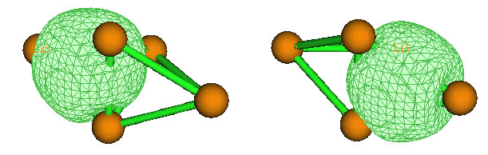

目前会看到菜单前头的Residual valence electrons of all atoms in the search list后面显示的数值为0.01989，这代表剩下的电子数，相应于NBO分析当中的非Lewis成份。由于剩下的电子已经远小于2了，就不可能再去找到其它双电子多中心键了，因此对Li5+的分析就到此结束了。

实际上，通过考察如下的Li5+的ELF=0.99等值面图，也能了解到它有两个四中心键，有两个比较扁的定域性很高的区域出现。ELF等值面图在Multiwfn中的做法可参见手册4.5.1节。

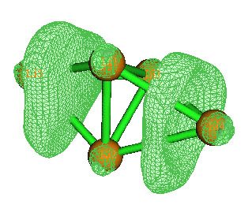

### 3.2 分析Au20团簇

四面体型Au20团簇在JPCA,113,866文中被通过AdNDP方法研究过，本节我们也研究一下它内部的多中心键。下面的坐标是直接从此文献中的补充信息中摘取的，是Td点群，请大家效仿上一节的输入文件写一个Au20的Gaussian单点输入文件，计算完毕后转换出对应的fch文件。此体系净电荷为0，自旋多重度为1，理论级别最好和原文一致，使用B3PW91结合LANL2DZ赝势基组计算。使用赝势并不会妨碍价层密度的分析。如果大家懒得自己算，可以直接下载<http://sobereva.com/attach/138/Au20.rar>，里面包含了用于AdNDP分析目的的Gaussian输出文件和fch文件。

Au 2.935949 -2.935949 2.935949  
Au 2.935949 2.935949 -2.935949  
Au -2.935949 -2.935949 -2.935949  
Au -2.935949 2.935949 2.935949  
Au -1.142441 -1.142441 1.142441  
Au 1.142441 1.142441 1.142441  
Au -1.142441 1.142441 -1.142441  
Au 1.142441 -1.142441 -1.142441  
Au 0.964601 0.964601 -3.140361  
Au 3.140361 0.964601 -0.964601  
Au 0.964601 3.140361 -0.964601  
Au -0.964601 3.140361 0.964601  
Au -0.964601 0.964601 3.140361  
Au -3.140361 0.964601 0.964601  
Au 0.964601 -3.140361 0.964601  
Au 3.140361 -0.964601 0.964601  
Au 0.964601 -0.964601 3.140361  
Au -3.140361 -0.964601 -0.964601  
Au -0.964601 -0.964601 -3.140361  
Au -0.964601 -3.140361 -0.964601

将Gaussian输出文件载入进Multiwfn并进入AdNDP分析界面后，还是先选2穷举搜索单中心轨道。这次搜索出了占据数100个高于阈值的轨道，它们按照占据数由大到小编号显示在候选列表中。选择0并输入100把它们全都取出作为AdNDP轨道。这些轨道对密度的贡献被去掉后，屏幕上显示目前还有22.3329个剩余电子。（提示：候选轨道有时会比较多，列表比较长，可以将命令行窗口竖向方向拉长一些以显示更多信息）  
接下来选2穷举搜索二中心轨道，但是一无所获，再选2穷举搜索三中心轨道仍然一无所获。再次选2穷举搜索四中心轨道，这次发现了10个候选的（由于要做20!/(20-4)!/4!=4845次尝试，所以略微耗时）：

#  10 Occ:  1.7589 Atom:   5Au   7Au  14Au  18Au  
#   9 Occ:  1.7589 Atom:   5Au   8Au  15Au  20Au  
#   8 Occ:  1.7589 Atom:   6Au   8Au  10Au  16Au  
#   7 Occ:  1.7589 Atom:   6Au   7Au  11Au  12Au  
#   6 Occ:  1.7589 Atom:   7Au   8Au   9Au  19Au  
#   5 Occ:  1.7589 Atom:   5Au   6Au  13Au  17Au  
#   4 Occ:  1.8400 Atom:   4Au  12Au  13Au  14Au  
#   3 Occ:  1.8400 Atom:   1Au  15Au  16Au  17Au  
#   2 Occ:  1.8400 Atom:   3Au  18Au  19Au  20Au  
#   1 Occ:  1.8400 Atom:   2Au   9Au  10Au  11Au

其中1至4号、5至10号是占据数简并的轨道。通过选项8来预览这些候选轨道，会知道前四个对应于Au20四个顶角的四中心轨道，后六个对应于四面体团簇棱边的四中心轨道。现在我们要用选项0把这些轨道取出来作为AdNDP轨道。但是不要直接把10个都取走，这点十分关键，因为，AdNDP方法搜出的轨道彼此间并不是正交的，而是有交叠的，彼此间可能共享一部分密度。如果将10个一下都取出，就会令轨道的占据数偏高了（即overcounting）。通常，我们会按照占据数从高到低，将简并轨道一批一批取出，每次取出后，它们的密度将会被扣除，剩下的候选轨道的形状和占据数会被重新计算，这样就可以较大程度避免overcounting问题。如果将占据数较高的轨道依次取出后，剩下的轨道中占据数最高的也已经小于了期望的值，比如1.7，即不能再被近似视为双电子轨道，那么就不理它们了，而接着搜索更多中心的轨道。（注：我们取单中心轨道时总是可以一次都取出来。尽管可能有多个单中心轨道都处在同一个原子上，但同个原子上的候选轨道，或者广义来说，相同原子组合上的数个候选轨道都是彼此间正交的，所以同时取走而不必担心overcounting问题）

对于本例，我们先选0，输入4将前四个候选轨道取出作为AdNDP轨道。由于它们的密度被扣除了，因此剩下的6个候选轨道的占据数有所降低，成为1.6913。我们再选0并输入6将它们都取出。此时剩下的电子还有4.825个，虽然表面上可能还能搜出两三个双电子轨道，但经笔者尝试，发现已经做不到了，分析也就到此结束了。如果选择5，可以将搜索过程中已经取出的所有AdNDP轨道的基本信息显示出来。

按照上面的步骤，我们得到了4个占据数为1.8400的和6个占据数为1.6913的AdNDP轨道。如果我们先把后六个轨道取出（即选0之后输入5-10），然后再取出前四个，我们将会得到6个占据数为1.7589的和4个占据数为1.7581的AdNDP轨道。本例先取出占据数高的再取出占据数低的做法是一般性做法，让高占据轨道有更高优先级显得较为合理，但是这对于低占据数轨道多少有些不公平，尤其是占据数非常接近时，我认为这是AdNDP方法的不足之一。不过尽管两种取法得到的占据数不同，但从轨道图形上看没什么差异。

实际上，在上面Li5+例子中，那两个4c-2e彼此间也有稍许交叠，因为它们都涉及到中间的三个Li，也因此它们的占据数被稍微高估了一点。但是我们却不能先取出一个再取出另一个，因为这会破坏这两个轨道的简并性，即它们的占据数不再相同，将分别为1.9973和1.8699，轨道形状也不再完全对应。AdNDP方法的原则是宁可忍受一点overcounting问题，也要让AdNDP图样保持与分子结构一致的对称性。从图形上看Li5+的两个4c-2e间交叠程度很小，因此可以忽略这问题；但如果从图上看几个简并的候选轨道交叠十分明显的话，那么overcounting就是不可忍受的了，遇到这种情形时这些候选轨道哪个都不能取。

本节的分析结果的结论虽然与JPCA,113,866的完全一致，轨道图形看不出区别，但是在轨道占据数上稍有出入，Boldyrev他们得出的是4个占据数为1.72和6个占据数为1.98的4c-2e轨道。导致差异的目前原因不明，而对于硼团簇以及平面芳烃的分析，Multiwfn都能得到与他们文中完全一致的结果。虽然我没有他们的程序没法分析导致差异的细节原因，但笔者目前有充分自信认为Multiwfn的结果是正确无误的。

我们也可以试图用ELF来分析Au20看看是否有相同的结论。但经过笔者尝试，ELF并没有得到期望的结果，看不出多中心键。而笔者使用类似于ELF的LOL（局域轨道定位函数）时，从等值面上确实可以看到四中心键的存在。下面左边的图中黑色箭头指明了4c-2e轨道对应的电子高定域性区域。然而，无论怎么调节isovalue，也无法找到Au20顶角的4c-2e对应的独立的高定域性区域，但每个顶角却能找出三个小的定域性域，例如右图黑色箭头所示的，可以认为三个邻近的这种域是和顶角的AdNDP 4c-2e轨道相呼应的。为了能让这个体系当中的与4c-2e轨道对应的定域性域展露出来，我们必须将isovalue调到0.3多点，这是一个很低的值，也就是说，这个体系中的四中心轨道定域性并不很强（比Li5+的定域性弱多了，上节在ELF=0.99时都能清楚地看到对应的定域化域），某种程度也可以说，这样的四中心轨道的电子占据数应该不是特别接近2才对，所以，从这个角度我认为Boldyrev他们得到的六条4c-2e轨道占据数高达1.98是有问题的，而Multiwfn得出的1.6913更合理。

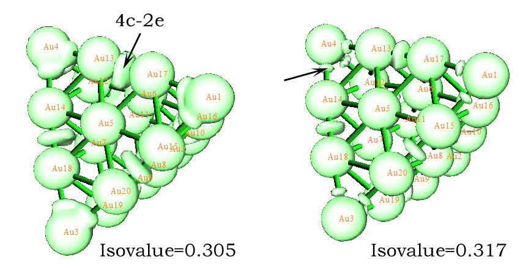

在Multiwfn里只能一次观看最多两条轨道的等值面图形，很多AdNDP文献里都是将很多轨道做到一张图上。作这种图其实很容易，首先，在Multiwfn的AdNDP界面里选择选项9，选择一个合适的格点设置（这种大小的体系用Medium quality grid得到的图像就足够光滑），然后输入要输出的AdNDP轨道序号范围，比如输入101-110（101至110就是那10条AdNDP 4c-2e轨道，可以用选项5来查看序号），然后就能将它们的cube文件一次性导出到当前文件夹里，名字是AdNDPorbXXXX.cub，其中XXXX对应轨道序号。之后，就可以用支持cube格式且能够同时显示多个格点数据等值面的可视化软件将这些轨道图形同时显示出来，笔者推荐使用VMD，如果不熟悉的话，可以参考《使用Multiwfn观看分子轨道》（<http://sobereva.com/269>）的第6节的做法。但是，手动操作一个一个显示轨道终究费事一些。Multiwfn程序包里的examples\AdNDP\plotAdNDP.vmd是写的VMD脚本，可以直接将一批AdNDP轨道的cube文件的等值面图一下都作出来。脚本内容如下，拷贝进VMD的命令行窗口直接运行即可：

#0 blue, 1 red, 2 gray, 3 orange, 4 yellow, 5 tan, 6 silver, 7 green, 8 white, 9 pink, 10 cyan, 11 purple  
set posclr 1  
set negclr 0  
set istart 1  
set iend 17  
set isoval 0.06  
set idinit 0

color Display Background white  
display depthcue off  
display rendermode GLSL  
for {set i $istart} {$i<=$iend} {incr i 1} {  
set idx [format %04d $i]  
set name "D:\\CM\\my_program\\Multiwfn\\AdNDPorb$idx.cub"  
puts Loading\ $name  
 mol new $name type {cube}  
 mol modstyle 0 $idinit Isosurface $isoval 0 0 0 1 1  
 mol modcolor 0 $idinit ColorID $posclr  
 mol modmaterial 0 $idinit Transparent  
 mol addrep $idinit  
 mol modstyle 1 $idinit Isosurface -$isoval 0 0 0 1 1  
 mol modcolor 1 $idinit ColorID $negclr  
 mol modmaterial 1 $idinit Transparent  
incr idinit 1  
}

脚本中开头的posclr和negclr代表轨道正值和负值部分的颜色，常用的颜色代码在#后面的注释里已经标注了。istart和iend代表要载入的格点文件编号始末，比如分别设为101和104就会把AdNDPorb0101.cub、AdNDPorb0102.cub、AdNDPorb0103.cub、AdNDPorb0104.cub都依次载入。isoval是等值面数值大小。idinit是要载入的这些格点文件在VMD中的ID号，需要正确设定。设为0时，101号至104号轨道cube文件载入后就会在VMD中依次作为第0号、1号、2号、3号体系。如果你想再通过这个脚本再载入其它一批cube文件，那么idinit应该改为4，后续载入的格点文件将依次作为4号、5号...。set name命令的路径需要用户改成自己的实际路径，注意Windows下的路径里的斜杠必须写成两道斜杠。这个作图脚本默认情况下绘制的等值面图是透明度，透明效果可以在Graphics-Materials里选择Transparent后做细致调节。如果想让等值面变成不透明（如此例），需要将mol modmaterial前面加上井号来注释掉。

例如，我们这里要把Multiwfn输出的Au20的顶角的4个4c-2e轨道绘制为红色（注：本节找到的4c-2e轨道没有负值部分），即AdNDPorb0101.cub到AdNDPorb0104.cub，在把istart和iend分别设为101和104，把set name后的文件路径设为实际路径并启动VMD后，直接在命令行窗口里运行上面的脚本即可。如果我们还想把另外六个在棱上的4c-2e用桔黄色绘制上去，即AdNDPorb0105.cub到AdNDPorb0110.cub，那么把istart和iend分别设为105和110，把posclr设为3，把idinit设为4，之后运行脚本即可。为了使体系中的原子也显示在图上，可以随便在VMD Main窗口里选一个体系（坐标都是相同的），点Graphics-representations，在里面点Create Rep，然后在Drawing method里选一个合适的显示方式，比如CPK，此时我们将得到下图。

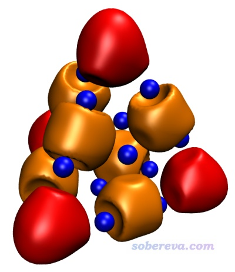

### 3.3 分析B11-团簇

B11-团簇就是AdNDP原文中分析的一个体系，这一节我们来重现他们的分析。这个体系的Gaussian输入和输出文件以及相应的fch文件在Multiwfn压缩包里examples\AdNDP目录下就能找到。为了与原文一致，对这个体系仅用了STO-3G基组生成波函数。实际上AdNDP对于基组依赖性很小，在STO-3G这样很低级别的基组下也能得到定性合理的结果，这一点与NBO分析很像。使用太大基组不仅增加了Gaussian计算耗时，也增加了AdNDP搜索多中心键的耗时，因为基组越大则对每种原子组合所要构建的密度矩阵块就越大，在对角化时会耗费更多时间。

将B11-.out载入并进入Multiwfn的AdNDP模块后，还是先通过选项2搜索孤对电子，并且一无所获。然后再选2来穷举搜索双中心轨道，这回找出9个候选：  
#   9 Occ:  1.9727 Atom:   6B   10B  
#   8 Occ:  1.9727 Atom:   5B   11B  
#   7 Occ:  1.9742 Atom:   7B    9B  
#   6 Occ:  1.9742 Atom:   7B    8B  
#   5 Occ:  1.9869 Atom:   2B    6B  
#   4 Occ:  1.9869 Atom:   3B    5B  
#   3 Occ:  1.9871 Atom:   9B   11B  
#   2 Occ:  1.9871 Atom:   8B   10B  
#   1 Occ:  1.9942 Atom:   2B    3B  
为了避免overcounting问题，我们不一次将它们都取出而是逐步将它们取出。由于第一个和第四个有交叠（都涉及3号原子），而前三个候选之间没有交叠，所以选0然后输入3先将前三个取走。然后再取走4个（虽然7-8和7-9都涉及7，但是为了避免破坏其简并性，故同时被取走），最后把剩下的2个取走。此时就有了10条2c-2e AdNDP轨道，目前残余电子是16.307.

接下来选2穷举搜索三中心轨道，得到9个候选。先取走前2个(1-8-10和4-9-11)，再取走一个(1-4-7)，再取走两个(1-2-6和3-4-5)，此时剩下的四个轨道中占据数最高的仅为1.4085，没法再被近似认为是3c-2e了，就不再理会它们。目前已得到的5个3c-2e AdNDP轨道图形一起作在了同一张图上，占据数都是1.85上下（图中绿色文字是相应的三中心键级，见后文）：

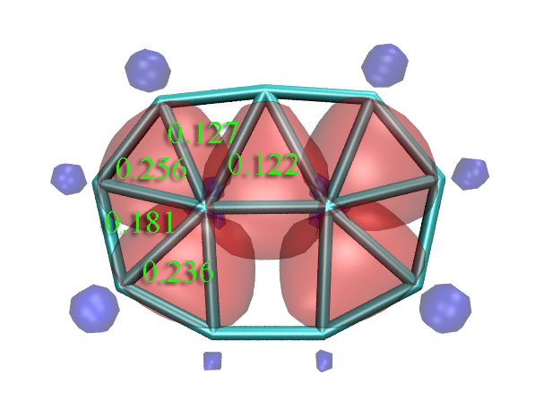

我们也可以做ELF平面图进行对比（对此体系LOL图和ELF图的结论完全一致），在Multiwfn里做平面图的方法可以参考手册4.4节的几个例子。从这图上我们可以看到AdNDP和ELF的结论还是比较吻合的，两侧的四个3c-2e AdNDP轨道对应ELF的四个处在三个原子之间的高定域性区域。只是中间的3c-2e AdNDP轨道和ELF图上的稍有不同，从ELF图上看那更像是普通双中心键，而AdNDP轨道则是向上方的一个原子偏一些而被算作三中心键。不过，毕竟AdNDP和ELF在理论基础上还是有很大差异的，我们也不能强求它们总是完全一致。

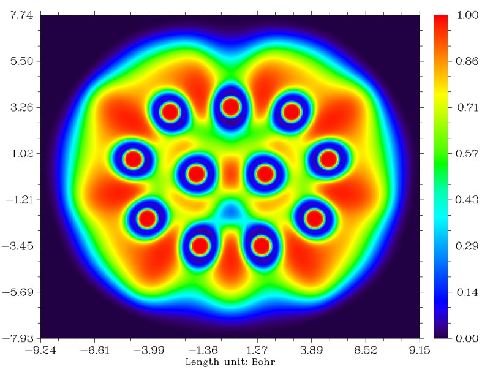

研究多中心键的主要方法中，除了ELF/LOL和AdNDP以外，还有多中心键级。多中心键级虽然不能给出具体的图形，但是可以给出定量的键的强度。在Multiwfn中计算多中心键级需要以.fch、.mwfn、.molden等包含基函数信息的文件作为初始输入文件，载入文件后进入主功能9，之后选2进入多中心键级分析功能，然后输入环中原子的序号即可得出结果，输入的序号应当按照原子的连接顺序输入。注意多中心键级有个特点，即有的时候，沿着环顺时针输入序号还是逆时针输入序号有时会影响结果，比如1,2,3和3,2,1的结果有时并不完全相同，不过一般差异不大而可以忽略（更严格一点的做法是两种情况取平均，懒得手动取平均的话也可以将Multiwfn的settings.ini里的iMCBOtype设为1，此时输出的直接就是平均值了）。多中心键级计算结果在AdNDP那张图上用绿色文字已经标出了。可见，两侧的四个3c-2e AdNDP轨道对应的三中心键级明显比较大。但是，中间那个3c-2e AdNDP轨道对应的键级却只有0.122，甚至还不如没出现3c-2e AdNDP轨道的区域的三中心键级大。结合ELF和多中心键级的结果，我认为对这个体系，AdNDP方法给出的中间的三个原子之间有3c-2e轨道的结论未必合理。所以，大家也不要只拿AdNDP的分析结果说事，建议结合多中心键级以及ELF/LOL图形做比较研究（实际上，ELF/LOL的结果和多中心键级结果也并非总一致）。

搜索完B11-的3c-2e后，目前还剩下7.029个电子，因此可能还能找到一些双电子轨道。这个体系比Li5+要复杂很多，虽然原子数比Au20少，但是对称性明显比它要低，因此分析这个体系的更多中心的轨道并非易事，光靠穷举搜索的方式往往并不奏效，不仅耗时而且未必能得到希望的结果。如果你不确定下一步该怎么做，建议先选11，将当前的密度矩阵和AdNDP轨道列表临时保存到内存中，接下来如果选择了不合适的轨道，那么还可以通过选择12将密度矩阵和AdNDP轨道列表恢复回来。

假设我们继续穷举搜索4中心轨道，占据数最高的候选轨道的占据数也仅为1.7135，这可能并不是我们想要的，先不取它。接下来穷举搜索5中心轨道，这时候发现前两个候选轨道的占据数都为1.89，表面上看不错，可认为是5c-2e。然而，此时取走它们却未必是最佳选择，因为完全有可能搜索出占据数更接近2.0的更多中心的轨道。这就是为什么我说使用AdNDP方法并不容易，用户往往需要自己判断下一步怎么走，不同的走法又影响到后续搜索，经常得得反复试验很多次才能最终找到最理想的AdNDP图样。

实际用AdNDP分析复杂体系时，我们往往需要借住一些其它依据引导我们搜索轨道的过程。ELF图的确可以作为搜索3、4乃至5中心轨道时的参考，然而从ELF图通常并不能对涉及到很多中心、离域尺度很大的情况对AdNDP轨道的搜索过程做出指导，光从ELF图上很难看出什么来。这个时候我们可以参考一下体系的正则分子轨道。通过检查正则分子轨道，只发现3个轨道和pi电子有关，如下图所示，而且这三个轨道是整体离域的。通过图形检验可知，我们之前所找出的AdNDP轨道都不涉及到pi密度，pi密度还“闲着”，剩下的三个多中心双电子AdNDP轨道很可能就是由这三个整体离域的表现pi密度的正则分子轨道以某种方式组合所给出。于是，我们直接去搜索11中心轨道。

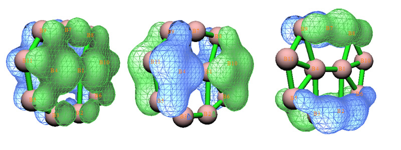

选择3，然后输入11，这表明接下来选2进行的穷举搜索是搜索11中心轨道。由于体系总共就11个原子，所以Multiwfn实际上只进行了一次尝试。这下找出来三个候选轨道，占据数都达到理论最高值2.0，很理想，通过图形观察，其实它们和原先的那三个pi型正则分子轨道是一样的。把它们取出作为11c-2e AdNDP轨道后，剩下的电子只有1.029了，远小于2，宣告AdNDP分析结束了。对照AdNDP原文给出的这个体系分析结果可以看到用Multiwfn得出的占据数和原文几乎完全一致。

### 3.4 分析菲

这是最后一个例子，通过这个例子大家将了解如何使用用户导向搜索(user-directed search)方式搜索AdNDP轨道。Gaussian的输入文件如下，请自行生成输出文件和fch文件。对于普通的有机小分子，3-21G级别的基组产生的波函数对AdNDP分析来说已经基本够，使用更大基组也不会看到最后轨道形状和占据数有很明显的变化。不过为了避免审稿人嫌基组太low，建议实际研究中使用不低于6-31G*的基组。

%chk=C:\gtest\adndp\phenanthrene.chk  
# b3lyp/3-21g pop=nboread  
[空行]  
b3lyp/3-21g opted  
[空行]  
0 1  
 C                  0.00000000    3.56061700   -0.29722900  
 C                  0.00000000    2.83932500    0.87979300  
 C                  0.00000000    1.42361400    0.86771500  
 C                  0.00000000    0.72986200   -0.38070000  
 C                  0.00000000    1.49924400   -1.56931800  
 C                  0.00000000    2.88151800   -1.53149000  
 C                  0.00000000    0.67926500    2.09717700  
 C                  0.00000000   -0.72986200   -0.38070000  
 C                  0.00000000   -1.42361400    0.86771500  
 C                  0.00000000   -0.67926500    2.09717700  
 C                  0.00000000   -2.83932500    0.87979300  
 H                  0.00000000   -3.34927800    1.83744900  
 C                  0.00000000   -3.56061700   -0.29722900  
 C                  0.00000000   -2.88151800   -1.53149000  
 C                  0.00000000   -1.49924400   -1.56931800  
 H                  0.00000000    1.23356400    3.02968400  
 H                  0.00000000    4.64400700   -0.27588200  
 H                  0.00000000    3.34927800    1.83744900  
 H                  0.00000000    1.00203800   -2.53051300  
 H                  0.00000000    3.44643700   -2.45642700  
 H                  0.00000000   -1.23356400    3.02968400  
 H                  0.00000000   -4.64400700   -0.27588200  
 H                  0.00000000   -3.44643700   -2.45642700  
 H                  0.00000000   -1.00203800   -2.53051300  
[空行]  
$nbo dmnao aonao $end

进入AdNDP分析界面后，即便还没有搜索任何轨道，但也可以直接选7或者8来看一下分子结构，并记住原子编号：

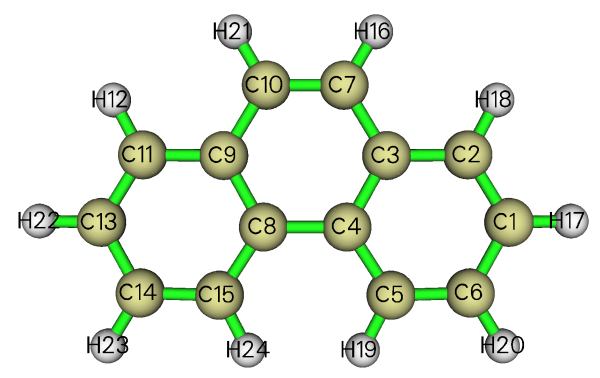

还是照例先穷举搜索单中心轨道（一无所获），然后穷举搜索双中心轨道。总共找出31个候选轨道，其中10个是C-H键对应的轨道。建议这里先把这10个候选轨道挑出来，也就是选0，输入8-15，再选0，输入9,10。接下来，依次挑出C-C间的候选轨道。轨道比较多，可能看着眼花，建议每次只挑出前几个简并的候选轨道，可以按照0 2 0 1 0 2 0 1 0 2 0 2 0 2 0 2 0 2的输入来做，空格代表回车。挑出16个C-C候选轨道后，剩下的一个占据数最高的候选轨道是1.8033，通过选8来预览它的轨道图形可知它是C8-C10间的pi轨道，由于占据数还算比较高，也把它挑出。剩下的四个占据数只有1.7192的候选轨道就不管了。

这个体系中的原子并没有构成类似B11-团簇那种局部的小三角形的排布，因此，直觉告诉我们此体系里应该没有三中心键。那么接下来怎么搜索？我们可以看看剩余密度在每个原子上的布居数，选13，我们看到这样的表  
 1C :  1.0250       2C :  1.0370       3C :  1.0280       4C :  1.0414  
 5C :  1.0339       6C :  1.0262       7C :  0.1322       8C :  1.0414  
 9C :  1.0280      10C :  0.1322      11C :  1.0370      12H :  0.0117  
13C :  1.0250      14C :  1.0262      15C :  1.0339      16H :  0.0121  
17H :  0.0113      18H :  0.0117      19H :  0.0126      20H :  0.0111  
21H :  0.0121      22H :  0.0113      23H :  0.0111      24H :  0.0126  
凡是残余电子布居数接近0的原子，比如所有的氢和C7、C10，它们通常不会再涉及到其它多中心轨道（除非它们恰处于某些多中心轨道的节点上），我们可以暂且无视它们。而剩下的碳原子占据数都在1左右，正对应于还没被用到的垂直于菲平面的p轨道单电子，它们可能会构成离域pi轨道。这些原子都分布在菲的左右两个环上，因此极有可能左右两个环都能构成像苯环一样的六中心离域体系，因此我们应当把穷举搜索范围先设在其中一个环上。Multiwfn的穷举搜索涉及的范围只是搜索列表里的原子，搜索列表默认是整个体系。我们选-1进入搜索列定义界面，输入clean清除默认内容，然后输入a 1-6，就把搜索列表设为1至6号原子了，输入x保存列表并退回。此时会看到剩余电子数目也变成了6.191，这个值显示的只是当前搜索列表里原子上的剩余电子之和。

选3并输入6，再选2，就会对搜索列表里原子的进行6中心轨道的搜索，这里找出来了三个候选轨道，占据数在1.82至2.0范围，是比较合适的6c-2e中心轨道，将它们取出。通过预览其图形可知它们的形状和苯分子的占据的pi正则分子轨道十分相似，见下图，这也表明了菲分子当中两侧的环构成了局部的类似苯的六中心共轭体系。

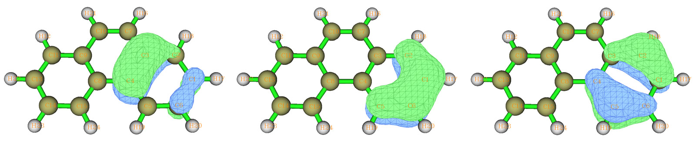

接着，再进入-1，输入clean清空列表，输入a 8,9,11,13,14,15，然后输入x保存并退出，选2对另一个环进行六中心轨道搜索，也是搜索出三个候选轨道，将它们取出。我们再次进入定义搜索列表的界面，输入addall将整个分子原子都加进去，保存并退回，此时看到整个分子只有1.152个剩余电子了，不可能找出其余双电子轨道了，这标志着菲的AdNDP分析已经完成了。（注：对于某些分子，即便剩余电子还大于2不少，但可能也已经找不出占据数较高的轨道了，此时只能作罢）

两侧的环的多中心键级是0.0616，而中间的由3,7,10,9,8,4号原子构成的环的多中心键级仅为0.0261，这确实表明两边的环比起中间的环共轭性要强得多（再次提醒，计算多中心键级在输入原子序号的时候必须按照连接关系输入。对于此例的中间的六元环，如果不按顺序，比如输入成4,7,10,3,9,8，那么结果是没意义的）。

我们也可以通过ELF-pi来分析，ELF-pi的计算方法在《在Multiwfn中单独考察pi电子结构特征》（<http://sobereva.com/432>）里已经有详述，这里不再累述。为了直观，我们这里并不给出ELF-pi的(3,-1)临界点的具体数值，而是直接给出只考虑pi电子的ELF=0.5的等值面图。从下图可见，在ELF=0.5的时候，两侧的六元环的ELF域各自是联通的，然而两侧的环彼此间的等值面已经断开了，而且也都不与C7-C10的ELF等值面相连。因此ELF-pi的分析也说明菲中包含了两个显著的六元环共轭结构。其它研究芳香性的方法，如NICS，也都能给出同样的结论。

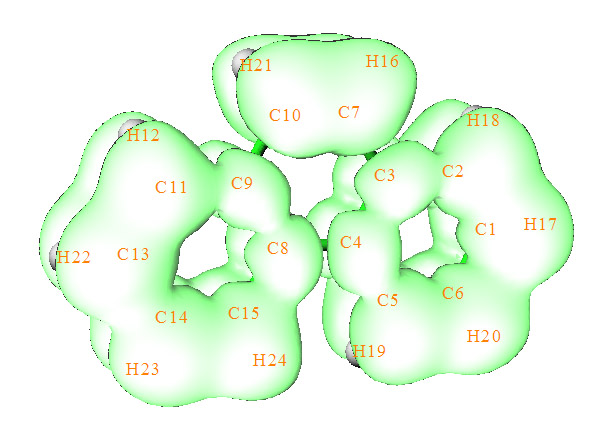

在前面的四个例子中有一个选项还没被提到，就是选项1。这主要是给高级的用户用的。用户输入一串原子组合，Multiwfn就会对这些原子构建相应的密度矩阵并对角化，所有本征向量无论占据数是多少，都会被纳入候选轨道列表中。

### 3.5 分析AdNDP轨道成份

用Multiwfn还可以对AdNDP轨道成份进行分析。通常建议选择AdNDP界面里的选项15，之后输入AdNDP轨道序号，就可以通过NAO方法给出这个轨道的成份，下面是个输出例子，可见原子轨道的贡献、壳层的贡献、原子的贡献都非常清晰给出了，而且和轨道等值面图对应很好。如果你不懂轨道成份分析方法，看《谈谈轨道成份的计算方法》（<http://sobereva.com/131>）。

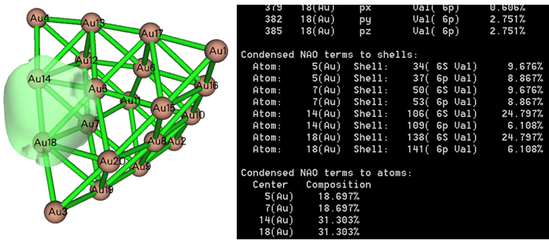

还可以用Multiwfn的主功能8里的其它方法分析AdNDP轨道成份，比如Hirshfeld、Becke、Mulliken等。做法是在AdNDP界面里选择选项14，Multiwfn会读取体系的.fch文件，然后在当前目录下输出AdNDP.mwfn文件（这种.mwfn文件也是一种通用的记录波函数信息的格式，在Multiwfn中可以当成.fch来用）。假如当前体系有N个基函数，AdNDP分析过程中共挑出了M个AdNDP轨道，那么此文件里也包含N个轨道，但是只有前M个轨道是与挑出的M个AdNDP轨道相对应的，其余N-M个轨道都没有意义，不用去管。将AdNDP.mwfn作为Multiwfn启动后的输入文件，然后利用主功能8的各种选项就可以分析AdNDP轨道成份了，操作和平时分析分子轨道成分完全一致。

### 3.6 计算AdNDP轨道能量

Multiwfn可以对已经挑出的AdNDP轨道计算轨道能量。在挑出一些轨道后，可以选"16 Evaluate and output energy of AdNDP orbitals"，此时Multiwfn就会让你输入一个含有Fock/KS矩阵元数据的文本文件，Multiwfn会从中读取矩阵并计算出各个AdNDP轨道能量。第i个AdNDP轨道能量计算公式是<i|F|i>，其中F是Fock/KS算符。输入的文件的格式要求在手册3.17.2节已经说明了。

对于Gaussian用户，虽然可以用IOp(5/33=3)把Fock/KS矩阵输出出来然后写入到一个文本文件里提供给Multiwfn，但是每轮SCF迭代都会输出一堆矩阵，输出文件会很大，而且这样操作步骤也多。Gaussian用户得到AdNDP轨道能量最简单的方式是产生.47文件（GENNBO输入文件），也就是写pop=nboread，然后输入文件末尾空一行写比如$NBO archive file=C:\YOSORO $END，则计算完成后就会产生C:\YOSORO.47文件。在进入AdNDP模块的选项16之后，把这个.47文件路径输入进去，Multiwfn就会从中读取Fock/KS矩阵，并输出所有AdNDP轨道的能量。如果你看了以上文字还搞不懂的话，可以看Multiwfn手册4.14节的例子，其中计算了AdNDP轨道能量。

## 4 总结

AdNDP是一个很有价值的分析多中心轨道的方法，理论依据也比较明确，但绝对不是一个黑盒子，而是需要经过实践练习才能熟练、合理运用。另外AdNDP方法不是没有缺点的，在挑轨道上有着一定含糊性，需要用户干预，引入了主观成分，如果用不好，可能结论还会与体系实际电子结构特征不符。可是AdNDP的相关文献中基本只提AdNDP的优点却很少提及它的缺点。

虽然AdNDP轨道搜索过程没唯一准则可循，但可以总结出六点：1.剩余电子数越少越好 2.每个AdNDP轨道占据数越接近2.0越好（对于闭壳层而言） 3.挑出的轨道的中心数应尽量低（否则就又成了正则分子轨道了） 4.尽量避免占据数的overcounting 5.AdNDP轨道分布需满足分子对称性 6.挑出的轨道能较合理地展现出体系中实际的强共轭区域。其中5是必须遵循的，其它要求有时候会产生矛盾，只能自己看着办了。

AdNDP、ELF/LOL、多中心键级都是目前研究多中心键的方法，它们各有优点和缺点，而且也都有个别失败的例子。AdNDP需要做搜索，对复杂体系较费事，结果一定程度受人为因素的影响，但好处是可以给出轨道的图形、能量、成份，而且可以自发地把sigma和pi多中心轨道分离描述。ELF/LOL图分析方法虽然快速直观，分析三、四中心键尤为合适，但是难以直接展现出体系内在的涉及原子数很多的多中心键（不过大范围pi共轭的情况仍可以通过ELF-pi或LOL-pi体现，看《在Multiwfn中单独考察pi电子结构特征》<http://sobereva.com/432>）；多中心键级分析不能给出图形，但可以给出多中心键定量的强度数据，往往和能量有很好相关性（如J.Mol.Struct(Theo.),370,45），它也已经成为衡量芳香性的一个指标（如PCCP,2,3381及JPCA,109,6606）。笔者建议将AdNDP、ELF/LOL和多中心键级结合使用，取长补短。
