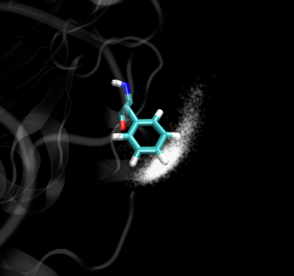
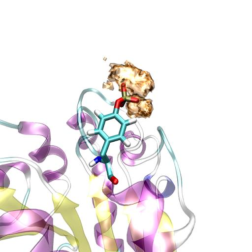

**VMD显示轨迹中粒子的空间密度分布的两种方法**Two methods for VMD to display the spatial density distribution of particles in trajectories  
  
文/Sobereva

写于约2008年  Last update: 2015-Jun-13

  
  
第一种方法是用颜色深浅显示某原子在不同位置出现的概率，这种方法适合描述少数几个粒子的密度分布，效果比较柔和。  
  
  
渲染模式开GLSL，在Materials对话框里把Transparent材质复制到一个新的材质叫a  
把a的Ambient设最大，Opacity设0.03，然后在文本控制台source一下dis.tcl脚本。  
运行draw material a  
然后比如想看index 444原子在前4444帧内的空间分布状况，输入dis 444 4444。如果效果不好，再调a材质的Opacity。  
原理简单来说，就是开了GLSL渲染模式之后所绘的东西可以有透明色，每次出现用一个透明的白色球来表示，这样的东西叠加次数越多，某处越不透明，显得颜色越深（图中的例子就是越白），说明出现概率越大。我的例子是苯丙氨酸苯环末端的H在各个位置的出现几率，说明不易偏离其稳定位置，越靠边概率越小。  
球半径0.13是我觉得图像效果比较好的情况，可以自己调。如果不满意，就运行draw delete all删除所绘的一切内容，调完参数再次重复上面步骤运行。  
  
dis.tcl脚本内容：  

```
proc dis {atom fps} {
draw color white
for {set i 0} {$i<$fps} {incr i 1} {
set nowselect [atomselect top "index $atom" frame $i]
set x [$nowselect get {x}]
set y [$nowselect get {y}]
set z [$nowselect get {z}]
draw sphere "$x $y $z" radius 0.13
}
}
```

  



   
  
   
第二种方法是用等值面显示，这种方法适合描述大量粒子的空间分布。用g_spatial可以计算某个group在空间中每个点的出现几率。

首先用trjconv -f a-sol.trr -s a-sol.gro -fit rot+trans按照某个东西align一下，比如研究溶剂在蛋白附近分布，fit组就选蛋白，也就是以蛋白不发生整体运动为依据改变整个轨迹中的原子坐标，然后g_spatial -s a-sol.tpr -f a-sol.trr -n index.ndx可以计算某个group在空间中每个点的出现几率，存为grid.cube。如果说内存分配不够或者段错误，用-nab，设100一般够了。设bin控制格点宽度，默认是0.05，0.03的时候文件已经很大了。

g_spatial第一次选择的group决定了空间格点各个值的大小，也即决定了grid.cube的数据部分，得到的等值面图是什么样完全取决于第一次选择的group。第二次选择group实际上是选择输出哪些原子到grid.cube头部的原子叙述部分，这个完全不影响结果，随便设，一般设成溶质。比如第一组设的是溶剂，第二组设的是溶质，读进VMD，用CPK等模式看到的是溶质的结构，用isosurface模式看到的是溶剂出现密度的等值面。两个模式叠加显示就是溶剂与溶质的关系。


