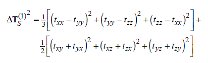
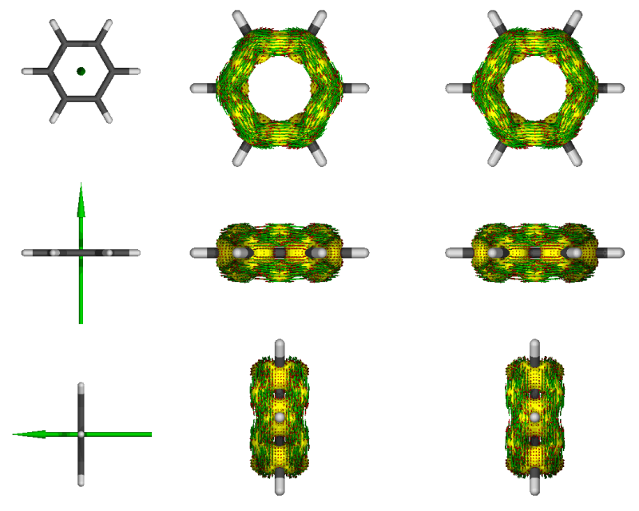
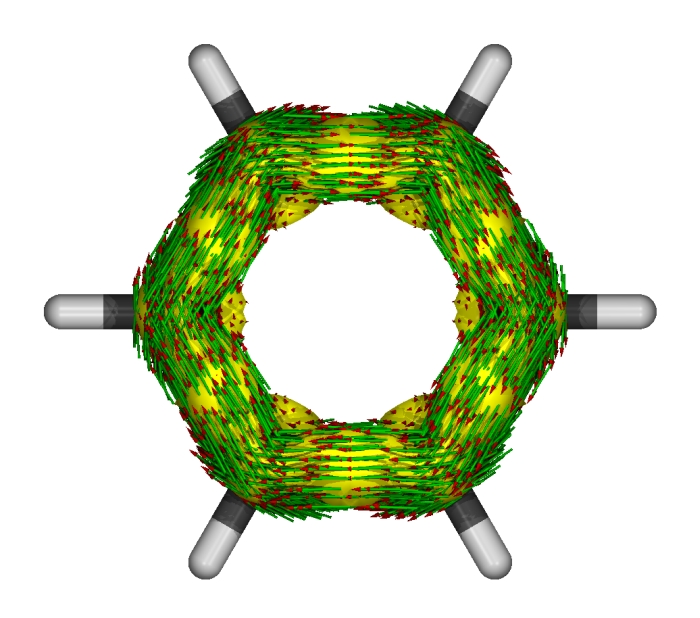
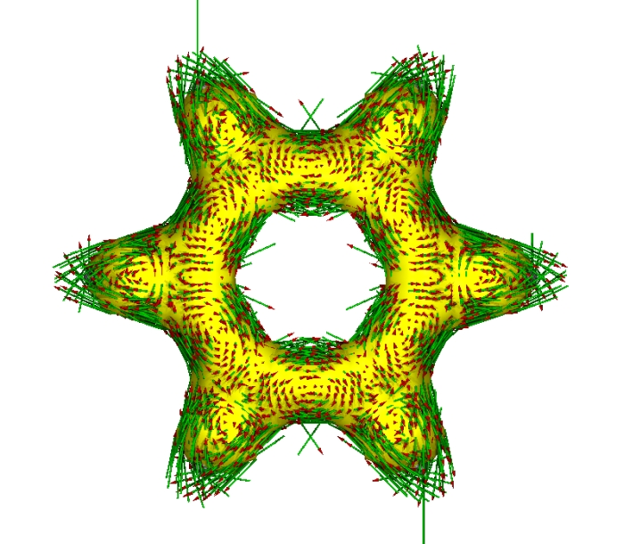
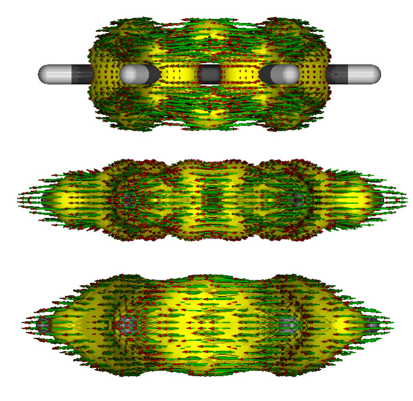

**注**：后来发布了AICD 2.0，安装和使用比此文介绍的老版本方便得多，因此一定要看此文：《使用AICD 2.0绘制磁感应电流图》（<http://sobereva.com/294>）

**使用AICD程序研究电子离域性和磁感应电流密度**Study of electron delocalization and magnetically induced current density using AICD program

文/Sobereva @[北京科音](http://www.keinsci.com/)  
First release: 2012-Apr-7   Last update: 2015-Jan-26

## 1 关于磁感应电流密度

在中学就学过，在外加磁场下，闭合导体会产生感应电流阻碍原磁通量变化

对于分子体系也是一样，如果体系中电子在整体或者某个部分有很强的离域性，或者说处在这样区域的电子能够很自由地运动，比如苯环的pi电子，那么在外加磁场时，会在相应区域会产生一圈明显的感应环形电流，在相关的原子附近会有较大的电流密度。因此，研究外加磁场下的分子内电流密度分布，对于考察体系的电子离域性，研究芳香性很有帮助。环电流方向与上图左手规则相同时（称为diamagnetic或diatropic环电流），电流越大，则芳香性越强；而电流方向越与左手规则相反时（paratropic环电流），电流越大则表现出越强的反芳香性。如果没有产生明显净电流，就是非芳香性。

除了共轭环状体系，还有人研究了富勒烯在磁场下的诱导电流，被称为球电流，有兴趣者可参阅<http://onlinelibrary.wiley.com/doi/10.1002/anie.200462348/abstract>

## 2 关于AICD

感应电流密度是一个矢量场，直接绘制出三维矢量场图来不便于观察。通常研究的是一些截面上的感应电流密度二维矢量图，比如截面可以选取苯环上方1埃的平面用于研究pi电子的感应电流，而直接选取苯环平面的话可以研究sigma电子的感应电流。对于规则的立体体系，比如富勒烯，也可以定义一个球面，比如可以绘制富勒烯球面上1埃的球层上的感应电流密度矢量进行研究。有时候也对感应电流进行定量研究，比如可以积分穿越某个截面的感应电流密度获得感应电流净流量。

然而，对于形状不规则、扭曲的分子，通过选取截面来研究感应电流密度就很不方便了，没法一目了然地表现出各个位置感应电流密度的大小和方向。而且感应电流密度在电子密度大的地方大，原子核附近电流密度容易掩盖原子间的电流密度，不便于直接考察电子离域性。另外感应电流密度也与外磁场方向相关，对于复杂体系怎么选取外磁场方向比较好也很难说。

为了提供一个更方便的通过分子磁性质研究离域性、芳香性的途径，在JPCA,105,3214中作者定义了AICD函数，全称是Anisotropy of the Induced Current Density，它的定义是

其中t是电流密度张量（3*3矩阵），在空间不同位置是不一样的。将这个张量与外磁场矢量做点乘，得到的矢量就是感应电流矢量。

AICD本质上反映的是相应位置电子对磁场感应的各向异性的强度。这是一个三维实空间的标量函数，它的大小与电子密度也没有直接关系，而且不依赖于外场的选取，所以可以方便地通过等值面来研究它的分布以此了解电子离域性。

## 3 安装AICD程序

AICD程序是用于绘制AICD等值面和感应电流矢量的程序。它需要读取Gaussian98/03的NMR计算输出的电流密度张量信息，然后生成AICD的cube文件和povray渲染器的输入文件。AICD可以找AICD方法的原作者免费索取（邮件地址见Chem. Rev., 105, 3758上的联系信息），我也将之传到了此处[/usr/uploads/file/20150609/20150609160036_17152.bz2](http://sobereva.com/usr/uploads/file/20150609/20150609160036_17152.bz2)，这是1.5.7.1版。如果在文章中使用的话还是建议申请一份。

AICD的安装方法很简单，将压缩包解压，进入其目录中，运行make all即可，很快就编译完了，用gnu的编译器就可以。然后为了方便建个符号链接ln -s ./AICD /usr/local/bin/AICD。

使用AICD必须修改Gaussian的源代码并重新编译其l1002模块，以使Gaussian在NMR计算中能输出电流密度张量信息。这里只考虑Gaussian03版的情况。首先用户必须自行编译一遍Gaussian03，对于具体版本号有没有要求我并不清楚，严格按照此文的方法<http://sobereva.com/2>在Fedora7下编译G03 C.02 32bit版是肯定兼容AICD的。

在编译完Gaussian03后，将l1002.F.g03.diff从AICD-1.5.7.1/gaussian_patch目录中拷到g03目录下，建议将原先l1002.F和l1002.exe备份一下。  
在g03目录中执行  
patch < l1002.F.g03.diff  
这样l1002.F就按l1002.F.g03.diff中的定义进行了修改。

AICD分析是可以分解为各个轨道的贡献的，具体来说是g03可以正常输出指定的分子轨道产生的电流密度张量，然而不知为什么在l1002.F.g03.diff中没有启用这个功能。如果想启用这个功能，则应该在patch之后在l1002.F中搜索Call FFRead(IEOF)，将它后面的goto 12那行删掉。然后搜索If(V(IOccMO+I-1).eq.Two) then，在Write(IOut,1010) I这行后面插入以下两行：  
        else  
          Write(IOut,1020) I  
AICD程序里大部分注释是德文，遇见语言障碍时可以使用google翻译等工具帮助理解。

将之前编译Gaussian残留的l1002.a删掉，原先的l1002.exe改个名作为备份。然后进入csh环境，进入g03目录，运行source bsd/g03.login，然后执行mg l1002.exe就重新编译出了l1002.exe。这样，当Gaussian03中使用NMR=CSGT关键词计算时，在l1002模块中就会额外输出电流密度张量、权重和格点位置信息。

## 4 使用AICD程序的使用

AICD程序并没有手册，它的用法可以通过AICD --longhelp命令来查看，但内容比较抽象简略。我们这里以分析苯为实例进行说明，输入文件如下。一般情况下，AICD分析使用B3LYP/6-31G*的计算级别就能得到比较有意义的结果。  
#P b3lyp/6-31G* NMR=csgt  
   
b3lyp/6-31+g(d) opted  
   
0 1  
 C                  0.00000000    1.39864200    0.00000000  
 C                  1.21125900    0.69932100    0.00000000  
 C                  1.21125900   -0.69932100    0.00000000  
 C                  0.00000000   -1.39864200    0.00000000  
 C                 -1.21125900   -0.69932100    0.00000000  
 C                 -1.21125900    0.69932100    0.00000000  
 H                  0.00000000    2.48606800    0.00000000  
 H                  2.15299800    1.24303400    0.00000000  
 H                  2.15299800   -1.24303400    0.00000000  
 H                  0.00000000   -2.48606800    0.00000000  
 H                 -2.15299800   -1.24303400    0.00000000  
 H                 -2.15299800    1.24303400    0.00000000

17 17  
20 21

最后的两行代表要考虑的轨道范围。17 17代表选择17号轨道，20 21代表选择20和21轨道。这三个轨道是苯的三个pi轨道。苯总共有21个双占据的分子轨道，如果要考虑的是所有sigma轨道，就应该写  
1 16  
18 19  
如果什么都不写，就代表考虑所有轨道。

用g03运行此输入文件，假设输出文件名叫benzene_AICD.out。从中可以找到这样的信息  
...  
 Orbital Nr.  15 wird nicht beruecksichtigt.  
 Orbital Nr.  16 wird nicht beruecksichtigt.  
 Orbital Nr.  17 wird beruecksichtigt.  
 Orbital Nr.  18 wird nicht beruecksichtigt.  
 Orbital Nr.  19 wird nicht beruecksichtigt.  
 Orbital Nr.  20 wird beruecksichtigt.  
 Orbital Nr.  21 wird beruecksichtigt.  
这表明17、20、21号轨道都考虑了，而其它轨道对电流密度张量的影响都忽略了。在这些内容后面输出了很长一堆数据，内容包含Gitterpunkte（格点）、Gewichtungsfaktoren（权重因子）、Stromdichtetensor（电流密度张量）。

然后执行AICD -p 80000 -pov -b 0 0 1 -m 4 benzene_AICD.out。  
这里-p后面的是格点总数目，越大图像越精细，cube文件也会越大，分析耗时也越长。-pov代表输出povray的输入文件。-b设定的是磁场方向矢量，结果只受矢量方向影响，而不受此矢量的大小影响。-m 4代表输出的图像将包含多个视角，如果是-m 2则只包含一个视角。  
还有几个重要的选项也一并说明，其它选项不太重要，请自行摸索。  
-l xxx将AICD的等值面设为xxx，默认是0.05。设的越小等值面越大，太小的话会导致等值面被盒子边缘所截断而出现窟窿。  
-s 使povray渲染的AICD等值面变得平滑，但是AICD要多花很多倍计算时间，体系越大耗时比越大。这并不会对生成的cube文件有任何影响。  
-rot a b c 用于调节视角方向，例如90 0 0就是做90度旋转。这三个量的设定需自行反复尝试  
-plane ox oy oz nx ny nz 通过一个点的坐标(ox oy oz)和面的法矢量(nx ny nz)定义一个平面，povray渲染的AICD等值面将会在这个面上被截断。  
-nc 不输出AICD的cube文件  
-maxarrow length 去除长度超过length的电流密度箭头。有时候由于数值问题某些箭头会格外的长。设为2.0往往比较合适。

执行上述命令后AICD会把out文件里的电流密度张量、权重和格点位置都抽取出来到同目录下.icd二进制文件里，原先的out文件里这些信息就没了。.icd文件再被后续分析处理。分析速度很快，除非用了-s选项。分析结束后会产生如下文件  
benzene_AICD.icd.gz：benzene_AICD.icd的压缩版本  
benzene_AICD.icd80000.gz：这个体系的AICD格点数据的二进制文件  
benzene_AICD.icd80000.cub：这个体系的AICD的cube文件。可以通过VMD、Multiwfn、chemcraft、molekel等将之载入观看AICD等值面。  
benzene_AICD.pdb：分子结构文件  
以下五个都是povray渲染器输入文件。文件名和AICD执行参数有关。  
benzene_AICD_80000_0.050_0_0_1_Aniso_4.4.Molekuel.inc  
benzene_AICD_80000_0.050_0_0_1_Aniso_4.4.Isoober.inc  
benzene_AICD_80000_0.050_0_0_1_Aniso_4.4.Rotate.inc  
benzene_AICD_80000_0.050_0_0_1_Aniso_4.4.Molekuel.pov  
benzene_AICD_80000_0.050_0_0_1_Aniso_4.4.RenderMich.pov

如果还没装povray渲染器，可以在这里下载：<http://www.povray.org/download/>，笔者用的是3.7beta windows版。将这五个povray渲染器输入文件都拷贝到windows下的某个文件夹中，双击后缀是.RenderMich.pov的那个文件，在povray窗口左上角设定好分辨率以及是否开启抗锯齿(AA)，然后点击Run按钮即可渲染出图像，看到的图像会同时保存到当前目录下的png文件中，如下所示

3

黄色的是AICD等值面，等值面上的箭头是相应位置感应电流密度矢量，绿色大箭头是磁场方向。图太小可能看不清楚，可以在渲染时选择更高分辨率，也可以在运行AICD命令时将-m 4改为-m 2只显示其中一个视角。

我们将5个povray输入文件删掉，其它文件不动，执行下面的命令就会产生只含单个视角的povray渲染器输入文件  
AICD -p 80000 -pov -b 0 0 1 -m 2 -s benzene_AICD.out  
由于已经有了benzene_AICD.icd.gz，程序就不会再试图从benzene_AICD.out寻找电流密度张量、权重、格点位置并抽取（实际上.out文件中这些信息也已经在上次运行AICD时被截去了）。渲染结果如下

绘制单个视角的图像时并不会显示磁场矢量箭头。但是对照前面多视角的图可以知道此图中磁场方向是从屏幕里面指向屏幕外面的。可清楚地看到感应电流方向都是满足左手规则，展现了苯的pi电子的芳香性。  
由于AICD运行时加上了-s选项，所以这次AICD运行耗时长了不少，如果去掉-s选项，会看到渲染出来的图的等值面不很平滑，而像是多边形构成的。

在Gaussian输出文件中将所选轨道设为全部sigma轨道，重新计算，并用AICD分析，绘制出只表现sigma电子的AICD等值面和感应电流密度图：

可见，sigma电子并没有整体离域，而是在局部空间有较大的定域性。在C-C成键区域和H原子附近，感应电流密度矢量产生了局部的环流。图中左上和右下出现了两个很长的箭头超出作图范围，那是程序bug，不用管它。想去掉的话可以利用-maxarrow参数。

只考虑pi电子、只考虑sigma电子和考虑所有电子时做出来的侧视图如下，依次从上到下

可见，只考虑pi电子时在氢上是没有AICD等值面的，在C-C sigma键的区域也是空着的，这也是理所应当的。只考虑sigma电子时AICD等值面比较扁，sigma键区域都被包裹住。考虑所有电子时混合了两种等值面的特征。

## 5 其它

AICD有个毛病，就是输出的图像可能是当前分子的对应异构体！大家务必注意检查一下是否是这样，如果是的话，应自行在图像编辑软件里把图像左右翻转一下使之对应于原本的分子。

如果用了nosymm关键词的话，AICD程序没法正确地从Gaussian输出文件中提取分子坐标，这就需要手动把Gaussian输出文件里的Input orientation:改为Standard orientation:。

如果想在渲染时让视野更大一些，可以将.RenderMich.pov文件开头的location <0, 0, -250>中的-250进行修改，越负视野越大。如果想调节分子朝向，可以在运行AICD时利用-rot选项进行设定，或者直接修改已经生成的.Rotate.inc里面的三个量，和使用-rot是等效的。

在渲染时，默认情况是使用四个点光源对体系进行照明。但如果体系比较长，光源就没法很好地覆盖到边缘。可以自行调整.RenderMich.pov文件开头的light_source里的<>的数值来改变光源位置。也可以用平行光源，来使整个体系都能被照到，即把原先的light_source用//注释掉，然后新增一行light_source { < 0, 0, -160 > color rgb < 1.15, 1.15, 1.15 > parallel point_at < 0, 0, 2 >}。rgb里的数值设得越大，光线越强。

使用-m 4时，如果体系略大，在产生的图像中不同视角的图像会发生重叠。为避免这个问题，可以修改.RenderMich.pov文件，下面这样的段落定义的是每个分子结构和磁场示意图在图像中的位置和旋转角度  
{ MolUndMag  
  rotate < 90,0,0 >  
  translate < -50,0,0 >  
}  
而诸如下面这样的则是定义每个AICD子图在图像中的位置和旋转角度  
object   
{ MolUndIso  
  rotate < 90,0,0 >  
  translate < -10,0,0 >  
}  
如果要研究一批体系，懒得每次都修改的话，可以直接修改模板文件，也就是直接改AICD目录下的povray目录里的RenderMich-4.4.pov文件中的相应参数。

如果想只显示代表电流的箭头，不显示等值面的话，在.RenderMich.pov中把以下内容删掉即可：  
  object   
  { Isooberflaeche  
    texture  
    { pigment { color Yellow }  
      finish { Plastic }  
    }  
  }

本文主要目的是介绍AICD程序的使用方法，限于时间和精力，本文不打算给出AICD的应用例子，建议读者阅读AICD综述性文章Chem. Rev., 105, 3758，这篇文章中作者用AICD方法研究了大量体系。
