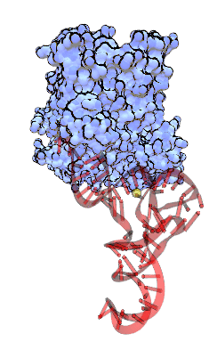

**VMD制作体系旋转和轨迹播放的gif动画的简单方法**A simple way to create gif animations of system rotation and trajectory play using VMD

文/Sobereva@[北京科音](http://www.keinsci.com)    写于约2008年

用这个方法可以做出体系旋转演示的gif图，适合嵌入网页或幻灯片，比压成视频文件更清楚也往往更小，也无须调用videomach之类的，十分方便而且很快。而且可以保存进ppt保证演示时能够播放，不像视频文件嵌入ppt实际上只能作个视频文件的链接，而且很多视频还播放不了。

读者必须用Linux版VMD。且读者需要在Linux下安装ImageMagick，这样才脚本中调用的convert命令才能用。对于CentOS系统，运行yum install ImageMagick即可安装。  
   
   
将以下内容保存为makegif.tcl文件。

```
proc makegif {dir} {
    set frame 0
    for {set i 0} {$i < 360} {incr i 15} {
        set filename snap.[format "%04d" $frame].rgb
        render snapshot $filename
        incr frame
        rotate $dir by 15
    }
    exec convert -delay 10 -loop 4 snap.*.rgb movie.gif
    foreach k [ls snap.*.rgb] { file delete $k}
}
```

  
启动VMD后在tk console运行诸如source /sob/makegif.tcl。然后运行makegif y，这样体系就不断绕着y轴旋转并且截图，自动调用convert命令将图片合成为gif，储存在当前文件夹（即tkconsole输入pwd显示的文件夹)。如果绕x轴旋转就是makegif x，也可以是z。  
  
对于Windows用户，也可以使用以上脚本产生一批图像文件后手动用ffmpeg、atani之类的软件合成gif。  
  
  
实际效果如图：  



  
(是否觉得蛋白部分显示效果有点像分子月刊的图呢？实现方法以后再谈）  
  
如果想减小gif体积，有三种方法  
  
1 缩小3D显示窗口  
  
2 减少帧数，将makegif.tcl里面旋转角度和i变量的增量改大  
  
3 减少颜色，默认是256色，减到16色体积可减小约一半。把makegif.tcl的convert命令后面加上-colors 16即可。但16色有点太狠了，尤其是颜色比较丰富的时候，32色才算勉强。  
  
  
  

### 制作轨迹演示的gif动画

和上面方法用起来类似，脚本内容如下  

```
proc maketragif {start end {step 5} {color 32} {delay 5}} {
for {set fn $start} {$fn < $end} {incr fn $step} {
   set filename snap.[format "%05d" $fn].rgb
   render snapshot $filename
   animate goto $fn
}
exec convert -delay $delay -loop 999 -colors $color snap.*.rgb movie.gif
foreach k [ls snap.*.rgb] { file delete $k}
}
```

  
同样先source一下这个脚本，然后可以用maketragif命令了  
用法: maketragif 起始帧数 结束帧数 [步长] [颜色数] [动画中每帧间隔时间]  
[]内代表非必需的参数  
默认步长为5帧，颜色数32，每帧间隔5。  
例如maketragif 350 650 5 64 10，代表350帧至650帧每5帧截一幅图，连结成gif，64种颜色，动画中每帧间隔为5。轨迹的动画生成在同目录movie.gif  
  
当然也可以只输入maketragif 350 650，步长、颜色数、动画中每帧间隔时间都用默认的。
