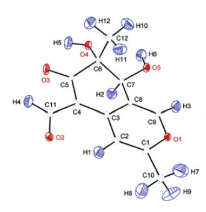
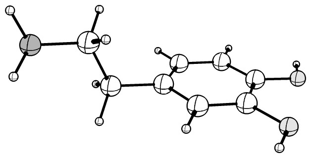
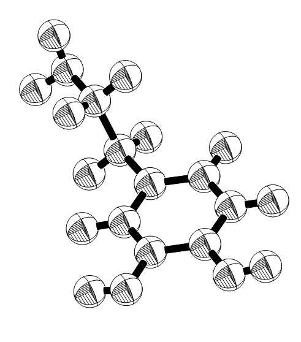
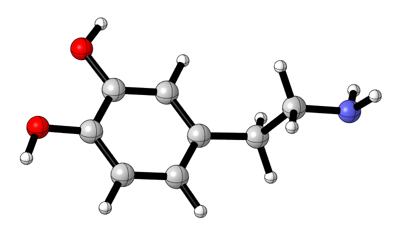
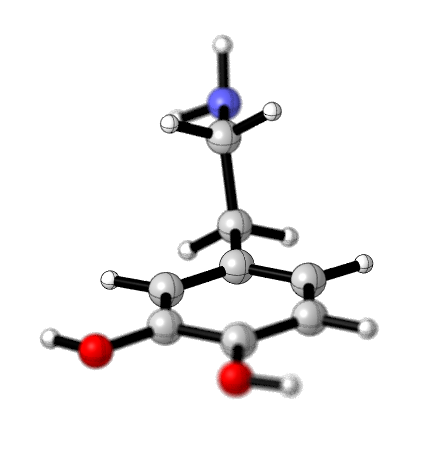
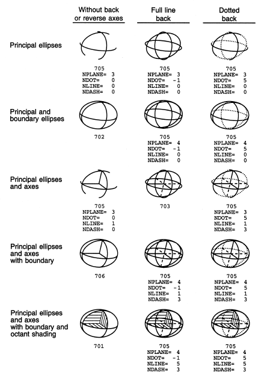
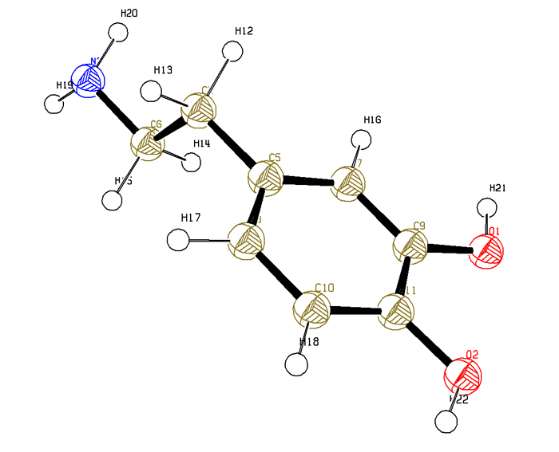

**能绘制原子球上带十字形线的分子结构图的几种软件和用法**  
Several software that can draw molecular structure maps with cross-shaped lines on atomic spheres

文/Sobereva@[北京科音](http://www.keinsci.com/)  2012-Jul-7

## 1 关于椭球图和十字形线

经常看到有人问用什么可视化软件可以让显示的分子结构图上每个原子上有个十字形线。恐怕不少人并不了解为什么文献中很多图上原子球上都有十字形线，且为什么有时原子用椭球而不是圆球来表示，这里有必要先科普一下热椭球图。如果对热椭球图有兴趣，可以参看这个页面的详细介绍：<http://www.students.bucknell.edu/projects/xray/betatest/ThermalParameters/ThermalParameters.html>

上图是典型的热椭球图。原子在晶体中是有热振动的，而热振动往往并不是各向同性的，为了在图上清楚表现原子热振动的各向异性，晶体学中常用这种热椭球图来描述，原子热振动参数（即二阶张量U或B）是在晶体衍射实验中获得的。我们可以简单理解为椭球在某个方向上拉得越长，就表明在这个方向上原子振动的幅度越大，反之越小。如果在三个正交方向（严格来说是U张量的主轴）上振动幅度相同，即各向同性，那么就不是椭球了而是圆球了。椭球的中心就是相应原子的平均位置。椭球的大小设定得有一定任意性，常令椭球包围的空间内发现相应原子的电子的概率为50%。

原子上带个十字线的主要目的是让椭球形状表现得比较清晰精确。而像上图这样将某个瓣的截面上还画上斜杠形纹理，目的只是表现得更清楚一些罢了，并没物理意义。如果在绘制分子结构时启用了光照效果，即椭球向着光部分比较亮，背着光的部分比较暗，那么也足以体现椭球的立体感，就并没必要非得画上十字形线以及斜杠形纹理。然而，光照效果表现椭球形状可能不那么精确，而且在黑白印刷的文献中光照效果会让椭球看起来显得一片灰黑。所以通常文献中还是用十字形线描述椭球形状，而不启用光照效果。

对于不是搞晶体的人，比如一般计算化学工作者，我们在显示分子时不需要表现原子的各向异性，实际上我们也没有实验得到的原子振动各向异性数据，所以原子总是用圆球来表示原子（其实也可以用椭球的形式表现计算出的某些各向异性数据，比如NMR计算给出的原子核磁屏蔽张量）。但是，十字形线却依然有时值得画上，这使原子球即便在没有光照效果的情况下也能显示得比较有立体感，用在文献上比较清楚漂亮。

各种专门的晶体解析软件一般都能够绘制带着十字形线的椭球图。虽然利用它们也能在平时绘制普通分子结构时显示出十字形线，但是对于不搞晶体的人来说往往操作不那么方便（如SHELXL），也大材小用（如Diamond、VESTA等）。本文介绍几种常用，小巧，效果好，能够比较方便地在原子球上显示十字形线的可视化软件。它们都支持主流的分子结构格式，如pdb，也都是Windows版。

## 2 Chemcraft

Chemcraft是基于windows的分子可视化程序，还附带一些计算化学研究中有用的辅助功能。可以在<http://www.chemcraftprog.com>下载，免费试用150天。这里用的是1.6 (build 338)版。

打开分子结构文件后，在主菜单的Display里可以选择各种预置的显示方式。然而预置的显示方式都不会在原子上显示十字形线，但开启也很容易。选择任意一种显示方式，比如这里选择无光照效果很适合用于文献插图的publication 2显示方式后，在display-customize里选这个显示方式然后点edit scheme，将Grid on atoms打钩，点OK即可。图上会有一些锯齿，点击ctrl+Q就会对当前图像进行抗锯齿处理（选择保存、拷贝图像功能时也会自动做抗锯齿处理），效果如下图所示：

## 3 CrystalMaker

CrystalMakers是一款功能强大的晶体结构建模分析软件，用于显示分子结构也没问题。此软件显示效果好，且效果可以充分自定义。网上有破解版可下载，比如<http://www.verycd.com/topics/2843772/>。笔者用的是2.3.1版。

File-import选择相应格式打开分子结构文件，Transform-Molecule to Crystal，点Convert。Edit-Structure，点上Use Displacement Parameters，点OK。Model-Thermal Ellipsoids。Render-Black & White。点右键选Model options，default一行的Ellipsoid球图形上点左键选Hollow Equatorial Octant，点Use Default Style按钮，若想改球的大小可以设右下角的Probability（本例设为35%。以当前方式显示时各种原子球的大小只能是相同的），点Apply。Bonds标签页中Default一行的圆柱图案上点左键选Plain Cylinder，Colour选黑色，点Use Default Style，点Apply。选Model-Hide Unit Cell来隐藏掉晶胞轮廓。此时图像效果如下图所示：

如果只需要把十字形线显示上而不需要显示截面处斜杠形纹理，则步骤更简单，用默认的Ball & Stick显示方式就能实现，而且此时各个原子球的大小是可随意调节的（画面右上角改相应原子的半径）。步骤是：载入结构文件后，Render-Black & White。点右键选Model options，default一行的Sphere球图形上点左键选Hollow Equatorial，点Use Default Style按钮并按Apply按钮。Bonds标签页中Default一行的圆柱图案上点左键选Plain Cylinder，Colour选黑色，点Use Default Style按钮并按Apply按钮。

CrystalMaker中通过不同设定可以组合产生很多效果，请自行摸索。

## 4 CYLview

CYLview是一款小巧的专门绘制高质量分子结构图形的软件，支持一般可视化程序都不具备的景深效果，可以在这里免费下载<http://www.cylview.org>，笔者用的是1.0.561 BETA。这程序需要机子上安装了OpenBabel（免费，<http://openbabel.org/wiki/Main_Page>）才能支持比较丰富的格式，否则连pdb格式都不支持，而只能支持xyz和Gaussian输出文件，这点不方便。

载入分子后，点击窗口下方中央的Preview按钮，程序会在后台调用自带的povray渲染器开始渲染，等会儿就能看到漂亮的效果。如果点击Generate按钮，就会将这样效果以png格式输出到分子结构文件所在目录，如下图所示。CYLview默认的输出效果就已经很好了，一般不需要再改设置。想调节的话，可以点右上角的Style和Custom按钮，在相应界面里调整参数。如果不想要十字形线，就在Style按钮对应的界面里把Quadrants的对勾去掉。

如果想实现景深的效果，就点击Style按钮，在右下方点了set focal point按钮之后再点某个原子，则视角就会聚焦到这个原子上，其它原子会变模糊。模糊的强弱取决于Intensity一栏中选了哪项。如果点show focus scale on screen，就可以看到绿色圈中的原子是当前被聚焦的，原子上红圈越大代表会越模糊。下图是将焦点设在了图中最中间的原子上的显示效果。

## 5 ORTEP(Oak Ridge Thermal Ellipsoid Plot)

ORTEP3 for windows可以从此处免费下载<http://www.chem.gla.ac.uk/~louis/software/ortep3/>，对学术用户license是免费的。做椭球图是此程序专长，可以很灵活地定义十字形线和斜杠纹理的显示方式，可以产生这些效果（详见手册）

在此程序中一打开分子结构默认就对重原子显示十字形线，接下来进行一些调整。Labels-Labelling mode选No label。graphics-set Colours里选Background，点Modify，选White，这使背景变成白色。图上点右键，Set Element Style，对此分子中的各个原子显示方式进行设定。此例将所有重原子的Ellipsoid Type设为Octant Shading，氢原子的设为Sphere。碳设为古铜色，氮设为蓝色，氧设为红色，氢设为黑色。图上点右键，Set Bond Style里修改键的显示方式，此例改成solid bond，黑色。图上点右键，Plot line width设为2。效果如下所示

此程序不能输出jpg、png、tif这样通用的图像格式，比较不方便，而直接截图的话会有明显锯齿，所以建议放大之后截图，在photoshop等软件里缩小来等效地实现抗锯齿效果。如果想要光照效果，就必须输出成povray的输入文件在povray里进行渲染，但感觉ORTEP的这个界面搞得比较乱。

总体来说，ORTEP的界面用起来不如本文提到的其它软件舒服。
