**使用Multiwfn绘制原子轨道图形、研究原子壳层结构及相对论效应的影响**  
Using Multiwfn to draw atomic orbitals, study atomic shell structures and the influence of relativistic effects

文/Sobereva @[北京科音](http://www.keinsci.com/)  2012-Jul-9

## 1 前言

这个帖子主要介绍怎么用Multiwfn程序（<http://sobereva.com/multiwfn>）结合Gaussian绘制各种类型的原子轨道图形，包括角度和径向部分，在绘制过程中能加深一些对原子轨道的理解，如原子轨道间的正交性和钻穿效应。本文绘制轨道并不是像一般教材中通过原子轨道波函数的解析形式来绘制的，解析的方式可以用matlab、mathematica等程序绘制，本文是通过Multiwfn靠Gaussian输出的单原子体系波函数信息绘制的。在绘制过程中可以使没用过Multiwfn的人熟悉Multiwfn的基本绘图操作，对于有一定经验的用户也能学到一些特殊技巧。文中还将利用Multiwfn简要讨论相对论效应对轨道径向分布产生的影响，读者可以同时了解到在Gaussian中使用全电子标量相对论计算的基本方法。最后还将通过绘制各种实空间函数展现原子各个主层特征。本文介绍的方法和作出来的图对于讲授结构化学课程的老师也我想比较有用，很适合向学生们展示一些基本概念。本文用的Multiwfn为2.4版，Gaussian为G09 A02。

实际上，原子轨道只有对于类氢原子体系（一个核+单个电子）才是物理意义严格的，对于多电子原子体系，原子轨道模型只是近似的描述，但还是很合用的。类氢原子轨道波函数是径向部分波函数与角度部分（球谐函数）的乘积。比s角动量更高的原子轨道有的角度部分是复数，复数型原子轨道难以图形表示，用起来也不方便，因此一般都是将复数型原子轨道线性组合成实数型来用（它们将不再是Lz算符的本征函数而没法讨论磁量子数）。本文说的原子轨道都是指实数型原子轨道，教科书上的原子轨道图形也一般是实型的。而本文所谓的真实原子轨道，则是指实数型的类氢原子轨道。

## 2 绘制s,p,d,f,g角动量原子轨道的角度部分图形

这里我们先不考虑径向部分，假定是个任意的常数，这里先来通过绘图将s,p,d,f,g角动量原子轨道的角度部分表现出来。s,p,d角动量的原子轨道图形想必大家已很熟悉，但是f、g的图形可能不少读者还不怎么印象深刻，此节将绘制它们。我们先建立一个Gaussian输入文件，内容如下。使Gaussian运行它后每个“分子轨道”都对应一个原子轨道，这样用一般方法观看分子轨道就等于观看原子轨道了。  
%chk=c:\gtest\atom.chk  
#p hf/gen pop=full guess=(cards,only,save)

Atom

1 1  
H

H 0  
S 1 1.0  
0.1 1.  
P 1 1.0  
0.1 1.  
D 1 1.0  
0.1 1.  
F 1 1.0  
0.1 1.  
G 1 1.0  
0.1 1.  
****

25(f2.0)  
-1  
1.0.0.0.0.0.0.0.0.0.0.0.0.0.0.0.0.0.0.0.0.0.0.0.0.  
0.1.0.0.0.0.0.0.0.0.0.0.0.0.0.0.0.0.0.0.0.0.0.0.0.  
0.0.1.0.0.0.0.0.0.0.0.0.0.0.0.0.0.0.0.0.0.0.0.0.0.  
0.0.0.1.0.0.0.0.0.0.0.0.0.0.0.0.0.0.0.0.0.0.0.0.0.  
0.0.0.0.1.0.0.0.0.0.0.0.0.0.0.0.0.0.0.0.0.0.0.0.0.  
0.0.0.0.0.1.0.0.0.0.0.0.0.0.0.0.0.0.0.0.0.0.0.0.0.  
0.0.0.0.0.0.1.0.0.0.0.0.0.0.0.0.0.0.0.0.0.0.0.0.0.  
0.0.0.0.0.0.0.1.0.0.0.0.0.0.0.0.0.0.0.0.0.0.0.0.0.  
0.0.0.0.0.0.0.0.1.0.0.0.0.0.0.0.0.0.0.0.0.0.0.0.0.  
0.0.0.0.0.0.0.0.0.1.0.0.0.0.0.0.0.0.0.0.0.0.0.0.0.  
0.0.0.0.0.0.0.0.0.0.1.0.0.0.0.0.0.0.0.0.0.0.0.0.0.  
0.0.0.0.0.0.0.0.0.0.0.1.0.0.0.0.0.0.0.0.0.0.0.0.0.  
0.0.0.0.0.0.0.0.0.0.0.0.1.0.0.0.0.0.0.0.0.0.0.0.0.  
0.0.0.0.0.0.0.0.0.0.0.0.0.1.0.0.0.0.0.0.0.0.0.0.0.  
0.0.0.0.0.0.0.0.0.0.0.0.0.0.1.0.0.0.0.0.0.0.0.0.0.  
0.0.0.0.0.0.0.0.0.0.0.0.0.0.0.1.0.0.0.0.0.0.0.0.0.  
0.0.0.0.0.0.0.0.0.0.0.0.0.0.0.0.1.0.0.0.0.0.0.0.0.  
0.0.0.0.0.0.0.0.0.0.0.0.0.0.0.0.0.1.0.0.0.0.0.0.0.  
0.0.0.0.0.0.0.0.0.0.0.0.0.0.0.0.0.0.1.0.0.0.0.0.0.  
0.0.0.0.0.0.0.0.0.0.0.0.0.0.0.0.0.0.0.1.0.0.0.0.0.  
0.0.0.0.0.0.0.0.0.0.0.0.0.0.0.0.0.0.0.0.1.0.0.0.0.  
0.0.0.0.0.0.0.0.0.0.0.0.0.0.0.0.0.0.0.0.0.1.0.0.0.  
0.0.0.0.0.0.0.0.0.0.0.0.0.0.0.0.0.0.0.0.0.0.1.0.0.  
0.0.0.0.0.0.0.0.0.0.0.0.0.0.0.0.0.0.0.0.0.0.0.1.0.  
0.0.0.0.0.0.0.0.0.0.0.0.0.0.0.0.0.0.0.0.0.0.0.0.1.  
0

这个输入文件看起来可能觉得比较古怪，这里进行解释。  
Gaussian用的是高斯函数作为基函数，高斯函数又细分为笛卡尔型高斯函数和球谐型高斯函数，后者的角度部分和真实原子轨道的角度部分是一一对应的，所以我们应当用球谐型高斯函数。对于此例自定义基组的情况，默认就是用球谐型高斯函数，不必手动加5d 7f关键词。对于这个问题的更细致讨论见《谈谈5d、6d型d壳层基函数与它们在Gaussian中的标识》（<http://sobereva.com/51>）和《球谐型与笛卡尔型Gauss函数的转换关系》（<http://sobereva.com/97>）

这个体系电子数为0，即质子体系。通过自定义基组方式，给这个质子加上从s到g角动量基函数各一个，比如  
D 1 1.0  
0.1 1.  
就代表加上指数为0.1（因为我们这一节忽略原子轨道径向部分，所以此值是随意取的）的d壳层的共5个基函数，且每个基函数都只含一个高斯函数。当前体系总基函数数目是1+3+5+7+9=25个。

但是我们并不能在自定义基组后直接就这么计算，否则从pop=full输出的信息会看到“分子轨道”中存在基函数的混合，绘制“分子轨道”图形就不能对应于原子轨道图形了，所以我们必须写上guess=(cards,only,save)并自行设定初猜。其中cards代表自行从输入文件后面读取初猜的分子轨道系数，而不用程序自动给的初猜；only代表不做迭代，否则又会引起基函数的混合；save代表将初猜波函数写入chk文件中（默认对于only任务是不写入）。

25(f2.0)代表自行写的初猜信息是每行25个值（恰好每行代表一个分子轨道的25个基函数的系数，比较清晰易读），而且每个值用fortran语言的f2.0浮点格式（占两个位置，即一位整数和一个小数点符号自身的占位，比如3.1415就会表示成3. ，这样虽然精度极低但对于目前问题最适合，十分紧凑）。后面的-1代表用自己设的初猜替换所有轨道的初猜。接下来就是自己设的初猜轨道系数了，我们要让i号“分子轨道”正好对应i号基函数，因此只有对角线系数为1其余为0。输入文件末尾的一个0代表自定义轨道初猜信息已经写完了。

pop=full其实没有意义，只是这将便于从输出文件中检查每个“分子轨道”的组成，看看是否如预期的每个“分子轨道”只在一个基函数上有值且系数为1，即基函数没有发生混合。

用Gaussian计算这个任务，然后将chk用formchk转换为fch文件，然后启动Multiwfn，输入fch文件的路径，然后选0，通过点击弹出的图形界面右下角的分子轨道标号就可以看相应分子轨道，在此例中即原子轨道的图形了。在点击一个轨道标签后，也可以用键盘的上下键切换，在浏览一批轨道时比用鼠标点更为方便。

建议在启动Multiwfn之前将Multiwfn目录下的settings.ini里的aug3D参数从默认的6调大到10，然后保存，这样可以避免以较小isovalue显示外层原子轨道等值面时在边缘被默认的比较窄的格点数据空间范围所截断。在Multiwfn中观看原子轨道时建议将isovalue从默认的0.05减小到0.03，否则原子轨道的一些特征表现不出来。

这里我们随便选一个轨道，比如15号轨道，从pop=full给出的信息中看到这个轨道对应于F+3，注意这个绝非代表磁量子数为3的f轨道。根据《球谐型与笛卡尔型Gauss函数的转换关系》一文提供的信息，我们知道这个轨道用笛卡尔形高斯函数表示为√(5/8)*XXX-3/√8*XYY，可想而知这个轨道是处在XY平面上的。

下图将f原子轨道和g原子轨道等值面图形汇总：

7个f （10~16号轨道）  
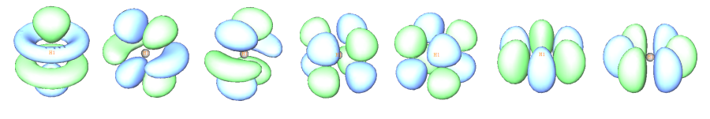

9个g （17~25号轨道）  
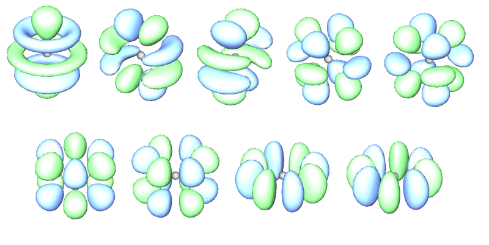

下面我们用Multiwfn作轨道的平面图，这里以第15号分子轨道为例，在Z=0的XY平面上作图最能充分表现它的特征。如果已经打开了Multiwfn，先将它关闭，然后在settings.ini里将idelvirorb值从默认的1设为0，然后保存。默认的1代表在一些可能比较耗时的任务中删掉fch文件中的前10个虚轨道以外的虚轨道以节约计算时间，但是删了虚轨道就达不到本文目的了，所以将此参数改为0并保存，以避免Multiwfn这么做（以后的Multiwfn版本中这个设定有可能还会改变，注意参见手册和此参数在settings.ini里的注释）。启动Multiwfn，依次输入  
o  //直因为之前已经输入过一次当前体系的fch文件的路径了，所以这次直接写字母o就可以打开上一次载入的文件  
4  //作平面图  
4  //要作的函数为轨道波函数值  
15  //作第15号轨道  
1  //填色图  
直接敲回车用默认的格点设定200,200  
0  //设定作图延展距离，默认的延展距离对于此例偏小，会看到轨道外部被截断  
8  //设延展距离为8 Bohr  
1  //作XY平面  
0  //Z=0  
图像立刻弹出来，但是基本是绿色，看不出什么特征，这是因为默认的色彩刻度范围太大，不适合当前情况。遂在图上点击右键关闭之，选1，输入-0.09,0.09修改彩刻度上下限。如果想让图像上同时出现等值线，可以再选选项2。最后选-1重新作图，得到下图（关闭图像后选0可以将图保存为当前目录下的文件名以DISLIN开头图形文件）

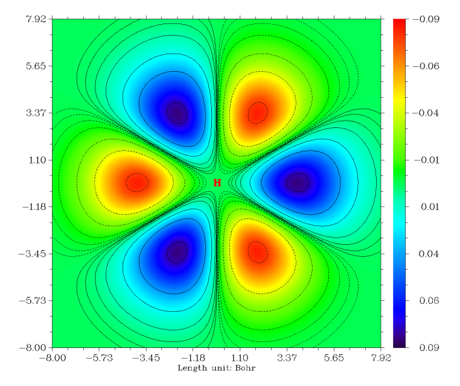

我们接下来绘制这条轨道的电子密度的地形图+投影图。虽然目前它是空轨道（其它轨道也都是空着的），但是我们可以通过修改波函数信息来设它为双占据。选-5从刚才的后处理界面退回到主界面，依次输入  
6  //修改波函数  
26  //设定轨道占据数  
15  //选15号轨道  
2  //占据数设为2（双占据轨道）  
q  //退回  
-1  //退到主菜单。由于其它轨道都是空轨道，目前只有15号轨道有电子占据，因此照常作密度图时，就等于只作15号轨道的密度图了  
4  //作平面图  
1  //电子密度  
5  //地形图+投影图  
直接敲回车用默认格点设定100,100  
1  //XY平面（由于之前已经调整了延展距离，所以这次不用再设一遍）  
0  //Z=0  
图上几乎一片空白，显然默认设定不适合当前体系，所以我们还要调整。在Multiwfn目前版本绘制地形图时，地形图的Z轴范围不允许改变。明显是因为当前的Z轴范围过大（-4到3），而仅这一条轨道的密度太小，所以图上基本是个平面而看不出什么。从命令行窗口中看到这个平面上数据最大值仅为0.01439，因此可以将这个平面上的数据值扩大100倍，在目前的Z刻度范围下就能明显看出不同位置的差异了。点Return关闭图形窗口，选-7，然后输入100，就将这个平面数据乘上了100（可以反复这样操作乘多次，直到效果满意位置），然后选-1重新作图，虽然可以看到地形图比较合适了，但是投影图的刻度范围不很合适，有很大部分是白色，即超过了色彩刻度的上限，因此我们关闭窗口，选1然后输入0,1.5修改投影图的刻度，之后再选-1重新作图，效果就很令人满意了，此轨道上电子密度大的区域就像橘子瓣一样：

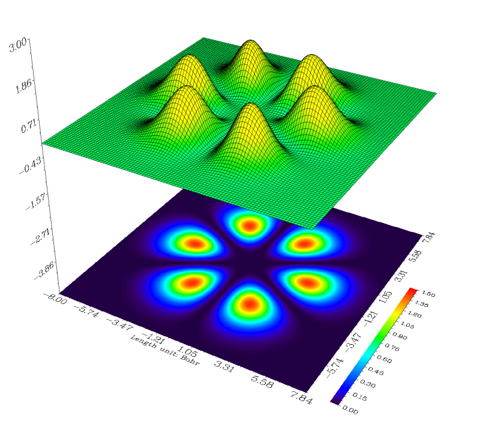

虽然wfn文件也是最常用来作为Multiwfn波函数输入文件的格式，但是对上文的情况不能用wfn而必须用fch。因为wfn文件的标准格式不允许记录空轨道，而且最高角动量只支持到f，在带有g角动量基函数的情况下若试图让Gaussian输出wfn文件就会报错。

用上文的方法原则上也可以看比g更高角动量的原子轨道图形，但Multiwfn目前版本最高角动量只支持到g，想看更高角动量的话可以用gview，但用起来就没Multiwfn方便了。

## 3 绘制原子轨道径向部分图形

虽然Gaussian程序用的高斯函数的径向行为和真实原子轨道的径向部分差异很大（尤其是高斯函数在核中心处没有所谓的cusp，随径向距离衰减得也过快），但是只要基组比较大，通过变分过程，最终大量高斯函数的线性组合是可以基本正确表现出原子轨道的径向行为的。

当出现多个角量子数相同的原子轨道壳层时，为了满足波函数的正交性，径向波函数会出现波节。对于相同角动量的原子轨道，主量子数越大的波节越多。通过解析推导的类氢原子轨道径向部分公式可知，波节数=主量子数-角量子数-1，例如4s就会有4-0-1=3个波节。上一节的例子，在自定义基组时每种角动量都只有一个壳层，因此径向部分看不到波节，而本例我们不用虚构的体系，而研究Kr的原子轨道。Gaussian的输入文件如下。虽然第四周期已经有一定的相对论效应了，但这里暂不考虑。为了研究各层轨道，不能用赝势而需要用全电子基组，流行的def2-TZVP的全电子基组版本恰好最大能支持到Kr（从Rb开始def2-TZVP就只有赝势基组版本了）。由于Gaussian没内置def2-TZVP，所以要去BSE网站（<https://www.basissetexchange.org>）上拷贝下来。  
%chk=c:\gtest\Kr.chk  
#p b3lyp/gen pop=full

Kr at B3lyp/def2-TZVP

0 1  
kr

Kr     0   
S   8   1.00  
 600250.9757500              0.23740610399E-03        
  89976.6507810              0.18410240539E-02        
  20476.8142250              0.95795580699E-02        
   5796.1554078              0.39020650488E-01        
   1887.5913196              0.12772645628      
    679.11458519             0.30596521300      
    264.38244511             0.44857474437      
    104.88368574             0.24722957327      
S   4   1.00  
    641.47370764            -0.26745279805E-01        
    199.57524820            -0.12571122567      
     33.545462954            0.56483736390      
     14.683955144            0.55972765539      
S   2   1.00  
     22.603101860           -0.25298771800      
      4.0650682991           0.70992159965      
S   1   1.00  
      1.9611027060           1.0000000          
S   1   1.00  
      0.52465147979          1.0000000          
S   1   1.00  
      0.19332399511          1.0000000          
P   6   1.00  
   3232.9589614              0.24885607974E-02        
    765.96442694             0.20379007428E-01        
    246.33940810             0.96977188584E-01        
     92.365283041            0.28199960954      
     37.199509551            0.45116254358      
     15.172166534            0.24917131496      
P   4   1.00  
     60.931321698           -0.22173603519E-01        
      9.4792600646           0.32838462778      
      4.2564686326           0.58124997120      
      1.9729313762           0.32863541783      
P   1   1.00  
      0.76337108716          1.0000000          
P   1   1.00  
      0.30943625526          1.0000000          
P   1   1.00  
      0.11569704458          1.0000000          
D   5   1.00  
    186.41760904             0.86120284601E-02        
     55.274124345            0.60394406304E-01        
     20.283219120            0.21181331869      
      8.0884536976           0.40366293413      
      3.2214033853           0.42402860686      
D   1   1.00  
      1.1952170102           1.0000000          
D   1   1.00  
      0.6480000              1.0000000          
D   1   1.00  
      0.2510000              1.0000000          
F   1   1.00  
      0.6280000              1.0000000       
****

由于s原子轨道是球对称的，研究它不需要考虑角度部分，所以为了方便这里主要研究各层s轨道。上面这个输入文件算完后，通过观看轨道图形可知fch文件中1、2、6、15号“分子轨道”就分别对应于1s、2s、3s、4s原子轨道。

我们先绘制4s原子轨道波函数的径向部分。启动Multiwfn，载入Kr.fch后，依次输入  
3  //绘制曲线图  
4  //绘制的是轨道波函数  
15  //15号轨道，即4s  
2  //自行输入空间中两个点作为曲线图的两个端点位置  
0,0,0,4,0,0  //第一个点的xyz坐标为0,0,0，即原子核处。第二个点为4,0,0，因此也就是绘制r=0~4 Bohr径向范围的4s原子轨道波函数值。图像立刻蹦出来，如下所示

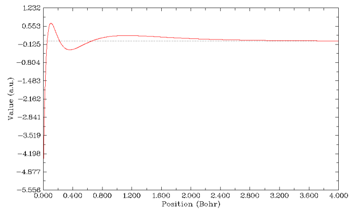

我们看到，曲线与y=0的横线有三处交点，也就是三个波节。关闭图像后，选7，输入0，程序就会找出与y=0的交点（波节位置），位置是径向距离为0.05480 Bohr、0.22239 Bohr、0.65715 Bohr处。

选2，可以将曲线的数据导出到当前目录下line.txt文件中。此文件有5列，前三列是数据点的x,y,z坐标，第四列是当前点距离自行输入的第一个点（即0,0,0）的距离，第5列是函数值。注意此文件中的长度单位都是埃，而不是Multiwfn程序内部用的Bohr。将这个文件导入到第三方绘图程序，比如sigmaplot、origin当中，就可以直接用它们作图，它们提供了比Multiwfn内部绘图功能更丰富的选项。绘图时就将line.txt的第四列和第五列作为曲线图的X、Y坐标就行了。由于settings.ini文件中num1Dpoints参数在目前版本中默认是3000，所以Multiwfn在绘制曲线图时会计算3000个点（这个精度一般足够了），均匀分布在自己设的两个空间坐标之间，也因此导出的line.txt包含了这3000个点的数据。

把line.txt改名为4s.txt。然后使用完全相同的方法，在Multiwfn里把1s、2s、3s的原子轨道在径向的变化都计算并导出，并且分别重命名为1s.txt、2s.txt和3s.txt。把总共四个.txt一起放到Origin里作曲线图，结果如下所示：

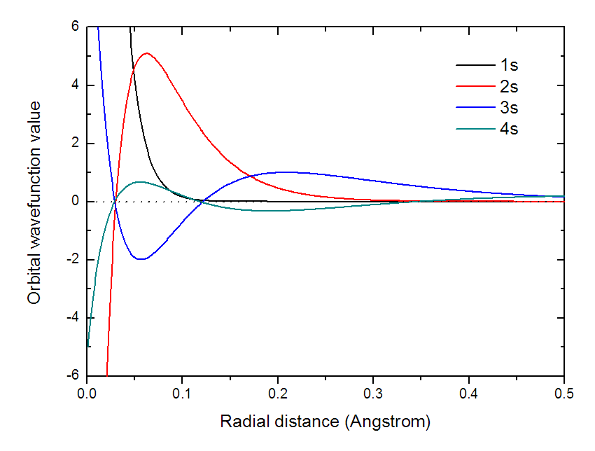

可见主量子数越大，波节越多。每个s轨道间都有波函数值符号相同和相反的部分，因此乘积在不同位置有正有负，这是这些s轨道间彼此正交，重叠积分都为0的根本原因。

更进一步，我们讨论一下这些s原子轨道在径向上电子密度的分布。根据Born概率解释，i轨道的电子密度函数ρ_i就是其波函数的模的平方，即|ψ_i|^2。由于s轨道是球对称的，因此4π*r^2*ρ_i这个函数表现的就是以核为中心半径为r的无限薄球层内的i轨道的电子数，这也叫做电子的径向分布函数。对这个函数从0积分到无穷远就是i轨道上的电子占据数。

4π*r^2*ρ_i这个函数并没有正式地出现在Multiwfn支持的实空间函数列表里，因为它对于研究分子体系没什么用。想绘制它，一种方法是将line.txt导入进origin这样的程序，在空白的列上做简单的函数运算。笔者用的是Origin8，将前面计算4s轨道波函数输出的line.txt文件直接拖进origin窗口之后，D列就是径向距离（埃），E列就是相应处轨道波函数值。新建一列（F列），令这列数值的表达式为4*3.1415926*Col(D)^2*2*Col(E)^2/0.5291772^3。这里除以0.5291772^3是为了将原子单位的密度值e/Bohr^3变为e/Angstrom^3，因为我们将要做积分，必须和径向坐标的长度单位对应；而Col(E)^2前面的乘的2是因为这个轨道是双占据。令D列对F列作曲线图，就会看到图上有四个峰和三个低谷，展现了4s轨道的波节特征。选Analysis-Mathematics-Integrate-Open Dialogue，将D列和F列作为Input的X和Y，点OK，会出现一个新窗口，从中可见area = 1.9960884487804，十分接近此轨道期望的电子占据数2，

另一种绘制4π*r^2*ρ_i的方法是利用Multiwfn的自定义函数(user function)功能。这需要修改源代码，其实十分简单。打开Multiwfn的源代码文件function.f90，搜索tion userfunc找到这个函数的代码位置，在里面写上userfunc=4*pi*fdens(x,y,z)*(x*x+y*y+z*z)，其中fdens是计算总电子密度的函数（按照前一节的做法，在Multiwfn里先将i轨道以外的轨道占据数设为0，那么之后fdens算的就是i轨道的密度了）。改过之后重新编译Multiwfn，之后每当在Multiwfn里选择实空间函数时选择User defined function，就代表选择了自己编写的这个函数了。实际上，为了绘制4π*r^2*ρ_i我们不必改代码重新编译，因为如果你用的是2.4版Multiwfn，从userfunc这个函数的代码中会恰好发现一行if (iuserfunc==6) userfunc=4*pi*fdens(x,y,z)*(x*x+y*y+z*z)，这本来是作为启发用户编写自定义函数的示例代码，而我们现在可以直接在Multiwfn中用它，也就是把settings.ini里的iuserfunc设为6，那么User defined function对应的就是4π*r^2*ρ函数。注意在以后的版本中不一定4π*r^2*ρ还对应于iuserfunc=6的情况，毕竟这不是Multiwfn中的正式支持的函数，用户应自行看看相应Multiwfn版本的userfunc函数的代码。

归纳一下，为了绘制4s轨道的电子径向分布函数，最简单的方法是先把settings.ini里的iuserfunc设为6，保存。然后启动Multiwfn，输入Kr.fch的路径，然后依次输入  
6  //修改波函数  
26  //修改轨道占据数  
0  //选择所有轨道  
0  //所有轨道占据数设为0  
15  //选择15号轨道(4s)  
2  //15号轨道占据数设为2  
q  //返回  
-1  //退回到主菜单  
3  //绘制曲线图  
100  //用户自定义函数  
2  //自行输入两个点的坐标定义作图空间范围  
0,0,0,4,0,0  //两个点的坐标

立刻得到如下图像

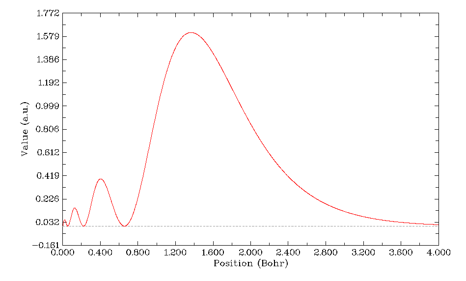

可见4s轨道的电子径向分布函数的主峰在r=1.4 Bohr附近，也就是说这个轨道的电子大部分几率都处在这个位置附近的球层内。虽然从前面作的4s轨道径向波函数图可以看到4s轨道在原子核附近的波函数的模平方（电子密度）比在其它径向区域都大得多，但是由于原子核附近r小，因此4π*r^2项比较小，故4s的电子在离核较近的区域的平均数目其实很小。但是比主峰离核更近的那3个峰对应的球层内的平均电子数毕竟还是不可忽略的，由于电子在这个区域离核近因此受到的核吸引势更强，导致了4s轨道的能量降低，这就是结构化学书里所谓的钻穿效应。对于主量子数同为4但角量子数越高的原子轨道，由于波节数越少，电子径向分布函数离核近的小峰也就越少，因此钻穿效应越弱，能量比4s越高。

控制台上会输出积分值Integration value:    0.19960963D+01，很接近2，这和前面用origin积分出来的轨道的电子数结果1.9960884487804十分相符。Multiwfn内部用的是梯形法积分曲线面积。

## 4 相对论效应对径向分布函数的影响

本例通过绘制Hg的电子径向分布函数，展现相对论效应对原子轨道的影响。对于第四周期（K到Kr这一行）的原子相对论效应虽然重要但并不是必须考虑的，而对第五周期及更重的原子，相对论效应就不能忽略，Hg就是典型。下面是本例的Gaussian输入文件。  
%chk=c:\gtest\Hg.chk  
#p b3lyp/gen int=dkh2 IOP(3/93=1)

Hg at B3lyp/SARC int=dkh2 IOP(3/93=1)

0 1  
Hg

!from JCTC, 4, 908  
Hg 0  
  s 6 1.0  
   1778058.5043390000      0.1096336834  
   790248.2241510000     -0.0573465500  
   351221.4329560000      0.2087189001  
   156098.4146470000      0.0637773176  
   69377.0731760000      0.3818268624  
   30834.2547450000      0.4512486959  
  s 1 1.0  
   13704.1132200000      1.0000000000  
  s 1 1.0  
   6090.7169870000      1.0000000000  
  s 1 1.0  
   2706.9853270000      1.0000000000  
  s 1 1.0  
   1203.1045900000      1.0000000000  
  s 1 1.0  
   534.7131510000      1.0000000000  
  s 1 1.0  
   237.6502890000      1.0000000000  
  s 1 1.0  
   105.6223510000      1.0000000000  
  s 1 1.0  
    46.9432670000      1.0000000000  
  s 1 1.0  
    20.8636740000      1.0000000000  
  s 1 1.0  
     9.2727440000      1.0000000000  
  s 1 1.0  
     4.1212200000      1.0000000000  
  s 1 1.0  
     1.8316530000      1.0000000000  
  s 1 1.0  
     0.8140680000      1.0000000000  
  s 1 1.0  
     0.3618080000      1.0000000000  
  s 1 1.0  
     0.1608040000      1.0000000000  
  s 1 1.0  
     0.0714680000      1.0000000000  
  p 5 1.0  
   24956.6090260000      0.0179823881  
   9982.6436100000      0.0188261927  
   3993.0574440000      0.0932014721  
   1597.2229780000      0.2560497643  
   638.8891910000      0.7278258904  
  p 1 1.0  
   255.5556760000      1.0000000000  
  p 1 1.0  
   102.2222710000      1.0000000000  
  p 1 1.0  
    40.8889080000      1.0000000000  
  p 1 1.0  
    16.3555630000      1.0000000000  
  p 1 1.0  
     6.5422250000      1.0000000000  
  p 1 1.0  
     2.6168900000      1.0000000000  
  p 1 1.0  
     1.0467560000      1.0000000000  
  p 1 1.0  
     0.4187020000      1.0000000000  
  p 1 1.0  
     0.1674810000      1.0000000000  
  p 1 1.0  
     0.0669920000      1.0000000000  
  d 4 1.0  
   1928.0943100000      0.0085722969  
   701.1252040000      0.0450687967  
   254.9546200000      0.2462324063  
   92.7107710000      0.8046951098  
  d 1 1.0  
    33.7130080000      1.0000000000  
  d 1 1.0  
    12.2592750000      1.0000000000  
  d 1 1.0  
     4.4579180000      1.0000000000  
  d 1 1.0  
     1.6210610000      1.0000000000  
  d 1 1.0  
     0.5894770000      1.0000000000  
  d 1 1.0  
     0.2143550000      1.0000000000  
  d 1 1.0  
     0.0779470000      1.0000000000  
  f 4 1.0  
   96.6910160000      0.0585925893  
   32.2303390000      0.2859731314  
   10.7434460000      0.5719543263  
   3.5811490000      0.3784947224  
  f 1 1.0  
     1.1937160000      1.0000000000  
  f 1 1.0  
     0.3979050000      1.0000000000  
  g 1 1.0  
     1.2895000000      1.0000000000  
****

此例的标量相对论效应通过DKH2 (Douglas-Kroll-Hess 2nd order)计算表现，IOP(3/93=1)是将Gaussian在相对论计算中默认的有限大小核模型改为多数量化程序用的点核电荷模型（大多数全电子相对论基组一般也都是针对点核电荷模型所提出的）。此例用的是SARC全电子基组专门适合DFT结合DKH、ZORA标量相对论计算，基组尺寸不很大且效果好，所以计算很容易。由于Gaussian没内置它，BSE上也没有，所以需要自行下载原文JCTC, 4, 908的补充材料，适当修改基组定义的格式然后用自定义基组的方式在Gaussian中使用。下面所说的不考虑相对论效应就是指将int=dkh2关键词去掉后的计算结果。

用Gaussian计算此输入文件后，通过观看轨道，会发现不考虑相对论效应时1s,2s,3s,4s,5s对应的轨道编号分别为1,2,6,15,31,40。考虑相对论时由于发生了不同角动量轨道的相对能量变化，1s,2s,3s,4s,5s会分别对应1,2,6,15,24,40号轨道。（轨道总是按照能量从低到高编号）

相对论效应会使得1s轨道电子质量加大，减小其轨道尺寸，核电荷越大效应越明显。由于外层的s轨道要与内层的s轨道满足正交性，因此尺寸也会收缩。我们这里将绘制2s和3s原子轨道的电子径向分布函数，看看考虑相对论后其分布是否确实收缩了。

先作不考虑相对论的2s轨道图。我们按照与上一节同样的做法，将所有轨道占据数都先设为0，然后把第2号轨道（2s）占据数设为2。回到主菜单后用主功能3作自定义函数的曲线图（需确认iuserfunc参数目前仍设为了6，这时自定义函数才是电子径向分布函数）。但是这回两个端点设为0,0,0和0.6,0,0，因为2s和3s主要分布区域不太广，径向距离绘制0~0.6 Bohr就够了。作完图后，还是将曲线数据导出到line.txt，并改名为2s-nonrel.txt。然后，我们在相同的菜单内选择选项6来寻找这个曲线上的极值点位置，这样便于定量比较，settings.ini中num1Dpoints数值越大，算的点数越多，极值点的位置定位得越精确。程序会找出2个极大和2个极小点，我们只把函数极大值点的位置记录下来。（如果作图范围比较大，比如径向距离作到最大4 Bohr，会导致找出更多的极值点，但它们的函数值都非常小而不必考虑，这是由于与外侧其它轨道相互作用而产生大量波节引起的）

接下来再把不考虑相对论的3s轨道，和考虑相对论时的2s、3s轨道的电子径向分布函数图都绘制出来然后导出到文本文件中，并且把极大值位置找出来并记录。

我们把极大点位置汇总一下进行比较，第一列是径向位置（Bohr）  
不考虑相对论的2s原子轨道：  
0.009400  Value:    0.74260372D+01  
0.068600  Value:    0.28417400D+02  
不考虑相对论的3s原子轨道：  
0.009200  Value:    0.16238938D+01  
0.055400  Value:    0.44666662D+01  
0.186000  Value:    0.13213276D+02

考虑相对论的2s原子轨道：  
0.006400  Value:    0.11038074D+02  
0.059000  Value:    0.30805834D+02  
考虑相对论的3s原子轨道：  
0.006200  Value:    0.24480813D+01  
0.047000  Value:    0.49772027D+01  
0.167200  Value:    0.14286290D+02  
很明显地看出，考虑了相对论后径向分布函数每个峰极大点的径向位置都变小了，表明轨道收缩了，和预期的一致。我们把已导出的4个文本文件中的径向分布函数数据一起放在Origin里作图来图形化地比较，如下所示

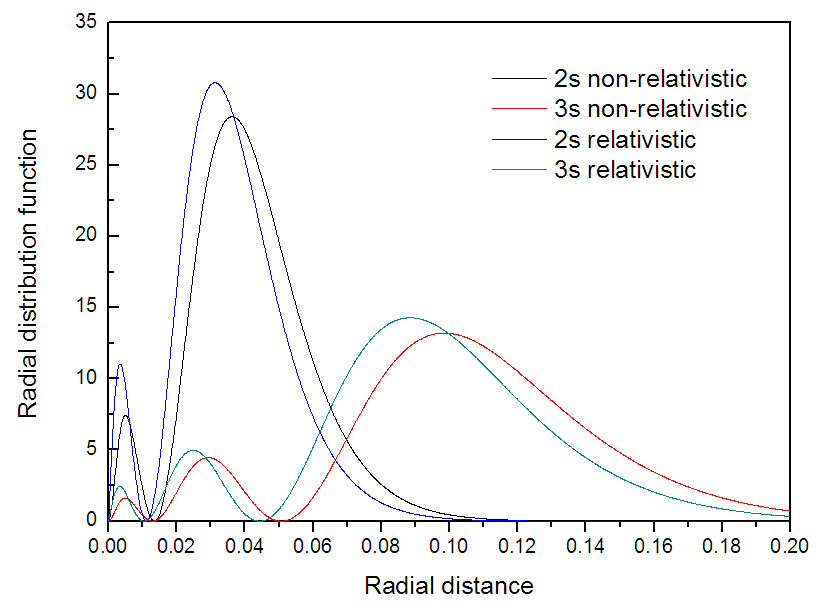

从图上看非常明显，相对论效应导致原子轨道电子径向分布函数分布的收缩。

## 5 研究原子壳层结构

前面讨论的都是单独的原子轨道，本例我们更进一步，以Kr原子为例，介绍一下如何用Multiwfn描绘原子主壳层结构，即常说的K、L、M、N壳层。Kr的fch文件还是用上文的那个。

ELF（Electron localization function）专门用来展现电子高定域性区域，也可以展现原子壳层结构，因为每个壳层空间内电子的定域性相对较强，换句话说，每个壳层里的电子与壳层外的电子的交换的几率较低。还是按照前几节的方法绘制径向图，选择函数的时候选9，即ELF，绘制范围为r=0~4 Bohr。结果如下所示。总共出现了四个峰，对应于Kr的K、L、M、N四个壳层。利用前面已经用过的Multiwfn的搜索曲线极大极小点功能，可以定量地给出每个壳层的径向位置。

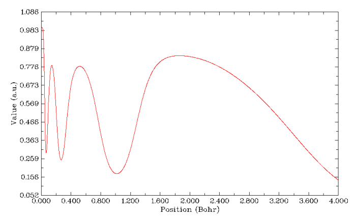

LOL（Localized orbital locator）与ELF在物理意义和实际功能上都很类似，因此结果很类似。在绘制径向图过程中选第10号实空间函数就可以绘制出来，如下所示

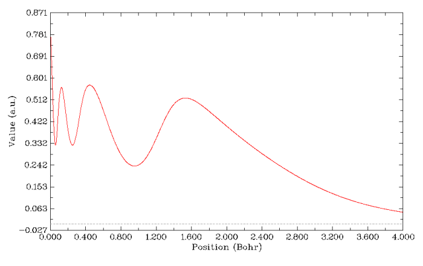

电子密度的拉普拉斯函数也曾是常用于展现原子壳层结构的函数。因为在每个壳层范围内电子是相对聚集的，所以电子密度拉普拉斯为负值的区域就是各原子壳层范围。在绘制径向图过程中选择实空间函数时选10就可以绘制出来。但是由于此函数范围太大，默认的曲线图Y轴上下限范围也太大，看不出应有的壳层结构特征，因此应当关闭弹出来的图像，选3，输入一个稍微合适的Y轴范围，如-5,5，得到下面的图。拉普拉斯值图看起来略费劲，因为每个峰函数值大小差得非常多，没法用一个刻度轴完整表现，所我在图上标注了一下。可以看到N壳层的负值已经很不明显了，实际上拉普拉斯函数辨别壳层的能力也就如此了。有文献表明对于原子序数大于40的原子，拉普拉斯函数就没法再辨别出原子壳层了。

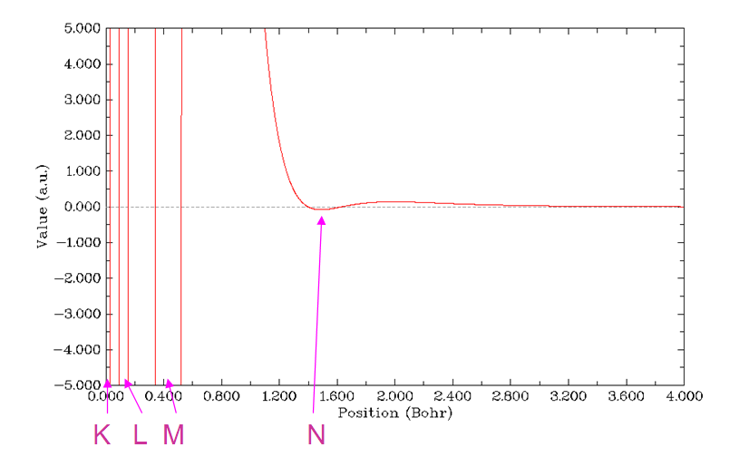

电子径向分布函数也能表现原子壳层结构，这也是结构化学教科书上讲原子结构时常出现的图。怎么作电子径向分布函数图在前文已经详细介绍了，这次作图也是用同样的方法，但不必再事先修改轨道占据数了，直接作图得到的就是整个原子的电子径向分布函数图，如下所示。这个图上清楚地显示了K、L、M壳层电子对应的三个峰，但是N壳层就完全显示不出来了，这据说和轨道的钻穿效应有关。这表明电子径向分布函数只能比较好地研究前三周期的原子结构。

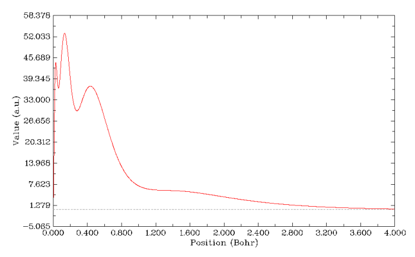

平均局部离子化能可以间接地反应出原子壳层结构，这个函数可能大家不熟悉，我以后会再专门详谈，读者若感兴趣可参见J.Mol.Model,16,1731和Theoretical Aspects of Chemical Reactivity一书的第8章的综述。还是绘制径向图形，选择实空间函数时选择18，就得到了平均局部离子化能随径向距离的变化。默认的线性刻度轴对表现这个函数不太好，因此图像弹出来后先关掉它，选8改用对数刻度轴，输入-1,3（即10^-1到10^3区间），再选-1重新绘图，结果如下。曲线的每个平台代表一个壳层，而平台之间的拐点代表壳层间的分界位置。这个图有四个台阶，三个拐点，因此Kr的四个壳层都被表现出来了。

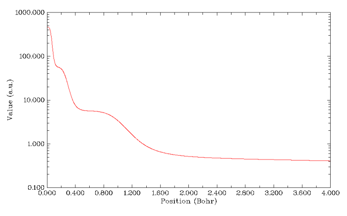

本文展示的最后一个有辨别原子壳层能力的函数是V(r)/ρ(r)，其中V(r)代表静电势。对于中性原子，V(r)和ρ(r)都是单调下降的函数。它们相除时，由于每个壳层内电子比较富集，ρ(r)在壳层范围内会体现一定主导性，因此在壳层处这个函数曲线会产生凹陷，由此可以展现壳层结构。而每个凹陷中间夹着的峰自然就可以用来分辨相邻的壳层，研究表明峰的位置和电子径向分布函数极小点位置是有对应关系的。V(r)/ρ(r)也被称为平均局部静电势，这个函数不是Multiwfn正式支持的函数，绘制它可以用Multiwfn先把静电势和电子密度随径向距离的变化分别计算并导出，一起读入origin这类程序里手动相除并绘图；另一个办法就是像第3节讨论的那样修改userfunc函数的代码，写上userfunc=totesp(x,y,z)/fdens(x,y,z)，重新编译Multiwfn，到时候作图时选用户自定义的函数即可。实际上，这个函数也是像4π*r^2*ρ函数一样作为用户编写userfunc函数的示例代码出现了，看代码就会理解，只需要将settings.ini里的iuserfunc改成8，则用户自定义函数就直接成了V(r)/ρ(r)了，而无需自己改代码再编译。作这个函数随径向距离变化的图，结果如下所示。从图可见Kr的K、L、M、N壳层都可以辨别出来。注意在原子核中央处有一个很小的峰，图的最右边平缓下降也算一个“凹陷”。

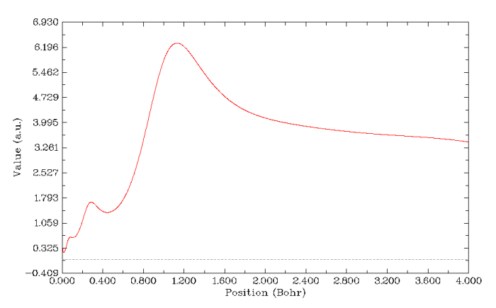

目前鲜有文章研究Rn这么重原子的壳层结构，辨别这样的原子所有的壳层（K,L,M,N,O,P）是对上述函数更严峻的考验，这里做一个简单的测试，由于电子密度拉普拉斯函数和电子径向分布函数在Kr上已经败下阵来，M和N已经很难分辨开，这里就不再考虑。

支持到Rn这么重的元素的全电子基组可选余地相对有限，虽然也有不少五花八门的不出名的全电子基组可用，但获取不便，修改成Gaussian能认的格式也有点麻烦。用Gaussian自带的UGBS基组总是出现积分精度测试通不过的问题，虽然SCF=novaracc、int=ultra、guess=indo等选项有时能解决，但往往最终还得被迫靠int=noxctest来强行绕过精度测试，但结果多少让人心有余悸。知名的ANO-RCC基组很适合后HF方法计算，但基组过大算起来很慢。前面提到的SARC系列基组又便宜又好但目前不支持主族元素。本节并不打算考虑相对论效应，因为这对此节研究的问题本质没太大影响，所以这里使用周期表涵盖全面，专为HF非相对论计算优化的WTBS基组，它是极小基，算起来相对较快，基组定义从BSE网站上就能得到，输入文件就不再列出了，route section部分就是#P HF/Gen。

先做ELF的图。为了图像看起来更清楚，这回不是从核中心作图，而是横跨Rn原子，线段两端位置为-5,0,0和5,0,0。如下图所示。图上总共有11个峰（注意辨别K壳层在中心的一个峰和L壳层在两侧对称的峰，它们挨得很近），Rn的6个壳层都完美地展现出来，说明ELF对于展现原子壳层结构是最佳选择。LOL也能得到很类似的图。

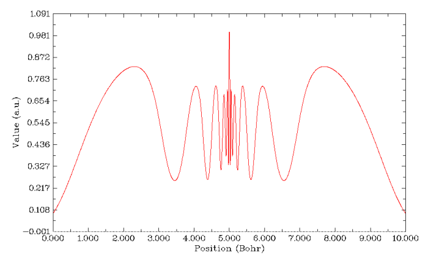

绘制平均局部离子化能随径向距离的变化，也能看到6个平台，以及分离它们的5个拐点，因此这个函数对于解释Rn的壳层结构也适用。但是看起来明显不如ELF图清楚容易辨别。

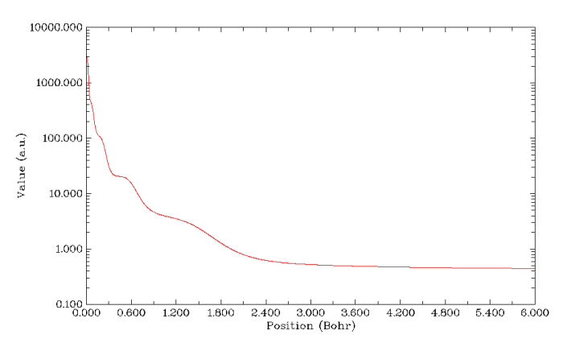

再来绘制V(r)/ρ(r)的图。因为此体系高斯函数较多（是前面Kr体系的6倍），计算静电势又很耗时，所以得多等一会儿，普通的四核机子上要花好几分钟。如果想省时的话就把settings.ini里的num1Dpoints改小几倍来减少计算的点数，其实有500个点一般也足够精细了。结果如下所示，也能看到对应K,L,M,N,O,P这6个主层的6个凹陷（图中最右侧算一个。注意在核中心有个极微小的峰），说明此函数对辨别原子壳层结构的能力还是可以的。不过还是不如ELF图分析起来方便，而且计算慢几个数量级。

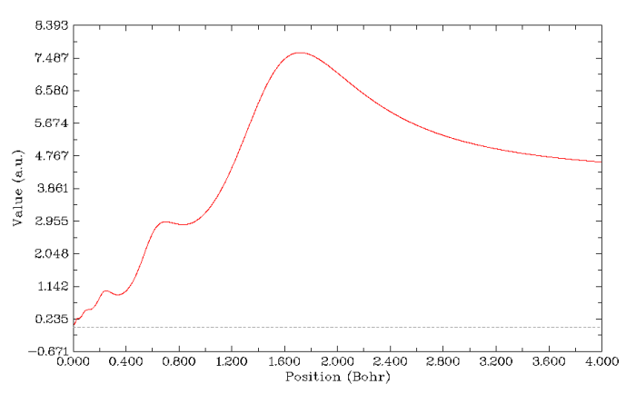

## 6 总结

本文利用Multiwfn结合Gaussian绘制了原子轨道的角度和径向部分图形、展现了轨道间的正交和钻穿效应、分析了相对论效应的影响，最后还用不同方式描绘了原子的壳层结构。结果既很好地还原了教科书上关于原子结构的经典概念，又体现了量子化学计算的意义。本文只是Multiwfn全部功能的一小部分的应用实例，但读者应该已经感受到Multiwfn操作简单，功能强大，而且灵活自由。Multiwfn的各种各样的应用实例都已在手册第四章给出，在Multiwfn的主页上的other resources一栏里面也有寡人写的一系列中文的Multiwfn专题应用的帖子，比如分析多中心键、分析弱相互作用、做密度差图等等，通过这些文章不仅能进一步了解Multiwfn的应用，还能同时了解到很多波函数分析方法的原理。
