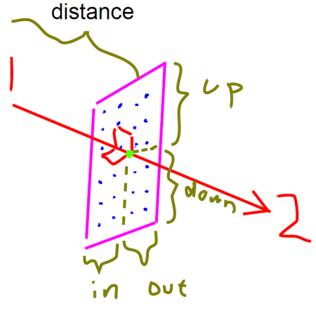
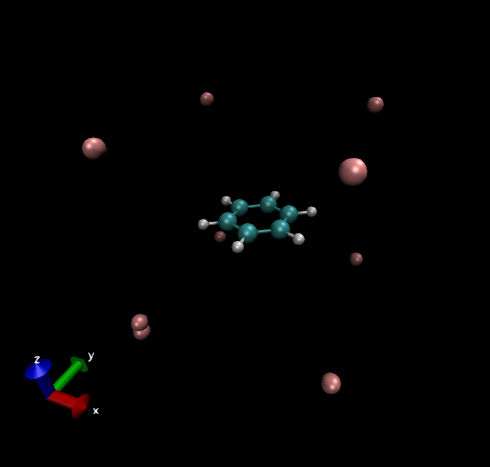
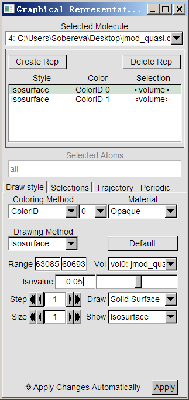
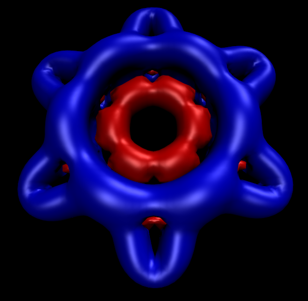
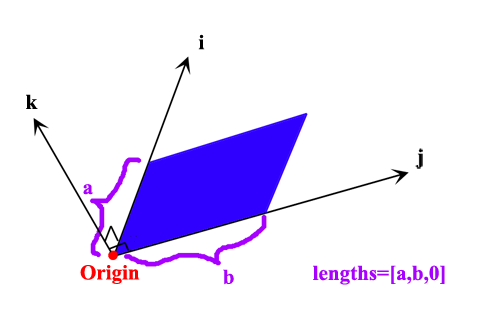
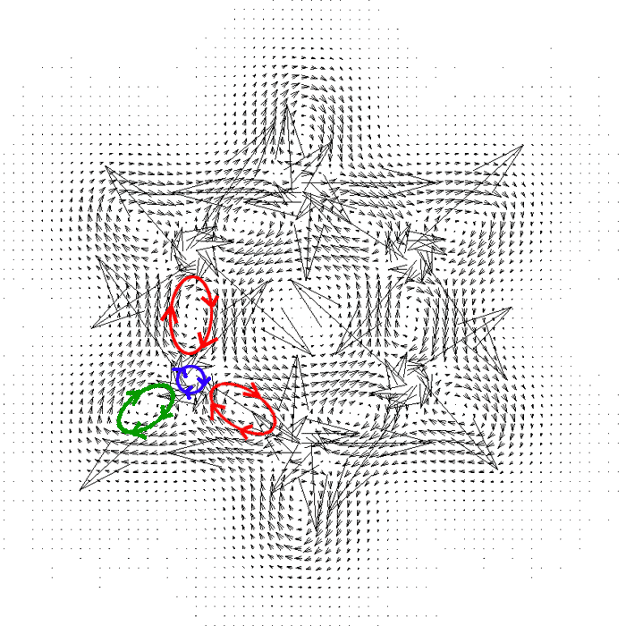
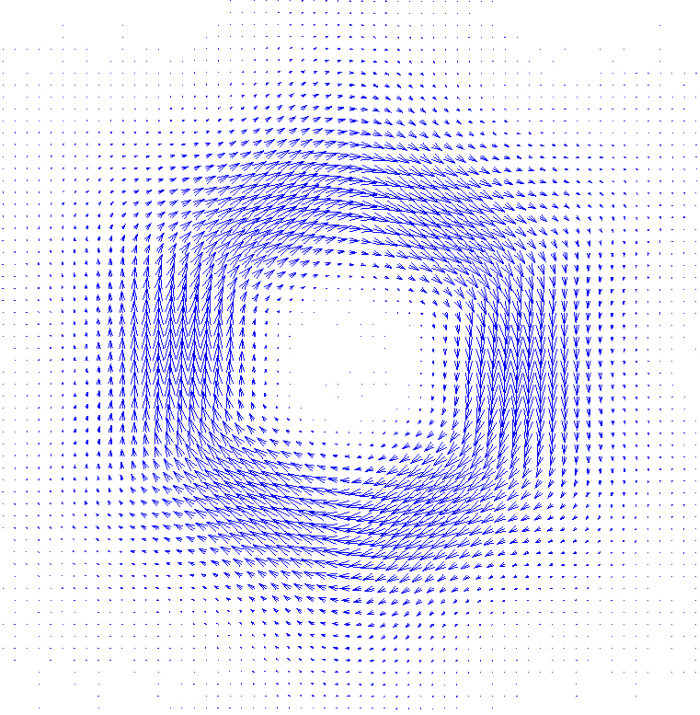
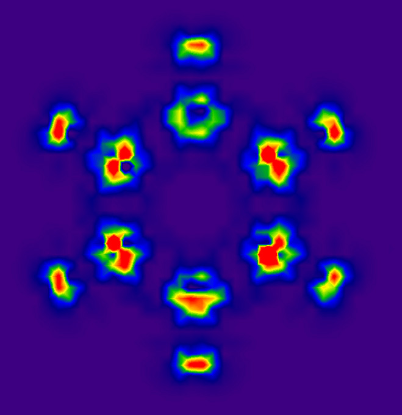
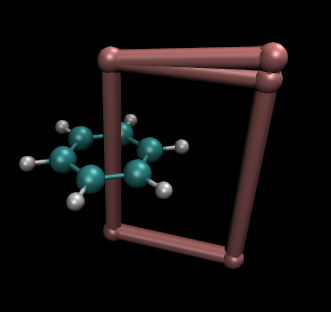

**2019-Jun-22注**：由于后来出了好用得多的GIMIC 2.0版，此文介绍的GIMIC老版本的程序使用部分的内容已经完全过时了。想用GIMIC研究问题的读者一定要仔细看《考察分子磁感生电流的程序GIMIC 2.0的使用》（<http://sobereva.com/491>），其中还包含24分钟演示视频。

**使用GIMIC计算和分析磁感应电流密度**  
Calculating and analyzing magnetically induced current density using GIMIC

文/Sobereva @[北京科音](http://www.keinsci.com/)  2012-Jul-15

## 1 GIMIC简介

分子中磁感应电流密度的基本概念以及使用AICD程序绘制磁感应电流密度的方法在《使用AICD程序研究电子离域性和磁感应电流密度》（<http://sobereva.com/147>）中已经介绍过。然而，使用AICD程序有一些缺点：  
1 必须有Gaussian的源代码版权而且会编译Gaussian源码  
2 AICD是用C++写的，而且写得很复杂，注释和很多变量名都是德文，难以自行修改  
3 AICD不能直接输出每个位置的感应电流密度数值，因此没法利用这些数据按自己所愿去写程序进一步分析，比如作平面图、对某个截面进行积分  
4 AICD利用的是Gaussian的CSGT方法的磁性质计算的输出信息，而CSGT的结果随基组收敛速度比常用的GIAO方法要慢。  
使用GIMIC程序分析磁感应电流密度则可以避免上述问题。

GIMIC程序实现的是GIMIC(gauge including magnetically induced current method)方法。GIMIC方法基于GIAO(gauge including/invariant atomic orbitals，范规不变的原子轨道)方法，并依靠磁性质计算过程产生的密度矩阵和密度矩阵对磁场的导数矩阵来计算感应电流密度，计算公式见下文提到的原文、综述和幻灯片，这里就不介绍了。虽然在GIMIC程序里也要做不少运算，但还是很快的。相对来说，AICD程序中计算电流密度的过程就简单多了，就是直接将CSGT计算中间生成的积分点上的电流密度张量投影到均匀分布的笛卡尔坐标点上，然后乘上外磁场向量就得到了电流密度。

原则上，GIMIC程序可以支持任何使用GIAO方法计算磁性质的量子化学程序。不过，目前版本GIMIC程序只支持CFOUR、ACESII和Turbomole程序。Turbomole大概卖2W RMB，如果不想花钱的话，就用免费开源的CFOUR，借助它可以在HF以及高精度耦合簇级别下计算电流密度，但遗憾的是不支持DFT。关于CFOUR的基本用法我在《CFOUR程序的编译和使用方法简介》（<http://sobereva.com/150>）一文中已经介绍了，本文也只讨论使用CFOUR时的情况。ACESII和CFOUR是同根生，功能很大程度相似，而且还支持DFT，但这程序非常难对付，没顽强毅力的话还是别指望能驯服它。

GIMIC可以输出一个空间范围或指定平面上均匀分布的格点上的电子密度、电流密度及其模和散度，也可以输出自定义的一批点上的这些性质。还可以对电流密度在指定的平面上做积分，得到比如穿过相邻两个原子的净电流。比起AICD来说这个程序更为灵活，专业。GIMIC绝大部分使用Fortran90编写，代码改起来也相对比较容易。

GIMIC的缺点是手册写得太简单且含糊不清，很多地方必须靠猜或者反复尝试才能搞懂，有些关键词都没有介绍，代码有的地方不完整有bug。虽然GIMIC方法从形式上能拆成各个轨道的贡献，但是目前版本的程序还不能像AICD程序那样分解成轨道的贡献。

GIMIC是免费开源的，可以从此处下载<https://gitorious.org/gimic>。首先要注册个用户名，然后在这个页面中点source tree按钮，然后在右侧点Download master as tar.gz来将目录中的文件打包下载。（注：网址已经失效，可在此下载[/usr/uploads/file/20160121/20160121171602_29686.rar](http://sobereva.com/usr/uploads/file/20160121/20160121171602_29686.rar)）

GIMIC方法的原文见JCP,121,3952，一个很不错的介绍GIMIC及其应用的综述见PCCP,13,20500。在寡人制作的幻灯片《Utilizing AICD and GIMIC programs to study magnetically induced current density》当中也简要介绍了感应电流密度、磁性质的计算、CFOUR、AICD及GIMIC程序的基本原理和用法，可以到这里下载<http://sobereva.com/148>（个别地方的介绍与本文不同，以本文为准）。

除了前面已提及的AICD和GIMIC，还有一种CTOCD-DZ(continuous transformation of origin of current density-diamagnetic zero)方法也被不少研究者用于绘制感应电流密度。然而只有修改版的SYSMO程序能实现此方法，而此程序又不公开，所以这里就不多提它了。

PS：可能有读者对GIAO、CSGT这些概念不清楚，关于磁性质计算的方法这里简要提一下。在计算磁性质时，磁场B并不是直接出现在薛定谔方程中的，薛定谔方程中引入的是B对应的矢量势A，即原先的动量算符p被替换为π=p-qA，q是指粒子的电荷（对于电子q=-1）。A与B的关系为B=▽×A。由于任何标量势C的梯度的旋度都是零，因此A有一定任意性，将A替换为A'=A+▽C在原理上不会影响体系性质的计算结果，这被称为“规范变换”。等价地可以表述为A(r)=(1/2)B×(r-R_o)，这里r是某点位置，R_o称为“规范原点”，它是人为任意选取的。当基组是完备的情况下，R_o的选取不会影响磁性质计算结果，但在实际的有限基组计算下，它的选取就会影响结果，所以得想办法消除磁性质计算中这个任意性问题，以满足“规范不变性”，使磁性质（包括电流密度）能唯一地获得。怎么解决测量原点任意性问题，导致了不同磁性质计算方法，GIAO是绝大多数量化程序（包括Gaussian）默认的计算磁性质的方法，它在一般量化计算用的高斯函数中引入了复数因子，使计算出的各种性质不依赖于测量原点的选择（而此时波函数自身则依赖于原点）。另外的一些办法是对每个定域化轨道用单独的测量原点以尽可能减小误差，比如IGLO(individual gauge for localized orbitals)和LORG(localized orbital-local origin)方法。IGAIM(Individual Gauge for Atoms In Molecules)和之后的CSGT(Continuous Set of Gauge Transformations)的本质十分类似，计算中使用了多重测量原点。  
GIAO和CSGT在小基组时，比如6-31G*级别下结果差得不少，绝对屏蔽值能差出几十ppm。而当基组特别大时，两种方法结果就非常一致了。因此计算NMR等磁性质时，应当注明是用的什么方法算的。CSGT的结果随基组收敛比GIAO慢，一般还是用GIAO为好，可参见JCP,104,5497的讨论。

## 2 修改GIMIC代码

下载之后先解压压缩包。里面有fortran源代码文件和很多脚本文件。程序的手册在压缩包里Documentation目录下。

在GIMIC程序输出的cube文件格式不对，没法被主流的可视化软件所读取，这是因为GIMIC生成的cube文件不满足标准cube格式的换行要求，而且用的浮点格式也不是标准的1PE13.5，而且cube文件里没有分子坐标信息。因此，需要对代码进行一些修改，也使得生成的cube文件里总有原子坐标信息，其内容是我们随便设的，是一个位于原点的氢原子。

在cubeplot.f90里搜索  
  do i=1,npts(1)  
   do j=1,npts(2)  
    do k=1,npts(3)  
     write(fd,'(f12.6)',advance='no') pdata(i,j,k)  
     if (mod(l,6) == 5) write(fd,*)  
     l=l+1  
    end do  
   end do  
  end do  
将之改为  
  do i=1,npts(1)  
   do j=1,npts(2)  
    write(fd,"(6(1PE13.5))",advance="no") pdata(i,j,1:npts(3))  
    write(fd,*)  
   end do  
  end do  
把cubeplot.f90的35行的0改为1  
把cubeplot.f90的38行后面加上write(fd,"(i5,4f12.6)") 1,1D0,0D0,0D0,0D0

把jfield.f的610行后面加上  
    if (mod(l,6) /= 5) then  
     l=0  
     write(fd1,*)  
     write(fd2,*)  
    end if  
在jfield.f里搜write(fd, '(i5,3f12.6)') 0, origin，将0改为1  
在jfield.f里搜write(fd, '(i5,3f12.6)') npts(3), 0.d0, 0.d0, step(3)，在后面加上write(fd,"(i5,4f12.6)") 1,1D0,0D0,0D0,0D0

在gimic.in里面把print "Error: either spacing or grid_points must be specified"这一行后面的sys.exit(1)这行删掉，否则无法令程序计算自定义的一批点上的电流密度等属性。

GIMIC源程序（2012年6月5日下载的）和按上述过程改好的文件可以从这里下载：[/usr/uploads/file/20150610/20150610050217_74417.rar](http://sobereva.com/usr/uploads/file/20150610/20150610050217_74417.rar)。

## 3 编译GIMIC代码

首先确保CFOUR已经编译好，并且编译时带着--enable-gimic选项，这将会编译出xcpdens程序用于输出后文提到的XDENS文件，这些都已在《CFOUR程序的编译和使用方法简介》中提到。

./configure FC=ifort  （不写FC=ifort则默认用gfortran，也能正常编译。如果要指定安装目录而非默认的/usr/local/bin，加上比如--prefix=/sob/gimic）  
把Makefile的INST_PROGS+=xcpdens这行注释掉  
make  
这将在GIMIC目录下生成gimic.x，这是GIMIC程序的计算模块。  
将GIMIC/tools/MOL2mol.sh打开，将ACES2变量改为实际路径，如ACES2=/sob/cfour_v1，将后面两处$ACES改成$ACES2。  
将GIMIC/tools/xgimic2.sh打开，将ACES2变量改为实际路径，如ACES2=/sob/cfour_v1  
运行make install。这将把gimic.x和一些脚本拷贝到/usr/local/bin里  
自行将GIMIC/tools/xgimic2.sh拷到/usr/local/bin里

（注：按照GIMIC官方的说法是先按普通方式编译CFOUR/ACESII，然后在GIMIC的./configure后面加上诸如--with-aces2=/sob/cfour_v1/lib，这样就会编译出xcpdens，但实际上GIMIC的configure脚本有问题，认不出编译好的CFOUR/ACESII的静态库来。在编译CFOUR时加上--enable-gimic也会编译出xcpdens，是完全等效的。所以建议还是在CFOUR编译时就用--enable-gimic选项编译出xcpdens）

## 4 运行GIMIC

运行GIMIC需要三个文件：  
1 mol文件，包含分子坐标和基组信息。  
2 XDENS文件，包含密度矩阵和密度矩阵对磁场的导数。  
3 gimic.inp文件，里面的关键词设定要让GIMIC干什么。

mol和XDENS都由CFOUR的NMR计算来输出。这里以使用GIMIC分析苯的感应电流密度为例介绍一下流程。首先建立一个空文件夹，编写一个CFOUR的NMR任务的输入文件，命名为ZMAT放入其中，内容如下  
BENZENE  
X  
C 1 RCC  
C 1 RCC 2 A60  
C 1 RCC 3 A60 2 D180  
C 1 RCC 4 A60 3 D180  
C 1 RCC 5 A60 4 D180  
C 1 RCC 6 A60 5 D180  
H 1 RXH 2 A60 7 D180  
H 1 RXH 3 A60 2 D180  
H 1 RXH 4 A60 3 D180  
H 1 RXH 5 A60 4 D180  
H 1 RXH 6 A60 5 D180  
H 1 RXH 7 A60 6 D180

RCC=1.39864  
RXH=2.48607  
A60=60.0  
D180=180.0

*CFOUR(CALC=HF,BASIS=6-31G*,PROPS=NMR,SYMMETRY=ON)  
[空行]  
注意必须写上SYMMETRY=ON，尽管这是默认的。

运行xgimic2.sh --scf |tee cfour.out  
如果用的是微扰方法，--scf应该改为--mbpt，如果是耦合簇，用--cc。xgimic2.sh会依次调用CFOUR的各个模块进行计算，最后当前目录下就有了XDENS文件。这个文件是文本文件，假设有66个基函数，那么里面就有66+66*3个数，貌似前66个是密度矩阵，后3*66个是它对磁场三个方向的导数矩阵，每个矩阵末尾空一行，因此总共多出4行。  
（注：由于xgimic2.sh调用CFOUR计算时是单进程模式，故没法照常以MPI方式并行运行CFOUR。但如果编译CFOUR时用了MKL，则也能依靠MKL来并行，也就是先执行export MKL_NUM_THREADS=n，n是当前能用的所有核心数）

接下来直接输入MOL2mol.sh  
这步将会新建个临时目录并把ZMAT拷进去，将SYMMETRY从ON变为OFF，并重新调用CFOUR迅速过一遍，生成无对称性的mol文件并复制到当前目录下，其中包含了所有原子的坐标和基组。  
（注：带着对称性计算时xgimic2.sh那步已经产生了MOL文件，但其中只有对称唯一部分的坐标。如果输入文件写的是SYMMETRY=OFF了，则可以省略这步，直接将MOL改名为mol即可）

把gimic.inp从GIMIC/examples里面拷过来，在此基础上进行修改。  
此时gimic.inp、mol、XDENS三个文件都有了，直接输入gimic即开始计算。（gimic是个脚本，已经被拷到了/usr/local/bin）

这里顺便说一下，对于闭壳层体系的电流密度计算，用HF/6-31G*就能得到不错结果。对于开壳层体系，电子相关必须着重考虑，此时应当用更高级别方法结合更大一些基组。基组建议用3-zeta加极化的，理论方法用CCSD最稳妥。微扰方法不要用，往往存在厉害的自旋污染问题。DFT是否适用还没有经过大量检验，如果用的是turbomole或ACESII倒是可以试试。

## 5 GIMIC的输入文件

GIMIC输入文件gimic.inp中的每个关键词的含义在手册中都有说明，这里有重点地说明一下。首先注意输入文件中所有长度单位都是Bohr。

输入文件中第一部分是全局设定，典型的是如下这样，#后面是自带的注释  
dryrun=off        # don't actually calculate (good for tuning grids, etc.)  
mpirun=off        # run in parallel mode  
title=""  
basis="mol"       # Name of MOL file with coordinates and basis sets  
density="XDENS"   # File with AO density and perturbed densities  
spherical=off     # don't touch, unless you REALLY know what you are doing  
debug=1           # debug print level  
diamag=on           # turn on/off diamagnetic contributions  
paramag=on          # turn on/off paramagnetic contributions  
GIAO=on             # turn on/off GIAOs. Don't change unless you know why.  
openshell=false   
screening=on        # use screening to speed up   
screen_thrs=1.d-8   # Screening threshold  
show_up_axis=true   # mark "up" axis in .xyz files  
calc=[cdens, integral, divj]

这些参数中一般只需要自行设两个，其余的都不用动。openshell选择是否是开壳层计算，calc设定计算哪些任务。GIMIC包含这几类任务：  
cdens：计算指定区域内均匀分布的格点上的感应电流密度  
divj： 计算指定区域内均匀分布的格点上的电流密度的散度  
edens：计算指定区域内均匀分布的格点上的电子密度  
integral：计算电流密度在某平面的积分。积分方式是二维高斯积分。  
比如上面的例子，就代表依次做cdens、integral、divj这三个任务。

输入文件的第二部分就要设定每类任务的具体选项，主要设磁场方向和格点分布。比如divj任务的选项就都在divj {...}里面夹着。

对于cdens、divj、edens任务，一般只需要设定以下参数。其它参数直接用模板输入文件的默认设定就行了。  
magnet_axis：设定磁场顺着哪个轴，比如-y就是向着y轴负方向加磁场。  
magnet：设定磁场矢量。比如[0.0, -1.0, 0.0]就和magnet_axis=-y的含义一样。这个参数和magnet_axis只要设其一就行了，另一个应注释掉。  
grid(base) {...} 段落设定的是格点分布。其中  
  origin：设定格点原点  
  ivec和jvec：设定格点的前两个方向的向量（i,j方向），第三个方向的向量（k方向）即是这两个向量的叉乘。一般ivec和jvec分别设[1.0,0.0,0.0]和[0.0,1.0,0.0]，此时i,j,k方向即是笛卡尔坐标轴的x,y,z方向。  
  lengths：设定格点空间范围在三个方向上的总长度  
  spacing：设定在三个方向上的格点间距  
  grid_points：设定在三个方向上的格点数。它和spacing目的相同，故只能设其一，另一个要注释掉。

对于integral任务，主要要设的是  
magnet：设定磁场矢量  
spin：考虑哪种自旋的贡献  
grid(bond) {...} 段落设定积分平面上积分点的分布方式，主要需要考虑的是  
  coord1和coord2：设定两个点的坐标，积分平面就会在这两个点之间，且垂直于其连线  
  bond：比如设[1,2]，那么1号和2号原子的坐标就会分别作为coord1和coord2。当然了，bond和coord1/2只能同时设一个。  
  distance：积分平面距离第一个点的垂直距离  
  grid_points：比如设[30,30,0]，那么在积分平面上就有30*30=900个积分点。最后一个值不用设，意义也不明。  
  spacing：设定积分点间隔。它和grid_points只能设一个，另一个要注释掉  
  up、down、in、out：积分平面与coord1、coord2连线的交点根据此设定分别向四周扩展，就定义了积分平面的范围。  
用文字不容易说清楚积分平面的格点设定，我绘制了一张草图。图中红色箭头的两端分别是coord1和coord2的位置。粉框是积分平面区域，垂直于红箭头，蓝点是积分点，亮绿的点是积分平面与红箭头的交点。distance和up、down、in、out的含义标在图上了。

## 6 GIMIC的输出文件与可视化

首先注意，GIMIC输出的文本文件里长度单位都是埃。本节所说的输出文件的名字有的是在输入文件中可调的，本文假设使用的都是模板输入文件里的文件名设定。文件名前标星号的是重点，其它输出文件可以无视。

本节的例子用的都是处在Z=0的XY平面上的苯分子，HF/6-31G*下计算，磁场顺着Z轴正方向。i,j,k方向分别对应笛卡尔坐标x,y,z正方向。

### 6.1 cdens任务输出的文件

grid.xyz：包含了分子坐标，并用8个X原子表示出格点数据范围的8个顶点位置。（GIMIC输出的各种xyz文件总是多出一个X原子，原因不明）  
jtensor和jvector：是格点位置上的感应电流张量和感应电流向量，它们都是二进制文件。  
*JVEC.txt和JMOD.txt：包含了由原点和i,j方向向量定义的平面上的电流密度矢量和电流密度模。  
jmod.plt：是gopenmol格式的记录了上述平面上的电流密度矢量的文件。prj_jmod.plt的意义不明。  
*jmod.cube：是感应电流密度的模的格点数据，是diatropic和paratropic感应电流密度的模的总和，故总为正值。jmod_quasi.cube则是将diatropic和paratropic感应电流密度的模分别用正值和负值部分记录。

下面的图是origin=[-8.0, -8.0, -8.0]、lengths=[16.0, 16.0, 16.0]、spacing=[0.2, 0.2, 0.2]格点设定时用VMD显示grid.xyz时的图像，肉色的X原子描述了格点数据的空间范围，计算的点都落在以它们为顶点的长方体中，可见格点范围涵盖了整个分子。

电流密度是个矢量场，用一大堆箭头描述三维空间各个位置的电流密度在分析时比较困难。而将每个点的电流密度矢量求模，就成为了张量场，可以通过观看等值面直观了解哪些位置电流密度比较大。

下面用VMD观看电流密度的模的等值面，VMD可以在<http://www.ks.uiuc.edu/Research/vmd/>免费下载。启动VMD，将上述格点设定下产生的jmod_quasi.cube拖进VMD main界面，选Graphics-Representations，将目前已有的Style通过点Delete Rep来删掉。然后点Create Rep两次创建两个新的显示方式，对这两个显示方式都按照下图进行设定。两个显示方式的区别仅在于一个isovalue设为0.05且设为蓝色以表现正值部分，另一个设为-0.05且设为红色以表现负值部分

等值面显示效果如下所示。蓝色区域代表这部分有较大diatropic电流，也就是满足左手定则的感生电流（即左手拇指朝向磁场方向时，左手其余手指弯曲时就指向感应电流方向，对纯导体总是满足）。这部分电流出现在苯环中部和外侧，是由sigma轨道在苯环外侧部分和pi轨道贡献的。红色代表这部分有较大paratropic电流，也就是与左手定则方向相反的感生电流，这是sigma轨道在苯环内侧部分产生的。下面将更进一步分析。

接下来我们要利用JVEC.txt储存的指定平面上的数据作苯的感应电流密度向量场图。计算的平面区域与origin及lengths参数的关系如下图所示，蓝色是被计算的区域。当我们把k方向长度设为了0时，代表只计算二维平面的数据点，而不会输出cube文件，这样比较省时。

 

这里我们用这样的格点设定：  
ivec=[1.0, 0.0, 0.0]  
ivec=[0.0, 1.0, 0.0]  
origin=[-8.0, -8.0, 0.0]  
lengths=[16.0, 16.0, 0.0]  
spacing=[0.2, 0.2, 0.2]  
这表明计算的平面范围是Z=0的XY平面，即苯所在的平面，X和Y的范围都是-8.0~8.0 Bohr，这两个方向都是16/0.2+1=81个点。如果想计算分子平面上方1 Bohr的XY平面，就把origin设成[-8.0, -8.0, 1.0]。如果想计算的是个倾斜的面，显然就得改ivec和jvec设定来调整i,j方向向量了。

JVEC.txt的内容是类似这样的  
...  
  2.2225444  0.5291772  0.0000000 -0.0198798 -0.0213785  0.0000000  
  2.3283799  0.5291772  0.0000000 -0.0156558 -0.0166937  0.0000000  
  2.4342153  0.5291772  0.0000000 -0.0117118 -0.0124604  0.0000000  
  2.5400508  0.5291772  0.0000000 -0.0083301 -0.0089750  0.0000000  
  2.6458862  0.5291772  0.0000000 -0.0056686 -0.0062921  0.0000000  
...  
前三列是每个点的xyz坐标，后三列是该点的电流密度矢量的xyz分量。通过sigmaplot、Origin、Surfer等支持绘制向量场图的程序就可以将它绘制出来。这里通过Sigmaplot 11来绘制。

启动Sigmaplot之后选File-Import-File，选JVEC.txt，点import。选Transform-Quick transform，运行col(7)=col(1)+2*col(4)和col(8)=col(2)+2*col(5)这两个算式。这么做的目的是因为Sigmaplot作向量场图需要每个向量的始端和末端的坐标，始端xy坐标就是JVEC.txt的前两列，末端就是始端坐标加上电流密度向量。之所以算式中乘以2，是为了作出来的图箭头长度比较容易观看，也可以事先将外加磁场矢量大小改为原来的2倍以达到相同目的。之后从左侧的作图类型列表里选vector plot（在最左列最下端），选XYXY模式，X1、Y1、X2、Y2分别选1、2、7、8列。作出图后，放大到200%，然后双击图，thickness设为0.1mm，angle in设为30，就能得到下面的图像。

从箭头方向上可以看出，每个C-C sigma键区域（红圈所示）、每个C-H键区域（绿圈所示。由于氢原子没有内核电子，所以整个氢与C-H键区域融为一体了）、每个碳原子核内核区域（紫圈所示，对应1s电子）都由于垂直朝向平面外的磁场形成了局部的环流，且在相应局部看都是diatropic电流。这些形成局部环流的区域都是电子定域性比较高的区域。

箭头越长电流密度越大，可见碳原子内核电子的环流非常强，主要与离核很近区域电子密度很高且定域性很高有关。在原子核处，这环流会产生很强的朝平面内的磁场，抵消了很大一部分外加磁场，这就是核磁共振学中的磁屏蔽值的主要来由。

整体观看这张图，会看到苯环内侧的感应电流是逆时针的，而苯环外侧是顺时针的，考察每个键的局部环流在环内侧部分和环外侧部分的方向就不难理解为什么会出现这种现象，这是各局部环流组合到一起所导致的。在苯环平面上，尽管内环有diatropic电流而外环有paratropic电流，由于它们的强度差不多，所以从分子外部来看这两种方向的电流效应抵消了，因此光靠苯的sigma电子形成不了整体净环流。对于其它多数饱和烷烃也是类似的，只靠sigma电子形成不了整体净环流，表现出非芳香性特征。

将origin设成[-8.0, -8.0, 1.8896]后，用相同的步骤，就绘制出了苯环上方1埃(1.8896 Bohr)平面的电流密度图。但注意由于这个平面上电流密度比较小，所以所做的变换应当是col(7)=col(1)+10*col(4)和col(8)=col(2)+10*col(5)，这是令电流密度扩大更多倍数以使图上箭头长度合适。

由于此平面与sigma键轴有一定距离，所以这主要表现的是pi电子的效应。pi电子是在整个苯环上离域的，所以从图中看到形成了整体的diatropic环流。由于sigma轨道产生的苯环的diatropic和paratropic环电流差不多抵消了，而pi轨道能产生较强的diatropic环电流，所以我们说的苯环的环电流是由diatropic所主导的，因此苯分子是芳香性分子。若是C4H4这种分子则是paratropic主导，就是反芳香性分子。如果整体看diatropic和paratropic电流大小差不多，因此无整体净电流，就是非芳香性分子。

### 6.2 edens任务输出的文件

edens：包含了分子坐标，并用几个X原子表示出格点数据的各个顶点位置。  
*edens.cub：格点空间内的电子密度数据的cube文件。  
*edens.txt：包含了由原点和i,j方向向量定义的平面上的电子密度数据，是文本文件。通过它可以用sigmaplot等软件绘制指定平面的电子密度图。  
EDENS：格点空间内的电子密度数据，是二进制文件。

### 6.3 divj任务输出的文件

divj.xyz：包含了分子坐标，并用8个X原子表示出格点数据范围的各个顶点位置。  
divj.plt：是gopenmol格式的由原点和i,j方向向量定义的平面上的电流密度散度。  
DIVJ：包括了空间格点范围内电流密度矢量的散度，是二进制文件。  
*DIVJPLT：是由原点和i,j方向向量定义的平面上的电流密度散度，是文本文件。前三列是笛卡尔坐标，第四列是散度值。

利用DIVJPLT文件通过sigmaplot等软件可以将指定平面上的电流密度散度数据绘制出来。这里我们做苯分子平面上的图。在前述格点设定下执行divj任务，将得到的DIVJPLT文件后缀名加上.txt，然后启动sigmaplot，将此文件导入，选Transform-Quick transform，运行col(5)=abs(col(4))，也就是将散度数据取绝对值，这就不用考虑方向问题了，数值越大就对应于此处电流密度越发散，分析起来更方便。从左侧的作图类型列表里选Contour plot-Filled contour，选XYZ Triplet，X、Y、Z分别设为1、2、5列。作出图后双击图像，Scale里将start和end设为0和0.1，minor lines设为20，就得到了这样的图：

颜色越红的位置电流密度发散性越强。对照前面的电流密度图可看到，在sigma键局部环流中心处电流密度为0，四周电流围着它打转，电流没有整体发散或收缩的趋势，所以这些区域散度都为0。电流密度箭头均匀并排前进的区域相当于均匀场，也理所当然地散度为0。在碳原子核附近的箭头像旋转洒水机喷出的水似的，很多地方散度非常大。由于散度图对格点精度敏感（尤其是核附近），而当前的格点精度取得不高，而且格点分布不符合苯分子几何对称性，所以看起来图像不细腻且不满足对称性，可以通过减小格点间距改善。

### 6.4 integral任务的输出

这里用积分穿过苯的C1-C2键的电流密度为例说明。积分平面在C1-C2键的中点且垂直于键轴。格点设定如下  
bond=[1,2]  
distance=1.323 （半个C-C键键长）  
up=6.0  
down=6.0  
in=2.0  
out=6.0

这个任务会在屏幕上输出诸如这样的信息：  
************************************************************  
    Induced current (au)    :     0.461991  
       Positive contribution:     0.635794  (  17.916310 )  
       Negative contribution:    -0.173804  (  -4.897681 )  
   
    Induced current (nA/T)  :    13.018629  
       (conversion factor)  :    28.179409  
************************************************************  
这表明穿过这个平面的净电流为0.461991 a.u.，乘上转换因子28.179409（常数）折合于13.018629 nA/T。正值贡献是0.635794 a.u.(17.916310 nA/T)，通过前面的分析已经知道苯环的电流是diatropic主导的，也因此正值贡献就是指的diatropic电流的积分。可见它的数值大小明显超过paratropic电流产生的负贡献。

integral任务还同时输出integral.xyz文件，它包含分子结构，并且通过4个X原子标出积分平面的区域。用VMD绘制它，令X原子相连，围成的框就是积分区域，如下所示。当然，原则上积分点越密且积分区域越大积分精度越高。但是要注意别让积分平面延伸到别的区域去。

## 7 自定义要算的数据点位置

如果想在一批自由设定的、没有规律的位置上计算数据，就编辑一个文本文件，里面记录要在哪些位置上计算（单位是bohr），可按照自由格式书写，内容比如是下面这样，文件名叫做extgrd  
 -3.5984053 -4.2334180  0.9999333  
 -3.4925698 -4.2334180  0.1199333  
 -3.3867344 -4.2334180  0.9999333  
 -3.2808989 -4.2334180  0.9999333  
 -3.1750635 -4.2334180  0.9999333  
 -3.0692280 -4.2334180  0.0  
 -2.9633926 -4.2334180  0.9999333  
然后，将GIMIC输入文件中相应任务类型内原先的格点设定部分注释掉，而在其后新插入一行  
grid(file) { file=extgrd }  
之后照常使用GIMIC计算即可。例如对于cdens任务，输出的JVEC.txt里就记录了每个自定义位置的值。JTENSOR和JVECTOR记录了这些位置的感应电流密度张量和感应电流向量，是二进制文件。
