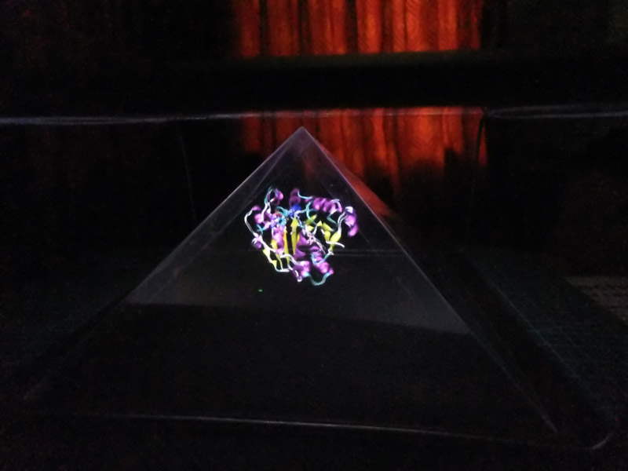
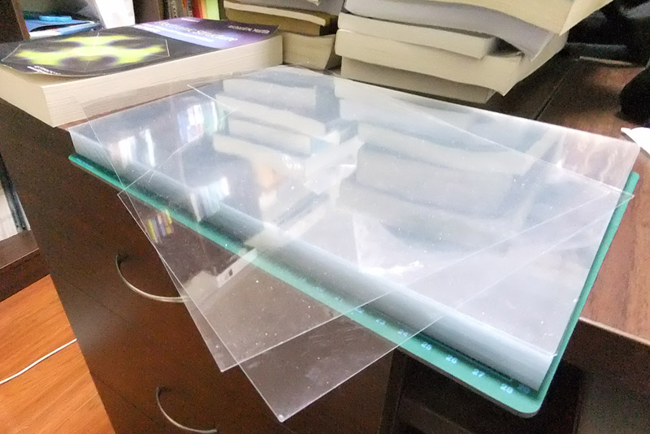
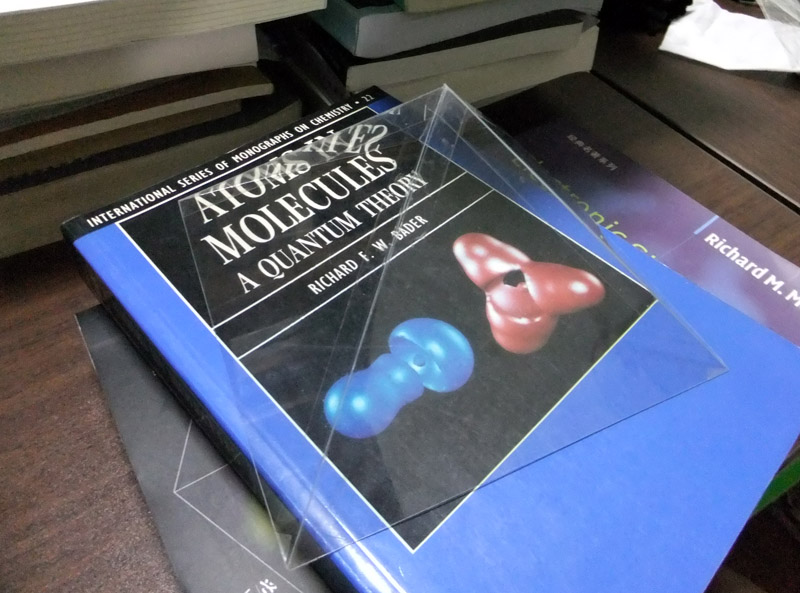
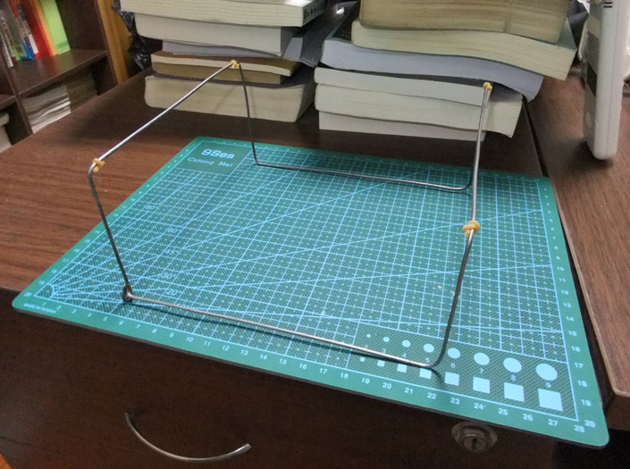
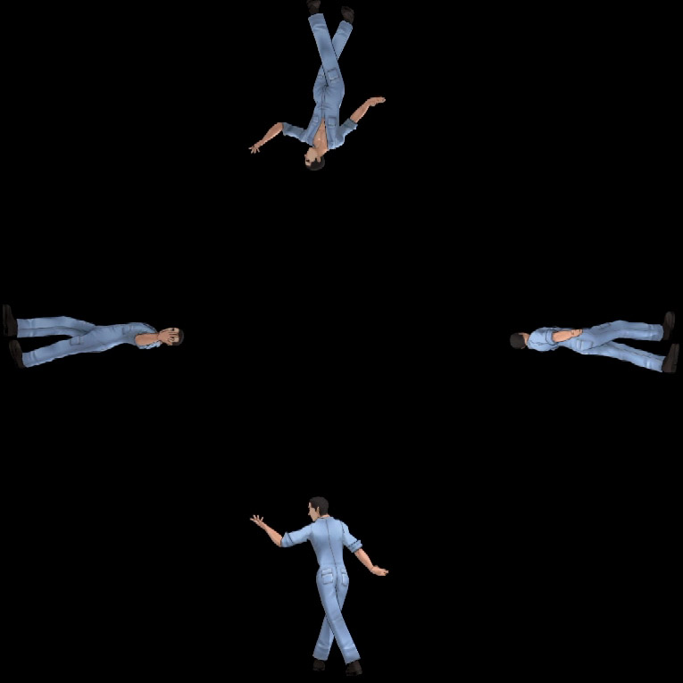
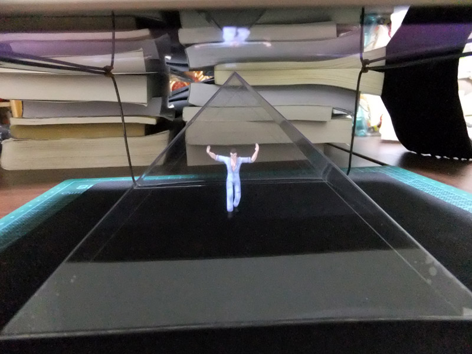
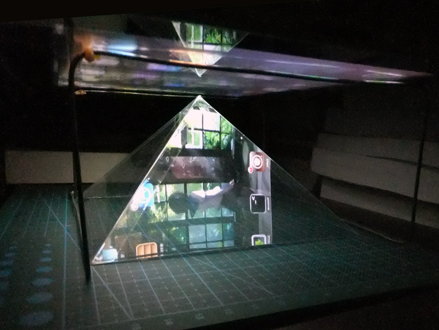

**伪全息影像显示蛋白质动力学轨迹**Pseudo-holographic movie revealing protein dynamics trajectories

文/Sobereva@[北京科音](http://www.keinsci.com/)    2012-Jul-18

现在廉价的伪全息影像实现方法已经在网上盛传，寡人也做了一个，虽然原理十分简单，但实际看上去比想象得更有趣。大家基本都是用这技术来显示Miku等角色的舞蹈，寡人靠VMD做了个蛋白质伪全息视频，效果不错，如下图所示（后文有视频）。这里简单说说步骤。  
  
  
  
这种伪全息终究是伪的，只能表现物体前后左右四个面的影像，而不能像真正意义的全息效果一样能将物体的各个角度的影像都表现出来。  
  
实现伪全息效果首先得有个能播放视频的设备，智能手机、PSP等都可以，如果有屏幕大的则更好，比如平板电脑。寡人就用别人送的ipad作为视频播放设备。  
  
然后得找透明的膜用来做个四棱锥。很多人都是用屏幕保护膜来做，但这样很不划算，对于大屏幕播放设备更是如此。寡人从淘宝上花20块钱买了50张A4尺寸的0.4mm厚的PVC膜用来做这个。实际上只需要一张半就足够了，但是最小购买单位就是50张，所以不得已一次购买这么多。但即便这样也比买屏幕保护膜要值，剩下的膜就分给别人玩伪全息吧，或者可以做成“舔屏幕膜”，这我以后会介绍。这PVC膜透明度虽然不及专门的屏幕保护膜，但实际效果还是很好的，由于不防划也不防指纹，所以拿的时候尽量拿着边缘。  
  
  
  
然后裁剪出4块相同的等腰三角形，底边长14.8厘米，腰长12.8168厘米。14.8厘米是ipad 1屏幕的宽度，如果你用的设备屏幕宽度为x厘米，则三角形底边应当为x厘米，腰长x/14.8*12.8168厘米。建议用刻刀比着钢尺在PVC膜上划出刻痕（很难直接完全刻透），然后来回掰几下就能把边缘整齐地分开。  
  
之后，把四个等腰三角形的腰用透明胶条粘起来，组成一个四棱锥。连接处最好留出一两毫米缝隙，否则两块三角相接处没法自如地弯曲，可能会产生张力，导致四棱锥变形或者平面扭曲而影响效果。这样得到的四棱锥的每个面与桌子的夹角是45度。然后把四棱锥上的尘土、指纹都擦干净。  
  
  
  
接下来要做个架子，套在四棱锥四周，使得ipad能够被架子支撑起来朝着四棱锥显示图像。制作架子有人用木头，比较麻烦；有人用硬纸条，但是纸条必须很粗才撑得住ipad的重量，影响视线。寡人用的是1.5mm粗的钢丝做架子，制作方便，坚固，而且不几乎挡视线。首先截取1.1米长的钢丝，拿钳子按下图弯折，每个边长约16厘米，高8厘米。折完一圈回到起点的位置后，按下图左下角那样捼一个弯钩固定住始末端，再把剩余的钢丝剪掉。如果弯钩无法完全固定住始末端，可以用胶水再粘牢。由于钢丝是导电的，因此把ipad屏幕放在上面后，手一碰这架子就有可能给ipad发送某些指令，导致正在播放的视频中断或造成其它麻烦。而且钢丝光滑，ipad一碰就可能在上面滑动，甚至掉地下。所以建议找两根皮筋，每根皮筋剪成两段，像图中这样在与屏幕接触的角落上绑个结，就能避免这两个问题了。  
  
  
  
在显示蛋白质动力学轨迹之前，我们先用这伪全息设备欣赏一下好男人阿部的舞姿。制作伪全息视频方法不难，先下载个MikuMikuDance（即MMD，目前最新为7.39版，只有几兆），然后在网上找到阿部的模型文件(.pmd)和动作数据(.vmd)。然后启动MMD，在屏幕下方靠左的模型控制区域里选“载入”，选阿部的模型文件，然后“文件”-“载入动作数据”选择动作数据文件，然后在上方的“视图”菜单中取消选择显示坐标轴，“背景”菜单里选黑色背景，然后在屏幕下方视点设定区域选“正面”，然后“文件”-“导出AVI文件”将舞蹈视频导出来。这样就得到了正面的舞蹈视频，还需要导出另外三个视角的视频，也就是分别在“视点”中选“左”、“右”、“背面”后依次导出视频。有了四个角度的视频，在视频编辑软件，比如会声会影X15里将它们像下图这样合成到同一个视频里即可，过程其实也很容易，网上教程也多的是，就不再累述了。  
  
  
  
把一个鼠标垫的黑色背面朝上放桌子上，把四棱锥放上面，把架子套上，然后让ipad播放阿部伪全息视频并朝下放在架子上，中心对准四棱柱的尖，就能看到好男人在桌子上翩翩起舞了，动作轻盈飘逸，令人愉♂悦。  
  
  
  
屏幕调亮点，关了灯效果更好。寡人绕着四棱锥拍了段视频，如下所示。寡人的相机在暗环境下不给力，不清楚且噪点多，凑合看吧。另外，不懂FA乐器的话建议关闭声音，免得被吓到。  
**<http://sobereva.com/attach/157/abu_walk_around.mp4>**  
  
接下来就要做蛋白质动力学轨迹的伪全息视频了。启动VMD，载入一段蛋白轨迹，设定好显示方式后，回到初始帧，选mouse-move-molecule，然后按住shift拖动分子调整分子与坐标轴的相对朝向，以使得绕着坐标轴的某个轴转动时可以把感兴趣的区域显示出来。然后extension-analysis-RMSD trajectory tool，直接点Align，这样后续的帧中的结构就都向着最初帧的分子朝向对齐了。然后将视角摆正，在控制台里输入四次rotate x by 90 （如果旋转方向和预期不同，把x换成y或z试试），应该看到在这个过程中，蛋白感兴趣的四个朝向都显示了一遍。确定视角已经设定无误的话，让坐标轴不显示出来，然后选extension-visualization-movie maker，选一个新建的空目录，movie settings选trajectory，把delete image files的钩去掉，然后点Make Movie按钮。这样就把每一帧的图像都输出到指定目录了，最后可能会提示你找不到videomach程序，别管它。利用这些图像，就可以合成轨迹的动画了。比如在会声会影X15里，在视频轨点右键选“插入要应用时间流逝/闪频的照片”，然后把那些图像都ctrl+A选中，就导入到会声会影了，然后用创建视频文件功能把这个视角下的轨迹动画合成视频文件。之后在VMD里输入rotate x by 90（或绕着别的轴），再按照如上步骤生成某个侧面视角的轨迹动画。之后再依次旋转两次90度，如法把剩下两个视角的轨迹动画视频也得到。最后把四个视角的动画合并到同一视频即可。  
  
我做好的蛋白质动力学轨迹的伪全息视频在此下载：<http://sobereva.com/attach/157/protein_qx.avi>  
  
播放这轨迹时寡人绕着四棱锥拍摄了一段视频，请欣赏：**<http://sobereva.com/attach/157/protein_walk_around.mp4>**  
  
  
其实，利用这四棱锥，也不一定非得用来显示某个物体的立体图像，我发现哪怕只是像下图这样显示ipad的桌面，在黑暗的环境下看起来也挺漂亮，挺有意境。如果播放绚丽的万花筒的视频，说不定会颇美。伪全息设备制作容易，实际观看效果很不错，建议大家尝试。  
  

