**使用Multiwfn的定量分子表面分析功能预测反应位点、分析分子间相互作用**  
Using quantitative molecular surface analysis function of Multiwfn to predict reactive site and analyze intermolecular interaction

文/Sobereva @[北京科音](http://www.keinsci.com/)  
First release: 2012-Aug-6  Last Update: 2023-Jul-5

## 0 前言

 定量分子表面分析对于预测反应位点、预测分子间结合模式、预测分子热力学性质有重要意义。本文简要介绍定量分子表面分析的概念和意义、它在Multiwfn程序中所用的数值算法，并通过实例说明怎么用Multiwfn的这个功能分析实际问题。实际上本文很多内容在Multiwfn手册3.15节和4.12节中都已经涵盖，数值算法在我发表的J. Mol. Graph. Model., 38, 314 (2012)一文中有十分完整、详尽的说明。使用Multiwfn此功能发文章时记得**必须要引用**Multiwfn启动时提示的原文，也请同时引用J. Mol. Graph. Model.这篇介绍相关算法文章。

Multiwfn可以在<http://sobereva.com/multiwfn>免费下载。如果对此程序不了解，建议阅读《Multiwfn入门tips》（<http://sobereva.com/167>）和《Multiwfn FAQ》（<http://sobereva.com/452>）。并且十分推荐参加笔者讲授的《量子化学波函数分析与Multiwfn程序培训班》（<http://www.keinsci.com/WFN>），培训里的相关主题讲的内容远比本文全面、细致、深入得多，并且例子给得丰富得多。

《使用Multiwfn通过局部电子附着能(LEAE)考察亲核反应位点、难易及弱相互作用》（<http://sobereva.com/676>）里介绍的LEAE与本文介绍的平均局部离子化能有非常密切的联系和高度互补性，请阅读本文后记得阅读。

## 1 定量分子表面分析的概念和意义

定量分子表面分析主要分析的是静电势（ESP）和平均局部离子化能（ALIE）在分子范德华表面的分布。分子范德华表面的定义非常多，最常用的是Bader的定义，也就是对于气相分子，使用电子密度为0.001 e/bohr^3的等值面作为分子范德华表面，这种定义物理意义明确，而且可以反映局部电子特征产生的影响，比如孤对电子、pi电子。本文所说的分子表面都是指Bader的这种定义。

静电势是大家很熟悉的实空间函数，对于分子体系定义如下

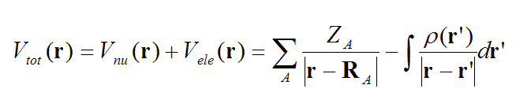

Z代表核电荷数，R是原子核坐标。一个分子在r处的静电势，等于将一个单位正电荷放在r处后它与此分子产生的静电相互作用能，注意这里假定这个单位正电荷的出现对分子的电荷分布不产生任何影响。静电势由带正电的原子核电荷产生的正贡献和带负电的电子产生的负贡献构成。在r处如果静电势为正，说明此处的静电势是由原子核电荷所主导，如果为负，说明电子的贡献是主导。在原子核附近，包括价层区域，由于离核较近，静电势都是正值，这部分通常不是我们感兴趣的（尽管分析它们也有一些特殊用处，比如获得共价半径）。而在分子表面，电子的贡献和核的贡献达到可以抗衡的程度，电子密度分布的不均匀性会导致分子表面静电势有正有负。对中性体系，通常负值出现在高电负性原子的孤对电子、pi电子云以及碳-碳强张力键（如环丙烷）附近，因为这些区域电子比较富集。

对范德华表面静电势的研究已有几十年的历史，最常见的有两类应用：  
(1)在化学反应初期分子间通过静电吸引而相互接近的过程与分子对其外部（范德华表面及更远区域）产生的静电效应密切相关，因此可以通过分析分子范德华表面上静电势的分布来预测在什么位点上最有可能发生何种化学反应，通常认为静电势越负（越正）的地方对应的原子越容易发生亲电（亲核）反应。实际上，通过原子电荷来预测反应位点在本质上是这种静电势分析方法的抽象、简化。  
(2)若已知某复合物是以静电为主导的方式结合而成（如氢键、二氢键、卤键等形式），利用静电势可以预测、解释复合物中分子的相对朝向如何、结合的强度大概有多大，这对于研究分子晶体堆积方式、受体配体结合模式、分子吸附等问题很有用。其依据是分子之间容易以静电势互补方式接触，即分子表面静电势正值区域倾向于接触负值区域，而且正值越正、负值越负时这种倾向越强，这样能最大程度降低整体能量。  
大家已经十分习惯绘制分子表面的静电势填色图来分析这些问题，用不同颜色代表静电势正负和大小（例如《谈谈Molekel做静电势填色等值面图的方法及误区》，见<http://sobereva.com/98>）。这种图形化分析虽然直观，但是有很大局限性，也就是图形化的研究不够精确，讨论问题时只能定性地分析，上升不到定量的高度。而且当比较一系列分子，或者当静电势分布复杂或体系稍大时，图形观察也很费力、麻烦。定量分子表面分析的主要目的之一就是根据静电势在分子表面上的极值点位置和确切数值对反应位点、结合模式等问题给出更准确可靠的分析结论。

另外，分子的凝聚相性质，比如蒸发/升华焓、密度、沸点、粘度、表面张力、LogP等等，都与分子间相互作用密切相关，对于极性（或具有局部极性）的分子，静电相互作用通常比范德华相互作用大很多，因此通过分析在分子表面上的静电势，对于预测这些分子的这些性质十分有益。Politzer等人提出的General interaction properties function(GIPF)就建立了这么一套关系，见J.Mol.Struct.(THEOCHEM),307,55。GIPF的本质上含义是，依靠基于分子表面上静电势分布定义的分子描述符，通过拟合QSPR方程，可以很好地预测上述性质。这些分子描述符包括分子整体/静电势为正/静电势为负区域的表面积，表面上静电势最大值、最小值，表面上静电势的整体/正值/负值部分的平均值/平均偏差/方差，以及它们进一步相互运算得到的几个描述符（具体公式见Multiwfn 2.5手册3.15.1节）。计算并利用这些描述符也是定量分子表面分析的主要组成部分。

如果对静电势有兴趣，建议看此帖的静电势综述文章：<http://bbs.keinsci.com/forum.php?mod=viewthread&tid=219>

平均局部离子化能可能很多人还比较陌生，它在Can.J.Chem.,68,1440 (1990)一文中提出，这个函数写为

ALIE(r)=∑[i]ρ_i(r)*|ε_i|/ρ(r)

其中ρ_i(r)是r处第i个分子轨道的电子密度，|ε_i|是第i个分子轨道能量的绝对值，可以视为i轨道的电子的离子化能，ρ(r)是r处总电子密度。r处ALIE值越小，代表在此处的电子平均能量越高，被束缚得越弱。ALIE有很多应用，比如衡量电负性、表征局部极化率、预测pKa，展现原子壳层结构（在《使用Multiwfn绘制原子轨道图形、研究原子壳层结构及相对论效应的影响》一文中有实例，见<http://sobereva.com/152>）。在ALIE的诸多应用中，最为重要的就是它预测反应位点的能力。在分子表面上，ALIE越小处，由于电子束缚得越弱，或者说电子活性越强，就越容易发生亲电及自由基反应。通过定量分子表面分析算法，找出分子表面上ALIE最小的几个点，看这几个点离哪些原子比较近，就能判断哪些原子最可能是反应活性位点。ALIE的极小点容易出现在pi电子、孤对电子附近，因为这些区域的电子被束缚得较弱。可以认为ALIE越小处，局部极化率越大，这与密度泛函理论中的局部软度/硬度概念也是密切相关的。

关于平均局部离子化能的更多介绍，见《静电势与平均局部离子化能相关资料合集》（<http://bbs.keinsci.com/thread-219-1-1.html>）。

需要特别说明的是，通过静电势和ALIE在预测反应位点上不仅不矛盾，反倒是互补的。单靠静电势很多情况都不能正确预测反应位点；而单靠ALIE，在一些情况下也是失败的（而且ALIE也不能用于预测亲核位点），此时必须将静电势综合考虑。这是因为，两个分子相互反应的完整过程分为以下两个步骤。注意这两个步骤没有明确界限，是平滑过渡的。  
1 两个分子从相距很远逐渐接近：这个过程中分子的电子分布并不发生明显改变，顶多是稍微被另一个分子的电场所极化。长程静电相互作用在这个过程中是关键，通过分析分子表面的静电势，可以很好地估计反应物容易被拉到哪里。也因此，光靠分析ALIE来预测反应位点往往不行，因为即便靠ALIE预测出某些原子容易发生反应，但是若反应物不容易靠静电作用被拉到这里，则在这里发生反应的几率还是不大。  
2 范德华表面快要接触的两个分子进一步靠近，通过成键、断键这样的电子结构重排过程完成化学反应：这一步在哪里容易进行，关键看哪个原子附近电子活性大，用ALIE最适合研究这个问题。这也表现出单纯靠静电势预测反应位点的不可靠性，因为比如某原子附近静电势越负，只能说明亲电试剂越容易被拉到这原子附近，却不代表这原子附近的电子越活泼因而越容易参与反应。再者，当分子间接近到快要反应时，分子的实际电子分布与它在孤立时的电子分布已有很大差异，前面介绍静电势时提到的“对分子的电荷分布不产生任何影响”的前提条件已经不能满足，所以用分子孤立状态的静电势已经不能很好说明问题。

综上所述，由于分子间反应涉及到了两个步骤，而两个步骤本质不同，分别适合用静电势和ALIE来分析，因此需要将它们在分子表面上的分布综合考虑以判断反应位点。通常可以先用ALIE判断，如果遇到困难，比如好几个原子都有对应的ALIE极小点（而且数值和最小点数值差不多），或者极小点介于两个原子之间，那么可以再考察静电势的分布，看看反应物更容易被拉到哪个原子附近。另外，有时需要根据分子三维结构，将位阻效应对试剂接近过程的影响考虑进去。

判断反应位点还有很多办法，比如概念密度泛函理论中著名的福井函数（前线轨道理论判断反应位点本质上是福井函数的近似），以及之后提出的双描述符。这两种方法实际上和ALIE一样，着眼的也是反应过程的第二步。相关知识参看笔者写的《亲电取代反应中活性位点预测方法的比较》（<http://www.whxb.pku.edu.cn/CN/abstract/abstract28694.shtml>），福井函数和双描述符可以用Multiwfn非常容易地计算，看《使用Multiwfn超级方便地计算出概念密度泛函理论中定义的各种量》（<http://sobereva.com/484>）。更多知识看《概念密度泛函综述和重要文献合集》（<http://bbs.keinsci.com/thread-384-1-1.html>）。

## 2 定量分子表面分析在Multiwfn中的基本算法

定量分子表面分析算法的详尽的技术细节不在本文讨论，这并非一般用户关心的，有兴趣者可参看 J. Mol. Graph. Model., 38, 314-323 (<http://dx.doi.org/10.1016/j.jmgm.2012.07.004>)。但基本原理还是应当了解的，只有这样面对一些实际问题时才能明白如何通过Multiwfn提供的一些选项自行解决。

既然分析的是分子表面，就必须先把分子表面构建出来。Marching Tetrahedra(MT)方法是计算机图形学上最主流的基于格点数据（也叫体数据，详细介绍见《谈谈体数据1：介绍体数据》<http://sobereva.com/127>）构建等值面的算法，许多可以显示等值面的分子可视化软件都是用的这个方法。MT的流程可以简要用下图表示

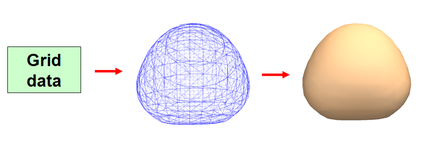

第一步，输入格点数据。若要构建电子密度等值面，就必须先计算出至少能涵盖等值面空间范围的立方区域内的电子密度格点数据。  
第二步，将格点数据转化为等值面，等值面用一堆连续排布的三角形来描述。格点数据的间隔越小，则这个等值面越光滑，越接近精确等值面，顶点数也越多。  
第三步，将每个三角形用一般的计算机图形学的方法渲染出来，就是我们在可视化软件中看到的等值面。

Multiwfn的定量分子表面分析模块主要流程是：  
(1) 根据分子几何坐标，向其四周延展一定距离，以确定电子密度格点数据的空间范围。再根据设定的格点间距，计算出电子密度格点数据。这一步耗时占总耗时很少，因为Multiwfn计算电子密度速度极快，而且支持并行。  
延展的距离通过定量分子表面分析模块中的选项4中的子选项1来设定，比如设为n，那么格点数据空间范围在K方向的最大值就是在K方向原子坐标的最大值基础上延展n乘以此原子范德华半径的距离。默认值对于生成0.001 e/bohr^3等值面来说已经足够，如果要生成的电子密度等值面数值比这更小，则等值面范围就会更大，这时就需要将延展距离进一步设大以免生成的等值面被截断。

(2) 利用MT方法得到分子表面的顶点坐标、顶点之间的连接关系，并记录每个三角形与哪三个顶点相对应。这一步的耗时可以忽略不计。  
MT过程涉及到插值问题，Multiwfn用的是二分法，迭代次数越多，所得顶点位置越精确，也因此定量分子表面分析结果越精确，但耗时也越多。默认是做3次迭代，已足够精确，没必要修改，想调整的话可以用选项4的子选项3。

(3) 对分子表面的顶点中的多余顶点进行消除。之所以要做消除，是由于MT方法产生的表面顶点分布很不均匀，经常出现大量顶点聚集在很小区域内（如下图绿圈标注的区域），实际上这些严重聚集的点只需要用一两个点表示就足够了，多余的顶点可以消除掉，以降低下一步的耗时。Multiwfn会检测每一对儿相连顶点间的距离，如果距离小于阈值，就会消除其中一个，而将另一个的位置挪到它们的平均位置上。这个距离阈值可以用选项4中的子选项2来设，假设设的是x，那么阈值就是x乘以格点间距。默认值大致会消除掉60~70%的顶点，对于分析静电势，这也将节省约60~70%的总耗时。

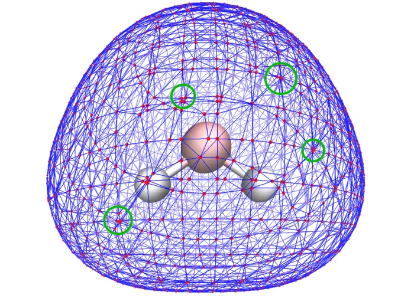

(4) 计算每个表面顶点上的函数值。函数可以是静电势或ALIE，通过选项2来选择，默认是计算静电势。当计算的是静电势时，由于计算静电势需要算复杂的电子积分，这一步的耗时几乎等于整个定量分子表面分析的耗时。

(5) 寻找表面上的极小点和极大点。根据顶点间的连接性关系，如果一个顶点的函数值比它的所有的第一层和第二邻居顶点的函数值都小（都大），那么这个顶点就被认为是极小点（极大点）。

(6) 计算前面提到的各种分子表面描述符。例如分子表面静电势平均值的计算方式为(1/S_tot)*∑[i]S_i*ESP_i，其中S_tot是分子总表面积，也就是分子表面上所有三角形面积的加和。S_i是第i个三角形的面积。ESP_i是第i个三角形的静电势，它是这个三角形的三个顶点上的静电势的平均值。

对于极个别体系，使用默认的格点设定得到的极值点分布可能出现一些假象，通常有四种情况：  
(1) 极值点分布与分子结构对称性不符。当然，严格相符是不可能的，因为表面顶点的分布并不满足分子对称性，但是合理情况下找出的极值点位置应该基本和分子结构对称性偏差不大。如果比如一个Cs对称性平面分子，在其中一侧有个极值点，而在另一侧对应的位置却没有，说明要么是这个找出来的极值点本不该存在，也有可能是另一侧少找出一个极值点。  
(2) 凭经验断定某处本该出现极值点，但是实际却没有找出来，或者本该出现几个距离比较近的极值点，但是实际上只找到了一两个。  
(3) 某个极值点旁边出现一个本不该出现的离它很近的极值点。  
(4) 找出的极值点的位置和真实极值点位置距离偏离较大。  
出现这些假象的主要原因是格点数据间隔偏大。将格点间距通过选项3调小，就可以有效避免这些假象，格点间距无限小的时候结果将无穷精确。默认的格点间距是权衡精度与计算量和资源占用量得到的值。想要更精确的结果可以适当调低它，但由于会造成分子表面顶点数迅速增多，故计算这些顶点的函数值的耗时也越长（这是对于分析静电势来说，计算ALIE的耗时可忽略不计）。调低到默认值的60%时已经非常精确了，不宜再调低。  
当然，表面描述符的计算精度也是随格点间距减小而增加。计算表面描述符对格点间距的要求并不像搜索极值点那么高，如果只是想得到表面描述符的话，将格点间距设为默认值的两倍时结果依然是可靠的，而计算量却能减少几倍。

## 3 分子表面的静电势分析实例

这里我们先分析苯酚。任何Multiwfn所支持的含有波函数信息的文件都可以作为此任务的输入文件，比如.wfn、.fch、.molden等，详见《详谈Multiwfn支持的输入文件类型、产生方法以及相互转换》（<http://sobereva.com/379>）。用Gaussian运行下面的输入文件就可以得到B3LYP/6-31G**级别下苯酚的.wfn文件。通常B3LYP/6-31G**级别的波函数已经能定性正确重现分子表面的静电势分布了，进一步提高基组和理论级别对静电势影响一般不会特别显著，本文例子若未注明均是在此级别下计算的。  
# b3lyp/6-31g** opt out=wfn  
[空行]  
phenol  
[空行]  
0 1  
 C                  0.02049800   -1.85749600    0.00000000  
 C                  1.22053900   -1.14011200    0.00000000  
 C                  1.21812700    0.25255100    0.00000000  
 C                  0.00000000    0.94134000    0.00000000  
 C                 -1.20588400    0.23260100    0.00000000  
 C                 -1.18935500   -1.16319600    0.00000000  
 H                  0.02983500   -2.94340300    0.00000000  
 H                  2.16972400   -1.66964600    0.00000000  
 H                  2.14221700    0.82214600    0.00000000  
 H                 -2.15252200    0.77084100    0.00000000  
 H                 -2.13105300   -1.70584400    0.00000000  
 O                  0.05149400    2.30933400    0.00000000  
 H                 -0.85371200    2.65710700    0.00000000  
[空行]  
C:\phenol.wfn  
[空行]  
[空行]

启动Multiwfn，依次输入  
C:\phenol.wfn   //文件名  
12  //定量分子表面分析功能  
0   //开始分析。默认的是分析静电势

由于计算静电势较为耗时，所以需要耐心等一会儿。目前主流的四核机子花费1分钟左右。之后，屏幕上会出现以下信息：

      ================= Summary of surface analysis =================  
Volume:   840.76822 Bohr^3  ( 124.58902 Angstrom^3)  
Overall surface area:         478.87396 Bohr^2  ( 134.09839 Angstrom^2)  
Positive surface area:        236.05203 Bohr^2  (  66.10131 Angstrom^2)  
Negative surface area:        242.82193 Bohr^2  (  67.99708 Angstrom^2)  
Overall average value:    0.00006729 a.u. (   0.04222108 kcal/mol)  
Positive average value:   0.01773134 a.u. (  11.12570370 kcal/mol)  
Negative average value:  -0.01710428 a.u. ( -10.73225294 kcal/mol)  
Overall variance (sigma^2_tot):  0.00038566 a.u.^2 ( 151.83843791 (kcal/mol)^2)  
Positive variance:        0.00028503 a.u.^2 ( 112.21695420 (kcal/mol)^2)  
Negative variance:        0.00010064 a.u.^2 (  39.62148371 (kcal/mol)^2)  
Balance of charges (miu):   0.19285271  
Product of sigma^2_tot and miu:   0.00007438 a.u.^2 (  29.2824550 (kcal/mol)^2)  
Internal charge separation (Pi):   0.01741439 a.u. (  10.92683016 kcal/mol)  
Molecular polarity index:   0.47384207 eV (     10.92707 kcal/mol)  
Nonpolar surface area (|ESP| <= 10 kcal/mol):     73.31 Angstrom^2  ( 54.67 %)  
Polar surface area (|ESP| > 10 kcal/mol):         60.79 Angstrom^2  ( 45.33 %)

第一行是分子范德华体积，后面的都是前面提到过的分子表面描述符，在手册3.15.1节有详细说明。其中包括分子整体表面积，静电势正值/负值区域表面积，整体/正值/负值区域的静电势平均值和方差（后者用于衡量静电势的波动程度）、静电势平衡程度等等。这些量对于构建QSPR模型来预测分子凝聚相性质（如沸点、密度、LogP）很有意义，这种基于分子表面静电势性质的QSPR关系也被特称为GIPF (general interaction properties function)。笔者专门在另一篇文章中有详谈：《使用Multiwfn预测晶体密度、蒸发焓、沸点、溶解自由能等性质》（<http://sobereva.com/337>）。输出的分子极性指数、极性和非极性表面积对于讨论分子的极性非常有用，见《谈谈如何衡量分子的极性》（<http://sobereva.com/518>）。

然后还会看到这些分子表面静电势极值点信息：

Number of surface minima:     3  
   #       a.u.         eV      kcal/mol           X/Y/Z coordinate(Angstrom)  
     1 -0.02768237   -0.753276  -17.369580       0.108653  -1.078708  -1.896855  
     2 -0.02767035   -0.752948  -17.362035       0.186791  -0.994546   1.876438  
*    3 -0.04167254   -1.133968  -26.147853       1.461372   3.343026  -0.003233

Number of surface maxima:     5  
   #       a.u.         eV      kcal/mol           X/Y/Z coordinate(Angstrom)  
     1  0.02070473    0.563404   12.991390      -3.401136  -2.205347   0.018349  
*    2  0.08186700    2.227714   51.368267      -1.953807   3.103544   0.023402  
     3  0.01735680    0.472303   10.890700       0.051211  -4.308061   0.028541  
     4  0.01776816    0.483496   11.148810       3.364233  -2.325592   0.023073  
     5  0.01379213    0.375303    8.654010       3.475490   1.099533   0.016113

这表明表面静电势极小点和极大点分别有3个和5个，静电势的数值用三种常用单位分别列出，它们的坐标也一并给出。打星号的那两个极值点分别是最小点和最大点。如果想把这些信息从屏幕上拷到文本编辑器等地方，可参见手册5.4节介绍的方法。

此时屏幕上可以看到很多后处理选项，比如将极值点位置输出到文本文件或pdb文件、将表面顶点输出到pdb文件、将函数值在一定范围内的极大/极小点删除（利用此功能，可以只将函数值较大的极大点以及函数值较小的极小点保留而去掉其它意义不大的极值点）、计算各个原子或片段对应的分子局部表面的统计特征。若选择选项0，就会蹦出图形窗口，显示分子结构和极值点位置，如下所示

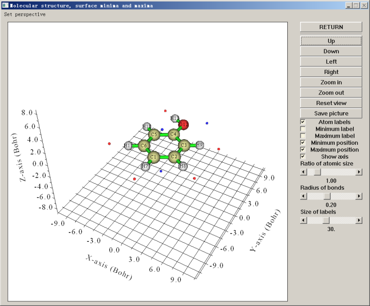

图中蓝点代表极小点，红点代表极大点。利用右侧的复选框可以控制是否让它们显示出来。从这个角度看，临界点与原子的对应关系不是很清楚。我们将Ratio of atomic size拉到4.0，此时每个分子球的半径就成了原子范德华半径，放到一起就表现出了近似的分子范德华表面，由于这种近似的范德华表面比0.001 e/bohr^3定义的范德华表面一般略小，所以不会淹没临界点。与此同时，利用up down left right按钮将视角调成垂直于分子平面，并且选上Minimum label和Maximum label将每个极值点的编号显示出来，就能得到下面的图，极值点与原子的对应关系已能看得很清楚了

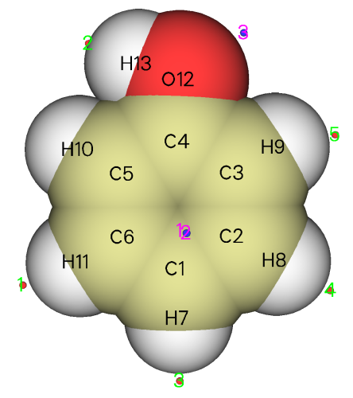

绿字标注的是极大点的序号，可见在氢附近的分子表面上都有静电势极大点，这是因为氢的电负性小于碳、氧，因此此体系中氢原子都显正电性。从前面输出的极大点数据看，羟基氢对应的极大点是最大点，其值51.368267 kcal/mol比其它各极大点都大好几倍，这是由于氧比碳吸电子能力明显更强，故羟基氢的正电性更显著。H10不像其它氢那样有对应的极大点，这也是因为羟基氢的正电性太强了，造成其附近一大片分子表面上的静电势都较大，淹没了H10附近区域，因此H10较弱的正电性对静电势的影响体现得就不明显了，无法造成极大点了。用粉字标注的3号极小点是由于羟基氧的孤对电子密集的电子云产生的，它也是最小点，静电势值为-26.147853 kcal/mol。1号和2号极小点体现的是丰富的pi电子云对静电势的显著负贡献，二者是以分子平面为对称的，所以在当前视角下它们是重合的。从这两个极小点位置和原子球涵盖的区域可以看出，在羟基对位原子附近分子表面的静电势比在其它碳原子附近更负，因此更容易被亲电试剂所进攻，这也在一定程度上解释了羟基是邻对位取代基。此例也同时体现出了静电势分析反应位点的局限性，静电势没能预测出羟基也可以使邻位碳变得易于被亲电试剂进攻，而且，氧的孤对电子对应的是静电势最小点，因此貌似最容易发生亲电反应，但事实上反应并不发生在这里。

通过静电势极值点，我们可以解释苯酚二聚体为何是下面这种结构

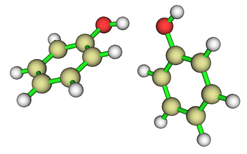

从极值点分析可知，羟基氢对应表面静电势最大点，而羟基氧对应最小点，因此这两个原子最容易靠静电相互作用结合到一起，而且是最大点正冲着最小点的这种朝向，这可以使二聚体能量最大程度降低。这也间接说明了，常规氢键的本质很大程度上可以解释为静电相互作用（但对于强氢键，共价成份不可忽视）。

这里再来看两个例子。下图左边是环丙烷的结构和分子表面静电势极值点，右边是Multiwfn的主功能5计算的它的电子密度拉普拉斯函数0.35等值面图，蓝色为负值（电子聚集区域）。

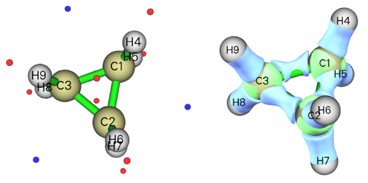

正如前文提到过的，在强张力的C-C键附近的分子表面会出现静电势极小点。之所以会出现这种情况，通过电子密度拉普拉斯函数等值面图可以解释。由图可见，由于环存在很强张力，导致C-C之间的电子密度聚集区域一定程度上被往外“挤”出去了一点，而不是完全处在C-C连线上。正是这部分的电子密度对静电势的负贡献使分子表面产生了静电势极小点。

在WIREs Comput Mol Sci,2,1一文中有下面的图，左边是F2---HF二聚体的真实结构，表面上看起来出现这样的结构有点难以理解。作者将原因解释为在这种结构下F的孤对电子与HF反键sigma轨道间的相互作用会造成能量降低，使结构稳定，如右图所示

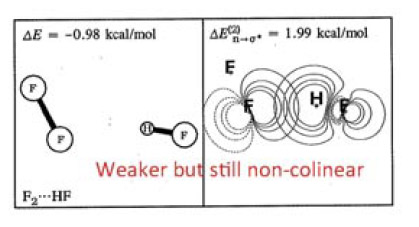

实际上，通过静电势分析，也同样可以解释出现这种结构的原因，而且通过静电势来解释明显更有意义、原理上严格清楚得多得多，被接受程度更高。下图是F2和HF的各自分子表面上静电势极值点分布。

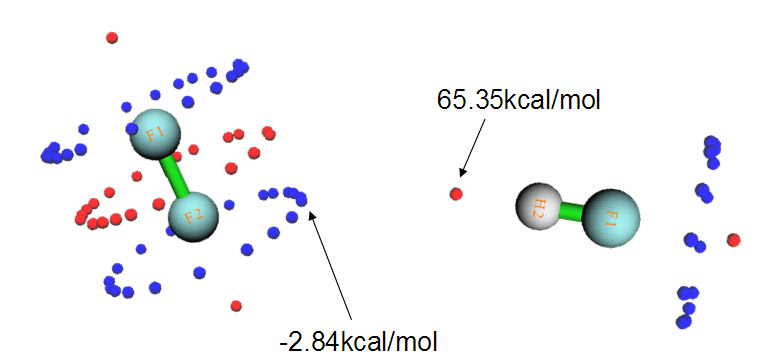

F2中很多点组成了三个环形，这是因为F2是轴对称的，每个环上的点的数值都是相同（简并）的。蓝色那圈圆环对应于F的孤对电子造成的静电势极小点，而分子轴线两端的两个极大点对应于所谓的“sigma穴”，它是指某些第四至第七主族原子在某些环境下形成sigma键后，在sigma键轴末端会出现一小块静电势比旁边更正的区域。在HF中，F附近的情况和F2中类似，与氢对应的静电势最大点数值高达65.35 kcal/mol（因此容易形成很强的氢键）。如果将F2和HF的图按照实际二聚体中它们的相对朝向摆放，也就是如上图那样，就会发现，HF的氢对应的静电势最大点正好对着F2的静电势极小点，当它们以这种朝向接近后，静电势的正负区域的互补必会使能量很大程度降低。因此，通过静电势极值点分布，可以很好地解释为什么F2---HF二聚体是这种结构。

这种静电势极值点分析方法对于研究通过sigma穴以及近来提出的pi穴相互作用的体系极其有用，前者就是卤键出现的根本原因。Politzer等人利用这种方法分析了大量这类体系，有兴趣的读者可参考以下文献，  
J.Mol.Model.,13,305、J.Mol.Model.,15,723、J.Mol.Model.,13,291、J.Mol.Model.,18,541、IJQC,107,3046、PCCP,12,7748  
在其中对一系列分子的研究中会看到静电势最大值和最小值与分子间相互作用能有很强相关性。例如IJQC,107,3046一文中，讨论了NH3通过氮的孤对电子与SeF2及SF2上的Se和S的sigma穴形成的复合物。SF2和SeF2的表面静电势最大值（对应于S和Se的sigma穴）分别为34.4和41.8 kcal/mol，显然后者更易于与Lewis碱结合，这解释了为什么H3N---SF2的相互作用能-7.7kcal/mol比H3N---SeF2的相互作用能-12.2kcal/mol要小。

需要注意的是分子间并非仅存在静电作用，而且分子间静电相互作用涉及到所有原子，另外当分子接近过程中几何结构、电子分布相对于自由状态会有一定调整，所以仅靠静电势大点、极小点的位置和数值的分析方法不可能对于各种复合物体系都完全适用。当你发现这种静电势极值点分析结果合乎预期，能说明问题，那么就可以从这个角度去讨论；如果和期望的不符，那么说明还有更多因素需要考虑，当前研究方法过于粗糙。

## 4 分子表面的平均局部离子化能分析实例

由于ALIE依赖于分子轨道能量，所以必须用HF或DFT波函数。对于典型的杂化泛函，如B3LYP，计算的轨道电离能（相应分子轨道能量的绝对值）有这样的趋势：DFT计算的i轨道电离能 < 实验得到的i轨道电离能 < HF计算的i轨道电离能。虽然DFT计算的轨道电离能与实验值有一定偏差，但是对每种杂化泛函，这个偏差都是呈系统性的。根据ALIE定义可知，如果对每个轨道电离能加上一个常数，等于ALIE值加上这个常数。由于研究分子表面上ALIE时主要研究的是它的相对值而非绝对值，因此DFT的轨道电离能的系统偏差对分析结果带来的影响可以较好抵消，故使用DFT波函数研究ALIE是可靠的。像计算静电势一样，使用B3LYP/6-31G**等级的波函数就可以得到不错的结果。HF轨道电离能比实验值高估的程度的系统性则相对来说不很好，从这个角度讲不如DFT适合计算ALIE。

这里还是以分析苯酚为例进行说明。启动Multiwfn后依次输入  
C:\phenol.wfn  
12  
2  //设定映射到分子表面上的函数  
2  //将函数选为平均局部离子化能  
0  //开始分析  
由于计算ALIE非常快，整个分析经过几秒钟就运算完毕了。屏幕上列出了所有分子表面上ALIE的极值点位置和数值，由于ALIE在分子表面上分布比静电势复杂得多，所以找出的极值点也明显多得多。同时屏幕上也列出了分子体积和分子表面积，因此，这个Multiwfn的功能其实可以单纯地作为计算分子体积和分子表面积的工具来用。Multiwfn的主功能100里的子功能3也是用于计算范德华体积的，但用的是蒙特卡罗方法，结果和当前方法得到的十分一致，可参考《谈谈分子体积的计算》（<http://sobereva.com/102>）中的讨论。

算完后，还是通过选项0来观看极值点分布，如下所示

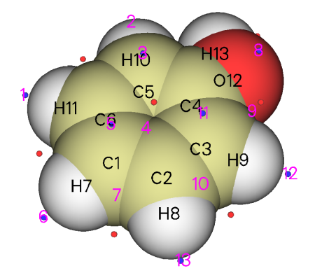

可看到，邻、对位碳原子都明显有对应的极小点，ALIE值都差不多8.7~8.8eV左右，都可算作是最小点，这就说明，邻对位碳原子附近的电子被束缚得最弱，最有可能是反应活性位点，这很好地解释了羟基是邻对位取代基。在氧旁边也有两个ALIE极小点，可认为是氧的容易极化的孤对电子产生的，它们的值为10.49eV，明显大于最小点的值，这也很好地说明亲电反应并不会发生在羟基氧上。

我们再看几个例子，下图左边和右边分别是间二氯苯和硝基苯的ALIE极值点分布。为了清楚起见，没有让极大点显示出来。

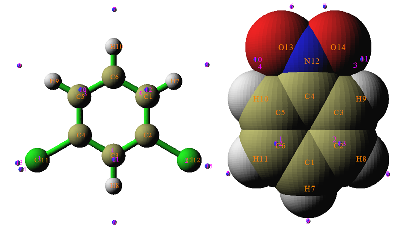

氯是邻对位定位基，对于间二氯苯，两个氯的邻对位定位效应正好能够相叠加，所以理应C1、C3、C5是活性位点。ALIE的极小点分布也确实验证了这一点，在这三个原子上都有极小点出现，为9.7 eV左右。在氯旁边也出现了数值很小的极小点，数值为9.85 eV，看似比9.7 eV大不了多少，所以ALIE分析认为亲电反应也容易发生在氯上，不过实际上显然这并不会发生，这算是ALIE的一点小缺陷，并无大碍。  
对于硝基苯，在间位碳上出现了ALIE最小点，其值为9.94 eV，比起其余极小点的值都小不少，这很好地表现出硝基是间位定位基，反应容易发生在间位碳上。

由以上例子可见，用ALIE判断反应位点可靠性很高，比使用静电势分析反应位点往往更可靠、结果更清晰。但之前也提到了，ALIE和静电势是互补的，单靠ALIE判断往往是不行的，这里也举一个例子，预测吡咯的反应位点。

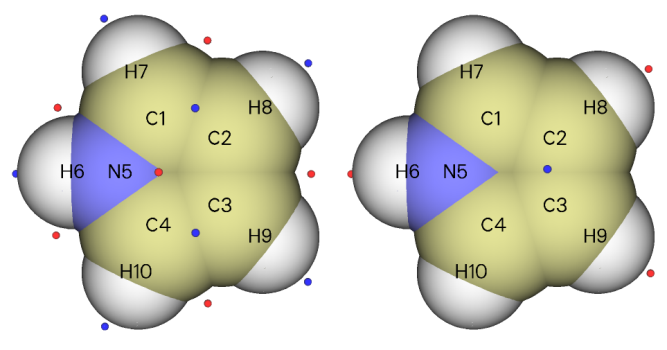

上图左边是ALIE极小点分布。可见，极小点落在了邻位和间位碳之间，因此我们没法判断到底是邻位碳容易反应还是间位碳容易反应，或者说，当分子离得比较近后它们发生反应的可能性一样大。那么，预测实验上的反应位点就还得看亲电试剂更容易接近哪个碳。上图右边是静电势极小点图，此图表明在两个间位碳之间静电势最小，容易吸引亲电试剂。将ALIE和静电势的分析结合起来就能得出吡咯的间位碳最有可能是反应位点的结论。实际上，气相实验结果也确实证明了这个预测是正确的。

使用ALIE分析呋喃时会发现ALIE极小点也是落在邻位和间位碳之间，只是稍微偏邻位碳一点，因此也很难单纯靠ALIE分析下定结论亲电反应最可能发生在邻位还是间位碳上。而通过分子表面静电势极值点分析，会发现在氧的孤对电子附近的分子表面上有一个数值为-20.6 kcal/mol的静电势最小点，在两个间位碳之间有一个-15.2 kcal/mol的极小点，显然亲电试剂更容易被拉向氧的那边，因此比起间位碳更容易接触到邻位碳，故可以预测反应位点是在邻位碳上，事实也确实如此。

## 5 使用VMD程序可视化静电势和平均局部离子化能

基于Multiwfn输出的文件，利用VMD，可以非常容易、快速地绘制效果极好的静电势、ALIE着色的分子表面图，而且表面极值点位置也可以显示在上面、可以方便地查询它们的数值，这部分内容请参见  
使用Multiwfn+VMD快速地绘制静电势着色的分子范德华表面图和分子间穿透图（含视频演示）  
<http://sobereva.com/443>（<http://bbs.keinsci.com/thread-11080-1-1.html>）

使用Multiwfn和VMD绘制平均局部离子化能(ALIE)着色的分子表面图（含视频演示）  
<http://sobereva.com/514>（<http://bbs.keinsci.com/thread-14632-1-1.html>）

巨大体系的范德华表面静电势图的快速绘制方法  
<http://sobereva.com/481>（<http://bbs.keinsci.com/thread-13140-1-1.html>）

使用Multiwfn结合VMD分析和绘制分子表面静电势分布  
<http://sobereva.com/196>
