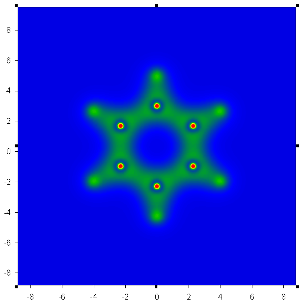
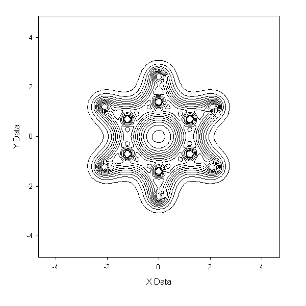
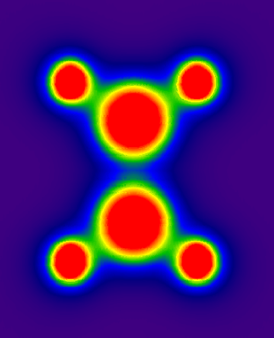
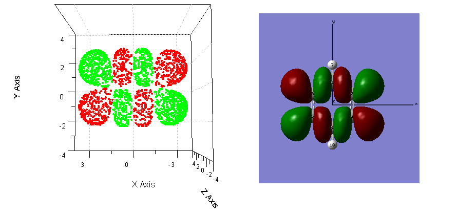

**注意：GsGrid的全部功能早已经融合到了Multiwfn (<http://sobereva.com/multiwfn>)当中作为主功能13，故GsGrid不再更新。**

GsGrid V1.6  
Extract data from Gaussian grid file and grid file calculation  
Programmed by Sobereva, 2009-Oct-7  
Bug report or recommend: Sobereva@sina.com

1. 更新记录：  
V1.0 最初版本，包含前四项功能。  
V1.1 将输入输出单位由以前的波尔半径改为埃。加入了输出一定范围内平面的平均值的功能。  
V1.3 修正了以前版本严重bug（即提取XZ平面数据得到的结果有时会偏差较大），新增功能8、功能9，用于得到自定义平面的格点数据。  
V1.4 提高了output.txt中的数据输出精度（坐标精度不变），小数部分扩展为15位（整数部分最大5位），加入了格点文件计算功能。  
V1.5 修正格点文件类型判断方式，使cube关键字生成的分子轨道格点文件可直接被gsgrid正确读取。新增支持多分子轨道格点文件。  
V1.5.1 修正一个载入某些格点文件时出错的bug。  
V1.5.2 修正读取多MO的格点文件失败的bug。  
V1.6 加入了提取等值面上格点的功能，并可以将另外格点文件投影到某等值面上

2. GsGrid简介  
Gaussian
提供了cubegen工具，以及cube、prop选项可以得到格点文件。缺点是数据点没有对应的坐标信息，而且也无法提取某个平面的数据作图。虽然支持
格点文件的可视化软件很多，GaussView较新版本及ChemCraft可以直接显示某个自定义平面上的等值线（前者支持）或填色图（后者支持），但
是程序自建绘图功能极为有限，较为粗糙，不适合作为文献插图，无法导出数据在专业作图软件中自定义绘制，另外这两个软件也是收费的。至于molden，没
有纯粹的windows版本，界面颇不友好。GsGrid主要为解决这些问题制作。

对于格点运算，虽然ChemCraft和cubman都能实现，但是所支持的运算操作各有不足，gsgrid从v1.4开始支持丰富的格点运算操作，范围超过ChemCraft和cubman支持操作的并集。

虽
然很多软件，如果gaussview、Moliso等都可以将某个属性投影到某个等值面上并以颜色表示数值大小，比如最常见的就是将分子静电势(MEP)
投影到电子密度为0.001的等值面，用以研究分子VDW表面的静电势。然而这些软件并不提供将等值面上的数值输出的功能，只能用颜色显示，GsGrid
弥补了这一不足。

2. GsGrid功能介绍  
GsGrid目前支持6大类功能  
第一类功能（程序中第1项）：把格点文件的数据提取出来，附上每个数据点的坐标。见例1。  
第二类功能（程序中第2-4项）：选取指定的XY/YZ/XZ平面，得到这个平面上的数据点以便做图。见例2。  
第三类功能（程序中第5-7项）：将一定范围内平面的数据取平均输出，比如Z值在-3至3.5埃之间的平面的数据取平均输出。  
第
四类功能（程序中第8-9项）：通过指定三个原子，或者自行输入三个点的坐标，定义一个平面，得到此平面的上的格点数据。此平面上的数据点可以直接输出，
但是数据点并不在一个平面上，不方便做图。程序可以将此平面与XY平面的相交线做为轴，旋转此平面，使数据转移至XY平面，即此时数据点Z值皆为0，随后
可通过绘图软件做contour图。见例3。  
第五类功能（程序中第10项）：  
格点文件中每个数据对某个常数进行加减乘除（子菜单1/3/5/7项）  
格点文件中每个数据对另一个格点文件对应项进行加减乘除（子菜单2/4/6/8项）  
格点文件中每个数据求幂（子菜单第9项）；格点文件中每个数据对另一个格点文件对应项进行平方和、平方差、求平均操作（子菜单10/11/12项）  
格点文件中每个数据求绝对值（子菜单第13项）  
操作完毕后会输出新的格点文件，新的格点文件可继续使用gsgrid进行操作。见例4、例5。  
第六类功能（程序中第11-12项）：第11项功能为提取某个等值面上的格点。第12项功能能够将代表某个属性的格点文件A投影到格点文件B的数值所定义的等值面上，输出文件中包含这些等值面上的格点的坐标和A格点文件中坐标相对应的格点的数值。见例6、例7。

3. 例子

以下例子建议初学者从头看一遍。

例1：得到空间中每个坐标点的静电势  
用高斯计算某个体系，写明%chk，然后用formchk将chk转换为fch，例如得到marioholic.fch。cubegen.exe在高斯目录下，将cubegen程序与marioholic.fch放到同一个文件夹，在dos中进入相应目录下运行：  
cubegen 0 potential marioholic.fch aneta_langerova.cub 0 h  
就得到了静电势格点文件aneta_langerova.cub。  
（也可以在这个文件夹下用文本编辑器建立一个批处理文件，比如a.bat，内容就是上面这条命令，然后双击运行a.bat）  
运行gsgrid，比如输入：（注：下文//后面皆代表注释，不要输入。换行处就是敲回车）  
c:\aneta_langerova.cub //若.cub文件与gsgrid在同目录，只需输入文件名）  
1 //功能1  
即在相同目录下得到output.txt。里面包含aneta_langerova.cub里每个数据点的数值及其坐标。  
------------------------------------  
例2：画Z=0平面的电子密度图  
先得到电子密度格点文件，运行：cubegen 0 density mizuki_nana.fch otoboku.cub -4 h  
运行gsgrid，输入：  
c:\otoboku.cub  
2 //功能2，提取某XY平面的数据  
0 //设定此XY平面的Z值为0  
得
到output.txt，和例1一样。由于格点文件数据是离散的，故这里面的数据点只包含.cub中的Z值最接近于0的那个平面中的数据点。然后可以放到
sigmaplot等软件做图。以苯分子为例子（压缩包内c6h6.fch），以此法作图得到benzene-density.PNG及benzene-
density-contour.GIF

再比如想得到X在-3.3至5.2范围内的YZ平面上的数据点的平均值，可使用程序第6个功能，运行gsgrid，输入  
c:\otoboku.cub  
6 //功能6  
-3.3 5.2 //Z值范围  
------------------------------------  
例3：得到三个原子定义的平面的静电势图  
设某个分子有三个原子编号为3、6、7，想得到这三个原子定义的平面上的静电势图，但是这三个原子并不平行于XY/YZ/XZ，故不能用程序的2、3、4项功能通过例2的方法做图。在V1.3版中添加了任意平面做图可以实现这个目的。  
cubegen 0 potential ethane.fch 1.cub -4 h //ethane.fch在附件中，这里使用fine格点，否则图像会破碎，见后面说明。  
运行gsgrid，输入：  
c:\1.cub  
8 //功能8  
3,6,7 //输入三个原子序号  
0.014 //以0.014埃为格点-平面临界距离  
y //将平面数据通过旋转投影到XY平面上  
这样得到的结果就像例2，数据点z值皆为0，可以直接用绘图软件做图，使用sigmaplot得到的结果如附件中ethane-PES.PNG所示。

再比如想自定义三个点得到定义的平面的数据，运行gsgrid，输入：  
c:\1.cub  
9  
2.3,1.1,2.55 //第1个点的XYZ  
0.23,1.33,4.5 //第2个点的XYZ  
0,-1.29,3.11 //第3个点的XYZ  
0 //用默认的格点-平面临界距离  
n //不投影至XY平面  
------------------------------------  
例4：得到某体系第4个分子轨道在某XY平面的密度分布  
首先需要得到分子轨道波函数格点文件，运行cubegen 0 mo=4 divokej_bill.fch 1.cub 0 h。  
求每个格点数据的2次方，因为波函数平方为概率密度。运行gsgrid，输入：  
c:\1.cub  
10 //第10项功能，即计算功能  
9 //子菜单第8项功能，求幂  
2 //设定指数，输入的数除了整数外，也可以是小数、负数。要注意底数是负数时指数须为整数，否则结果为NaN。  
z.cub //输出的格点文件，不写路径则生成在当前路径下

假设这个分子轨道由两个电子占据，故每个格点数据应再乘以2，再次启动gsgrid，输入：  
z.cub  
10 //第10项功能，即计算功能  
5 //子菜单第5项功能，乘以一个常数  
2 //每个格点数据乘以2  
lusaint.cub //输出的格点文件  
最后再启动gsgrid，提取lusaint.cub的某XY平面数据即可，见例1。

再例如我们想得到mo=4和mo=5两个分子轨道上占据的电子密度和的格点文件。mo=4的格点文件仍是上面的1.cub，mo=5的格点文件是2.cub。运行gsgrid  
1.cub //先输入第一个格点文件  
10 //第10项功能，即计算功能  
10 //子菜单第10项功能，求平方和，即A^2+B^2  
2.cub //第二个格点文件  
Bakuretsu_Tenishi.cub //输出的格点文件  
若每个轨道是双占据的，再把Bakuretsu_Tenishi.cub用gsgrid乘以常数2即可。

实际上用gsgrid把1.cub和2.cub单独求平方，然后再相加得到的结果和上面一样，这里用子菜单第10项功能是因为比较方便，只需要一步而不必三步。

要注意，两个格点文件间运算，两个格点文件必须是相同体系，有相同的格点数目。  
------------------------------------  
例5：多分子轨道格点文件的读取  
每
个高斯格点文件可以包含多个轨道，从gsgrid
V1.5开始支持这样的格点文件。这里仍然使用例4中的第二个例子，需要获得MO=4和MO=5的总电子密度格点文件。为了方便，我们现在把mo=4和
mo=5的格点都写进一个文件里，例如cubegen 0 mo=4,5 bitboys.fch sob.cub 0 h。运行gsgrid，输入  
sob.cub  
1 //选取的格点文件若包含多个轨道信息，则会出现选择轨道的提示。这里输入1代表选择第一条轨道，即MO=4  
10 //第10项功能，即计算功能  
10 //平方和运算  
sob.cub //第二个格点文件，因为MO=5的轨道就在sob.cub中，所以仍用sob.cub  
2 //选格点文件中第二条轨道，即MO=5  
z.cub //输出文件  
闭壳层体系时再把z.cub的内容乘2即可。这样将多条轨道合并在一个格点文件中用起来比较方便，但是会造成格点文件成倍增大，gsgrid读取也会变慢。

第一个格点文件和第二个格点文件可以包含的轨道数目不同，也可以不是一类内容，如分子轨道与电子密度值，只要格点在数目、空间位置上是对应的即可。

使用gsgrid也可以提取多分子轨道格点文件中某一个轨道的格点文件，即选择那条轨道，使用比如加0或者乘以1的运算。

高
斯的分子轨道（包括多分子轨道）的格点文件与其它类型格点文件的主要区别在于前者的原子数为负，在原子坐标后面会加入分子轨道信息（见后面附带的格点文件
格式说明）。如果第一个格点文件是分子轨道格点文件，则运算后生成的新格点文件也将是分子轨道类型。若格点文件中原子数为正/负，则必须无/有分子轨道信
息，否则格点文件无法被gsgrid正确处理。  
------------------------------------  
例6：提取某个等值面的数据点  
这个例子要用到1.6加入的功能11。下面我们要得到自带的test文件夹下c6h6.fch体系（苯，3-21G）的第19个分子轨道波函数的绝对值为0.02的等值面的格点。首先得到第19个分子轨道的格点文件：  
cubegen 0 mo=19 c6h6.fch c6h6-mo-19.cub -3 h  
使用功能11、12时最好使用中等及以上精细度的格点文件，所以这里使用-3参数即中等精细度。  
运行gsgrid，依次输入：  
c6h6-mo-19.cub  
11            //第11项功能，提取某个等值面的格点  
0.02,0.02    
//这两个数分别定义下界和上届的数值，如果某格点的数值在这个范围内，则这个格点就会输出到output.txt。这里上界和下届输入的数值一样，则程
序会将这个数值的±3%作为上下界，即提取0.0194至0.0206范围内的格点（若不允许有±3%的偏差，得到的数据点太少）。

现在得到了output.txt，但这里只有分子轨道波函数为正值的部分，我们还想得到等值面为-0.02的格点，故把刚才得到的output.txt备份，再次在gsgrid中运行上述命令，0.02,0.02替换为-0.02,-0.02即可。

现在我们将这些格点放到origin里面做三维散点图，正值与负值部分分别用红色和绿色表示，得到了isosurface.PNG文件的左图。可以看到，我们提取的等值面上的格点是正确的，形状与gaussview中显示的此分子轨道波函数的0.02的等值面完全一致。  
------------------------------------  
例7：将静电势投影到电子密度为0.001的等值面  
首先分别得到电子密度和静电势的格点文件，注意它们必须拥有相同格点数，每个格点坐标相等。  
cubegen 0 density c6h6.fch c6h6-m-density.cub -3 h  
cubegen 0 density c6h6.fch c6h6-m-eps.cub -3 h  
运行gsgrid，依次输入：  
c6h6-m-density.cub    //通过这个格点文件确定等值面的格点  
12        //选功能12  
0.001    //等值面数值为0.001  
4         //设定上下限偏差，用百分数表示。这里即设定数值在0.001±4%范围内的格点看做等值面格点  
c6h6-m-eps.cub    //将这个静电势格点文件投影到刚才设的等值面上并输出  
这样我们得到的output.txt中的数据点的坐标就是c6h6-m-density.cub文件中数值为0.001±4%范围所定义的等值面上的格点的坐标，而这些点的数值就是c6h6-m-eps.cub文件中坐标相对应的点的数值。

------------------------------------

关于功能8和功能9的细节说明：  
由
于格点文件的数据点在空间上是规律排布的，若自行定义一个平面，数据点显然不会恰好在平面上。所以想得到某个平面上的数据，就必须将平面附近的数据点投影
到平面上。在gsgrid中，只有数据点与平面垂直距离小于“格点-平面临界距离”的数据点才会被投影，符合要求的数据点投影的方法是沿着法线方向移动至
平面。格点-平面临界距离的设定会影响实际效果，一般用默认值即可（输入0使用建议值）。

有时通过这种投影方法获得的某平面的数据在做等值
线图时会发现图像虽然形状正常，但略有破碎，或者个别点数据怪异。此时可降低格点-平面临界距离来解决，例如改为默认值的1/2、1/4再重新做图，但是
格点-平面临界距离如果太近的话，投影到平面上的格点数太少，图像会变得粗糙。最好的解决方法是生成格点文件时使用fine格点，此时格点密度加大，投影
到平面上的数据准确度较好，可消除图像破碎问题，此时建议将格点-平面临界距离设为推荐值的1/2。

有时得到的等值线图有棱有角，是因为格点文件不够精细造成，亦可通过使用fine格点解决，也可以通过改变等值线或色彩范围、调节格点-平面临界距离来得到一定改善。

将平面的数据转移至XY平面的过程，是以自定义平面与XY平面的交线为轴，旋转自定义平面来实现的。不会使平面上数据得到的图像有任何变形，相当于眼睛垂直于自定义平面观看。

如果定义的平面与XY/YZ/XZ平面平行，程序会予以提示，此时请分别用2、3、4项功能代替，以得到更好结果。

关于8、9项功能使用若有问题或结果异常，请E-mail来信。

4. 使用注意  
使用cubegen时，末尾一定要用h参数。  
cubegen倒数第二个参数可以是-2，-3 和-4 分别对应于关键字Coarse，Medium和Fine。用了fine文件会很大，gsgrid读取也比较慢，但相应地数据点更精细，建议绘制文献图时使用fine。若设为0用默认值，大约与Medium相当。  
gsgrid目前只支持X、Y、Z平移向量与坐标轴X、Y、Z平行的格点文件，即一般情况下的格点文件。

格点文件中所用单位为波尔半径，等于0.529177249埃，读入VMD、gaussview后会被转换为埃。为了与可视化程序保持一致，本程序在读入格点文件时已经将单位转换为埃，输入参数和输出结果都以埃为单位。

5. 使用技巧：  
若想使程序以silent模式运行，也就是敲一个命令即完成指定任务，不必每一步都手动输入，可以编辑一个文件，比如batch.txt，内容如下：  
1.cub  
8  
3,6,7  
0.014  
y  
[空行]  
[空行]  
这样只要运行gsgrid < batch.txt，就可以完成例3中的任务，每一步都根据batch.txt的内容自动输入了。如果处理很多格点文件，这样会方便很多。

6. 附录

Gaussian格点文件格式简介：

例如水的静电势的格点文件  
Title Card Required potenial                   //Title，不被gsgrid处理  
Electrostatic potential from Total SCF Density //Title，不被gsgrid处理  
    3   -4.970736   -4.970736   -4.761332       //原子数（如果是分子轨道格点文件原子数为负值）    原点的X/Y/Z坐标  
   80    0.125841    0.000000    0.000000       //第一个“坐标轴”上有80个数据点，每个数据点间隔为0.12584波尔半径  
   80    0.000000    0.125841    0.000000       //第二个“坐标轴”  
   80    0.000000    0.000000    0.125841       //第三个“坐标轴”  
    8    8.000000    0.000000    0.000000    0.209404      //原子序号(氧)，电子数，X/Y/Z坐标  
    1    1.000000    0.000000    1.481500   -0.837616  
    1    1.000000    0.000000   -1.481500   -0.837616  
//若是分子轨道格点文件，这里有分子轨道信息。第一个数字为格点文件包含的分子轨道的数目，接下来是每个分子轨道的序号。例如3 1 5 7就是代表格点文件含3个分子轨道，分别是1、5、7号。分子轨道信息内容中每10个数字换一行。  
7.33384E-03
7.33602E-03 7.33151E-03 7.31988E-03 7.30070E-03 7.27354E-03  
//每个点的数据，每六个换一行，E13.5格式。如果数据点数不是6的倍数，最低维循环后不足6个数据位置的地方会留空。  
7.23796E-03 7.19353E-03 7.13981E-03 7.07636E-03 7.00279E-03 6.91867E-03  
6.82364E-03 6.71732E-03 6.59939E-03 6.46955E-03 6.32753E-03 6.17312E-03  
......  
这些数据点数据输出的循环次序是：最低维=第三个“坐标轴”（此例即是Z轴），中维=第二个“坐标轴”，最高维=第一个“坐标轴”。

数据点与其对应的坐标关系是：  
a(i,j,k)%x=originx+trans1x*(i-1)+trans2x*(j-1)+trans3x*(k-1)  
a(i,j,k)%y=originy+trans1y*(i-1)+trans2y*(j-1)+trans3y*(k-1)  
a(i,j,k)%z=originz+trans1z*(i-1)+trans2z*(j-1)+trans3z*(k-1)  
trans1/x/y/z代表第一个“坐标轴”三个分量，(或曰：格点的平移矢量)  
trans2/x/y/z代表第二个“坐标轴”三个分量  
trans3/x/y/z代表第三个“坐标轴”三个分量  
originx/y/z代表原点位置  
i、j、k代表某点在各个“坐标轴”上的数据点序号。

如果用cubegen默认设置，一、二、三号坐标轴实际上就相当于笛卡尔坐标轴X/Y/Z，彼此正交。  
如果手动设置网格，可以自定义“坐标轴”的方向，不平行于笛卡尔坐标轴，但这种情况gsgrid只能提取全部数据点(第一个功能)，不能提取指定平面的数据点。

也可以用cube、prop关键字生成格点文件，参见高斯手册，格式与cubegen生成的一样，但更建议使用cubegen来做。

