**AIM键临界点处电子密度拉普拉斯值符号判断相互作用类型失败原因的图形分析**  
Graphical analysis of the reasons for failure to determine the interaction type using the sign of Laplacian of the electron density at AIM bond critical points

文/Sobereva @[北京科音](http://www.keinsci.com/)  
First release：2012-Sep-2   Last update: 2014-Mar-10

本文目的是通过图形方法讨论一下为什么通过AIM键临界点处电子密度拉普拉斯值符号判断相互作用类型很多时候是错误的，本质原因何在，以及如何判断相互作用类型更为可靠。本文体系皆在B3LYP/cc-pVDZ下优化并产生波函数，由Multiwfn 2.5版绘图，此程序可在<http://sobereva.com/multiwfn>免费下载。

电子密度拉普拉斯值定义如下，它代表了电子密度在某处的总曲率。某处它为正，代表此处电子密度发散的；如果为负，代表电子密度是聚集的。

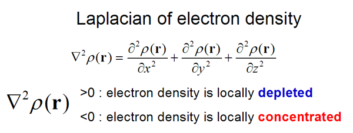

AIM理论中的键临界点(BCP)出现在相邻的相互作用的原子之间，这个点一般被认为是描述相应两个原子相互作用的最关键的点，这个点的性质（密度、能量密度、动能密度、源函数等）常被用来讨论成键特征。

有一个流行的通过AIM理论判断两个原子间相互作用类型的方法，也就是看这两个原子间的键临界点(BCP)的电子密度拉普拉斯值的符号。如果符号为负，就被认为是共价作用，其理由是共价相互作用的原子间由于共享电子对儿，会造成电子密度在成键区域聚集；如果符号为正，就被认为是闭壳层相互作用，比如离子键、氢键、卤键、二氢键、pi-pi堆积之类，这些相互作用本质是静电或范德华作用，不是靠共享电子对儿实现的，因此成键区域没有电子密度的聚集，BCP处拉普拉斯值被顺着键径的方向上的电子密度的正曲率所主导而成为正值。  
（注：闭壳层相互作用是相对于开壳层相互作用而言的。开壳层相互作用其实就是共价相互作用，一般是成键的两个原子各提供一个自旋相反的单电子构成共享电子对儿，就像两个自由基的结合。虽然配位键算是其中一方提供共享电子对儿，形式上看似是两个闭壳层体系间发生的作用，但实际效果上属于极性共价键，所以不归在闭壳层相互作用范畴）

这种判断相互作用的方式很多情况确实管用。乙炔的电子密度拉普拉斯值等值线图如下所示，棕点代表核临界点(NCP)，蓝点代表BCP。实线和虚线分别代表拉普拉斯值为正和为负的区域，很清晰地表现出电子密度在哪里聚集。C-C以及C-H之间BCP点落在虚线范围内，故BCP处拉普拉斯值为负，正确地表现了这两种键都是共价键。

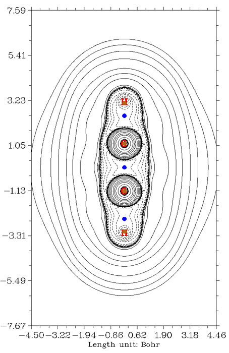

下图是水的拉普拉斯值图，由于氧和氢的电负性相差不少，所以是极性共价键。BCP依然是落在负值区域。相比于C-H键的情况，BCP的位置更偏向于H，这是因为氧吸电子能力比碳强，故分子环境中它在更大的区域内有更高的密度分布，因此O-H键径上的密度极小点，即BCP点，就会进一步往H那边移。

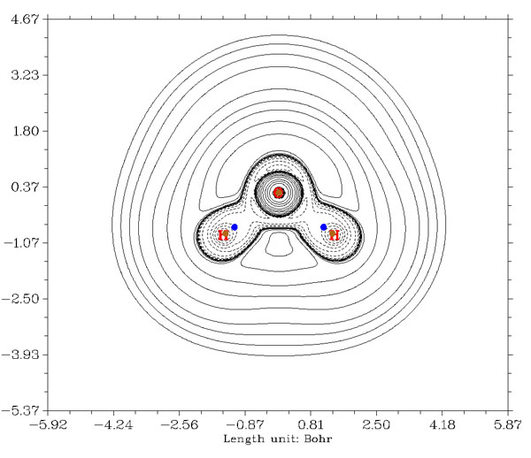

下图是氟化锂的拉普拉斯值图，由于Li和F之间主要靠静电作用维持，两原子间找不到拉普拉斯值为负的区域。BCP处拉普拉斯值符号也显然是为正，表现了这确实是闭壳层相互作用。

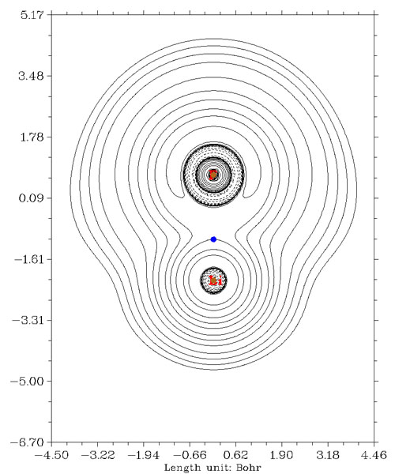

以上三个例子，显示出BCP处拉普拉斯值符号确实能够如实区分原子间相互作用是共价的还是闭壳层的。但是，绝对不代表BCP处拉普拉斯值符号就是区分共价和闭壳层相互作用的绝对标准，尤其对于成键形式难以估计的情况，只靠BCP处拉普拉斯值符号来证明是何种作用方式其可信度是很低的。

对于区分闭壳层相互作用与非极性（或弱极性）共价键，用BCP处拉普拉斯值符号来判断基本是没有问题的。而这种判断方式主要失败的地方通常在于极性较强的共价键。下图是COCl2分子的拉普拉斯值图，C-Cl间的BCP落在了负值区域，然而，C-O的BCP却落在了碳附近的正值区域！因此，仅考察BCP拉普拉斯值符号就会误将C-O键认为是闭壳层相互作用。（这一圈正值区域对应的是碳原子K和L壳层之间的密度发散的区域。）

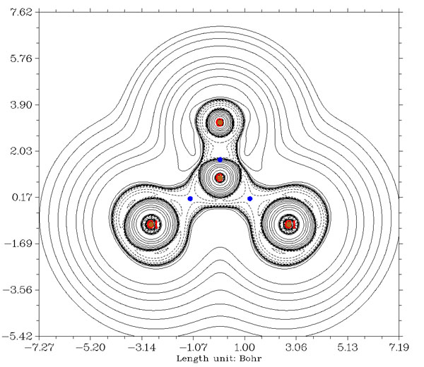

直接从上图考察拉普拉斯值分布，其实可以很清楚地看出C-O间是共价作用，因为在二者成键区域间有明显的电子聚集区域。之所以靠BCP来判断得到错误结论，显然是因为对于当前体系，BCP点的位置并不具备什么化学意义。的确，BCP的定义在数学意义、物理意义上没有什么值得质疑的，十分清楚明确，然而，BCP这个直接基于电子密度进行简单拓扑分析的产物，能说出什么确切的化学上的意义？笔者认为不能。单独从电子密度上，根本体现不出传统化学观念中的孤对电子、化学键等概念，我们看到的基本上只是由于原子核电荷造成的重原子核处有很高的峰，然后向四周整体呈指数型衰减，对任何分子的电子密度分布基本都是这种单调无趣的景象，化学上感兴趣的分子电子结构特征根本展现不出来。BCP在两个相邻原子间的相对位置主要受到的是电子密度指数分布这一大趋势的影响，它从定义上根本没法与键的形成在理论上直接对应上，所以BCP所在位置也没法告诉我们共价键形成的区域。尤其是对于强极性键，电子密度在原子间转移强烈，严重影响了BCP的位置，这往往会使BCP和共价键区域偏离得很严重，以至于，像COCl2的情况，BCP没出现在价层区域，却落到原子里面去了。因此，我们不能总是单纯仅仅靠BCP这一个点，何况还是缺乏化学意义的点的性质来讨论一切相互作用问题。而电子密度拉普拉斯函数则体现出丰富的化学意义，它将原子间形成共价键时价层密度的凝聚很好地表现了出来，也体现了原子壳层等特征，这是因为拉普拉斯算符将电子密度函数中隐藏的难以发现的细微特征加以放大所致，对电子密度拉普拉斯函数做拓扑分析能得到的化学上有用的信息比起对电子密度做拓扑分析要多得多。实际上，不光是BCP缺乏化学意义，AIM理论对原子的划分（划分成原子盆）化学意义也不显著，这直接造成了AIM电荷和化学观念经常冲突。

由于BCP所在位置与共价键形成区域不对应造成通过其位置上拉普拉斯值符号判断相互作用方式失败的例子还有很多，例如硅烷和环硼氮六烷，如下所示，Si-H键和C-N键的BCP都稍稍越过拉普拉斯值正负区域边界而跑到正值区域去了，用其符号而判断成闭壳层相互作用就错了。

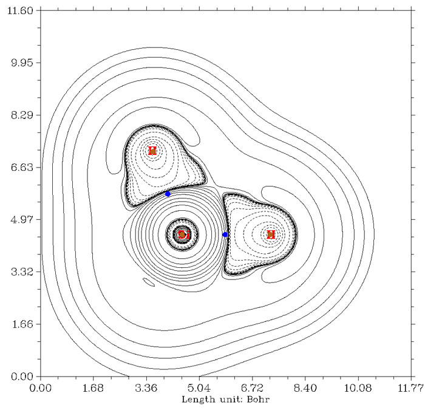

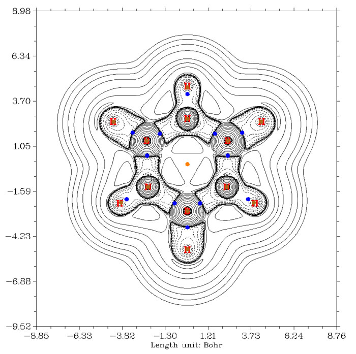

至于金属配位键，用BCP处拉普拉斯值符号来判断更不可靠，例如Ni(CO)4，下图是全电子基组cc-pVDZ-DK结合DKH2相对论计算得到的拉普拉斯值图。Ni-C间的BCP跨过正负值分界线不是一点点了，而是跨过了不少，因此用拉普拉斯值符号标准就会认为羰基和镍是闭壳层相互作用。而实际上这是配位键，是属于共价相互作用范畴的，可以清楚地从图中看到这一点，碳附近有不少电子都冲着镍凝聚起来，如果作ELF图(可参见《电子定域性的图形分析》<http://sobereva.com/63>)，配位键特征会看得更清楚。而羰基C-O键，按照BCP拉普拉斯值符号的标准也被误认为是闭壳层相互作用了。

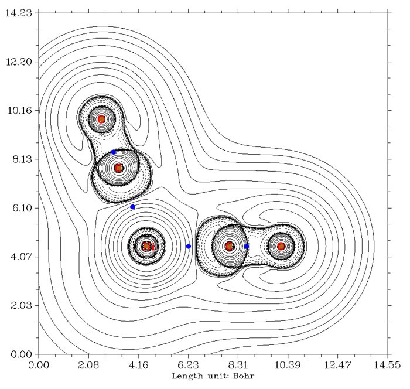

不光是BCP位置不合理造成无法用其上拉普拉斯值符号判断相互作用类型，在个别情况下，由于所谓的非核吸引子的出现，会造成这种判断方法完全没法用。典型的例子就是Li2，拉普拉斯值图如下所示

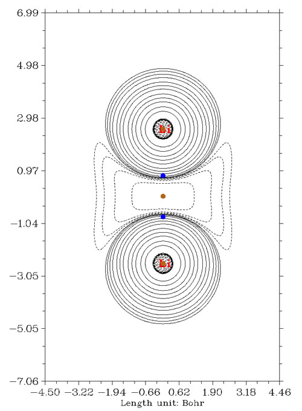

在两个锂正中间，平时本应该是BCP该出现的地方，却有个电子密度极大点，因此形式上属于核临界点，然而这里却又没有原子核，故得名赝原子(pseudoatom)，冠冕堂皇的称呼叫做非核吸引子。由于本该是BCP的地方没有BCP，所以此体系没法靠BCP拉普拉斯值符号判断成键类型。反倒是赝原子和锂原子之间出现了BCP，落在拉普拉斯值正值区域，如果结论是“锂原子和赝原子之间是闭壳层相互作用”，简直莫名其妙，没化学意义。而直接从拉普拉斯值图上看，两个锂之间由于出现明显电子凝聚，应当算共价作用，作ELF图在相应区域也有很大的电子定域性区域，反映出共享电子对儿特征。

对于某些主要靠pi键构成而基本没有sigma键参与的体系，由于其电子密度基本不在键轴上凝聚，位于两原子正中间的BCP处拉普拉斯值会为正值（但不大），因此没有正确表现出这实际上是共价作用。Si2就是这种情况，它由两个pi键构成，其拉普拉斯值图如下

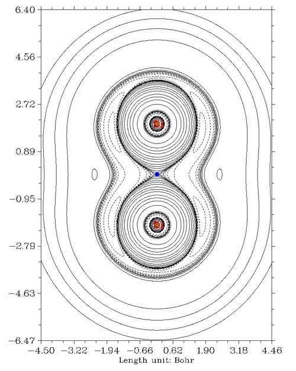

还有一些金属间多重键情况，并不是因为BCP位置不合适造成相互作用方式判断错误，而是电子密度拉普拉斯函数本身没有能力展现这类特殊情况下的共价相互作用特征。搞化学的人比较熟悉的是[Re2Cl8]2-这个例子，1964年Cotton提出其中两个铼之间具有四重键，包括一个sigma，两个pi和一个delta键，它们都是由两个铼的d轨道相互交叠组成的。通过高精度量子化学手段，根据EBO键级的定义，Roos等人得到铼铼之间键级是3.2的结论，见Angew. Chem. Int. Ed., 46, 1469 (2007)。[Re2Cl8]2-的电子密度拉普拉斯函数图如下所示

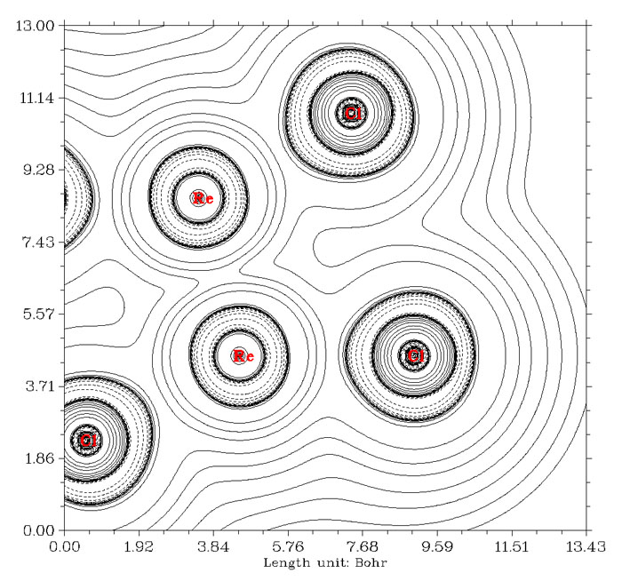

铼铼之间算作共价键是没有问题的，然而图中却看不出它们之间的电子凝聚。笔者认为这是因为d轨道之间有效重叠程度较低，而涉及的空间区域又广，导致共享的电子被平摊开而看不出来在局部凝聚了。其实不光是拉普拉斯函数，ELF函数也只能观察到铼铼之间有一小圈定域性算不上太高的区域。如下所示（这是平面图，能看到Re-Re间连线的两侧有数值稍微高一点的区域，若做成等值面图看起来就是环形等值面）

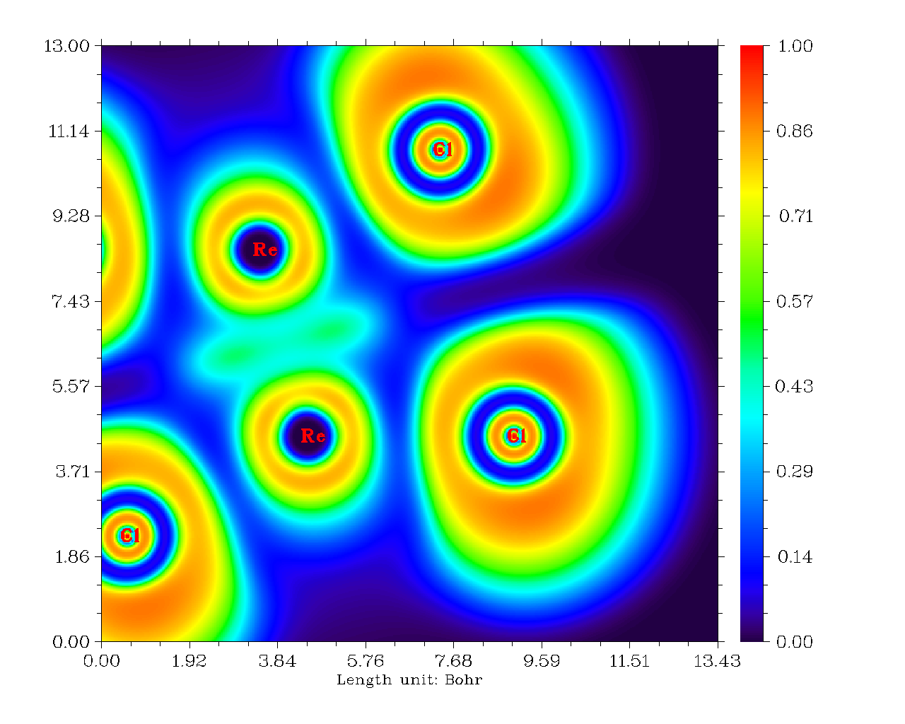

这样无法用拉普拉斯函数反应共价性的金属多重键的例子还有很多，比如Cr2、Mo2等等。

对于电子密度拉普拉斯函数用于电荷转移键体系也特别需要注意。电荷转移键我以后会专门另文介绍。简而言之，电荷转移键就是形式上看上去是共价键，但是本质又不是共价键的键。电负性越大、孤对电子越多的两个原子间通常越容易形成电荷转移键。最为极端的就是F2分子，教科书上几乎都毫无疑问地把它当成典型的共价键，然而实际上，假设只用共价形式描述它来做价键理论计算，这个分子会直接解离掉。正因为电荷转移键本质不是，或不完全是共价键，所以构成电荷转移键的两个原子间电子凝聚程度很低，甚至根本不凝聚。下图左边和右边分别是F2的拉普拉斯函数和密度差图（B3LYP/cc-pVDZ级别已能够合理描述电荷转移键）

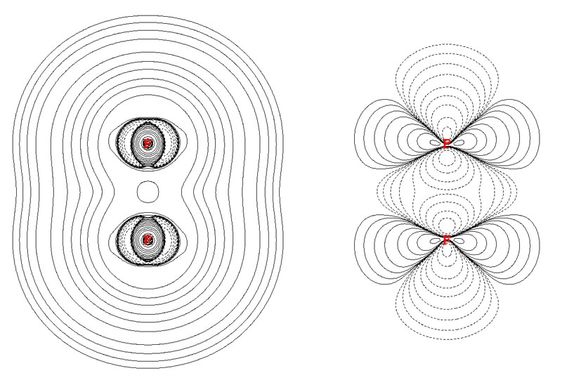

从拉普拉斯值图上可见F2之间完全没有电子凝聚区域。而从密度差图上看，成键后两个原子间不仅密度没有增加，反倒还降低了。

有人误以为F2是普通共价键，由于算出的BCP处拉普拉斯值为正，于是以此为证据说通过BCP的拉普拉斯值符号判断成键类型的方式不可靠，其实是冤枉了这种判断方法。的确，这种判断方法不可靠，但原因不在这里，而是前文提及的那些。

有人提出了判断电荷转移键的判据（可参见<http://www.ch.ic.ac.uk/rzepa/blog/?p=2251>），认为BCP处电子密度显著大于0，而拉普拉斯值也大于0，就算电荷转移键。但这个条件只能算是判断电荷转移键的充分条件，而非必要条件。

其实，金属多重键、电荷转移键、存在赝原子的体系一般不常遇到，BCP处拉普拉斯值符号没法普遍用于区分共价和闭壳层相互作用主要问题还是对于较强极性共价键时BCP的位置缺乏化学意义，代表不了成键区域的情况。其实解决方法也不难，就是研究拉普拉斯值的时候不要仅局限在这么一个点上。我们可以通过作图直观地通过电子凝聚方式判断相互作用类型，当仅靠拉普拉斯值图不容易判断时还可以作ELF图，通常可以得到更鲜明的图景。利用Multiwfn程序，作这些图十分简单，熟练之后，从输入文件名到弹出图像整个过程最多也就用不了10秒钟。笔者也提出了一个定量化的方法，称为拉普拉斯键级，见JPCA,117,3100 (2013)，在Multiwfn程序中对应于主功能9里面的8，它是通过原子间交叠空间内积分拉普拉斯值得到的键级，仅靠这一个键级值就可以反映键的强度和极性的程度，这也比起只考虑BCP一个点的拉普拉斯值要可靠得多。另外，也有人提出应当考虑整条键径上各点的属性。

除了用BCP处拉普拉斯值判断相互作用类型以外，还有人用BCP处的其它属性来判断，例如正定动能密度除以电子密度、正定动能密度垂直于键径的分量除以平行于键径的分量、电子密度Hessian矩阵最大本征值的绝对值除以最小本征值的绝对值。还有人提出应当结合多种属性值综合判断。然而这些判断方法虽然用在不少体系上都没问题，但是找到反例也不难，普适性难以保证。

还有一个很流行的判断方法是看BCP处电子能量密度的符号，若为负，表明是共价作用；若为正，表明是闭壳层相互作用。电子能量密度就是电子正定动能密度和电子势能密度的加和，全空间积分就是电子在当前体系中的能量，它也等价于哈密顿动能密度的负值。这个判据最初是在Angew. Chem. Int. Ed. Engl. 23, 627中提出的，这篇文章写得十分草率，没有道出明确的物理意义。不过这个判断方法的普适性比起靠BCP处的拉普拉斯值符号判断在实际中要好得多，比如Ni(CO)4和LiF的电子能量密度图如下（从Multiwfn 2.5版开始，只要将settings.ini文件中的iuserfunc设为11，则选择要绘制的实空间函数时选“100 User defined function”就等于选了能量密度。）

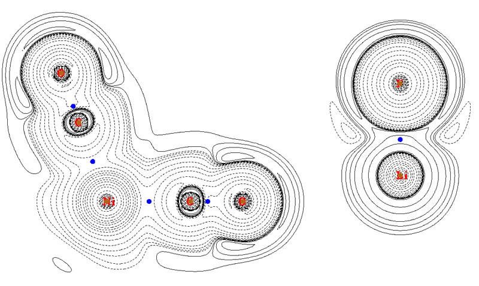

由图可见，Ni-C和C-O的BCP处能量密度都为负，正确地表明是共价作用。而LiF的BCP落在正值区域，表现出闭壳层相互作用。然而，这个判断方法也能轻而易举地找到反例，比如氧化钙的能量密度图如下

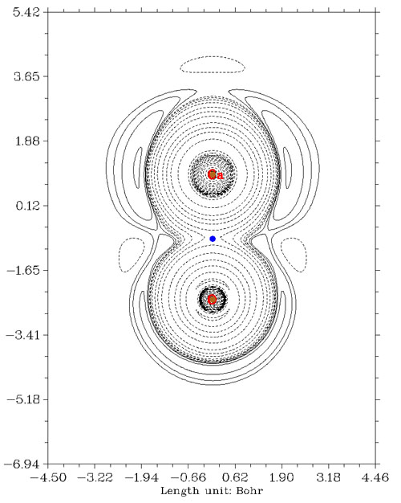

按一般常识，氧化钙是离子相互作用，起码共价性远低于离子性，而且从ELF图上也看不出原子间高定域性共价区域。然而，BCP的能量密度却为负，误认为是共价作用。所以，用这种判据也不要轻信，最让人放心的还是作拉普拉斯值或ELF图，物理意义明确，一目了然。
