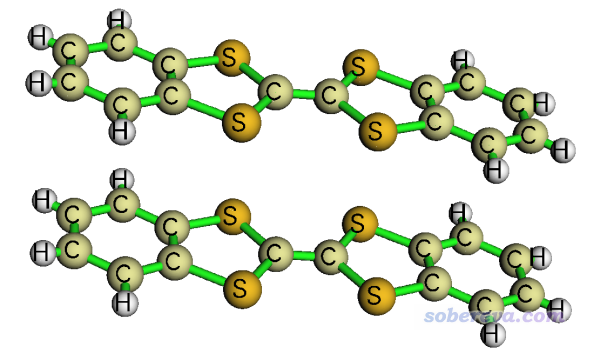
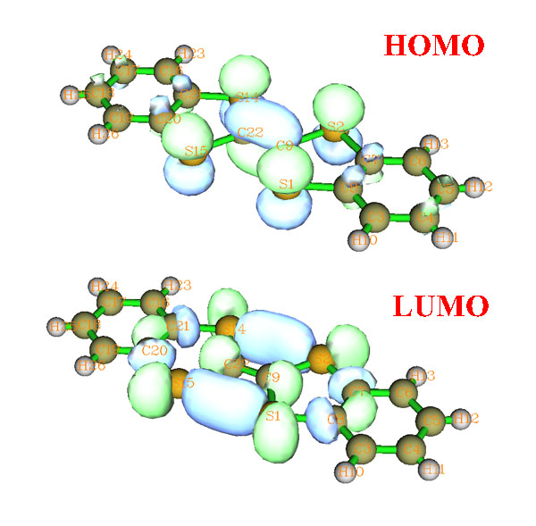
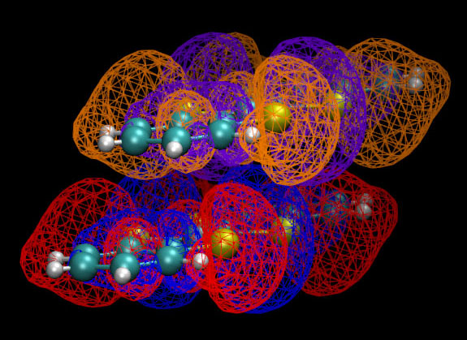
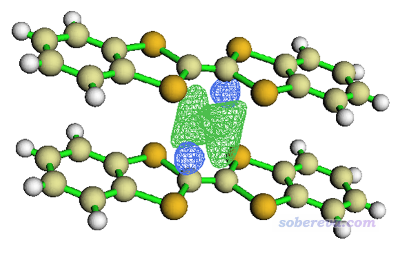
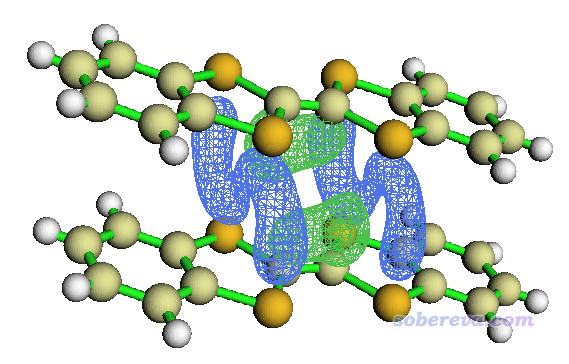

**分子间轨道重叠的图形显示和计算**Display and calculation of intermolecular orbital overlap

文/Sobereva @[北京科音](http://www.keinsci.com/)  2012-Oct-1

注：本文涉及到的非Multiwfn产生的文件都可以在这里下载：<http://sobereva.com/attach/163/intmolorbovlp.rar>

分子间轨道重叠，就是指离得比较近的两个分子，其中一个分子的轨道会与另一个分子的轨道发生重叠。轨道既可以是分子轨道，也可以是定域化轨道等形式。本文讨论的是分子轨道重叠，这有很多用处，比如前线轨道理论涉及到两分子间HOMO-LUMO的重叠；在讨论分子间电荷转移问题时，涉及到两分子间HOMO-HOMO以及LUMO-LUMO轨道的重叠。本文第一节介绍一种笔者提出的图形化显示轨道间重叠的新方法，第二节介绍怎么在Multiwfn程序(<http://sobereva.com/multiwfn>)里精确计算轨道间重叠积分值。

本文的例子是从CCDC数据库里的二苯并-四硫富瓦烯(DB-TTF)的晶体结构中取出的一对儿（下文称二聚体），如下所示

 计算都是在PW91PW91/6-31G*下由Gaussian09进行，结构直接利用晶体数据不做优化。

## 1 分子间轨道重叠的图形显示

DB-TTF的HOMO和LUMO轨道如下所示

对照MO图形和前面给出的二聚体图形，会感觉分析轨道的重叠很不方便，因为这个体系相对较大，MO图形复杂，而且二聚体中单体的相对位置是斜侧着，很难想象哪些区域是轨道以相位相同方式重叠，哪些区域是相位相反重叠，以及重叠程度有多大，重叠积分应该是正还是负。尽管我们可以将这两个LUMO都作出来，通过网格方式显示以便于展现交叠，如下所示，但是图像看起来很乱，难以直观地考察重叠方式

笔者提出一个十分简单的办法，可以让重叠区域、程度、相位匹配方式直接显示出来，也就是：令相应两个轨道波函数值相乘，然后显示等值面。

之所以这么做，原理很简单。两个轨道重叠区域大的地方，乘积必然大，因此等值面能将重叠大的区域勾勒出来。而相同isovalue设定下，等值面越大，则必然重叠程度越高。如果两个轨道在某处相位相同，那么乘积必然为正，相位不同则为负，所以根据等值面对应的符号值就知道两个轨道在相应位置是以相位相同还是相反方式重叠了。下面就介绍下怎么利用Multiwfn通过这种方式显示DB-TTF二聚体的LUMO轨道间的重叠。

从CCDC数据库里提取DB-TTF二聚体结构并经过适当处理后，得到了二聚体pdb文件DB-TTFdimer.pdb。首先，用Multiwfn对这个结构随便计算一种函数的格点数据。这一步的目的只是让Multiwfn自动给出能够包含整个二聚体结构的格点设定。启动Multiwfn，依次输入  
c:\DB-TTFdimer.pdb       //DB-TTFdimer.pdb的路径  
5   //计算格点数据  
100   //用户自定义函数。如果用户不改代码，这个用户自定义”函数值在各处为1，所以不耗任何计算量  
2   //中等质量格点设定  
2   //将格点数据输出到当前目录下的userfunc.cub

将DB-TTFdimer.pdb当中第一个单体的坐标提取出来并保存为Gaussian输入文件DB-TTF1.gjf。Route section写上pw91pw91/6-31G* nosymm  
这里nosymm是为了确保Gaussian不会自动改变这个单体的坐标。用Gaussian计算DB-TTF1.gjf，并且将相应的chk文件转换为DB-TTF1.fch。

再将第DB-TTFdimer.pdb当中第二个单体的坐标提取出来并保存为Gaussian输入文件DB-TTF2.gjf。Route section也写上pw91pw91/6-31G* nosymm并通过Gaussian计算，转换得到DB-TTF2.fch。  
Hint: 如果你想省时间，可以将上一步得到的DB-TTF1.chk复制为DB-TTF2.chk，并且在当前任务计算时写上guess=read。这样，在计算DB-TTF2时就会读取DB-TTF1的收敛的波函数作为初猜（Gaussian自动会对波函数进行平移、旋转以符合DB-TTF2的坐标），由于两个单体的结构几乎完全一致因此波函数基本一致，所以一次迭代就收敛了。

启动Multiwfn，依次输入  
DB-TTF1.fch  
5   //计算格点数据  
0   //自定义运算  
1   //将对1个文件，也就是DB-TTF2.fch进行运算  
*,DB-TTF2.fch   //DB-TTF1的格点数据将对DB-TTF2相应的格点数据进行相乘  
4   //要计算的是轨道波函数  
79   //要算的是第79号轨道，也就是LUMO  
8   //使用某个cube文件中的格点设定。这里不能交由Multiwfn自动判断，否则自动设的格点范围只能容纳得下DB-TTF1的结构  
userfunc.cub  //之前计算出的userfunc.cub的格点设定较好地涵盖了二聚体所在空间范围，所以用它的设定。

现在Multiwfn开始计算DB-TTF1的LUMO格点数据。然后程序让你输入对于DB-TTF2来说计算哪个MO。因为对于它还是计算LUMO，所以还是输入79。然后Multiwfn又开始了计算。算完之后选择2将格点数据输出到当前目录下的MOvalue.cub。

注意计算刚结束时屏幕上会看到  
Summing up all value and multiply differential element:  
  9.069567746881309E-003 （即0.00907）  
这是格点数据每个格点位置的数值乘上空间微元的加和值。实际上，这正是两个LUMO的重叠积分通过立方格点积分方式算出来的结果。由于重叠积分为正，这表明两个LUMO间以相位相同方式叠加为主。从屏幕上还可以看到重叠积分中正值部分和负值部分各自是多少。

目前MOvalue.cub中只含DB-TTF1的坐标信息，在可视化时将看不到DB-TTF2的结构而不便于分析。为了解决这个问题，用文本编辑器打开MOvalue.cub和userfunc.cub，将后者的原子坐标段落（第7行到科学计数法记录的数据之间的部分）复制到前者的相应段落去。并且把前者的原子数信息，即第三行第一个数值从26改成52，之后保存。

启动Multiwfn，载入MOvalue.cub，选0，在图形界面中调整角度，isovalue框里输入0.00006并点回车，界面上方Isosurface style选Use solid face+mesh，就能看到如下的图

图中绿色和蓝色网格包围的区域分别是两个单体的LUMO以相位相同和相反方式重叠的区域，相当清晰直观。也能看得出，相位相同叠加的程度大于相反方式的叠加，这从图形上直接展现了这两个LUMO的重叠积分何故为正。

以上述方式显示两个HOMO之间的重叠，如下所示。isovalue取的是0.0001，如果也取0.00006的话等值面就非常大了。这也说明，HOMO-HOMO间的重叠要比LUMO-LUMO间的重叠程度大得多。这不难理解，因为DB-TTF的HOMO体现的是pi轨道，在垂直于分子平面上延展程度很大。

从图上看，相位相反比相位相同重叠的程度要大，所以重叠积分理应为负值。文本控制台显示的积分值-1.389076184499504E-002，即-0.0139也确实验证了这一点。

## 2 分子间轨道重叠积分的计算

上一节在显示轨道重叠时顺便输出了立方格点积分方式得到的两分子的轨道间的重叠积分。这一节将通过更为准确的解析的方式得到重叠积分，由于不需要计算格点数据，计算也更为省事。

首先，将DB-TTFdimer.pdb保存为Gaussian输入文件DB-TTFdimer.gjf，然后将Route section写为pw91pw91/6-31G* iop(3/33=1) nosymm guess(only)。其中iop(3/33=1)让Gaussian在计算一开始输出基函数间的重叠矩阵信息，这是将要被Multiwfn所利用的。由于并不需要用到二聚体整体的波函数信息，所以写上了guess(only)避免迭代计算以节省时间。用Gaussian计算这个任务，得到DB-TTFdimer.out。

然后，将前文已经生成的DB-TTF1.gjf和DB-TTF2.gjf的route section上都额外添上pop=full，然后分别用Gaussian运行它们，得到DB-TTF1.out和DB-TTF2.out。其中记录的分子轨道系数将被Multiwfn读入。

启动Multiwfn，依次输入  
DB-TTFdimer.out  
100  
15  //计算分子间轨道重叠积分。Multiwfn将先从已载入的DB-TTFdimer.out中读取基函数重叠矩阵  
DB-TTF1.out   //从中载入第一个单体的轨道系数。注意单体out文件的载入顺序必须和单体在二聚体out文件当中出现的先后顺序一致才行。而且必须二聚体和单体计算时都用的是相同的基组。  
DB-TTF2.out   //从中载入第二个单体的轨道系数

此时，只需要输入两个轨道的编号就可以立刻输出它们之间的重叠积分。例如输入47,82就可以输出第一个单体的47号轨道和第二个单体的82号轨道之间的重叠积分。这里我们分别输入78,78和79,79就得到了两个DB-TTF间的HOMO-HOMO及LUMO-LUMO重叠积分，其值为-0.01389242和0.00906935，这个结果和上一节以立方格点积分方式得到的结果完全一致！

如果输入字母o，就会将第一个单体的所有轨道（对应各个行）和第二个单体的所有轨道（对应各个列）的重叠积分矩阵在当前目录下ovlpint.txt文件中输出出来。

Multiwfn也可以基于fch文件计算不同分子的轨道间的重叠积分，此时都用不着写iop(3/33=1)和pop=full那些，更为省事，Multiwfn手册4.100.15节有例子。
