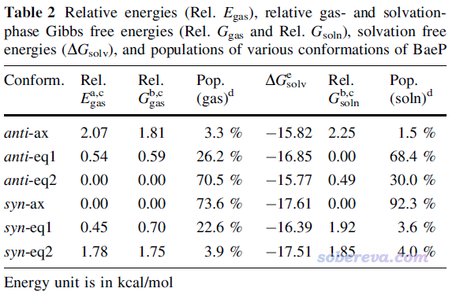
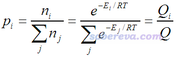
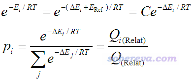
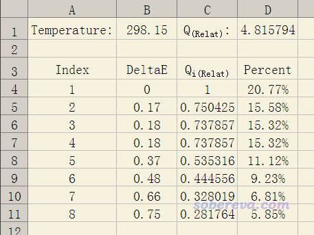
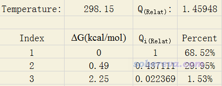
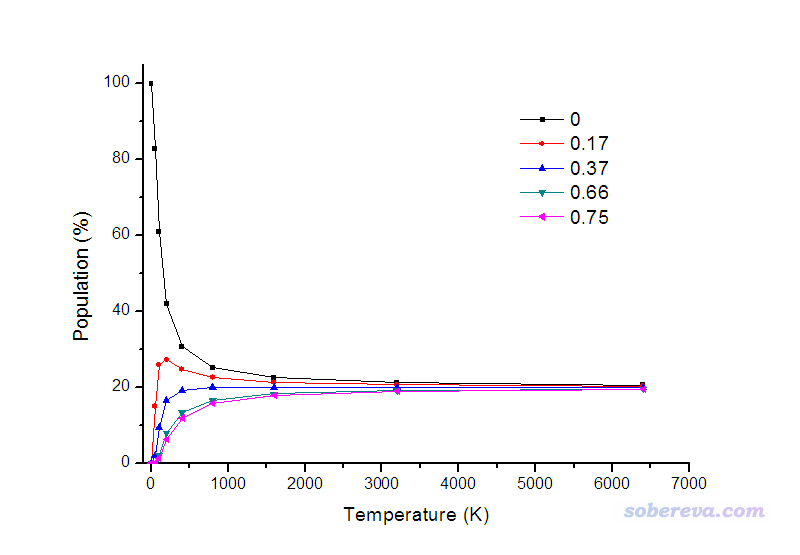

**根据Boltzmann分布计算分子不同构象所占比例**  
Calculation of ratio of different conformations of a molecule according to Boltzmann distribution

文/Sobereva@[北京科音](http://www.keinsci.com)

First release: 2012-Oct-20  Last update: 2020-Apr-13

## 1 前言

一种分子往往有很多构象，每种构象能量各不相同。在平衡状态下，各种构象出现的比例也是不同的。在很多文献里都给出根据Boltzmann分布计算的分子在不同构象下的比例，也经常看到有人问怎么算。实际上计算非常简单，此文专门说明一下。

首先看一个文献中的例子。下面这张图出自笔者的研究文章Struct. Chem. 25, 1521 (2014) DOI:10.1007/s11224-014-0430-6 ，利用Boltzmann分布与相对自由能的关系给出了常温下致癌物benzo[a]pyrene diol epoxide不同构象的出现比例，对anti和syn两种构型是分别算的

其中气相下的构象分布比例Pop.(gas)由气相下的构象间相对自由能Rel. Ggas得到。溶剂环境，尤其是极性溶剂，对构象分布影响往往非常大，千万不要忽略溶剂效应。上图中ΔGsolv是在水中的溶解自由能，加到气相下的相对自由能上就成了溶剂下的相对自由能Rel. Gsoln，由此可以计算出溶剂下的构象分布比例Pop. (soln)。如果你不会算自由能的话，看《谈谈隐式溶剂模型下溶解自由能和体系自由能的计算》（<http://sobereva.com/327>）。

Boltzmann分布不仅可以计算不同构象在热平衡状态下的出现比例，还可以计算可以互变的不同构型（比如不同结构的分子团簇）的出现比例。

## 2 构象分布的计算方法

Boltzmann分布的概念在一般的物理化学书上的统计热力学部分都讲过，可以写为

其中p是所占比例，i是构象编号，n_i是处于第i构象的分子数，E是指构象的能量。T是温度(开尔文)，R是理想气体常数。Q称作配分函数。

准确计算分子的绝对能量是极其困难的，只有极小的体系，用极高精度量化方法才能得到定量准确的结果。好在Boltzmann公式按如下方式可以等价地写为只依赖于不同构象间相对能量的形式，相对能量比较容易得到定量准确的结果。

式中E_Ref代表所有构象中能量最低值（参考值），ΔE是相对值，参考值对应的常数项C在计算p的时候同时作为分子分母而消掉了。Q下标上的Relat代表Relative的含义。

根据上面式子，只需利用Excel就可以很容易地计算构象分布比例了。我制作好的Excel表格可以在这里下载：<http://sobereva.com/attach/165/Boltzmann.xls>，表格截图如下所示

在本文一开始我的论文里的例子里可见，在水环境下三个anti构型的不同构象相对自由能分别是0.00、0.49、2.25 kcal/mol，我们想计算出对应的Boltzmann分布比例，就把Excel表格设成下面的样子，不需要的单元格直接删掉即可。可见得到的分布比例和我的论文里给出的完全一样。

需要说明的是，前面所谓的构象的能量是指自由能。所以，必须先优化到相应构象结构，计算电子能量，再做振动分析，把热力学校正量加上去得到自由能。在什么温度下计算分布比例，就应当在什么温度下计算热力学校正量。另外，若想根据Boltzmann公式定量精确地计算各个构象的比例必须把自由能算得很准，推荐用热力学组合方法来算，如G3(MP2)//B3LYP、CBS-QB3等方法，但这些高精度热力学组合方法很昂贵，哪怕是其中较便宜的方法在很好的机子上跑，用于超过30个原子也基本没戏。

使用我开发的Shermo程序可以直接基于量子化学程序的输出文件非常方便地计算出Boltmann分布比例以及构象/构型权重的各种热力学量，非常推荐大家使用，参见《使用Shermo结合量子化学程序方便地计算分子的各种热力学数据》（<http://sobereva.com/552>）。

顺带一提，如果你都不知道一个分子都有什么构象的话，计算构象的Boltzmann分布前需要先做构象搜索。Molclus是我最推荐的构象搜索程序，非常灵活好用还完全免费，详见<http://www.keinsci.com/research/molclus.html>。

## 3 温度对构象分布的影响

假设体系只有相对自由能为0.00, 0.17, 0.37, 0.66, 0.75 kcal/mol的这五种构象，并且忽略温度对自由能的影响，我们可以利用Boltzmann分布关系看看从低温到高温的过程中它们所占比例是如何变化的，如下所示：

从图上看，温度很低时，分子基本都处于能量最低的构象，在0 K时100%处于这种构象。由于几种构象能量差异并不大，在室温级别下其它构象所占比例就已经不可忽视了。当温度无穷高，能量差异已经显不出来了，各种构象所占比例就相等了。不过实际上这图并没有什么物理意义，首先，在计算时忽视了不同温度下各构象自由能的变化；其次，当温度较高时，不同构象之间的界限已经很含糊了，较高的动能可以让分子构象随意变换而几乎无视构象间势垒的存在，因此讨论哪个构象占比例多少已经没有太大意义；而温度极高时，分子就彻底解离了。
