**后记**：从2024年6月更新的Multiwfn开始，Multiwfn支持了结合CP2K对周期性体系做CDA分析，详见《使用Multiwfn结合CP2K对周期性体系做电荷分解分析（CDA）》（<http://sobereva.com/716>）

**使用Multiwfn做电荷分解分析(CDA)、绘制轨道相互作用图**Using Multiwfn to perform charge decomposition analysis (CDA) and plotting orbital interaction diagram

文/Sobereva @[北京科音](http://www.keinsci.com)  
First release: 2012-Nov-7   Last update: 2021-May-28

## 1 前言

电荷分解分析(Charge decomposition analysis, CDA)是基于片段轨道的概念提出的一种将分子片段之间电荷转移分解为轨道的贡献，从而能更深入了解电荷转移本质的方法。这个方法很有意义，如今已被广泛使用。在Multiwfn (<http://sobereva.com/multiwfn>)从2.6版开始加入了这个功能，并且能够直接绘制出轨道相互作用图。本文将详细介绍这个方法的原理，并通过一些实例介绍一下在Multiwfn中的操作。

## 2 原理

### 2.1 片段轨道

在介绍CDA之前先说一下片段轨道(Fragment orbital)的含义。比如对于一个复合物AB，片段A的片段轨道就是指A部分在保持与复合物状态相同的几何结构下，单独做量化计算得到的轨道（本文所谓“轨道”指分子轨道或后HF方法产生的自然轨道）。A的各个片段轨道是正交归一的，B的各个片段轨道也是正交归一的，但A的片段轨道和B的片段轨道之间往往不是正交的，而是有重叠的。复合物AB的轨道可以视为是由A的片段轨道和B的片段轨道相互混合而构成的。这在结构化学教科书里就有很多例子，尤其是讨论配合物中金属与配体成键问题时，经常会有图片描述金属的d轨道与配体的轨道混合构成配合物的轨道，实际上此时金属和它的原子轨道就相当于A和A的片段轨道，配合物和它的分子轨道就相当于B和B的片段轨道。

在量子化学计算中，通常复合物的轨道是以基组所定义的原子中心的基函数来描述的，有多少个基函数就会产生多少个轨道。若计算AB、A、B时所用的基组都一致，且假设计算AB时有NC个基函数，其中NA个在片段A上，另外NB个在B上，则计算复合物时就得到了NC个复合物的轨道，对这两个片段进行单独计算时就会产生NA个A的片段轨道和NB个B的片段轨道。此时可以令这NA+NB个片段轨道作为新的基函数代替原先的NC个原子中心基函数来展开这NC个复合物的轨道，这实际上就是一个基函数的变换。由于基函数数目不变，前后都是NC个，所以这个变换并没有使信息损失。经过这样的变换，就得到了片段轨道在复合物轨道中的展开系数，也得到了片段轨道间的重叠矩阵。利用这样的信息，我们也可以像讨论原子在分子轨道中的成分一样讨论片段轨道在复合物轨道中的成份，这对于了解片段轨道是以何种方式组合成复合物轨道是非常有用的。

### 2.2 CDA及其广义化

CDA方法由Dapprich和Frenking在J. Phys. Chem., 99, 9352 (1995)当中被提出，它直接利用了片段轨道的概念对A、B间的电子转移进行了分解。它定义了三个量：

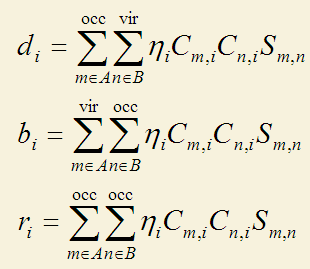

i是复合物轨道标号，m和n分别是A和B片段轨道的标号。其中occ和vir代表加和是对于占据轨道和非占据轨道（虚轨道）。η是复合物轨道占据数。C的m,i矩阵元代表片段轨道m在复合物轨道i中的系数。S是片段轨道间的重叠矩阵。

上式中d代表donation，其d_i表现的是经由复合物轨道i，A的电子向B转移的量，这是由A的占据轨道与B的虚轨道相混合而导致的。b代表back donation，也就是由B向A转移的电子数。为什么这两项是这么定义的可以这么来理解：m和n片段轨道在i复合物轨道中的重叠布居数可以视为是此轨道中m和n共享的电子数。对于d_i，由于m和n分别是占据轨道和虚轨道，所以共享的电子是完全来自于m的。按照Mulliken的均分处理，重叠布居应当有一半划分给m，另一半划分给n，也就是等于说m转移电子给了n，转移的数目就是重叠布居的一半。在d_i和b_i的加和号当中的项就正是m和n的重叠布居的一半，m是占据的还是n是占据的决定了转移的方向，所以d_i和b_i能够代表电子的donation和back-donation的量。

r_i体现了占据的片段轨道在i中的相互作用。正值时表明重叠布居为正，说明在i中占据片段轨道的电子向两个片段重叠区域聚集（至少不是互斥），此时i也体现了成键轨道的特征。如果r_i为负，i中表明由于占据片段轨道间的电子互斥，使得重叠区域电子减少，而向非重叠区域转移。所有复合物轨道的r项之和几乎一定是负值，因为满占据的轨道间总是以互斥效应为主导。由于互斥后电子密度分布发生了变化（极化），故r也被称为互斥极化项。

上述CDA定义有局限性。首先它只能用在闭壳层体系。其次，尽管复合物轨道可以使用自然轨道（其占据数为非整数），然而片段轨道却没法用自然轨道，因为式中没有将片段轨道的占据数考虑进去，而只是用占据和非占据来描述。为了解决这两个局限性，寡人提出了广义化的CDA的定义，如下所示，这个定义就是Multiwfn中所用的定义，详见笔者写的《广义化的电荷分解分析(GCDA)方法》（物理化学进展，4，111-124 (2015) <http://www.hanspub.org/journal/PaperInformation.aspx?paperID=16370>），**使用Multiwfn做CDA分析时除了引用Multiwfn程序原文外也应同时引用此文章**，引用的时候写J. Adv. Phys. Chem., 4, 111-124 (2015), <http://dx.doi.org/10.12677/JAPC.2015>。

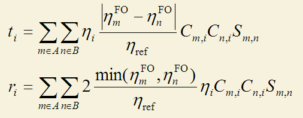

在这个广义化的CDA定义中，对于开壳层体系，alpha和beta电子是单独处理的。比如计算alpha部分时，i,m,n就只循环alpha轨道。这个广义化的形式将片段轨道的占据数直接考虑了进去，故片段轨道也可以是后HF方法得到的自然轨道了。式中η_ref是参考占据数，对于闭壳层轨道是2.0，对自旋轨道是1.0。d_i项的计算方法是在计算t_i时，只对m片段轨道占据数大于n片段轨道占据数时进行加和，计算b_i时就是只对m占据数小于n时进行加和。之所以把m和n的占据数的差值引入进去并不难理解：如果m和n的占据数都一样，显然二者间谁也不会向另一方转移电子，而二者占据数差值越大，则转移程度越大。当其中一个是完全占据而另一个是完全没有占据时，结果就会自动恢复为原始CDA的定义，也就是说广义化的CDA计算的d和b在原始CDA能用的时候结果是与原始定义一致的。广义化的CDA定义中r_i项里面有个取最小值的函数min()，它的含义是两个片段轨道间的互斥作用由二者都有的电子数来决定。之所以引入了因子2，是因为这样的话r_i里的每一项就直接对应于m和n在i中的重叠布居了（实际上这也是由i贡献的m和n之间的所谓的Mulliken键级），而非像原始定义中那样是重叠布居的一半，这样物理意义更明确。对于原先CDA适用的情况，即片段轨道占据数为整数时，广义化的CDA得到的r_i是原先CDA定义的r_i的二倍。

值得注意的是，在CDA原文中虽然公式是对的，但是文中实例中的d、b、r数值不对，都比公式定义的大了一倍。原作者自己开发的CDA程序和AOMix程序给出的d、b、r的结果也都比原公式的大了一倍。所以如果要想令Multiwfn得到的d、b项与它们的作对比，应该先乘以2。而Multiwfn的r项已经是原先定义的二倍，所以不用再乘2了。QMForge也能做CDA分析，但所得d、b、r居然是原先CDA定义的四倍！

### 2.3 ECDA

贡献的电子和反馈的电子数的差值，即d-b项，某种意义上可以视为是从片段A向B净转移的电子数。但是在J. Am. Chem. Soc., 128, 278当中作者认为这种观点有问题，因为他们觉得d、b项当中不光体现了电荷转移部分(CT)，还包含了电子极化部分(PL)。所谓的电子极化就是电子密度的变形，可认为是在片段内，此片段的虚轨道和此片段的占据轨道混合而产生的。因此为了只得到CT，就得排除PL部分的影响。于是他们提出了扩展的CDA方法(extended CDA, ECDA)，给出了以下关系：

PL(A) + CT(A→B) = A的全部的占据片段轨道在全部虚复合物轨道中的成份之和，乘上Occ  
PL(A) + CT(B→A) = A的全部的虚据片段轨道在全部占据复合物轨道中的成份之和，乘上Occ  
PL(B) + CT(B→A) = B的全部的占据片段轨道在全部虚复合物轨道中的成份之和，乘上Occ  
PL(B) + CT(A→B) = B的全部的虚据片段轨道在全部占据复合物轨道中的成份之和，乘上Occ

对于开壳层时，Occ是1.0。对于闭壳层情况，Occ是2.0。ECDA不能用于后HF计算，因为没考虑轨道占据数。

将以上四项中的前两项（或后两项）算出来后，就可以直接得到电子净转移数了：  
CT(A→B) - CT(B→A) = [ PL(A) + CT(A→B) ] - [ PL(A) + CT(B→A) ]  
即电子极化部分被抵消了。

虽然ECDA名义上是CDA的扩展，也都基于片段轨道的概念，但是二者的思路截然不同，在我来看没什么可比性。CDA的主要妙处在于可以将电子转移以及占据轨道的相互作用分解到各个复合物轨道上，然而ECDA的用处只不过是算一个总的转移量而已。而实际上总的转移量在我来看也没必要用ECDA来算，因为有更直接、物理意义更清楚的方法来算，也就是通过原子电荷加和来得到片段在复合物中的净电荷，再与此片段在孤立状态下的净电荷求差值，就直接知道了形成复合物过程中从此片段转移走了多少电子。尽管ECDA意义不是很大，在Multiwfn里还是支持了ECDA。

不少计算原子在轨道中成份的方法也可以用于计算片段轨道在复合物轨道中的成分，如Mulliken方法、SCPA方法、Stout-Politzer方法，见《谈谈轨道成份的计算方法》（<http://sobereva.com/131>）中的讨论。虽然SCPA是最省事的，只需将系数求平方，然后再乘上归一化因子就行了，但是我发现SCPA得到的片段轨道在虚复合物轨道中的成份不甚合理，进而得到的CT(A→B) - CT(B→A)项可能比较离谱，而ECDA原文用的是Mulliken方法计算成份，结果看起来比较合理。在Multiwfn的CDA模块里，凡是涉及到片段轨道在复合物轨道中的成份，默认都是用Mulliken方法计算的。对于占据的复合物轨道的成份，我发现SCPA方法和Mulliken方法给出的结果相差不大。如果你就是想用SCPA方法来算，将Multiwfn目录下的settings.ini里的iCDAcomp改为2即可，SCPA的好处是可以保证贡献值在0~100%之间，而Mulliken方法不能保证这一点。

## 3 现有的支持CDA的程序

相对于其它能做CDA的程序，Multiwfn的CDA功能格外强大、灵活和好用，如今已经被大量文章所使用。Multiwfn的相关知识见《Multiwfn入门tips》（<http://sobereva.com/167>）。Multiwfn的CDA模块支持几乎所有主流量子化学程序，支持开壳层、后HF的情况，可以定义无数个片段。Multiwfn能直接绘制出轨道相互作用图，操作非常方便快捷，每步操作在屏幕上有明确提示，因此不必记忆复杂的关键词或命令行。Multiwfn的输出结果也非常容易读懂。另外，用户可以查看各个轨道的成份，计算出的片段轨道间的重叠矩阵、片段轨道在复合物轨道中的系数矩阵都可以导出到文本文件里便于用户进一步分析和处理。此程序的原理、选项、实例在手册里都有特别详细的介绍。

还有其它也能做CDA的程序，但都明显不如Multiwfn，没有任何使用的必要，但感兴趣的话可以了解一下。

CDA理论的作者开发了CDA程序（<http://www.uni-marburg.de/fb15/ag-frenking/cda>，已失效），是免费的。此程序很简短，只支持闭壳层。此程序所用的CDA的公式也是原先定义的广义化，对于片段轨道也能支持自然轨道，但其形式和笔者提出的广义化的CDA的形式不同。此程序手册里给出的广义化的CDA公式意义很不明确，但对于原先CDA定义能用的情况下，此广义化定义给出的结果和原先定义给出的结果一样。此程序目前支持Gaussian98/03/09的输出文件。另外此程序还能输出各个轨道的结合能，但在手册中原理没写清楚（而且其代码中的算法和手册里根本不一样！），没有对应的文献，也没有实例，十分诡异，笔者不建议用这来路不明的轨道结合能。另外程序还会输出片段相互作用的化学势和硬度，前者还稍微有点道理，但后者按照概念密度泛函理论，其定义完全是错的。CDA程序不支持ECDA，亦不能绘制轨道相互作用图。

AOMix程序（<http://www.sg-chem.net>）是收费的，CDA模块是其主要功能之一。此程序只有Windows版。此程序支持原始形式的CDA，但可以用在开壳层。ECDA在此程序中支持，实际上ECDA就是此程序作者提出的。此程序号称可以绘制轨道相互作用图，但实际上没法直接生成图像，它会产生一些文本文件，必须将这些文件放到Origin、sigmaplot等作图工具里绘制折线图，才能得到轨道相互作用图。而轨道成份、轨道序号之类都得之后自己标上去，很不方便。AOMix这个程序笔者认为使用很不方便，手册写得较乱，还得记忆一大堆关键词，而且程序运行过程诡异，输出文件过于紧凑而不好阅读。AOMix的功能实际上只相当于Multiwfn的一个很小的子集而已，还明显不如Multiwfn强大灵活易用。

QMForge程序（<https://qmforge.net>）是收费的，有图形界面，不支持Linux，功能甚少，它的CDA功能是基于cclib库实现的，只支持原始CDA的定义，因此不能用在开壳层、后HF情况。QMForge不支持ECDA，亦不能绘制轨道相互作用图。此程序功能特别弱，能做的事其实就只是Multiwfn的一个微不足道的子集而已，居然这还好意思卖钱...

## 4 Multiwfn的CDA模块的输入文件及选项

虽然前面讨论的都是只有两个片段的情况，但CDA方法也可以直接用于研究含多个片段的体系，Multiwfn的CDA功能甚至可以定义无限个片段。做CDA分析需要的文件有以下情况

**a) Gaussian用户**  
需要提供复合物和各个片段的单点任务的fch文件。

注：也可以用Gaussian的输出文件，此时对片段计算必须使用pop=full关键词，对复合物必须用pop=full IOp(3/33=1)关键词。因为Multiwfn要从复合物的输出文件中读取以原子中心高斯函数为基的重叠矩阵，这是要写IOp(3/33=1)的原因。由于Multiwfn还要读取复合物及片段的轨道系数，所以必须写pop=full。由于用fch/fchk文件方便得多，我不建议用Gaussian输出文件用于CDA目的。

**b) 其它量化程序用户**  
只要输入到Multiwfn的文件能给Multiwfn提供基函数信息即可做CDA分析。哪些文件包含基函数信息、怎么生成，参见《详谈Multiwfn支持的输入文件类型、产生方法以及相互转换》（<http://sobereva.com/379>）。比如Gaussian和Q-Chem用户可以用fch/fchk文件，ORCA、Molpro、NWChem、Dalton等程序用户可以用Molden文件，GAMESS-US和Firefly用户可以直接用单点任务的输出文件（但后缀需要改为.gms）。

输入文件里片段的坐标必须和复合物坐标一致，因此片段的坐标只需要从已优化的复合物的坐标中直接提取出来就行了，不要单独对片段进行优化。对于Gaussian用户，为了避免Gaussian自动将坐标调整到标准朝向而使得坐标无法相互对应，应当恰当使用nosymm关键词，见《谈谈Gaussian中的对称性与nosymm关键词的使用》（<http://sobereva.com/297>）。如果为了保险，就在所有计算时都写上nosymm关键词！

坐标必须都用笛卡尔坐标，而且片段的定义顺序必须和复合物中的完全一致。比如复合物文件中片段的出现顺序是A,B,C，那么就必须将A,B,C分别定义为片段1,2,3，而不能定义为诸如2,1,3。并且片段内原子顺序、原子坐标也要完全和复合物中的一致。

计算复合物和片段时必须用严格相同的基组。理论方法虽然允许不同，但没有特殊情况的话应当相同，否则结果没实际意义。

绝对不要用弥散函数，否则结果可能完全没意义！这在前述笔者写的《广义化的电荷分解分析(GCDA)方法》论文中有专门讨论。基组用不着很大，def2-SVP就足矣得到合理结果。  
注：如果有什么特殊的原因非得使用弥散函数不可，由于此时可能会出现基函数的线性依赖问题，Gaussian计算时应当带着IOp(3/32=2)选项。这个选项用于避免Gaussian自动删除线性依赖的基函数，因为一旦删除了线性依赖基函数，将导致轨道数目少于基函数数目，然而CDA分析却必须要求基函数数目和轨道数目相同。  
  
特别需要注意的是，在计算含有很重原子体系时（如计算金属配合物），往往要对这些重原子用赝势基组，而其它部分用其它基组，这可能会产生基函数数目不符的问题。比如计算Ni(CO)4，对Ni用lanl2DZ（作为片段1），而对4个CO用6-31G*（作为片段2）。在计算整体时，由于用了自定义方式指定基组（即gen或genecp），此时Gaussian会自动用球谐型基函数来计算。对于lanl2DZ，Gaussian也默认用球谐型基函数。然而，当计算(CO)4时，Gaussian对于6-31G*会自动使用笛卡尔型基函数（对于d或更高角动量壳层其基函数的数目会大于球谐型），这就导致两个片段的基函数数目之和与整体不符，因此CDA无法进行。解决办法就是计算(CO)4的时候在route section中写上5d关键词，这就强制让Gaussian使用球谐型基函数了。如果你对Gaussian决定基函数类型的机制不很清楚，建议凡是使用混合基组的情况，在计算片段时应总加上5d关键词，这样最保险。关于笛卡尔和球谐型基函数的更多讨论见《谈谈5d、6d型d壳层基函数与它们在Gaussian中的标识》（<http://sobereva.com/51>）。

对于Gaussian，如果用后HF方法计算，应当再加上density关键词，并且此时只能用Gaussian输出文件作为输入。对于闭壳层，pop=full应当改为pop=NO；对于开壳层，应改为pop=NOAB。这样才能让自然轨道信息代替HF轨道信息出现在Gaussian输出文件中。

如果复合物和各个片段中的一个或多个是开壳层任务，则整个CDA分析（包括ECDA等）会被当做开壳层来处理，即分别输出alpha和beta的结果。

如果复合物和各个片段中的一个或多个是后HF任务，则ECDA分析将会被跳过，而且也没法绘制轨道相互作用图，因为自然轨道没有明确的能量的定义。

做CDA分析的时候片段的状态选取并不唯一。比如NaCl，既可以把两个片段当成Na+和Cl-来计算，也可以当成一个Na原子和一个Cl原子计算。关于怎么设定片段合适，在前述的《广义化的电荷分解分析(GCDA)方法》中有非常详细的讨论，请仔细阅读。

## 5 实例

下面通过两个实际例子来说明CDA、ECDA及轨道相互作用图的用处，以及在Multiwfn当中的操作。下面例子所用的Gaussian输出的fch文件，连同相应的Gaussian输入文件，在Multiwfn压缩包里examples\CDA的相应目录下都已提供了。

### 5.1 实例1：COBH3

这是一个闭壳层相互作用的例子，在COBH3（复合物）当中，CO（片段1）利用孤对电子与缺电子的BH3（片段2）形成配位键，也因此CO的电子向BH3发生了转移。

此例是在HF/6-31G*下计算的（一般都应当用DFT来算，这里只是个例子，用HF也无所谓），复合物的坐标为  
 C                     0.        0.       -0.09962   
 O                     0.        0.       -1.20782   
 B                     0.        0.        1.5275   
 H                     1.17227   0.        1.79707   
 H                    -0.58614  -1.01522   1.79707   
 H                    -0.58614   1.01522   1.79707  
片段1的坐标为  
 C                     0.        0.       -0.09962   
 O                     0.        0.       -1.20782   
片段2的坐标为  
 B                     0.        0.        1.5275   
 H                     1.17227   0.        1.79707   
 H                    -0.58614  -1.01522   1.79707   
 H                    -0.58614   1.01522   1.79707   
可见，片段1、2的坐标和复合物中是对应的，而且顺序是一致的。对自己的体系做CDA分析时务必要满足这一点。

启动Multiwfn，输入以下内容：  
examples\CDA\COBH3\COBH3.fch  //复合物的Gaussian输出文件  
16   //进入CDA模块  
2  //定义两个片段  
examples\CDA\COBH3\CO.fch  //片段1的Gaussian输出文件  
examples\CDA\COBH3\BH3.fch  //片段2的Gaussian输出文件  
之后立刻会输出以下CDA分析结果  
     Orb.      Occ.          d           b        d - b          r  
       1    2.000000   -0.000004   -0.000000   -0.000004   -0.000001  
       2    2.000000    0.001119   -0.000023    0.001141    0.000326  
       3    2.000000   -0.000002   -0.000471    0.000469    0.000313  
       4    2.000000   -0.013250   -0.000704   -0.012546   -0.005676  
       5    2.000000    0.041648   -0.003309    0.044957    0.232262  
       6    2.000000    0.037385   -0.020136    0.057521    0.212422  
       7    2.000000   -0.000543    0.000647   -0.001190    0.022166  
       8    2.000000   -0.000543    0.000647   -0.001190    0.022166  
       9    2.000000    0.171353    0.026952    0.144401   -0.741381  
      10    2.000000   -0.000569    0.043713   -0.044281   -0.038916  
      11    2.000000   -0.000569    0.043713   -0.044282   -0.038916  
      12    0.000000    0.000000    0.000000    0.000000    0.000000  
      13    0.000000    0.000000    0.000000    0.000000    0.000000  
      14    0.000000    0.000000    0.000000    0.000000    0.000000  
      15    0.000000    0.000000    0.000000    0.000000    0.000000  
  ......  
 -------------------------------------------------------------------  
 Sum:      22.000000    0.236023    0.091027    0.144996   -0.335233

Orb.就是复合物轨道的编号，Occ.是其占据数。从以上数据可见，复合物轨道9的d是最大的，因此表明这个轨道对于CO向BH3的电子转移有最主要的贡献。通过形成这个复合物轨道，CO向BH3贡献了0.171个电子，而BH3向CO反馈了0.0269个电子，故净转移可以估算为0.144（即d-b项）。BH3对CO反馈电子主要是来自于复合物轨道10和11，它们是简并的轨道，b的数值一致，为0.0437。前三个复合物轨道的d、b、r项都接近于0，表明它们对于片段间的相互作用没什么用处，这是因为它们分别是O、C、B的内核轨道，基本不会参与成键。所有的虚轨道的d、b、r项都为0，这是理所应当的，因为它们的占据数都为0。只有对于自然轨道，对应于LUMO及更高阶的复合物轨道由于仍有少量电子占据，其d、b、r项才不是精确为0，但由于自然轨道序号是按照占据数由高到低排的，超过LUMO+5的话由于占据数往往已经很低了，d、b、r项已很小，所以Multiwfn中LUMO+5以上的轨道都不会输出，以避免太冗长（若想全部输出的话，在接下来出现的菜单里选1）。

以上数据中r(9)非常负，这说明复合物轨道9的形成使得CO和BH3的占据的片段轨道的电子很大程度上从二者的交叠区域移走，从而降低了电子互斥，从下面的它的轨道波函数图形中也可见在交叠区域有个明显的节点。而r(5)和r(6)都是不小的正值，因此它们的形成导致占据片段轨道的电子向交叠区域转移了不少，可以认为体现了片段间成键轨道的特征，从下面的等值面图形中也可看到这两个复合物轨道都较好地覆盖了片段间成键区域，故有利于成键。

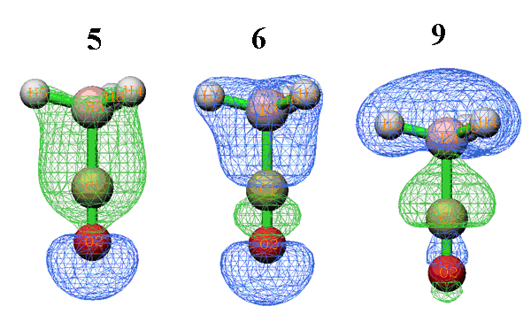

在CDA数据后面紧接着输出了ECDA结果：  
   Contribution to all occupied complex orbital:  
Occupied, virtual orbitals of fragment  1:     680.4194%         8.0593%  
Occupied, virtual orbitals of fragment  2:     390.3988%        21.1226%  
  Contribution to all virtual complex orbital:  
Occupied, virtual orbitals of fragment  1:      19.5806%      2291.9407%  
Occupied, virtual orbitals of fragment  2:       9.6012%      1678.8774%  
PL( 1) + CT( 1-> 2) =    0.3916      PL( 1) + CT( 2-> 1) =    0.1612  
PL( 2) + CT( 1-> 2) =    0.4225      PL( 2) + CT( 2-> 1) =    0.1920  
The net electrons obtained by frag. 2 = CT( 1-> 2) - CT( 2-> 1) =    0.2304  
含义在前面已经介绍过了。一般来说只需要关注最后一行数据，它表明了从片段1向片段2总共净转移了多少电子，此例即0.2304。这个数据和CDA的d-b项会有一定出入，因为二者计算方法没有明显关联。ECDA给出的总的净转移量更可靠。

值得一提的是，做CDA分析时没必要非得把供电子的部分定义为片段1。如果将BH3作为片段1，CO作为片段2（当然，复合物坐标中也因此BH3得在CO前面），只不过会使CDA的d和b的数值互换，ECDA的数值变为-0.2304罢了，物理意义没变。

接下来，会看到一个菜单，各选项含义不言自明。这里我们看看复合物轨道9的具体成份。因此选2，再输入轨道编号9，就会看到以下内容  
  Occupation number of orbital     9 of the complex:  2.00000000  
 Orbital     7 of fragment  1, Occ: 2.00000    Contribution:   25.8560%  
 Orbital    13 of fragment  1, Occ: 0.00000    Contribution:    1.0798%  
 Orbital     2 of fragment  2, Occ: 2.00000    Contribution:   57.2921%  
 Orbital     5 of fragment  2, Occ: 0.00000    Contribution:   14.5640%  
只有片段轨道在此复合物轨道中的贡献值大于等于1%才会被显示出来（这个值可以用settings.ini中的compthresCDA参数调节）。从数据中可见，复合物轨道9主体是BH3的轨道2，达57.3%。之所以此复合物轨道会导致CO向BH3转移那么多电子，显然是因为CO的占据轨道7与BH3的虚轨道5相混合。至于此复合物轨道引起的少量电子的反馈，则主要是缘于BH3的占据轨道2与CO的虚轨道13的很少量混合。至于为何r(9)很负，必然是CO的占据轨道7与BH3的占据轨道2间的互斥作用所致。因此，通过考察轨道成份，轨道的d、b、r项可以分析理解得更加透彻。如果结合轨道图形来看，则相互作用会更为直观（轨道图形可以用Multiwfn的主功能1来看，建议以fch文件作为输入文件）。例如，下图左边是CO的占据轨道7（展现较明显C的孤对电子特征），右边是BH3的虚轨道5，从形状上看二者比较匹配，因此容易混合，并且混合后会导致不少电子转移。而且，容易想象混合后的形状会和前面给出的复合物轨道9的图形较相似，这也解释了为什么这两个轨道能够在复合物轨道9当中占不少成份。

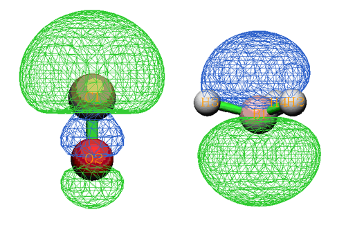

从Multiwfn 3.3.8版开始，还可以直接将某个复合物轨道的d,b,r值分解为片段轨道对儿的贡献，这使得考察片段轨道之间的相互作用能够更清晰透彻。这里我们对复合物轨道9进行分解。输入0返回上一级菜单，选选项6，然后输入9，然后输入0.005，这样对复合物轨道9的d,b,r项任意之一贡献大于0.005的片段轨道对儿就会被输出出来。结果如下  
  FragA Orb(Occ.)  FragB Orb(Occ.)      d           b        d - b          r  
    4( 2.0000)       2( 2.0000)    0.000000    0.000000    0.000000   -0.009969  
    7( 2.0000)       1( 2.0000)    0.000000    0.000000    0.000000   -0.005759  
    7( 2.0000)       2( 2.0000)    0.000000    0.000000    0.000000   -0.723845  
    7( 2.0000)       5( 0.0000)    0.176503    0.000000    0.176503    0.000000  
    7( 2.0000)       8( 0.0000)    0.006221    0.000000    0.006221    0.000000  
    7( 2.0000)      11( 0.0000)    0.005846    0.000000    0.005846    0.000000  
    7( 2.0000)      12( 0.0000)   -0.023941    0.000000   -0.023941    0.000000  
   13( 0.0000)       2( 2.0000)    0.000000    0.021958   -0.021958    0.000000  
很清晰地可以看到CO的7号轨道与BH3的5号轨道相互作用导致电子向BH3转移了0.176，这正是9号复合物轨道d项达到0.171的主要因素。  
  
接下来我们绘制轨道相互作用图，输入0回到上一级菜单，然后选5进入绘制轨道相互作用图的菜单中，各个选项的含义不言自明。我们选3，输入-30,10把相互作用图能量下限和上限分别设为-30和10eV。然后选1，轨道相互作用图立刻会显示在屏幕上：

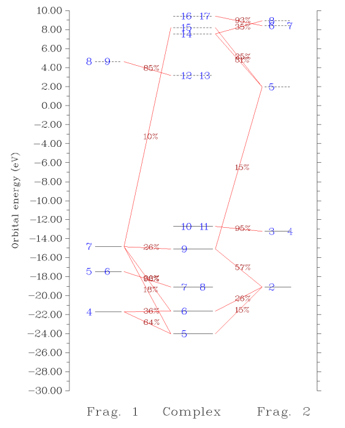

图中，每个轨道用一个横杠表示，垂直位置对应其轨道能量。片段1、复合物、片段2的轨道分别在左、中、右部分。占据轨道和虚轨道以实横杠和虚横杠分别表示。轨道编号在横杠上标注了。如果多个轨道编号都标在一个横杠上，表明它们是简并轨道。如果片段轨道在复合物轨道中的成份大于指定阈值（默认是10%），则相应的横杠间会以红线相连，并在此线上标注出成份具体数值。因此，直接从这样的图上，立刻就能看出轨道能级分布，以及各个复合物轨道主要是由哪些片段轨道混合而成的，非常方便。而像诸如复合物的7、8号轨道，只与片段1的5、6号轨道相连，就表明这两个轨道在形成复合物过程中变化不大，片段2的轨道掺入得不多。

有时候多个文字标签在图上发生重叠而看不清楚，可以直接到前述的显示复合物轨道成份的界面里查看轨道成份；或者，可以尝试在作图前通过选项9 Set shifting of composition labels来调节标签的位置，设的值越接近于1则轨道成份在标注时离片段轨道的横杠越近，越接近0则离复合物轨道的横杠越近。默认是0.5，即标注在连线的正中央；也可以选选项7让成份值不显示出来，而自行随后将成份值ps上去。另外还有很多选项用于调节作图设定，请自行玩弄。

如果你觉得轨道相互作用图上的连线太乱，不符合自己的要求，可以利用Multiwfn中十分灵活的选项进行修改，见本文文末的说明。

顺带一提，如果你要把轨道相互作用图发文章的话，应当在绘制界面里选择保存图像文件，并且强烈建议选择pdf格式。因为pdf格式可以无损缩放，并且你会发现文字和线条都特别平滑。可以把打开的pdf文件截图再保存成其它格式如png、tif，这比起直接让Multiwfn保存出png、tif图像格式的线条更光滑。

### 5.2 实例2：CH3NH2

这个例子是共价（开壳层相互作用）的例子。我们将把CH3NH2当中的CH3视为片段1，NH2视为片段2。

复合物结构已在B3LYP/6-31G**下优化，用于CDA分析的Gaussian输出文件也是在此级别下产生。片段1、2的计算都在UB3LYP/6-31G**下进行，电荷及自旋多重度都分别是0 2。

启动Multiwfn，输入  
examples\CDA\CH3NH2\CH3NH2.fch  
16  
2  //定义两个片段  
examples\CDA\CH3NH2\CH3.fch  
examples\CDA\CH3NH2\NH2.fch  
n    //不翻转CH3的电子自旋  
y    //翻转NH2的电子自旋

CDA用于开壳层时要考虑翻转电子自旋，这里解释一下。做CDA分析时各个片段的alpha电子数之和必须等于复合物的alpha电子数，对于beta电子也是这样。CH3NH2有9个alpha电子和9个beta电子。然而在计算CH3和NH2时，Gaussian都会认为有5个alpha电子和4个beta电子，因此，加和就是10个alpha电子和8个beta电子，这没法和复合物的情况对上。因此，就必须对其中某一个片段的电子自旋进行翻转，具体来说，就是令其alpha轨道的占据数、能量、展开系数与beta轨道的进行交换，相应地alpha和beta电子数也交换。此例翻转的是NH2，这样处理之后，两个片段的总alpha和总beta电子数就分别是5+4和4+5了，都和复合物对应上了。若改为翻转CH3也完全可以，不影响总结果（即总的d、b、r和CT(1->2) - CT(2->1)项），只不过最后得到的alpha和beta的结果会互换。

在屏幕上会看到CDA和ECDA的结果都输出出来了，并且对于alpha电子和beta电子是分别输出的。对于此体系的C-N键，按照经典理论解释可以认为是共享一个电子对儿而形成的，CH3相当于是提供其alpha电子的一方，NH2在翻转了自旋之后，相当于是提供beta电子的一方。所以alpha部分的CDA的d-b项和ECDA分析结果都表明CH3向NH2转移电子，而beta部分则相反，是NH2向CH3转移电子。

在CDA部分的末尾会看到CDA的对全部电子的结果，即alpha和beta部分的加和值：  
  d=  0.044335  b=  0.145181  d - b = -0.100847  r= -0.172318  
在ECDA部分的末尾也会看到ECDA对全部电子的结果，也是alpha和beta部分的加和：  
  CT( 1-> 2) - CT( 2-> 1) for all electrons:    0.1252  
由于NH2的电负性明显强于CH3，所以按道理说电子应该从CH3转移向NH2。ECDA的结论满足这一点，并显示转移量为0.1252。然而从CDA给出的d-b上来看，转移方向和预期是相反的。因此，对于开壳层体系，不适合用总的d-b来讨论整体电子的转移方向。但是用每个复合物轨道的d_i、b_i、r_i来讨论片段间的作用依然是有意义的。

接下来，如果选选项2进入查看复合物轨道的界面，然后比如输入6，就会看到第6条alpha复合物轨道中alpha片段轨道的成分，以及第6条beta复合物轨道中的beta片段轨道的成份。输入0返回上一级菜单。

选5进入绘制轨道相互作用图的界面。作为例子这次我们绘制beta轨道间的相互作用图，所以需要先选5来将要做图的轨道从默认的alpha切换为beta。然后选3，输入-30,10把相互作用图能量下限和上限分别设为-30和10eV。然后选1绘制相互作用图，如下所示

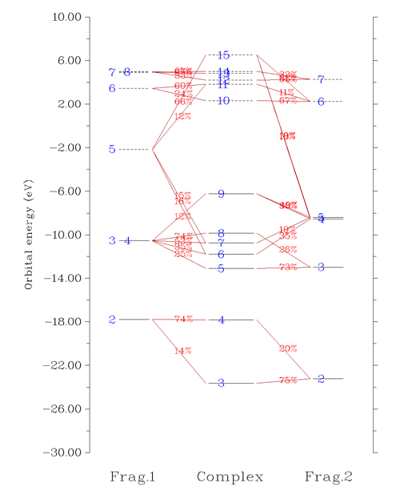

从图上可以非常清楚看到3、4号复合物beta轨道是由CH3的2号beta轨道和NH2的2号beta轨道混合而成。我们将这部分图截取出来，并把轨道的图形附在上面，轨道间如何混合的就变得更直观了：

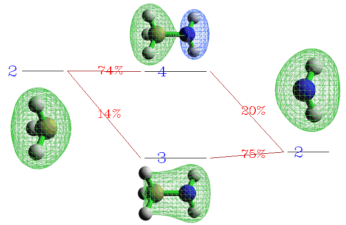

显然，3号复合物beta轨道是那两个片段轨道以相位相同方式混合得到，体现了成键轨道特征，其中以NH2的片段轨道为主体（占75%的成分）。而4号复合物beta轨道是由NH2的2号beta轨道以相位相反的方式掺入CH3的2号beta轨道而构成，体现了反键轨道的特征。

值得一提的是，对此例这样的开壳层相互作用Multiwfn其实也可以基于限制性开壳层（RO）轨道进行分析，由于alpha和beta轨道特征完全相同，故此时不需要考虑alpha和beta轨道的差异，对alpha和beta自旋绘制的轨道相互作用图完全相同，因此在讨论时往往明显更容易。见Multiwfn手册4.16.4节的例子。

### 5.3 实例3：Pt(NH3)2Cl2

这是个3个片段的例子，Pt2+、(Cl)2 2-以及(NH3)2分别是片段1、2、3。详细内容懒得贴在这了，大家看Multiwfn手册4.16.3节就好了，可以把三个片段中每两个片段间的d,b,r项都得到。

### 

### 5.4 实例4：Si19Cl12的轨道相互作用图

笔者在RSC Adv., 5, 78192 (2015)当中考察了Si19Cl12体系中的中心Si原子与Si18Cl12笼的轨道相互作用，绘制了下图，可见轨道相互作用展现得十分清晰，建议看看此文：[/usr/uploads/file/20170105/20170105203001_71053.pdf](http://sobereva.com/usr/uploads/file/20170105/20170105203001_71053.pdf)

 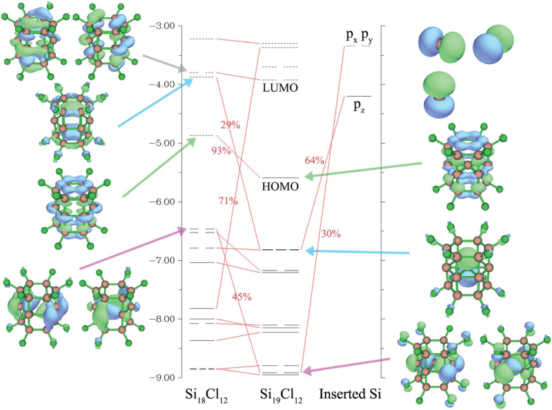

### 5.5 实例5：C18与(CO)2片段的轨道相互作用图

笔者在Chem. Eur. J., 28, e202103815 (2022)当中考察了C18-(CO)2体系中的C18与(CO)2之间的轨道相互作用并绘制了下图，可见轨道相互作用展现得十分清楚。这篇论文在《深入揭示18碳环的重要衍生物C18-(CO)n的电子结构和光学特性》（<http://sobereva.com/640>）中做了深入浅出的介绍并加入了许多补充信息，包括对下图的分析。Chem. Eur. J.这篇文章是Multiwfn程序和轨道相互作用图很好的应用范例，非常建议读者阅读和作为范例引用。

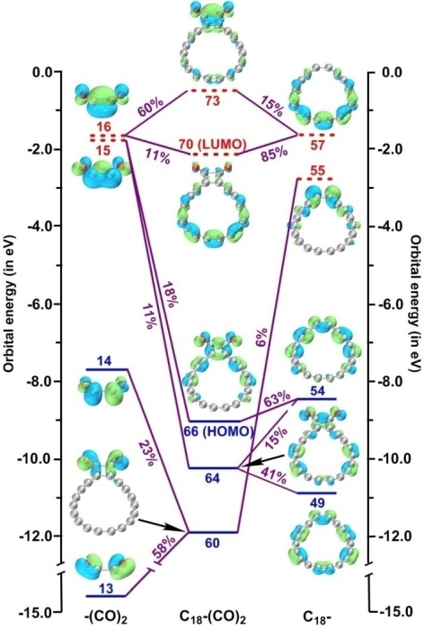

## 6 关于绘制轨道相互作用图的连线方式说明

经常有人问，Multiwfn绘制的轨道相互作用图密密麻麻看不清楚，应该怎么调节。一方面要调节的是轨道相互作用图的能量范围，让能量范围只对应自己感兴趣的那些轨道能量范围就好。另一方面就是调节连线规则和绘制横杠的方式，这里把笔者讲授的量子化学波函数分析与Multiwfn培训班（<http://www.keinsci.com/workshop/WFN_content.html>）里相关的几页ppt贴在这里，便于读者理解。

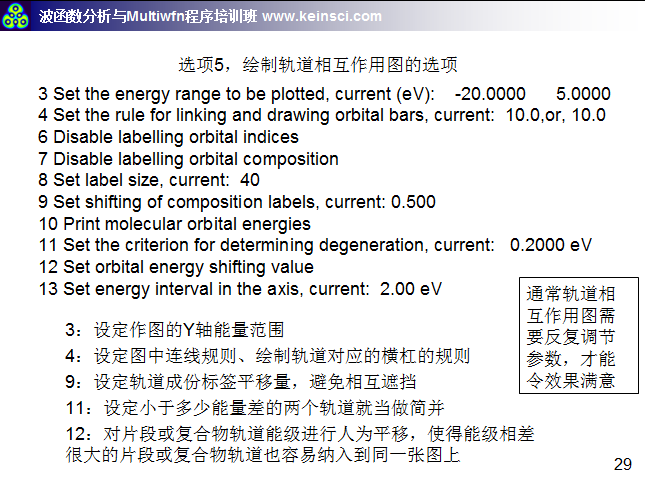

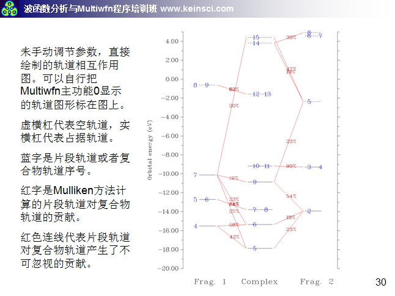

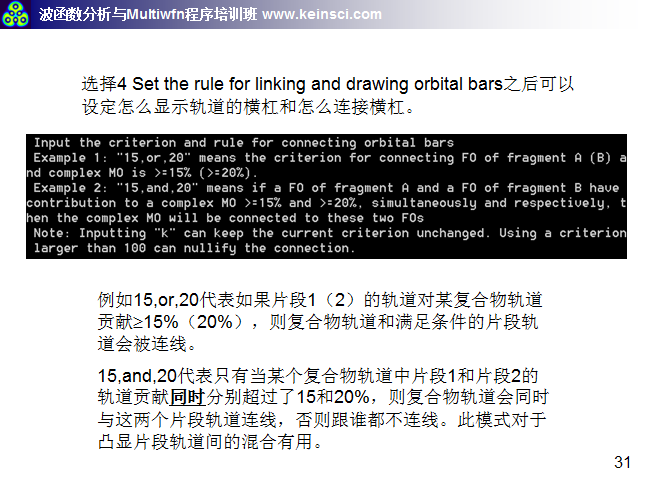

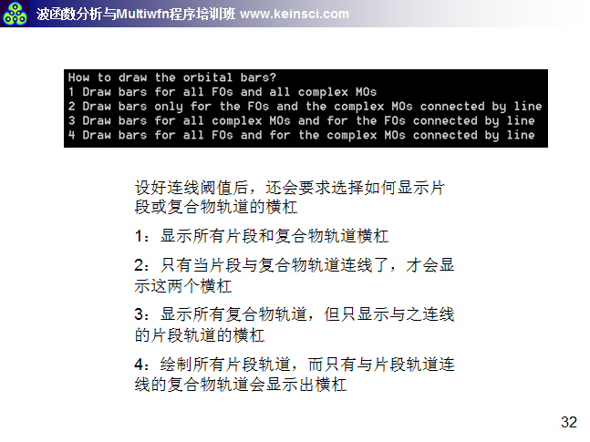

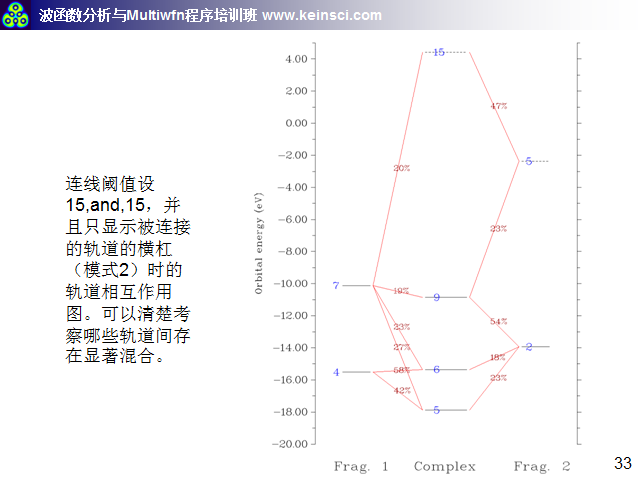
