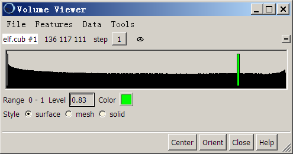
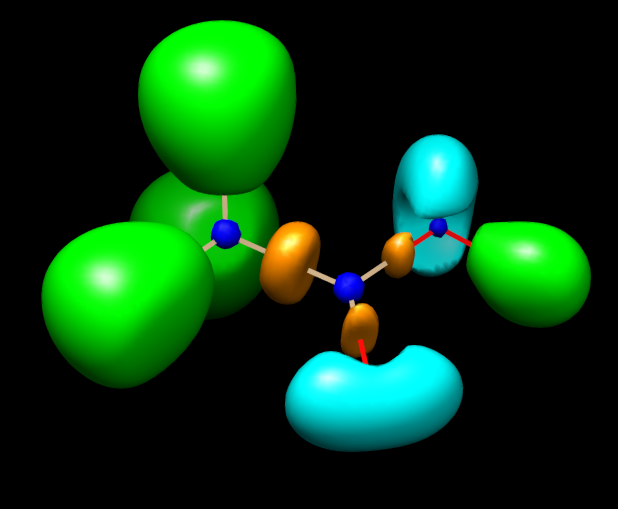

**注**：ChimeraX是Chimera的后继版，显示效果有了显著提升，而且界面更友好。我专门录了ChimeraX绘制本文所示图像的演示视频，看<https://www.bilibili.com/video/av85684420>或 <https://youtu.be/vC48iEB8PwI>。

**在Chimera中用不同的颜色显示不同的等值面**Display different isosurfaces with different colors in Chimera  
  
文/Sobereva @[北京科音](http://www.keinsci.com/)   2012-Nov-21

  
  
在一些文献的格点数据的等值面图中，会对不同的等值面使用不同颜色来显示以作区分。比如电子定域化函数(ELF)的等值面图，一些文献会将孤对区域、共价键区域、内核区域的等值面以不同的颜色表示，看起来会很清楚。最近有数人问我怎么做这样的图，这里就简单谈谈。  
  
能载入cube文件并作等值面图的软件多如牛毛，如GaussView、Multiwfn、Chemcraft、VMD、Molekel等等，但是它们都没法直接指定哪个等值面用哪种颜色显示。一些更高级、专业的体数据显示软件虽然允许自行指定，但是要么收费、要么程序比较大、要么不直接支持cube文件。化学领域的可视化软件中最方便的能自定义特定等值面颜色的是Chimera。此软件可在此处免费下载：<http://www.cgl.ucsf.edu/chimera/>。笔者用的是1.6.2版，windows-64bit版大小是75MB。下面以Multiwfn 2.6生成的乙酸的ELF的cube文件为例介绍下操作过程，计算时格点设定用的是high quality grid（约1728000个点）。  
  
启动Chimera，file-open，file type选all (guess type)，先选择乙酸对应的结构文件（支持很多格式，如pdb格式），然后画面上出现了乙酸的结构。为了避免分子结构妨碍等值面观看，这里用细线来显示结构，即Actions-Atoms/Bonds-wire，然后选Actions-Atoms/Bonds-wire width-5。  
  
然后再次选file-open，选择相应的乙酸ELF的cube文件，等值面马上就显示出来了，同时出现一个Volume Viewer窗口。窗口中有个很长的方框，里面表现的是各个函数值区域的格点的量，那个竖条的位置对应的是当前等值面对应的函数值。点一下这个竖条来激活这个等值面，由于我们要绘制的是ELF=0.83的等值面，故在Volume Viewer窗口的level框里输入0.83（或拉动竖条到恰当的位置），然后回车。由于这个格点文件格点数较多，程序为了显示比较快而默认将Step值设为了2，相当于2*2*2=8个格点缩减为1个格点来表示。然而我们想让图像显示得更细腻，故将Step值设为1。我们将纯绿色作为此等值面图的基本色彩，于是点Color右边的框，把G拉到最右边，R、B拉到最左边，然后点close。目前Volume Viewer窗口如下图所示  
  

  
在Volume Viewer窗口里选tools-measure and color blobs。新窗口中，在Use mouse右边的方块中可以选择以何种操作来选择blob（在Chimera中，一个个不相连的等值面被称为blob）。button 1、2、3对应于鼠标左键、中键、右键。默认的是ctrl button 3，也就是说按住ctrl然后点击鼠标右键就可以选择blob了。我们打算将氧的孤对电子对应的blob设为青色，于是点击Color blob选项右边的色彩框，把R拉到最小，G和B拉到最大。之后在等值面图上按住ctrl并用鼠标右键点击孤对电子区域的blob，颜色立刻生效了。类似地，把内核区域的blob设为蓝色，C-O、C-C区域的blob设为桔黄色，结果如下所示，对应不同特征的ELF域区分得很清楚。  
  

  
注意，一旦修改等值面函数值、对格点数据进行操作，或者更改某些显示方式，自己设定的各个blob的着色方式就会失效，而全都恢复为基本色彩。  
  
Chimera默认开启了depth cueing效果，会使靠后方的等值面略暗。想关闭depth cueing的话，可以在主窗口选Tools-Viewing Controls-Effects，然后取消depth cueing。  
  
如果想让等值面透明，主窗口菜单选择Actions-Surface-transparency-40%。如果让背景变为白色，选择Actions-Color-all options-background，然后点White框。  
  
  
顺带一提，Chimera在显示等值面方面其实很灵活很强大，有很多其它软件不具备的功能。在Volume Viewer窗口中选Features，会看到一大堆选项，选哪个就会在Volume Viewer窗口中出现对应的一些选项，利用这些选项可以实现很多特殊目的、对图像做精细调整。而在Tools当中有很多其它有用的工具，例如用Volume Eraser可以抹掉当前等值面中的指定一块区域；利用Measure Volume and Area可以得到指定的blob的体积和面积。建议有空时自行玩弄。  
  
另外要强调一下，ELF、LOL的basin（盆）和domain（域）的概念并不相同。域是指等值面包围的区域，本文的例子作的是数值为0.83的ELF定域化域的图像。盆是指的由ELF的零通量面划分的区域，每个盆里面有个ELF极大点，所有的盆加和在一起就是整个分子的空间。虽然可以用面来表示盆对应的区域，但是这个面上各个位置的函数值一般并不相同，所以盆是不能用等值面来表现的，等值面展现的也不是盆。所以切勿把此例的图说成是ELF盆的图形。
