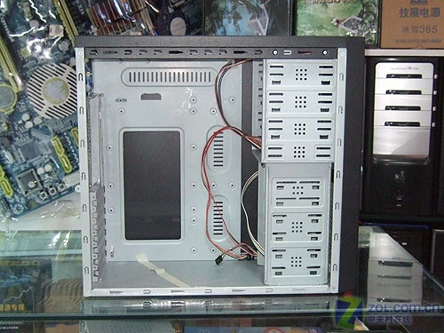
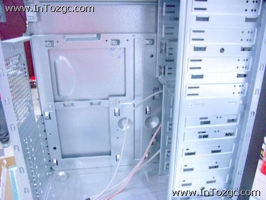
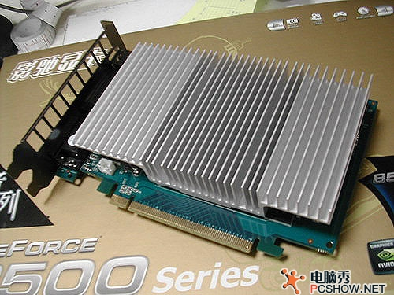

**计算化学攒机--机箱篇**  
  
文/Sobereva @[北京科音](http://www.keinsci.com)   2008-Sep-12

  
  
  

### 1. 机箱的规格

  
现在最常见的主板规格分为EATX(30.5x33.2cm，常见的双路服务器主板尺寸)、ATX(30.5x24.2cm，长方形，最常见的民用主板规格及少部分双路服务器主板)、Micro-ATX(24.2x24.2cm，PCI槽很少的正方形主板，用于小尺寸迷你机)。大机箱可以兼容小主板，但小机箱不能兼容大主板，比如服务器机箱一般都是EATX设计，可以兼容ATX、MicroATX主板，但反之ATX、MicroATX机箱因为尺寸小就不能放EATX服务器主板。EATX/ATX机箱都可以装普通ATX电源（也就是市面上最普通的规格），MicroATX机箱一般只能装MicroATX专用的小电源，少数可以装ATX电源。  
  
其它一些主板规格，也有相应的机箱，但都不常见。  

- AT(30.5x33cm)是586时代及以前的标准规格，Baby-AT(22x33cm)尺寸相对于AT进行了缩减，此二者早已被淘汰。
- Mini LPX/LPX(Low Profile eXtension)、NLX(New Low Profile Extended)主要是以前国外一些品牌机用。LPX是西部数据开发的标准，1990年前后十分流行，目的在于减小机箱尺寸，降低花费。机箱比较扁，各种扩展卡如声卡都是插在位于主板中部的riser card上，使扩展卡与主板平行，由此减小了机箱高度。然而这种设计阻碍气流，影响散热，riser card上也难以加装AGP槽，弊端逐渐明显，最终被淘汰。NLX是1997年由intel等公司制定的，设计思路同LPX，仍然有riser card。对LPX作了一些改进，符合最新的技术需求，但推广远不如LPX顺利，如今已被MicroATX取代。
- WTX(35.56x42.54cm)尺寸相当大，用于高端服务器。
- Flex-ATX(22.86x19.05cm)比Micro-ATX更小，适用于车载、工控、终端等。
- BTX/MicroBTX是intel在2003年秋季推广的一种新规范，在主板、机箱设计都做了重大改动，以提供更好的散热效果，不兼容ATX机箱，仍兼容ATX电源，针脚定义相同，目前在不少品牌机上都可以见到BTX的设计，不过在DIY市场推广不利，很少见。
- Mini-ATX(28.4x20.8cm)是随着ATX标准一起出台的，为小型PC设计，实际上尺寸比ATX也没小多少，只有最初有少数厂家尝试制造，早已没了声音，现在小型PC最流行的是MicroATX。但很多人误将MicroATX与MiniATX混为一谈。
- Mini-ITX(17x17cm)是由VIA威盛推广的主板规格，比FlexATX更小，只有手掌大小，兼容ATX/MicroATX机箱，适用于嵌入式设备。此后威盛还提出了更小的主板规格Nano ITX(12x12cm)、Pico ITX(10x7.2cm)、Mobile-ITX(7.5x4.5cm)
- DTX(20.3x24.4cm)/Mini-DTX(20.3x17cm)是由AMD 2007年提出的小型PC规格
- ETX(Embedded Technology eXtended,9.5x11.4cm)为嵌入式模块设计，在一小块PCB上实现CPU运算和南桥北桥全部功能，包括显示、声效、网络、磁盘控制等等功能，亦称单板计算机，性能和扩展性很有限。
- Mobile-ITX(6x6cm)由VIA于2009年12月初提出的规格

  
  

### 2. 机箱的常见种类

  
服务器的机箱，对于实验室里用，塔式机箱最为合适。用工控机机箱也可以，实际上就是4U机架式机箱（1U=4.445cm，用来衡量机架式机箱高度的指标)，价格比塔式往往还更便宜，扩展性和塔式一样，可以插全尺寸板卡和普通ATX电源，相当于塔式横过来，缺点就是占地方。  
  
而1U/2U的机架式机箱，就是服务器中常见的很扁的卧式机箱，空箱价格和前两种都差不多，但这类机箱由于空间有限，有很多缺点。比如CPU散热器必须用1U/2U服务器专用的，价格偏高，而且因为高度的限制使散热效果受到限制，2U相对1U好一些。另外安装PCI设备时，1U的机箱受限于高度需要专门的转接卡把PCI槽转为横向才能用，2U机箱要么像1U一样转接为横向，要么用特制的Low-profile版PCI设备。而且还需要价格偏高的专用1U/2U电源（长条形的电源），需要额外购买风扇排使箱内气流畅通，光驱、硬盘位也很少。所以使用这类机箱最终成本会高一些而且有诸多不便。这类机箱好处就是可以一片一片放进机柜，集群规模较大时节省空间，易于维护和管理。一般不推荐在普通的计算实验室里面用。所以下面都是针对普通PC/服务器立式机箱进行讨论。  
  
  

### 3. 机箱的选购

  
对于普通单路PC的机箱用150元以内的就行了，这个价位牌子非常多，价格混乱，样式各异。而机箱本身结构简单，质量可以一目了然，也没有售后问题，所以对低价机箱来说一般不必根据牌子选择，主要根据样式、设计、用料等因素，去卖场后根据实际感觉做出选择。要注意一下机箱各个按钮是否好按、主板背板螺丝口位置是否标准（和主板螺丝口是否能对得上）、主板装上去平不平，会不会导致主板弯曲变形、显卡等板卡装上去是否稳固，会不会一端翘起、板卡的挡板及弯折处是否能与机箱紧密贴合、机箱塑料面板有无异味、扩展槽位是否足够等等。另外值得关注的是机箱用料是否对得起其价格，如果机箱钢板太薄(如0.6mm甚至更薄，用手都能折弯，机箱侧盖咣当咣当响，则防辐射效果差)，或者为了省材料把主板背板挖下去一大块金属，甚至只用几根金属条支撑（如图），没有EMI触点/弹片的防磁设计，钢板没有折边毛刺较多，只用了喷漆钢板而不防锈的镀锌钢板，用料就只和80元的机箱相当，如果也卖150元就不值了。  
  

  
机箱一些额外的设计可以关注一下，为此多花点钱也算值得，比如机箱上有无提手，有无导风罩或其它便于进风的设计，底部有无滑轮，有无特殊防尘设计，机箱盖是否采用免螺丝拆卸设计，或者用的是方便的手拧螺丝，光驱、硬盘有无易更换的滑轨设计，主板背板是否能直接拆卸，机箱是否有静音处理如吸音棉、防震胶垫，机箱上是否有锁，前面板有无时钟或者主机信息监控显示设计等等。  
  
至于一些花哨的透明机箱之类别去理睬，根本不能防辐射。  
  
服务器机箱体积大，用料多，而且做服务器机箱的远比做普通民用机箱的厂家少得多，价格不易往下压，所以价格比普通PC的偏贵，一般买400元以内的就行了，我一直用的是联志T11感觉不错，永阳、伟训等牌子也都是很好的。  
  
机箱可以放心地买二手的，服务器机箱各公司企业淘汰下来的也不少，价格能便宜一半多，可以在网上找离得近的本地卖家直接取。不建议邮寄，快递太贵划不来，平邮邮寄等到手时很可能已经被摔得没模样了。  
  
  

### 4. 关于机箱散热

  
降低机箱内的温度，有助于降低CPU、内存、显卡等配件的温度，使系统更稳定。机箱的散热，主要是注重箱内气流的流通，也就是让冷风能顺利进入，让热风能顺利排出。排热风主要是通过电源在机箱内的部分吸入，露在机箱外部分排出，顺便给电源降温。机箱后面都有一两个机箱风扇位置，可以单独购买机箱风扇帮助往外排热气（向外吹，勿装反），机箱风扇尺寸一般是8/9/10/12cm(风扇对角线长度)，电子市场一般10元左右就有卖，其大小应与机箱预留的风扇位相同。往往机箱风扇位设计了不同位置的螺丝孔，可以兼容不同尺寸的机箱风扇，这时最好买能装上去的最大尺寸的机箱风扇，比如能上12cm的就别用8cm，大尺寸风扇较低转速就能达到小尺寸风扇高转速同样的散热效果，可以降低噪音（转速和噪音成正比）。同时也要注意进风顺畅，不要不小心把进风口堵上。多数机箱前面板靠下的地方都有进风口，有的在底部靠前位置（需要脚垫把机箱垫高才有效），一些机箱还在这些位置设计了机箱风扇槽位，装上可以帮助进风。  
  
装机时应最好把机箱内连线整理整齐，用绑带扎起来，拉到靠边位置，尤其是IDE/SCSI设备，线材较宽，如果乱堆，不仅混乱，而且影响机内气流流通，不利于散热。我习惯将IDE线中间部分叠成几折，固定住，这样IDE线粗细就像SATA线了，市场上也有卖中间已经束好的IDE线，但是较贵。  
  
用于计算的机器由于昼夜满载，CPU性能较高发热较大，加上可能选择了一些功率偏小、转换效率不高的电源的高发热量，也没有用较大尺寸的机箱和额外散热措施，夏天又没有空调的情况下，往往整个机箱都很烫（工作条件恶劣，我的机箱已可用于加热食物，但运行十分稳定），这种情况下，不要把机器并排紧贴着放，也别靠着墙，机箱上面也别堆放东西，使机箱便于散热。机箱后面不要太靠近墙壁，否则后置排风扇及电源出的热风容易折回来，热量不宜散开。  
  
  

### 5. 关于38度机箱

  
市场上一些机箱打着38度机箱的口号，可以看到机箱侧板有一个进风口，连着一个导风罩冲着CPU位置（有的还在导风罩处加了进风风扇）。这种设计可以直接将外界冷空气供给CPU散热器来帮助散热，提出这种规范的intel号称这种设计可以将CPU散热器上方2CM处温度控制在38摄氏度，但是这种设计对品牌机比较适合，对自攒的机器，由于CPU位置在不同主板中都不一样，往往不能与导风罩位置正好对应上，而且CPU散热器形式不一，有直吹有侧吹，38度设计往往不能达到理想效果，但多少还是有帮助的，同等价位、质量差异不大，建议买有38度设计的。后期规范还定义了对着显卡位置也有进风孔。值得一提的是，实际上38度机箱规范提出的时候CPU发热量还不算大，能控制得住温度，对于此后的大功率CPU即便用了38度机箱也几乎不可能做到这点，同时其温度也会显著受到周边环境的影响。所以38度机箱只是一种设计规范，对散热有益，但决不代表用了这种设计就能达到其最初宣称的效果。  
  
  

### 6. 关于主机的辐射

  
装机的时候，光驱位置一般都有很多金属板，装的时候需要卸下来，大多都是一次性设计，这也是为了防辐射，并非没有用处，所以不要嫌碍它事，而把其它不用的槽位的挡板也全都扒下来。装主板时候也不要嫌麻烦不装主板带的主板接口处的挡板，不光是美观、防尘，也起到了防辐射作用。如果没做其它特别散热处理，敞着机箱盖大多数情况确实可以使系统温度（机箱内温度）降低，但仅限于调试和维修过程中，不要长期在旁边有人的情况下敞着机箱盖工作，也别虚掩着机箱盖，电磁辐射会大量泄露。另外有些显卡的挡板是双层的，其中一层有一排长方形窟窿，但这层挡板又不像一些高端显卡直接接在封闭式散热器的风道上，而是悬空着，用这些显卡时敞着机箱也没好处，因为关着机箱时，由于电源等抽风扇产生的负压，外界冷气一部分会从这个挡板处进入，使得显卡上方环境温度降低，便于显卡散热，尤其是采用这个设计的无风扇静音显卡（比如影驰8500GT悟静版，如图）效果更明显。  
  

