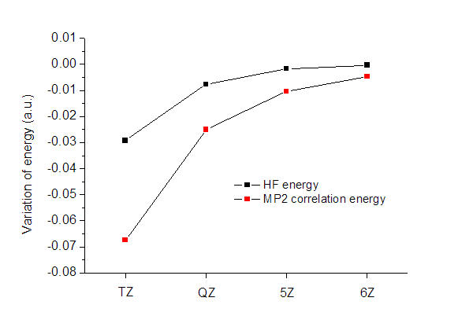

**谈谈能量的基组外推**On the basis set extrapolation of energy

文/Sobereva @[北京科音](http://www.keinsci.com)

First release: 2012-Dec-30   Last update: 2017-Jun-8

## 1 前言

量子化学计算中一个主要的误差来源是基组不够大，或者说距离完备基组极限差距较大。用越大的基组计算耗时越多。对于一些性质，如能量、优化出的结构、偶极矩等，随着基组的增大计算结果会逐渐收敛。只要知道收敛趋势的数学形式，就可以通过较小的基组的计算结果外推出较大基组下的结果，乃至完备基组(Complete basis set, CBS)下的结果。对于很高精度计算，例如小体系高精度弱相互作用计算，外推到CBS已经成了司空见惯的做法。本文将介绍单点能外推至CBS的方法，并给出实例。  
   

## 2 HF/DFT能量的外推

基组外推的前提条件是所用的基组序列必须是以系统方式构建的。对于这样的基组序列，随着基组的增大，可以确保结果的误差逐步、平稳地降低，有明确的收敛趋势。对于Dunning相关一致性基组（cc-pVnZ系列、aug-cc-pVnZ系列等）、ANO系列基组、Jensen的极化一致性基组（pc-n系列）、Ahlrich的def2系列基组等，都符合这个要求。比如可以用cc-pVDZ、cc-pVTZ、cc-pVQZ计算的三个能量外推到CBS的能量。而诸如Pople系列基组则不符合要求，例如不适合使用诸如3-21G*、6-31G*、6-311+G(2d,p)的计算结果外推至CBS，虽说他们的误差肯定越来越小，但误差降低的趋势并不平滑，没有可循的收敛趋势以用于外推。  
  
基组外推的公式并不唯一，有的简单有的复杂。对于不同基组序列，最佳的外推公式也可能有微小的不同。  
  
对于Dunning相关一致性基组（或ANO系列），SCF能量（指HF、DFT能量）收敛趋势符合以下指数关系，可以通过它们来外推至CBS：  
E_SCF(L)=E_SCF(∞)+A*exp(-α*L)  
或   
E_SCF(L)=E_SCF(∞)+A*exp(-α*√L)  
这两种用谁都可以，结果差异甚小。其中A、α是需要确定的参数，E_SCF(∞)就是我们最终想要得到的CBS下的SCF能量。L是基组所含基函数所具有的最高角量子数。例如对于Dunning相关一致性基组，L=2对应cc-pVDZ，因为它对于主族重原子最高角动量为d，角量子数是2。类似地，L=3对应cc-pVTZ、L=4对应cc-pVQZ...由于式中包含E_SCF(∞)、A、α这三个常数，所以原则上需要按基组由低到高依次计算三次能量才能获得它们。显然最便宜的选择就是用DZ/TZ/QZ来外推，此时结果已经很准了，一般没必要用更高贵的诸如TZ/QZ/5Z来外推。  
  
为了避免外推时的麻烦，对于不同的基组序列有人事先拟合了α参数，因此实际外推时只需要计算两次能量就行了。以下数值取自ORCA手册2.9版6.1.3.4节  
对于cc-pVnZ系列，L=2/3的外推α=4.42，L=3/4的外推α=5.46  
对于def2系列，L=2/3的外推α=10.39，L=3/4的外推α=7.88  
  
假定α是已知量，我们就可以直接写出E_SCF(∞)的表达式。设  
E_SCF(N)=E_SCF(∞)+A*exp(-α*√N)  
E_SCF(M)=E_SCF(∞)+A*exp(-α*√M)  
2式可写为A=[E_SCF(M)-E_SCF(∞)]/exp(-α*√M)，代入1式，经过整理得：  
E_SCF(∞) = [ E_SCF(M)*exp(-α*√N) - E_SCF(N)*exp(-α*√M) ] / [exp(-α*√N) - exp(-α*√M)]  
  
由于HF、DFT形式上是基于单电子近似的，所以基组只要能够合理表现出单电子性质就够了，这对基组质量要求并不很高，因此能量随基组增大收敛得也比较快。SCF计算通常在3-zeta级别结果已经很好了，4-zeta级别就挺接近CBS极限了。因此对于SCF计算做CBS外推的意义不是非常大。另外顺带一提的是，单电子性质实际上并不需要很高角动量来描述，比如对于主族元素，角动量函数达到f就已经足够了，引入g及更高角动量函数对结果几乎不会有什么改进，远不如把计算量投入在增加低角动量的基函数上来得有用。  
   

## 3 相关能的外推

后HF计算在HF基础上考虑了电子相关作用（主要是库仑相关）以改进结果。合理描述电子相关作用就要能够较好地描述出电子间的相关穴。由于这是双电子性质，明显比描述单电子性质对基组质量有更高的要求。尤其是相关穴的cusp（歧点）特征，对于非R12/F12方式的后HF计算，需要很大基组才能充分准确描述（高角动量函数起着关键性作用），这是由于通过单电子基函数乘积的方式来描述cusp效率很低所致。由于内在本质的不同，相关能的收敛趋势和HF能量的收敛趋势也有显著不同，因此在外推时需要分别进行，最后将CBS下HF能量和CBS下相关能加和得到总的CBS能量。  
（注：虽然HF波函数能够在当前级别下精确表现Fermi相关，这是双粒子性质无误，但实际上它是Slater行列式的反对称化的要求而自然而然产生的，并非是靠大基组来表现的）  
  
Klopper-Helgaker的形式是最常用的外推相关能的方法，理论依据也最明确，即：E_corr(L)=E_corr(∞)+A*L^(-3)  
  
实际上，自旋相同电子间（singlet pair）的相关能和自旋相反电子间（triplet pair）的相关能收敛趋势也是不同的，前者随L^(-3)而收敛，后者随L^(-5)而收敛，严格的做法是分别拟合这两种相关能。但由于后者随L增加明显收敛得更快，因此通常在外推时不考虑后者，而直接用上面给出的外推公式。  
  
Klopper-Helgaker公式只含两个未知量E_corr(∞)和A，因此只需要用基组序列中L相邻的两个基组各算一次能量即可。假设一个是L=M，一个是L=N，则  
E_corr(M)=E_corr(∞)+A*M^(-3)  
E_corr(N)=E_corr(∞)+A*N^(-3)  
第二个式子可写为A=[E_corr(N)-E_corr(∞)]/N^(-3)，代入到第一个式子，得  
[E_corr(M)-E_corr(∞)]*M^3=[E_corr(N)-E_corr(∞)]*N^3  
整理一下，得到了明确的CBS相关能计算公式：  
E_corr(∞) = [E_corr(N)*N^3 - E_corr(M)*M^3] / (N^3 - M^3)  
  
由于相关能随基组收敛得较慢，所以外推是很有必要的。选用基组序列中哪两个基组外推相关能是很关键的问题，直接影响外推结果准确度。对于实在算不动的情况，就用DZ/TZ来外推，但由于DZ级别质量太低，不能指望外推出的结果真的能接近CBS极限，实际上也就是比TZ强一点罢了，甚至更糟也有可能。通常都用TZ/QZ来外推，这样的结果比较可靠，但也仍不能指望达到CBS极限。可以期望外推出的结果精度会比外推时所用的最大基组高出一级，如TZ/QZ推出来的约是5Z的精度（视具体情况而定，可能比5Z更好或更差），这样的精度已经相当高了。  
  
Truhlar等人的相关能外推公式更为广义：  
E_corr(M)=E_corr(∞)+A*M^(-β)  
当β=3，就回到了Klopper-Helgaker公式。为了使外推更准确，对不同基组序列应拟合不同的β值，下面列举一些（更多的见ORCA手册里基组外推部分）  
对于cc-pVnZ系列，L=2/3的外推β=2.46，L=3/4的外推β=3.05  
对于def2系列，L=2/3的外推β=2.4，L=3/4的外推β=2.97  
由于对于L=3/4的外推β很接近3，所以此时或更高级别的外推建议都用3，理论依据更强。而L=2/3的外推时β建议用拟合值。  
  
另外也有别的小众一些的外推方法，比如Varandas提出的，见JCP, 126, 244105 (2007)，结果和上面介绍的没什么区别，形式还更为复杂，这里就不再多提了。需要外推至CBS都是高精度计算的场合，因此必须计算方法精度也必须比较高才能让总能量误差较小。然而高级别方法结合大基组的计算往往无福消受，这时候可以运用一些技巧。例如，一种常见的近似获得CCSD(T)/CBS下相关能的方法是：  
E_corr(∞)_CCSD(T) ≈ E_corr(∞)_MP2 + [ E_corr(Small)_CCSD(T) - E_corr(Small)_MP2 ]  
也就是说在MP2级别下将相关能外推到CBS，然后加上小基组下CCSD(T)和MP2相关能的差值，就近似获得了CCSD(T)下外推到CBS的相关能，这比起直接在CCSD(T)下外推省时多了。当然，这个近似成立的条件是CCSD(T)和MP2的相关能差异受基组影响不大，实际上这个条件通常是合理的。  
   

## 4 实例：N2的能量外推

这里以N2作为具体例子来外推HF能量和MP2相关能。以下是cc-pVDZ/TZ/QZ/5Z/6Z计算的能量(hartree)，键长为1.100314埃，Δ代表相关能部分。  
E_HF(DZ)=-108.953748406  
E_HF(TZ)=-108.982940693(-0.029192287)  
E_HF(QZ)=-108.990532392(-0.007591699)  
E_HF(5Z)=-108.992208035(-0.001675643)  
E_HF(6Z)=-108.992531280(-0.000323245)  
ΔE_MP2(DZ)=-0.3070859654  
ΔE_MP2(TZ)=-0.3743967513(-0.067310786)  
ΔE_MP2(QZ)=-0.3994430246(-0.025046273)  
ΔE_MP2(5Z)=-0.4098026746(-0.010359650)  
ΔE_MP2(6Z)=-0.4145085175(-0.004705843)  
  
括号里是相对于上一个数值的变化，将它作图，如下所示  
  

  
可见，HF能量收敛得明显要比相关能快得多，QZ级别的HF能量精度已经很高了，而相关能收敛得却仍不十分充分。虽然相关能占总能量比重很小，但是相关能计算的不准确却是总能量误差的主要来源。  
  
利用第二节的HF能量外推公式，以及L=2/3时α=4.42、L=3/4时α=5.46的参数，可以得到以下结果，这可以方便地用Excel来做。括号里是相对于外推时用的最大基组下结果的差值。  
E_HF(DZ/TZ->CBS)=-108.9924345(-0.014689896)  
E_HF(TZ/QZ->CBS)=-108.9928198(-0.002287408)  
通过比较可见，用DZ/TZ外推的结果颇接近直接用6Z计算的结果。而TZ/QZ外推的结果明显比起6Z更为精确，可以认为就是CBS极限的结果了。  
  
利用第三节的Klopper-Helgaker相关能外推公式，可以得到以下结果  
ΔE_MP2(DZ/TZ->CBS)=-0.402738135(-0.0283413837)  
ΔE_MP2(TZ/QZ->CBS)=-0.417720035(-0.0182770104)  
通过比较可见，用DZ/TZ外推的结果介于QZ和5Z之间（更接近于QZ）。TZ/QZ外推的结果比6Z稍好点。和外推HF能量相比，外推相关能对总能量的影响明显更大，这凸显了相关能外推的重要性。另外也看出，相关能外推的效果比起HF能量外推要弱，没法在较低级别基组下就一下子外推出很高级别基组下的结果。又由于相关能随基组收敛慢，所以如果对结果精度要求很高，外推相关能尽量要在TZ/QZ甚至更高级别下做，DZ/TZ外推的结果离CBS极限的差距还较大。  
  
如果L=2/3外推时用Truhlar的公式，β用推荐的2.46，则  
ΔE_MP2(DZ/TZ->CBS)=-0.413728888(-0.0393321367)  
明显比Klopper-Helgaker公式外推的结果更接近于高级别基组外推的结果。所以L=2/3外推时推荐用Truhlar公式结合最佳的β参数。  
  
想得到由TZ/QZ外推出的MP2/CBS能量，只要将-108.9928198和-0.417720035加和即可。  
  
要注意的是，化学上感兴趣的并非总能量，而是相对能量，外推对结果的影响还是会在求差值过程中所大幅抵消的。求差值时，要么所有体系都做外推（而且要用相同基组外推），要么都不外推；如果有的外推有的不外推，结果误差会巨大。  
   

## 5 考虑BSSE时的外推

分子间相互作用能一般这样计算，也就是所谓超分子方式计算：  
E_AB=E_A-E_B  
E_A和E_B是两个单体的能量。单体的几何结构用自由状态的还是复合物状态的依情况而定，这和本文内容无关。  
  
想要得到CBS下的相互作用能，就是对E_AB、E_A和E_B都按照上述过程外推至CBS能量。但实际上问题没有这么简单。因为计算E_AB时需要考虑基组重叠误差(BSSE)，详见<http://sobereva.com/46>。对于以色散作用主导的高精度计算考虑BSSE尤为重要，此时哪怕是aug-cc-pVQZ级别的计算，BSSE的影响仍不可忽视。通常就是用Counterpoise来解决BSSE，这使得复合物能量的外推过程变得略麻烦些，所以专门在这一节说说。  
  
经过Counterpoise方式对BSSE校正后的AB能量E_AB'这样计算（下文中的符号带一撇皆代表做了BSSE校正）：  
E_AB'=E_AB+E_BSSE  
E_BSSE = (E_A - E_A,bAB) + (E_B - E_B,bAB)  
其中  
E_AB：A、B基组下AB复合物的能量  
E_A,bAB：A、B基组下A的能量  
E_B,bAB：A、B基组下B的能量  
E_A：A基组下A的能量  
E_B：B基组下B的能量  
  
对于后HF计算，BSSE校正能分为对HF能量的校正E_BSSE_HF和对相关能的校正E_BSSE_corr：  
E_BSSE_HF = (E_A_HF - E_A,bAB_HF) + (E_B_HF - E_B,bAB_HF)  
E_BSSE_corr = (E_A_corr - E_A,bAB_corr) + (E_B_corr - E_B,bAB_corr)  
  
BSSE校正后的HF能量和相关能即为  
E_AB'_HF=E_AB_HF+E_BSSE_HF  
E_AB'_corr=E_AB_corr+E_BSSE_corr  
  
以这种方式得到不同基组下的E_AB'_HF和E_AB'_corr，就可以按照前述方法直接外推出CBS下的复合物的HF能量和相关能。这样比起在不考虑BSSE条件下，即使用E_AB_HF和E_AB_corr来外推更为合理。如果在aug-cc-pVTZ/QZ级别外推，由于BSSE的影响不是很大，所以外推时不考虑BSSE问题也不大，但如果要求精度很高，仍建议将BSSE考虑进去。  
  
虽然诸如Gaussian程序直接提供了counterpoise关键词，从而可以一步就得出E_BSSE，这对于HF/DFT很方便，但是对于后HF外推，必须得分别得到E_BSSE_HF和E_BSSE_corr，这就只能自行手算。我建议此时使用Ghost原子的方法手动依次计算A、B、A,bAB、B,bAB体系并提取各自的HF能量和相关能，然后计算E_BSSE_HF和E_BSSE_corr，而不要靠counterpoise关键词，否则从输出文件中找数据时容易弄混。如果整体有对称性，这样比起直接用counterpoise关键词在效率上也有好处，因为counterpoise关键词会对涉及的所有计算都关闭对称性，而手动算的话，计算E_AB、E_A、E_B时还能开着对称性以节约时间。  
   

## 6 实例：考虑BSSE时外推氢气-氮气二聚体能量

下面就以氢气-氮气二聚体平行构型为例来说明怎么得到二聚体的考虑了BSSE的外推至CBS下的能量，外推通过aug-cc-pVDZ/TZ来实现，理论方法用CCSD(T)，程序用G09 B.01。这是笔者在J. Mol. Model.19,5387的研究中涉及到的计算。  
  
先在CCSD(T)/aug-cc-pVTZ下计算，以下是route section和坐标部分  
计算E_AB：  
#p ccsd(T)/aug-cc-pvtz  
 N                  0.00000000    0.55705000   -0.42673900  
 N                  0.00000000   -0.55705000   -0.42673900  
 H                  0.00000000   -0.36881700    2.98717200  
 H                  0.00000000    0.36881700    2.98717200  
计算E_A：  
#p ccsd(T)/aug-cc-pvtz  
 N                  0.00000000    0.55705000   -0.42673900  
 N                  0.00000000   -0.55705000   -0.42673900  
计算E_A,bAB：  
#p ccsd(T)/aug-cc-pvtz nosymm  
 N                  0.00000000    0.55705000   -0.42673900  
 N                  0.00000000   -0.55705000   -0.42673900  
 H-Bq               0.00000000   -0.36881700    2.98717200  
 H-Bq               0.00000000    0.36881700    2.98717200  
计算E_B：  
#p ccsd(T)/aug-cc-pvtz  
 H                  0.00000000   -0.36881700    2.98717200  
 H                  0.00000000    0.36881700    2.98717200  
计算E_B,bAB：  
#p ccsd(T)/aug-cc-pvtz nosymm  
 N-Bq               0.00000000    0.55705000   -0.42673900  
 N-Bq               0.00000000   -0.55705000   -0.42673900  
 H                  0.00000000   -0.36881700    2.98717200  
 H                  0.00000000    0.36881700    2.98717200  
  
HF能量就是输出文件中SCF Done:后面的，CCSD(T)能量搜索CCSD(T)=就能找到，它减去HF能量就是CCSD(T)的相关能。计算结果如下：  
E_AB_HF=-110.11354966  
E_A_HF=-108.98075536  
E_A,bAB_HF=-108.98078589  
E_B_HF=-1.13304859  
E_B,bAB_HF=-1.13305499  
E_AB_corr=-0.43998843  
E_A_corr=-0.39983017  
E_A,bAB_corr=-0.39989990  
E_B_corr=-0.03956792  
E_B,bAB_corr=-0.03957422  
故aug-cc-pVTZ级别下：  
E_BSSE_HF=0.00003692  
E_BSSE_corr=0.00007603  
E_AB'_HF=-110.11351274  
E_AB'_corr=-0.43991240  
  
把上述计算在aug-cc-pVQZ下再算一遍，可得：  
E_BSSE_HF=0.00001463  
E_BSSE_corr=0.00003224  
E_AB'_HF=-110.12069678  
E_AB'_corr=-0.46017610  
可见在aug-cc-pVQZ下BSSE的影响明显比aug-cc-pVTZ要小。  
  
由于没有aug-cc-pVnZ的α参数，三点外推又麻烦，所以这里就不外推HF能量了，直接用aug-cc-pVQZ下的HF能量作为CBS下的。如果要外推也可以凑合用相应L=3/4的cc-pVnZ的α参数，和理想的aug-cc-pVnZ的α参数差异不会很大。  
  
利用aug-cc-pVTZ/QZ下的E_AB'_corr，按Klopper-Helgaker公式外推得到CBS下的CCSD(T)相关能-0.47496313。将它与aug-cc-pVQZ下的E_AB'_HF=-110.12069678加和，最终得到二聚体的考虑了BSSE的CBS下的能量-110.59565991。令它减去外推到CBS的单体的CCSD(T)能量即是单体间相互作用能。
