**补充**：在此文撰文之后Multiwfn又支持了ICSS方法图形化分析芳香性，极具实用价值，见《通过Multiwfn绘制等化学屏蔽表面研究芳香性》（<http://sobereva.com/216>）。

**补充**：后来Multiwfn支持了对周期性体系考察芳香性，详见《使用Multiwfn考察周期性体系的芳香性》（<http://sobereva.com/722>）。

**衡量芳香性的方法以及在Multiwfn中的计算**  
The methods for measuring aromaticity and their calculations in Multiwfn

文/Sobereva @[北京科音](http://www.keinsci.com/)  
First release: 2013-Jan-23   Last update: 2025-May-1

**摘要**：本文首先先介绍芳香性的基本概念，然后对比较重要、目前比较流行的和近年来新提出的衡量芳香性的方法依次进行介绍，并谈谈笔者的看法。其中可以在Multiwfn程序中实现的方法会介绍操作过程。最后对实际应用中芳香性指标的选择进行讨论。

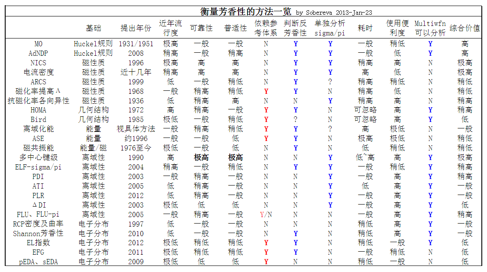

**笔者讲授的量子化学波函数分析与Multiwfn程序培训班（<http://www.keinsci.com/workshop/WFN_content.html>）专门有一节用多达160页以上的幻灯片从头到尾极其全面、系统、细致讲解芳香性的概念和各种分析方法，内容远远比本文丰富得多，非常推荐想一次性完整学习芳香性分析的人参加！**

顺带一提，笔者对18碳环（cyclo[18]carbon）及其衍生物体系做过大量的理论研究，汇总见<http://sobereva.com/carbon_ring.html>，其中有很多文章综合运用了本文中不少方法，**十分推荐仔细阅读，也很推荐作为范例引用**，包括：  
18碳环的芳香性：Carbon, 165, 468 (2020)  
16碳环的基态和激发态的芳香性：Chem. Eur. J. (2025) DOI: 10.1002/chem.202404138，介绍见《全面揭示16碳环（cyclo[16]carbon）非常奇特的激发态芳香性！》（<http://sobereva.com/741>）  
18碳环衍生物C18-(CO)n的芳香性：Chem. Eur. J., 28, e202103815 (2022)，介绍见《深入揭示18碳环的重要衍生物C18-(CO)n的电子结构和光学特性》（<http://sobereva.com/640>）  
18碳环衍生物C18-(Br)n的芳香性：Chem. Eur. J., 29, e202300348 (2023)，介绍见《不寻常的环[18]碳前驱体C18Br6的电子结构和芳香性》（<http://sobereva.com/664>）  
18碳环等电子体B6C6N6和B9N9的芳香性：Inorg. Chem., 62, 19986 (2023)，介绍见《18碳环等电子体B6N6C6独特的芳香性：揭示碳原子桥联硼-氮对电子离域的关键影响》（<http://sobereva.com/696>）

另外，此文也是极好的芳香性的研究范例：Chem. Eur. J., 30, e202403369 (2024)，介绍见《深度揭示互为等电子体的苯、无机苯和carborazine的芳香性的显著差异》（<http://sobereva.com/731>）

## 1 什么是芳香性

芳香性是一个十分古老，重要，又含糊的化学概念。苯是最具典型的芳香性分子，也是芳香性的原型分子。与芳香性有关的文章近十几年来增速十分迅猛，如今可以说已经过热、被过分炒作。新的衡量芳香性的指标也不断被提出，同样在近年来增速迅猛，目前总计已有数十种。这些指标体现了芳香性的不同侧面，其中绝大部分依赖于量子化学计算。芳香性难以给出一个确切、唯一的定义，实际上芳香性这个词包含的内容被不断地广义化，以至于越来越不可能给出一个既简单、精确又能被所有研究者接受的定义。芳香性分子在能量、结构、反应性、磁性质、电子结构等方面都展现出独特的特征。对于大量芳香性体系，利用统计分析，可以发现它们总是同时具有很多特征，如：键长均衡化、电子呈高度整体离域性、外磁场下能形成整体诱导环电流、有较大离域化能、结构稳定等等，因此这样来看只要考察某分子的某个方面特征就能衡量其芳香性高低。但是对于不少分子，它们具有的各种特征之间的相关性并不满足上述大规律，这被称为芳香性的多维性，因此为了合理地描述芳香性就不得不同时考虑数种基于分子不同性质的芳香性指标。

下面的表格列举了芳香性、非芳香性和反芳香性体系一部分常见特征，有的内容并不很准确，仅供参考，取自Chem.Rev.,105,3716(2005)。

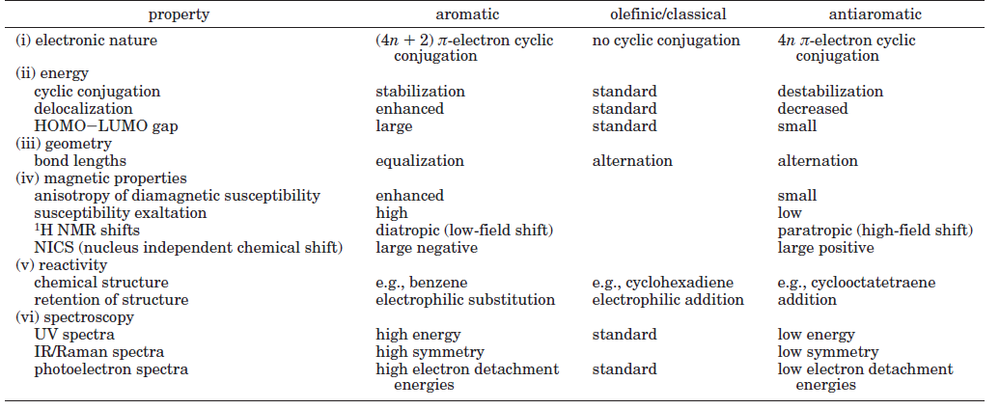

虽然芳香性这个话题越来越复杂化，不同研究者的观点不同。一个经典、古老、被化学工作者所普遍认知的关于芳香性的说法是Huckel规则：环上的分子轨道若具有4n+2电子占据则环具有芳香性。但是这个说法比较狭义，从理论化学角度也没触及物理本质。如果要对芳香性的本质做一下解释，那么寡人的观点是：对于一个环，若电子能够在整个环上高度离域，则环具有芳香性。虽然如上所述，芳香性具有多维特征，但很多都是外在表象，真正的源头是电子的离域。若电子没法在环上充分离域，那么芳香性就无从谈起。

这里说的环是指电子的整体离域路径构成明显的环路，环的几何结构可以偏离圆形，可以是扭曲的不在一个平面的。环形离域路径不一定非得沿着分子的拓扑结构，比如某个局部结构是-C1-C2-C3-，若C1和C3离得近且轨道匹配，电子可以直接从C1跨过C2向C3离域；甚至还可以在分子片段间，乃至不同分子间有很强离域而构成整体环形离域路径，这被称为跨键或跨空间芳香性。另外还有很多文章研究球形芳香性，但这不属于本文涉及范围，相关综述见Chem.Rev.,105,3613(2005)。

通常能够明显整体离域的是pi电子（绝大多数有机分子中sigma键定域性太强），这样的芳香性就是pi芳香性。如果整体靠的是sigma电子，就叫sigma芳香性。如果又有pi又有sigma的贡献，叫二重芳香性。虽然研究的最多的是有机分子的芳香性，但小的金属团簇（或金属和非金属混合团簇）的芳香性，即全金属（半金属）芳香性也受到广泛关注，对于这些体系sigma键的电子和delta键（d轨道构成）的电子和金属芳香性密切相关，有的团簇有人指出同时具备sigma,pi,delta三重芳香性，有的有pi,delta二重芳香性，等等，种类繁多。对于过渡金属团簇还可以利用f电子产生φ芳香性。

本文并非芳香性的综述，不会去回溯芳香性的历史，不会去列举五花八门稀奇古怪的芳香性体系，不会去讨论一些新奇的概念。本文的目的在于归纳、简要介绍有历史意义的、目前流行的和新提出的衡量芳香性的方法，并对之发表一些洒家的观点。此文并非一览无余地囊括所有已经提出的衡量芳香性的方法，因为数目太多，而且有很多实际意义不大，或者纯属跟风。对于那些能在Multiwfn程序中计算的方法本文会介绍操作过程。

Multiwfn可以计算大量考察芳香性的方法，包括：AdNDP、FLU/FLU-pi、PDI、ATI、PLR、HOMA、HOMAc、HOMER、Bird指数、多中心键级、Shannon芳香性、LOL/ELF-sigma/pi、RCP处的电子密度及垂直于环平面的密度曲率、EL指数、AV1245、ICSS等。Multiwfn可以在此处免费下载：<http://sobereva.com/multiwfn>，读者请使用网站上的最新版本，否则可能与本文叙述的一些内容不符。如果你不了解Multiwfn，强烈建议参看《Multiwfn FAQ》（<http://sobereva.com/452>）。如果你不知道什么时候该用什么格式作为输入文件，或者不知道怎么产生要用的输入文件的话，看《详谈Multiwfn支持的输入文件类型、产生方法以及相互转换》（<http://sobereva.com/379>）。简单来说，对于Gaussian的用户而言，使用fch作为输入文件可以用Multiwfn做本文提到的绝大部分分析。

由于基于Huckel规则判断芳香性的方法属于经典、有重大意义的方法，所以先在第二节对之进行介绍。之后，会按照基于磁性质、基于几何结构、基于能量、基于电子离域性、基于电子分布的顺序来介绍各种衡量芳香性的方法。最后，将对本文涉及的方法进行比较和总结，谈谈各种场合下笔者推荐的方法。

## 2 基于Huckel规则的方法

Huckel规则源自他在1931年的研究，但是直到1951年，Huckel规则在Doering的研究文章JACS,73,876中才被明确化为众所周知的4n+2规则。Huckel规则原本是基于MO轨道来分析，但是碰到含有多元环情况通常就瞎了，此时需要基于AdNDP轨道才能分析局部的环的芳香性。

### 2.1 MO结合休克尔规则判断芳香性

这种判断芳香性的方法就是考察分子轨道(MO)图形，找出环上的MO，如果这些轨道上总电子数满足4n+2，则这个环具有芳香性。如果满足的是4n，则具有反芳香性。

比如苯，以下是其双占据的三个pi轨道图，它们一起构成六中心的共轭环路，共6个电子，满足4n+2，故具有典型的芳香性。

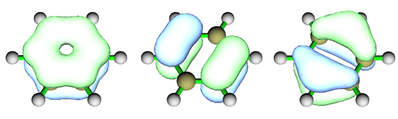

再看个复杂点的例子，中性状态的Li7团簇。图取自文献。

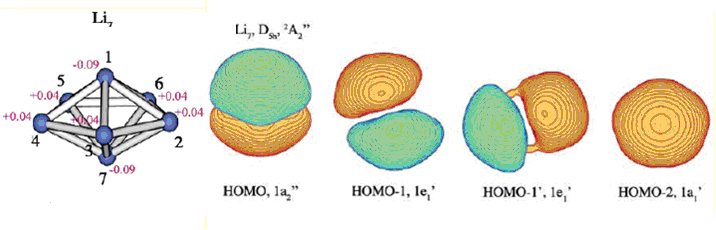

HOMO是构成pi芳香性的轨道。如果是两个电子占据，即n=0，则将是典型的pi芳香性。但目前它只有一个电子占据（准确来讲应当叫SOMO），因此比典型pi芳香性要弱，这可以算作是部分pi芳香性。HOMO-1、HOMO-1'和HOMO-2是构成sigma芳香性的轨道（轨道相位类似于苯的pi轨道），它们都被双电子占据，n=1，故是完美的sigma芳香性。由于此体系sigma和pi都对芳香性有贡献，所以算双芳香性。

对于一个体系，若多种类型轨道都对芳香性有贡献，则整体的芳香性会因累加而变得更强。如果有的轨道呈芳香性而有的呈反芳香性，则它们会彼此抵消，整体是芳香性还是反芳香性就看是谁起主导作用了。

不同电子态对应不同电子排布，因此也影响芳香性。例如某闭壳层体系单重态是4n反芳香性，如果把原先参与反芳香性的轨道上的一个电子电离掉，那么4n就被破坏了，从而反芳香性被大大削弱。如果这个电子被激发到相同环上的空轨道上，构成三重态，那么当前电子结构可以视为是本应构成4n+2的一批双占据轨道中有目前两个是单占据的（或者说，如果把这两个单占据轨道都再补上一个电子就满足了4n+2），故是不完美的4n+2，此时会有部分芳香性，即电子激发实现了反芳香性和芳香性的转化。

正如Li7例子所示的，并非只有平面结构才能根据考察轨道来判断芳香性。但是，用于结构复杂，特别是非平面的情况，这种根据MO分析芳香性的方式往往很不好用、很含糊、很麻烦。因为MO图形往往较为复杂，有很多节点，涉及到体系诸多原子，时常没法判断哪些轨道是参与芳香性的；而且很多MO涵盖的空间范围广（尤其是大体系），它们只是部分地参与构成某些环的芳香性，计算4n/4n+2时是否把它们算进去根本说不清楚，或者说这么判断根本在原理上就行不通。而且，这种看轨道图形数电子数的方法的判断只是定性的，没法定量地判断芳香性的强弱。如今经常有文章利用这种方法讨论芳香性，讨论的结果令人匪夷所思。一方面是这种分析方法局限性太大，另一方面也是作者自身有问题，轨道选得莫名其妙，令人不禁觉得：凭什么把这些轨道算进4n/4n+2里？我不很鼓励使用这种方法分析芳香性，或者至少也得结合使用一种可靠的能定量计算芳香性的方法。

Huckel规则是对一般体系来说的。对于Mobius型分子，即共轭环的链扭转了(2M+1)*pi M=0,1,2...弧度的分子，满足的是Mobius芳香性。相当于把Huckel规则反过来，即4n对应芳香性，而4n+2对应反芳香性。

### 2.2 AdNDP轨道结合休克尔规则判断芳香性

上一节介绍的方法的主要局限性之一是MO离域性太强，即往往同时涵盖很多原子。当体系原子较多，有很多环可能同时具备芳香性/反芳香性，就很难靠MO来判断。例如菲就是这样，没法直接靠高度离域的MO来讨论它的三个环的芳香性。这时需要使用AdNDP方法，原文见PCCP,10,5207(2008)。这种方法获得的AdNDP轨道是“半定域化轨道”。AdNDP轨道既不像MO离域程度那么高，也不像传统的定域化轨道定域程度那么强（但中心或双中心轨道），而是介于两者之间，既在一定程度上定域化，又能表现体系局部区域的离域性。关于AdNDP的原理和在Multiwfn中的操作另有一帖专门介绍，就不在这里详谈了，见《使用AdNDP方法以及ELF/LOL、多中心键级研究多中心键》（<http://sobereva.com/138>）

菲的在边缘芳香环上的pi型AdNDP轨道图形如下：

可见这三个轨道和苯的三个pi轨道很相似，因此它们构成了六中心共轭。这三个轨道占据数并非像苯一样都是完美的2.0，而是在1.8~2.0之间，基本符合4n+2规则。这说明这个环虽然有明显的芳香性，但是和苯相比要弱一些。假设基本符合的是4n规则，那么就是反芳香性。

如菲的例子所见，AdNDP方法很有用，不仅能考察局部的芳香性或反芳香性，还能根据占据数大致说明其程度的强弱。但是AdNDP的威力被某些文章作者（包括一些大牛）过分鼓吹、胡作非为乱发文章。AdNDP的最大软肋就是搜索AdNDP轨道的过程对一些复杂体系任意性往往太强，人为干预太大，不同研究者可以得出不同结果，以至于，在JOC上某篇文章，coronene中心的根本算不上是芳香性（按照NICS还应该算反芳香性）的环居然被作者胡乱分析成芳香性。反正AdNDP的结果怎么解释都有道理，别人也不好质疑，但是结果可靠性有多高（也即AdNDP搜索过程含糊性有多大），只有作者自己心里有数。寡人绝非不鼓励用AdNDP，只是说，对于某些体系，如果用的过程中自己觉得心里很没底，干脆就别用了，勿在文章中强词夺理。目前乱用AdNDP分析芳香性的文章实在多得很，对于复杂的体系的分析结论，大家阅读时不要不加怀疑地相信。如果某个体系的芳香性比较重要，笔者鼓励大家自行重新找一遍AdNDP轨道以检验文章结论。

## 3 基于磁性质的方法

本节介绍的方法基于体系对外磁场的响应行为。看完本节后读者请务必阅读《使用NICS和磁感生电流考察芳香性时的一些易被忽视的重要问题》（<http://sobereva.com/743>），里面讨论了很多这一节没有提及的要点以及常见误区。

### 3.1 核独立化学位移（NICS）及相关的方法

可以说NICS是目前用得最多、接受度最高的衡量芳香性的方法。原文是JACS,118,6317(1996)，在Chem. Rev.,105,3842(2005)中有详细的综述，在Org. Lett.,8,863(2006)对几种定义进行了对比分析。

NICS原始的定义是：环上重原子的几何中心处的各向同性化学屏蔽值的负值，以ppm为单位。

因为考察的这个点不是原子核位置，所以叫“核独立”。对于芳香性体系，一般这个屏蔽值是正值，即NICS为负，本质是因为外磁场导致的共轭环上的环电流产生的感生磁场会一定程度对外磁场有抵消（屏蔽）作用。对于反芳香性体系，环电流的感生磁场和外磁场方向相同，故会加强外磁场，所以这个屏蔽值为负，NICS即为正。

实际上，在实验上也有类似于NICS的做法来测定芳香性，但用的是比较轻的原子核，诸如He_3、Li+离子、桥氢原子来作为探针，让它们与芳香环构成复合物稳定在芳香环的面上，通过测定它们的化学位移就可以衡量环的芳香性。虽说这用的是实实在在的原子核来测定，但和NICS的思想本质是完全一致的。

多数成熟的量子化学程序都能很容易地计算NICS，这是NICS之所以这么流行的主要原因之一。这里以Gaussian计算菲的边缘的环和中间的环为例来说明。获得几何中心的X、Y、Z坐标就是把环上重原子的X、Y、Z坐标分别取平均。假设边缘和中央的环的几何中心为(0.000000,-2.155707,-0.338053)和(0.000000,0.000000,0.859657)，就在Gaussian输入文件原子坐标后面写上：  
Bq 0.000000 -2.155707 -0.338053  
Bq 0.000000  0.000000  0.859657  
其中Bq代表鬼原子，这使得Gaussian输出这些位置的NMR信息。然后Route Section部分写上NMR关键词，以及所用理论方法、基组，然后开始运算即可。默认使用的是GIAO方法计算NMR，绝大部分文献报道的NICS值都是这个方法计算的。如果用其它方法，如NMR=CSGT，当基组不很完备时结果会与GIAO的稍有不同。建议大家的研究文章中要注明计算NMR所用的方法，以便读者重现。计算NICS用不着很高级别的方法和基组就能得到合理结果，通常用B3LYP/6-31+G*就可以。

从输出文件中可找到这两个环中心的NMR信息  
 25  Bq   Isotropic =     8.7039   Anisotropy =     5.0411  
   XX=    12.0647   YX=     0.0000   ZX=     0.0000  
   XY=     0.0000   YY=     6.3843   ZY=    -0.7977  
   XZ=     0.0000   YZ=    -0.8627   ZZ=     7.6628  
   Eigenvalues:     5.9758     8.0713    12.0647  
 26  Bq   Isotropic =     5.4377   Anisotropy =     3.7470  
   XX=     1.3628   YX=     0.0000   ZX=     0.0000  
   XY=     0.0000   YY=     7.0146   ZY=     0.0000  
   XZ=     0.0000   YZ=     0.0000   ZZ=     7.9357  
   Eigenvalues:     1.3628     7.0146     7.9357  
其中3*3矩阵是磁屏蔽张量。之所以描述为张量的形式是因为电子对不同方向射来的磁场屏蔽强度是不同的。这个张量矩阵乘以外磁场矢量得到的矢量的负矢量就是感生磁场矢量。磁屏蔽张量的对角元的平均就是Isotropic后面的值，也就是各向同性屏蔽值，这也是NMR实验所对应的结果。边缘环的NICS即是-8.7039，中央环的NICS即是-5.4377，由于都是负值表明都呈现芳香性；由于前者更负，所以表明边缘的环的芳香性更强。

最初的NICS定义，也被称为NICS(0)，被指出在不少体系都不很适用。主要毛病是它取的是各向同性值，而非垂直于环平面的屏蔽张量的分量。然而只有这个分量值，才和环上离域的电子对应的环电流所产生的感生磁场直接相关，才真正能清楚地展现芳香性特征，这个问题在Org. Lett.,8,863(2006)有详细讨论。这篇文章推荐用NICS(1)_ZZ来衡量芳香性，笔者也确实发现这个指标远比NICS(0)好得多得多。到现在仍有很多文献没完没了地批判NICS，实际上批的都是NICS(0)，大部分NICS(0)不适用的体系（诸如(HF)3环状三聚体被NICS(0)误判为芳香性）在NICS(1)_ZZ上都没问题。奇怪的是，这些文献总是无视NICS(1)_ZZ的存在却紧咬着NICS(0)不放，简直是莫名其妙。NICS(1)_ZZ就是指的在环平面上方1埃处（具体来说，是以环中心为起点向垂直于环平面方向挪1埃），垂直于环平面方向的屏蔽张量分量值的负值。假设分子平面是XY、YZ、XZ平面，那么这个分量值就是分别指的ZZ=、XX=、YY=后面的值。由于在环上方1埃处sigma轨道效应影响很小，所以NICS(1)_ZZ衡量的主要是pi芳香性。如果想在NICS框架内把sigma和pi对芳香性的贡献单独分析，可参见《基于Gaussian的NMR=CSGT任务得到各个轨道对NICS贡献的方法》（<http://sobereva.com/670>）和《将核独立化学位移(NICS)分解为sigma和pi轨道的贡献》（<http://sobereva.com/145>）介绍的做法。

在衡量pi芳香性方面，FiPC-NICS芳香性指数比NICS(1)_ZZ更为严格，但计算也更耗时。FiPC-NICS不是对所有环都统一考察环平面上方1埃处，而是考察从环中心出发垂直于环的方向上，平行于环的磁屏蔽分量为0的位置的垂直于环的磁屏蔽分量。详见《使用Multiwfn计算FiPC-NICS芳香性指数》（<http://sobereva.com/724>）的介绍。

对于被研究的环不处在笛卡尔平面上，或者环是扭曲的情况，计算NICS(1)_ZZ是很麻烦的，不过Multiwfn有专门的功能来解决这个问题，见《利用Multiwfn计算倾斜、扭曲环的NICS_ZZ》（<http://sobereva.com/261>）。另外值得一提的是，在RSC Adv.,6,23900(2016)当中作者对于非平面体系分别定义了NICS(1)和NICS(-1)两个量，分别是凸面和凹面上方1埃处的NICS，还定义了几个相关的量，比如NICS(1)av=[NICS(-1)+NICS(1)]/2用来衡量两个面NICS的平均值、NICS(1)diff=NICS(1)-NICS(-1)用来衡量两个面的NICS差值。文中指出体系的非平面性，以及手性，可能会造成两个面NICS值的分裂，即NICS(1)diff不为零。文中还强调，NICS(1)和NICS(-1)两个量衡量的是两个面各自的芳香性，而不是环的芳香性，用这两个值可以讨论两个面特征的差异性，比如反应性的不同。

计算NICS用的环中心怎么定义有含糊性，原文用的是几何中心，若使用AIM理论定义的电子密度的环临界点(RCP)在物理意义上更好一些，有文章（如DOI: 10.1002/wcms.1115）表明使用RCP比使用几何中心在结果上更合理。RCP可以通过Multiwfn的拓扑分析功能很方便地得到，见《使用Multiwfn做拓扑分析以及计算孤对电子角度》（<http://sobereva.com/108>）。对于计算几何中心和质心，在Multiwfn也提供了一个小功能来实现，这比手算要方便。在启动Multiwfn并载入含有分子结构信息的文件后（pdb/xyz/fch/wfn等等文件类型皆可），选100，再选21，然后输入环上的重原子序号，如3,4,8,9,10,7，则它们的几何中心和质心就会输出出来。

在NICS的基础上有人还做了进一步扩展，比如不仅仅考虑某个特定的点的屏蔽值，而是将磁屏蔽值作为一个实空间函数来考虑，通过绘制曲线图、平面图、等值面图来研究以获得更全面的信息，称为ICSS或NICS scan，这三类图像的介绍和计算例子分别见《使用Multiwfn绘制一维NICS曲线并通过积分衡量芳香性》（<http://sobereva.com/681>）、《使用Multiwfn巨方便地绘制二维NICS平面图考察芳香性》（<http://sobereva.com/682>）、《通过Multiwfn绘制等化学屏蔽表面(ICSS)研究芳香性》（<http://sobereva.com/216>）。

还有人提出NICS-rate方法（CPL,493,376(2010)），它以NRR(NICS-Rates Ratio)来衡量芳香性，NRR=|rate(Max)/rate(Min)|，这里rate(Max)和rate(Min)分别代表穿过环中心垂直于环平面的直线上NICS导数的最大值和最小值。

### 3.2 磁感应电流密度与AICD

磁感应环电流在上一节已经提到了。当环上电子离域性很强，能在环上自由移动，类似于导体，外加磁场时就会像环形线圈一样产感应电流，并且会在一定程度上抵消外磁场而表现抗磁性。感应电流方向如下所示

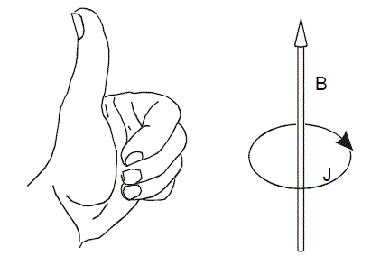

电流越强芳香性越强。如果感应电流的方向和左手定则相反，则会加强外磁场，表现出顺磁性，说明环具有反芳香性，而且电流越强反芳香性越强。如果没有产生明显的贯穿整个环的感应电流，说明这个环是非芳香性的。

感应电流不同位置的强弱和方向可以通过作图来直观考察，也可以对某些键的截面进行积分来获得电流大小的定量数据，这用GIMIC程序可以做到。AICD方法则是根据屏蔽张量矩阵元定义了一种实空间函数，它的数值越大的地方对应电流密度越大处。由于它是标量函数，所以可以很方便地通过绘制等值面图来考察，并可以认为数值较大的等值面包含的区域内电子有较强离域性，其功能某种程度上类似于后面要提到的ELF。而且，这个实空间函数的二分点（详见后文的ELF）大小表明了两个区域间电子相互离域的程度。如果某处的AICD等值面只有将数值调得很大的时候才分离为两个等值面，那么说明电子容易在这两个等值所含区域间离域，环电流也容易通过，这对于证实是否有跨空间芳香性很有用，也是一种判断芳香性强弱的定量指标。实现AICD方法有同名的程序，这程序可以将电流密度矢量直接标注AICD等值面图上，考察感应电流分布十分方便，例如：

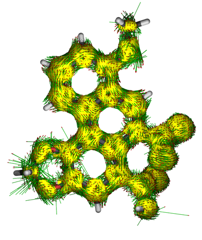

绘制感应电流密度图是十分有用的方法，能让电子离域路径、芳香性/反芳香性/非芳香性区域很客观地展现出来，但是对于较大的多环芳烃这样有多个共轭环连续出现的体系分析起来容易造成误导，内部电流密度的相互抵消导致一些环的芳香性特征在感应电流密度图上被掩盖掉了。如下图所示的coronene，环电流在方向相反的地方抵消掉了（右图只是简化的示意，其实这么表示不严格），因此导致表面看起来仿佛6个外围的六元环不是芳香环，而内部的环表现出反芳香性的假象。当芳香环数目更多，误导性往往更强。

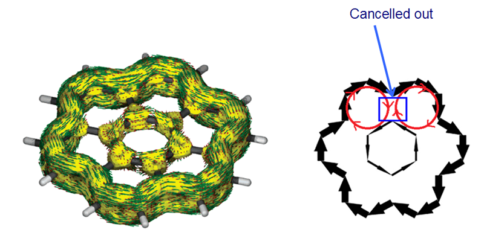

当外磁场方向与环垂直时，NICS_ZZ和磁感应电流密度在物理本质上有很直接的对应关系。如果看到某个环的环电流与左手定则相同/相反，那么表现在NICS_ZZ数值上也会是芳香性/反芳香性。这里NICS_ZZ未必是NICS(1)_ZZ，例如环电流是sigma电子贡献的，那么考察NICS(0)_ZZ就比考察NICS(1)_ZZ更妥当，因为平面上方1埃处sigma电子的效应就比较弱了。由于感应电流密度图分析方法用于分析较大的多环芳烃的芳香性上不很适合，这也导致NICS_ZZ不十分适合用于这类体系。

GIMIC相对于AICD的优点是：  
(1)不仅支持HF/DFT，还支持后HF。特别是开壳层体系相关作用对电流密度影响强，尤为适合用CCSD。  
(2)电流密度的分析能达到定量级别，比如对截面进行积分  
相对缺点是  
(1)对非平面体系可视化不方便  
(2)没法将电流密度分离为正则轨道的贡献，因此不适合分析多重芳香性，特别是金属芳香性体系的芳香性本质。而AICD则允许只考察指定的分子轨道产生的电流密度。

AICD和GIMIC笔者在《使用AICD程序研究电子离域性和磁感应电流密度》（<http://sobereva.com/147>）和《使用GIMIC计算和分析磁感应电流密度》（<http://sobereva.com/155>）中有过详细介绍，建议大家一看。AICD和GIMIC程序最初版本用起来颇麻烦，后来都出了2.0版，可以基于最常用的Gaussian程序计算，相关操作在这里写得非常详细：《使用AICD 2.0绘制磁感应电流图》（<http://sobereva.com/294>）、《考察分子磁感生电流的程序GIMIC 2.0的使用》（<http://sobereva.com/491>，含24分钟演示视频）。

还有一种CTOCD-DZ (continuous transformation of origin of current density-diamagnetic zero)方法也被不少研究者用于绘制感应电流密度。SYSMOIC程序能实现此方法，而且非常好用，对AICD和GIMIC程序有很强的互补性，参见《使用SYSMOIC程序绘制磁感生电流图和计算键电流强度》（<http://sobereva.com/702>）。

SYSMOIC和AICD都可以得到特定分子轨道对感生电流的贡献，但一定要搞清楚它与测量原点之间的关系再讨论，否则可能会得到严重误导性的结论。关于这点，我写了《深入理解分子轨道对磁感生电流的贡献》（<http://sobereva.com/703>）进行深入、具体的说明。

MRE是基于图论和Huckel理论的计算感应电流的方法，这在后文有详细介绍。

### 3.3 Aromatic ring chemical shieldings (ARCS)

按道理来说，先得已知感应环电流，才能得到感生磁场，才得到了磁屏蔽值。ARCS（PCCP,1,3429(1999)）将这个过程反过来，先用量化程序算出穿过环中心且垂直于环的直线上各点的屏蔽值，以此为目标数据，通过拟合来得到感应环电流，并根据环电流大小和方向来判断芳香性。ARCS的拟合模型用的是电磁学上最常见的无限细的圆环导体，其半径也是被拟合的参数之一，通常比较接近于环的几何半径。

实际上ARCS方法和按照前面所讨论的先计算电流密度再对某个键的截面进行积分来得到环电流数值在物理本质上并无差异，只是计算过程不同罢了。ARCS方法计算环电流有很大局限性，目前只能用于单个环，而且环必须接近圆形才行。如果将拟合的模型改为椭圆，倒也有可能用在诸如萘等链状分子上得到分子整体的环电流。目前ARCS是对每个环用一个环形导线模型描述，但如果用多个，或许描述得更为细致，比如对于sigma+pi双芳香性体系有可能同时拟合出sigma环电流和pi环电流。

原则上只要自己用的量化程序能算NICS就能靠ARCS方法得到环电流，某种程度上比分析感应电流密度方便点，不过拟合ARCS环电流的程序得自己写，笔者认为其可靠性也不如直接分析感应电流密度。

### 3.4 磁化率提高Λ(Magnetic susceptibility exaltation)和抗磁化率各向异性

磁化率是顺磁化率（正贡献）和抗磁化率（负贡献）之和，它们都用二阶张量（矩阵）描述。

磁化率提高Λ（JACS,90,811(1968)）主要用于实验测定芳香性。假设化合物的各向同性磁化率为A，而对应的电子定域化的异构体的各向同性磁化率为B，则A减B就是Λ，体现了电子离域效应造成的额外的对磁屏蔽的效果。这里所指的磁化率是各向同性值，即磁化率张量对角元的平均值。Λ越负代表电子离域效应使实际体系磁化率降低得越多，芳香性越强；接近0代表非芳香性；越正代表反芳香性越强。Λ和NICS有很大雷同之处，物理本质也是相似的。从计算化学角度上看Λ没什么价值，算起来也麻烦，算NICS就行了。  
（注意此方法名字中的“提高”是指抗磁化率大小因电子离域导致的增加，增量越大也就是指抗磁化率数值变得更负，总磁化率更小。有些文中用到Λ时特意将名字中的Magnetic写为diamagnetic以免混淆。另外注意，此方法的JACS原文及其它一些文献中的Λ的数值的正负号与如今习俗是相反的）

抗磁化率χ的各向异性值Δχ自古就被用来衡量芳香性，因为其各向异性本质是由于环上电子离域性所产生的，和芳香性直接相关，这个概念的提出可以追溯到L.C.Pauling 1936年的文章JCP,4,673。Δχ=χ_11-(χ_22+χ_33)/2。这里χ_11、χ_22、χ_33指的是χ矩阵的绝对值由大到小的三个本征值，数值越负表明芳香性越强。χ也可以通过实验或理论计算获得。但是由于实验上测定各向异性值需要先对化合物进行结晶，所以不如获得Λ那么方便。

顺磁化率/抗磁化率可以在Gaussian程序中通过NMR=Susceptibility计算。所得输出文件中会有诸如这样的抗磁化率信息  
 Diamagnetic susceptibility tensor (au)  
   XX=      -263.8815   YX=         0.0000   ZX=         0.0000  
   XY=         0.0000   YY=      -145.1938   ZY=         0.0000  
   XZ=         0.0000   YZ=         0.0000   ZZ=      -136.8484  
   Isotropic diamagnetic susceptibility =      -181.9745  
由于当前体系是C2v对称性，且计算时开启了对称性，使得输出的抗磁化率张量直接就是对角矩阵，本征值就是对角元，故Δχ=-263.8815-(-145.1938-136.8484)/2=-122.8604 a.u.。如果矩阵不是对角化的，需要自行计算矩阵的本征值再算Δχ。

## 4 基于几何结构的方法

本节介绍的方法只依赖于几何结构信息，从键长的变化角度衡量芳香性。

### 4.1 Harmonic oscillator measure of aromaticity (HOMA)

HOMA是最为常用也是历史十分悠久的基于几何结构的衡量芳香性的方法。最初是在Tetrahedron Lett.,36,3839(1972)中定义的，后来在J. Chem. Inf. Comput. Sci., 33, 70 (1993)中被广义化，表达式为

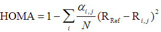

其中N是环上的原子数，i循环环上的每个原子，j是它的下一个原子，R是键长。α和R_ref都是事先计算好的常数，和键的类型有关，在原文中已提供，后者是理想的芳香性体系的平衡键长。HOMA的函数形式基于谐振势，这是名字中Harmonic oscillator的由来。如果环上的所有键都和相应的R_ref相同，显然体系就是理想的芳香性体系（例如苯），所以HOMA越接近1说明芳香性越强；若HOMA接近0，说明是非芳香性（α的确定方式就是使kekule结构的苯HOMA值精确为0）；如果是负值，表现出键长极度不均衡，反映出反芳香性特征。

还有一些研究者在HOMA上动一些手脚，例如JPCA,107,7496(2003)中就把HOMA的键长替换为离域化指数，定义为θ指数；再比如Bultinck等人在J.Phys.Org.Chem.,18,706(2005)中提出的BOIA(Bond order index of aromaticity)定义为BOIA=1-(1/6)∑(B_i-B_ref)，和HOMA主要差异也就是把键长替换为了键级。这类在HOMA上做一些小修改来得到新的芳香性指数的做法和HOMA定性结果往往大同小异，笔者也就不将之纳入Multiwfn了。由于键级和模糊空间下的离域化指数在Multiwfn中都能算，因此θ和BOIA想算的话自己手算即可，也不麻烦。

在Multiwfn中提供了计算HOMA的工具，并且涉及到的参数都可以自定义。还是以菲为例，启动Multiwfn后首先输入包含菲的结构的文件，fch/wfn/wfx/pdb/xyz等等类型文件都包含分子结构信息所以都可以。然后选25，再选6进入HOMA计算界面。如果想自定义参数，就选1。按0可以开始计算，用户需要输入环上的原子序号，例如3,4,8,9,10,7（对应菲的中央的环）。这些原子必须依次相邻，顺时针还是逆时针顺序都可以。之后结果马上输出出来，如  
        Atom pair         Contribution     Bond length  
   3(C )  --    4(C ):      -0.065698        1.427111  
   4(C )  --    8(C ):      -0.210455        1.458000  
   8(C )  --    9(C ):      -0.065698        1.427111  
   9(C )  --   10(C ):      -0.096016        1.435282  
  10(C )  --    7(C ):      -0.033673        1.360000  
   7(C )  --    3(C ):      -0.096016        1.435282  
HOMA value is    0.432442  
每个键的键长以及它对HOMA的贡献值都会输出。由于C4-C8偏离理想芳香键键长很大，导致HOMA值下降很多。接下来再计算边缘的环，结果是0.855126，由于比中央的环更接近于1，所以明显比中央的环芳香性更强。

HOMA的一个缺点是预先提供的参数比较有限，包括C-C、C-N、C-O、C-P、C-S、N-N、N-O，如果有其它元素参与就没法用了。而且根本没法用于研究诸如三个乙炔聚合形成苯环过程、Diels-Alder加成反应过程中芳香性的动态变化。HOMA的一个主要优点是只要有分子结构就行，不依赖于电子结构信息，计算量可以忽略不计。

HOMAc和HOMER芳香性指数分别在Phys. Chem. Chem. Phys., 25, 16763 (2023)和J. Org. Chem., 90, 1297 (2025)中提出，是对HOMA的R_ref和α参数的重新定义。HOMAc衡量基态芳香性比HOMA更理想、与NICS(1)zz有更好的相关性；HOMER侧重于衡量T1态芳香性且表现不错，而HOMA对此完全失败、与NICS(1)zz的相关性近乎为0。这两个指数在Multiwfn的主功能25里通过相应选项可以计算，从2025-Feb-4及以后更新的Multiwfn版本里才有，用法和HOMA没区别。

### 4.2 Bird芳香性指数

Bird芳香性指数在Tetrahedron,41,1409(1985)当中被提出，表达式为

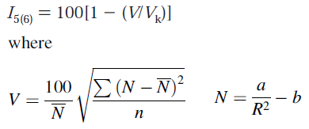

其中加和符号循环环上的每个键，R是键长，N是Gordy关系式计算的键级。N上带一个横杠是环上的键的N值的算术平均值。n是键的数目，V_K是参考值，对于五元环和六元环分别为35和33.2。a和b是Gordy关系式预设的参数，在Tetrahedron,57,5715(2001)当中给出了新的a和b参数。Bird芳香性指数越接近100，说明键的均衡性越好，芳香性越强。

Bird芳香性流行程度远不及HOMA，且比起HOMA适用的元素类型更少，且只适合五、六元环。在Multiwfn中计算Bird的步骤和计算HOMA的步骤几乎一样，唯一不同的是，进入主功能25里的子功能6后，不是选择0，而是选择2。利用选项3可以自定义各个元素之间的键的a、b值，利用选项4可以自定义V_k值。

## 5 基于能量的方法

本节介绍的方法基于能量标准来衡量芳香性。

### 5.1 离域化能及HOSE(Harmonic oscillator stabilization energy)

离域化能是指体系从定域化的电子结构（由Lewis式描述）转化到实际的离域化的电子结构过程中的能量的变化。是否将几何结构的变化对能量影响考虑进去，又可以分为垂直和绝热离域化能。苯的离域化能就是从kekule式描述的三个双键+三个单键转变为实际的6个单键+1个六中心六电子大pi键的能量变化。芳香性越强，电子离域性越强，离域化能也就越大。

离域化能这个概念很好，但是计算时很困难。一方面是以什么结构Lewis结构作为参考标准的问题；另一方面更棘手，是用什么程序怎么实际去算的问题，下面谈几种可行的手段：  
(1)离域化能在VB框架中称为共振能(Resonance energy, RE)。价键理论(VB)用在计算离域化能很合用，因为VB计算时可以明确指定成键方式，因此能直接得到电子定域化状态的能量。然后把所有可能的lewis结构在计算时一起考虑，对它们各自的系数变分，得到的就是在这些定域化状态间相互共振的状态的能量，这等同于电子离域状态。将这个能量减去定域化状态的能量即得到共振能。不幸的是VB在目前是比较小众的计算方法，门槛略高。  
(2)NBO的二阶稳定化能(E2)分析。NBO是定域化的轨道，占据的NBO轨道与空的NBO轨道间的E2对应了电子从前者向后者的离域化造成的能量降低。把体系中各种与环上电子离域相关的E2都考虑进去，就能估计环上电子的离域化能。但是这个方法很不推荐，或者只能很定性地研究。因为E2不具备加和性，而且E2只是低阶的微扰理论，而芳香环上电子的离域远非“微”的级别。而且还有其它一些原理上的缺陷，这需要对NBO有一定认识才容易理解，这里就不多讨论了。另外还有人用类似Fock矩阵元消除法来获得稳定化能。  
(3)BLW(block-localized wave function)方法。此方法原文见JCP,109,1687(1998)。这个方法是基于MO理论的，可以用在HF或DFT上。BLW方法是将体系的基函数划分为位于特定片段上的数个子集，在SCF过程中只允许MO在这些子空间里分别展开。于是每个子空间里的MO是正交的，而每个子空间内的MO与其它子空间的MO是非正交的。利用BLW方法可以得到与lewis式对应的定域化的波函数，并得到对应的能量。令体系实际能量减去BLW波函数的能量就是离域化能。BLW可以结合GAMESS-US和XMVB程序计算，见<http://wiki.lct.jussieu.fr/workshop/index.php/BLW>。不过虞忠衡指出使用BLW计算离域化能有严重缺陷，见<http://blog.sciencenet.cn/blog-94786-423823.html>。虞忠衡也提出了计算稳定化能的方法，见其blog上一系列文章，这里就不多提了。

以上三种方法是基于电子结构的方法来计算垂直或绝热离域化能。而HOSE(Harmonic oscillator stabilization energy)是基于几何结构的变化按照谐振势来计算绝热离域化能，其表达式如下

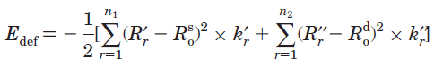

式中R'_r和R''_r代表实际分子中的pi键键长，n1和n2分别代表kekule式对应结构的单键和双键的数目，k是力常数。因此HOSE描述了分子从实际几何结构变化到Kekule式描述的电子定域化的几何结构过程中所需的能量的负值，或者说是源自电子离域效应产生的实际结构相对于kekule结构的稳定化能。

关于计算离域化能其它的一些细节讨论和历史上的方法可参见Chem.Rev.,105,3773(2005)。

### 5.2 芳香稳定化能(Aromatic stabilization energy, ASE)

ASE和离域化能都是基于能量来分析芳香性的标准，体现电子离域导致的能量变化，但ASE的计算方法与之截然不同。ASE计算过程是构建一个开环的等键化学反应。反应能如果算出来是正值，即吸热，说明体系是芳香性；如果是负，即放热，说明是反芳香性。例如苯的ASE可按如下方式计算，能量是B3LYP/6-31G*下得到的

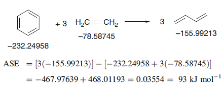

一般认为ASE>5kcal/mol就可以算是有芳香性了。计算ASE时构建的等键反应有任意性，不同的构建方式结果会有所不同，如果构建得不合适，甚至结果会不靠谱，详见Computational Chemistry-Introduction to the Theory and Applications of Molecular and Quantum Mechanics 2ed(Errol Lewars)一书307页的讨论。

ASE最大的弱点就是计算极其麻烦。对于一个复杂的大体系，或者诸如金属芳香性体系，构建一个合理、有意义的等键反应几乎不可能。构建方式的不唯一性也导致不容易对不同文献的结果进行对比。所以我不认为如今使用ASE讨论芳香性有多大价值，除了对于简单小体系。

### 5.3 磁共振能(Magnetic resonance energies, MRE)

MRE是一种计算ASE和环电流的方法，详见JACS,128,2873(2006)、JPCA,111,8873(2007)。MSE基于图论和Huckel理论，只要知道分子拓扑关系即可进行计算，计算时只需要一个参数即Huckel共振积分。此方法只能用于pi芳香性研究。

这个方法计算时要考虑体系全部可能的环路。比如菲不是只包含三个六元环路，而是包括三个六元环路、两个10元环路和一个14元环路。对于每个环路，比如第i个环路，可以计算相应的A_i值，它为正值和负值说明这个环路的感应环电流起抗磁（电流方向符合左手定则）和顺磁（电流方向与左手定则相反）作用。A_i也被称为环路共振能(CRE)，将当前体系的所有A_i加起来，得到的就是当前体系的MRE，可视为是离域化能。

根据I_i=4.5*I_0*A_i*S_i/S_0可以计算第i个环路的环电流，其中I_0是苯的环电流，S_i是第i个环的面积，S_0是苯环的面积。将所有环路的环电流累加到一起，就能绘制出整体感应电流图。这和AICD那些方法得到的不一样，那些方法可以得到空间中每个具体的点感应电流密度，而MRE的电流图给出的只是每个键上电流大小和方向信息，如下所示。

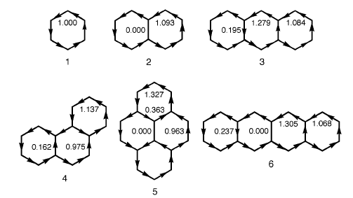

MRE方法的优点是不依赖于量化计算，不依赖于具体几何结构，只根据拓扑关系就能迅速得到离域化能和感应电流分布。而且不像大多数芳香性判据那样只能算每个小环的芳香性（比如对菲只能算三个六元环），而是可以研究体系中任意环路的稳定化能和环电流。此方法的缺点也很多，即只能用于平面pi体系、精度仅是HMO级别、不能用于非平衡构型或非基态或开壳层、体现不了键的拉伸产生的影响、不能用于诸如金属簇等体系等等。MRE最适合的体系就是多环芳烃（可以含杂原子），特别是尺寸很大的情况。实现MRE的程序据笔者所知目前没有公开的，不过估计也不会很难写。

## 6 基于电子离域性的方法

本节介绍的方法都比较直接地与电子离域性相联系。

### 6.1 多中心键级

多中心键级也叫多中心键指数，定义为

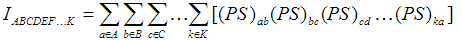

其中P是单电子密度矩阵，S是重叠矩阵，a,b,c...代表基函数序号，A,B,C...代表环上的原子序号，并且这些原子是按照在环中的连接关系相邻的。

多中心键级理论依据强、普适性广，是寡人强烈推荐使用的衡量芳香性的方法。它的数值越大说明芳香性越强。它也可以用在开壳层，只要把密度矩阵换成alpha和beta电子的密度矩阵分别计算，然后带上特定系数相加即可。多中心键级的一个遗憾是没法用来分析反芳香性，反芳香性的体系只是多中心键级很小而已，故和芳香性很弱的体系没法区分开。

多中心键级可以在Multiwfn当中计算，考虑的原子数没有上限。启动Multiwfn后载入fch或molden等含有基函数信息的文件，然后选9，再选2，输入环上的原子序号（必须在环上依次相邻），如3,7,10,9,8,4，然后多中心键级数值会立刻输出，输入几个原子序号就计算几中心键级。注意顺时针和逆时针输入环上的原子序号的结果有时会有微小差异，原理上都对，取谁都可以，取平均值的话更为严谨（可以把settings.ini里的iMCBOtype设为1，此时给出的数据直接就是两个方向输入的计算结果的平均值）。

顺带一提，多中心键级的计算耗时原本是随考虑的原子数增加呈指数型增长的，对于超过12个原子的情况即便在比较小的基组下也不可能算得动。卢天于2020年提出了一种多中心键级的超快计算方法，使得多中心键级的计算耗时随原子数增加只是呈线性增长，用于含有几十个原子的环也毫无压力，这大大拓宽了多中心键级的应用范畴。2020-Sep-12及以后发布的Multiwfn版本支持了这个算法。

需要注意的是以一般方式计算多中心键级时切不可使用弥散函数，否则结果会缺乏意义。虽然也有诸如多中心离域化指数（Theor.Chem.Acc.,105,292(2001)）等类似的指标能够用来衡量芳香性，可以减小多中心键级的基组依赖性，尤其是能够解决不适合弥散函数的问题，但计算明显更费时。在Multiwfn中支持基于自然原子轨道(NAO)计算多中心键级，具体做法见Multiwfn手册3.11.2节，此时计算的多中心键级就不怕弥散函数了，而且还有一个额外好处是计算结果与顺时针还是逆时针输入原子序号完全无关。

对于纯平面体系，sigma和pi电子的多中心键级是可加和的，因此多中心键级可以分别研究sigma和pi芳香性。对于非平面体系，如果基于定域化轨道计算，也可以近似实现多中心键级对sigma和pi电子贡献的分离，相关说明和例子看《在Multiwfn中单独考察pi电子结构特征》（http://sobereva.com/432）。

Bultinck等人的文章鼓吹计算多中心键级时应当将原子序号的各种置换组合都考虑进去，此时计算结果就完全和输入的原子序号顺序无关了。但这样计算多中心键级非常耗时，而且此时的结果并不适合研究芳香性，因为反映的并不是沿着环的路径的离域强弱，不过此时倒是适合研究某个簇状区域的整体离域情况。如果想计算这种多中心键级，将settings.ini里的iMCBOtype设为2之后，照常计算时输出的多中心键级就是这种了。详见Multiwfn手册3.11.2节。

### 6.2 ELF-sigma/pi和LOL-sigma/pi

电子定域化函数(Electron localization function, ELF)是Becke提出的衡量电子定域性的实空间函数，目前有极为广泛的应用。此函数的在《电子定域性的图形分析》（<http://sobereva.com/63>）中从图形的角度进行了介绍，在 物理化学学报, 27, 2786 (2011) 中作者对ELF的函数形式和物理意义做了详细的讨论，更多相关信息看“ELF综述和重要文献小合集”（<http://bbs.keinsci.com/thread-2100-1-1.html>）。可以认为，被数值越高的ELF等值面包围的空间，电子越容易在这个空间内离域，同时越难离域到这个空间之外。

在JCP,120,1670(2004)中，作者提出了ELF-sigma和ELF-pi用于研究sigma和pi芳香性。前者就是在计算ELF时只考虑pi以外的轨道，后者就是计算ELF时只考虑pi轨道。注意哪怕是对平面体系，ELF也不能分解为ELF-sigma和ELF-pi的加和，但使用ELF-sigma和ELF-pi研究问题确实有实际价值，所以也就无视这个理论上的小缺陷了。

ELF等值面的数值(isovalue)取得越大，等值面内的空间（称为域）就会越来越小。如果域内含有多个ELF极大点（叫可约域），则随着isovalue的增加，这个连通的域就会逐渐分解为多个小的孤立的域，最终每个域内只包含一个ELF极大点（叫不可约域）。不同isovalue时苯的ELF-pi和ELF-sigma等值面如下图所示

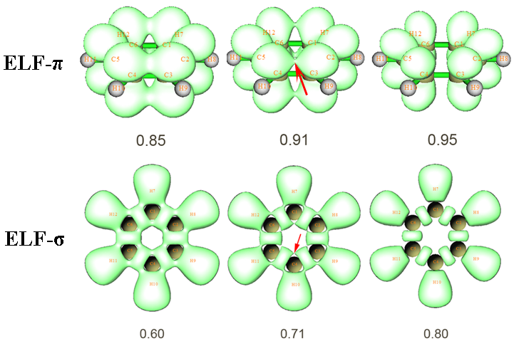

可见，对于ELF-pi等值面，当isovalue=0.91时，在苯环上方、下方对应离域pi电子的连通的可约域恰好要分解为六个碳原子上的不可约域，故0.91就是讨论芳香性时候苯的ELF-pi值。红箭头所示的位置被称为二分点(bifurcation point)。不同体系ELF-pi值不同，pi芳香性越强的体系ELF-pi可约域分解得越晚，即ELF-pi值越大。多数体系并非像苯这样是每个键都对称的，因此ELF-pi可约域在环上的某些键上分解得早，在有的键上分解得晚，ELF-pi应当取最先出现分解时的值，而最先分解处也对应了环共轭最弱的位置。

ELF-sigma函数在构成共价键的原子间总有极大点，对应一块ELF-sigma值较高的区域。衡量芳香性所取的ELF-sigma值指的是环上的这些相邻的高ELF-sigma区域之间的二分点，对于苯，就是上图红箭头所示的位置。由于是在isovalue=0.71时恰好在此处从连通的可约域分解开来，因此苯的ELF-sigma值为0.71。

Chem.Rev.,105,3911(2005)中指出ELF-pi大于0.7的体系可以算作是有pi芳香性的，在0.11~0.35可以算是有pi反芳香性的。对于有机分子，ELF-pi和ELF-sigma平均值大于0.7可以算作有整体芳香性，小于0.55的体系可以算作有整体反芳香性。

在Multiwfn中计算ELF-sigma/pi的方法是：先载入含有波函数信息的文件，利用主功能100里的选项22把pi轨道占据数设为0（对于计算ELF-sigma来说），或把其余轨道占据数设为0（对于ELF-pi来说）。然后进入主功能5，选ELF，再选合适的格点设定（小体系通常选2即可，大一些的体系适合选3）。格点数据算完后选-1，在蹦出来的图形界面里从小到大逐渐调节isovalue，直到ELF-sigma或ELF-pi等值面开始出现二分为止，就确定了ELF-sigma或ELF-pi的数值。另一种方法就是在设完占据数后用主功能2来进行拓扑分析找到精确的二分点位置，并获知相应位置的ELF-sigma/pi值，这样做没有观看等值面那样直观，但是结果更精确。非常具体的分析绘制ELF-pi的操作说明和示例见《在Multiwfn中单独考察pi电子结构特征》（<http://sobereva.com/432>）。

其实寡人并不完全赞同上述这种通过ELF-sigma/pi衡量芳香性的做法，因为只靠空间中个别的点的性质就断定整个环的芳香性，这难免考虑得不够周全，更合理的是诸如考虑一部分区域的ELF-sigma/pi。

在这里特别要指出的是，ELF-sigma/pi数值在目前的众多文献中十分混乱！问题极其严重！！！笔者发现很多文献中的ELF-sigma/pi值根本没法重现，有的明显不合理。主要原因可能是那些作者用的程序和操作步骤可能有误，更主要原因是对于复杂体系（对于苯的例子没体现出来），会涉及到一大堆二分点，取哪个二分点来定义体系的ELF-sigma/pi值（尤其是ELF-sigma）是个很含糊的问题，不同研究者取的二分点经常不一致。这导致文献中的ELF-sigma/pi值乱七八糟，有的体系的芳香性被明显高估或低估。导致目前这种糟糕局面体现了ELF-sigma/pi这个研究方法本身的缺陷，而原作者一开始也没严格地说清楚碰到复杂情况时该怎么选二分点。遗憾的是至今也没有人撰文指出目前文献中的ELF-sigma/pi值已经乱得一塌糊涂，导致鲜有人重视这个严峻问题，取二分点的标准始终没能标准化。这样下去早晚要出大麻烦。

定域化轨道定位函数(Localized orbital locator, LOL)是Becke在J.Mol.Struct.(Theochem),527,51(2000)当中提出的和ELF在定义及实际功能上都十分相似的实空间函数。现在也有少数文章开始用LOL-sigma和LOL-pi来讨论sigma和pi芳香性，例如PCCP,13,20584(2011)，但是研究方法还没标准化，还没像ELF-sigma/pi那样得到普遍认知。使用LOL代替ELF研究芳香性可能会有更好的效果。对于大量芳香性体系，LOL-pi不像ELF-pi那样在pi键上有二分点，而是有局部极大值，直接对应了pi键，故分析比较便利（而ELF二分点的性质只能够间接地展现pi键）。苯的LOL-pi等值面如下所示，pi键上的LOL-pi极大点在isovalue=0.7时很鲜明。通过对比也能看出LOL-pi的等值面不像ELF-pi那么鼓，延展不到氢那边去，因此分析pi问题时显得比ELF-pi更干净清晰。

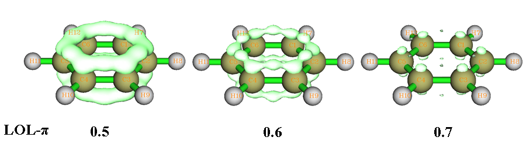

在Multiwfn里计算LOL-sigma/pi的过程和计算ELF-sigma/pi几乎完全一致，唯一不同的就是选择要算的实空间函数时选择LOL而非ELF。

另外还有文章用其它能够衡量电子定域性的实空间函数，如ELI-D来研究芳香性，但ELI-D函数定义比ELF/LOL更复杂，计算更耗时更麻烦，从结果上看也没什么额外的好处，可以无视掉。

### 6.3 PDI和ATI

电子的交换相关密度Γ(r1,r2)依赖于两个电子坐标，A、B两原子间的离域化指数(DI)定义为∫∫Γ(r1,r2)dr1dr2，其中r1和r2分别是在A和B的原子空间内积分。实际计算中DI的公式可以写为  
DI(A,B)=2*∑∑√(η_m*η_n)*S_m,n(A)*S_m,n(B)  
两个加和号对应令m和n在所有分子轨道中循环。η代表轨道占据数，S_m,n(A)代表m和n号分子轨道在A的原子空间内的积分值。S称为原子重叠矩阵(AOM)。DI最初的定义中原子空间用的是AIM原子空间，也叫原子盆。关于交换相关密度和离域化指数更具体的内容已经分别在Multiwfn手册的2.6节的第17部分和3.18.5节进行了十分详细、清晰的讨论，这里就不重复了。可以简单认为两个原子间DI越大，那么电子在两个原子间离域程度越高。

对于苯的DI研究发现，对位两个原子间的DI明显要比间位的大，尽管间位的两个原子间离得更近。这表现出芳香环上电子离域的独特特点。基于这一点，在Chem.Eur.J.,9,400(2003)当中作者提出了PDI来衡量六元环芳香性，也就是三个对位的DI值的平均值：  
PDI=[DI(1,4)+DI(2,5)+DI(3,6)]/3  
芳香性越强，对位的DI越大，PDI也就越大。PDI可以很好地反映化学反应进程中芳香性的变化，但主要缺点是没法用于非六元环，以及没法合理表现出环平面的扭曲造成的芳香性的减弱，比如苯环变成船型。也有文献指出PDI对于带很多正电荷的富勒烯，如C60(10+)的局部芳香性描述有错误。

对于平面体系，由于DI可以精确地分离为sigma和pi部分的加和，因此PDI也可以相应地分离为PDI-sigma和PDI-pi用于单独研究sigma和pi芳香性。

在AIM原子空间中进行积分十分耗时，因为其边界复杂，不容易得到较精确的积分值，这是为什么算AIM电荷很耗时的关键原因。相应地，在AIM空间中计算AOM也十分耗时，而DI的计算耗时几乎全都花费在计算AOM上。所以使用AIM方式定义原子空间导致PDI的计算比较慢，尤其是对于大体系这更要命。模糊空间是另一类划分原子空间的方式，相邻原子空间之间是平滑过渡的，没有明确的边界。模糊空间有许多不同的具体定义方式，如Becke空间、Hirshfeld空间、ISA空间等。在模糊空间内对函数进行积分比较容易（通常用DFT的交换相关泛函的积分方法来做），因此在模糊空间下计算AOM可以使DI和PDI的计算很快地完成。在JPCA,110,5108(2006)中，作者证明使用模糊空间代替AIM空间来计算PDI研究芳香性是很合理的，这样可以节省大量时间。

Mayer键级的计算比起在模糊空间下计算DI又进一步显著节省了计算时间，在J.Phys.Org.Chem.,18,706(2005)作者提出可以将PDI公式里的DI替换为Mayer键级，此时的PDI被称为ATI(Average two-center indices)。测试表明ATI和PDI（AIM空间下计算的）有很好相关性。实际上，如JPCA,109,9904(2005)所证明的，Mayer键级可以视为是希尔伯特空间下计算的DI，物理本质上没有区别，所以有这样好的相关性是很自然的事情。此文也证明了模糊空间下的DI和“模糊键级”（CPL,383,368(2004)）是完全等价的。

注意AIM空间和模糊空间下计算DI对基组的敏感性都不高，虽然可以用，但没必要用大基组，算PDI用6-31G*就够了。由于DFT下的离域化指数的物理意义不清楚，所以原则上建议在HF下计算PDI。不过用杂化泛函时，从DI的数值结果上看倒也没什么不妥，实际上很多文章用的就是在B3LYP下计算的DI和PDI。而Mayer键级对基组敏感性略大，尤其不适合在弥散函数存在的情况下计算，算ATI的话通常也用6-31G*就行了。

Multiwfn中计算模糊空间下的PDI的方法是：首先载入含有波函数信息的文件，然后选15进入模糊空间分析功能，然后选5。程序会先在模糊空间下计算AOM并产生各个原子间的DI值，然后用户需要输入环上的六个原子序号，如2,3,4,7,10,11，输入顺序需依照原子连接关系。然后PDI值马上会输出出来。Multiwfn默认用的模糊空间的定义是Becke所提出的。用户也可以通过选项-1切换为Hirshfeld定义的模糊空间，但是它依赖于孤立原子密度，所以用户得提供孤立原子的波函数文件，故略微麻烦，从结果物理意义上来讲并不比Becke空间下计算的有显著优势。

Multiwfn中可以计算Mayer键级，方法是首先载入fch文件，然后选9再选1，此时大于默认阈值0.05的Mayer键级就会被输出出来。如果没有出现所要找的项，那么在启动Multiwfn之前可以在settings.ini文件里将bndordthres阈值设很低，比如设为0，则所有Mayer键级都会输出。程序也会问你是否将键级矩阵输出出来，从键级矩阵里也可以直接找到所有原子间的Mayer键级。得到环上三个对位的Mayer键级后，取平均即得到了ATI。

对于平面体系，Mayer键级和DI都可以精确地分离为sigma和pi部分的加和。因此ATI和PDI都可以分离为sigma和pi部分以单独研究sigma和pi芳香性。在Multiwfn中的做法是在计算PDI/ATI之前，按照前面提到过的，先用主功能100里的功能22来设定占据数，之后再照常计算PDI/ATI即可。

### 6.4 线性响应核和对位线性响应指数(para linear response index, PLR)

在密度泛函理论框架中定义了线性响应核(Linear response kernel, LRK)，并且基于二阶微扰理论可以得到闭壳层下KRL的近似形式：

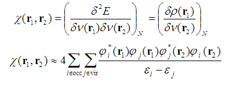

其中ε代表分子轨道能量，φ代表分子轨道波函数。occ和vir分别代表占据和空轨道。

LRK体现了在r2处对外势的扰动产生的对r1处电子密度的影响值，某种程度上也表现了r1和r2处的电子耦合程度，这一点和自旋相同电子间的费米穴函数有相似之处。对于定域性较强的电子结构，比如烷烃，那么只有r1和r2较近时LRK才可能较大。而如果电子离域性很强，并且离域范围明显涵盖r1和r2，那么哪怕r1和r2离得较远，LRK数值仍然可能较大。由于LRK能用于探测离域程度，而离域又是芳香性的基础，近来有人受这个启发，利用LRK衡量芳香性。

直接用LRK图形化分析很不方便，因为它是六维函数。在PCCP,14,3960(2012)中定义了Condensed LRK (CLRK)，可以写为

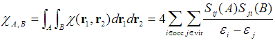

其中A、B代表原子空间，PCCP,14,3960(2012)中用的是Becke模糊空间。S是前面已提到的原子重叠矩阵。两个原子间的CLRK定量地表现出两个原子间相互作用强度，也隐含地表现了两个空间内电子相互离域程度。形式上可以看出CLRK计算方式和DI十分类似，在doi:10.1039/C2CP43612D文中作者从数学上分析了二者间的密切关系。

类似于DI，在苯环上，也是对位间的CLRK比间位的大很多。因此基于CLRK，在PCCP,14,3960(2012)中进一步定义了对位线性响应指数(PLR)。PLR和CLRK之间的关系和PDI与DI之间的关系完全一致，也就是六元环当中对位间的CLRK值取平均，即  
PLR=[χ(1,4)+χ(2,5)+χ(3,6)]/3。

在衡量芳香性问题上，现有的文章显示PLR和PDI几乎没有差别，线性相关性高达R^2=0.96，缺点和优点完全一样。由于CLRK也可以像DI那样分离为sigma和pi部分，故PLR也可以分离为PLR-pi和PLR-sigma。PLR和PDI用谁都可以，但从计算量上来说，由于LRK要涉及到虚轨道，DI只涉及占据轨道，而虚轨道数目往往比占据轨道多很多，所以PDI比PLR更省时。PLR刚刚提出不久，在有更多文章表明PLR比PDI在某方面有显著优点之前，在我看来只用PDI就行了。

在doi:10.1039/C2CP43612D中，作者也直接通过CLRK而非PLR来衡量芳香性，这样就不局限于六元环。通过对不同四元环到八元环的体系的研究，作者提出一套假设：  
(1)对于芳香性环体系，相对着的两个原子间CLRK值为最大。比如六元环就是指1-4位原子间，七元环指1-4或1-5位，八元环指1-5位。  
(2)对于反芳香性体系，相对着的两个原子间CLRK值为最小（原文说的是“局部极小值”），并且双键上的两原子间CLRK值为最大。  
如果芳香性/反芳香性来自pi电子，应考察的是CLRK-pi；如果是sigma电子，应考察CLRK-sigma。

CLKR和PLR都可以在Multiwfn中直接计算。首先载入含有基函数信息的文件如fch、molden（不能用wfn/wfx文件，因为其中无虚轨道信息），然后进入主功能15，选9即可计算并输出CLRK矩阵。选10的话，会自动先计算并输出CLRK矩阵，然后让你输入环上的原子序号，如3,4,5,7,10,11，需符合原子连接关系。然后PLR值立刻会立刻显示出来。如果想只考察sigma或pi电子贡献的CLKR或PLR，依然是先用主功能100里的22先设占据数后再做计算。

### 6.5 ΔDI

在Chem.Eur.J.,9,400(2003)中作者除了提出PDI用于衡量六元环芳香性，还提出了一种靠DI衡量五元环芳香性的方法，称作ΔDI。如下图所示，五元环的最典型Lewis结构式包含C-C单键和C=C双键

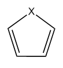

令C=C双键的DI减去C-C单键的DI，就是ΔDI。显然，环的芳香性越强，单双键的区别就越不明显，因此ΔDI也越小。对于C5H5-，已经无法区分单双键，所以ΔDI达到最小值0。通过测试发现ΔDI与NICS有一定相关性，但是也有少数体系二者相关性并不好。

原文计算ΔDI时用的是在AIM空间下计算的DI。在模糊空间下计算DI，或者改用Mayer键级来计算也都是可以的。文中也发现哪怕直接用键长求差值得到的Δr，也和ΔDI相关性很好。

ΔDI计算极其便利，但笔者认为ΔDI称不上是很可靠的方法，关键一点是它只考虑了五元环的碳碳键部分，却忽略了上图中C-X键部分，这明显很不周到。

### 6.6 FLU和FLU-pi

在JCP,122,014109(2005)，作者提出了FLU(Aromatic fluctuation index)来衡量芳香性，它和HOMA挺类似，也是以理想芳香性环上的键的性质作为参考，来衡量实际的环上的键与它的偏离。相对于参考值偏离（波动）越大，说明芳香性越弱。FLU基于的是DI，既可以是AIM空间下计算也可以是模糊空间下计算，实际上换成Mayer键级估计也没问题。FLU的定义如下：

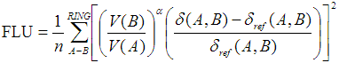

加和号循环环上所有键。n是环上原子数，δ(A,B)代表AB间的DI。δ_ref是相应类型的键的参考DI值，取自理想芳香性环（C-C、C-N、B-N键的参考值分别来自苯、嘧啶、borazine）。V代表原子价，对于闭壳层体系，V(A)也就是对B≠A的所有δ(A,B)的加和。当V(B)>V(A)，α为1，反之为-1。将V(B)/V(A)引入式子中的目的是惩罚电子定域性较高的情况，而HOMA式子中没有与之对应的项。

FLU可以用于任意尺寸的环。缺点是不适合用于非平衡状态的体系，包括反应过程中芳香性的变化。更主要的缺点是引入了参考体系，这导致普适性差。

在同一篇文章中作者也提出了FLU-pi。和FLU的区别一方面是把所有DI值都替换为了DI的pi部分，另外就是把参考值换成了当前环上的所有键的DI-pi的平均值：

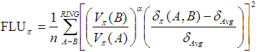

和FLU一样，依然是数值越低表明芳香性越强。FLU-pi相对于FLU的好处是避免了引入参考体系而能够适用于包含更多元素的体系，而缺点是FLU-pi只能用于平面体系，也只能体现pi电子芳香性。注意这里说的平面只是指所要研究的环是平面的，但不要求整个体系都是平面，因为利用轨道定域化方法，可以得到定域在感兴趣的环上的pi轨道，而DI也是可以基于定域化轨道来计算的。

在Multiwfn中可以在模糊空间下计算FLU。首先载入含有波函数信息的文件，然后选15，再选6，程序就会先在模糊空间下计算AOM并输出DI矩阵。然后用户按照连接关系输入环上的原子序号即可，FLU值和每个键对它的贡献都会立刻输出，由后者可以考察哪些键对芳香性有主要削弱效应。计算FLU所涉及到的参考值可以通过选项-4来设，默认参考值是笔者在HF/6-31G*下对苯、嘧啶、borazine计算的。如果用户用的方法和基组与此有明显不同，建议用户自行用这些参考体系计算一下DI参考值并在计算FLU前输入Multiwfn，否则FLU会有偏差（比如算得的苯的FLU将不是精确的0）。

在Multiwfn计算模糊空间下的FLU-pi的步骤是：首先载入含有波函数信息的文件，选15，再选7。待AOM和DI计算完毕后，输入占据的pi轨道的编号，比如输入17,20,21，然后再按照连接顺序输入环上的原子序号即可。读者可以利用主功能0来图形化观察分子轨道以确定哪些轨道是pi轨道，也可以利用主功能100里的选项22，来让程序自动找出pi轨道的编号（之后选0直接退回）。

目前FLU/FLU-pi都只对闭壳层进行了定义，在Multiwfn中也只能将它们用在闭壳层体系。如果读者对PDI和FLU/FLU-pi有更多兴趣，可参见综述文章The Quantum Theory of Atoms in Molecules-From Solid State to DNA and Drug Design书中的第15章。对菲计算PDI、FLU、FLU-pi、PLR的例子已在Multiwfn手册4.15.2节给出。

### 6.7 AV1245

2016年提出的AV1245可以视为是多中心键级的一个近似，目的是解决多中心键级因为算大环耗时太高而难以研究大环的芳香性的问题。AV1245在此文有专门介绍《使用Multiwfn计算AV1245指数研究大环的芳香性》（<http://sobereva.com/519>），因此此处不再累述。AVmin与AV1245密切相关，它不是像AV1245那样体现给定的环上的平均电子离域程度，而体现的是在环上离域程度最弱处的情况，即衡量的是离域的瓶颈位置，因此在衡量环的芳香性上有其独特的意义。如前文所述，由于2020年Multiwfn引入的新的多中心键级计算代码已可以非常快速计算哪怕非常大的环，因此AV1245已经没什么实际意义了。

## 7 基于电子分布的方法

本节介绍的方法基于电子密度分布来间接地衡量体系的芳香性。

### 7.1 AIM环临界点处电子密度及其曲率

在Can.J.Chem,75,1174(1997)当中，作者指出环临界点(RCP)位置的电子密度和环的芳香性有对应关系。芳香性越强的环RCP处电子密度越大。而RCP的电子密度在垂直于环方向的曲率则与芳香性关系对应性更好，曲率越负（即RCP处电子密度在垂直于环方向上聚集程度越强），表明芳香性越强。

在Multiwfn中，这两个量都可以直接输出。首先将含有波函数信息的文件载入Multiwfn，选主功能2进入拓扑分析界面。通常只要依次选2、3、4即可找出所有电子密度临界点，然后选0进入图形界面查看环中心的RCP的编号。随后选21，输入RCP的编号，然后输入三个原子的序号（如3,5,6）来定义环的平面，之后RCP处的电子密度连同它在垂直于这个面方向的曲率都会输出出来。如果你不熟悉Multiwfn中的电子密度拓扑分析操作的话，建议参看<http://sobereva.com/108>或手册4.2节的例子。

注意不要用这种方法比较大小不同的环的芳香性，比如4元环和6元环比较芳香性没有意义。因为环越小，高电子密度区域离RCP越近，必定RCP处电子密度数值越大，聚集程度越高。

### 7.2 Shannon芳香性

在PCCP,12,4742(2010)当中，作者提出了Shannon芳香性的概念，之所以叫做这个名字，是因为这个芳香性指标依赖于Shannon信息熵。其公式如下

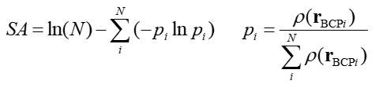

其中i循环构成芳香环的键上的AIM键临界点(BCP)，N是环上BCP总数，r_BCP是BCP的坐标。SA的加和符号里的项就是BCP处的电子的局部信息熵。Ln(N)对应于完美芳香性分子所具有的最大信息熵。芳香性越强，SA值越小，对于苯这样的完美芳香性分子SA为0；反芳香性越强，SA就越大。小于0.003可认为具有芳香性，大于0.005可认为具有反芳香性。

在Multiwfn的拓扑分析界面里可以直接计算SA值。首先在主功能2里做拓扑分析找出BCP，然后选20，再把环上的BCP序号输入进去即可，如输入14,23,18,13,16,15。之后SA值会立刻输出，每个BCP的局部信息熵也会一起输出出来。

### 7.3 EL指数

在Struct.Chem.,23,1173(2012)中，作者提出了EL指数用于衡量芳香性，它基于BCP处电子密度的椭率。EL定义为：EL=1-c/n*∑|ε_i-ε_ben|  
加和符号循环环上的每个BCP。ε_i是第i个BCP的电子密度椭率，ε_ben是理想芳香性体系（苯）的BCP的椭率。n是环上BCP总数，c是归一化常数，目的是让EL对于典型非芳香性体系的结果为0，即  
c=n/∑|ε_i,nonaromatic-ε_ben|  
其中ε_i,nonaromatic是非芳香性参考体系环上BCP的椭率。EL中这个体系取的是kekule形式的苯，其中单双键键长来自(3E)-1,3,5-己三烯。

实际上EL和HOMA在形式上十分相似，主要区别就是把键长指标换成了BCP椭率而已，数值范围依然是对于理想芳香性体系EL为1，非芳香性体系为0，反芳香性体系EL为负值。EL的基本思想是pi键越明显，BCP处电子密度越偏离轴对称分布，故此处电子密度椭率越大，于是用它来区分开普通sigma键和芳香环上的键。其实这种定义方式实在是了无新意。

EL虽然在原文中测了一些环状不含杂原子的有机分子结果还不错，但是缺点显而易见。EL公式中的c和ε_ben是依赖于计算所用的理论方法和基组的，因此对于每种计算级别先得自己用己三烯和苯计算一下c和ε_ben才能用EL衡量别的体系，这挺麻烦。另外，由于引入了参考值，所以EL有和HOMA同样的缺点，也就是研究的体系必须有对应的参考分子才行，而诸如金属团簇，由于没法找到合适的参考体系，EL就不能用。另外当键的极性较强，BCP处电子密度椭率变得不那么明确，EL也就不那么可靠。

总之笔者不认为EL是一个比较有理论意义或者有较大实用价值的方法，可靠性也还没被广泛检验。

计算EL所需的BCP处电子密度的椭率可以在Multiwfn里获得。首先载入含有波函数信息的文件，用进入主功能2做拓扑分析找出BCP，然后选7，并输入BCP对应的编号，就会输出电子密度的Hessian矩阵和本征值。如苯的C-C键BCP：  
Eigenvalues of Hessian:  0.3272716437E+00 -0.6439237628E+00 -0.5378860803E+00  
令λ1和λ2代表绝对值最大和第二大的本征值，则椭率定义为ε=λ1/λ2-1，故此BCP处的ε=-0.64392/(-0.53788)-1=0.19744。而对于乙烷的C-C sigma键由于密度分布是轴对称的，所以BCP处λ1=λ2，此时ε=0。

### 7.4 电场梯度(Electric field gradient, EFG)

静电势的负梯度是电场（矢量），电场的导数就是电场梯度EFG，是个二阶张量。在J.Mol.Model.,17,2017(2011)里作者提出可以用化学键上的EFG的分量来衡量芳香性。EFG可以在空间任意一处计算，比较重要的是EFG(0)，它指的是键的正中间处的EFG值，以及EFG(0.5)，是以键的正中间为起点，向垂直于环平面方向上挪0.5埃处的EFG值。EFG(0)或EFG(0.5)和键的pi特征相关，比如乙烷、乙烯、乙炔、苯的C-C键的EFG(0.5)分别为0.9140、1.3874、1.8810、1.1986，可见pi特征越明显数值越大，因此可以利用这个特点来衡量芳香性。

用EFG(0.5)衡量某个碳环的芳香性就是计算环上pi离域效应对环上所有键的EFG(0.5)值总和的影响，记为ΔEFG(0.5)。比如对于苯，EFG(0.5)总和为6*1.1986；它的电子定域化状态是kekule式描述的三个双键和三个单键，因此可以用三个乙烷的C-C键（EFG(0.5)总和为3*0.9140）和三个乙烯的C-C键（EFG(0.5)总和为3*1.3874）来描述，因此苯的ΔEFG(0.5)=6*1.1986-3*0.9140-3*1.3874=0.2874。再比如环丁二烯，环上EFG(0.5)总和为2*(1.3446+0.8262)=4.3416，减去两个单键2*0.9140和两个双键2*1.3874，ΔEFG(0.5)算出来为-0.2612。ΔEFG(0.5)越正，说明芳香性越强，接近0说明是非芳香性，而为负值说明是反芳香性。ΔEFG(0)的计算方式和ΔEFG(0.5)完全一样，将用到的EFG(0.5)值都替换为EFG(0)值即可。从DOI:10.1007/s11224-012-0097-9一文的讨论来看，ΔEFG(0)比ΔEFG(0.5)显得更可靠。

EFG值可以在Gaussian中方便地得到。在要计算EFG值的位置上定义一个Bq原子（类似于NICS的定义方式），然后写上prop=EFG关键词即可。在输出文件末尾处可找到  
Center         ---- Electric Field Gradient ----  
                       ( tensor representation )  
                   ----       Eigenvalues       ----  
下面有Bq原子对应的值，如  
13 Ghost      -5.890022      2.881757      3.008266  
14 Ghost      -5.510474      2.741618      2.768856  
在计算EFG(0)或EFG(0.5)时，取最后一列的值即可。

EFG方法衡量芳香性最大弱点是需要确定定域化Lewis结构，并且要有合适的参考体系来得到相应的定域化的键的EFG值，这使得它的适用范围大大受限。

### 7.5 pEDA、sEDA

此方法名字中的EDA代表electron donor-acceptor，p代表pi，s代表sigma。这两种描述符是在J.Phys.Org.Chem.,22,769(2009)中定义的，原本用于分析取代苯的电子结构，后来在DOI:10.1007/s11224-012-0097-9等文章中被用来研究芳香性。它们的定义为：  
pEDA=∑π_i(取代苯)-∑π_j(苯)  
sEDA=∑σ_i(取代苯)-∑σ_j(苯)  
其中i、j分别循环取代苯和未取代苯的六元环上每个原子。π_i代表第i个原子上价层pz自然原子轨道(NAO)的布居数，σ_i是原子的价层s、px和py的NAO布居数的总和。这里假定分子平面处在XY平面上。pEDA和sEDA表现了由于取代基效应，使得pi电子数和sigma电子数偏离未取代状态的量。pEDA、sEDA也可以用在其它类型环上研究取代基效应，比如吡啶，只要把公式中的苯环换成相应的环就行了。

NAO的布居数可以由NBO程序获得。比如在Gaussian里，用pop=NPA关键词就会调用NBO3.1模块进行自然布居分析，给出NAO的布居数。

这个方法只适合研究取代基对芳香性的影响，不同类型的环的芳香性没法比较。就算只考察取代基的影响，靠这两个量来分析芳香性是否靠谱，笔者尚持怀疑态度。尽管某些文章号称有成功的应用，并表示和其它个别芳香性指标有不错相关性。

## 8 其它方法

《全面揭示16碳环（cyclo[16]carbon）非常奇特的激发态芳香性！》（<http://sobereva.com/741>）中介绍了我独创的一种考察同一体系的不同状态（如不同电子态）下芳香性差异的思想，就是在某个态A的极小点结构下计算另一个态B的原子受力，若原子受力倾向于令体系变平、键长交替特征减弱，则说明B态的芳香性强于A。请仔细阅读此博文里用此思想考察16碳环的三重态、五重态激发态与基态的芳香性差异的例子。如果使用此方法的话也请引用此博文介绍的我的Chem. Eur. J.文章。

共轭区域的几何结构的平面性和这个区域的电子共轭程度、芳香性有很大关系。对特征相同的环，由于特殊因素使得它越偏离平面，pi共轭就会越大程度地削弱，导致芳香性越低。笔者提出了一种非常简单、直观、严格的方法展现平面性，可以直接通过Multiwfn很容易地计算，对于从平面性角度讨论芳香性很有用处，参看《使用Multiwfn定量化和图形化考察分子的平面性（planarity）》（<http://sobereva.com/618>）。

有个芳香性分析方法叫CiLC（CI/LMO/CASSCF）。这个方法计算过程复杂，分析芳香性过程也十分麻烦，需要考察CI组态系数和组态构成来分析是否键的均衡性被很好地满足以判断芳香性。这方法对于更深入探究电子结构或许有价值，但分析过于繁琐而对于分析芳香性没多少实际应用意义。详见JPCA, 104, 922 (2000)、JPCA, 106, 10370 (2002)、JPCA, 107, 9422 (2003)等文章。

除本文体提到的之外，还有一些其它的五花八门的衡量芳香性的标准，比如I_NB、I_NG（JPCA,111,6521），还有人用源函数(Source function)分析芳香性，还有人用点四极矩张量分析芳香性（ACS Omega, 10, 14157 (2025)），还有人用静电势全局极小点的静电势的Hessian矩阵本征值特征考察芳香性（JPCA, 123, 10139 (2019)）。由于这些方法在实用性上没有特别显著的优点，就不提了。

## 9 总结

一个完美的衡量芳香性的指标应当具备这些条件：（1）可靠性高（2）计算量小（3）不依赖于参考体系（4）普适性好，可以用于种类多样的体系，如金属/半金属体系，任意尺寸的环，含任意元素、成键模式的体系。还应可以研究非平衡结构、不同电子态、不同外场环境下、化学反应过程中的芳香性（4）可以分离sigma和pi的贡献（5）可以同时衡量反芳香性（6）操作过程简便，有现成好用的程序可以支持。现有的各种芳香性指标互有优劣，没有一个完全满足这些条件。不过能满足大多数条件的指标是值得推荐的。

以下是本文涉及的主要的衡量芳香性的指标的综合对比。有些本文提及的方法，如LOL-sigma/pi、BOIA、HOSE、NICS-rate、θ指数、直接通过CLRK衡量芳香性、CiLC等等，要么目前用得很少，要么可靠性尚未检验，要么没什么新意，故不值得一提，就没列在表里。

注意本节的NICS是指RCP处NICS_zz(0)。FLU、FLU-pi、PDI、PLR、ΔDI都是指模糊空间下的。计算便利度是指使用Multiwfn程序的情况下。综合价值指的是方法的重要性、意义，如果某方法的提出无关痛痒，那么综合价值就比较低。耗时是指的计算芳香性指标本身的耗时，而诸如波函数计算、几何优化阶段的耗时不算在内。耗时是相对而言，对于小体系、中等基组的情况其实各种方法耗时都不大，但对于中、大尺寸体系或大量体系的计算就表现出明显差异了。

这些方法中基于几何结构的方法计算最为简单，但局限性最大，由于没有直接与电子相对应，没法表现诸如不同电子态、外电场下的芳香性，除非在相应条件下先优化几何结构。凡是依赖于参考体系的芳香性指标普适性都不很理想，用于金属团簇、非平衡结构几乎是不可能的。注意一些方法，如SA、Bird、FLU是基于键的均衡性来衡量芳香性，这类方法都有个通病，就是如果键的均衡性是来自于外因被迫产生的，那么就会明显高估芳香性。例如coronene中央的环的六个C-C键的特征均等的，但这实际上是由于周围六个环的对称排列所致，因此如SA、Bird、FLU这类方法就会误认为这个环的芳香性和苯一样强。

对于一般的芳香性研究，笔者首推多中心键级或AV1245。如果需要研究反芳香性，首推NICS。这两个方法的普适性、可靠性都令人满意，计算NICS对于小体系耗时不多。由于一开始提到的芳香性的多维性，笔者推荐同时选用三种或更多的方法来考察芳香性，比如同时用多中心键级、NICS、PDI、FLU、HOMA/HOMAc来一起衡量。如果结论是一致的，表明结论十分可靠；如果结论有所不同，那么可以再进一步分析、解释、探讨。

如果想图形化地考察芳香性，可以给出MO或AdNDP图形，指出各轨道对芳香性/反芳香性的贡献。也鼓励给出ELF-pi、LOL-pi或AICD图，电子离域路径由此可以展现得十分直观。
