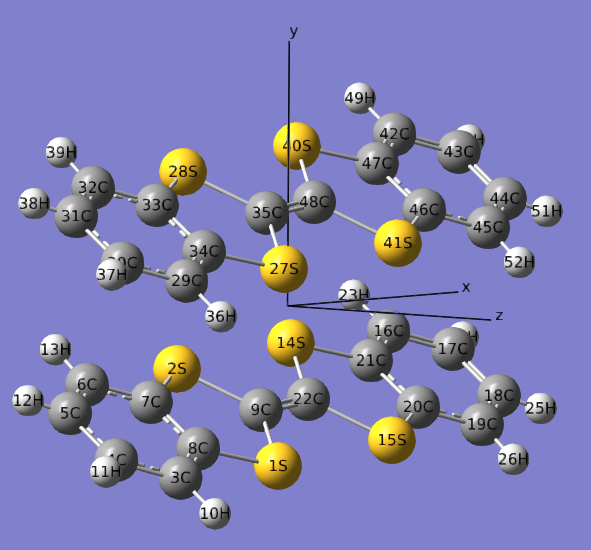
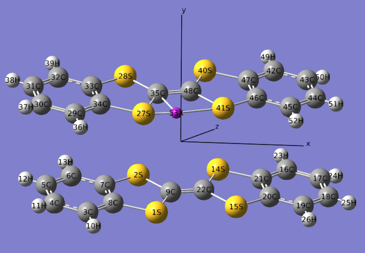
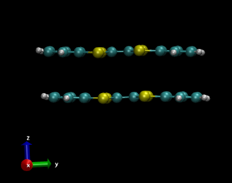

**调节平面分子间距的方法**The method to adjust the distance between planar molecules

文/Sobereva@[北京科音](http://www.keinsci.com)  2013-Feb-3

计算化学研究中有时需要调节两个平面分子间距离，比如研究不同间距下的相互作用能。如果两个平面分子的坐标正好对着，或者分子平面平行于某个笛卡尔平面，那么改变间距很容易。前者就用gview的设定键长大小的工具就能调，后者就自行对笛卡尔坐标统一加减一定的数值就可以。比较麻烦的是分子既不平行于笛卡尔平面，两个分子也不是正对着，如下图这种情况

这里提供两个办法设定这两个分子平面的（垂直）间距。

## 方法1：

使用protoplane程序（[/usr/uploads/file/20150610/20150610055901_52653.rar](http://sobereva.com/usr/uploads/file/20150610/20150610055901_52653.rar)），得到一个分子上某原子在另一个分子平面上的（垂直）投影点坐标，并在此处设一个虚原子，然后用gview的键长设定工具调节这两个原子的间距（设定窗口中Atom1和Atom2都选为Translate group模式），两个分子就会相应地整体移动，从而调整了分子平面的间距。

protoplane程序启动后先依次输入三个原子的坐标来定义平面方程。然后再输入要投影的原子的坐标，就会输出投影后的坐标，以及此原子到平面的垂直距离。

输入的时候为了省事，可以直接把原子笛卡尔坐标从Gaussian输入文件里复制到DOS窗口内（先在文本编辑器里复制坐标，然后在DOS窗口标题栏上点右键，选编辑-粘贴）。之后，可以将生成的坐标直接拷贝到Gaussian输入文件里（DOS窗口标题栏上点右键，选编辑-复制，然后圈中要复制的区域，点回车，然后粘贴到文本编辑器里），并定义为X原子。

如下所示，将9号原子投影到27、35、41号原子定义的平面上就是53X，之后在gview里调节9C和53X的距离即可改变分子平面的间距了

protoplane程序源代码如下：

program prjtoplane  
implicit real*8 (a-h,o-z)  
write(*,*) "prjtoplane: Get the projected position of a point on a specific plane"  
write(*,*) "Programmed by Sobereva ([sobereva@sina.com](mailto:sobereva@sina.com)), 2013-Feb-2"  
write(*,*)  
write(*,*) "You will input three point to define the plane"  
write(*,*) "Input x,y,z coordinate of point 1   e.g. 2.3,1.0,-4.2  or  2.3 1.0 -4.2"  
read(*,*) x1,y1,z1  
write(*,*) "Input x,y,z coordinate of point 2"  
read(*,*) x2,y2,z2  
write(*,*) "Input x,y,z coordinate of point 3"  
read(*,*) x3,y3,z3  
do while(.true.)  
 write(*,*) "Input x,y,z coordinate the point you want to project"  
 read(*,*) x0,y0,z0  
 call pointprjple(x1,y1,z1,x2,y2,z2,x3,y3,z3,x0,y0,z0,prjx,prjy,prjz)  
 write(*,*)  
 write(*,*) "The x,y,z coordinate of the projected position is"  
 write(*,"(3f15.8)") prjx,prjy,prjz  
 write(*,"(a,f15.8)") " The vertical distance from the point to the plane is",dsqrt((prjx-x0)**2+(prjy-y0)**2+(prjz-z0)**2)  
 write(*,*)  
 write(*,*) "Now you can input another point you want to project, or press Ctrl+C to exit"  
end do  
end program

subroutine pointprjple(x1,y1,z1,x2,y2,z2,x3,y3,z3,x0,y0,z0,prjx,prjy,prjz)  
real*8 x1,y1,z1,x2,y2,z2,x3,y3,z3,x0,y0,z0,prjx,prjy,prjz,A,B,C,D,t  
call pointABCD(x1,y1,z1,x2,y2,z2,x3,y3,z3,A,B,C,D)  
t=(D+A*x0+B*y0+C*z0)/(A**2+B**2+C**2)  
prjx=x0-t*A  
prjy=y0-t*B  
prjz=z0-t*C  
end subroutine

subroutine pointABCD(x1,y1,z1,x2,y2,z2,x3,y3,z3,A,B,C,D)  
real*8 v1x,v1y,v1z,v2x,v2y,v2z,x1,y1,z1,x2,y2,z2,x3,y3,z3,A,B,C,D  
v1x=x2-x1  
v1y=y2-y1  
v1z=z2-z1  
v2x=x3-x1  
v2y=y3-y1  
v2z=z3-z1  
A=v1y*v2z-v1z*v2y  
B=-(v1x*v2z-v1z*v2x)  
C=v1x*v2y-v1y*v2x  
D=A*(-x1)+B*(-y1)+C*(-z1)  
end subroutine

## 方法2：

这个方法是先让指定的分子平面平行于XY平面，然后自行对分子的Z坐标统一进行适当加减，就改变了分子平面间距。

**2021-Aug-16注**：下文用VMD的做法已经不推荐使用了！因为使用Multiwfn来实现方便得多，见《Multiwfn中非常实用的几何操作和坐标变换功能介绍》（<http://sobereva.com/610>）。让体系的一个平面平行于某笛卡尔平面的做法在此文2.4节专门有示例。在此文介绍的Multiwfn的子功能300的子功能7里用选项1还可以方便地让体系根据特定矢量进行平移。

这里提供一个VMD程序的Tcl脚本用于实现此目的。先将以下内容复制到VMD的命令行窗口执行

proc alignplane {ind1 ind2 ind3} {  
set atm1 [atomselect top "serial $ind1"]  
set atm2 [atomselect top "serial $ind2"]  
set atm3 [atomselect top "serial $ind3"]  
set vec1x [expr [$atm2 get x] - [$atm1 get x]]  
set vec1y [expr [$atm2 get y] - [$atm1 get y]]  
set vec1z [expr [$atm2 get z] - [$atm1 get z]]  
set vec2x [expr [$atm3 get x] - [$atm1 get x]]  
set vec2y [expr [$atm3 get y] - [$atm1 get y]]  
set vec2z [expr [$atm3 get z] - [$atm1 get z]]  
set sel [atomselect top all]  
$sel move [transvecinv [veccross "$vec1x $vec1y $vec1z" "$vec2x $vec2y $vec2z"]]  
$sel move [transaxis y 90]  
}

然后在命令行窗口运行诸如alignplane 27 35 41就可以让27、35、41号原子定义的平面平行于XY平面，如下所示

现在可以利用file-save coordinates将当前结构保存出来，然后用诸如Excel/Origin之类或自写程序来平移分子。但是在VMD里也可以很方便地整体平移分子。

VMD会将自动将每个分子以fragment x描述。诸如前例，就有fragment 0和fragment 1代表这两个分子。假设要平移的是fragment 1，就先执行  
set sel [atomselect top "fragment 1"]  
然后比如向Z轴正方向平移0.5埃，即平移向量是0 0 0.5，就运行$sel move [transoffset {0 0 0.5}]
