**使用Multiwfn做电子密度、ELF、静电势、密度差等函数的盆分析**Using Multiwfn to perform basin analysis for electron density, ELF, electrostatic potential, density difference and other functions

文/Sobereva @[北京科音](http://www.keinsci.com/)

First release: 2013-Mar-27  Last update: 2023-Jun-16

前言：Multiwfn（<http://sobereva.com/multiwfn>）主功能17对应于盆分析功能。本文目的在于简要介绍盆分析的概念、算法，并结合几个应用实例介绍盆分析功能的基本操作方法并展现盆分析的基本用途。更多的信息参见Multiwfn手册3.20节和4.17节。笔者在《Multiwfn支持的分析化学键的方法一览》（<http://sobereva.com/471>）中也专门介绍了盆分析在研究电子结构方面能起到什么价值。不了解Multiwfn的读者建议阅读《Multiwfn FAQ》（<http://sobereva.com/452>），不知道这些分析用到的波函数文件怎么产生的话看《详谈Multiwfn支持的输入文件类型、产生方法以及相互转换》（<http://sobereva.com/379>）。

本文撰写后Multiwfn又经历了巨量更新，因此盆分析的数据、极值点序号会和本文例子所示的有些许不同，读者请以实际在Multiwfn里看到的结果为准。

## 1 盆、吸引子和盆分析的基本概念

盆(basin)这个概念最早是由Bader在它的Atoms in molecules (AIM)理论中引入的，在AIM理论中盆分析是对于电子密度来进行的。随后这个概念被Savin、Silvi推广到用于分析电子定域化函数(ELF)。关于ELF的介绍可参见《ELF综述和重要文献小合集》（<http://bbs.keinsci.com/thread-2100-1-1.html>），里面有大量综述以及笔者写的相关博文和论文。实际上，盆这个概念对于任何实空间函数都适用，比如电子密度拉普拉斯函数、动能密度、静电势、电子密度差、福井函数等等。

盆是整个空间中的局部空间，而所有的盆所占空间总和就是整个空间。每个盆彼此间通过函数的零通量面(zero-flux surface)来划分，因而零通量面也叫做盆间面(interbasin surface)。具体来说，零通量面上的各个点上都满足函数的梯度在垂直于这个面方向上的分量为0的条件。每个盆当中唯一地包含一个“吸引子”(attractor)，它是这个盆空间内函数的极大点。吸引子和拓扑分析术语中的(3,-3)型临界点是一回事。

例如，下图是电子密度的盆的二维示意图，这种图经常出现在AIM分析中

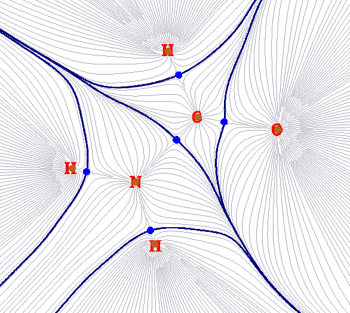

棕色的圆点就是吸引子。由于电子密度的极大点总是很接近原子核（对于H可能偏得多一点。另外还有所谓的非核吸引子，但这里不提及），所以这些吸引子的位置基本就在原子核上。灰色细线是电子密度的梯度线，从各个方向向着吸引子汇集。粗的蓝线就是零通量面，将整个分子空间分割为一个个盆。这些盆和原子一一对应，所以AIM理论中将电子密度的盆称为原子盆。这样的盆被AIM理论认为描述了原子在分子中所占的空间，所以也被叫做AIM原子空间。上面的图只是盆在分子平面上的二维示意图，氢原子盆的三维图如下所示

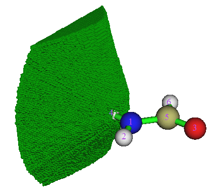

注：虽然众多梯度线组成的面上所有点也都符合“垂直于这个面上函数的梯度分量为0”的条件，但是这样的面穿越吸引子，所以不特称为零通量面或盆间面。

将盆划分好之后，就可以在这些盆的空间里进行各种分析。通常有四类分析，它们都被Multiwfn的盆分析模块所支持：  
(1)在盆里对指定的实空间函数进行积分。例如，积分电子密度，就得到了盆内电子的布居数。如果这个盆是AIM盆，那么得到的就是原子的电子布居数，令原子核电荷减去它就得到了AIM原子电荷。如果这个盆是ELF，且比如对应共价键，那么可以通过盆中的电子密度积分值讨论有多少电子与共价键的构成相关。还可以积分诸如自旋密度、能量密度等等。用于定义盆的实空间函数和在盆中被积分的实空间函数显然是可以不同的。Multiwfn可以让任意实空间函数在任意实空间函数定义的盆中被积分。  
(2)计算盆内的电多极矩(electric multipole moments)，具体来讲是指单极矩、偶极矩和四极矩。这对于定量分析电子密度的分布十分有益。比如可以研究孤对电子对应的ELF盆对分子偶极矩的贡献（如J. Comp. Chem., 29, 1440）、考察形成复合物过程中电子密度被极化的过程、研究盆内电子分布在哪个方向较弥散、偏离球对称分布程度的多少等等。  
(3)计算盆内的定域化指数(localization index, LI)和盆间的离域化指数(delocalization index, DI)。前者衡量平均来说有多少电子定域在盆里；后者衡量的是平均有多少电子离域在两个盆之间，或者说盆之间共享了多少电子。如果是AIM原子盆，那么它们之间的DI和共价键级是可以相对应的。  
(4)计算原子对盆布居数的贡献。比如对应C-N之间成键的ELF盆，这个盆有一定电子布居数，我们可以把这个ELF盆空间再用AIM方式进行划分，来得到C和N各自对这个盆布居数的贡献。

(2)、(3)、(4)方式的分析本质上也是需要在盆内进行积分才能实现的。所以，要想做盆分析，必须得通过某种算法将盆空间表示出来，并且能够在其中对特定实空间函数进行积分。这是下一节要讨论的。

## 2 生成盆的算法

由于AIM理论的重要性，好几十年前就开始有人不断提出各种各样的积分AIM原子盆的方法。这些方法都是解析方法，例如J.Comp.Chem.,21,1040和J.Phys.Chem.A,115,13169。遗憾的是，由于盆的边界复杂，以解析方式积分相当困难，非常耗时，且积分公式都很复杂，不容易实现。这些方法一般需要先搜索到电子密度的(3,-3)及(3,-1)临界点，然后利用(3,-1)临界点产生盆间面，然后以(3,-3)临界点为中心向外发散地做盆内的积分。这类解析方式的积分不仅慢、复杂、通常需要事先找临界点，而且有一个重要缺点就是基本上只能用于积分电子密度的盆，不适合用于其它实空间函数如ELF。这类方法的唯一好处就是积分精度很不错。经典的AIM程序如AIMPAC、AIM2000、AIMALL、Morphy之类用的都是这类解析积分方法。值得一提的是在J.Comp.Chem.,30,1082中作者提出一种利用类似Becke的DFT泛函积分的方法积分盆，虽然积分精度有所降低，但是积分速度快了很多，且算法复杂度降了不少。但是这种方法依然只适合于积分电子密度的盆。  
  
Silvi他们组的专用于ELF盆分析的TopMod程序用的是一种基于立方格点的数值方式的盆积分方法。在此程序发表后，逐渐有一些其它的基于立方格点（实际上也完全可以用矩形格点）的盆积分方法和相应程序被提出。这类基于立方格点的数值积分方法速度比较快，最大的好处是可以用于任意类型的实空间函数，而缺点是积分精度逊于解析积分方法。或者说，用的格点数据的格点间距越小则积分精度越高，但是要想达到解析方法那么高的精度，那么计算格点数据的时间以及储存格点数据所需内存量将甚巨而难以实现。不过，只要对积分精度要求不苛刻，那么这类格点积分的精度一般也够了。值得一提的是这类方法产生盆之前不需要事先寻找临界点，吸引子会在产生盆的过程中自动获得，所以很方便。由于Multiwfn的盆分析模块强调的重点之一是普适性强，所以采用的是立方格点积分的方法，而非解析方式的积分盆。这类积分方法中目前最好的是near-grid方法（J.Phys.:Condens.Matter,21,084204），这也是Multiwfn默认的方法，而它的前身on-grid方法（Comput.Mat.Sci.,36,354）在Multiwfn中也支持。On-grid方法生成盆的速度更快，但明显看得出盆间面的划分准确度不如near-grid方法，因此积分值准确度也差一些。

near-grid方法得到吸引子位置、产生并积分盆的大体过程是：  
首先提供要分析的实空间函数的格点数据。然后，依次从每个格点出发，按照梯度最大的方向沿着格点不断进行移动从而产生出一条轨迹。如果走到一个格点且发现它的数值比相邻的点都大，那么这个格点就会被当成吸引子，并且这条轨迹上所有点将被指认(assign)到这个吸引子。如果从某个点开始沿着梯度最大方向不断移动的过程中走到了一个已经被指认了吸引子的点，那么这条轨迹中的所有点也将被指认到这个吸引子。将所有格点循环一遍后，被指认到同一个吸引子的所有点就构成了这个吸引子对应的盆。盆内任意一实空间函数f的积分值可通过此式很容易地得到：∑f(r_i)*dv。其中加和符号循环盆内每个格点，编号以i表示，r_i即是格点的坐标。dv是空间微元，即每个小格子的体积。

积分不同的实空间函数对格点精度要求不同。比如电子密度拉普拉斯函数、源函数(source function)在原子核附近波动极大，所以就很不适合用立方格点方法来积分。即便用了很高精度的格点，仍会发现在盆内积分拉普拉斯函数的结果偏离理想值0比较多。另外，不同区域的盆积分难度也不同。例如电子密度在原子核附近有尖峰，而在原子价层区域变化则较缓，所以在核电子对应的ELF盆里积分电子密度的精度就相对低一些，明显不如积分价层ELF盆那样容易得到较高精度。

为了解决AIM盆积分时由于电子密度、源函数、电子密度拉普拉斯函数、能量密度等常见被积函数在较重原子内层区域变化较快而难以准确积分的问题，笔者提出了将均匀格点和原子中心格点相混合的积分方法并在Multiwfn中予以实现。此方法不仅实现容易，精度也高，彻底解决了near-grid方法在AIM盆积分上的软肋。

## 3 现有的支持盆分析的程序

那些经典的利用解析方法做电子密度盆分析的AIM程序前面已经提到过了，即AIMPAC、AIM2000、AIMALL、Morphy等，它们没法用于对其它实空间函数进行盆分析。Bader程序（<http://theory.cm.utexas.edu/bader/>）是极少数基于立方格点方法进行电子密度盆分析的程序，操作还算方便，但是功能很弱，仅能计算AIM原子盆内的电子密度积分值。还有的程序如InteGriTy，虽然载入的是电子密度格点数据，但是实际上还是用传统解析方法进行盆积分，只不过任意处的电子密度不是直接计算而是通过格点数据插值得来。

普适型的基于立方格点方式做盆分析的程序最出名的是TopMod（<http://www.lct.jussieu.fr/pagesperso/silvi/silvi_english.html>），但是它实际上只支持电子密度和ELF的盆分析，也只能在这两类盆里计算LI/DI和积分电子密度。TopMod的操作超级繁琐，做个盆分析需要调用多个子程序（top_grid、top_bas、top_pop），得敲一大堆命令。而且程序诸多方面都显得莫名其妙，颇不好用，而且想可视化盆也非常困难。Multiwfn的盆分析功能的最初开发目标就是完胜TopMod。TopGrid（<http://www.lct.jussieu.fr/pagesperso/pilme/topchempage.html>）是与TopMod关系甚密的另一个基于立方格点的盆分析程序，只能读入格点数据来做盆分析，生成盆的算法和TopMod有异，普适性号称比它要广，可以支持盆的电多极矩分析。但这程序甚至比TopMod还难用，而且计算结果笔者发现不准，比如观看它产生的盆会明显发现盆的形状和理想形状往往偏离不小。

相对于上述程序，Multiwfn的盆分析功能无论是普适性、计算速度、积分精度、灵活性还是操作便利性上都有质的飞跃。Multiwfn可以对任意实空间函数划分盆，对任意实空间函数在盆内进行积分，还可以计算盆的电多极矩、LI和DI，还可以计算原子对盆布居数的贡献。实空间函数既可以直接由Multiwfn计算也可以从外部文件读取。分析结果能够直接可视化而不必再借助于第三方程序。同时，吸引子和盆都可以导出到外部文件，以便使用诸如VMD等可视化程序显示来得到更好的效果。由于Multiwfn本身代码的高效，以及作了充分的并行化，做盆分析速度很快，包括C60这样较大的体系的盆分析也不用花多少时间。均匀格点+原子中心格点积分更是Multiwfn独有的算法，积分AIM盆精度完胜TopMod和Bader程序。Multiwfn盆分析模块操作极其方便，只需要按几个键，敲几下回车即可完成，自动化程度极高。而且输出信息简明易懂，各个功能、涉及到的原理在手册里都能方便地查阅到。可以说，Multiwfn标志着实空间函数的盆分析进入了新纪元。

## 4 实例

以下六个实例涉及到盆分析模块的大部分操作，做过一遍后就能对盆分析有个基本的认识。//后面的是注释。

### 4.1 HCN分子的电子密度盆（AIM盆）分析

### 4.1.1 生成盆

启动Multiwfn并输入  
examples\HCN.wfn  
17   //盆分析  
1   //生成盆并寻找吸引子  
1   //让Multiwfn计算电子密度格点数据，用来得到它的盆和吸引子  
2  //中等质量格点，也就是格点间距为0.1Bohr。格点数据涵盖的空间范围程序将根据体系电子密度值自动确定，列表中还有其它很多定义格点设定的方式，这里暂时先不用  
  
此时Multiwfn开始计算格点数据，然后生成盆并确定吸引子的位置。之后吸引子的坐标以及吸引子位置上的函数值会显示在屏幕上  
  Attractor       X,Y,Z coordinate (Angstrom)                Value  
      1   -0.02645886   -0.02645886   -1.52058663          0.33959944  
      2    0.02645886    0.02645886   -0.51514986         49.48609717  
      3   -0.02645886   -0.02645886    0.64904009         76.55832377  
由于氢的密度低，很显然吸引子1就是与氢相对应的。如果之后还想重新看吸引子的信息，以及更详细的信息，可以选择选项-3。注意如果开启了Multiwfn的并行模式（默认是开启的），每次寻找出的吸引子的编号顺序都可能不同，以实际为准，后同。

### 4.1.2 观看盆和吸引子

现在选0来可视化刚找出来的吸引子和生成的盆。在弹出来的图形界面中，紫色的文字对应吸引子的标号。每个吸引子用绿色小球表示，但由于它们对于此例在原子核处，所以得取消选择show molecule选项才能看到它们。图形界面中各个控件的含义都很明确就不多提了，试试就明白了。界面右下角（如果是Linux版则在右上角）是盆列表，一个盆对应一个吸引子，盆的编号和吸引子编号是一致的，选择哪个盆就会显示出哪个盆。这里我们在盆列表中选1来让1号盆显示，并且选show basin interior让盆内部也显示，此时看到的图如下

位于盆边界的格点通过绿球显示，使得盆的轮廓被勾勒出来。如果不想显示盆，在盆列表里选None即可。  
在很多AIM分析的文章中，盆只显示了处于电子密度0.001 a.u.等值面内部区域的部分，如果想只绘制这部分就在图形界面上方选择Set basin drawing method - rho>0.001 region only，然后就可看到下面的图像

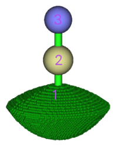

在盆列表里还会看到"Unas"（意指Unassigned）和"Boun"（意指travelled to box boundary）。前者指的是产生盆过程中由于某些数值算法原因没有成功被指认所属吸引子的格点，后者是指产生盆的过程中按照梯度最大方向移动但是最终移动到格点数据范围边界的点。这两类格点一般没有什么物理意义，对分析结果影响甚微，通常出现在离体系较远的地方。值得一提的是，如果为了节省计算时间，没有让格点数据范围囊括整个分子而是只囊括了局部区域，那么可以得到只位于局部区域的盆，与此同时"Boun"类型的点会大量出现，依然无视它即可。在盆列表里选择"Unas"和"Bound"就可以分别看到这两类点分布在哪。对于当前体系，在产生盆之后从屏幕上可以看到  
The number of unassigned grids:           0  
 The number of grids travelled to box boundary:           0  
也就是说"Unas"和"boun"类型的格点数都为0，这是最普通的情况。也因此对于当前例子在盆里表里选了"Unas"或"Boun"之后什么都不会显示。

现在点击RETURN按钮关闭图形界面。

顺带一提，如果你希望获得漂亮的原子盆图像，并且还能把临界点和键径也显示出来，最好的办法是按照这个视频的方法操作：《使用Multiwfn和VMD绘制原子盆（AIM盆）》（<https://www.bilibili.com/video/av85202089>）。主要流程就是用选项-5把指定的盆导出成各个cube文件，然后拖到VMD程序里绘制为等值面。整个过程非常简单，而图像效果非常好，例如下图显示了丙烯醛的所有键径+临界点，并且将非氢原子的原子盆都用不同颜色显示了出来。产生盆时选择的格点质量越高，盆的边缘就会越平滑。

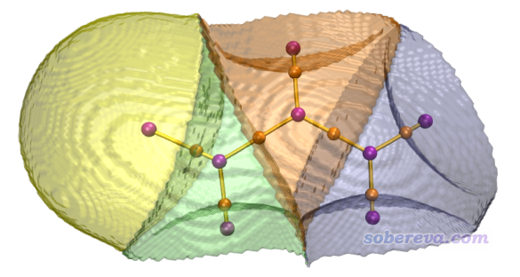

### 4.1.3 积分盆

在我们生成了盆以后，就可以通过盆分析界面里的选项2~5对盆进行各种分析了。先做哪种分析都无所谓。这里先选"2 Integrate real space functions in the basins"做盆积分。我们这里要在盆里积分的是电子密度，所以接下来可以选1，来让Multiwfn计算各个盆内的格点上的电子密度值以得到盆内的密度积分值。但是，由于前面已经生成过了一遍电子密度格点数据，这套数据仍然在内存里存着，因此就没必要让Multiwfn重新算每个点的密度了，直接调用内存里的格点数据的值就行了，这大大节省了时间。所以我们选"0 The values of the grid data stored in memory"，来让内存中存着的格点数据作为被积的函数。立刻结果就输出出来了  
  #Basin        Integral(a.u.)      Volume(a.u.^3)  
      1          0.7356142812        441.70000000  
      2          5.3511710147        566.31900000  
      3          7.9020060745        830.25600000  
Sum of above values:         13.98879137  
除了每个盆的积分值还有盆的体积。不过这里输出的盆体积对于当前体系没什么意义，因为三个盆的总和就是整个格点数据空间范围，故格点数据空间范围取得越大盆的体积就越大。输出中可以看到积分精度不算很理想，总值13.989和理想值14有一定偏离。这主要是因为在前文中提到的，电子密度在重原子的原子核附近衰减速度较快，用均匀格点对这部分没法积分得很准。为了解决此问题，Multiwfn对于AIM盆积分提供了混合格点积分的选项，即选项7。我们输入  
7  //混合格点进行积分  
1  //原子中心+均匀格点，忽略边界修正  
1  //电子密度  
结果为  
Total result:  
  #Basin        Integral(a.u.)      Vol(Bohr^3)    Vol(rho>0.001)  
      1          0.7356461193         441.700          34.884  
      2          5.3552270393         566.319         102.832  
      3          7.9086504198         830.256         134.228  
Sum of above integrals:         13.99952358  
Sum of basin volumes (rho>0.001):     271.944 Bohr^3  
  
这回总积分值13.9995已经十分接近于理想值14了，盆体积Vol(Bohr^3)依然没什么物理意义。接着还输出了每个原子的AIM电荷，以及原子体积。  
Normalization factor of the integral of electron density is    0.999966  
The atomic charges after normalization and atomic volumes:  
     1 (C )    Charge:    0.644591     Volume:   102.832 Bohr^3  
     2 (N )    Charge:   -0.908920     Volume:   134.228 Bohr^3  
     3 (H )    Charge:    0.264329     Volume:    34.884 Bohr^3  
这里的Volume等同于上面的Vol(rho>0.001)，代表的是盆中电子密度大于0.001的体积，按照Bader对范德华表面的定义，这相当于分子范德华表面内原子所占的体积，是有确切物理意义的，可认为是原子的尺寸。  
  
注意，尽管得到的总积分值已经几乎等同于理想值了，但实际上原子盆的积分值并非很精确，对应的AIM电荷也不是非常精确。为了得到更准确的积分结果，还得对盆边界进一步修正，这对应于选项7中的2或3，这相比刚才用的1精度有所提升，但会更耗时得多，这三种模式的精度、耗时、内存消耗量在屏幕上已经提示了。这里我们选7再选2然后选1，看看经过边界修正后的积分结果，结果为  
Total result:  
  #Basin        Integral(a.u.)      Vol(Bohr^3)    Vol(rho>0.001)  
      1          0.7450375217         442.296          35.480  
      2          5.2508474961         563.647         100.160  
      3          8.0036553438         832.332         136.304  
Sum of above integrals:         13.99954036  
Sum of basin volumes (rho>0.001):     271.944 Bohr^3  
  
Normalization factor of the integral of electron density is    0.999967  
The atomic charges after normalization and atomic volumes:  
     1 (C )    Charge:    0.748980     Volume:   100.160 Bohr^3  
     2 (N )    Charge:   -1.003918     Volume:   136.304 Bohr^3  
     3 (H )    Charge:    0.254938     Volume:    35.480 Bohr^3  
可见现在和刚才得到的AIM电荷有明显不同，现在得到的是比较准确的结果。如果想进一步提升精度，可以在生成盆的时候用更好的格点，比如High quality grid，乃至Lunatic quality grid。然而，对于大体系，High quality grid已经很耗时、很占内存了。  
  
注意，虽然用选项7比起选项2积分AIM盆精确得多，但是选项7只能积分AIM盆，而选项2基于均匀格点的积分可以用于任何函数的盆。  
  
**提示**：上面讨论得比较多，通常来说，获得AIM电荷最一般也较准确的做法是进入盆分析模块，然后选  
1  //生成盆  
1  //用电子密度划分盆  
2  //中等质量格点  
7  //用混合格点积分AIM盆  
2  //对边界进行精确修正  
1  //积分电子密度

### 4.1.4 计算盆的电多极矩

电多极矩的计算公式在手册3.18.3节里有详细说明，只不过那些公式里的原子核坐标对于盆分析来说应当被替换为吸引子坐标，而积分范围应当由模糊空间替换为盆空间。  
  
我们选8来做盆的多极矩计算。注意计算前最好先用选项7中的选项2在精确修正盆边界的情况下进行一次盆积分（我们上一节已经做过了），因为这样做盆的边界会永久性修正，当前计算盆多极矩的时候结果也更准了。另外值得一提的是用选项3也能计算盆的多极矩，但那是基于均匀格点的，虽然对各种类型盆都能用但对AIM盆精度较低，所以这里不用。用选项8得到的碳的多极矩结果如下  
Result of atom     1 (C )  
Basin electric monopole moment:   -5.250847  
Basin electric dipole moment:  
 X=    0.000003  Y=    0.000002  Z=    1.095848  Magnitude=    1.095848  
Basin electron contribution to molecular dipole moment:  
 X=    0.000003  Y=    0.000002  Z=    6.026238  Magnitude=    6.026238  
Basin electric quadrupole moment (Cartesian form):  
QXX=   -0.759559  QXY=   -0.000000  QXZ=   -0.000002  
QYX=   -0.000000  QYY=   -0.759564  QYZ=   -0.000003  
QZX=   -0.000002  QZY=   -0.000003  QZZ=    1.519122  
The magnitude of electric quadrupole moment (Cartesian form):    1.519122  
Electric quadrupole moments (Spherical harmonic form):  
Q_2,0 =   1.519122   Q_2,-1=  -0.000003   Q_2,1=  -0.000002  
Q_2,-2=  -0.000000   Q_2,2 =   0.000003  
Magnitude: |Q_2|=    1.519122  
  
盆的单极矩就是盆内电子密度积分值的负值。此盆的偶极矩Z分量为明显的正值，表明盆内的电子密度主要分布于相对于2号吸引子（碳原子核）位置的Z值更负的区域。四极矩的ZZ分量为正，而XX、YY分量为负，表明盆内的电子密度分布相对于球对称分布来说，在Z方向（分子轴方向）有所延展，而在其余方向有所收缩。四极矩的大小表现盆内电子密度偏离球对称的程度，此例的数值1.519不小，说明偏离球对称分布还是挺大的，这显然是因为形成了化学键所引起的。可见，通过盆的电多极矩分析，我们可以以定量的方式明确地讨论盆内电子的分布状态。实际上计算诸如盆内的八极矩、十六极矩也很容易做到，但是用处不是很大，所以Multiwfn最高给到四极矩。

### 4.1.5 计算定域化和离域化指数

最后，基于AIM盆，我们分析定域化指数(LI)和离域化指数(DI)。选择功能4，Multiwfn就会输出盆之间的DI矩阵和盆内的LI值。如下所示  
************ Total delocalization index matrix ************  
            1             2             3  
    1    0.97290584    0.90037924    0.07252660  
    2    0.90037924    3.49303265    2.59265341  
    3    0.07252660    2.59265341    2.66518001  
  
Total localization index:  
    1:  0.259     2:  3.496     3:  6.658  
  
比如DI(2,3)=2.593，表明2号盆（C的AIM原子空间）和3号盆（N的AIM原子空间）之间平均来说共享了2.593个电子，这和HCN中C与N的形式键级3.0挺接近。实际上，DI就是一种共价键级的衡量标准，随着键的极性的增强DI值一般会降低。DI矩阵的对角元是相应的列（或行）的矩阵元的加和，如果把DI就当成键级看待，那么对于闭壳层体系，DI矩阵的对角元便是原子价。因此，可以说此体系N原子的原子价是2.66。  
  
1号盆（H的AIM原子空间）的定域化指数为0.259，说明平均有0.259个电子定域在这个盆内，这个数值远小于此盆内电子布居数，表明在HCN体系内，电子很容易从H的AIM空间中离域出去，外界的电子也容易离域进来，换句话说，盆内外的电子容易相互交换。  
  
为了便于考察，免得用户需要自行对照盆的序号和原子序号，Multiwfn在屏幕上还同时输出了行和列序号对应于原子序号的DI矩阵和LI值。

### 4.2 乙炔的ELF盆分析

启动Multiwfn并输入  
examples\C2H2.wfn  
17  
1  //生成盆并寻找吸引子  
9  //ELF  
2  //中等质量格点  
0  //观看结果。图像如下所示

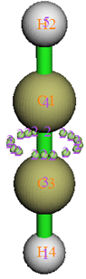

理论上，在两个碳之间有一个环形的ELF吸引子，这是由于C-C之间存在的两个pi键所致。在Multiwfn中，吸引子都是以点来描述的。由于数值算法的原因，如图所见，Multiwfn会在这个环的位置上找出来一大堆数值差不多的吸引子，一起围成一个环形。显然不能让这一圈吸引子一个个地孤立着，否则物理意义就丧失了，所以Multiwfn会自动地将挨得近的且数值相仿佛的吸引子进行“归簇”(clustering)。这一圈吸引子也因此就被归为了一个简并的吸引子(degenerated attractor)，即图中所示的2号吸引子，原本那一圈吸引子就被称为2号吸引子的“成员吸引子”。而2号盆的空间也就是其成员吸引子对应的盆的总和。有少数时候，在默认设定下Multiwfn自动归簇的结果可能与预期的有差距，比如这一圈吸引子没有被归在一起而被归成了两个吸引子，这时应当在生成盆之前先用功能-6调节阈值，包括相对数值差异和距离间隔这两个条件阈值。如果任意两个吸引子之间的相对数值差异小于阈值，而且它们的距离也小于阈值的话，则它们会被归到一起。距离阈值是和格点间距有关的，假设定义的时候输入了一个值n，那么距离阈值就是n*sqrt(dx^2+dy^2+dz^2)，其中dx、dy和dz是三个方向的格点间距。如果将n设为0，那么Multiwfn就不会在寻找完吸引子之后对它们进行归簇。另外，在生成盆并搜索完吸引子之后，也可以用功能-6的选项3来自行指定将哪些吸引子归到一起，后面的例子将会用到这个功能。

根据ELF的符号法则，2号盆应该被指认为V(C1,C3)，这里V代表这个盆的电子是来自于C1和C3的价层电子。类似地，1号和5号盆应当被分别指认为V(C3,H4)和V(C1,H2)。3号和4号盆应当被分别指认为C(C3)和C(C1)，C代表Core，表明内核电子主要都在这个些盆里。在图形界面中取消Show molecule复选框不让分子结构显示出来就能看到这种盆了，如下所示

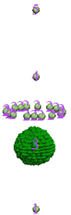

接下来计算电子密度在ELF盆中的积分值。关闭图形窗口后选择功能2，然后选择选项1（对应电子密度），就会看到如下结果接下来计算电子密度在ELF盆中的积分值。关闭图形窗口后选择功能2，然后选择选项1（对应电子密度），就会看到如下结果  
  #Basin        Integral(a.u.)      Volume(a.u.^3)  
      1          2.2159821115        768.39800000  
      2          5.3670486307        972.82100000  
      3          2.0949016050          0.83200000  
      4          2.0949016050          0.83200000  
      5          2.2159823917        768.53100000  
Sum of above values:         13.98881634  
  
C(C1)和C(C3)的积分值为2.09，很接近2，这也正对应了碳有两个内核电子。V(C3,H4)和V(C1,H2)的积分值为2.21，也接近2，对应于C-H键共享一对儿电子这个经典化学概念。值得一提的是，尽管此C(C1)和C(C3)是对称的、V(C3,H4)和V(C1,H2)是对称的，因此原则上它们的积分值应该相同，但实际上因为格点精度是有限，所以积分结果有一些数值差异，使用更高的格点精度能使结果与分子对称性满足得更好。按照经典化学键理论，乙炔的两个碳之间应该享有三对儿电子，共6个电子，但是V(C1,C3)的积分值5.37与6偏差略大。不过也没有理由要求这种基于实空间的分析的结果与经典化学概念完全一致。  
  
然后选功能3再选-1，来得到每个盆的电多极矩分析结果。其中的4号盆，即C(C1)的结果为  
Basin       4  
Basin electric monopole moment:   -2.094902  
Basin electric dipole moment:  
 X=   -0.104745  Y=   -0.104745  Z=    0.020728  Magnitude=    0.149575  
Basin electron contribution to molecular dipole moment:  
 X=   -0.000000  Y=    0.000000  Z=   -2.388409  Magnitude=    2.388409  
Basin electric quadrupole moment (Cartesian form):  
QXX=   -0.003034  QXY=   -0.007856  QXZ=    0.001555  
QYX=   -0.007856  QYY=   -0.003034  QYZ=    0.001555  
QZX=    0.001555  QZY=    0.001555  QZZ=    0.006067  
The magnitude of electric quadrupole moment (Cartesian form):    0.006067  
Electric quadrupole moments (Spherical harmonic form):  
Q_2,0 =   0.006067   Q_2,-1=   0.001795   Q_2,1=   0.001795  
Q_2,-2=  -0.009071   Q_2,2 =   0.000000  
Magnitude: |Q_2|=    0.011205  
由于当前体系是轴对称的，而且轴在Z轴上，所以盆内的偶极矩的X和Y分量都应当为0。不过由于这次只用了medium quality grid，所以这两个分量不是很接近于0。但即便如此，当前的结果还是有定性意义的，起码看到偶极矩的大小非常小，而且四极矩的大小也很接近0，这说明原子的内核电子受分子环境影响甚小，基本接近于球对称分布。  
  
输入0返回上一级菜单，然后选功能4计算LI和DI，结果如下  
************ Total delocalization index matrix ************  
            1             2             3             4             5  
    1    1.31231709    1.03496562    0.16085935    0.02291204    0.09358008  
    2    1.03496562    2.71090549    0.32048710    0.32048709    1.03496568  
    3    0.16085935    0.32048710    0.51131492    0.00705643    0.02291205  
    4    0.02291204    0.32048709    0.00705643    0.51131492    0.16085936  
    5    0.09358008    1.03496568    0.02291205    0.16085936    1.31231716  
  
Total localization index:  
    1:  1.560     2:  4.011     3:  1.834     4:  1.834     5:  1.560  
  
DI(3,4)对应于C(C1)和C(C3)之间的离域化指数，其数值0.007十分接近于0，这表明在两个原子的内核区域之间电子很难相互离域。DI(1,3)=0.160和DI(2,3)=0.320虽然不大，但是还是有一定数值的，这说明C(C3)盆内的电子与和它相邻的仅有的两个盆V(C3,H4)和V(C1,C3)内的电子相互交换还是有一定几率的。DI(2,1)和DI(2,5)都接近于1，表明电子在C-C键区域和C-H键区域间离域很容易。从定域化指数上看，碳的内核的盆的LI为1.83，接近于盆内的电子布居数2.09，表明内核电子整体来说喜欢呆在内核区域，而不容易离域到外头去，而相应地外界电子也难以进来。而V(C3,H4)的LI为4.011，和它的电子布居数5.37差得挺大，表明V(C3,H4)内的电子容易与外界电子发生交换，这也是价层ELF盆的普遍情况。

### 4.3 水分子的静电势盆分析

虽然很早以前已经有人对静电势做过拓扑分析，但是对静电势进行盆分析的研究还相当少。  
  
静电势同时存在原子核电荷主导的正值的区域，以及电子所主导的负值的区域。对于这种正负值同时存在的实空间函数，Multiwfn的盆分析模块在生成盆并搜索吸引子之前，会首先将负值区域的数值乘以-1来让符号颠倒，然后照常生成盆和寻找吸引子，弄完了之后再恢复原先的负值区域的数值。这样一来，负值区域也会找到吸引子并能产生对应的盆，但这些吸引子实际上是“排斥子”，即函数值的极小点。在Multiwfn程序中以及下文中，不管本质上是吸引子还是排斥子，一律都被叫做吸引子。  
  
启动Multiwfn并输入  
examples\H2O.fch  //当然，也可以用.wfn或.wfx文件作为输入  
17  
1  //生成盆并搜索吸引子  
12  //计算静电势格点数据  
2  //中等质量格点  
0  //查看结果  
从显示出来的图中可以看到1、2、3号吸引子对应于原子核电荷产生的静电势极大值点。而4、5号吸引子对应于氧的孤对电子导致的静电势负值区域中的极小点。诸如这样的负值区域的极小点以及相应的盆都会用蓝色表示，以便与绿色表示的正值区域的极大点和盆进行区分。从盆列表里选择4号盆，可以看到如下图像，

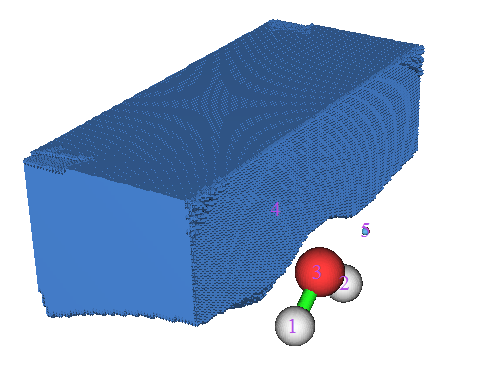

注意如命令行窗口中的提示所显示的，在此例中生成盆的时候有1627个格点最后跑到了格点数据范围的边缘，在盆列表里选择"Boun"就能看到它们，如下图所示。显然这些点里分子都很远，所以这个问题可以无视。

 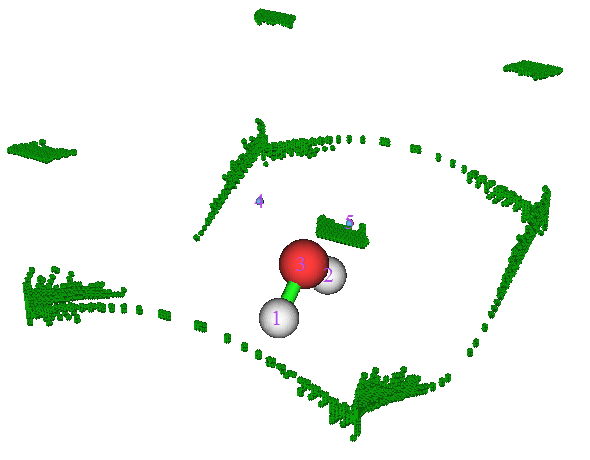

盆分析模块提供了便利的计算吸引子、原子核间的几何参数的功能。进入功能-2后可以看到操作方法介绍。例如想测量4号吸引子与1号原子（氧原子）间的距离，就输入c4 a1，结果为2.238 Bohr。再比如，测量“吸引子4--氧原子核--吸引子5”的角度，就输入c4 a1 c5，结果为80.84度，这在某种程度上也可以看做是氧的孤对电子的夹角（孤对电子夹角还可以利用ELF、LOL来研究，结果与此有一定差异，见《使用Multiwfn做拓扑分析以及计算孤对电子角度》（<http://sobereva.com/108>）。然后输入q退到上一级菜单。  
  
假设我们想手动把两个孤对电子对应的吸引子合并为一个吸引子，可以输入  
-6  //设定归簇参数或自行对吸引子进行归簇  
3  //将指定的吸引子归到一起  
4,5   //2和3号吸引子将归为一个，同时盆也合并到一起  
0   //返回  
这时再选0打开图形界面，会看到吸引子的序号都变了，两个孤对电子对应的吸引子合并成了一个，序号为4。  
  
选功能2，然后选1，来得到电子密度在静电势盆中的积分值，结果为  
  #Basin        Integral(a.u.)      Volume(a.u.^3)  
      1          0.8647176869        362.33900000  
      2          0.8647176862        362.27200000  
      3          7.5147940814         25.00000000  
      4          0.7405367228        628.13800000  
Sum of above values:          9.98476618  
Integral of the grids travelled to box boundary:          0.00000004  
虽然氧有两个孤对电子，但是在两个孤对电子对应的静电势盆，即目前的4号盆当中电子密度积分值仅有0.740。这是因为对任何分子，大部分离分子较近的空间总是由核电荷所主导，故而静电势为正。静电势为负值的区域都处在分子的较外侧，这些区域电子密度是比较有限的，所以电子密度积分值在负的静电势盆中不会很大。结果也显示，那些"Boun"类型的格点内的积分值几乎为0，这也是为什么前面说这些格点可以忽略。  
  
对静电势做盆分析需要获得静电势格点数据，而计算静电势格点数据对于稍大的体系都很花时间。如果你想显著降低这个步骤上的耗时，特别是对于大体系、大基组而言，强烈建议通过令Multiwfn自动借用Gaussian里的cubegen工具来实现（因为cubegen比Multiwfn内部代码在静电势上快不少），只需把settings.ini里的cubegenpath参数设为cubegen的实际路径，之后Multiwfn里不管哪个分析功能，凡是牵扯到基于波函数计算静电势格点数据的时候都会自动调用cubegen来算。详见<http://sobereva.com/435>里的说明。

### 4.4 水分子的电子密度差的盆分析

在进入盆分析之前，首先要利用主功能5把电子密度差的格点数据算出来。电子密度差这里具体指分子密度与组成它的各个原子在孤立状态下的密度差。这需要涉及到生成原子波函数文件，为了省事，此例就直接用Multiwfn自带的原子波函数文件。做法也就是把examples目录下的atomwfn目录挪到上一级目录下（假设你是通过双击Multiwfn图标来运行Multiwfn的，否则就将atomwfn放到你调用Multiwfn时所在的目录下）。关于用Multiwfn做电子密度差的具体内容，见《使用Multiwfn作电子密度差图》（<http://sobereva.com/113>）

移动过atomwfn目录后，启动Multiwfn，然后输入  
examples\H2O.fch  
5  //计算格点数据  
-2   //产生变形属性  
1  //电子密度  
3  //高质量格点。注意这里的“高质量格点”和前面用到的盆分析模块里的高质量格点不是一回事。这里定义的是总格点数而非格点间距，故而高质量只是对于较小分子来说的。由于密度差比电子密度、ELF变化都要复杂，为了盆分析可靠，建议用较好的格点质量。  
0  //返回主菜单。刚才计算的格点数据会一直保存在内存里。  
17   //盆分析  
1   //生成盆并寻找吸引子  
2   //基于保存在内存里的格点数据来产生盆和寻找吸引子  
选择0进入图形界面观看电子密度差的吸引子和相应的盆。显示和不显示分子结构时的图分别如下面两图所示

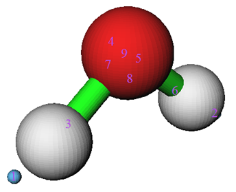

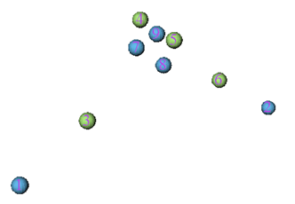

电子密度差的正值和负值部分分别代表原子形成分子后，电子密度增加和减少的区域。上图中绿球对应正值部分的极大值，蓝球对应负值部分的极小值。如果搞不清楚为什么极值点这么分布，对照着电子密度差截面图就会弄明白。水分子垂直于分子平面和分子平面上的电子密度差图如下所示

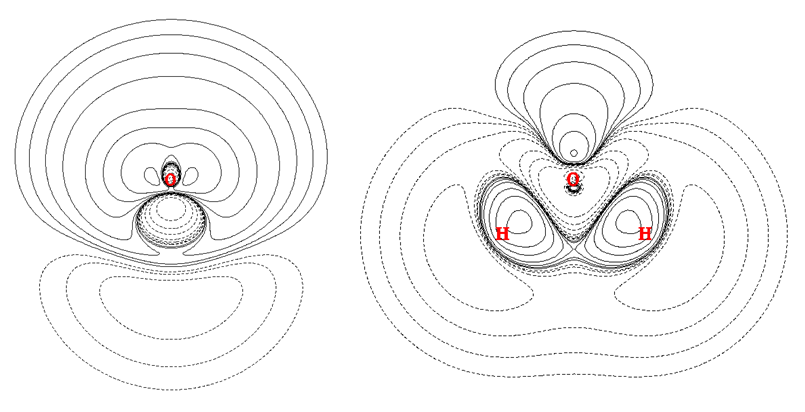

对照平面图，就很容易理解3号和6号盆对应的是形成O-H键造成的电子密度增加区域，而4号和5号盆对应的是氧原子以sp3杂化后由于孤对电子的出现造成的密度增加的区域。

值得一提的是由于格点精度用得仍然不够高，导致7号吸引子的另一侧的等价吸引子没有被找出来。另外，8号吸引子偏离了理想位置。不过，这样的吸引子和盆都不是化学上感兴趣的，它们对应的是密度差变化的十分细微的结构，没有太大物理意义，所以可以忽视这些问题、

现在看看O-H键形成后造成了多少电子往键中间发生了挪动，也就是对3号或6号盆进行积分，被积函数也是电子密度差。于是，进入功能2，然后输入0，来将内存中保存着的电子密度差格点数据当做被积函数。结果立刻显示出来，3号和6号盆的积分值都是0.09。而对应于孤对电子的形成造成密度增加的4号或5号盆的积分值是0.21。

如果想要将等值面图和吸引子进行对比，可以选择-10退回Multiwfn主菜单，然后进入主功能13，再选-2，当前内存中的格点数据的等值面图就会显示出来，之前找出来的吸引子也会同时显示。下图是isovalue=0.05的图

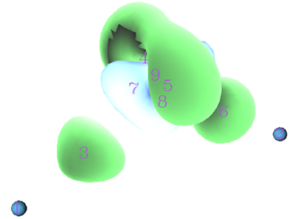

PS：关于保存在内存里的格点数据这里多说几句。用.cub/.grd文件作为输入文件的话，其中的格点数据就会一直保存在内存里。另外用主功能5或者13计算或者对格点数据进行操作的话，得到的格点数据也会保存在内存里。当有新的格点数据生成时，旧的格点数据就会被覆盖。若在盆分析功能里的功能1当中让Multiwfn计算新的格点数据，那么原先内存里的格点数据就也被覆盖。

### 4.5 对乙烷进行基于AIM盆的源函数分析

源函数在Multiwfn手册2.6节有简要介绍。在The Quantum Theory of Atoms in Molecules-From Solid State to DNA and Drug Design一书的7.6章有个简明的综述建议读读。这个函数依赖于两个坐标，其中一个坐标是参考点。当源函数被用来讨论成键（包括弱相互作用）问题时，参考点一般取在BCP（键临界点）上。经常通过在AIM原子空间内对源函数进行积分，以研究原子对BCP处密度的贡献。我们这一节要分析乙烷的各部分对C-H键的BCP密度的贡献值。我们先要进行拓扑分析找出临界点位置。启动Multiwfn，依次输入  
examples\ethane.wfn  
2  // 拓扑分析  
2  // 搜索核临界点  
3  // 搜索BCP  
0  // 观看结果  
临界点分布和编号如下所示

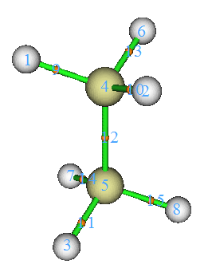

这里我们打算将CP11这个C-H键的BCP取做参考点。从文本窗口能找到它的坐标（0.000000000.-1.199262548,-1.909104063），将坐标直接从屏幕上拷贝到系统的剪切板中（如果不知道怎么去做这步，见手册5.4节）。然后我们看看这个点的电子密度是多少，这一步不是必须的，但是由于对源函数进行全空间积分的结果原理上会精确等于参考点的电子密度值，所以我们现在获知了它的电子密度，就便于稍后检验积分得是否准确。选择7，然后输入临界点编号11，就能得到它的密度0.276277。  
  
现在来设定参考点。一种方法是用settings.ini里的refx、refy和refz参数来设参考点的X,Y,Z坐标，但是这样设完了还得重启一下Multiwfn才能生效，这里我们用另一种方法来设。先选-10从拓扑分析界面返回到主菜单，然后输入1000，就进入了一个秘密界面，选择1，再把CP13的坐标粘贴进去并按回车，参考点坐标就设好了。  
  
然后，依次输入以下命令生成AIM盆  
17  // 盆分析  
1  // 生成盆并寻找吸引子  
1  // 电子密度  
2  // 中等质量格点  
进入功能0，会看到吸引子如下图分布，我们要考察的是下方的甲基对CP11处密度的贡献，盆编号可见为1,2,3,4

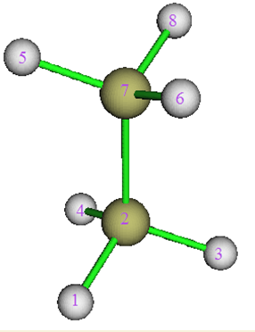

接下来要对盆进行积分，输入  
7   //用混合格点方法积分AIM盆  
1  
19   //源函数  
结果如下  
    Atom       Basin       Integral(a.u.)   Vol(Bohr^3)   Vol(rho>0.001)  
     1 (C )       5          0.00361681       148.640        70.392  
     2 (H )       8          0.00289447       465.226        50.058  
     3 (H )       6          0.00280055       426.841        50.097  
     4 (H )       7          0.00280276       418.343        50.095  
     5 (C )       2          0.12224052       149.871        70.396  
     6 (H )       1          0.12040142       471.817        50.054  
     7 (H )       4          0.01051821       424.105        50.095  
     8 (H )       3          0.01051757       432.711        50.097  
Sum of above integrals:             0.27579230  
Sum of basin volumes (rho>0.001):     441.284 Bohr^3  
  
积分值总和0.27579230与参考点的密度0.276277十分接近，误差完全在可接受范围内。下方甲基对应的1~4号盆数值加和为0.12040142+0.12224052+0.01051757+0.01051821=0.2637，占CP11密度的0.2637/0.2763*100%=95.4%，因此甲基是它自身的C-H键BCP密度的最主要贡献者，而其余原子只贡献4.6%。有人发现这个结论对于不同长度的烷烃都是十分一致的，这被用来说明化学基团的可移植性问题。

### 4.6 计算成键的两原子对其ELF键盆布居数的贡献

此例我们计算CH3NH2体系中C、N原子对它们之间V(C,N) ELF键盆布居数的贡献，使用的是AIM方式划分原子空间。用相同的方法还可以计算原子对其它任意类型盆的布居数的贡献。启动Multiwfn并输入  
  
我们先生成记录ELF盆定义的basin.cub文件，此文件中每个点的数值对应这个点所属的ELF盆编号。  
examples\CH3NH2.wfn  
17  
1  
9  //ELF  
2  //中等质量格点  
然后进入选项0，检验ELF盆编号

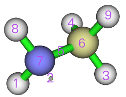

我们看到V(C,N)盆的编号是5号。关闭图形窗口，输入  
-5  //输出盆  
a  //将盆信息输出到当前目录下的basin.cub  
然后照常生成AIM盆，输入  
1  //重新生成盆  
1  //重新选择函数  
1  //电子密度  
9   //我们必须保证新生成的格点数据的格点设定与basin.cub严格一致，最好的做法就是这里选9，直接从basin.cub中读取格点设定信息  
basin.cub  
0   //检查吸引子编号

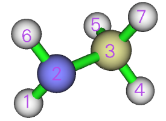

我们看到N和C对应的吸引子编号分别为2和3。然后关闭图形窗口输入  
9  //计算原子对外部盆（basin.cub中记录的盆）的布居数贡献，选完之后会读取当前目录下的basin.cub  
2  //要考察的原子对应的吸引子的编号，2对应N  
5  //V(C,N) ELF盆对应的编号  
结果为1.15866，即N对V(C,N)盆贡献了1.159个电子。然后输入  
3  //对应C  
5  //V(C,N) ELF盆对应的编号  
结果为0.46359，这即是C对V(C,N)盆贡献的电子数，明显少于N贡献的，因此C-N键可以认为有很显著的极性。

## 5 总结&其它

本文介绍了盆分析的意义、算法，结合很多例子对Multiwfn的盆分析操作进行了讲解。对于最一般的盆分析，在Multiwfn里其实就这么几步，简单得很：  
[文件名]  // 一般用.mwfn/.wfn/.wfx/.fch/.molden文件  
17  // 盆分析模块  
1  // 生成盆并寻找吸引子  
1  // 选择用什么实空间函数定义盆和吸引子，这里假设为电子密度  
2  // 产生什么质量的格点数据，这里是中等质量的，适合用作预览  
0  // 观看结果  
然后根据要分析的内容，选择功能2~9即可。

加入盆分析模块的Multiwfn 3.0的推出，对于实空间函数的盆分析领域，是具有革新意义的。Multiwfn在普适性、速度、灵活度、简便易用等各种方面相对以往程序都有着质的飞跃，Multiwfn将ELF盆分析的门槛降低到量化初学者也能轻松完成的程度。本文虽然用的例子都是小分子，但用于较大的分子也没有问题。除非是分子太大，这样的话可能会出现内存容量不足以储存格点数据的问题。对于这种情况，如果只对局部区域感兴趣，建议只将格点数据空间范围定义在相应的局部区域，来减少总格点数从而避免内存不足。
