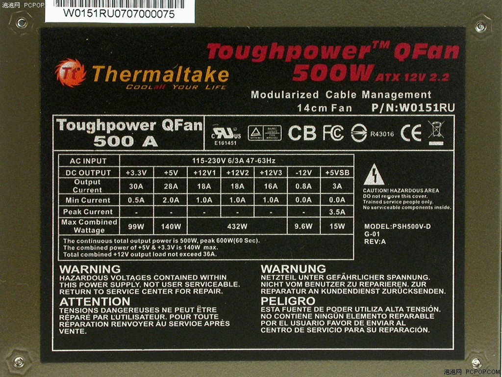

**计算化学攒机--电源篇**  
  
文/Sobereva @[北京科音](http://www.keinsci.com)   2008-Sep-17

  
  
1.  品牌及选购  
1.1 品牌简介  
1.2 关于代工厂商  
1.3 品牌的选择  
1.4 适合购买的电源*  
1.5 电源质量的简易评判  
2.  电源基础知识  
2.1 输出电压和各种线  
2.2 电源接口  
2.3 电源规范  
2.4 服务器电源  
3.  功率  
3.1 电源功率的选择  
3.2 电源的真实功率  
4.  电源指标  
5.  其它  
5.1 插座  
5.2 风扇与噪音  
5.3 Future reading  
  
  
如果只想知道推荐购买的电源，不想做过多了解，只看1.4节就行了，但我很不建议这样做。  
  

### 1. 品牌

  
电源即是将高压交流市电转换成计算机配件所需的低压直流电的设备，对计算机稳定性有很大影响，计算机最棘手的死机、重启、无法开机等问题很多都是因电源导致的，因电源滤波能力不同，还会一定程度上影响超频和声卡音质。一款电源是否能使计算机长期正常工作很难评价，往往因为使用环境、个体差异等原因有所不同，即便是大厂高端产品也不能避免出故障，良品率不可能100%，而且和一些主板可能有“兼容”的问题（一些额外设计上的冲突导致）。而一些廉价、用料较差的电源也往往能长期稳定工作。但是就一般而言，还是要尽量选择名牌产品。  
  

#### 1.1 品牌简介

  
选择电源最主要的是品牌，由于有外壳，所以不像板卡那样容易看到电源内部做工、设计和用料作评判。国内的杂牌电源不少，主要都是南方制造，这类杂牌电源肯定做不出来好东西，一般都是300W及以下的产品，售价一般在150元以内，甚至不少在100元以内，指标差，稳定性差，虚标铭牌参数，也不安全，甚至造成烧毁配件，如果对情况不了解，只要是没听说过的牌子，就不要考虑，尤其是一些产品外表看上去有模有样，不要被迷惑。不少便宜的机箱也附带了电源，用作计算的机子，不要用这类机箱附带的电源，一般功率都偏小，尤其是而杂牌机箱带的电源，稳定性和性能指标都达不到要求。  
  
市场上的常见的内地电源品牌有世纪之星、金河田、技展、百世得、大水牛、多彩、美基、长城、鑫谷、航嘉、先马。  
  
其中，世纪之星、美基、大水牛、技展、百世得都是面向低端的品牌，质量也不怎么样，最多也就是中等，不做考虑。金河田也是主打低端品牌，质量也一般，但是也有中端、高端产品，比如860W的龙霸一号还是不错的（毕竟一分钱一分货），但价格很贵，这里不推荐。长城是一个历史悠久的老品牌，质量总体不错，可以推荐。鑫谷、航嘉在国内也都是比较好的品牌，影响力较大，质量还算不错，主要做家用机的中、低档电源。它们也有高端产品，如宙斯盾850、磐石800，但性价比不高。多彩的电源，上市时间不算太长，相对于内地品牌质量中等，以中、低端电源为主，价格和质量都没什么优势。  
  
先马(SAMA)做服务器也做家用电源，家用电源上市的历史不长。它有一款额定350W电源，超影450，价格十分好，媒体价199元，除了杂牌外是市场最低，实际购买价格可能还会低一些。这就是我Q6600机子正在用的电源，长期高负载，用了一年，尚未出过问题，噪音也不大。缺点是手感比较轻，电源输出线比较细，发热有点大，带四核机子加中端独立显卡，稍微有点勉强，但目前使用一切正常，尚未出过任何故障。如果资金比较紧，这个电源我是推荐使用的。但如果日后还考虑装高性能显卡或者额外的耗电设备，或者希望有更高的可靠性，建议用更好的。  
  
虽然长城、鑫谷、航嘉在国内是不错的，但真正好的品牌主要来自台湾及欧美，少部分来自韩国、日本等地，定位在中、高端，由于很多未在中国上市过所以很多人比较陌生，比如新巨（ZIPPY）、全汉（FSP）、海韵（Seasonic）、康舒（Acbel）、七盟（Seventeam）、台达（Delta）、银欣（silverstone）、保锐（Enermax）、思民（ZALMAN）、Antec、Corsair（海盗）、Enhance（益衡）、OCZ、PC Power & Cooling（已被OCZ收购）等等，这些品牌产品价格都偏贵，只有其中一部分厂商产品进入了内地。全汉是代工大户，很多品牌的电源都是它代工，质量好，内地上市的产品种类不多，比较出名的是蓝暴、绿暴系列，价格不算太贵。海韵一直对DIY市场很重视，推出了不少特色产品，同时也给诸多优秀电源品牌代工，口碑很好，转换效率高，现在在市场上也常能见到，主要是S12和M12两个系列，后者是模块化电源。康舒的行货近期也已经进入内地市场，质量优秀但价格偏高。Antec的产品在欧美知名度很高，电源可靠稳健，但并不奢华，噪音较小，中端产品性价比不错，国内行货也有行货销售。台达是世界电源第一大厂，质量好，在国内买不到行货，但在网上能见到大量台达产的电源。其它牌子有的没进入内地市场，价格高昂也不方便购买就不多谈了。  
  
TT（Thermaltake）是外来品牌，也是经常能内地市场上见到的品牌，做散热器和机箱很出名，电源也不错，海外销售的中高端产品质量优秀，价格昂贵。其低端产品是XP系列，价格不高，由国内HKC（惠科）代工，质量平庸，相对于其高端产品要差很多。中、中低端产品是暗黑和金刚系列，质量还可以。  
  
酷冷至尊(Coolmaster)在市场上也常见，是个有十几年历史的台湾品牌，类似TT，主做散热器和机箱，也兼做电源，高、中、低端都有，中、高端产品质量不错，低端的价格不贵，质量一般。没有什么太值得推荐的。  
  

#### 1.2 关于代工厂商

  
实际上，市场上电源品牌虽然十分多，但其中真正自己制造的并不多，很多牌子都是别的品牌代工，自己贴牌销售。但绝不代表不自己制造的厂商的电源质量就差，在于这个品牌对品质的要求、产品的设计，也体现在对代工商的选择。代工厂商主要有：台达、海韵、全汉、康舒、益衡、七盟、HKC(惠科)、CWT(乔威)、讯宝等等。前七个品牌除了给别人代工也有自有品牌，若是某些品牌由这些厂代工（除HKC），质量一般都不会差，当然代工价格也高，一般都是给比较好的品牌的中、高端产品代工。CWT也还不错，HKC、讯宝就相对较差了。某一个贴牌厂商的产品并非都是由同一家代工厂商制造，高、中、低端，不同类型产品代工商可能不同，导致了质量差异较大，例如酷冷之尊的中、高端由益衡、康舒代工，而内销的低端是讯宝代工，质量自然会有差异。另外，同一家代工商代工某一厂商不同级别的产品，或者不同厂商的产品，设计不同、用料不同，质量也有所不同，但总的来说，好厂代工的产品一般都不会差。但消费者不知道产品的代工厂商究竟是哪家，厂商自己不会透露，除非网上仔细找网友透露的一些资料，一般还是看最终销售品牌的口碑。  
  
查询某品牌产品的真正生产商有一个办法，如果在电源铭牌上看到UR的logo，往往在下面一般会有行文字，比如图1中，写的是E161451，进入http://database.ul.com/cgi-bin/XYV/template/LISEXT/1FRAME/index.htm 在UL File Number中输入E161451，就可以查到这款电源是CHANNEL WELL TECHNOLOGY(即CWT)制造的。但是并不一定完全灵验，有时候查到的结果，显示的就是品牌本身，不代表这款电源就一定是自己造的(代工商自有品牌除外，因为几乎一定是自己造的)。  
  
  
  

#### 1.3 品牌的选择

  
选择电源，并不一定选择质量顶级的。在普通的工作环境下，质量较好的国产品牌就已经可以胜任，甚至一些指标较差的国产品牌往往正常使用下都不出问题。像市场上比较容易购买的鑫谷、航嘉、长城电源，选择额定功率足够的就可以，只是用料、稳定性、安全性、技术指标如噪音、转换效率、电压波动等等及细节设计上比外来高端品牌产品弱一些，但一般来说无关大碍。同样的额定功率，若没有苛刻的要求，多花一半以上的钱买海韵、康舒等品牌的产品就不值得了，尤其是低功率产品价格相差悬殊，而且国内厂商的产品在售后服务上会更好一些。但在价格相差不大的情况下，则推荐品牌更好的产品，比如同为额定350W的全汉黑旋风450比航嘉磐石400贵几十元，就是值得的。对于大功率电源产品，即便是内地厂商产品价格也很贵，甚至还高于外来更优秀品牌的产品，就不值得考虑了。  
  
在网上还会看到许多工包电源销售，往往功率大，价格很便宜，用料貌似也很足，往往也都是名牌。而且工包电源相对于工包的显卡、主板，出故障几率相对要小。虽然很有诱惑力，但如果和商家不熟，而且经验不够丰富，最好还是买正规行或产品，免得给自己添麻烦。关于工包的话题具体的我会在计算化学攒机-其它篇里面提到。  
  

#### 1.4 适合购买的电源

  
这里只推荐性价比高，质量不错，在国内也容易买到的产品，若当地市场上买不到，在淘宝上都能买到。  
  
适合四核的电源：  
全汉黑旋风450/蓝暴350-60THN-P：额定350W，290元左右  
TT金刚KK450：额定350W，约270元。  
航嘉磐石400：额定350W，约260元。比较好买到，如果前面推荐的买不到可以考虑这个。  
  
适合双路八核的电源：  
海韵SS-600HT：额定功率600W，699元左右  
Antec BP550PLUS：模块化电源，额定550W，650元左右  
Antec EA650：额定650W，690元左右  
TT暗黑AH680A：额定功率550W，600元左右  
  
  

#### 1.5 电源质量的简易评判

  
对于前面提到的大厂电源一般不必有太多顾虑，而且网上关注度较高，用户评价也比较多，许多网站也都做过评测并进行拆解，内部做工和用料好坏都能清楚地看出来，即便自己看不出名堂，文章编辑也会作出评价。因为购机的时候不可能拆开电源，虽说透过散热孔也能看出一些玄机，但需要有一定经验，这里只说说从电源外部粗略地评判电源质量的方法，不涉及电源内部结构、用料。  
  
对于低价电源来说，一个最关键的指标是重量，一般越重，说明用料越足，如果没有经验，只要拿商家卖的名牌电源对比一下就可以了。但对于中、高端电源不能这么判断，因为使用主动PFC、集成电路，都会使重量相对减轻。  
  
看输出线的粗细，越细越不好，说明金属丝比较细，一般功率较低，用料比较省。而且细金属丝的电阻大，电流过大时可能会把胶皮熔化。另一方面也要考虑线的塑性，如果弹性强，缺乏塑性，说明塑料多，金属少。  
  
一些电源的输出线用蛇皮网包住，可以使线比较整齐，一般说明质量较好。  
  
从电源铭牌上看，应当规格和功率标注规范，认证标识齐全，至少应当有3C认证。  
  
输出线除了基本的20/20+4pin以外，其它接口数目较多，一般说明功率不会太低。  
  
一些劣质电源为了省材料，输出线会比较短。  
  
  
  

### 2. 电源基础知识

  

#### 2.1 输出电压和各种线

  
在电源的一端会看到从电源里面引出各种各样颜色的线，然后由组合成多种接头，常见电源有下列电压输出。  
+3.3V（桔色线）主要用于芯片组、内存供电。  
+5V（红色线）主要用于硬盘、光驱、软驱、主板电路的供电，USB设备供电，在ATX12V标准之前也给CPU供电，现已改为+12V给CPU供电。  
+12V（黄色线）主要用于硬盘、光驱的电机，CPU，显卡，风扇供电。  
-12V用于某些串口电路，对电流要求不高，一般小于1A，用处不大。  
-5V（往往为白色）给某些ISA板卡电路，一般也不到1A，用处也不大。  
+5VSB（SB代表StandBy，往往为紫色）一般1~2A，作为待机电压，也就是关了机仍然有+5VSB输出，主要用于网络唤醒，USB设备供电。  
值得一提的是，USB设备输入是+5V，所以可以通过主板+5V或+5VSB供电，前者关机后就没电了，而后者关机后仍然有电，USB供电方式一般可以通过主板跳线选择。  
Power-ON（往往为绿色），一旦和地线短接，电源就启动。  
Power-Good（往往为灰色），当电源启动后，如果电源工作正常，会发出Power-Good信号，然后主板会给CPU加电。  
GND（黑色），地线。  
  
其中最主要的输出电压是+3.3V、+5V、+12V，这个电压并不是直接给芯片供电，还要经过板卡上相应供电电路的降压和滤波，得到芯片所需的工作电压。比如CPU一般是一点几伏，实际是由+12V供电。  
  

#### 2.2 电源接口

  
电源接口主要是  
4pin D型口(1*+3.3V,2*GND,2*+12V)给硬盘、光驱供电。  
4pin扁平小口，给软驱供电。  
6pin长方形口（3*+12V，3*GND）给高功耗的显卡独立供电，老电源没有这种口。也可以用转换线转成8pin。  
4Pin正方形口（2*+12V，2*GND）给P4及以后级别的CPU供电，插到主板上。目前家用主板都有这个口。  
8Pin长方形口（4*+12V，4*GND）给CPU供电，插到主板上，一般服务器主板都有这个口。如今一些家用主板也把4Pin正方形口改成了8Pin口，若电源无8Pin输出，插入4Pin输出可以兼容。  
一般中、高档家用电源、服务器电源都有这个口。  
5Pin黑色扁平（2*GND，1*+3.3V，1*+5V,1*+12V）给SATA设备供电。老电源没有这个口，但可以通过D型口用转换线转成这种口。  
20Pin或24Pin长方形口，称为主供电插口，是最主要的电源输出口，接到主板上，给主板及与主板相连设备如内存、显卡、USB设备供电，老主板一般是20Pin输入，目前主板一般是24Pin输入，所以现在的电源往往设计成20pin+4pin（可拆卸，1*GND，1*+3.3V，1*+5V，1*+12V），这样的电源无论老的20pin还是新的24pin供电输入的主板都可以使用。  
  

#### 2.3 电源规范

  
随着计算机的发展，电源为适应计算机配件功耗的变化，其规范也在不断更新。最早是AT规范的电源，用于586年代及更早的计算机。后来1995年intel制定出使用于ATX(Advanced Technology Extended)架构的电源规范，ATX电源就是目前市场上最常见的电源种类。最后一个版本是2.03，是由+5V和+3.3V给电脑里最耗电的CPU和显卡供电。+12V只是用在硬盘、光驱等设备上。ATX电源的规范虽然在更新，但是外壳的尺寸一直不变（包括ATX12V标准电源），标准规格是宽150mm，高86mm，凡是采用ATX规格的家用机机箱和EATX服务器机箱都能装。ATX电源长度可以变化，一些大功率电源往往会长一些，这并不影响安装。  
  
到了P4时代，CPU功耗增大，+5V不能提供足够的电流，于是改成了+12V供电，intel制定了相应的ATX12V 1.0版规范，并增加了单独的4Pin给CPU供电，是在CPU附近独立的正方形四针插口。  
  
到了P4后期的Prescott核心时代，CPU功耗进一步增加，又逐步制定了1.1、1.2、1.3版ATX12V标准来适应其需求。在1.3版中，去掉只有ISA设备才用的-5V，增加了SATA供电口。  
  
到了PentiumD时代，CPU功耗已达100W，加上其它设备的+12V需求，都加在+12V输出上，会超过线材的承受能力，于是制定了ATX12V 2.0，此规范单独增加了一路+12V输出，即双路+12V。其中一路+12V专门给CPU供电，另一路通过电源主接口给其它设备如主板、显卡供电。同时20pin主供电接口也改为24pin。后来还有ATX12V 2.2版，对ATX12V 2.0版的细节进行了修改和强化，提升了+3.3V和+5V的输出电流，稍微降低了+12V的持续输出电流，但增高了其瞬间输出能力。  
  
CPU厂商逐渐意识到控制功耗的重要性，采用新的工艺和设计使得功耗有所降低，而显卡的功耗却越来越大。对应这种趋势，intel又制定出ATX12V 2.3版标准，相较2.2版，提升了+12V1，降低了+12V2的输出能力。另外对于功率较低的180W、220W、270W级别，推出单路+12V标准，避免双路+12V电源用于低功耗电脑时造成大材小用。  
  
目前在市场上已经见不到ATX2.03及以前的电源产品，但一些老规格的电源如ATX 1.3版电源仍然在市场上销售。实际上电源是属于什么规范对消费者来说不必太在意，根据接口和铭牌标注的参数按需选择就可以。如果整机功耗不大，单路+12V输出就够用了。如果显卡或CPU功率较大，建议选用双路+12V或多路+12V输出的产品。  
  
关于多路的问题这里详细说一下。由于ATX规范包含240VA限制，即美国UL规范和欧盟EN 60950规范规定“任何线缆或者裸露的电路承载的功率不能高于240VA”，所以+12V输出不能高于20A(ATX电源规范中为留出余地而改为限定单路+12V输出不超过18A)，否则+12V输出的某根线缆就可能超过20A而发生危险。所以+12V总输出若超过20A就不得不采用分路输出方案，将电流分摊成几路减少每一路的电流。采用+12V分路输出后，当+12V总输出能力超过20A时，每根+12V输出线缆都能够不超过20A。对于大功率电源，+12V总输出电流会超过40A，则往往会采用三路甚至四路的设计进行分摊。实际上，多路+12V很少有厂商设计为多个独立的电路，这样会造成本显著增加，使电源内更为拥挤。绝大多数的做法，只不过是将+12V输出加上分流器并设上相应的过流保护得到多路。分流的设计仅仅是为了在考虑安全性的情况下能够得到更大电流输出，一些媒体和厂商宣称的所谓多路设计提高稳定性减少相互干扰等等都是假话。  
  
注意这里说的几路输出，和电源设计有关，而和输出接口的多少无关，多个含+12V输出的插口可能来自同一路+12V供电。一般的双路+12V设计，CPU单独供电的4pin/8pin为一路(12V2)，PCI-E六针、24针主接口与其它设备为一路(12V1)，这样可使两路负载比较均衡，避免一路供电紧张接近18A限制而另一路仍有很大富余。目前已经有很多模块化电源上市，主要是中、高档产品，电源上只有24pin是固定的，其它输出线可自行插拔，可以由用户自由分配每一路+12V的输出对应哪些插头、用于哪些设备。  
  
电源的更新换代速度十分慢，只要不出毛病，功率足够，就可以一直延用在新机子上。只是随着计算机的发展，符合老规范的老电源用在最新机子上，即便输出功率足够，但接口会不匹配，例如显卡的6Pin、SATA供电口，在保证功率足够的前提下，可以自行修改接口或用一些转接线来解决。在未来几年，电源的规范，以及计算机设备的接口将不会再有大的改动。现在买主流电源，不需要担心电源会过时的问题。  
  
另外提一下MicroATX电源，尺寸比ATX电源小很多，额定功率一般也很少超过250W，专用于MicroATX小型机箱，在ATX机箱上也能用。但ATX电源，除非MicroATX机箱有专门的设计，否则装不进去MicroATX机箱内。这种电源也不好买，往往买MicroATX机箱会自带。  
  

#### 2.4 服务器电源

  
Intel制定的ATX规范主要面向普通消费者、450W以内的主流市场。工作站、服务器电源遵循的是SSI(Server System Infrastructure)规范，其中包含TPS、EPS、MPS、DPS四种规范，最常见的就是EPS12V（Entry Power Supply Specification）规范，面向中、低端非冗余服务器电源，最新为2.91版。EPS秉承了ATX的基本规格，规定了550W-800W功率电源的各种规范，明确要求拥有24pin主供电接口和CPU供电专用的8pin接口，与ATX针脚定义兼容，在各项细节定义得比ATX更为严格，在电源尺寸方面与ATX相同。目前许多家用的450W以上大功率电源同时遵循ATX12V和EPS12V规范，可用在服务器上。  
  
在1U/2U机架式服务器会见到与ATX电源规格不同的1U/2U电源，因机架式机箱高度限制所致呈长条状。这类电源相对不易购买，价格也偏高，这也是自用服务器不建议用机架式的原因之一。  
  
服务器往往几个月乃至一年以上不间断运行，如电信、证券、金融等领域，对电源的稳定性有苛刻要求。一般用UPS避免停电或电网波动造成的危害，为避免电源发生故障，往往使用冗余电源。冗余电源即两个或多个电源单元一起使用，都插到冗余模块上（每个电源单元不能独立使用），再由冗余模块引出供电输出接口。当电源单元都工作正常时，一起给主机供电，称为“均流”，每个电源单元负载相对较小，老化和出故障几率也会较小。万一某个电源单元发生损坏，自动将供电转由其它电源单元负责，并作出警报，此时工作人员可将损坏的电源单元直接拔下换上新的，由于有热插拔的特性，更换过程中不会使主机停机，更换完毕后自动恢复之前的工作模式。但是冗余电源价格昂贵，而且对机箱有一定要求。对于大计算量计算化学软件，一般都可以读取上一步的数据中断点继续计算，停机一次并不会造成重大损失，对稳定性要求并非苛刻，仅仅是自用的服务器，冗余电源没有太大必要。  
  
目前主流的服务器主板都是用EPS12V规范的电源，或者普通ATX规范并拥有24pin+8pin接口的电源。以前Athlon MP主板的24pin与8pin的定义与它们完全不同，符合的是AMD提出的ATX GES规范，需要专用电源，一些EPS12V服务器电源提供了EPS12V-ATX GES转接线，也可以用在上面。到了K8时代，支持Opteron主板都改成了EPS12V规范，与intel平台同步，就不存在这个问题了。以前还有一些主板，用其它电源规范，使用前应当阅读说明书，例如IWILL DP400用的就是WTX电源，若用其它规范的电源，需要自行改动插头，对照针脚定义，将插头中顺序不符的线退出，重新排列后插进插头里。由于不同规范定义的主插头中的电压输出线的数目不同，比如改过线序后发现少一根+5V线，可以拆一个D型口，把其中+5V转到主插头中上。  
  
  
  

### 3. 功率

  

#### 3.1 电源功率的选择

  
空载和满载时所消耗的功率差异极大，相差可达1、2倍，只有根据满载的功耗选择电源功率才是有意义的。计算机满载功率可以大致估算出来，实际上计算机的功耗远没有一般想象中的大，绝大多数情况下电源额定功率都绰绰有余，即便是CPU和显卡都是中上等的家用机，满载功耗也很难超过300W。  
  
实际选择的电源应大于估算的功耗，有诸多原因。电源使用时间长了，会产生老化，额定输出功率会有所下降。从扩展性考虑，以后可能添加额外的设备，比如硬盘、光驱，或者升级，都需要更大的输出功率。如果满载消耗功率逼近电源额定输出功率极限，发热会增大，加剧老化，功率输出会降低，而且电源风扇一般会自动调高转速，增加噪音，此时电源电能转换效率也比较低。一些电源额定输出功率有水分，根本达不到标称数值，或者不能保持长期在所标注的额定功率条件下使用。用大功率电源一般可以使输出电压波动较小，保证系统更稳定。在在电脑刚启动的时候，电流比稳定工作时要大，需要更大功率。一般说的总功率指的是+3.3V、+5V、+12V输出的总和，而不同类型部件对不同电压的输出要求不同，有高有低，电源的每一路最大输出功率是有限的，并非根据主机各路电压所需功率自动分配，比如可能出现+12V输出功率不够，而+5V还留有富余的情况，选择比总功率更大功率电源可以将每一路最大输出功率都得到提升，避免某一路输出不足。负载接近额定功率会造成电源电能转换效率下降，浪费电能，一般负载在电源额定功率50-75%可以达到最高转换效率。所以电源额定输出功率建议大于估算的最大功耗50-100W以上，服务器应留有更多富余。  
  
但是选购电源也不要盲目选择大功率电源，认为功率越大一定越好。除了买电源多花的钱外，偏离理想负载区间导致转换效率低多费电，无用功还会转换成更多热量。但对于通过了80Plus认证的电源转换效率方面倒不是太大问题。  
  
有些设备功耗差异不大，可以按下列数值估算（若有多个则乘以相应数目，如两条内存则20W），内存功耗10W，硬盘20W，光驱20W，主板30W，鼠标、键盘加上风扇、USB设备等杂项共10W。USB设备耗电很少，一般都在3W以内。而PCI设备比如声卡之类，也只有几瓦。而显示器、音箱由于用的不是主机电源，就不算进去了，这里不多说，其功耗一般都在铭牌上写得很清楚。根据以上计算，除了CPU和显卡以外设备的功耗，对主机电源的要求一般不超过100W，除非接多个硬盘/光驱。  
  
最耗电的是显卡和CPU。显卡由于芯片种类不同、工艺不同，供电设计不同，显示芯片/显存频率不同等等因素，而且缺乏可靠数据来源（官方很少提供），媒体测试也往往都是用不同显卡测整机功耗进行横向对比，难以得到显卡功耗绝对数值，只能估测。一般顶级显卡按200W算，如9800GX2、GTX280。HD3870X2这样的显卡虽然性能不顶级，但双芯片功耗大也按200W算，对于芯片功耗更大的双芯片显卡如HD4870X2则按300W算。中端偏上按150W算（如HD4870)，中端功耗按100W算（如8800GTS、9600GSO、HD3870、HD4850），中端偏下55W（如8600GTS、HD2600XT），低端25W（如8400GS，HD3450），PCI或者集成显卡则忽略不计。如果使用ATI的Crossfire或者nVidia的SLI技术（多块显卡一起使用提高性能），显卡功耗则是其加和。上述分类只是相对于某一时期的显卡市场而言，仅作为粗略参考，比如曾经8600GTS的定位与当前HD4850相同都算中端偏上，但功耗就不一样了。另外显卡厂商都越来越重视改进芯片制造工艺来减小功耗并减少发热量，整体来说显卡的功耗都有下滑趋势。所以关于显卡的功耗应多关注媒体的评测。  
  
CPU的功耗一般都比较明确地标注在盒子上(AMD)，或者官方网页上(Intel)，但标注的不是实际功耗而是TDP。TDP指的是热设计功耗，可理解为是一个CPU产品同系列型号中最顶级（即发热最大）的型号的满载功耗，但实际上即便是最顶级型号绝大多数情况下不会超过这个TDP值。例如E6550（频率2.33G）的TDP是65W，而这个系列最高频率是3.0G(E6850)，由于E6550频率比它低，所以E6550功耗绝对不会高于65W（但也并非E6850就能达到65W）。  
  
一般intel老的四核CPU(Kentsfield核心,3.0G)满载功耗按110W算，如果频率较低，或者是Yorkfield核心的，功率会稍低一些。台式机Core2 Duo系列双核都按65W算，Pentium D系列都按100W算。当然如果频率低，可以算得比标注的TDP稍低一点。  
  
一些低端intel CPU会在盒子上贴平均功耗22W的标签，这只是用它平时上网、看电影、玩游戏等等的平均功耗，若用来做计算，时时刻刻满载，比这个22W功耗高多了。  
  
这样算下来，例如用intel Q6600，9600GSO显卡，所有主要部件满载情况下，实际上不超过250W，但考虑到上面提到的情况，建议用额定350W或400W的电源。而双路八核服务器，建议用额定550W，完全够用了。  
  
  
PS:稍微多说几句，关于TDP与最大功耗的关系，很多人没弄明白，有的关于TDP的扫盲文章本身就是完全错误的。比如被一些人误解为“处理器的功耗＝实际消耗功耗＋TDP”。实际上TDP在AMD和intel的定义都可以认为最极端条件下的最大功耗，其中已包含了CPU功能单元所消耗的电能以及电流热效应以及其它形式产生的热能。以TDP代替最大功耗的目的是减小了散热器制造商的成本，比如某一系列CPU的TDP=65W，即这一系列所有型号的最大功耗皆小于65W，提供给散热器制造厂商，散热器制造商就可以以此为参考制造散热器，给所有这些TDP=65W的CPU使用，就不必根据每种规格不同的CPU最大功耗分别设计散热器了。关于TDP的详细定义在AMD与Intel的官方网站都能找到，比如intel对每一类CPU都提供了Thermal and Mechanical Design Guidelines的pdf文档。  
  
  

#### 3.2 电源的真实功率

  
电源的功率一般可分额定功率和峰值功率，额定功率是电源能够长期稳定输出的最大功率，也称持续输出功率，可以认为是真实功率。峰值功率(peak output power)是在很短时间内能够输出的最大功率，持续不超过一分钟，峰值功率总是大于额定功率很多，实际上峰值功率对消费者是没有意义的，只有额定功率有意义，因为电源要给电脑持续供电的。电源的最大功率，理应是指额定功率。  
  
一般台湾省或者国外名牌电源，如Antec、全汉等，电源都是实标功率，也就是电源上写的最大输出功率(max output)，或者写的总输出功率(total output)，指的都是额定功率，可以保证电脑长期稳定使用的最大功率输出。有的电源还会顺便标注峰值功率(peak)。例如TT Thoughpower Qfan 500W，写明了"The continuous total output power is 500W,peak 600W(60 Sec)."，型号上的数字与额定功率500W是一致的。  
  
但是几乎所有国内厂商的电源，如航嘉、鑫谷等等，以及一些台湾、国外厂商销往内地的电源，包括TT，都虚标功率。往往用峰值功率当作最大输出功率标在铭牌中，而且在型号命名上也做手脚，比如TT金刚KK450额定功率是350W而非450W，航嘉磐石500额定功率是400W而非500W。一般来说，型号上的数字或者铭牌标注的最大功率，都会比额定功率至少大50W以上。  
  
国内电源市场上的这种虚标功率的现象是很不好的，与国外惯例不符，误导消费者。但虚标功率在国内市场早已成了风气，消费者往往缺乏基本知识，不懂额定功率的意义，厂商不虚标功率就难以吸引消费者。一般找电子市场的攒机商攒机，他们都会故意混淆额定功率与最大功率，你要350W的电源，多半会拿来峰值功率350W的（一般实际只有250-300W），而不是额定350W的电源，价钱就差很多了。所以找攒机商攒机一定要注明所要电源的额定功率，或者写明电源型号。  
  
能够判别电源真正的额定功率是很重要的。可以看相应电源媒体评测，一般都会说明额定功率。口碑较好的电源厂商，虽然也虚标功率，但会在铭牌中清楚地写出额定功率是多少。  
  
各种电源的铭牌标注内容五花八门，这里首先以标注比较规范的TT Thoughpower Qfan 500W（图1）为例说一下额定功率和各路输出的关系。要明确一点，电源额定功率，绝不等于各路电压乘以其最大电流的加和，例如3.3*30+5*28+12*18+12*18+12*16+12*0.8+5*3=887.6W，远超过额定的500W。这是因为标注的每一路输出的电流，都是指单独这一路的最大输出电流，是其它输出都没有负载的情况下。若每一路同时都有负载，每一路都不可能达到其单路输出的最大值。  
  
在电源上经常会看到+3.3V和+5V联合最大输出功率，以及各路+12V的联合输出功率，在这款电源中分别是140W(小字部分)和432W，实际的总输出功率，同理也肯定小于二者加和（-12V和+5VSB功率较小，一般忽略不计），500W<572W。如果某电源上只标了功率，没写是额定还是峰值功率，电源品牌也不熟悉，比如只写了“最大功率500W”或者“MAX 500W”，若这个数值比3.3V和5V联合输出功率加上+12V各路总输出功率之和更大，肯定标的是没有实际意义峰值功率。如果比算出来的小，则一般是额定功率。上述只是一般情况，由于各厂商标注方法缺乏统一标准，实际情况会更复杂，需要凭经验判定，电源铭牌看多了就能容易地辨别了。  
  
电源功率与室温也有一定关系，一般标注的是室温下的功率。实际运行中的温度要高出许多，最大功率也会降低。有一些电源标注功率时明确标注了温度。但温度问题一般不必太在意，影响不算太大。  
  
估算电源实际功率有一些经验公式：  
ATX12V 1.2及其之前的电源，+5V占总功率输出的比重较大，可以以此为指标估算额定功率，计算方法是：+5V最大电流*10。例如+5V输出40A，实际总功率约400W。  
ATX12V 1.3时代的电源，普遍弱化了+5V输出，强化了+12V输出，计算方法是：(+5V最大电流+10)*10。  
ATX12V 2.0及之后的电源，也即是当前主流双路+12V电源。由于CPU和显卡功耗增大，都强烈依赖+12V输出，总功率应以+12V为参考标准，计算方法是{(+12V1最大输出电流)+(+12V2最大输出电流)+10}*10，例如全汉黑旋风+12V1和+12V2最大输出电流分别是10A和13A，算出额定功率330W，与标注的额定350W基本相同。但此式仅适用于中低端电源，对于大功率电源，一般+12V输出电流很大，+3.3V和+5V输出能力提升并不显著，功率输出比例与中低端双路+12V电源不同，就不应当用上式计算，否则计算出的功率偏大。  
  
这些方法，不适用于一些价格极低、质量低劣、名字从没听说过的电源。因为那些电源的不仅总功率明显虚标，每路单独输出也达不到铭牌中标注的功率，国家3C强制认证等等logo虽然印着，但实际上根本通过不了（和有关部门监督不严有关）。比如100块钱的杂牌电源，标称250W，手感很轻，却标注+12V能达18A，是不可能的。  
  
  
  

### 4. 电源指标

  
电源除了输出功率之外还有一些指标，这些指标大多数不在铭牌中标注，在一些媒体评测中可以看到。  
  
功率因数(PF,Power Factor)：功率因数指的是设备有功功率与视在功率（即输入功率，由有功功率和无功功率组成）的比值。有功功率对应着被电源消耗的电能，将转化为直流电能和热量（比例由转换效率决定），交多少电费由此决定，是普通电表所测到的数值。无功功率的能量用来建立磁场交换能量使用，往复于消耗与生成的过程，最终并未被消耗，将返回电网，用户不负担这部分电费，用无功安培表才能测得。PF高低对缴纳的电费多少没有影响，因PF值低造成的电力传输中的损失由电力公司负担，但PF涉及到对电网输出的视在功率被有效利用的程度，低PF造成的高无功功率同有功功率一样会造成电线发热等问题，故应当尽可能提高功率因数，降低无功功率，这在一定程度上也是环保。一般个人用户对PF值不必考虑太多，但对于大规模机群的情况，若电源PF值较低，需要从电网输入更多电能，对电线及相关设备的选择需要做一定考虑。  
  
为了提升PF，需要在电源中安装PFC(Power Factor Correction)电路，是国家强制标准。PFC分为主动式与被动式，主动式可使PF达到0.9以上（往往达到0.97-0.99），成本高，重量轻，可以使电源拥有更宽的电压输入范围，达90-260V，在电网电压不稳的地方更为有用。被动式PFC的PF只能达到0.75左右，相对于无PFC电源的0.65提升不多，成本低，重量重，电压适用范围相对较窄。虽然主动PFC也有一些缺点，但总的来说主动PFC明显优于被动PFC  
  
转换效率：代表输出的直流电电能占消耗的有功功率电能的百分比，其余部分就变为了热能。不同负载下转换效率是不同的，一般最优区间在50-75%的负载。转换效率越高，代表能有效利用的电能越高，节省电费，有时也能节省制冷费用。这个指标对于单机意义并不显著，而对于昼夜不间断运行的大规模集群来说，高的电源转换效率能节省不少电费。ATX12V 2.2标准要求电源在轻负载、典型负载、满载下的转换效率须大于65%、72%、70%。实际上输入电压对转换效率也有影响，但很不显著。  
  
80Plus：符合80Plus标注的电源，必须在20%负载至满负载下皆能达到80%以上的转换效率。达到80Plus标准并不容易，对电源的设计和用料都有较高要求，符合此标准的低端电源较少。能源之星4.0标准也有相同的要求。  
。  
  
待机功耗：这个概念实际上很模糊，有些电源厂商胡乱炒作这个概念。分两种情况，一种是电源接通了市电，但没有与计算机相连接时，电源内部元件消耗的功率，也称空载功耗，没有实际意义，这个功耗一般很低，一般能做到小于1W。另一种情况是电源接通了市电，与主机也相连时的功耗，此时主机没有启动，这是一般意义的电源待机功耗，这个功耗并不仅仅取决于电源，还取决于主板和其它设备，为了给南桥供电以及给一些有唤醒功能或需要+5VSB供电的设备供电等原因，在电脑关机状态下主板仍有一定电流，它的大小对待机功耗有着直接影响。总之，致力于电源待机功耗降低是有益的，但不要被厂商的宣传所迷惑而左右对电源的选择，诸如航嘉所谓电源待机功耗1W，都是在特定条件下(如主板电流0.1A)时的功耗，与实际情况下待机功耗没有必然联系。  
  
电磁干扰：计算机电源属于开关电源，在工作时会对外产生辐射干扰，也通过电源线产生传导干扰，对计算机其它部件及周边电器设备产生影响。优质电源都会有电磁屏蔽设计，而劣质电源往往忽略这项。电磁辐射量在国内外都有严格指标限定，普通电源应当能够符合FCC-B标准。  
  
瞬间反应能力：当输入电压在瞬间发生较大的变化(在允许范围之内)，输出的稳定电压值恢复正常所用的时间，也是电源对异常情况的反应能力。  
  
Power Good时间：也称开机延迟，电源启动后到能够稳定输出电压需要一定时间，电压稳定后，向主机系统发送“电源良好”的信号，使之继续做接下来的开机程序。此数值应小于500ms大于100ms。  
  
交叉负载特征：由于各路输出电压的调节并非相互独立，各路输出功率只有在不同的一定区间内时，电压与标准电压偏离才较小，适宜主机运行。这个特征对电源的适用性有影响。  
  
电压保持时间：电网停电后，如果配备了UPS，会切换到UPS停电。但是切换需要一定时间，根据UPS的不同，约2-10ms。这段期间需要靠电源储能元件维持短暂供电，这个时间不能太短，优质电源可达12-18ms。  
  
波纹电压：是电源重要的指标，输出电压并非平直曲线，而是会随时间变化有小幅变化，输出电压波动越小越好，与电源使用的电容有很大关系。+3.3V、+5V不应超过50mV，+12V不应超过120mV，但实际上很难达到这个标准，波动稍微大一点无妨，但波动过大会导致系统不稳定，对声卡等设备也会有一定影响。  
  
电压与标准电压的偏差：各路输出的电压应当尽可能与标准电压(+3.3V、+5V、+12V）接近，稍有偏差无妨，例如+12V达到+12.2V。但如果电压过高，容易损毁硬件，电压偏低虽然不如偏高危险，但对硬盘等设备仍然可能造成损伤。电源输出的电压可以通过everest等软件察看，也可以在BIOS中看到。  
  
保护设计：电源的保护设计对主机的安全很重要，电源应当在侦测到异常时及时做出正确反应，劣质电源相对于优质电源在保护电路的设计上相差悬殊。缺乏保护电路，虽然一般情况下运行没问题，但在一些极端情况下，轻则毁掉电源，重则损坏CPU、内存、主板等部件。保护设计有很多种，短路保护(SCP)、过载保护(OPP）都是ATX12V强制标准，在短路和各路总负载过载时触发以保护电源。过电流保护(OCP)防止电源某路输出过载，大部分电源都具备。过温保护（OTP）防止电源过热。过压/欠压保护(OVP/UVP)，当输出电压超过/低于标准值20-25%时触发。  
  
  

### 5. 其它

  

#### 5.1 插座

  
插座的选择经常被忽视，不要买太便宜的劣质插座，劣质电源内部连线往往是较细的金属丝而非金属条，电阻相对较大。尤其是当劣质插座作为主插座连接连接多台主机时，总负载大，电流相对大，导致插座内连线发热增加，加上劣质电源往往没有防火阻燃设计，可能造成融化、起火。  
  
另外雷电频繁的地区，插座应当考虑选择防浪涌插座。每年因雷击造成的计算机财产损失不计其数，甚至毁掉整个机房的计算机，防电涌插座可以在过载时及时切断电源。贝尔金的防电涌插座比较知名，六口的国内行货价格一般在100多元，也有一些其OEM产品在网上可以以一半多一点的价格买到。  
  

#### 5.2 风扇与噪音

  
电源的风扇作用一方面是给电源内部散热，另一方面是吸走机箱内热空气给其它配件散热。电源一般搭配一个或两个风扇，风扇安放的位置在不同的电源上往往有所不同。一般两个风扇的散热效果比一个好，但是噪音会更大。有的电源只用一个风扇，采用大风车设计，会看到电源底部有一个巨大的风扇，这样的设计比普通的单个小风扇散热效果更好，在较低转速下就可以达到小风扇高转速的效果，一般静音电源都采用大风车设计。对于这种大风车设计的电源或者用普通的小风扇但安放在电源底下的电源，安装CPU散热器的时候要注意方向，尤其是侧吹式散热器，安放方向可以不同，出风处应冲着电源底部的风扇，这样排出来的热风直接就被电源吸走并排至机箱外，可以达到更好的散热效果。另外有少部分高端电源为了达到最佳的静音效果，采用无风扇设计，仅通过密集的鳍片被动散热。  
  
目前的电源都会根据电源的温度动态调节风扇转速达到静音效果，使待机或低负载时噪音较低。一些电源标注了噪音，用分贝来表示，看起来数值很低，但实际意义并不大，因为标注的往往是在较低室温下低转速的噪音。而有些标注的是两个风扇中最低转速风扇的噪音，更没有意义。网友实际测试的主观感受可以作为参考。  
  

#### 5.3 Future reading

  
限于时间和本文目的，讨论比较有限，如果对更多电源细节问题及原理构造有兴趣，想了解更多，建议阅读：  
http://www.xbitlabs.com/articles/coolers/display/psu-methodology2.html  
http://www.xbitlabs.com/articles/coolers/display/psu-methodology.html  
http://www.hardwaresecrets.com/article/327/1  
http://www.hardwaresecrets.com/article/181
