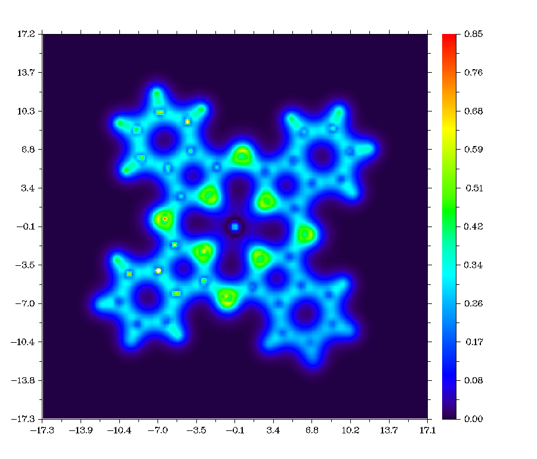
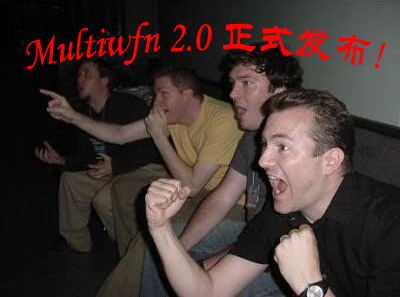
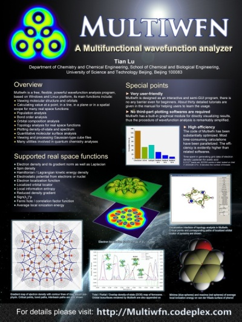
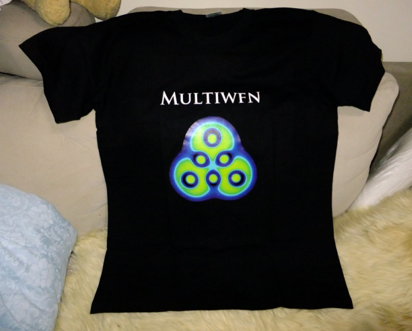

**杂谈Multiwfn从1.0到3.0版的开发经历**

Talking about the development experience of Multiwfn from version 1.0 to version 3.0

文/Sobereva @[北京科音](http://www.keinsci.com/)   2013-Mar-29

在Multiwfn 3.0发布后，在疲惫、激动之余，回想起从Multiwfn 1.0到3.0版这三年多断断续续且艰苦的开发历程，颇有点感慨。当初只是一个很小的念头，卧在床上写了几百行的程序，想不到这个小程序如今成为了Multiwfn 3.0，有了约三万行代码，被近百篇文章所使用，用户覆盖中国、欧洲各国、美国、印度甚至伊朗。这段开发历程是个珍贵的回忆，不禁想写个帖子零零碎碎地闲谈一下，写写自己当时的想法，等以后很可能就淡忘了。详细介绍某量子化学软件的开发历史，特别是记录开发者自己每个阶段想法的文章我未曾见到，但如果有，我认为一定会很有趣很值得一读。等再过几十年，有人尝试总结一次中国量化软件发展史的时候，说不定本文的一些闲杂内容还能当做素材呢。

Multiwfn是波函数分析软件，所以，这篇闲谈自然要上溯到笔者什么时候开始对波函数分析开始有兴趣。

笔者开始自学量化大抵是从大二的时候。后来听说到有AIM这么个理论，貌似很有趣，但不明内容。大概在大三的时候，在网上偶然看到一个23页的Bader写的综述AIM的pdf文档，是总共有五卷售价奇高的Encyclopedia of Computational Chemistry中的一节。当时无聊的课程、实验多得很，我把那23页打印出来，挤出时间在上课时间看、在做实验时等着反应完成的时间看。虽然当时尚没法完全读懂，但是起码那些读懂的内容，比如键径，令我觉得应该用fascinating来形容，相当令我着迷。当时还萌生了个念头，想把AIM和前线轨道理论给融合起来来更好地解释反应如何进行。不过，我现在已经对前线轨道理论有点嗤之以鼻了，大抵是后来接触了概念密度泛函的缘故吧。接触AIM，应该说是我对波函数分析感兴趣的最初契机。我最早接触的AIM程序则是AIM2000。记得是在一个酷热的夏天，在宿舍里热得难以入睡，将AIM2000 demo版对照着帮助文件把玩了一晚上，基本都玩通了。好不容易把电子密度的等值线+梯度线图做出来，看着挺欣喜的，之后还专门写了个简单的AIM2000中文教程。Multiwfn的拓扑分析模块的操作方式的设计，有很多方面都是借鉴了AIM2000。

GsGrid如今早已停止开发，其功能已经全部融入进了Multiwfn，或许有人还记得这个程序。这个程序，和Multiwfn后来的开发有很微妙的联系。开发GsGrid的动机是因为，在那个时候，网上有人问怎么做出诸如电子密度之类实空间函数的平面图。虽说这种图在文献里到处都是，可是，起码对于高斯来说，当时要想做出这种图还真是没有好法子。虽然gview已经可以直接做出截面的等值线图了，但这也是后来的事了（当时还是以gview 3.0.7版本为主）。虽然我那时候倒不需要做平面图，但是为了给大家带来方便，用了好像是一个通宵就写出了最初的GsGrid程序（然后当天发布到网上，中午我就给我亲戚修电脑去了）。它用来读取高斯生成的cube文件，然后提取其中指定平面上的数据，以便用sigmaplot等程序作图。GsGrid中的gs代表Gaussian。（后来在google学术搜索中发现已经有其它程序叫这个名字了，早知道如此可能当初就换个名字了）

后来逐渐给GsGrid加入了更丰富的功能，版本号也一直在提升。其中对格点文件相互运算的功能很有用，比高斯自带的cubman好很多。zhou2009对GsGrid的开发给予了热情的鼓励，他的的帖子很多都用了GsGrid，特别是用来做密度差平面图。最初GsGrid只是在论坛上发布，后来建了个主页，不过我朝的免费网络服务历来都很不靠谱，说停就停，一点责任心都没有，记得是换了两三次主页空间，最后，终于在微软提供的开源项目codeplex上定居下来，地址为GsGrid.codeplex.com，到现在依然能访问。

AIM2000读取的是wfn文件，它包含了波函数信息。在2009年11月，我萌生一个念头，想写个教学目的的帖子，介绍怎么利用wfn文件中的信息计算出不同位置的电子密度值。于是，就试着写了个小程序来实现此目的。没有费多少时间就完成了，也就几百行代码。不过，我却违背了我的初衷，那个教学贴子没有写，原因是，我对着个小程序产生了极其浓厚的兴趣！想进一步扩展它的功能而懒得写那个帖子了！我发现，很多我想实现的目的，利用wfn文件，都可以凭借我自己的能力不费太多力气就能实现出来。我最初就想到以前搞量化的人遇到的难题：绘制平面图没有便利的工具。虽然GsGrid确实能达到这个目的，但是毕竟步骤还是稍微繁琐，得读入格点文件，导出平面数据，然后再弄到sigmaplot里。而且只是绘制一个平面，却要计算一个三维空间里一大堆点的数值，这明显划不来，浪费了很多计算时间。再有，如果要绘制的平面是斜着的，那么只能将格点数据投影到那个平面上，由于GsGrid并没有利用插值方法，所以投影出来的斜面数据质量有限，在sigmaplot里做出的图有锯齿，除非格点精度颇高才不明显。为了能给大家一个更便利的工具来做出平面图，Multiwfn第一个版本就加入了平面图的绘制功能。只要敲几个键，很漂亮的图形就能很快地直接输出到屏幕上，真是解决了绘制平面图这个老大难问题。

Multiwfn用的是DISLIN图形库来绘制图像。当初为实现绘制平面图的功能，在网上搜了搜能给Fortran提供接口的图形库，索性没怎么费劲就找到了DISLIN。当初还考虑是否用MathGL图形库，虽然我到现在也没用过它，不过我想肯定不如DISLIN。而且，幸好DISLIN提供了简单的制作图形界面的功能，后来直接把Multiwfn的图形界面也用DISLIN给做了。DISLIN最令人头疼的是手册写得不好，全都是子程序的解释，而教程、例子很少，总得靠自己摸索。包括到现在，调用DISLIN来实现新的绘图功能，我还是得拿以前些的代码做参考才行。记得最初尝试调用DISLIN是一天晚上，在Multiwfn里计算了类似卟啉的平面大体系的平面上的电子密度数据，然后DISLIN立刻将图像输出出来，虽然那幅图现在看起来没什么，但那时感觉真是惊艳无比！十分兴奋！（那图还留着，如下所示）

Multiwfn 1.0在2009年11月27日正式发布到论坛上。好像是2010年3月，给Multiwfn在codeplex上建了project，也就是现在的Multiwfn官网<http://multiwfn.codeplex.com>。（我很纳闷，明明这官网上就能下载所有版本，速度也不慢，怎么偶尔还会有人向我索要程序。有人上不了外网而无法访问，*一下不就得了）

2017-Apr-5注：由于微软的codeplex开源项目已经停止运营，Multiwfn主页已变更为<http://sobereva.com/multiwfn>。

Multiwfn的全称是Multifunctional wavefunction analyzer。名字主要来自于wavefunction analysis这个概念。其实，wavefunction analysis这个叫法即便是到现在，在学术界里用得也不多，但是我觉得这个叫法很贴切。这个叫法大抵是我从Introduction to Computational Chemistry(2ed,Jensen)那本书里的第9章的标题最初学来的。后来看到Cioslowski在Encyclopedia of Computational Chemistry中的一节的标题也用了wavefunction analysis这个名字，而且内容也正是我所感兴趣的那些（虽然Jensen和Cioslowski的文中对波函数分析方法总结得都并不全面），于是我就坚定了用wavefunction analysis这个词描述Multiwfn的功能，并由此命名程序。

后来，对Multiwfn的开发逐渐有些上瘾，不断扩充、完善功能，版本号一路升至1.5：  
1.0 Release date: 2009-NOV-27  
1.1 Release date: 2010-JAN-17  
1.2 Release date: 2010-FEB-9  
1.3 Release date: 2010-APR-24  
1.4 Release date: 2010-JUL-8  
1.5 Release date: 2010-OCT-2  
不断更新程序的同时也在不断更新手册。1.x版本的手册其实内容很简单，纯中文，就是给了一大堆例子，不怎么系统、详细，没什么理论上的介绍，那些例子也没有什么物理意义。不过到了1.5版，手册还是达到了两万七千字。

最初写这个程序的动机其实并不复杂，一方面是自己的兴趣，另一方面是给大家解决实际问题。这两个目的到现在依旧没变，但如今的目的则不止于此。后面会谈到。

Multiwfn的开发从一开始就是很耗费精力和时间的。名义上我是“忙里抽闲”来开发Multiwfn，但实际上，Multiwfn的开发可能占了我约一半的科研时间。由于开发Multiwfn名义上不算“正事”，所以，每当拿出大把时间开发Multiwfn的时候，总觉得背负着一些压力，有点负罪感。可是，不花时间是绝对做不好的，譬如有的很小的bug往往就得花一两天时间调试才能揪出来。然而，凡是发现任何bug，特别是会导致计算结果错误（而非导致报错）的bug，我一定会立刻不惜代价去解决，否则用户拿着我的程序得到了错误的结果，审稿人也没发现，最后却误导了文章读者，那真是误人子弟，Multiwfn成了祸害。尤其是当Multiwfn的用户逐渐变多之后，必须抱有更强的责任心才行。

其实原本想花一两年时间写一个从头算程序，名字叫saint，写了快一千行了，但是由于Multiwfn的开发繁忙，saint夭折了。

2010年底，某日晚上大概10点多归宅，得知Multiwfn终于第一次被正经的学术刊物的文章所引用（J. Phys. Chem. A, 114, 13257），当时很高兴，这也标志着，Multiwfn不再只是流传于网上，而是终于在学术界露头了。

Multiwfn的logo算是妙手偶得。在Multiwfn里绘制Li6的ELF图的时候，在某种调节色彩刻度下，我发现造型、整体颜色挺雅致，也充分体现了我追求的科学与艺术相融合的理念。由于之前也没考虑过Multiwfn的logo，看到这图我就定下来将它用作logo了，并且放在了之后2.0版的封面上。

1.x系列最后一个版本是1.6，当时还做了个ppt给几个人大体介绍了一下1.6版，这ppt在Multiwfn主页的other resource一栏里能找到。不过1.6并没有正式发布，因为我决定一口气将1.6做得更强。随着代码的开发，逐渐我觉得已经够资格称为2.0版了，于是2.0版于2011年3月9日发布。

如果说1.x版本只是序曲、还只是凭兴趣做着玩的阶段，那么Multiwfn 2.0的发布，就标志着Multiwfn正式进入学术同行的视野了。Multiwfn 2.0相对于1.5做了无数的改进，更新内容能列出一大长串。那时我在计算化学界有名的邮件列表CCL上发了个Multiwfn 2.0发布的消息。我的blog（sobereva.com）上也相应地发了消息，其中用了一张四老外的图，很能表达我当时的心情

那时我决心让Multiwfn成为世界级的波函数分析程序，而不仅仅只在华人的圈子里流传。于是，我下定决心将Multiwfn的手册重写，写成详细的英文版。手册编写过程很辛苦，花了大概一个月，终于写完了90页左右的手册。手册的编写模式受到了我之前读过的AOMix的手册的一些影响。AOMix是一个很难用的、功能少而且还收费的波函数分析程序，虽然我不怎么待见AOMix，不过它的手册写得令我受到很大启发。因为它不光讲程序操作（其实程序操作没讲清楚，挺乱的），而且还花了至少一半篇幅介绍理论，特别是Stout-politzer划分、SCPA划分、DOS图、CDA这些内容的介绍我很感兴趣，从这手册中学了很多知识。于是，我在编写Multiwfn手册的过程中不像绝大部分程序手册那样只是介绍怎么用，还特意将所有Multiwfn涉及到的理论都进行讲解。在后来，我还逐渐追求让Multiwfn手册里的实例都展现出一定物理意义。这样，看了手册，不仅学了理论，掌握了操作，还知道这些功能能起到什么实际价值，我想这样是最好的。手册的编写和开发Multiwfn程序一样，本着精益求精的态度来做。写手册的时间，估计是我开发程序时间的大概1/3。

2.0版之前都是在compaq visual fortran 6.5环境下开发的，这个编译器很好用，对代码兼容性很强，产生的代码运行速度也还不错。但是最大的缺点就是不支持OpenMP。那时多核早已普及，包括我自己的台式机和笔记本也都是四核，所以决定从2.0版开始用OpenMP来并行化，这对于提升格点数据的计算速度来说尤为重要。这就使我不得已舍弃了CVF6.5而改用intel visual fortran了。我本来是很不情愿移植到IVF上的，一方面因为这东西依赖于臃肿的visual studio 2008，还因为IVF不仅收费还得单独装。不过最终还是迁移到了IVF，用惯了发现还是挺好的用的，即便是串行代码速度也比CVF快。从1.5到2.0的升级使得Multiwfn运行速度有了质的飞跃。不过，考虑到很多用户还是在用CVF6.5作为编译环境，所以Multiwfn的windows版源代码包里至今依然有CVF6.5的编译方法，只要对现有代码稍加改动就能顺利地编译并且使用。

手册从2.0起没有了中文版，导致后来很多人很想要中文手册，甚至还去读1.x的中文手册去（1.x版就在Multiwfn官网的download页面里就可以下，手册就是readme.txt，在压缩包里），其实根本没必要，我也很反对这样。1.x版的手册内容很少，写得也远不如2.0及以后的好。而且搞量化的基本都是研究生或以上的级别，学术向的英文看不懂我觉得不可能，真若如此那还怎么搞量化？。实际上，对于Multiwfn的大部分应用我也都写过专门的中文的帖子发在网上，对原理和操作进行了往往比手册里更详细的说明，这些帖子都列在了Multiwfn官网的other resource一栏里，也发到了笔者的百度blog上，总共有近20篇，共17多万字。我一直以来有个很头疼的事，就是用户总是不看费尽心血写的手册！我已经尽力将手册的门槛弄得尽可能低、编排尽可能合理，但是经常还是有人问那些手册里写得很清楚很浅显、稍微动一下头脑看一下手册就明白的问题（有些问题在手册前三页就能找到答案！）。这些人对于我写的那些Multiwfn相关帖子也往往不认真看，还抱怨没中文手册（很多人只是在回帖中叫好凑热闹，帖子连读都没读）。

Multiwfn 2.0发布后我开始撰写Multiwfn程序的介绍文章，这样对程序未来发展有好处，毕竟一个私人的来路不明的程序总不如一个发在正经刊物上的程序让人觉得用起来放心。最初投到了JCTC去，被拒（实话说我对JCTC很无语。特别是看到比Multiwfn的其中一个子功能都差得甚远的NCIplot的文章发在上面之后）。然后就投到了JCC去。编辑让大修，一个审稿人比较友善，另一个故意找茬，态度模棱两可，其中吐槽点之一是嫌Multiwfn程序没有Linux版。之前Multiwfn一直都是基于Windows的，虽然先前也考虑过发布Linux版，但只是实验性的。既然审稿人这么说，得去对付，而DISLIN图形库也恰好有Linux版，我就干脆花了大概两三天时间主要对Multiwfn的图形界面部分的代码进行调整，使得在Linux环境下用起来也正常（不过，我一直没有自信用户能否在Linux下顺利使用Multiwfn，因为用了DISLIN库，所以程序就得依赖于其它一堆零碎的库文件，虽然那些库在我用的RHEL系统都自带了，但是对于其它系统的用户可能就不得不自己装缺失的库之后才能用了。Linux系统下的程序老是三天两头地提示缺库，这是我对Linux不爽的最主要原因之一）。这样，在回复审稿人的时候Linux版就已经搞好了。稿件返回后就接受了，后来发表在J. Comp. Chem. 33, 580-592 (2012)上。我希望使用Multiwfn的用户都引这一篇，同时引Multiwfn的网址也好，但不要只引网址。主要原因是因为引用网址的话引用次数很难统计。可惜目前还是有小一半的用户在发文章时只引了网址。JCC这篇介绍文章对应的是Multiwfn 2.1.2版，后来加入的无数重要功能都没有出现在文中。可能以后会再单独写一篇文章投出去介绍Multiwfn又有了哪些重要的扩充改进。

值得一提的是我十分尊敬的AIM理论的创始人Bader于2012年1月15日因肺病与世长辞，这是波函数分析领域的不可估量的损失。为此，我在Multiwfn的主页上挂了一个月的讣告消息。

中国量子化学软件的发展实在令人觉得很遗憾。Zork曾写了篇《国产量子化学程序覆灭记》，其实国产量化程序曾经还是有不少的，就算不能做到世界级软件那么强大，但起码坚持发展下去，总会在个别方面富有特色，因而能够具有价值。可惜的是，眼下，国产量化软件一片荒凉。虽然也有有一定影响力的，但屈指可数，特别是，那几个软件对绝大部分量化工作者没什么用处，太过于学术化、复杂了。在2011年11月的时候，我去广州参加了一趟宏剑ICTCLS'11大会。当时老黎做大会报告，当时具体说什么已经不记得了，我记得最清楚的，就是他说中国用的量化软件基本全靠进口，国内的软件开发都是由各个课题组各自为阵，也不公开（至少也没商品化），难成气候。虽然对目前国产量化软件的这种形势早已认识得很清楚，但晚上从会场回到宾馆，想起老黎的话，不禁又叹起气起来。当时决心，要让Multiwfn打破国产量化软件的僵局。同时，也决心将Multiwfn“扩大化”，也就是决不满足于Multiwfn的现状，而是使劲努力对它不断扩充和完善，让它变成最强的波函数分析软件。从而有朝一日，将Multiwfn做到NBO的影响力，成为中国量子化学软件的标杆。

我开发Multiwfn的原因不仅之前提到的那些，其实还有个人欲望的驱使，以及对现有波函数分析方向的学术软件的强烈不满，意图去彻底取代它们。这里个人欲望是指，我想把一切我感兴趣、我认为有用的波函数分析方法全都纳入Multiwfn当中去，使得Multiwfn成为终极、无与伦比的波函数分析程序。但唯独NBO程序涉及的功能我不打算纳入Multiwfn，因为NBO程序已经做得足够好，重新把它们实现也很费精力，而且NBO4之前的版本也都免费且已经嵌入了高斯里。而我所谓的对现有学术软件不满，具体来说是，绝大部分波函数分析软件都很糟糕，然而由于没有什么可选择的余地，导致千千万万的量化工作者不得不很辛苦地鼓捣那些糟糕的程序，这令我很看不惯。糟糕分为好几类原因：(1)收费。就那么点功能（比如AOMix），还好意思厚脸皮收费。 (2)超级难用。比如DGrid，手册看得我头疼，写输入文件很麻烦。再比如TopMod，那么点分析却要反复敲一大堆命令，设计得简直匪夷所思。 (3)速度慢，比如aim2000，搜索临界点速度很慢，对盆积分就更别提了。 (4)程序功能单一。每种波函数分析往往只能做一种分析，十分缺乏整合性。 (5)程序不公开。有的程序还好，能向作者免费索取。然而很多程序，作者根本不提供，根本就没打算让别人能用上，这是最最糟糕的。如果我没误会的话，AdNDP程序就是如此，刻意不公开。Multiwfn的推出，彻底解决了这些糟糕的问题，目前已经令好几十个波函数分析程序没有任何存在的价值了。

开发Multiwfn也有我个人的学术需求的原因在内。要想提出一些新的理论方法，就必须通过程序来实现、检验。如果只是用别人的程序，在别人的程序基础上改会非常累。对我来说读别人的代码远远不如自己写代码愉快。当有一个自己的完善的程序，想实现什么新思路，基于现有的程序架构，实现起来会比凭空写一个程序容易得多得多。有很多篇笔者的文章都是基于Multiwfn才实现的，其中的大量计算没有其它任何现成程序可以做到。

Multiwfn一直承诺着向大众免费、开源。也有人想跟我合伙把程序弄成商业化赚钱，但我还是回绝了。Multiwfn的开发很耗精力和时间，目前没有申请什么基金项目之类的世俗的东西，虽然笔者也凭借Multiwfn或许获得了些许的影响力，但实话说，一直坚持三年多的Multiwfn的开发基本上是没得到好处的，至少回报比起付出来说是很少的。但由于上述诸多因素，以及笔者目前对波函数分析和对Multiwfn程序自身的热忱，以及怀着雷锋精神，Multiwfn的继续开发是不会停止的。不过，想到“赚钱是为了吃饭，吃饭是为了活着，活着是为了搞科研”，所以前些日子在Multiwfn主页上增加了一个捐赠的链接，如果是真心喜爱Multiwfn且确实是有钱没处使，倒是可以考虑捐赠。

最初我在主页上写希望使用Multiwfn发文章的用户能将自己发表的文章通过邮件发给我，这样就方便我统计被引用次数，不过极少有人这么做。后来我发现google的学术搜索快讯挺好用的，每当Multiwfn在学术搜索上有新结果就会自动用邮件通知。所以我的邮箱里会时不时收到以“学术搜索快讯 - [ multiwfn ]”为标题的邮件，每当看到这样的邮件就会有一丝愉悦感。然后会将邮件里的文章添加到Multiwfn主页上，并且下载一份文章pdf文档存着。

再回到时间轴上。大概从ICTCLS'11之后，我逐渐定下来了Multiwfn 2.x系列版本的主体开发计划。虽然Multiwfn每个版本都有一大堆改进，但是每当版本号增加0.1，一定会有一个重大的功能（主功能）会被加入。那一系列开发计划包括ELF/LOL/拉普拉斯函数的拓扑分析、AdNDP、CDA、定量分子表面分析、盆分析。

最先把ELF/LOL/拉普拉斯函数的拓扑分析加了进去，成为了2.2版(2011-Nov-28)，而电子密度的拓扑分析在之前的2.1版(2011-Jun-26)里已经有了。记得当时写ELF/LOL的导数公式、电子密度的三阶导数推了好几页纸，好不容易才调试到代码彻底没有错误。然后，在2012年学生们放寒假期间将定量分子表面分析功能加了进去，并且把GsGrid全部功能整合了进去，成为了2.3版(2012-Feb-18)。从此之后GsGrid不再做任何更新，而原属于GsGrid范畴的功能则在Multiwfn的主功能13里进行了后续的扩充和改进。之后，同年五六月份花了小一个月时间将AdNDP功能加了进去，成为了2.4版(2012-May-6)。然后，在暑期有个念头，想提出一种基于模糊重叠空间的定义键级的方法，顺带着写了个模糊空间分析的主功能，成为了2.5版(2012-Aug-1)。然后，10月份左右不务正业一口气把CDA功能加了进去，成为了2.6版(2012-Nov-6)。2012年对于Multiwfn的进一步壮大真是很重要，代码总行数不断增加。从一万多行不知不觉地增长到近两万六千行。而在这一年，Multiwfn被引用次数暴增，出乎了我的意料。

我发现有人在百度百科上创建了Multiwfn的词条，创建日期是2011年12月04日。这是好事，后来我也适当地更新这个词条，但是百度百科本身实在很恶心，和wiki比不仅很山寨，而且内容的改动总是很容易通不过审核。居然连自己的程序的介绍都没法随意修改。所以百度百科上的Multiwfn词条内容很少，我也不打算大规模扩充了，否则，若是写了好多到时候还是莫名其妙地不给理由地审核不通过那真是浪费时间。以后可能到wiki上创建一个Multiwfn的词条。

在2012年四月13~16日在四川大学召开的中国化学会第28届年会上，我做了个墙报贴在展板上，意外地看见我斜对面的墙报上的图就是拿Multiwfn做的，没记错的话是电子密度填色图。当时也有不少用户和我相互交流了一下。那个墙报的制作花了我一整天的时间。Multiwfn的程序设计是带有艺术思想的，我也一直倡导科学和艺术的结合，所以我不想把墙报做得很普通，仅仅是文字和图片的简单排列。由于笔者喜欢黑色，所以黑色就确定为了背景基调，黑色作为墙报的背景实在是很少见，但是我还是大胆地这么做了。在photoshop里把标题的文字效果调好之后，已经隐约开始觉得有整体气势了。后来将文字和图片细致地填上、排布好，还特别注意了细节，比如避免图片边缘显得突兀，特意做了半透明的勾边效果。最后，想把黑色的背景上做些衬托效果，就想到了宇宙，这样可以表现出包容、宏大和震撼力，衬托Multiwfn的价值。然后就在硬盘上找了找以前存的宇宙图片，发现一个大概是X3那个太空游戏游戏的官方宣传图，图片底色就是宇宙的漆黑，和墙报底色正搭配，于是就把这图挪到墙报上了，看起来效果极好！整体效果十分符合笔者的审美，虽说对于学术的墙报来说，或许太个性了。充满艺术感的墙报只用一次就丢掉太可惜，或者说，如果只用一次之后就没有价值的话，那么墙报只是平庸的墙报，而不是art。目前这墙报一直挂在家里的睡房，一睁眼就能看见。墙报的高清图可以在Multiwfn主页上下载到，小图如下

那次去开化学会的前几个月，恰好用Multiwfn的logo印了件T恤，于是那次开会时也穿上了，算是给Multiwfn打了打隐性广告。T恤见下（衣服对我来说有些肥）

2.6版发布后，就差一个盆分析功能还没实现了。盆分析很重要，其实原本2012年上半年就想将它加入，但是这东西涉及到的算法着实比较复杂，有点觉得深不可测，所以先把比较有把握的功能都实现了。盆分析在2012年可以算是我的一个心病，这是必须实现的极其重要的功能，然而总担心能否有能力实现好。最后终于在2013年的春节期间，一口作气，拼尽全力奋战写了近两个礼拜代码，总算是把盆分析功能基本搞完了。然后就跑米国度假半个月去了，之后回来继续奋战盆分析代码，花了几天彻底搞完后又花了一个礼拜把手册写好，之后，3.0终于出炉了！此时Multiwfn约有三万行代码，是最初版本的50倍。手册已有257页，是2.0版本的近三倍。

2.x版本每当版本号增加0.1，当发布的时刻，都感觉很疲惫，同时感觉大功告成，非常有成就感和快感，甚至有一点点死而无憾的感觉。当3.0发布，心中长久的顽疾彻底解除，这种感觉更是强烈。终于一步一个脚印，将之前规划的数个大型的功能成功地、以完美的方式逐一完成了，微微觉得有点不可思议。3.0的推出，可以说意味着Multiwfn的主体结构都已经完成，因为除了NBO以外最重要最有用的波函数分析方法Multiwfn都已经能做了。就像大楼已经建好，未来只需要进一步扩建和装修了。

很多波函数分析程序开发完了就再也不更新了，特别是个人的免费的程序，毕竟不像商业软件那样更新了之后用户得升级，从而还有利可图。Multiwfn的开发绝对不会那样。Multiwfn还有很多进一步发展完善的计划，包括：(1)支持基于平面波的程序 (2)支持ADF (3)支持Crystal09程序 (4)改进等值面显示速度和效果 (5)支持分布多极分析(DMA) (6)加快静电势计算速度 (7)支持AOSB键级分解 (8)电荷转移积分 等等。

Multiwfn 4.0什么时候会发布，这目前是很难想象的。实际上，从3.x到4.0的发展计划还完全没有具体想法。我只是打算将Multiwfn尽力做得更好。如果有朝一日4.0真的发布了，那么那时的Multiwfn的影响力应该已经很大（起码是目前的三倍），在波函数分析领域已经具有了很重要地位，在国内量化工作者的研究中已经普及开来，程序在各个方面都已经几乎完美无缺。

Multiwfn目前有个明显的弊病是显示等值面图的时候（除非用mesh方式显示）少数情况下颜色要么对比度很低，要么有块状黑影，看着不舒服，而且显示速度不理想，只能说是凑合用。尤其是在Linux版中，不管什么时候都有黑块。显示等值面图目前是依靠DISLIN库，无奈这个库在这方面比较弱，我也没有好办法。估计3.x版会改进。但是改进起来很困难，如果靠OpenGL，写起来估计得花一些力气，而且程序估计就不止这么几个文件了，会带着一堆乱七八糟的零碎文件，而且Linux版到时候在用户那里肯定又是一堆缺库文件的提示，我很讨厌这样。还有人建议我用java或python给Multiwfn写个壳之类的，我也拒绝了。因为到了用户那里又要装java、python运行环境。我很不愿意给用户增添任何麻烦、任何负担。

前一阵子一个挪威的合作者问我能不能搞个Multiwfn在线版运行在他们服务器上，这个想法一开始觉得意思不大，而且太费时间。但仔细琢磨了一下，感觉到也是个好点子。想必，绝大多数有一定基础的Multiwfn用户是不想用在线服务器的，因为这也根本没必要，因为在单机上运行得已经很好。所以，在线版本打算主要面向一些量化还没入门者、结构化学的老师和学生、其它领域的研究者。在这个在线版本中只将Multiwfn最常用最核心的功能实现。在线版本将使得没有任何经验的用户，乃至于中学生，都能很容易地使用。比如说，只要在网页上画个分子结构，点几个复选框，在线服务器就自动调用量化程序对之优化，然后产生波函数文件，然后传递到Multiwfn里计算ELF数据，然后用户就直接在网页上可以看到ELF等值面、平面图、曲线图了，用起来没有任何门槛，甚至不会用任何量子化学软件的人都能用上Multiwfn。这样一来，Multiwfn的影响力或许会冲破量化研究的圈子，普及到整个化学界。在线版还有一个好处，也就是不管在任何系统上，只要能上网就都可以用Multiwfn了，甚至在ipad上、在智能手机上都能做波函数分析。不过建立在线版Multiwfn还只停留在设想阶段，什么时候有空去做它真是未知数。

波函数分析是极其重要的，然而，在教科书里总是提及得甚少，绝大部分量化工作者对波函数分析不怎么懂。然而，从网上的帖子，明显看得出大家很需要这方面知识来使自己研究的体系能被认识得更深入。还有一些人，根本就几乎一点都不知道波函数分析是什么，有什么意义和用处。实际上，搞波函数分析方法的人很多，主要集中在欧美，但是很多重要的成果都只在相对较小的圈子里使用，其价值完全没有得到应有的体现。主要原因之一是没有好用的程序，这个问题Multiwfn基本已经解决了，但是，另一个主要原因依旧，也就是，广大量子化学工作者不怎么懂波函数分析。特别是在我国，搞和波函数分析有关的理论的人几乎没几个，做应用方面研究的人用的波函数分析方法大多也就基本仅限于AIM和NBO，或者根据分子轨道图讨论讨论。很多研究文章如果加入更合适的波函数分析，明显能使结论更充实、文章的结论更有说服力、理论意义更强。我深感我有责任在量化研究圈子里倡导和推广波函数分析方法，让研究者普遍对波函数分析方法有个系统、清醒的认识，并进而广泛应用到自己的实际工作中。我觉得这个任务非得由我来做不可，我不做的话未来肯定也不会有人做，波函数分析的价值将永远被冷落被忽视。特别是有一次，令我觉得波函数分析的普及程度之差简直是到了可悲的地步。那次，我和一个北京某大学有些名气的搞理论化学的有点自以为是的教授（波函数分析的外行）中午吃饭，一路上，他问我现在研究什么，我简单说了说近期的波函数分析方法方面的研究工作，结果他马上就急着说：你搞的这些都过时啦！几十年前就已经研究得差不多了！现在都没什么人搞啦！你搞的都是冷门啦！劝我不要继续研究。继续交谈过程中，我发现他根本就没读过什么和波函数分析有关的东西，对近年来的发展现状一概不知，充其量也就是知道Bader和他的原子盆这点概念，以为这点东西就是波函数分析的全部，对波函数分析能干什么完全不懂。我真是懒得和他继续争下去。那时我有点气愤，我也更加认清楚，我需要做的，就是将波函数分析方法的概念、原理、意义、价值传播给国内的研究者们，当波函数分析不再受忽视，诸如ELF、Mayer键级、福井函数这样的最重要的概念都能普遍出现在量化教材当中，我想，那个教授也就只能收声了。

那次吃饭后，本来想写个拟定为《波函数分析：被忽视的热门领域》的帖子，但是当时有点事情耽搁了，待火气消了，也懒得写了。其实波函数分析领域一直在发展，新的概念层出不穷，其中不乏很多很有用的方法，例如2010年杨伟涛他们组提出的RDG分析方法普及得相当快（在中国的普及，我想主要还是多亏了我的《使用Multiwfn图形化研究弱相互作用》一文）。特别是JPCA上，与波函数分析相关的文章总是接连不断。若有谁说波函数分析已经冷门了，那么他已经out了。可惜，这些新进展基本都是圈子里的人熟悉。推广得很不好。或者说，大部分这方面的研究者要么是缺根筋，要么是别有用心，根本就没想要去推广自己的方法。就连个现成的程序都不提供给大家，谁来用？

Multiwfn的功能极其丰富，用法十分灵活，所以，即使我写了很多帖子，手册也编纂得极为详细，但肯定依然没有用户能完全掌握Multiwfn的全部。（有时候，我看到引用Multiwfn的文章中，明明是Multiwfn支持的很好的功能，作者却用了别的更难用的程序来做，觉得一定是作者没有认清Multiwfn的功能和优势所致）。同时，我也很想亲自给用户们多讲讲波函数分析方面的知识，包括最新的进展等等。所以，笔者很早就有计划开Multiwfn用户培训班，但是以前时机还不够成熟，因为Multiwfn的主体功能那时都还没完全实现，特别是盆分析功能没有实现。3.0版发布之后，就可以开始正式谋划开办培训班了。这绝对不像很多黑心的软件公司那样，一个培训班动辄上千乃至四五千。我打算今年7月下旬或8月上旬开，但是一切还都是未知数，反正最晚2014年内也绝对开了。培训班不会只办一次，可能比如一年办一次。除了波函数分析和Multiwfn的介绍，也会借助培训班的机会给广大使用者进行答疑。

笔者也一直筹划着动笔写一本波函数分析的书籍。虽然国外已经有不少和波函数分析相关的书，比如AIM方面的就有四五本，NBO也有两本，但都属于专著型。无论是国内还是国外，迄今都没有一本以波函数分析为主题的书将广泛的波函数分析方法进行系统的、简明易懂的讲解。而且，理论结合实际操作的书也是少之又少。我打算明年或者后年动笔，届时会把各类波函数分析方法进行系统的介绍，会突出重点，深入浅出，尽量少用一些复杂的概念，使得非量子化学专业的人就算没法100%读懂，但肯定也能明白方法的目的、用处、价值何在，不会看得一头雾水。而对于量子化学专业者，只要具备最基本的知识，肯定能完全读懂。书里不仅讲方法，也会结合Multiwfn程序给出大量计算实例，将理论和应用有机地结合起来。而市面上绝大部分书，都是讲一大堆空泛的理论，虽然有的也给了具体应用来说明其可靠性和用处，但都没讲具体怎么实际操作，导致读者很难将方法直接应用到自己的研究中去。我觉得，只有我才拥有这样的条件，去写一本贯穿理论+应用+操作的全面的波函数分析的书。书肯定是中文版，如果受到欢迎，说不定以后再写成英文版让世界上更广泛的读者们读到。

做具体应用的量化研究者们总是面临一个困境就是“会算不会分析”，实际上文章的一半以上的价值就在于分析，而非去算。这里的“算”主要是指计算单点能、做几何优化、算光谱。把Multiwfn弄通之后，这个困境就彻底摆脱了。甚至于，对于一些想凑文章的人，都能够靠Multiwfn来灌文章了。例如，文章题目叫做《xxx的理论研究》、《xxx的从头算研究》、《xxx：a DFT study》，内容就是gview里搭个新奇的分子（以及它的衍生物），然后拿高斯做个优化，讨论一下几何结构，算算红外、紫外、NMR，之后就把Multiwfn支持的各类波函数分析往上套，比如ELF/LOL/拉普拉斯的平面图或等值面图分析、电荷分析、轨道成分分析、键级分析、芳香性分析、盆分析、RDG弱相互作用分析、AIM分析、分子表面静电势分析、福井函数/ALIE/双描述符做活性位点分析等等等等，再结合NBO分析、AICD做感应电流密度图分析，对于CTC及以下档次的期刊，靠这么“堆分析”得到的分子体系的研究文章要想发表足够了，若是对于非SCI期刊，那么这样灌水犹如囊中取物般简单。当然，这里声明，笔者坚决反对这样大量灌水！如果实在是毕不了业要救急，这么灌一篇也就得了，如果反复灌数篇、乃至十几篇、几十篇，那真是作孽，是学术界的祸害。我已经看到有数篇用Multiwfn发的文章确实这样做了。

虽然对于让Multiwfn卖钱的建议一直以来我是拒绝的，不过有提议将Multiwfn做成一个“解决方案”，保持对于学术用户免费、开源但对于非学术用户适当收费，如今我倒是觉得可以，这不会扭曲Multiwfn的发展，不会动摇我学术的纯粹性，而会让它得到更多的外界支持，以至于最终可以变得更好，使学术用户受益。具体来说，也就不是光让Multiwfn这个程序来单打独斗，也不只靠博客、论坛来推广，而是类似于material studio这样的成熟的大型商业软件进行全方位的包装、宣传，提供稳健的服务支持。如今Multiwfn程序主体已经完工，打算将它和前面提到的培训、配套书籍结合起来，然后可以再试图申请点名头，逐渐让那些位于管理层的非量子化学工作者也能知道并重视有这个程序，最终使得Multiwfn的潜在价值能够最大化地展现出来。

其实老早老早以前就开始盘算将Multiwfn娘化，并出个本子，而且连绘图板也买了，但是一直没有如愿。主要还是没有足够时间精力。希望有朝一日能如愿在漫展上卖Multiwfn娘化本吧。不只包括Multiwfn娘，其中还会出现高斯娘、NBO娘之类的，将具有浓厚的百合味。Multiwfn娘是特立独行的黑长直，有点晓美焰的感觉。

Multiwfn开发过程中写代码的时候其实往往很愉悦，有时候会很享受那种霹雳拍啦敲键盘的感觉，手指在键盘上飞速滑动。但这必须得是笔记本键盘，要是键程长的台式机键盘可没有这份快感。开发Multiwfn最累的莫过于调试代码并调整程序了，调试的时间是写代码时间的几倍多。之所以搞得这么累，还有一个原因是我对程序尽善尽美的要求，哪怕连输出的信息中，是否应该在某个地方空一行、是否文字标签应该往右挪一点、屏幕上的提示是否足以让用户不看手册也能理解这类微小的细节问题都坚决不放过。我写代码的时候也对于代码的紧凑性、艺术性有着执着的要求，总力图在用最简短、最易读懂的代码实现最多的功能、达到最高的计算效率、最低的内存占用。我有自信，如果是别人来写Multiwfn 3.0的全部功能，得写5万行以上，而且读起来还绝对不如Multiwfn的代码容易理解。

Multiwfn的程序设计一直坚持着一下三点原则  
(1)令计算速度最大化。Multiwfn的计算代码不是写出来能用就完了，而是反复琢磨怎么让计算速度达到最高。凡是计算量大的代码一律用OpenMP做了并行化。记得曾经为了优化计算平面上静电势的代码，花了大概五天吧，反复琢磨各种写法，终于使得最后计算时间比最初低了一个数量级。虽说目前计算静电势的速度和高斯比还是要慢，这没办法，因为wfn文件里能利用的信息有限，没法以壳层方式运算以最大程度优化性能，但是比起同样利用wfn文件来产生静电是格点数据的Checkden，那速度已经不是一个境界了（而且Checkden静电势计算结果有误）。不过，个别情况下优化得过度也带来了问题。也是静电势的计算，为了节省计算指数的时间（计算一次指数函数是挺费的），一度做得优化有点过度，忽略的指数函数有点过多，导致有那么几个版本在计算离分子稍远区域的静电势计算有问题，好在后来被用户指出错误，然后改成了更稳健可靠的优化方式。自此我对优化变得更为谨慎，以免再出现优化过度导致bug。  
(2)使界面设计得尽可能容易理解，不看手册也能用明白。为此，每次当用户需要输入时，屏幕上的信息就会给出输入例子（也就是e.g.后面的内容）。每当输出信息时，凡是有必要解释的我都尽量在输出信息中作出解释（然而很多用户实在令我有点恼火，明明屏幕上提示写得清清楚楚，可就是不去看、稍稍动一丁点脑子）。同时我也追求界面设计得使得简洁，没必要的选项就不加上，但是又不失灵活性，也就是比如让计算时重要的参数尽可能都可调、结果能够修改、导出，以满足各种各样目的不同的用户们的需求。界面设计还特别注意将操作流程缩短，使得在Multiwfn中做任何一种分析，只需要敲入极少的命令就能实现目的。将以上这几点统筹好，真是很难！所以设计Multiwfn的界面真是费了很多心思，反复琢磨怎么让以上要求尽可能同时满足，这真是煞费苦心全心全意为用户着想。如果程序只是自己用的话，根本不用动这些脑筋。很多程序界面做得很烂，都是因为根本没考虑用户的感受。写一个给自己用的程序，和写一个给其他人，特别是菜鸟用的程序，在难度和耗费的时间上真是有天壤之别。  
(3)力图使结果能直接可视化。学术软件，特别是免费软件，普遍存在一个很大的弊病，就是只能算，却没法直接可视化，而商业化程序这点则做得比较好。我一直倡导可视化分析，所以我尽可能将可视化的过程简化，让Multiwfn尽可能将结果都能直接输出成图，而不是只输出一堆数据，然后再由用户折腾到第三方可视化程序去看。但是由于DISLIN图形库的局限性，不可能直接显示出的效果总能满足各种用户的要求，所以我总是留出选项让结果能以便于第三方程序作图的格式导出来，使用户能通过第三方绘图程序细致调节参数得到想要的效果。

Multiwfn的更新一直都比较勤快，除了努力增加新功能外，也把之前版本发现的各种bug都尽力解决，我总是只对最新版本的结果有绝对正确的自信。所以我总是希望尽用户能及时将Multiwfn更新到最新版本，这样我比较踏实，其实用户用没用上耗费心血写的新功能是小事，万一用了带有bug的版本得到了错误的结果那才是大事。可无奈的是，当我查看最新引用Multiwfn的文章时，我总是看到文中在用着很旧的版本。

以上乱七八糟写了一万五千字，基本上把从Multiwfn 1.0到3.0开发过程的任何感受、琐碎的想法都凌乱、毫无条理地写了一遍。等很久很久很久以后我想应该还会写一篇这样的杂谈文章，写Multiwfn 3.0之后的故事。

总之，Multiwfn一定会成为世界上最好的波函数分析程序！（我敢说，3.0版已经达到这目标的至少一半了。如果不信，就当作寡人是自卖自夸吧）
