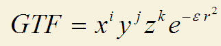

**利用wfn文件计算电子密度的代码的编写方法**How to write code to calculate electron density using wfn files

文/Sobereva @[北京科音](http://www.keinsci.com/)   2013-Apr-11

在《杂谈Multiwfn从1.0到3.0版的开发经历》（<http://sobereva.com/180>）一文中曾经提到过，寡人三年多以前开发Multiwfn最初的动机是为了写个帖子介绍怎么通过wfn文件里的信息计算电子密度，然而那帖子一直没写。正好最近有人在其代码里需要计算电子密度，于是借这个机会写个帖子介绍下怎么实现。

本文的代码来自Multiwfn 3.0，为了简明易懂进行了大量精简，用于一般的wfn文件完全没问题，但是无法像Multiwfn一样兼容一些格式特殊、非标准的wfn文件，并且计算速度会略低于Multiwfn。如果已经读懂了本文的代码，并且想要更强的功能、更快的速度和更好的兼容性，可以再把完整的子程序从Multiwfn的源码里提取出来。本文的代码的Fortran90源文件可从此处下载：[/usr/uploads/file/20150609/20150609205057_32281.f90](http://sobereva.com/usr/uploads/file/20150609/20150609205057_32281.f90)。编译在CVF6.5、Intel visual fortran上通过。

程序主要包含以下几个部分：  
module defvar：这个Module定义了一些重要的全局变量，诸如总电子数、原子信息、原始高斯函数(GTF)信息。另外也定义了两种类型，一个叫atomtype，包含原子的名字、序号、坐标和核电荷数；另一个叫primtype，包含每个GTF的所属中心、类型和指数。  
module function：包含一个名为orbderv的子程序，用于计算指定位置的轨道波函数的数值及其导数；另一个是名为fdens的函数，用于计算指定位置的电子密度值。  
program wfnprop：主程序，是一个很简单的界面，用户输入wfn文件名字，以及要计算的点的位置，然后就返回电子密度。  
readwfn子程序：用于从wfn文件中载入波函数信息，包括原子信息、GTF的定义、展开系数、轨道占据数等，并且由此确定体系中电子数、波函数类型等。  
uc2lc和lc2uc子程序：用于进行字符的大小写转换。因为不同程序输出的wfn中原子符号有的是大写有的是小写，这两个字程序用来将大小写统一，使得readwfn子程序总能够根据原子符号正确辨认出原子序号。

以下是程序代码，进行了适量注释  
module defvar  
type atomtype !自定义的记录原子信息的类型  
character*2 name !原子名  
integer index !原子序号。当使用了赝势时原子核电荷将小于原子序号  
real*8 x,y,z,charge !原子坐标(Bohr)及原子核电荷  
end type

type primtype !自定义的记录GTF信息的专用类型  
integer center,functype !GTF所属原子以及GTF的类型  
real*8 exp !指数  
end type

character*2 :: name2ind(0:109)=(/ "Bq","H ","He", &   !原子名和原子序号的转换表。0号是虚原子  
"Li","Be","B ","C ","N ","O ","F ","Ne", & !3~10  
"Na","Mg","Al","Si","P ","S ","Cl","Ar", & !11~18  
"K ","Ca","Sc","Ti","V ","Cr","Mn","Fe","Co","Ni","Cu","Zn","Ga","Ge","As","Se","Br","Kr", & !19~36  
"Rb","Sr","Y ","Zr","Nb","Mo","Tc","Ru","Rh","Pd","Ag","Cd","In","Sn","Sb","Te","I ","Xe", & !37~54  
"Cs","Ba","La","Ce","Pr","Nd","Pm","Sm","Eu","Gd","Tb","Dy","Ho","Er","Tm","Yb","Lu", & !55~71  
"Hf","Ta","W ","Re","Os","Ir","Pt","Au","Hg","Tl","Pb","Bi","Po","At","Rn", & !72~86  
"Fr","Ra","Ac","Th","Pa","U ","Np","Pu","Am","Cm","Bk","Cf","Es","Fm","Md","No","Lr", & !87~103  
"Rf","Db","Sg","Bh","Hs","Mt" /) !104~109

!下面三行是GTF类型与GTF的x,y,z上的指数的转换表。例如XY型GTF的x,y,z的指数分别是1,1,0，和下面三行的第8列对应，所以这样的GTF的functype是8。  
integer :: type2ix(35)=(/ 0,1,0,0, 2,0,0,1,1,0, 3,0,0,2,2,0,1,1,0,1, 0,0,0,0,0,1,1,1,1,2,2,2,3,3,4 /)  
integer :: type2iy(35)=(/ 0,0,1,0, 0,2,0,1,0,1, 0,3,0,1,0,2,2,0,1,1, 0,1,2,3,4,0,1,2,3,0,1,2,0,1,0 /)  
integer :: type2iz(35)=(/ 0,0,0,1, 0,0,2,0,1,1, 0,0,3,0,1,1,0,2,2,1, 4,3,2,1,0,3,2,1,0,2,1,0,1,0,0 /)  
integer :: nmo=0,nprims=0,ncenter=0 !轨道数、GTF数、原子数  
integer wfntype !0/1/2代表波函数是R/U/ROHF波函数，3/4分别代表闭壳层和开壳层后HF波函数  
real*8 :: nelec=0,naelec=0,nbelec=0 !总电子数、alpha和beta电子数  
type(atomtype),allocatable :: a(:) !记录原子信息的数组  
type(primtype),allocatable :: b(:) !记录GTF信息的数组  
real*8,allocatable :: MOocc(:),MOene(:) !轨道占据数和轨道能量  
integer,allocatable :: MOtype(:) !记录轨道类型。0/1/2分别代表无自旋/alpha/beta型轨道  
real*8,allocatable :: CO(:,:) !轨道展开系数矩阵。CO(i,j)代表第j个GTF在第i号轨道中的展开系数，系数中已经把收缩系数、归一化系数全都包含进去了。

module function  
use defvar  
implicit real*8 (a-h,o-z)  
contains

! 当orbderv子程序的runtype==1，表明只计算x,y,z处的轨道波函数的数值，结果存在wfnval数组里，其第i个元素代表第i个轨道波函数的数值，并且此时此子程序的最后一个参数grad可以空缺。如果runtype==2，则代表不仅计算数值，还计算其导数，grad(1/2/3,i)代表第i号轨道波函数在x/y/z方向的导数。istart和iend代表计算的轨道序号范围，一般都是1,nmo，也就是计算所有的轨道（显然计算轨道的数目越少计算时间越短）。Multiwfn中完整的orbderv子程序还可以计算出轨道波函数的二、三阶导数。  
subroutine orbderv(runtype,istart,iend,x,y,z,wfnval,grad)  
real*8 x,y,z,wfnval(nmo)  
real*8,optional :: grad(3,nmo)  
integer runtype,istart,iend  
wfnval=0D0  
if (present(grad)) grad=0D0

!虽然可以依次循环每个轨道计算它的波函数值及其导数，但是这样计算量比较大。效率最好的方法是下面这样循环每个GTF，得到它对各个轨道波函数及其导数的贡献。  
!GTF的表达式如下，式中的x,y,z是当前点相对于它所属原子的原子核位置的坐标。式中r^2=x^2+y^2+z^2。ε代表GTF的指数。

  

 !下面的代码算出来的GTFval就是第j个GTF在输入的x,y,z处的函数值

do j=1,nprims  
 ix=type2ix(b(j)%functype)  
 iy=type2iy(b(j)%functype)  
 iz=type2iz(b(j)%functype)  
 ep=b(j)%exp   
 sftx=x-a(b(j)%center)%x  
 sfty=y-a(b(j)%center)%y  
 sftz=z-a(b(j)%center)%z  
 rr=sftx**2+sfty**2+sftz**2  
 expterm=exp(-ep*rr)  
 GTFval=sftx**ix *sfty**iy *sftz**iz *expterm  
   
 !将GTF的数值乘上它在轨道中的展开系数就是它对轨道波函数的贡献。这次把j号GTF对各个轨道的贡献都算出来并累加进去。等全部GTF循环完之后，wfnval的各个元素就是各个轨道在当前点的波函数数值了  
 do imo=istart,iend  
  wfnval(imo)=wfnval(imo)+co(imo,j)*GTFval  
 end do  
   
 if (runtype==2) then !计算轨道波函数的导数。GTFdx、GTFdy、GTFdz就是当前GTF在x,y,z方向的导数  
  tx=0.0D0  
  ty=0.0D0  
  tz=0.0D0  
  if (ix/=0) tx=ix*sftx**(ix-1)  
  if (iy/=0) ty=iy*sfty**(iy-1)  
  if (iz/=0) tz=iz*sftz**(iz-1)  
  GTFdx=sfty**iy *sftz**iz *expterm*(tx-2*ep*sftx**(ix+1))  
  GTFdy=sftx**ix *sftz**iz *expterm*(ty-2*ep*sfty**(iy+1))  
  GTFdz=sftx**ix *sfty**iy *expterm*(tz-2*ep*sftz**(iz+1))  
  !将GTF导数的数值乘上它在轨道中的展开系数就是它对轨道波函数导数的贡献  
  do imo=istart,iend  
   grad(1,imo)=grad(1,imo)+co(imo,j)*GTFdx  
   grad(2,imo)=grad(2,imo)+co(imo,j)*GTFdy  
   grad(3,imo)=grad(3,imo)+co(imo,j)*GTFdz  
  end do  
 end if  
end do  
end subroutine

!计算指定位置的电子密度，有了轨道波函数之后计算密度十分容易  
real*8 function fdens(x,y,z)  
real*8 x,y,z,wfnval(nmo)  
call orbderv(1,1,nmo,x,y,z,wfnval) !先调用orbderv得到轨道波函数  
fdens=0.0D0  
do i=1,nmo  
 fdens=fdens+MOocc(i)*wfnval(i)**2 !轨道波函数的模方（由于这里用的都是实函数，所以等于平方）乘上轨道的占据数就是此轨道对总密度的贡献。累加起来就是总电子密度。  
end do  
end function

end module

!====== 主程序  
program wfnprop  
use function  
implicit real*8 (a-h,o-z)  
character c80*80  
write(*,*) "Input .wfn file name"  
read(*,"(a)") c80  
call readwfn(c80)  
do while(.true.)  
 write(*,*) "Input the coordinate in Bohr   e.g. 1.0,1.2,-3.5"  
 read(*,*) x,y,z  
 write(*,"(' The density is',f16.10,' e/Bohr^3',/)") fdens(x,y,z)  
end do  
end program

!从wfn中载入波函数信息的子程序。wfn文件的格式在《高斯fch文件与wfn波函数文件的介绍及转换方法》（<http://sobereva.com/55>）里面有详细介绍，这里不再累述。  
subroutine readwfn(name)  
use defvar  
implicit real*8 (a-h,o-z)  
CHARACTER(LEN=*) name  
character*80 wfntitle,c80tmp*80  
open(10,file=name,access="sequential",status="old")  
read(10,"(a80)") wfntitle  
read(10,"(8x,i15,13x,i7,11x,i9)") nmo,nprims,ncenter  
allocate(a(ncenter))  
allocate(b(nprims))  
allocate(co(nmo,nprims))  
allocate(MOocc(nmo))  
allocate(MOene(nmo))  
allocate(MOtype(nmo))  
!读取原子信息  
do i=1,ncenter  
 read(10,"(a24,3f12.8,10x,f5.1)") c80tmp,a(i)%x,a(i)%y,a(i)%z,a(i)%charge  
 read(c80tmp,*) a(i)%name  
 call lc2uc(a(i)%name(1:1)) !对原子名进行转换，以确保第一个字符是大写，第二个字符是小写  
 call uc2lc(a(i)%name(2:2))  
 do j=0,109 !根据原子名确定原子序号  
  if (a(i)%name==name2ind(j)) then  
   a(i)%index=j  
   exit  
  end if  
 end do  
end do  
!读取GTF定义  
read(10,"(20x,20i3)") (b(i)%center,i=1,nprims)  
read(10,"(20x,20i3)") (b(i)%functype,i=1,nprims)  
read(10,"(10x,5D14.7)") (b(i)%exp,i=1,nprims)

!读取轨道信息  
do i=1,nmo  
 read(10,"(35X,f12.7,15x,f12.6)") MOocc(i),MOene(i)  
 read(10,"(5D16.8)") (CO(i,j),j=1,nprims)  
end do  
read(10,*)

close (10)

!根据轨道信息确定波函数类型和各个轨道的类型  
if (sum(MOocc)==2*nmo) then !全部轨道占据数之和恰好是轨道数目的二倍，说明是闭壳层HF/DFT波函数  
 wfntype=0  
 MOtype=0 !所有轨道设为闭壳层类型  
else if (sum(MOocc)==nmo) then !全部轨道占据数之和恰好是轨道数目，表明每个轨道占据数都是1，说明是开壳层HF/DFT波函数  
 wfntype=1  
 MOtype=1 !先假定所有轨道都是alpha轨道  
 do i=2,nmo !wfn中轨道能量是由低到高排序的。先记录alpha再记录beta。所以扫描各个轨道，如果发现当前轨道能量比上个轨道能量还小，表明从当前轨道起都是beta轨道  
  if (MOene(i)<MOene(i-1)) exit  
 end do  
 MOtype(i:nmo)=2  
else if (any(MOocc/=int(MOocc))) then !只要有任何一个轨道占据数不为整数，就表明波函数是后HF波函数，轨道是自然轨道。接下来判断是闭壳层还是开壳层后HF波函数  
 if (nint(maxval(MOocc))==2) then !占据数最大的自然轨道占据数接近于2，说明是闭壳层后HF波函数  
  wfntype=3  
  MOtype=0  
 else  
  wfntype=4 !开壳层后HF波函数  
  MOtype=0  
  do i=2,nmo  
   if (MOocc(i)>MOocc(i-1)) then !wfn文件中自然轨道占据数是从高往低排，先记录alpha再记录beta，如果发现当前轨道占据数比上个轨道的还大，表明从当前轨道起都是beta轨道  
    MOtype(1:i-1)=1  
    MOtype(i:nmo)=2  
    exit  
   end if  
  end do  
 end if  
else  
 wfntype=2 !上述条件都不满足，说明是ROHF/RODFT波函数  
 MOtype=0 !假设所有轨道都是双占据  
 do i=1,nmo  
  if (MOocc(i)==1) MOtype(i)=1 !单占据轨道设为alpha轨道  
 end do  
end if

!统计电子数  
nelec=0  
naelec=0  
nbelec=0  
do imo=1,nmo  
 if (MOtype(imo)==0) then  
  naelec=naelec+MOocc(imo)/2D0  
  nbelec=nbelec+MOocc(imo)/2D0  
 else if (MOtype(imo)==1) then  
  naelec=naelec+MOocc(imo)  
 else if (MOtype(imo)==2) then  
  nbelec=nbelec+MOocc(imo)  
 end if  
end do  
nelec=naelec+nbelec

!输出汇总信息  
write(*,*)  
write(*,"('Total/Alpha/Beta electrons:',3f12.4)") nelec,naelec,nbelec  
write(*,"('Net charge:',f12.5,'    Expected multiplicity:',i5)") sum(a(:)%charge)-nelec,nint(naelec-nbelec)+1  
write(*,"('The number of orbitals:',i6,',  Atoms:',i7,',  GTFs:',i7)") nmo,ncenter,nprims  
if (wfntype==0) write(*,"('This is restricted close-shell single-determinant wavefunction')")  
if (wfntype==1) write(*,"('This is unrestricted single-determinant wavefunction')")  
if (wfntype==2) write(*,"('This is restricted open-shell wavefunction')")  
if (wfntype==3) write(*,"('This is close-shell post-HF wavefunction')")  
if (wfntype==4) write(*,"('This is open-shell post-HF wavefunction')")  
if (wfntype==1.or.wfntype==4) then  
 do i=1,nmo  
  if (MOtype(i)==2) exit  
 end do  
 write(*,"('Orbitals from 1 to',i6,' are alpha type, from',i6,' to',i6,' are beta type')") i-1,i,nmo  
end if  
write(*,"(/,'Title line of this file:',/,a79,/)") wfntitle  
end subroutine

!--------- 将字符转换为小写  
subroutine uc2lc(inc)  
character*1 inc  
itmp=ichar(inc)  
if (itmp>=65.and.itmp<=90) itmp=itmp+32  
inc=char(itmp)  
end subroutine

!--------- 将字符转换为大写  
subroutine lc2uc(inc)  
character*1 inc  
itmp=ichar(inc)  
if (itmp>=97.and.itmp<=122) itmp=itmp-32  
inc=char(itmp)  
end subroutine

将上述代码进行编译，启动程序后，输入wfn文件名，就会看到波函数的汇总信息（应确认信息无误）。然后输入坐标，就立刻输出电子密度值了。只要把上述module和子程序移植到自己的程序里，就可以在自己的程序里调用fdens函数计算指定位置的密度值了。

利用orbderv子程序的信息，计算许多属性都很容易。这里再给出两个例子，将它们塞进module function里就可以在主程序中调用它们了。

!计算自旋密度的函数，也就是alpha密度减去beta的密度  
real*8 function fspindens(x,y,z)  
real*8 :: x,y,z,wfnval(nmo)  
call orbderv(1,1,nmo,x,y,z,wfnval)  
adens=0.0D0  
bdens=0.0D0  
do i=1,nmo  
 if (MOtype(i)==1) then !Alpha轨道  
  adens=adens+MOocc(i)*wfnval(i)**2  
 else if (MOtype(i)==2) then !Beta轨道  
  bdens=bdens+MOocc(i)*wfnval(i)**2  
 end if  
end do  
fspindens=adens-bdens  
end function

!计算电子密度导数的函数，公式非常简单，不妨自己推一下。label=="x","y","z","t"分别代表返回密度在x,y,z方向的导数和梯度的模  
real*8 function fgrad(x,y,z,label)  
real*8 x,y,z,wfnval(nmo),wfnderv(3,nmo),gradrho(3)  
character label  
call orbderv(2,1,nmo,x,y,z,wfnval,wfnderv)  
gradrho=0D0  
do i=1,nmo  
 gradrho(:)=gradrho(:)+MOocc(i)*wfnval(i)*wfnderv(:,i)  
end do  
gradrho=2*gradrho  
if (label=='x') fgrad=gradrho(1)  
if (label=='y') fgrad=gradrho(2)  
if (label=='z') fgrad=gradrho(3)  
if (label=='t') fgrad=dsqrt( sum(gradrho(:)**2) )  
end function

Multiwfn的function.f90里还有很多计算实空间函数的子程序可以挪来使用。在Multiwfn程序手册附录2里有个列表。注意如果读者自行开发的程序中使用了上述代码或Multiwfn里的代码，并且打算发表，请引用Multiwfn的原文Tian Lu, Feiwu Chen, J. Comp. Chem. 33, 580-592 (2012)。
