**注：此文已经很长很长时间没有更新，我也没有精力更新，内容大多都已经过时。请参看不断更新的《Multiwfn FAQ》（<http://sobereva.com/452>）和《Multiwfn入门tips》（<http://sobereva.com/167>）。截止到2024年8月版Multiwfn的最最最全面、最最最系统的介绍文章见《Multiwfn波函数分析程序的最新最全面的介绍文章已在JCP上发表！》（<http://sobereva.com/726>），强烈建议阅读！**

**Multiwfn波函数分析程序的意义、功能与用途**

The meaning, function and use of Multiwfn wavefunction analysis program

文/Sobereva @[北京科音](http://www.keinsci.com)  
First release: 2013-Apr-29    Last update: 2019-Mar-18

前言：Multiwfn (<http://sobereva.com/multiwfn>) 波函数分析程序的功能极其丰富，用途十分广泛，用法十分灵活，所以绝大多数用户可能不容易完全了解Multiwfn的全貌。虽然在*J. Comput. Chem.*, **33**, 580-592 (2012)笔者曾经对Multiwfn的各个方面进行过系统的介绍，但那篇文章对应于2.1.2版，而最新的Multiwfn版本早已比2.1.2版有了质的飞跃。为了帮助用户全面认识Multiwfn，本文将对Multiwfn的功能和用途进行一个既系统又简明扼要的概述。读者如果对Multiwfn有任何问题欢迎到计算化学公社的Multiwfn专版讨论：<http://bbs.keinsci.com/wfn>。Multiwfn也有专门的英文版论坛供世界各地的使用者交流：<http://sobereva.com/wfnbbs>。  
  
另外，北京科音自然科学研究中心（[www.keinsci.com](http://sobereva.com/www.keinsci.com)）也每年都会举办“量子化学波函数分析与Multiwfn程序培训班”，详细介绍请访问北京科音网站的“科研培训”栏目，由Multiwfn开发者全面讲授波函数分析的理论基础并结合大量实例介绍Multiwfn的使用方法，详细内容见<http://www.keinsci.com/workshop/WFN_content.html>。未来的培训班的举办时间在北京科音官网首页的"科研培训预告"一栏中会有体现。

## 1 波函数分析与Multiwfn的意义

量子化学本质上就是用基于量子力学的方法研究化学问题。通过现成的量子化学程序，在各种近似条件下求解薛定谔方程，就可以得到体系的波函数。波函数包含了体系中一切信息，可以视为是个黑箱，通过对波函数及其衍生信息（如电子密度）进行各种方式的分析，就可以从这个黑箱中提取各种具有化学意义的信息，使体系的内在特征能够被我们透彻地认知，诸如原子间键的强度与本质、电子在体系中的行为和分布方式等，同时也可以预测当前体系如何与其它体系相互作用，诸如预测反应位点。波函数分析的意义可以用下图来形象地描述

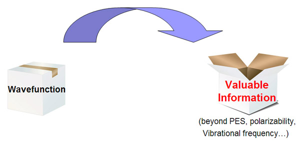

主流量子化学程序也可以给出体系的一些信息，如能量、稳定结构/过渡态结构、极化率、溶剂化能、NMR/IR/Raman/UV-Vis/ECD/VCD/ROA谱等，但这些信息不是基于直接对波函数分析而给出，故它们的计算一般不纳入波函数分析范畴。

波函数分析是一大类分析方法的集合。实际上，众所周知的前线轨道理论就是波函数分析方法的一种，它直接利用了前线轨道的波函数来分析化学反应性。量子化学界比较知名的两大类分析方法，即Natural bond orbital (NBO)分析和Atoms in molecules (AIM)分析，都是波函数分析方法当中重要的组成部分。各种形式的布居分析、电荷转移分析、电子定域性分析、键级分析、静电势分析等等，以及概念密度泛函理论的诸多内容也都属于波函数分析的范畴，这些后文将会具体列举。

波函数分析无疑是非常重要的。量子化学研究，特别是应用型的研究，决定研究价值的关键往往不在于计算过程，而在于分析得是否深入透彻，是否能给出足够的分析依据来支持自己的结论，是否能通过详细的分析发现新的问题并进而予以合理的解释。然而，波函数分析的普及程度目前相当令人沮丧，这在我国尤甚。从很多文章以及网络上的讨论中可以明显看出，很多量子化学工作者对波函数分析知之甚少，导致很多人研究体系时感觉没得可分析，从而导致文章深度、档次上不去。也有很多研究者则想要解释体系的一些特点或论证一些设想（比如想说明哪个键比较强、电子跃迁到激发态后电荷是如何转移的，想解释为什么反应容易发生在某个位点），想去分析可是又苦于没有手段。还有不少人，看过他人的文章，知道应该做什么方式的波函数分析，然而却找不到现成、好用的程序来实现。

之所以意义重大、研究者们迫切需求的波函数分析的普及程度非常低，应用价值受到严重制约，主要有两个方面的原因：  
(1)长期以来量化教材当中很少有书对波函数分析进行介绍，书籍内容的取材往往比较陈旧和保守，也限于大多数作者的知识水平，波函数分析方法方面往往顶多也就是介绍一下半个世纪前就提出的Mulliken布居，导致量子化学初学者们连接触波函数分析的机会都甚少。另外，虽然和波函数分析有关的文章数目甚巨，相关专著有不少，这个领域的研究从几十年前起就一直十分活跃，然而迄今国内外没有任何一本书籍对各种波函数分析方法进行全面而且深入浅出的介绍，资料过于零散，使得广大量化工作者学习波函数分析比较困难。  
(2)现有的波函数分析程序基本都存在一种或多种弊病，导致广大研究者们很难将波函数分析方法付诸于实际研究。这些弊病包括：1.收费、不开源 2.计算速度慢而且没有并行化 3.使用、操作十分复杂难懂，输入文件编写麻烦，输出信息冗杂，不人性化，也没有像样的教程，更不提供技术支持 4.不够灵活，无法通过调整设置满足特殊研究需求 5.功能单一，每个程序往往只能实现很少的功能，缺乏整合性 6.作者别有用心，程序不公开发布，只给合作者用。另外值得一提的是，虽然各种半经验/从头算/第一性原理程序自身往往都带有一定的波函数分析功能（特别是Mulliken布居分析几乎都有），但是支持的分析甚少，而且往往不好用。

Multiwfn程序着眼于解决上述第(2)类当中的全部问题。虽然Multiwfn的开发目的有许多，但最主要的目的，是提供给广大科研工作者一个免费开源，并且是功能非常全面强大、使用极为方便、特别容易上手、计算速度尽可能快、十分灵活的波函数分析程序。Multiwfn程序从2009年11月发布的1.0版开始一直不断开发至今，目前已经很成熟，已达到了预期目标，给波函数分析的普及和在实际研究中的应用扫除了重大障碍。如今Multiwfn的用户已经遍及世界各地，除我国外还包括美国、墨西哥、欧洲各国、俄罗斯、印度、伊朗、日本等超过50个国家，已经被超过3000篇高水平SCI研究文章以及书籍所引用，其中有不少发表在Science、Nature、JACS、Angew、PNAS等顶尖刊物上。Multiwfn已经取得中华人民共和国计算机软件著作权登记，登记号：2016SR010661。

Multiwfn的手册编写十分详尽，费尽心血写的600多页的手册中不仅介绍了程序的具体使用，还将程序各种功能涉及到的所有的理论进行了介绍，还包含了一百多个实际应用例子。结合笔者以往陆续在网上发布的一系列介绍各种波函数分析方法的帖子，其实已经解决了不少上述第(1)类问题。笔者日后将专门撰写名为《量子化学波函数分析--原理与实践》的书来彻底解决这类问题，其中将对各种主流的波函数分析方法进行全面系统的讲解，尽可能压低阅读的门槛，同时结合Multiwfn等程序的具体操作步骤给出研究实例，使读者明白波函数分析方法都有哪些、原理是什么、能解决什么问题、在实际研究中如何具体使用。想必此书出版后将会对波函数分析方法在我国的推广有重大的意义。

## 2 Multiwfn的主要亮点

Multiwfn相对于其它种类繁多的波函数分析程序主要有以下几大亮点：

(1) 功能非常全面。Multiwfn是功能十分全面强大的波函数分析程序，它将各种波函数分析方法高度、有机地整合到了一起。除了几个和NBO有关的分析外，几乎所有最重要的波函数分析方法都可以仅靠Multiwfn一个程序来完成。Multiwfn的推出已经使得好几十个波函数分析程序（不少还是收费的）彻底失去了存在价值。同时Multiwfn的许多功能都是独一无二的，无法靠任何其它现有程序实现。

(2) 非常易于使用。Multiwfn程序是交互式程序，界面设计得十分周到并且高度智能化，用户完全不需要像使用大多数量子化学程序那样需要编写复杂的输入文件（关键词还容易忘，老得查手册很麻烦），而只要仔细按照屏幕提示一步步进行就行了，使用非常方便。大多数分析只需要敲几个键就能轻松完成。另外，Multiwfn的输出的信息简明易懂，不会输出一大堆只有内行甚至开发者才能搞明白的信息。Multiwfn主页上还提供了非常丰富的资源，手册也编纂得极尽周到详细，可以帮助初学者很快入门。

(3) 高效。Multiwfn的开发过程特别注重提高运算效率以及降低内存的消耗。并且几乎所有运算量大的部分都用OpenMP技术进行了并行化。对于计算较为耗时的波函数分析，Multiwfn的运算速度往往高于其它功能类似的程序一个甚至两个数量级。

(4) 结果可直接可视化。对于需要可视化分析的波函数分析方法，Multiwfn会自动调用DISLIN图形库直接将结果绘制成图像，这使分析过程大大简化，这对于实空间函数的分析尤为重要，并且很多绘图设定在Multiwfn中都允许由用户自行调节。而大多数量子化学程序都做不到这一点，用户往往得把数据进行处理后导入到第三方可视化程序里才能观看，特别耗时、繁琐。Multiwfn生成的图像都可以直接导出到图像文件，支持的格式丰富，包括ps、eps、png、pdf、wmf、gif、tiff、bmp。

## 3 Multiwfn的基本特征和使用方法简介

**初学者使用Multiwfn之前务必先阅读一遍《Multiwfn入门tips》（**[**http://sobereva.com/167**](http://sobereva.com/167)**）**，其中对Multiwfn的基本信息和基本使用方法进行了完整的概括，本文下面只给出一些关键性的信息。

Multiwfn的主页是[http://sobereva.com](http://sobereva.com/multiwfn)[/multiwfn](http://sobereva.com/multiwfn)，所有Multiwfn版本的源程序、编译好的可执行文件和手册pdf文档皆可从此网站免费下载，下载不需要注册或申请。可执行文件的压缩包很小巧，下载、传播都很便利。

Multiwfn是跨平台的程序，Windows版Multiwfn支持从WinXP到Win10的各个版本。程序不需要安装，只要解压后即可直接使用。源代码可在Intel Visual Fortran下顺利编译。  
Multiwfn也支持各种主流Linux发行版和MacOS。使用前需要按照手册对系统进行配置，并且可能需要自行补全所需的库文件。Linux和MacOS版Multiwfn源代码可以在ifort>=12.0版下顺利编译（gfortran编译器无法通过）。

Multiwfn的大部分功能是通过载入量子化学程序输出的波函数文件来进行波函数分析。支持的波函数文件的格式丰富，包括：  
(1) PROAIM波函数文件（.wfn）  
(2) 扩展的波函数文件（.wfx）  
(3) 格式化的Gaussian检查点文件（.fch）  
(4) Molden输入文件（.molden）  
(5) GAMESS-US和Firefly输出文件（.gms）  
由于Multiwfn支持的波函数文件格式丰富，它们又可以被各种主流量子化学程序所产生，因此Multiwfn具有很好的通用性。另外，Multiwfn还支持其它一些格式用于特殊类型的分析。例如如果所用的分析方法只依赖于原子坐标，那么可以使用通用的记录坐标信息的格式.xyz、.pdb和.mol；对于绘制NBO、NLMO、NHO、NAO等NBO程序产生的各种类型的轨道，可以用NBO程序输出的NBO plot文件（.31~.40）；对于格点数据分析处理和可视化、盆分析等目的，可以用计算化学领域常用的格点数据文件格式.cub或Dmol3的.grd文件作为输入。以上这些格式的介绍、产生方法详见《详谈Multiwfn支持的输入文件类型、产生方法以及相互转换》（<http://sobereva.com/379>）。

Multiwfn的所有操作都是交互式的，大部分功能只要按照屏幕上的提示一步步进行即可，要输入什么在屏幕上都会看到明确的说明。遇到问题时应先参阅手册对功能的介绍，以及手册中相关的例子，并举一反三。手册的内容超级详细，十分简单易懂，查阅很方便，章节结构在《Multiwfn入门tips》里有介绍。值得一提的是，Multiwfn的手册绝不仅仅是一本手册，它在很大程度上也是一本波函数分析书，把里面的原理介绍都搞懂，把例子都做一遍并且仔细领会，在波函数分析上就有相当的水准了。

Multiwfn也可以方便地通过重定向方式以命令行模式来运行，也可以直接编写shell脚本来实现Multiwfn的批处理。方法在手册附录里有具体介绍。

## 4 Multiwfn的基本功能

### 4.0 Multiwfn支持的实空间函数

Multiwfn的众多功能都与实空间函数密切相关，实空间函数在这里指分布在三维空间中的标量函数，它们在波函数分析中有重要价值，所以在介绍Multiwfn的功能前先将Multiwfn支持的实空间函数列举一下。如果对它们不熟悉，可以参看手册2.6节的简要介绍。Multiwfn支持计算几乎所有最重要的实空间函数，包括：  
(1)电子密度  
(2)电子密度的梯度  
(3)电子密度的拉普拉斯函数  
(4)轨道波函数。轨道可以是正则分子轨道、定域化轨道、自然轨道、NTO、NBO、NHO、NAO等，取决于输入文件类型  
(5)电子自旋密度或自旋极化参数  
(6)电子的哈密顿动能密度K(r)  
(7)电子的拉格朗日动能密度G(r)  
(8)由原子核产生的静电势。如果用.chg文件（记录了原子电荷数值）作为输入文件，则对应的是原子电荷产生的静电势  
(9)电子定域化函数(Electron localization function, ELF)。包括Becke和Tsirelson各自提出的形式。开壳层体系的Becke的ELF所用的具体形式是由笔者导出的，见《电子定域化函数的含义与函数形式》（物理化学学报,27,2786-2792）  
(10)定域化轨道定位函数(Localized orbital locator,LOL)。包括Becke和Tsirelson各自提出的形式。关于ELF、LOL和电子密度拉普拉斯函数的简介可参见《电子定域性的图形分析》（<http://sobereva.com/63>）  
(11)局部信息熵  
(12)总静电势(ESP)  
(13)约化密度梯度(RDG)  
(14)Promolecular近似下的RDG  
(15)Sign(lambda2)*rho（电子密度Hessian矩阵第二大本征值的符号乘以电子密度）  
(16)Promolecular近似下的Sign(lambda2)*rho  
(17)电子的交换穴、相关穴、相关因子  
(18)平均局部离子化能(ALIE)  
(19)源函数(Source function)  
(20)电子离域范围函数(EDR)  
(21)轨道重叠距离函数D(r)  
(22)独立梯度模型(IGM）的δg函数

Multiwfn还支持很多其它的实空间函数，请参阅手册2.7节的介绍，共计100多个。比如Weizsacker泛函、局部温度、平均局部静电势、形状函数（Shape function）、势能密度、能量密度、键的金属性（Bond metallicity）、近似形式的DFT线性响应核、电子密度椭率、Fisher信息密度、位阻能密度、Pauli势、相空间定义的Fisher信息密度（PS-FID）、SEDD、DORI、电子动量密度、电/磁偶极矩密度、局部电子相关函数等等。Multiwfn还可以计算大量LDA和GGA级别的DFT交换相关势以及交换相关能密度（交换相关泛函的被积函数）。包括LSDA交换、B88交换、PBE交换+相关、PW91交换+相关、VWN5相关、P86相关、LYP相关、B97交换相关、HCTH407交换相关。

出于灵活性考虑，Multiwfn提供了一个自定义函数，用户只要在程序源代码的userfunc子程序里面简单地填上代码然后编译，就可以让Multiwfn直接分析和绘制用户自行定义的实空间函数。

下面将Multiwfn的比较主要的功能依次进行简要说明。限于篇幅，有大量功能、选项无法在此一一提及。

### 4.1 观看分子结构并绘制轨道

载入含有分子坐标的文件（pdb、xyz等），在Multiwfn的主功能0里就能观看分子结构。如果载入的文件包含波函数信息（wfn/wfx/fch/molden等），还可以观看轨道等值面。如果载入的是格点数据文件（.cub或Dmol3的.grd文件），则可以直接观看格点数据的等值面。

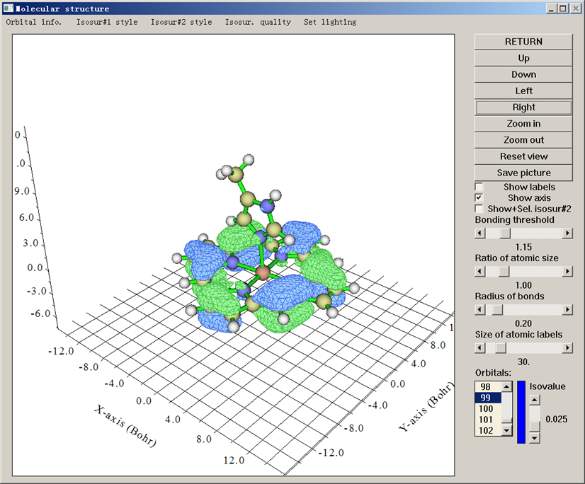

特别值得一提的是，Multiwfn显示轨道等值面的速度飞快，对大体系甩GaussView几条街。而且观看轨道特别方便，想看哪个轨道直接在列表里一点就出现，调整等值面对应的数值（isovalue）只需要直接拉动滑条，远比GaussView省事。Multiwfn还能同时显示两个轨道，分析轨道相互重叠问题的时候很有用。

Multiwfn可以方便地观看NBO程序产生的各种轨道，包括NBO（自然键轨道）、NHO（自然杂化轨道）、NAO（自然原子轨道）、NLMO（自然定域化分子轨道），以及前头带P的类型，如PNBO（初自然键轨道）等，详见《使用Multiwfn绘制NBO及相关轨道》（<http://sobereva.com/134>）。而其它能观看这些轨道的程序，如NBOView、Chemcraft都是收费的，并且功能和易用性上都不如Multiwfn。

等值面的显示方式支持：不透明表面、网格状表面、点状表面、不透明表面+网格状表面、透明表面。等值面和网格的颜色都可以任意设定。显示分子结构时的原子尺寸、是否成键的判断阈值、标签大小等参数也可以自由调节。

### 4.2 计算实空间函数在一个点、一条线、一个面上和一个空间区域内的数值并绘图

这几种功能是Multiwfn最初版本就加入的，也是Multiwfn最核心、最强大的功能之一。

在主功能1里，用户只要输入一个点的坐标就能立刻将所有支持的实空间函数在此处的数值，连同指定的函数的梯度、Hessian矩阵一起输出出来。而且这个点上的实空间函数值可以被分解成不同轨道的贡献。

在主功能3里，用户只要定义一条线的两个端点的坐标，就能迅速将指定的实空间函数在这条连线上的变化作出曲线图，并且还可以给出曲线上的极大极小点位置、特定函数值处的坐标位置。曲线的数据点也可以导出，供用户在第三方程序如Origin里直接作图。

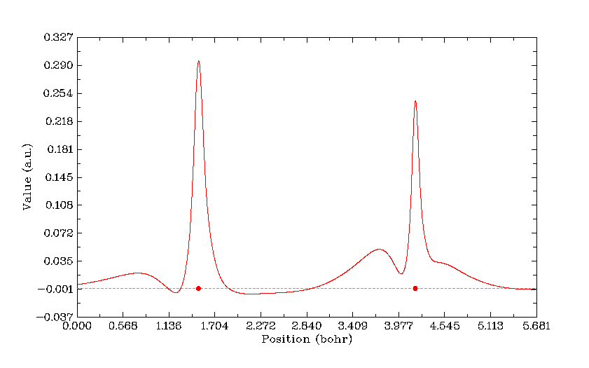

在主功能4里，用户可以对指定的函数在指定的面上作图。支持的图形种类丰富，包括填色图、等值线图、地形图（可以包含填色和投影效果）、梯度线图、向量场图。作图不仅特别方便、速度很快，而且效果很好，有丰富选项可以用于调节作图参数。还可以在图上直接画出分子范德华表面，显示出拓扑分析的临界点、拓扑路径、盆分界线。平面上的数据也可以导出，便于用户自行在Sigmaplot、matlab、surfer等程序里重新绘制。下面是几个Multiwfn直接绘制出的平面图的例子：

两个NBO轨道的等值线图，可以清楚地考察二者的重叠程度  
 

ClF3的静电势等值线图，实、虚线分别代表正、负值。蓝色粗线表示的是Bader定义的分子范德华表面（电子密度=0.001等值面）  
 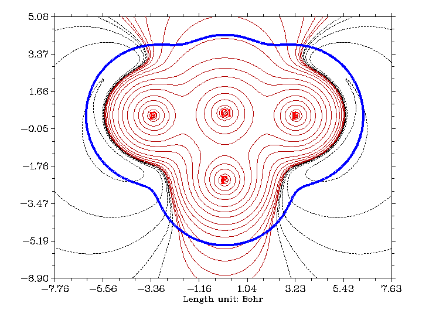

尿嘧啶的电子密度梯度场图  
 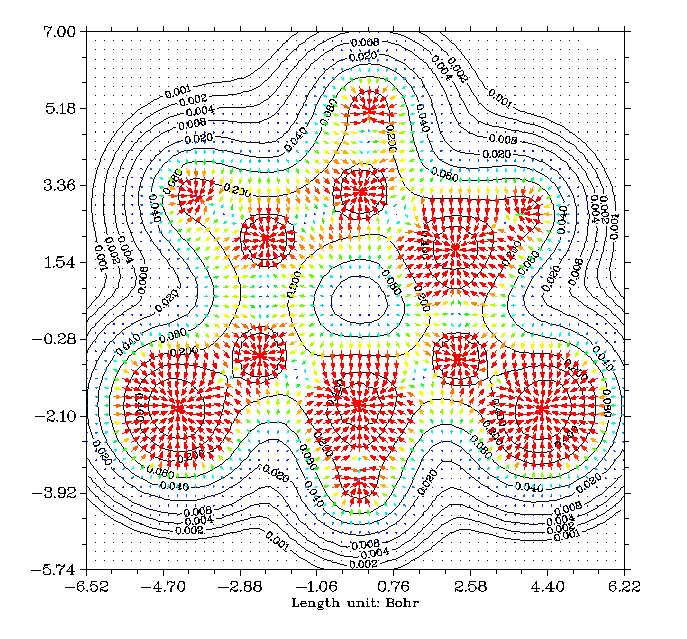

镁卟啉的电子密度等值线图+AIM临界点、键径和原子盆间面  
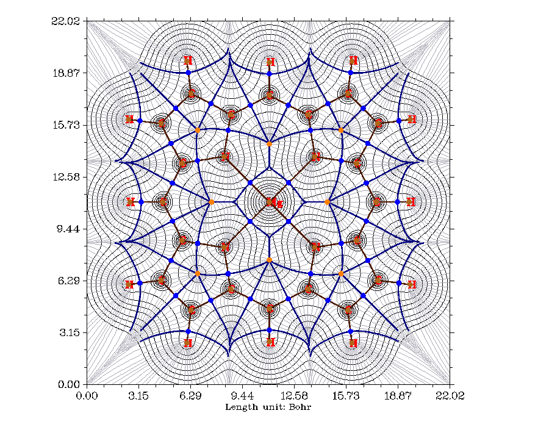

B13+团簇的LOL填色图  
 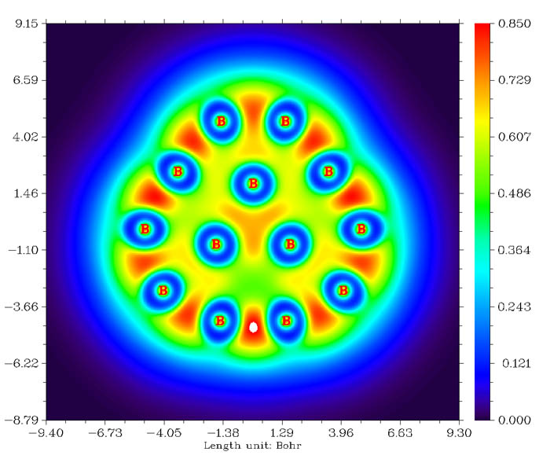

Li6团簇的ELF填色地形图+投影。（Multiwfn的Logo就是来自Li6的ELF填色图）  
 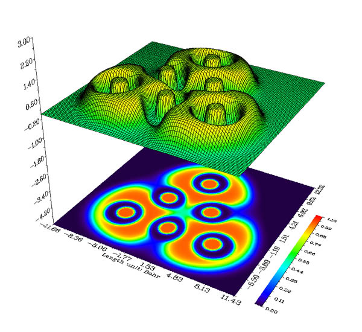

在主功能5里，可以计算指定实空间函数的格点数据，并且绘制等值面图。格点的定义非常灵活方便，计算速度也远胜具有相同功能的其它各种程序。格点数据既可以导出到文本文件也可以导出到Gaussian型cube文件中。也可以之后进入Multiwfn的其它功能对刚算完的格点数据进行进一步利用和操作。在主功能5里也可以计算指定一批数据点上的实空间函数，数据点坐标通过外部文本文件导入。

在计算直线、平面上以及空间区域内的实空间函数时，用户可以设定“自定义运算”操作，来让多个波函数文件对应的实空间函数相互运算。比如作密度差图，只需先载入整体的波函数文件，然后设定它与哪些片段的波函数文件相减，然后在计算密度的时候就会自动依次算它们的密度并做差值。因此用Multiwfn计算诸如Fukui函数、双描述符特别方便，详情可参见《使用Multiwfn作电子密度差图》（<http://sobereva.com/113>）。当然，不只是密度差，也不光只是减法运算，Multiwfn可以直接让任何支持的实空间函数对多个波函数文件进行加减乘除运算。另外，Multiwfn还可以直接得到promolecular属性和deformation属性。前者就是原子在自由状态属性的叠加，后者是指实际体系的属性与promolecular属性的差值。这里的属性是指任意一种实空间函数，如果选的是电子密度，deformation属性具体就是指电子变形密度，这对于分析原子形成分子时电子密度如何聚集、转移十分有用。

如果产生相同体系不同坐标下的一批波函数文件（如对应IRC过程的每个点），以批处理方式调用Multiwfn对它们依次产生图像，并结合做动画的程序，就可以得到描述电子结构变化的动态图像，对于分析反应过程内在机制很有帮助，详见《制作动画分析电子结构特征》（<http://sobereva.com/86>）、《通过键级曲线和ELF/LOL/RDG等值面动画研究化学反应过程》（<http://sobereva.com/200>）。

### 4.3 拓扑分析

在AIM分析中，通常要对电子密度进行拓扑分析，包括寻找各种临界点、产生拓扑路径。Multiwfn不仅可以对电子密度做拓扑分析，还可以对ELF、LOL、电子密度拉普拉斯函数等实空间函数也进行拓扑分析。搜索临界点和产生拓扑路径速度非常快，显著胜于其它有类似功能的程序。结果可以直接在图形界面里可视化（如下图所示），十分方便。还可以绘制出盆间分界面(interbasin surface)。每个临界点上各种实空间函数的数值都能直接得到。临界点和拓扑路径可以灵活地自行修改、导入导出。Multiwfn还提供了其它很多附加功能，例如测量工具来获得临界点/原子核间的几何参数、计算和绘制各种实空间函数沿着拓扑路径的变化、计算基于BCP处的信息熵定义的芳香性指数、计算环临界点位置上垂直于环平面的电子密度曲率以衡量芳香性。关于Multiwfn的拓扑分析功能的介绍具体可参见《使用Multiwfn做拓扑分析以及计算孤对电子角度》（<http://sobereva.com/108>）。

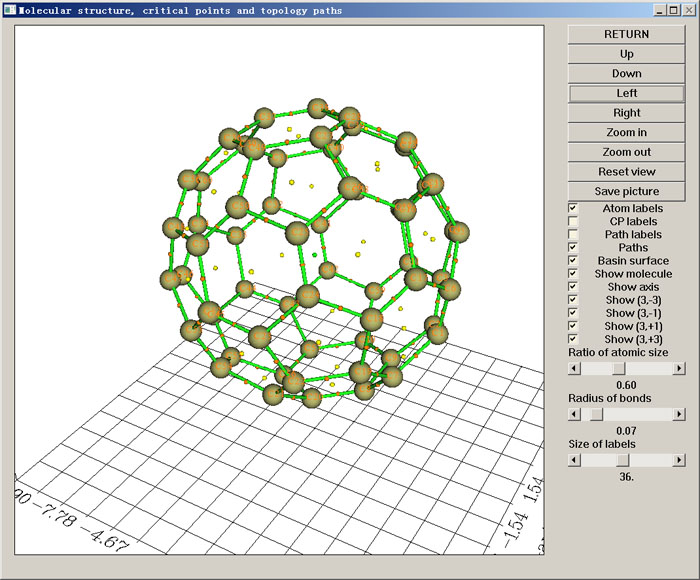

### 4.4 检查和修改波函数

Multiwfn提供了许多选项对波函数进行检查和修改。包括将当前波函数输出为新的wfn文件；输出GTF、基函数和轨道的信息；输出系数矩阵、重叠矩阵、密度矩阵、不同类型的积分矩阵；交换、设定GTF的信息（所属中心、系数、指数等）；设定轨道的占据数和轨道类型；平移或平移+复制体系（后者可以用来近似地将单胞波函数扩展为超胞波函数）；将某些原子从波函数信息中去除等。

对波函数进行修改后会直接影响实空间函数的计算结果，这对于一些特殊目的的分析十分有用，比如可以只考察某些原子、某些轨道（如pi轨道）上的电子产生的实空间函数。例如ELF-pi只考虑pi电子贡献的ELF，有人通过它考察芳香性，本人也通过ELF-pi对寡聚物导电性进行过研究（RSC Adv.,2013,3,25881）。类似这样的分析可以使用Multiwfn非常容易地实现。

### 4.5 布居分析与原子电荷计算

Multiwfn提供了丰富的布居分析与原子电荷计算功能，用于计算原子电荷或基函数/壳层上的电子占据数。支持的方法包括Hirshfeld布居、Hirshfeld-I布居、Voronoi变形密度布居(VDD)、Mulliken布居、Lowdin布居、修改的Mulliken布居（包括三种方法：SCPA、Stout-Politzer和Bickelhaupt）、Becke布居（包括经过原子偶极矩校正后的形式）、CHELPG和Merz-Kollmann(MK)拟合静电势电荷、CM5电荷、电负性均衡原理(EEM)电荷，以及本人提出的原子偶极矩校正的Hirshfeld方法(ADCH)。

Multiwfn中的Mulliken布居分析功能特别灵活，不仅可以得到基函数/壳层/原子上的电子布居数（开壳层体系会同时给出自旋布居），还可以得到原子间、基函数间的重叠布居以及它们自身的局域布居，并且结果还可以再进一步分解为每个轨道的贡献。程序还可以给出每种角动量对布居数的贡献。

虽然主流的量子化学程序如Gaussian也能计算CHELPG和MK电荷，但是Multiwfn在这两个功能的实现上更为灵活，用户可以任意设定拟合点的分布，还可以任意设定额外的拟合中心（为了准确描述分子间静电相互作用，有时必须引入额外的非原子中心的点电荷）。这个功能还可以基于跃迁密度来做，得到的叫做TrEsp (transition charge from electrostatic potential)电荷。

此功能还可以基于原子电荷计算任意两个给定的片段间的库仑相互作用能。如果用的原子电荷是TrEsp电荷，则得到的就是两个片段间的激子耦合能。

上述功能中ADCH方法是由笔者在J. Theor. Comput. Chem., **11**, 163 (2012) (<http://dx.doi.org/10.1142/S0219633612500113>)中提出的。笔者在《原子电荷计算方法的对比》（物理化学学报, **28**, 1-18 <http://www.whxb.pku.edu.cn/CN/abstract/abstract27818.shtml>）中对许多种计算原子电荷方法相比较，其中ADCH电荷展现出了非常优秀的性质，特别是能精确重现分子偶极矩，同时也有很好的静电势重现性。Multiwfn是唯一能实现ADCH方法的程序。

### 4.6 轨道成份分析

Multiwfn提供了多种方法进行轨道成份分析来得到各个原子轨道、壳层和原子对轨道产生的贡献，并可以灵活地定义片段。支持的方法包括Mulliken、Stout-Politzer、SCPA、NAOMO、Hirshfeld、Hirshfeld-I和Becke。笔者写的《分子轨道成分的计算》（物理化学学报,69,2393）是迄今第一个专门讨论轨道成份分析方法的文章，其中对这些方法（除Becke以外）的原理进行了介绍并通过实例做了对比分析。NAOMO和Hirshfeld方法做轨道成份分析也是在这篇文章里首次明确提出的，并且目前只有Multiwfn能够实现这两种方法（注：NAOMO分析需利用NBO程序的输出信息）。另外在《谈谈轨道成份的计算方法》（<http://sobereva.com/131>）当中也对这些方法进行了粗略介绍，并给出了在Multiwfn中操作的实例。

另外，Multiwfn还支持利用定域化轨道的轨道成份的Localized orbital bonding analysis (LOBA)方法考察原子或片段的氧化态，见Phys. Chem. Chem. Phys., 11, 11297 (2009)，这对研究配合物很有用，见《使用Multiwfn通过LOBA方法计算氧化态》（<http://sobereva.com/362>）。

### 4.7 键级分析

Multiwfn支持的键级的计算方法众多，包括：  
(1)Mayer键级。这是目前最常用的键级。  
(2)轨道占据扰动的Mayer键级。此功能用于分析各个分子轨道的电子对Mayer键级的影响（扰动），因此可以考察哪些轨道对键的强度影响比较显著。  
(3)Wiberg键级。此键级原始定义只能用于正交基，由于目前主流量化程序使用非正交基，Multiwfn会自动先做Lowdin正交化。在Multiwfn中Wiberg键级也可以基于NAO来计算，此时能够将Wiberg键级分解为原子轨道对的贡献，这对于考察原子轨道间相互作用对共价键的贡献非常有帮助。  
(4)多中心键级。这对于分析多中心键、芳香性极有用。Multiwfn最多支持到12中心，且可以自动搜索多中心键，还可以基于NAO轨道来计算。  
(5)Mulliken键级，也称Mulliken重叠布居数。Multiwfn可将它分解为轨道的贡献。虽然Mulliken键级与键的强度关系符合得不佳，但是其数值可以为负值，以此表现出反键特征。  
(6)模糊键级(Fuzzy bond order)。相当于模糊空间下计算的离域化指数。对于离子性不很强的键其结果和Mayer键级结果相仿佛，虽然计算会多耗时一些，但是对基组的敏感性显著降低。  
(7)Laplacian键级(Laplacian bond order, LBO)。这是笔者在J. Phys. Chem. A, **117**, 3100 (2013)中提出的，基于对成键区域（模糊重叠空间）内的电子密度Laplacian的负值区域积分来获得。LBO与键的强度有极好的对应关系，并且能清楚地反映出键的极性。

对于上述部分键级，Multiwfn还可以定义片段，来直接得到两个片段的原子间的键级总和。

### 4.8 绘制态密度图

虽然态密度(Density-of-states, DOS)一般是对于周期性体系来讨论的，但是对于分子体系，将能级进行适当地展宽得到态密度，对于讨论电子结构是很有益的。Multiwfn可以产生Total DOS (TDOS)、Partial (PDOS)、Overlap population DOS (OPDOS)。通过TDOS可以直观地考察轨道在各个区域能量分布状况，通过PDOS图可以直观地考察指定的片段对各个能量区域内的轨道的贡献，而借住OPDOS图可以直观地了解不同能量区域的轨道对两个片段间的结合能力（以Mulliken键级来表征）产生的影响。

对于PDOS和OPDOS，Multiwfn提供了十分灵活方便的界面用于定义片段。片段可以由基函数、壳层、原子以任意方式组合而成。片段可以一次性最多定义10个。Multiwfn也提供了许多选项用于用户自行调节作图设定，诸如展宽函数、半高宽(FWHM)等。

下面是Multiwfn产生的二茂铁的TDOS+PDOS+OPDOS图。其中定义了三个片段。从图中可以一目了然地看到碳的px、py和s轨道主要贡献的是低能态区域，-0.25 a.u.附近能态主要的贡献者是Fe和碳的pz轨道，而HOMO则只由铁所贡献。OPDOS对应的是铁与碳的pz轨道的相互作用，从其曲线上可以看到它对于二茂铁的稳定性很重要，因为在占据轨道区域内OPDOS没有负值而有明显的正值，表现了铁与碳之间的成键作用。在虚轨道部分，OPDOS全为明显的负值，体现反键特征，这和轨道图形上看到的特征是一致的。

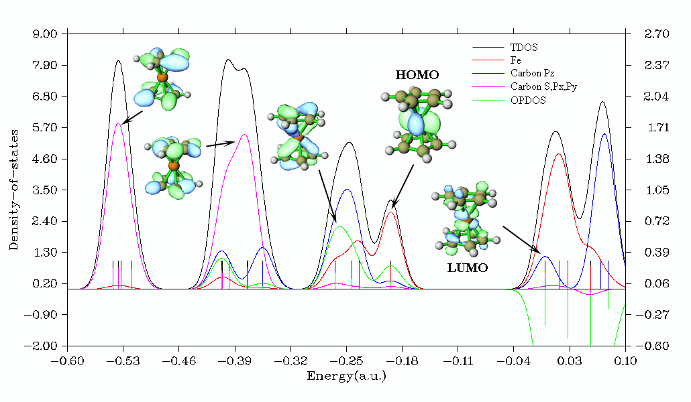

另外Multiwfn还可以研究Local DOS (LDOS)，即通过绘制曲线图考察三维空间中某个点，或者绘制填色图考察三维空间中某条线上不同的点对于DOS的献，由此可以理论模拟扫描隧道光谱(STS)。

### 4.9 绘制光谱图

虽然绘制光谱图不属于波函数分析，但是是理论化学研究中常涉及到的，所以Multiwfn也具备这样的功能，可以绘制IR、Raman（包括普通和预共振）、UV-Vis、ECD（电子圆二色谱）、VCD（振动圆二色谱）、ROA（拉曼光学活性）谱图。激发能和强度数据可以从Gaussian、ORCA或Grimme的sTDA、xtb程序的输出文件中直接读取，也可以通过文本文件导入。谐振和非谐振的振动谱，以及考虑和不考虑旋轨耦合(SOC)效应的电子光谱都可以绘制。作图的可调参数十分丰富（诸如可自行选择展宽函数、可独立设定每个跃迁的半高宽等），足以满足专业用户的需求，比Swizard、GaussSum等程序好用、强大得多。而且Multiwfn还能搜索出峰的精确位置、将峰分解为不同跃迁的独立贡献以便于指认峰的内在特征、绘制构象权重平均的光谱、同时绘制多个体系的光谱，这些是绝大多数绘制光谱图的程序都不具备的功能。参见《使用Multiwfn绘制红外、拉曼、UV-Vis、ECD、VCD和ROA光谱图》（<http://sobereva.com/224>）、《使用Multiwfn绘制构象权重平均的光谱》（<http://sobereva.com/383>）。下图是Multiwfn绘制的ECD谱图

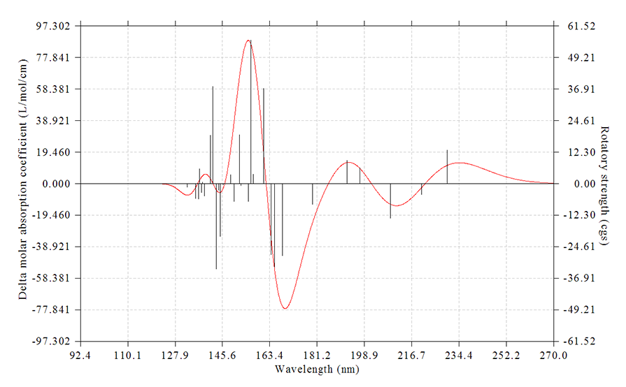

下图是Multiwfn结合Origin绘制的乙酸的UV-Vis光谱，几种主要的跃迁对光谱产生的独立贡献以不同颜色显示

### 4.10 定量分子表面分析

这里的“分子表面”是指电子密度等值面，比如0.001 e/bohr^3的表面常被用来作为分子的范德华表面，这是最初由Bader定义的。“定量分析”就是指的在这样的表面上，对映射到上面的实空间函数进行定量的分析，诸如统计平均值、方差、不同数值范围所占的面积大小，并且得到所映射的函数在分子表面上的极小值和极大值。虽然原则上各种实空间函数都可以作为映射到分子表面的函数，但通常只将静电势和平均局部离子化能(ALIE)映射上去。对静电势的定量分子表面分析对于预测分子间相互作用、通过QSPR（定量结构属性关系）方式预测分子凝聚态性质十分有用，而对ALIE的分析则是一种很重要且很成功的预测亲电反应位点的方法。例如下图是Multiwfn产生的ALIE在苯酚分子表面上的极值点分布，极小点（蓝球）清楚地表现了亲电位点是在邻对位。

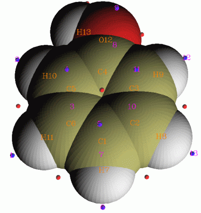

Multiwfn的定量分子表面分析功能极为灵活、强大，不仅限于在电子密度等值面上分析静电势、平均局部离子化能等函数，还可以在任意实空间函数等值面上对任意实空间函数进行定量分析，比如可以在电子密度等值面上对福井函数的分布进行分析来讨论反应位点。另外还具有独创的局部分子表面分析功能，这种方法可以分析整个分子表面中的局部区域，可以有效地用于了解体系局部区域特点，比如讨论体系内某个片段、某个原子对应的表面上的静电势。Multiwfn的这个模块还能做Hirshfeld表面分析、绘制指纹图形，这对于研究分子间，特别是在分子晶体环境下的相互作用很有帮助。

Multiwfn的定量分子表面分析模块的部分介绍和一些应用实例可参见《使用Multiwfn的定量分子表面分析功能预测反应位点、分析分子间相互作用》（<http://sobereva.com/159>），算法细节见J. Mol. Graph. Model., 38, 314 (2012)。

### 4.11 处理格点数据

Multiwfn的处理格点数据的功能源自于笔者早前开发的GsGrid程序，但它的开发早已终止，因为GsGrid的全部功能已被整合进了Multiwfn，同时做了不少扩充和完善。使用Multiwfn的这个功能前需要先载入cube或Dmol3的.grd文件，它们记录了格点数据；也可以先用Multiwfn自身计算格点数据的功能产生格点数据，然后进入这个功能直接对其进行处理。

Multiwfn的处理格点数据功能包含众多子功能：  
(1)观看格点数据等值面。  
(2)将当前格点数据导出为cube文件。  
(3)将一些格点的坐标和数值导出到文本文件。决定格点范围的标准可以为：(a)所有格点 (b)接近某个平面的格点（特定的X/Y/Z平面或通过三个点来定义） (c)数值在指定范围内的格点。  
(4)设定远离某些原子的格点的数值，可以由此屏蔽不感兴趣的区域的等值面；设定远离两个片段间重叠区域的格点的数值，可以由此只保留重叠区域的等值面，对于RDG方法靠等值面展现弱相互作用区域比较有用，见手册4.13.4节的例子。  
(5)对当前格点数据进行运算（例如取绝对值、求对数、求幂），或者从cube/grd文件中载入另一套格点数据与当前格点数据相运算（相互加减乘除、求二者的平方和、取平均等等），由此产生新的格点数据。  
(6)从cube文件中载入另一套格点数据并映射到当前格点数据中具有指定数值的格点上，并将坐标和数值输出为文本文件。  
(7)对格点数据范围进行scale，以使得格点数据的范围落在指定区间内。  
(8)对指定数值范围或空间范围的格点数据进行统计，给出最大/最小值、平均值、均方根、总和、积分值、标准偏差、正值/负值/整体区域内数值的重心。  
(9)绘制X/Y/Z方向的格点数据的积分曲线。如果当前的格点数据是片段密度差，那么这积分曲线也叫电荷转移曲线，对于分析电荷转移很有益，如JACS,130,1048。

### 4.12 自适应自然密度划分(Adaptive natural density partitioning, AdNDP)

AdNDP在某种意义上是对NBO方法的扩展，可以得到“半定域化”轨道，它既不像分子轨道那样一般会离域到整体，又不像NBO或传统的定域化轨道那样只分布在1~3个原子上，而是可以显示出局部区域的离域特征，特别适合分析、展现多中心键，在研究团簇芳香性上已有大量应用。

Multiwfn是非常强大的AdNDP分析程序。虽然AdNDP方法本身有一些人为性而不得不由用户来干预AdNDP轨道的搜索，但是Multiwfn精心设计的界面已经将这个过程尽可能便利化，并且可以直接观看AdNDP轨道图形，还能计算出AdNDP轨道能量。例如下图是菲的边缘的苯环上的三个六中心AdNDP轨道，展现了两侧的苯环的芳香性。

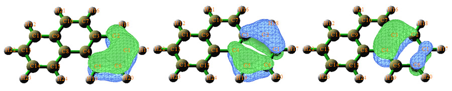

关于AdNDP方法在理论方面的介绍和讨论，以及在Multiwfn中的实际操作，在《使用AdNDP方法以及ELF/LOL、多中心键级研究多中心键》（<http://sobereva.com/138>）当中有详述。

### 4.13 模糊空间分析

对体系中原子所属空间的划分有两类，一类是离散式划分，即原子间有明确的边界，例如AIM的原子盆就是典型的一种；另一类是模糊式划分，原子间没有明确的边界，而用平滑的权重函数来表示原子空间，越接近原子核则此原子的权重越大。模糊空间定义有很多，如Becke、Hirshfeld和Hirshfeld-I方法。在模糊空间下分析的好处之一是积分原子空间来得到原子的性质比较容易，这是由于边界平滑所以容易积分得比较准确。Multiwfn的模糊空间分析就是用来计算各个模糊原子空间里的性质，来展现原子在分子中的特征。具体可以做以下分析：  
(1)计算模糊空间以及模糊重叠空间内的任意实空间函数的积分值（模糊重叠空间是指两个模糊原子空间之间重叠的空间）  
(2)计算模糊空间内的电多极矩（即得到原子单极矩、原子偶极矩、原子四极矩和原子八极矩），以研究原子附近电子分布特征  
(3)计算模糊空间内各个分子轨道间的重叠积分矩阵（也叫Atomic overlap matrix）  
(4)基于模糊空间计算定域化指数(Localization index)、离域化指数(Delocalization index)和简缩线性响应核(condensed linear response kernel)  
(5)计算对位离域化指数(Para-delocalization index, PDI)、芳香波动指数(Aromatic fluctuation index, FLU)和对位线性响应指数(Para linear response index, PLR)用于研究芳香性  
(6)计算多中心离域化指数用于研究多中心键

### 4.14 电荷分解分析(Charge decomposition analysis, CDA)

CDA用来将体系内两个片段之间的电荷转移进行分解，可以获知各个分子轨道（或自然轨道）的形成导致电荷在片段间以什么方向转移、转移的量是多少，而非仅仅只得到一个整体转移量。CDA对于分析金属-配体间的电荷转移极为有用，也同样可以分析共价键相连的片段间的电荷转移。Multiwfn的CDA模块还可以给出各个片段轨道在复合物轨道中所占成分、给出不同片段轨道对儿对复合物轨道d,b,r项的贡献、输出片段轨道之间的重叠矩阵。Multiwfn的CDA功能可以定义无数个片段，而且支持后HF波函数，这是其它支持CDA的程序都难以做到的。

Multiwfn还支持扩展的CDA (Extended CDA)。CDA没有明确将电荷转移和电荷极化分开考虑，而ECDA则将它们分离开，排除了电荷极化效应对计算电荷转移量的影响。

Multiwfn的CDA模块不仅能做CDA分析，还能绘制轨道相互作用图。下图中是COBH3中CO（片段1）与BH3（片段2）之间的轨道相互作用图，反映了片段的分子轨道如何构成复合物的分子轨道

关于CDA的详细讨论以及在Multiwfn中的使用，见《使用Multiwfn做电荷分解分析(CDA)、绘制轨道相互作用图》（<http://sobereva.com/166>）

### 4.15 盆分析

Multiwfn的盆分析功能极其灵活、方便、强大和高效，所用的数值算法是基于立方格点的算法（见J. Phys.: Condens. Matter,21,084204）。不仅可以对电子密度寻找吸引子（也叫(3,-3)临界点，即局部极大点）并产生相对应的盆，还可以对所有其它的实空间函数寻找吸引子并产生盆，诸如ELF、LOL、静电势，甚至于密度差等。每个盆都是体系中的一个局部空间，比如电子密度的盆对应于AIM原子空间，而ELF和LOL的每个盆则对应于一个电子结构的特征区域，如共价键区域、孤对电子区域、内核区域等。在产生盆之后，就可以直接观看吸引子的位置和盆的范围，例如下面的绿色区域代表了HCN中H的电子密度的盆：

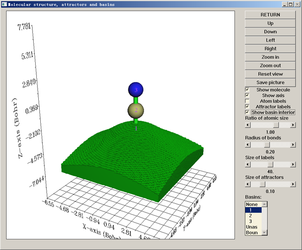

Multiwfn可以对各种函数的盆进行以下分析：  
(1)在盆内积分任意实空间函数。  
(2)计算盆内的电单极矩、偶极矩和四极矩。  
(3)计算定域化和离域化指数并输出盆区域内的轨道间重叠矩阵。  
(4)计算原子对盆布居数的贡献，例如考察成键的两个原子对其ELF键盆布居数的贡献以衡量极性。

Multiwfn产生盆所用的数值算法是基于立方格点的Near-grid算法，此算法实现方便，且适用于各种实空间函数。对于AIM盆的积分，单纯基于立方格点积分精度不理想。为了进一步增加精度，Multiwfn中引入了本人提出的立方格点与原子中心格点混合积分方法，并且引入额外步骤使边界格点的归属更为精确。

Multiwfn出于灵活、便利考虑，还提供其它一些选项，诸如测量吸引子/原子核间的几何参数、将盆导出到.cub文件并将吸引子导出到.pdb文件便于用外部程序作图。

关于盆分析的基本理论、算法和Multiwfn中的分析实例见《使用Multiwfn做电子密度、ELF、静电势、密度差等函数的盆分析》（<http://sobereva.com/179>）。

### 4.16 电子激发分析

Multiwfn具备十分强大、全面的电子激发分析功能，可以把电子激发相关问题分析得淋漓尽致，其中很多方法都是Multiwfn独家的。这部分功能在《Multiwfn支持的电子激发分析方法一览》（<http://sobereva.com/437>）当中做了非常全面的介绍，研究中涉及到电子激发计算的人请务必阅读，你一定会发现Multiwfn在你的这方面研究是绝对不可缺少的利器！

### 4.17 轨道定域化分析

分子轨道有高度离域性，与化学键没有直接对应关系。而将分子轨道做轨道定域化后，所得到的定域化分子轨道(LMO)就能够与孤对电子、化学键直接联系起来，讨论许多化学上感兴趣的问题。Multiwfn支持Pipek-Mezey（基于Mulliken或Lowdin布居）以及Foster-Boys方法做轨道定域化。使用例子见《Multiwfn的轨道定域化功能的使用以及与NBO、AdNDP分析的对比》（<http://sobereva.com/380>）。

### 4.18 弱相互作用的图形化分析

Multiwfn支持以下弱相互作用的图形化分析方法，对于考察弱相互作用极为有用  
(1)2010年杨伟涛课题组提出RDG（也叫NCI）方法。此方法在提出后迅速流行，已经成为研究弱相互作用最常用的方法之一，详见《使用Multiwfn图形化研究弱相互作用》（<http://sobereva.com/68>）。  
(2)在动态环境下（如分子动力学模拟）做平均RDG（aRDG）分析。这可以很好地、很直观地考察实际环境下分子间在什么区域发生何种弱相互作用。例如可以考察苯-水混合体系中苯与水的弱相互作用。详见《使用Multiwfn研究分子动力学中的弱相互作用》（<http://sobereva.com/186>）  
(3)DORI分析方法，这可以将体系中弱相互作用和强相互作用区域同时展现出来。详见《使用DORI函数同时考察共价和非共价相互作用》（<http://sobereva.com/367>）  
(4)独立梯度模型（IGM）。此方法可以任意设定片段，将片段间相互作用和片段内相互作用独立展现出来，互不影响。还可以将原子和原子对对弱相互作用的贡献定量化表达出来。详见《通过独立梯度模性(IGM)考察分子间弱相互作用》（<http://sobereva.com/407>）。

### 4.19 其它实用功能

以上介绍的功能属于Multiwfn的主功能。在Multiwfn当中还包括很多其它类型的分析，以及计算化学中会用到的实用功能，在此选择其中一部分进行简单提及

·同时计算两个实空间函数的格点数据并绘制它们之间的散点图。  
·将fch文件里的密度矩阵转化为对应的自然轨道，轨道还可以导出，这对于很多场合的计算和分析提供了很大便利。详见《在Multiwfn中基于fch产生自然轨道的方法与激发态波函数、自旋自然轨道分析实例》（<http://sobereva.com/403>）。  
·基于蒙特卡罗方法计算分子范德华体积。见《谈谈分子体积的计算》（<http://sobereva.com/102>）  
·对任意实空间函数在整个空间范围内进行积分。积分方法用的是Becke提出的对DFT交换相关泛函进行积分的方法，积分可以达到相当高的精度。结合Multiwfn提供的自定义函数，此功能十分灵活有用。比如自己提出一个新的相关泛函，那么在源代码的自定义函数中填上自己的泛函的公式（计算密度、密度的梯度、动能密度在Multiwfn里都有现成的函数可以直接调用），利用此功能对自定义函数进行积分就能得到这个相关泛函所对应的相关能。  
·计算非限制性计算的alpha和beta轨道间的重叠积分，这对于研究自旋极化程度是比较有用的。  
·计算两个轨道间的质心距离以及重叠程度，对于讨论电子激发等牵扯到轨道对的问题十分有用，见《使用Multiwfn考察轨道间重叠程度和质心距离》（<http://sobereva.com/371>）。  
·监视Gaussian的SCF收敛过程并将收敛过程绘图。这有助于了解收敛状态，判断是否应该停掉当前任务并重设关键词重新计算。  
·产生带有片段组合初猜信息（由体系各个片段的波函数组成出的波函数）的Gaussian输入文件。这对于产生高质量初猜波函数、计算自旋极化单重态体系很有用。基于此还可以进行比较简单的能量分解，可以将“极化能”与“静电能+交换能”二者从总相互作用能中分离开。  
·将片段的波函数文件组合为体系的.wfn文件。利用这样的.wfn文件，可以考察片段在相互作用之前ELF、LOL等函数的特征，也可以考察相互作用前后这些函数的变化，有助于讨论片段间相互作用引起的电子结构变化。  
·计算HOMA和Bird芳香性指数。HOMA是非常流行的基于结构的度量芳香性的指标。  
·计算LOLIPOP，详见Chem.Commun.,48,9239。这是一种基于对芳香环上方的LOL-pi值进行积分来衡量芳香体系pi-pi堆积能力的指标。  
·计算分子间轨道重叠积分。这个积分与分子间电荷转移能力密切相关。并且Multiwfn还能够显示二聚体内不同区域对分子间重叠积分的贡献，这有助于指导设计高导电性的分子晶体。详见《分子间轨道重叠的图形显示和计算》（<http://sobereva.com/163>）。  
·Yoshizawa电子转移路径分析，此功能基于Yoshizawa公式分析电子在平面共轭体系中可能的转移路径。原理见Acc. Chem. Res., 45, 1612 (2012)。  
·自动检测出pi轨道，批量设定它们或其它轨道的占据数。占据数设为0相当于此轨道在计算中被忽略，由此可以在各种Multiwfn的分析中去除sigma电子或pi电子的贡献，对于计算ELF-pi、ELF-sigma等指标尤为方便。  
·将函数分布拟合为原子的数值。这与MK拟合静电势方法很相似，但是被拟合的函数可以是任何其它实空间函数。  
·辅助计算非平面体系的NICS_ZZ。虽然NICS_ZZ对于平面体系的计算很容易，但是对于非平面体系不易得到要计算的点的坐标，也难以得到垂直于环平面方向上的磁屏蔽值的分量，而Multiwfn的这个功能可以帮助解决这些问题。详见《利用Multiwfn计算倾斜、扭曲环的NICS_ZZ 》（<http://sobereva.com/261>）。  
·计算等化学屏蔽表面（ICSS）。这在某种程度上可以视为是NICS的等值面，对于判断哪些区域内外磁场存在屏蔽、去屏蔽效应，并由此考察体系的芳香性极为有用。详见《通过Multiwfn绘制等化学屏蔽表面(ICSS)研究芳香性》（<http://sobereva.com/216>）。  
·计算并绘制实空间函数的径向分布函数。  
·在希尔伯特空间下计算原子偶极矩和键偶极矩。  
·产生一批轨道的轨道波函数格点数据，便于在第三方程序中观看轨道图形。  
·分析不同波函数当中的轨道对应性。例如对于一个分子，可以方便地考察MP2下的自然轨道是如何由HF下的分子轨道组成的。也可以研究两个结构相似的分子的轨道间是如何转换的。  
·计算体系中原子间连接关系指数和原子的配位数。  
·计算指定的一批原子的几何中心、质心、转动惯量、主轴、回转半径等基于几何结构的信息，以及计算分子的直径、分子的长宽高。  
·计算体系中各种键的平均长度，这对于分析团簇特征很有用（例如JCP,111,1890）。  
·计算轨道间的电偶极矩、磁偶极矩、速度、动能、重叠积分。  
·计算各种实空间函数的中心和第一、第二极矩和回转半径。对于电子密度函数，第一、第二极矩就是电子偶极矩和四极矩张量的负值。  
·将当前体系结构或者波函数导出为.xyz、.pdb、.wfn、.wfx、.molden、.fch、.47（独立版NBO的输入文件）格式。还可以根据当前结构对主流量化程序产生基本的输入文件，包括Gaussian/GAMESS-US/ORCA/NWChem/MOPAC/PSI/MRCC/CFOUR/Molpro/Dalton/Molcas，其中对于GAMESS-US输入文件还可以带着$VEC字段作为初猜。因此Multiwfn可以作为非常方便的格式转换工具，给研究者带来了很大方便，有时甚至必不可少，比如ORCA用户可以将得到的.molden转化为.fch之后用Gaussian的cubegen工具进行一些计算，Gaussian的.fch文件可以用于给GAMESS-US提供初猜等等。详见前述的《详谈Multiwfn支持的输入文件类型、产生方法以及相互转换》。Multiwfn还可以导出.pqr格式，可以载入进VMD程序，从而令原子根据Multiwfn算出的原子属性值（比如原子电荷）进行着色来直观展现数值大小，见《使用Multiwfn+VMD以原子着色方式表现原子电荷、自旋布居、电荷转移、简缩福井函数》（<http://sobereva.com/425>）。  
·计算键极性指数(Bond polarity index, BPI)，这是在J.Phys.Chem.,94,5602(1990)中提出的基于原子平均价层电子能量衡量键的极性的指标。  
·在一种实空间函数的域（被等值面包围的区域）内对某种实空间函数进行积分，这两个实空间函数可以是被Multiwfn支持的任意实空间函数。这对于讨论原子间相互作用有益，比如有人就对能够勾勒出弱相互作用区域的RDG函数的域内积分电子密度，从而讨论弱相互作用强度。灵活利用这个功能还可以可视化分子孔洞、计算孔洞体积，见《使用Multiwfn可视化分子孔洞并计算孔洞体积》（<http://sobereva.com/408>）。  
·计算Matito等人在Phys. Chem. Chem. Phys., 18, 24015 (2016)中提出的衡量体系中动态、非动态和总电子相关大小的指数。

## 5 Multiwfn的用途

Multiwfn功能极多、用法灵活，所以有非常广泛甚至数不尽的实际用途，不可能一次性全面概括，这一节仅列举一些比较常见的应用，使读者了解前述众多的功能能发挥什么实际用处。此节所讨论的分析方法都可以直接靠Multiwfn实现，细节在手册中都有介绍，重要的应用在手册或相关帖子里也都有实例，请自行查阅。很多文献里的研究方法虽然在本文没有提到，但是只要对Multiwfn的原理和操作领悟透彻，仅需稍作变通，自行写一点处理脚本或稍微修改下Multiwfn的代码就能轻易地实现。

### 5.1 观看轨道

这已经在4.1节提到过了。Multiwfn观看轨道又方便速度又快，还能支持NBO程序产生的轨道。不仅可以绘制轨道的等值面图，还可以方便地作轨道波函数的各种类型的平面图、曲线图。

作等值面图时如果想得到更好的显示效果，还可以生成轨道波函数的cube文件，用第三方软件如VMD来观看。而平面图、曲线图则允许将数据导出，可放到诸如Sigmaplot、Origin、Surfer等程序里重新作图并更灵活细致地调节作图选项。

### 5.2 分析化学键

化学键的分析是Multiwfn的最主要用处之一。笔者专门写了两万多字的大型文章介绍如何使用Multiwfn研究化学键问题，参见《Multiwfn支持的分析化学键的方法一览》（<http://sobereva.com/471>），本文不再累述。

### 5.3 研究化学反应过程

上述分析化学键的方法如果用到分析化学反应过程上，可以显著加深对化学反应过程本质的认识。具体来说，就是取IRC路径上的一些点，都绘制ELF、LOL、密度差图等实空间函数图形，讨论这些函数随反应过程的变化。也可以把IRC上所有点对应的函数图形都作出来组合成动画，见前述的《制作动画分析电子结构特征》、《通过键级曲线和ELF/LOL/RDG等值面动画研究化学反应过程》文中的例子。

同时也很建议将IRC上各个点的键级计算出来，并绘制出曲线图（纵坐标是键级，横坐标是IRC路径上的坐标，同时把能量变化曲线也画在上面），其中要考虑的键是反应过程中要断裂的键和要形成的键。从图上将可以清楚地看出随着反应的进行，要断的键的键级逐渐趋近于0，而新的键的键级逐渐增加，而过渡态的位置往往就在这两套键级相交的位置附近。很多反应过程在过渡态附近都会出现多中心键特征，比如DA加成反应过程中就有一定的六中心键特征，对这种情况很建议也把多中心键级数值附在曲线图上进行讨论。另外还可以把诸如原子电荷数值、盆积分数值等性质在IRC上的变化曲线也绘制出来加以讨论。

### 5.4 弱相互作用分析

这个主题在《Multiwfn支持的弱相互作用的分析方法概览》（<http://sobereva.com/252>）当中有全面的介绍，这里不再累述。

### 5.5 电荷分布分析

最简单的表现体系中电荷分布的方式就是计算原子电荷，Multiwfn支持很多计算原子电荷的方法，各有特点，可参见物理化学学报,28,1的对比分析。对于Mulliken方法，Multiwfn还可以分析不同类型原子轨道上的电子占据数。原子电荷只能体现原子附近有多少电子，而更细致的研究就是计算前述的原子偶极矩、四极矩，前者可以展现出原子附近电子密度的极化方向和程度，后者可以展现出原子附近密度偏离球对称的方式和程度。

通过盆分析功能得到ELF、LOL函数的盆，则可以将整个空间划分为对应于不同电子特征的局部区域，如内核区域、孤对电子区域、共价键区域等，再对盆进行积分，就可以得到这些区域内的各种性质，如盆内的电子数、偶极矩、四极矩等等。这对于深入分析化学键和弱相互作用的特征也都是很有益的。特别是对应于成键的ELF盆内的偶极矩可以视为键偶极矩，在不少文章中都有讨论）。可以参看前述的《使用Multiwfn做电子密度、ELF、静电势、密度差等函数的盆分析》的例子。另外还可以讨论诸如体系不同区域的电子对分子总偶极矩的贡献等问题，可参考JCC,29,1440文中的讨论。

直接绘制电子密度图、电子密度拉普拉斯图显然也是表征电荷分布的直观的方法。

分析电子分布的方法也完全可以用来单独分析alpha电子、beta电子或者自旋密度的分布。比如可以直接作自旋密度图、通过Mulliken分析得到特定原子轨道上的自旋布居数、做盆分析/模糊空间分析得到特定区域内自旋电子数。这对于研究磁性体系、自由基体系是很有用处的。更多讨论见《谈谈自旋密度、自旋布居以及在Multiwfn中的绘制和计算》（<http://sobereva.com/353>）。

### 5.6 反应性、反应位点预测

预测反应位点的方法很多，比较重要的包括分析前线轨道成份、计算原子电荷、考察分子范德华表面上静电势以及平均局部离子化能的极值点分布、计算福井函数、计算双描述符，还有人通过分析电子密度拉普拉斯函数的特征来讨论被亲核、亲电进攻的位点和难易程度，如JPC,95,4698。这些分析方法在Multiwfn里全部能实现。有关的原理和操作可参见手册4.A.4节、专门介绍各种反应位点预测方法的幻灯片Predicting reactive sites（<http://sobereva.com/234>）、前述的《谈谈轨道成份的计算方法》和《使用Multiwfn的定量分子表面分析功能预测反应位点、分析分子间相互作用》。强烈建议一看的文献是笔者撰写的《亲电取代反应中活性位点预测方法的比较》（物理化学学报,30,628 (2014)），其中对各种预测亲电反应位点的方法进行了介绍和对比测试。

### 5.7 芳香性分析

Multiwfn支持的用来芳香性的方法多达十几种，如AdNDP、ELF-sigma/pi、FLU/FLU-pi、PDI、多中心键级、HOMA、ICSS等等。原理与操作方法的介绍见《衡量芳香性的方法以及在Multiwfn中的计算》（<http://sobereva.com/176>）和前述的《通过Multiwfn绘制等化学屏蔽表面(ICSS)研究芳香性》。另外，Multiwfn还提供了辅助计算非平面体系、扭曲环的NICS_ZZ的功能，见《利用Multiwfn计算倾斜、扭曲环的NICS_ZZ 》（<http://sobereva.com/261>）。

### 5.8 电子跃迁分析

Multiwfn在电子激发分析上的极度丰富和强大，使用Multiwfn是电子激发问题研究中必不可少的。只要熟练掌握、灵活运用Multiwfn，在研究电子激发问题时会倍感如虎添翼，完全不愁不会分析、文章没的可写。在《Multiwfn支持的电子激发分析方法一览》（<http://sobereva.com/437>）中笔者对Multiwfn在电子激发研究中能做的所有分析做了全面汇总，经常研究电子激发的人请务必阅读。

### 5.9 分子性质预测

Multiwfn可以计算分子体积、分子面积（由电子密度等值面定义）、分子表面上静电势的最大和最小值/平均值/方差/电荷分离程度/电荷平衡程度等分子描述符，利用它们来构建QSPR关系可以很好地预测分子凝聚相性质，如密度、升华焓、熔点、沸点、临界压力等。也可以用来构建定量结构活性关系(QSAR)来预测分子的生物活性。见《使用Multiwfn预测晶体密度、蒸发焓、沸点、溶解自由能等性质》（<http://sobereva.com/337>）。

例如JPCA,110,1005就构建出一套关系可以成功地用来预测蒸发焓，即：delta_H_vap=a*sqrt(S)+b*sqrt(v*sigma2)+c，其中S是分子表面积，v是电荷平衡程度，sigma2是分子表面静电势的方差，a/b/c都是拟合得到的参数。

### 5.10 导电分析

如4.8节所述，Multiwfn可以通过基于对分子轨道能级进行展宽来得到TDOS，还能得到PDOS和OPDOS。从TDOS图可以考察不同能量区域轨道分布的疏密，特别是Fermi能级位置，如果TDOS曲线有明显的凹陷则意味着有相对较大的gap，导电性也相对较弱。通过PDOS可以考察TDOS的组成，在前线轨道区域有较大PDOS的片段内的原子与导电/电子激发有较密切的关系。

ELF-pi、键级等指标对于探讨寡聚物的导电能力有直接帮助，例如文献RSC Adv.,2013,3,25881给出了键级与寡聚物能隙之间的拟合关系，相关系数非常高。文章还基于ELF-pi分析了pi电子离域性与导电性的关系。

对于分子晶体或寡聚物体系，体系的导电能力和单体间电荷转移积分有密切关系，而电荷转移积分又与单体间的轨道重叠积分有很强的相关性。Multiwfn可以利用Gaussian输出文件计算出单体轨道间重叠积分值。而且利用Multiwfn还可以以一种新颖的图形化的方式考察单体间的交叠程度和交叠方式，重叠积分数值大小的成因可以一目了然地搞清楚，见前述的《分子间轨道重叠的图形显示和计算》。

Multiwfn的主功能100里的功能18可以帮助使用者基于Yoshizawa的公式(Acc.Chem.Res.,45,1612)获知共轭体系内电子易于在哪些位点间转移，见手册4.100.18节的例子。

### 5.11 绘制光谱图

如4.9节所述，Multiwfn可以基于量子化学计算数据产生可以与实验图谱相对比的IR/Raman/UV-Vis/ECD/VCD/ROA图。虽然很多计算化学可视化程序也附带了这一功能，但Multiwfn的灵活程度是绝大多数程序不能及的，而且提供了其它程序根本没有的高级功能。详见前述的《Gaussian中用TDDFT计算激发态和吸收、荧光、磷光光谱的方法》、《使用Multiwfn绘制构象权重平均的光谱》。

### 5.12 （超）极化率研究

如第4节末尾所述，Multiwfn在研究（超）极化率方面也极为有用，可以解析Gaussian程序的（超）极化率输出并输出平时研究中重要的量，可以基于完全态求和(SOS)计算（超）极化率，而且利用Multiwfn主功能3、4、5的自定义运算功能还能很方便地考察（超）极化率密度，这可以直观、透彻地考察体系不同区域对（超）极化率的贡献，也可以用于探讨不同计算级别导致（超）极化率计算结果存在差异的内在原因，见《使用Multiwfn计算超极化率密度》（<http://sobereva.com/305>）。

### 5.13 结构化学教学

给本科生讲述结构化学的时候，将问题用直观的图形来展现远比用复杂抽象的数学公式来讨论更容易让学生们理解、激发学习兴趣。目前的结构化学的教学大纲普遍十分陈旧，笔者建议适当将简单易懂又有重要实际意义的波函数分析理论适当引入课程。

Multiwfn在结构化学教学上有很多用处。例如讲述原子壳层结构、讨论原子轨道时，就可以利用Multiwfn方便地作出相应的图形展现它们的特征。这个应用在《使用Multiwfn绘制原子轨道图形、研究原子壳层结构及相对论效应的影响》（<http://sobereva.com/152>）一文中有详述。讨论前线轨道的时候也可以用Multiwfn作出各种形式的图来。

在讨论共价键/离子键，非极性键/极性键的时候，就可以向学生们展示电子密度拉普拉斯图或密度差图，其物理意义对于量子化学外行人来说也很容易理解。在讲述VSEPR模型的时候，可以展示电子密度拉普拉斯函数的(3,+3)临界点位置（即此函数极小点的位置，这是电子凝聚程度局部最大的位置），这种临界点位置和VSEPR模型描述的杂化方式有很好对应性。讲述多中心键时建议结合多中心键级、AdNDP轨道图以及ELF图形来讨论。在讲述金属配合物电子结构的时候，建议将CDA分析结果、CDA模块绘制出的轨道相互作用图连同轨道图形展现出来。在讲述氢键、范德华作用的时候，可以将上述RDG分析方法给出的图形展现出来，既漂亮又易懂。

涉及到化学反应过程时，将前述的IRC路径上的键级变化曲线，以及反应过程中ELF或密度差图变化的动画向学生们展示，必然会使学生们豁然开朗。

目前也已有文献专门讨论Multiwfn在结构化学教学中的应用，见《Multiwfn在分子轨道理论教学中的应用》（广州化工,40,69）和《Gaussian和Multiwfn软件在结构化学教学中的应用》（首都师范大学学报（自然科学版）,33,23）。

### 5.14 其它

Multiwfn还有很多很多其它的应用，比如作为.fch、.molden、.wfn等格式文件到.wfn/.wfx/.pdb/.xyz/.molden/.gjf/.47等格式文件的格式转换器、编辑和检查波函数文件、监控SCF收敛、做简单的能量分解、作为格点文件统计/处理以及相互运算的工具（诸如Gaussian的cubman程序完全可以被Multiwfn所替代）等等等等，请结合手册介绍和例子自行探索。

Multiwfn还可以用来计算分子的直径、长宽高，见《使用Multiwfn计算分子的长宽高以及显示分子的主轴》（<http://sobereva.com/426>）。Multiwfn与VMD结合还可以把分子的各种原子属性以着色方式展现，用在自己的文章当中视觉效果很好，见《使用Multiwfn+VMD以原子着色方式表现原子电荷、自旋布居、电荷转移、简缩福井函数》（<http://sobereva.com/425>）。

Multiwfn在理论化学计算方法的研究上也有很多用处。比如Science, 355, 49 (2017)中，作者利用Multiwfn研究了几十种不同年代不同类别的DFT泛函对电子密度的描述精度，从而讨论了DFT的发展方向。在PCCP, 18, 24015 (2016)和JCTC, 13, 2705 (2017)中Matito等人提出了分离动态和非动态电子相关的方法，而且还可以将他们在体系的不同区域的大小通过图形化方式展现，这种分析方法在Multiwfn已经被支持，见手册4.A.6节、3.200.15节的示例。

## 6 总结与展望

Multiwfn的推出大大拉低了波函数分析的门槛。以往许多十分重要的但只有专家们才会做的分析，如今变得可以被广大量子化学工作者所方便地利用，在实际问题的研究中已产生了巨大价值。也正因为拉低了门槛，使不少原先被束之高阁少有人问津的却又有重要实际价值的波函数分析方法进入了广大量子化学研究者们的视野。波函数分析的概念、意义想必也因此更加地深入了人心。Multiwfn的开发不会终止，而是会不断发展、完善，变得更强大、更高效、更好用，成为量子化学领域公认的世界第一的波函数分析程序。
