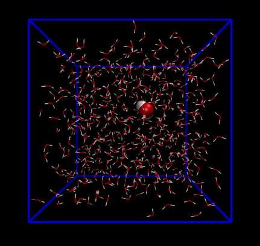
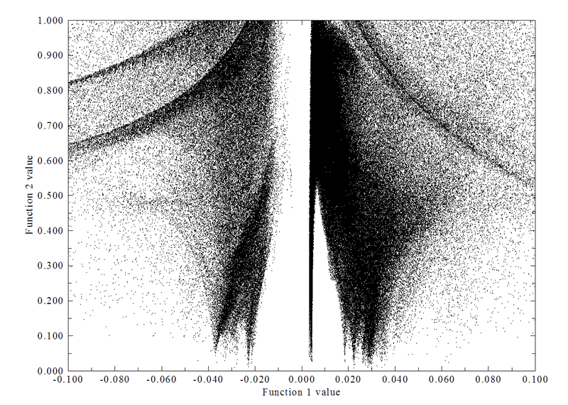
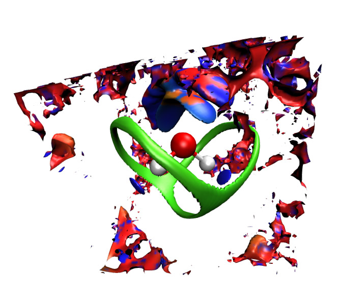
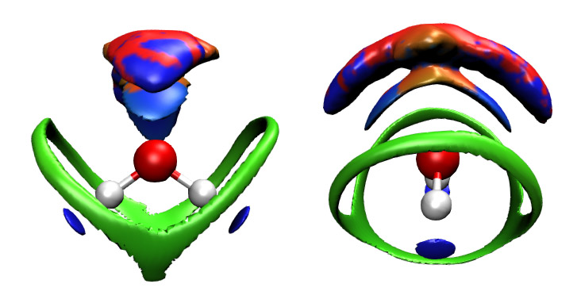
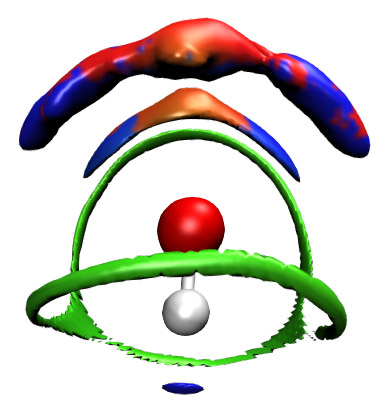
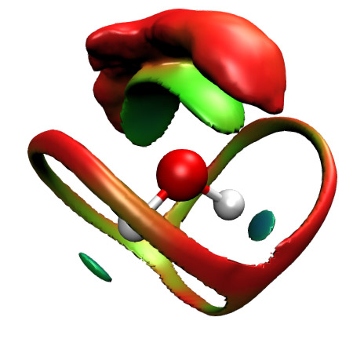
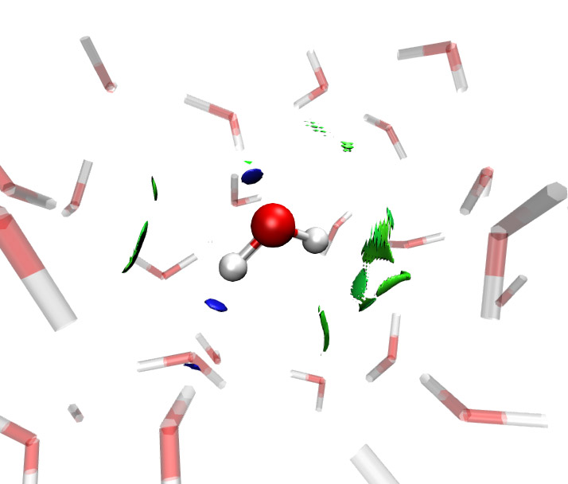
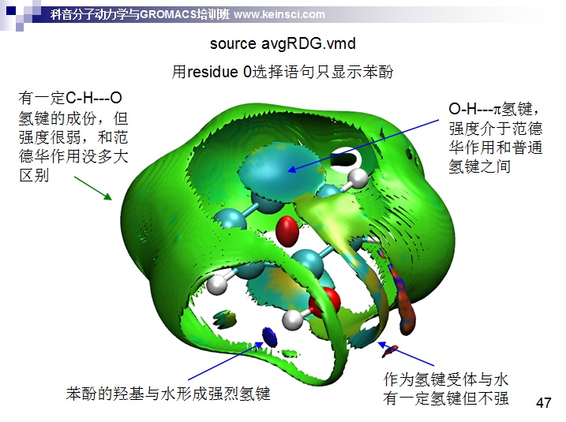
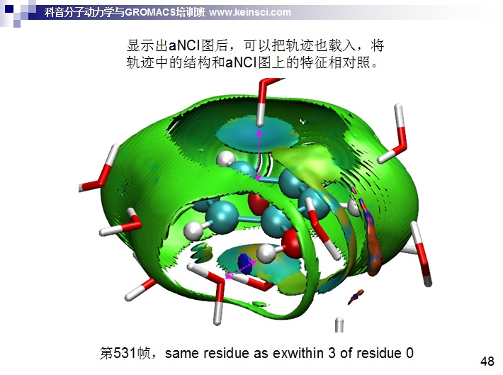
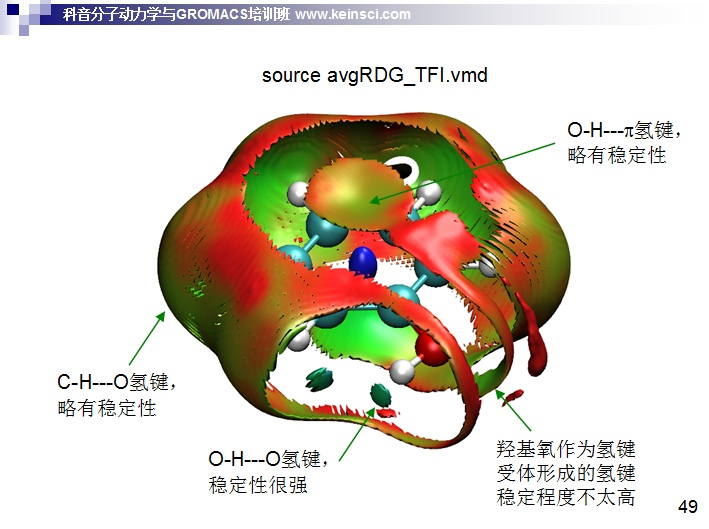

**重要说明**：笔者于2025年提出的**amIGM**方法比此文介绍的aRDG（亦称aNCI）好太多，**完全取代了aRDG**，因此**aRDG分析已经完全没必要再使用了**，本文已经没有任何意义了！强烈建议阅读《使用amIGM方法图形化直观展现动态过程中的平均弱相互作用》（<http://sobereva.com/759>）了解amIGM方法的特点以及在Multiwfn中的使用方法！

**后记**：针对aNCI方法用于蛋白质-配体相互作用的分析，笔者后来专门写了一篇文章《使用Multiwfn做aNCI分析图形化考察动态过程中的蛋白-配体间的相互作用》（<http://sobereva.com/591>）。本文的读者千万别忘了看此文！

**使用Multiwfn研究分子动力学中的弱相互作用**  
Using Multiwfn to study weak interaction in molecular dynamics

文/Sobereva @[北京科音](http://www.keinsci.com)  
First release: 2013-May-18  Last update: 2021-Jul-21

## 1 前言

曾经笔者在《使用Multiwfn图形化研究弱相互作用》（<http://sobereva.com/68>）中详细介绍了杨伟涛课题组在JACS,132,6498 (2010)提出的研究弱相互作用的约化密度梯度(RDG)方法，也叫NCI方法。原先的RDG方法只考虑单个结构下的弱相互作用，然而由于热运动，实际体系的结构是不断波动的，其中的弱相互作用也因此不可能只通过单一的结构全面表现出来。在JCTC,9,2226 (2013)中，杨伟涛课题组提出了averaged RDG (aRDG)方法（也叫aNCI方法），它是原先RDG方法的扩展，使得RDG分析方法可以用于分析多帧结构，尤为适合结合分子动力学模拟技术来研究平衡的动态环境中的弱相互作用。虽然aRDG原则上说也可以结合诸如蒙特卡罗模拟，但下文讨论的只限于aRDG方法对全原子分子动力学轨迹的分析。在《一篇最全面介绍各种弱相互作用可视化分析方法的文章已发表！》（<http://sobereva.com/667>）介绍的笔者的综述文章中有对aRDG非常充分详细的介绍并给了诸多应用例子，强烈建议大家阅读。

已经有大量文章使用了Multiwfn的aRDG分析发表了研究论文，可以参考，比如  
ACS Omega (2020) DOI: 10.1021/acsomega.0c02863  
Carbohyd. Res., 496, 108134 (2020) DOI: 10.1016/j.carres.2020.108134  
Russ. J. Phys. Chem. A, 94, 1356 (2020) DOI: 10.1134/S0036024420070195  
J. Mol. Liq., (2020) DOI: 10.1016/j.molliq.2020.113305  
Chin. Phys. B, 27, 083103 (2018) DOI: 10.1088/1674-1056/27/8/083103  
PLoS ONE, 13, e0196651 (2018) DOI: 10.1371/journal.pone.0196651  
Sci. Rep., 6, 21763 (2016) DOI: 10.1038/srep21763  
Sci. Rep., 5, 7572 (2014) DOI: 10.1038/srep07572

## 2 原理

如果不熟悉RDG方法，请务必先阅读《使用Multiwfn图形化研究弱相互作用》。aRDG方法和原先的RDG方法在原理上十分类似，同样是通过RDG函数的等值面来展现弱相互作用区域，并且将sign(lambda2)rho函数用不同的颜色投影到RDG等值面上来展现出弱相互作用类型。但是在aRDG方法中，计算RDG和sign(lambda2)rho函数所用的电子密度、电子密度的梯度以及电子密度的Hessian矩阵都是来自对多帧结构取平均得到的。也就是说，比如要研究的分子动力学轨迹有1000帧，那么aRDG所用的密度就是对这1000帧都依次计算密度然后取平均得到。因此aRDG中的RDG函数和sign(lambda2)rho函数都表现的是整条轨迹中平均的RDG和平均的sign(lambda2)rho。

除了这点区别外，aRDG方法还定义了一个热波动指数(thermal fluctuation index, TFI)，TFI=std(rho)/avg(rho)。其中avg(rho)就是上面说的整个轨迹中的平均密度，std(rho)就是整个轨迹中密度的方差，一个函数的方差越大就表明函数的波动越强。热波动指数的用处是展现不同区域弱相互作用的稳定程度，分析的时候将热波动指数通过不同颜色映射到平均的RDG等值面上，通过考察颜色，就能判断不同区域弱相互作用形成的稳定与否。

## 3 在Multiwfn中的使用

aRDG方法可通过Multiwfn的主功能20里的子功能3来实现。Multiwfn可在<http://sobereva.com/multiwfn>上免费下载。

由于aRDG分析用的是平均的密度及其梯度和Hessian，所以分析结果会随着考虑的帧数增加而逐渐趋于收敛。考虑的帧数越多，结果越精确，图像也越细腻。如果只考虑一帧的结构，那么和原先的RDG分析就没区别了。建议至少考虑500帧结构，如果想作出漂亮的图，应该用1000帧或更多。

使用Multiwfn的aRDG分析功能时，需要在一开始载入.xyz轨迹文件。.xyz格式很简单，.xyz轨迹文件只不过是简单地将一般的只记录单个结构的.xyz文件合并在一起而已，所以算是个比较通用的记录轨迹的格式。用户可以用任何自己最常用的分子动力学程序来跑出轨迹，然后载入VMD程序，之后直接转换为.xyz格式轨迹文件。

在轨迹中，感兴趣的分子的坐标应当保持固定不变，这可以在动力学程序中将其坐标冻结来实现。并且感兴趣的分子最好是在整个体系的靠中间的位置。计算格点数据时设定的计算区域应当能够容纳这个感兴趣的分子，且四周有一定延展区域，以避免重要区域的RDG等值面被截断。

由于需要考虑几百、上千帧，所以计算那么多帧的电子密度、梯度及Hessian的格点数据是不可能直接基于波函数的，因为无论是计算那么多次波函数还是计算那么多格点数据都是极其耗时的。aRDG原文用的是QM/MM方法，感兴趣的区域靠QM来描述并基于波函数获得密度，而外环境部分靠分子力学描述。但QM/MM动力学在实际操作上并不方便，对很多用户来说都有不小门槛，而且依然较耗时，且输出的格式与动力学程序的依赖性也太强因此不够普适。所以，Multiwfn中的aRDG分析一律使用promolecular近似，也就是基于自由原子密度的叠加来近似产生电子密度及其梯度和Hessian。这个近似显著简化了计算过程，大大节约了计算量，而且分析结果依然比较可靠。

## 4 实例：标况下纯水体系中水分子之间的平均弱相互作用

限于时间和精力，此文只给出一个应用aRDG的例子，也就是分析常温常压下的纯水体系中水分子之间的弱相互作用。对于其它体系的研究请根据本例举一反三。本节涉及到的所有文件包括轨迹都可以在此处下载：<http://sobereva.com/attach/186/aRDG_files.rar>。

### 4.1 生成轨迹

用任何程序来获得动力学轨迹都是可以的，本文用gromacs 4.5版来获得。如果读者习惯使用其它动力学程序，下文的gromacs的具体指令就不用管了，只要弄明白每一步的目的就行了。注意从GROMACS 5.0开始，操作步骤和本文的过程大不一样。

首先建立一个空盒子文件emptybox.gro，盒子各边长都为2.5nm，内容如下：  
WAT  
0  
   2.5 2.5 2.5  
盒子边长当然可以更长，只不过计算要更费时间。2.5nm算是底限了，再小的话就难以保证盒子长度是非键相互作用cut-off距离的两倍以上了。

然后运行以下命令往盒子里面填充水得到纯水盒子，其中将含有511个水分子  
genbox -cp emptybox.gro -cs spc216.gro -o water.gro

运行此命令，并且选GROMOS96 53a6 force field，得到水盒子体系的top文件。水分子用的是SPC/E模型。  
pdb2gmx -f water.gro -o water.gro -p water.top -water spce

接下来跑100ps NPT动力学，令水盒子在298.15K 1atm下平衡。范德华作用的cut-off为1.2nm。静电相互作用用PME方法计算，实空间cut-off距离为1.2nm。步长0.001ps。  
grompp -f pr.mdp -c water.gro -p water.top -o water-pr.tpr  
mdrun -v -deffnm water-pr

现在用VMD打开water-pr.gro，从中选一个比较靠近盒子中央的水分子，我们选取101号水分子，下图中将它用vdW方式突出显示

  
注意101号水分子的三个原子编号是301、302和303，氧原子是301号原子。

这个水分子的坐标在接下来的动力学过程中将保持冻结。为此，先生成index文件，输入以下命令  
make_ndx -f water-pr.gro  
ri 101    // 之所以是ri而不是r是因为ri是从1开始编号的，r是从0开始编号的  
q  
得到的index.ndx里的group r_101便是101号水分子。

运行以下命令来做298.15K下的1ns的平衡动力学，每隔1ps保存一帧结构，共得到1000帧。注意用NVT系综，因为如果允许控压的话，会对盒子进行scale从而影响101号水的坐标。由于之前已经在1atm下平衡了，水的可压缩性又很低，所以改用NVT模拟依然合理。101号水的坐标靠freezegrps = r_101关键词来冻结住。  
grompp -f md.mdp -c water-pr.gro -p water.top -o water-md.tpr -n index.ndx  
mdrun -v -deffnm water-md

将water-pr.gro和刚生成的water-md.xtc载入VMD，核对一下是否101号水确实固定住了。然后在VMD main窗口中点击与这个体系对应的项，并在其上点击右键，选Save coordinate，将File type设为xyz，Selected atoms选all，Frames框当中的First和Last分别写1和1000，然后点Save按钮，将轨迹保存为wat.xyz。

**特别注意**：有非常重要的一点是，.xyz文件对各个原子应当记录的是元素名，而不应当是原子名。但是，按照上述方式得到的.xyz轨迹里记录的却是原子名，如果你用文本编辑器打开wat.xyz就会看到里面每个水包含OW、HW1、HW2，这都是原子名。一般情况下，做本文的分析之前，应当手动把这些原子名替换为对应的元素名，这样才能100%确保Multiwfn能正常分析。但是，由于周期表里没有叫做OW、HW1、HW2的元素，因此Multiwfn在读取的时候会进一步试图通过首字母判断元素，因此Multiwfn是可以恰当地将这三种原子判断为氧原子和氢原子的，因此接下来的分析也没有问题。但如果Multiwfn载入.xyz文件后，屏幕上一开始提示的Formula后面的化学组成里出现了体系里不存在的元素，那么就说明必须把相应原子名替换为元素名了。比如.xyz里如果有原子类型为CA的碳，如果被Multiwfn载入，就会被当做钙离子对待，肯定结果将和正常情况明显不符。

### 4.2 用Multiwfn生成格点数据

启动Multiwfn，输入以下命令  
wat.xyz  
20  // 主功能20  
3  // aRDG分析  
1,1000  // 分析的帧号范围是1~1000  
7  // 通过原子编号自定义盒子中心，并自定义各方向盒子尺寸和格点数  
301,301  // 输入两个原子编号，它们的中点即为盒子中心。这里输入的两个原子编号都是301（被固定的水的氧原子编号），也就是说将301号原子作为盒子中心  
80,80,80 // 三个方向格点数都设为80  
4.5,4.5,4.5 // 盒子在xyz方向的前后延展距离都为4.5 Bohr，因此盒子尺寸是9*9*9 Bohr。盒子设太大的话会使格点间距较大，导致图像粗糙；如果太小，则会截断RDG等值面。所以设置的大小应该根据实际体系凭借直觉来定，如果不确定的话可以先试几个值，且每次都只考虑很少的帧数（如前20帧）来节约时间

之后，Multiwfn开始计算每一帧的电子密度及其梯度和Hessian，并取平均，之后用平均量计算出平均的RDG和sign(lambda2)rho。整个过程需要花一阵子时间，在目前一般的四核机子上耗时约半个小时到一个小时。如果是更大的动力学体系则更费时间，所以可以先暂时干别的去。

计算完毕后可以选选项1来查看平均RDG vs 平均sign(lambda2)rho散点图（分析方法和《使用Multiwfn图形化研究弱相互作用》介绍的一致，这里就不谈了），也可以用相应选项将其保存到图形文件中或者把数据点输出到文本文件里。此体系的散点图如下

选择6将平均RDG和平均的sign(lambda2)rho分别导出到当前目录下的avgRDG.cub和avgsl2r.cub。

由于我们要考察弱相互作用的稳定性，所以选7来计算热波动指数并将之输出到当前目录下的thermflu.cub里。计算热波动指数需要重新计算一遍每一帧的密度，所以也是比较耗时的，和计算平均RDG及sign(lambda2)rho过程耗时基本一样。

### 4.3 分析结果

本文使用的是VMD 1.9来观看结果。在本节开头提到的压缩包中提供了avgRDG.vmd和avgRDG_TFI.vmd，这是VMD作图脚本。将它拷到VMD程序目录下，并且将avgRDG.cub、avgsl2r.cub和thermflu.cub也都拷到VMD程序目录下。

启动VMD，在控制台窗口输入source avgRDG.vmd，就可以显示出平均RDG等值面，isovalue为0.25。同时，平均sign(lambda2)rho函数也通过不同颜色投影到了等值面上。默认情况下所有分子都以CPK模式显示了出来，这给分析101号水分子周围的弱相互作用带来了不便，所以进入Graphics-Representation，选Style为CPK的那一栏，将Selected Atoms里的内容改为101号水分子对应的三个原子，即改为serial 301 302 303然后点回车，此时就只有101号水分子显示出来了。经过视角的调整，结果如下所示（在VMD里点t之后可以平移视角，点r可以恢复旋转视角模式。点c再点击一个原子可以将视角旋转中心设在相应原子上）

期望的结果在图上都展现了，等值面也没有被截断，说明盒子设得合适。不过不幸的是，在格点数据计算区域的边缘，有一大堆零零碎碎乱七八糟的等值面，这和我们感兴趣的弱相互作用无关却十分碍眼。利用Multiwfn强大的格点数据处理功能，可以将这些离特定的一些原子（此例即101号水分子的三个原子）比较远的区域的等值面给消掉。

启动Multiwfn并输入：  
avgRDG.cub  // 即刚才生成的平均RDG的格点数据  
13  // 主功能13，用于处理格点数据  
13  // 设定距离特定原子比较远的格点的数值  
1.5  // 如果格点距离特定原子的距离超过相应原子范德华半径的1.5倍，则格点的数值将被设为下面用户输入的值。范德华半径倍数的设定是依靠经验的，可以多试几次并检验结果以达到满意效果  
100  // 新设定的值为100，这个值是随意的，只要是个明显大于作RDG等值面图时的isovalue的值就可以将这些点屏蔽掉  
2  // 读入特定原子的编号  
301-303  // 101号水分子的三个原子的编号  
0  // 将当前已经被改过的格点数据保存到新的cube文件中  
avgRDG.cub  // 新输出的格点数据文件名  
然后将新得到的avgRDG.cub移动到VMD目录下覆盖原先的avgRDG.cub（可以将原先的avgRDG.cub先备份一下）。然后重新用avgRDG.vmd脚本作图并做前述的调整，结果如下所示（给出了两个视角）

这次的图非常清楚。默认的色彩刻度是-0.25~0.25，对应“蓝色-绿色-红色”的变化。越蓝的地方说明静电、氢键效应越强，越红的地方说明位阻效应越明显，而绿色表明相应位置平均密度值较低，对应于很弱的作用，即色散作用。在两个O-H键对着的地方都有两个蓝色小圆片，表现出在动态环境下，O-H能与其它水形成很显著的氢键。图中有个显著的，胖次形状的绿色等值面，这清楚地展现了水分子倾向于以这些方向和其它水形成范德华作用。在氧的上方有一大坨等值面，其中两侧是蓝色，中间偏红，其蓝色区域体现出氧原子倾向于以这样的方位作为氢键受体，而红色则在一定程度体现出实际环境中氧容易以这样的方向和其它的水接触而表现出互斥效应。氧上方的那一大坨等值面可以看出是由两层值面相连构成的，如果将isovalue设低一些，如0.18，那么两层等值面就分开了，如下所示

之所以会有两层等值面原因尚不明，但可能分别与第一配位层、第二配位层分子的作用有联系。最外层的等值面的形状偏离对称性相对显著一些，而且等值面上投影的颜色有些“斑驳”，这说明对于这样靠外区域的弱相互作用，只考虑1000帧还不足以使结果充分收敛。

关掉之前的等值面图，然后运行source avgRDG_TFI.vmd，并作适当调整，结果如下

默认色彩刻度范围是0~1.5，还是对应蓝-绿-红的变化。越偏蓝的地方，说明热波动指数越小，弱相互作用在动力学过程中越稳定；越红的地方热波动指数越大，弱相互作用在动力学过程中就越不稳定。可见O-H对着的小圆片颜色稍微发蓝，这表明水分子靠O-H作为氢键给体与其它水分子构成的氢键在动力学过程中是很稳固的，很不容易被破坏。而胖次形状的等值面整体呈红色，说明水分子间的范德华作用相对于氢键是明显不易维持稳定的，这容易理解，毕竟范德华作用是很弱的。氧上方的等值面的内层部分主体都是绿色，表现出水分子以氧作为受体与其它水分子构成的氢键还算比较稳定。图中最上方的一大片红色等值面表现出这部分弱相互作用很难保持得住，波动性极大，因此将之忽略了也无妨（aRDG原文中干脆直接把这个区域给截掉了，以避免说不清楚）。

最后，我们来看看如果我们只考虑动力学轨迹中的一帧得到的结果会是如何。下面的图显示的是随机选取的一帧得到的RDG等值面填色图

可见，如果只考虑一帧，表现出的弱相互作用和平均的弱相互作用有很大差距。图中只显示了两个氢键区域，和零星的范德华作用区域，从这样的单帧的图上我们显然是没法直接了解到整个动力学过程中这个水分子是怎么和其它水分子作用的。

## 5 总结&其它

aRDG方法给研究动态体系中的分子间相互作用增加了一个很重要的新途径。以往研究这类问题往往就是计算径向分布函数、计算原子间距离/角度数值分布之类，是间接表征手段，远没有aRDG方法直观、表现的信息丰富。aRDG不仅可以研究动力学过程中小分子与其它小分子的平均弱相互作用，还可以研究诸如受体-蛋白间、小肽-小肽之间、分子与固体表面间的平均弱相互作用。aRDG原文中还研究了过渡态结构下体系与溶剂的平均弱相互作用。读者别忘了阅读《使用Multiwfn做aNCI分析图形化考察动态过程中的蛋白-配体间的相互作用》（<http://sobereva.com/591>），里面有Multiwfn做aRDG分析更多的信息。

相对于单一结构，动力学过程中包含了很多可以影响弱相互作用的因素，特别是温度。比如研究不同温度下平均RDG、平均sign(lambda2)rho以及热稳定指数的差异，对于研究温度对弱相互作用的影响十分有益。其它因素，诸如电场、浓度、压力等等因素对平均弱相互作用的影响也可以尝试通过aRDG分析来研究讨论。

有人问做aRDG分析需要跑多少ns的动力学才够用，这种问法很不妥，提供的信息不充分。做aRDG分析的关键在于：(1)要让被统计的粒子采样充分，避免由于模拟时间不够长导致粒子本来会出现的地方在有限的模拟时间内没有出现 (2)要有足够多的帧数描述粒子的分布，帧数不够的话得到的aRDG等值面会非常粗糙，棱角、窟窿明显。满足(1)需要轨迹足够长，多长合适应当根据实际体系运动特征判断，诸如像本文这样的体系，被统计的分子在中心分子附近运动得非常自由，而且被统计的分子是大量的（环境分子全都是被统计的分子），因此跑1 ns这样不算长的时间就能采样比较充分。满足(2)需要帧数够多，帧数需要多少不光在于跑的动力学总时间长度，还在于轨迹保存频率，显然同样长模拟时间内轨迹保存频率越高帧数就越多。另外，如果被统计的粒子运动范围比较广，也需要越多的帧数，以使得粒子在各个位置的出现都有足够多的帧描述；反之如果粒子分布范围非常有限，那么很少的帧数就足矣采样充分（极限情况下粒子只出现在一个位置，此时只需要一帧就够了，故只需要做RDG而没必要做aRDG了）。如果你不知道帧数够不够，姑且先跑跑一段动力学做aRDG试试，如果等值面还不理想，再续跑来得到更多帧。

最后，我把笔者讲授的分子动力学与GROMACS培训班（<http://www.keinsci.com/workshop/KGMX_content.html>）里示例的苯酚在水环境中的aRDG分析也展示出来，大家用GROMACS可以很容易跑出来。

