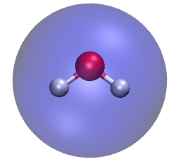
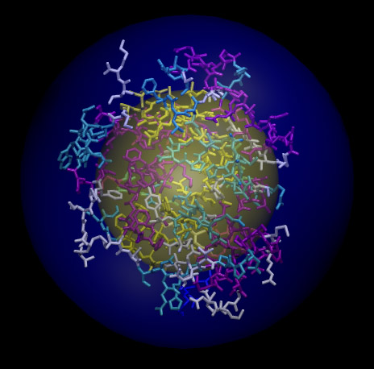
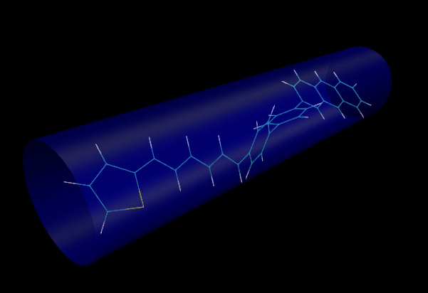
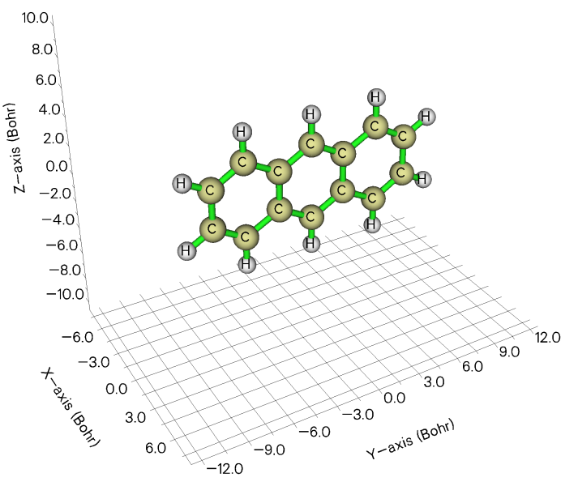
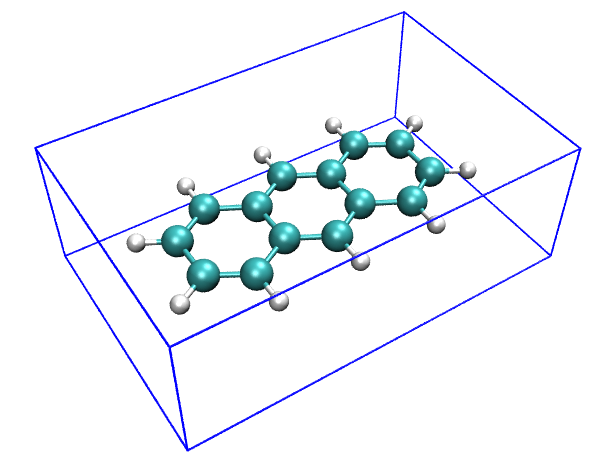

**谈谈分子半径的计算和分子形状的描述**

On the calculation of molecular radius and description of molecular shape

文/Sobereva @[北京科音](http://www.keinsci.com)  
First release：2013-Jun-7   Last update：2019-Oct-21

经常有人谈及和分子形状有关的话题，本文就说说常用的三种模型怎么讨论和计算，即球形模型、圆柱模型和矩形盒子。  
  

## 1 球形模型

用球形模型，相当于讨论怎么计算分子的半径。首先要认识到，分子半径不是一个可观测量，在计算方法上也不可能有唯一的定义，因此“怎么计算分子半径”这个问题本身就是不严格的。这段话和笔者在《谈谈分子体积的计算》（<http://sobereva.com/102>）当中文首说的话几乎如出一辙。对于半径、体积这类没有唯一定义的问题，应该先想清楚计算原理是什么，不要盲目计算。

谈到分子半径，这就自然已经假设了分子必须能较好作为球形来描述，如甲烷、球蛋白，至少也不能偏离球型太远。如果偏离球形很远，例如分子是大平面，像是卟啉或多环芳烃，或者是长链，如直链烷烃，那么就不可能靠球形模型来描述，也因此讨论半径对于这种问题是无意义的。

计算分子半径的做法有很多，下文将列举一些，但肯定还有不少方法本文中没有提及。  
  
**1** 寻找分子内相距最远的两个原子距离，然后加上相应两个原子的范德华半径，得到分子直径，除以2即是分子半径。  
  
**2** 寻找与分子几何中心最远的原子距离，加上其范德华半径，得到分子半径。（更严格地说，应该是找出加上相应范德华半径之后几何中心离哪个原子最远，不过本文就不考虑这点了）  
  
上面这两种方法计算起来比较容易，特别是方法1，直接在分子可视化工具里测量一下就行，不过原子很多的时候测量起来可能困难些。这两种方法的计算在Multiwfn程序（<http://sobereva.com/multiwfn>）里可以直接实现。这里以水分子为例。首先载入Multiwfn支持的含有分子结构信息的文件，如.pdb、.xyz、.mol等都可以，然后进入主功能100，然后选21，再输入all。屏幕上马上出现基于分子结构计算出的各种信息，其中可看到几何中心坐标  
Geometry center (X/Y/Z):    0.00000000    0.00000000   -0.27838535 Angstrom

下面会看到  
Maximum distance is    1.517906 Angstrom, between atom     2(H ) and     3(H )  
代表2H和3H距离最远，相距1.52埃。H的bondi定义的范德华半径为1.2埃（见JCP,68,441(1964)），因此按照方法1计算的分子半径即为(1.52+2*1.2)/2=1.96埃。

从输出信息中还看到  
The atom farthest to geometry center is      2(H )  Dist:    0.784570 Angstrom  
说明与几何中心距离最远的是2H且相距0.784埃，加上H的范德华半径，0.784+1.2=1.984埃即是方法2算得的分子半径。

如果用的是2018-Jun-6之后更新的Multiwfn，以方法1计算半径还有更省事的办法，即进入主功能100的子功能21之后，输入size，屏幕上直接就会输出Radius of the system:     1.959 Angstrom这样的信息。

可以利用VMD程序来画出球形，来直观地比较分子结构和圆球的定义。将水分子结构文件载入VMD，在控制台输入以下命令，来绘制一个透明的半径是1.984埃的圆球，其球心在几何中心（上述过程中Multiwfn的输出信息中已包含了几何中心位置）。  
draw material Transparent  
draw sphere { 0 0 -0.278 } radius 1.984 resolution 30  
color Display Background white  
然后在Graphics - Representation里把显示方式改成CPK，最后效果如下，可见这个圆球比较好地包裹了整个水分子。

对于凝聚相体系，由于分子间互相挤压或者存在诸如氢键这种相互作用，原子的范德华半径会在一定程度上被穿透，所以，上述方法估算的分子半径可能有所高估。因此，加上原子范德华半径时可以考虑给范德华半径乘个<1的刻度因子来体现这个效应。

上述两种方法结果往往相差不大，由于计算简便，适合计算很大体系的半径，如蛋白质。  
   
**3** 寻找分子表面最远的两个点的距离作为分子直径，除以2即是分子半径。分子表面的定义很多，见《谈谈分子体积的计算》的讨论，不同的表面适用于不同情况，例如Bader建议以电子密度0.001/0.002 a.u.的等值面分别作为气相/凝聚相时的范德华表面。这种方法类似方法1，但更严格、准确。  
  
**4** 寻找分子几何中心距离分子表面最远处的距离作为分子半径。这个方法类似方法2，但比它更严格、准确。  
  
方法3、4可以通过Multiwfn的定量分子表面分析功能实现。做法是启动Multiwfn后，载入相应体系的含有波函数信息的文件（如.wfn、.fch、.molden），然后进入主功能12，选0开始构建分子表面并进行表面性质的分析（默认是0.001 a.u.等值面作为分子表面，可用选项1修改）。然后在后处理菜单中选10，再输入g，屏幕上就会输出分子表面上距离几何中心最近和最远的距离；如果输入f，程序会计算出分子表面上最远两个点的距离，以及这两个点及其中点的坐标，之后可以像前例一样通过中点位置以及最远距离的一半作为半径在VMD中画出透明的球面。  
（注：主功能12默认分析的是分子表面上的静电势，而静电势计算对大体系会比较慢。由于我们的目的只是得到表面顶点而非分析表面的性质，所以可以进入主功能12之后先选择2设置被映射的函数，再选-1，然后选0开始分析。这里0代表考察的是用户自定义函数，这个函数默认情况下是个常数，没有任何计算耗时。）

对于水分子，在0.001 a.u.等值面作为范德华表面的情况下，利用Multiwfn程序得出的方法3定义的半径为1.99埃，方法4定义的半径为2.15埃。如果使用0.002 a.u.等值面当做范德华表面，则方法3、4定义的分子半径将缩小一些，分别为1.85埃和2.02埃。

由于方法3、4都依赖于电子密度信息，所以用不同理论方法、基组计算波函数文件，所得半径结果会有些许差异。

对于很大体系，利用方法3、4来计算半径总耗时会颇长，所以此时还是建议用方法1、2，尽管原则上精度会差一些，但是对于体系这么大的情况，那点精度的损失是完全可以忽略的，更何况分子半径的定义本身就是含糊的。  
   
**5** 计算分子体积V，然后根据V=4/3*pi*r^3来解出分子半径r。例如水分子，电子密度0.002 a.u.的等值面内的体积约为20.92埃^3，因此r=1.71埃。如果用0.001a.u.等值面当做范德华表面，则体积约为26.36埃^3，因此r=1.85埃。通过电子密度等值面定义的体积可以利用Multiwfn程序得到，见《谈谈分子体积的计算》。

之所以我们用这个方法算得的半径比前述的方法略小，这并不难理解，因为此方法相当于把任意形状的分子给攒成了理想球形，所以看起来当然变小了。如果分子偏离球形更多，那么此方法所得半径将小得更多。  
  
**6** 假定分子之间是无缝隙地堆积起来的，根据物质的密度推出分子体积和半径。可用先用此公式解出分子体积：M/(V*10^-27*NA)=rho，即V=M/rho/6.02*10000，其中M是分子量，rho是密度(g/L)。例如水的rho=1000g/L，M=18.0，故V=29.9埃^3。将分子当成理想球形解得的分子半径即为r=1.92埃。  
  
**7** 对于AHn类分子（如H2O、NH3、CH4等），将重原子作为球中心，逐渐增加半径，当半径增大到一定值时球内电子密度恰包含了体系内98%的电子密度时，将这个半径作为分子半径。这个定义是JCP, 56, 4419(1972)提出的，如今很少有人用，算起来也不方便，也不是很普适。此文算出的水的半径是1.67埃。  
  
除上述这些，分子半径/直径还可以根据某些实验来给出。比如可以根据能否通过指定孔径的分子筛来确定分子直径。这和动力学直径关系密切，用Multiwfn可以容易地算出动力学直径，见《使用Multiwfn计算分子的动力学直径》（<http://sobereva.com/503>）。顺带一提，Multiwfn还有计算分子孔洞直径的功能，见《使用Multiwfn计算分子和晶体中孔洞的直径》（<http://sobereva.com/643>）。  
  
对于聚合物，也包括蛋白质等体系，经常讨论回转半径用来讨论分子构象延伸的广度。比如在一个蛋白去折叠过程中蛋白质链会伸展得越来越广，回转半径也因此逐渐增大。但有人以为回转半径可以当成分子半径，这是明显错误的。例如，我们用一个酪氨酸激酶作为示例，总共有1806个原子，我们用前述方法2得到的半径是30.638埃，而回转半径是16.842埃。以几何中心作为球心，用方法2所得半径和回转半径绘制的球分别以蓝色和黄色表示，所得图像如下所示

可见回转半径根本没有包住整个体系。所以说，回转半径适合衡量结构的延展广度，但不适合作为分子半径的定义。回转半径也可以通过Multiwfn得到，依然是进入主功能100里的功能21，输入all之后输出的信息里就有整个体系的回转半径，即Radius of gyration:后面的数值。

## 2 圆片/圆柱模型

对于大平面分子，我们描述其分子形状显然就不适合再用圆球模型了。诸如卟啉这样的分子，我们适合使用扁圆片模型来描述它的形状。圆片的厚度可以简单定义为碳原子范德华半径的二倍，而圆片的半径可以直接使用前述的方法1~4来得到。

对于长链体系，其形状适合用圆柱模型来表示。我们可以沿用前述的方法1~4来得到圆柱的长，而圆柱的半径需要根据实际结构来判断。

一种更为严格、自动化的确定圆柱参数的方法是不断调整圆柱的参数，使得圆柱能够包围所有原子且圆柱的尺寸最小。这个方法可以借住CYL程序来完成。此程序可以在这里免费下载到Linux和Mac OS X版：<http://petitjeanmichel.free.fr/itoweb.petitjean.freeware.html>

CYL程序下载后直接用诸如./bin.CYL.1.linux64.intel命令运行即可，然后输入输入文件的路径。输入文件格式类似这样：  
63 0 0 0    //63代表有63个点。后面的三个零不用管，一般都需要写。  
 -12.235  -1.599  -0.445    //各个点的XYZ坐标，对于本文的情况也就是各个原子坐标  
 -10.905  -1.894  -0.414  
  -9.920  -0.847  -0.263  
 -10.369   0.509  -0.148  
 -11.788   0.778  -0.186  
 -12.685  -0.238  -0.329  
  -8.546  -1.127  -0.228  
 ...略

对于点比较多的情况，计算要花不少时间。算完后屏幕上会看到诸如  
 Axis  :   0.996020E+00   0.491685E-01   0.743408E-01  
  Center:   0.529569E+00   0.669861E+00   0.659797E+00  
  
  Radius     :   0.305604E+01  
  Half-height:   0.143397E+02  
Axis就是圆柱的轴的矢量，Center是圆柱中心，Radius是圆柱半径，Half-height是圆柱长度的一半。利用这样的信息，我们可以将圆柱的图形画出来，以便和分子结构相比较。我们使用VMD程序内建的绘图命令来画图。

在启动VMD后，先载入分子结构文件，然后在控制台中将以下内容复制进去来定义molcyl绘图命令  
proc molcyl {cenx ceny cenz axisx axisy axisz rad halfh} {  
 draw material Transparent  
 set startx [expr $cenx-$axisx*$halfh]  
 set starty [expr $ceny-$axisy*$halfh]  
 set startz [expr $cenz-$axisz*$halfh]  
 set start "$startx $starty $startz"  
 set endx [expr $cenx+$axisx*$halfh]  
 set endy [expr $ceny+$axisy*$halfh]  
 set endz [expr $cenz+$axisz*$halfh]  
 set end "$endx $endy $endz"  
 draw cylinder $start $end radius $rad filled yes resolution 40  
 }  
然后利用molcyl命令就可以根据CYL的结果画出圆柱的图了，此命令的参数顺序是：柱中心XYZ坐标、轴矢量的XYZ分量、圆柱半径、圆柱半高。对于上例，我们输入molcyl 0.529569 0.669861 0.659797 0.996020 0.0491685 0.0743408 3.05604 14.3397之后就可以在屏幕上看到如下效果：

可见圆柱恰好套住了整个长链分子，所以CYL的结果是合理的。但要注意CYL给出的圆柱的参数没有把范德华半径考虑进去，而从图中可看到，与圆柱边缘相接的都是H，所以圆柱的半径和长度应当分别加上氢的范德华半径的一倍和二倍。

值得一提的是，长链体系往往具有很强柔性，不同构象下描述它的圆柱的参数可能有巨大差异，所以要注意说明是什么构象下计算的。

## 3 矩形盒子模型

一些体系适合矩形盒子模型，用长、宽、高来描述，比如下面的蒽，可以被矩形盒子很好扩住，比起圆球和圆柱模型都更合适  
  

**注**：如果你的分子是复杂、歪斜的而非上图那么正，或者你想纯粹基于几何坐标快速计算长宽高，务必看后来写的《使用Multiwfn计算分子的长宽高》（<http://sobereva.com/426>）。

我们需要获得能够扩住这个分子范德华表面（这里用电子密度0.001等值面来定义）的最小盒子尺寸。这可以通过Multiwfn来做。先用Gaussian计算出这个分子的wfn或fch文件，载入进Multiwfn后选  
12  //定量分子表面分析  
2  //修改被映射的函数  
-1  //改为用户自定义函数（计算没有耗时）  
0  //开始分析  
然后从屏幕的输出中能够找到ρ=0.001定义的分子表面的顶点的X、Y、Z方向上的最小和最大值：  
Min-X:     -2.0419  Max-X:    2.0420 Angstrom  
 Min-Y:     -5.9055  Max-Y:    5.9055 Angstrom  
 Min-Z:     -3.7916  Max-Z:    3.7916 Angstrom  
比如盒子的Z长度就是3.7916*2=7.58埃。

我们可以用VMD来绘制出这个盒子。首先把以下内容复制到VMD的控制台里定义一个新命令drawbox  
proc drawbox {xmin ymin zmin xmax ymax zmax} {  
draw color blue  
draw line " $xmin $ymin $zmin " " $xmax $ymin $zmin "  
draw line " $xmin $ymin $zmin " " $xmin $ymax $zmin "  
draw line " $xmax $ymin $zmin " " $xmax $ymax $zmin "  
draw line " $xmin $ymax $zmin " " $xmax $ymax $zmin "  
draw line " $xmin $ymin $zmax " " $xmax $ymin $zmax "  
draw line " $xmin $ymin $zmax " " $xmin $ymax $zmax "  
draw line " $xmax $ymin $zmax " " $xmax $ymax $zmax "  
draw line " $xmin $ymax $zmax " " $xmax $ymax $zmax "  
draw line " $xmin $ymin $zmin " " $xmin $ymin $zmax "  
draw line " $xmin $ymax $zmin " " $xmin $ymax $zmax "  
draw line " $xmax $ymin $zmin " " $xmax $ymin $zmax "  
draw line " $xmax $ymax $zmin " " $xmax $ymax $zmax "  
}

然后输入drawbox -2.0419 -5.9055 -3.7916 2.0420 5.9055 3.7916，就可以根据前面得到的数据绘制出相应的盒子。可见盒子能很好地扩住分子。

  
对于结构很复杂的体系，想要比较准确地且解析地描述它的形状，无论是圆球、圆片/圆柱或矩形盒子模型都已经不再适用，这种情况可以用球谐函数展开来表现，这在本文就不谈了。
