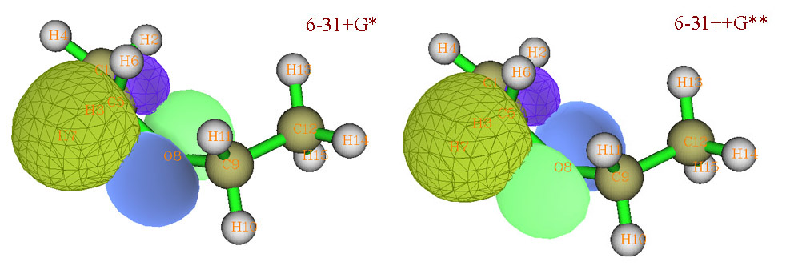
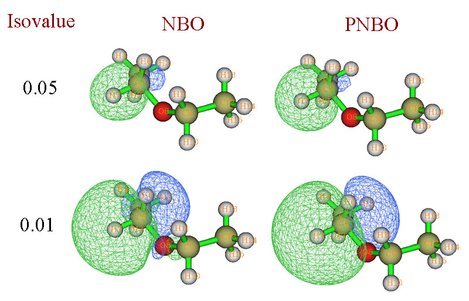

**简谈NBO间的相对相位问题**

On the relative phase between NBO orbitals

文/Sobereva @[北京科音](http://www.keinsci.com/)  2013-Jun-13

在思想家公社群里有人研究C2H5OC2H5自由基阳离子，问为何在6-31+G*和6-31++G**下得到的beta NBO中的氧的LP*与C-H的BD的相对相位发生了反转、这样情况下如何讨论轨道间相互作用。这个问题感觉还是值得专门谈一下的。

这个相位反转问题如下图所示。绿色/蓝色代表O LP*的正/负相位。黄绿/紫色代表C-H BD。可见O LP*的相位在两种情况下恰好相反。

NBO（也包括PNBO）的相位是有随机性的。因为获得NBO的过程是对每个原子自身，以及每两个原子间构成的以NAO为基的密度矩阵进行对角化而产生的。而不是像自然轨道那样对整个体系的密度矩阵对角化而得到的。每次对角化后产生的一批NBO之间的相对相位是固定的不变的，但是这批NBO的相位可以同时反转（即全部本征矢变为其负本征矢），而不影响物理意义，因为这不会使本征值（NBO占据数）因此发生改变。

由于不是来自同一个中心或同一个原子对儿的两个NBO不是在同一次对角化过程中产生的，所以二者的相对相位是随机的。

以C-H为例，C-H的BD，即便两次计算时基组、构型、理论方法相差甚微，也可能有的时候BD中正相位占主导，而在另一种情况下BD的相位就反转了而负值占主导。对角化算法只保证对于一个矩阵得到的本征值是确定的，而本征矢可以随意乘上一个常数（如-1）。然而，同一个C-H的BD和BD*是在同一次对角化时产生的，所以此二者间的相对相位则是绝对不变的，要反转其中一个就必须反转另一个。

实际上寡人在开发Multiwfn (<http://sobereva.com/multiwfn>)的AdNDP功能时也遇到过类似问题。AdNDP轨道是对于不同的单、双或多中心的密度矩阵对角化产生的，为了使相位看起来统一从而比较方便，Multiwfn在输出AdNDP轨道的格点数据的时候，当发现如果轨道负值区域占主导，那么就给轨道系数都乘上-1来让它反转，使得所有AdNDP轨道都是以正相位为主。其实NBO程序也应该加入这么一个自动检测并自动反转相位的功能。不过，对于LP、pi轨道，正负值区域都相同，就无法靠这种办法调整相位了，但也依然可以有办法让相位唯一地确定下来，比如可以积分z*psi(x,y,z)，比如结果为负，那么表明轨道负相位的一头冲着z轴正方向，此时就可以令之相位反转。

所以，上面所看到的在6-31++G**下相对于6-31+G*时，beta NBO中O LP*和C-H BD的相对相位发生了反转，这没有关系，不影响物理意义。作这种图，只能考察它们之间重叠程度，由此来估量相互作用是否可能比较大或比较小，或者来解释E2值。在O与C-H之间交汇区域内，在6-31++G**和6-31+G*时，两个NBO的重叠程度是一致的，只不过重叠积分符号颠倒了而已。单纯的这种颠倒并不影响这两个NBO间的二阶稳定化能(E2)值，而E2正是两个NBO对应的轨道间的相互作用的定量衡量标准。B3LYP结合6-31+G*和6-31++G**下这两个NBO间的E2分别为13.13kcal/mol和13.39kcal/mol，可见相差甚微。

值得一提的是：NBO之间全都是正交的，整个空间内重叠积分为0，上面只说O与C-H之间交汇区域内的情况。考察这种轨道重叠问题用PNBO比用NBO更好，因为PNBO不要求轨道间正交，所以可以更好地展现轨道间的重叠。不过当观看轨道时的isovalue不太小时，NBO和PNBO看起来差异往往不大，此时也能通过NBO考察轨道间的重叠。

NBO和PNBO的差异如下图所示

可见，isovalue=0.05时，NBO和PNBO都如实展现了C-H成键轨道的特征。然而当isovalue=0.01时，NBO的图形就变得复杂了，不仅轨道变了形，在相邻原子上还出现了小等值面，因为若不具备这样的特征，就没法和周围的NBO正交了。而PNBO则依然很好地展现出C-H成键轨道的特征。
