**注1**：笔者后来又写了《使用Multiwfn+VMD快速地绘制静电势着色的分子范德华表面图和分子间穿透图》（<http://sobereva.com/443>），**是绘制分子表面静电势图最完美的解决方案。其中通过脚本，把此文的绘制标准静电势填色的范德华表面图的步骤简化到了极致，只需要用不到本文1/10的步骤和耗时就可以达到比本文更好的效果**，而且完全避免了用户对VMD操作不熟导致画不出来图。强烈建议读者先阅读443这篇文章后再读本文，两篇文章有互补性。

**注2**：使用类似本文的做法，但结合Multiwfn输出的特殊文件，还可以对对应特定原子或片段的分子表面上的局部区域绘制静电势图，从而排除其它部分产生的视觉干扰，参见《使用Multiwfn结合VMD绘制分子局部区域表面静电势的方法》（<http://sobereva.com/750>）。

**使用Multiwfn结合VMD分析和绘制分子表面静电势分布**  
Using Multiwfn and VMD to analyze and plot electrostatic potential on molecular surface

文/Sobereva @[北京科音](http://www.keinsci.com/)  
First release: 2013-Jul-28   Last update: 2024-Sep-30

## 1 前言

分子表面静电势图经常在文献中出现，不同表面区域静电势大小通过不同颜色展现，使分子表面上静电势的分布一目了然。分子表面一般都用Bader定义的范德华表面，即电子密度为0.001 e/Bohr^3的等值面。只要提供所需的输入数据，这种图在许多程序中都可以作。本文介绍的通过Multiwfn的定量分子表面分析功能结合VMD和Photoshop作分子表面静电势图步骤相对步骤较多，但是优点十分显著，就是可以在分子表面上显示出静电势极值点位置，可以十分灵活地调节显示效果，而且还可以通过相同的方法绘制出分子表面上静电势以外的实空间函数的分布，比如平均局部离子化能、局部电子亲和能、Fukui函数等等。另外还可以顺带着获得许多其它信息，比如原核与分子表面的距离，实空间函数在分子表面上分布的统计数据等等。只要了解每一步操作的意义，就会觉得其实根本不复杂，而且思想上获得极大的解放。

本文将以一个简单体系呋喃为例进行说明，波函数文件在B3LYP/6-31G**下由Gaussian产生。虽然本文主要是介绍作图方法，但也会顺便介绍一下定量分子表面分析的一些功能。阅读本文前建议先看看《使用Multiwfn的定量分子表面分析功能预测反应位点、分析分子间相互作用》（<http://sobereva.com/159>），和本文有互补性。更多关于静电势的相关文章看《静电势与平均局部离子化能相关资料合集》（<http://bbs.keinsci.com/thread-219-1-1.html>）。

Multiwfn可在<http://sobereva.com/multiwfn>上下载，不了解此程序的话看《Multiwfn FAQ》（<http://sobereva.com/452>）和《Multiwfn入门tips》（<http://sobereva.com/167>）。VMD为1.9版，可在<http://www.ks.uiuc.edu/Research/vmd/>上免费下载。Photoshop为CS2版。**如果你的研究中使用Multiwfn根据本文的方法绘制和考察了静电势，必须在文章的正文里****引****用****Multiwfn启动时提示的程序原文**。也建议**同时**按照《Multiwfn使用的高效的静电势算法的介绍文章已于PCCP期刊发表！》（<http://sobereva.com/614>）末尾的说明引用介绍Multiwfn中静电势计算算法的文章。

## 2 在Multiwfn中计算、统计、导出数据

怎么产生可以给Multiwfn用的波函数文件在《详谈Multiwfn支持的输入文件类型、产生方法以及相互转换》（<http://sobereva.com/379>）里明确说了。这里用呋喃为例子。启动Multiwfn后依次输入  
furan.wfn  
12  //定量分子表面分析  
0  //开始计算

默认就是在电子密度为0.001 a.u.的表面上计算静电势，并且格点间距为0.25 Bohr。格点间距可以通过选项3来设定，格点间距越小，分子表面就会用越多的顶点来描述，定量统计值、极值点位置也会越精确，之后作出的分子表面填色图的色彩过渡也越光滑，但是计算耗时将越长。如果你的目的仅仅是绘制分子表面静电势图，可以忽略以下内容而直接跳到本节最后一段。

计算完毕后会看到分子表面上静电势极大、极小点的坐标和数值，并且输出大量统计数据，比如分子表面上静电势的最大/最小值、平均值、方差、电荷平衡度、表面积等等，它们对于了解分子特征、建立QSPR/QSAR方程预测分子理化性质和生物活性等问题都十分有用，见《使用Multiwfn预测晶体密度、蒸发焓、沸点、溶解自由能等性质》（<http://sobereva.com/337>）和Multiwfn手册3.15.1节的介绍。

此时会看到后处理菜单。选选项0进入图形界面，并且将Ratio of atomic size设为4.0就可以清楚看到分子表面上静电势极大点（红点）和极小点（蓝点）的位置。如果点击Minimal/Maximum label，就会显示出极值点的编号，可以和命令行窗口显示的极值点信息相对照，得知极值点上的具体数值。点击右上角Return可以关闭图形窗口。

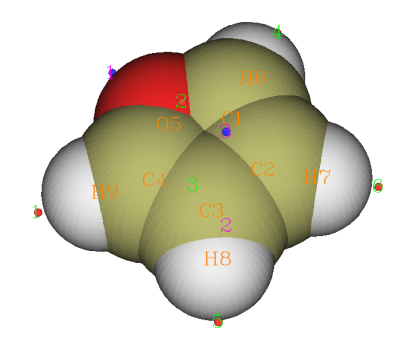

此例中各个极值点静电势数值如下（由于格点精度有限，所以等价的极值点的数值不完全一致，这里取了平均）  
极小点1（最小点）：-20.60 kcal/mol   体现氧的孤对电子对静电势的负贡献  
极小点2、3：-15.23kcal/mol   在两个beta碳（邻位碳）正上方，体现pi电子对静电势的负贡献  
极大点1、4（最大点）：18.41kcal/mol   体现alpha位的氢原子所带的正电  
极大点5、6：15.21kcal/mol   体现beta位的氢原子所带的正电  
极大点2、3：-9.63kcal/mol   虽然是极大点，但是静电势数值为负，所以化学意义不大，可无视之

我们可以查看一下不同静电势区间内分子表面积，这对于了解分子表面静电势的定量分布很有益。做法是在后处理菜单中依次输入  
9  
all  //考虑所有原子对应的范德华表面  
-25,22  //统计范围。当前体系分子表面静电势范围为-20.60~18.41kcal/mol，这里将范围稍微扩大并取整数来定义范围  
15  //将-25~22kcal/mol均匀分为15个区间获得表面积  
3  //输入的单位为kcal/mol  
立刻屏幕上就输出了不同静电势区间内的表面积，我们将Center这一列和Area这一列的数据分别从屏幕上拷下来（不会拷的读者见手册5.4节），并粘贴到诸如Origin等作图工具里并作成条形图，就可以得到诸如以下图像

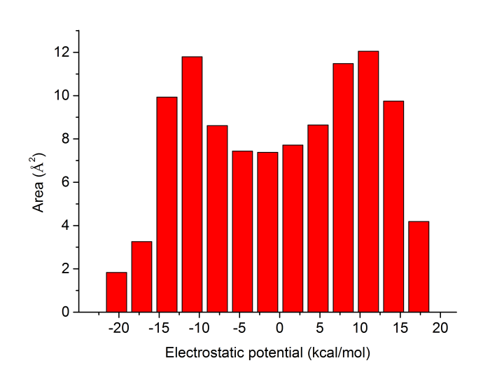

静电势的定量分布在这张图上一目了然。此分子不同静电势区间内的表面积分布还是相对比较均匀的。这种静电势分布柱形图统计是在后文提到的**笔者发表的J. Phys. Org. Chem., 26, 473-483 (2013)和Struct. Chem., 25, 1521 (2014)两篇文章里首次提出和使用的**，**如果大家在自己的文章里也用这种图，除了引用Multiwfn原文外也请引用这两篇文章**。

如果选择选项11，则程序会输出每个原子对应的局部分子表面上的静电势统计数据，对于了解原子在此分子中的特征很有用，这个功能的详细介绍见《谈谈怎么计算“原子的静电势”》（<http://sobereva.com/641>）。例如Multiwfn显示的局部表面静电势平均值  
Atom#    All/Positive/Negative average  
     1   -10.08997        NaN  -10.08997  
     2   -12.59141        NaN  -12.59141  
     3   -12.64250        NaN  -12.64250  
     4   -10.04843        NaN  -10.04843  
     5   -13.54925        NaN  -13.54925  
     6     6.87357    9.80155   -3.13475  
     7     4.84667    8.19922   -4.56994  
     8     4.84069    8.21673   -4.50535  
     9     6.88875    9.78376   -3.16678  
氧原子（5号）附近的分子表面静电势平均值最负（-13.55kcal/mol），这也容易理解，毕竟其孤对电子对静电势有很大的负贡献。由于其附近分子表面上没有正值区域，所以正值区域的静电势平均值显示的是NaN。呋喃中碳原子裸露在分子表面上的区域主要就是体现pi电子特征的区域，由于pi电子云使这部分区域静电势为负，所以碳原子附近静电势平均值也都为明显负值，并且无正值区域。同时从静电势平均值上也体现出beta碳（2、3号）比alpha碳（1、4号）的pi电子云更富集因而静电势更负。这种讨论分子表面上对应不同原子区域的定量数据的方法和分子表面极值点分析往往会得到共通的结论，但此方法可以得到更多的信息，比如alpha碳上没有出现极值点（因此对它没有任何描述），而通过分析它对应的分子表面上的局部区域的静电势平均值等数据就可以定量考察它的特征。这种分析方法是笔者独创的，也仅有Multiwfn支持。另外，通过选项12还可以查看分子表面上对应于指定分子片段区域的定量性质。

选过选项9之后会问你是否输出locsurf.pdb文件，通过此文件可以利用VMD查看不同原子对应的分子表面区域。由于这不是本文的重点，所以输入n不让程序输出。

利用选项10可以查看分子表面相对于指定坐标点或指定原子核的最远和最近距离，这对于讨论分子间相互作用导致分子表面的穿透距离很有用。此功能也可以用于计算分子半径或直径，见《谈谈分子半径的计算和分子形状的描述》（<http://sobereva.com/190>）的讨论。

现在选择2将分子表面极值点导出到当前目录下surfanalysis.pdb文件中，此文件中碳和氧原子分别对应分子表面静电势极大点和极小点，pdb文件的B因子那一列的数据是静电势数值(kcal/mol)。然后再选择6将所有分子表面顶点导出到当前目录下vtx.pdb文件中，B因子是每个顶点的静电势数值。另外，如果你还没有当前分子的几何结构文件，应再选择5然后输入furan.pdb把当前体系的坐标导出到当前目录下furan.pdb中。

## 3 在VMD中作图

由于Multiwfn所用的图形库的限制，Multiwfn自身无法直接产生不同颜色填充的分子表面图，所以需要借助VMD来实现。下面的操作步骤对于当前体系比较适合，对于其它体系，应举一反三，根据实际情况进行略微调整。

启动VMD，然后把furan.pdb、surfanalysis.pdb和vtx.pdb按顺序依次拖动到VMD主窗口里(VMD Main)，它们的ID将分别是0、1、2。选择Display-Depth Cueing将它关掉，否则图像会有些朦胧。进入Graphics-Colors，选Display-Background-White将背景改为白色，并且在此界面的Color-Scale标签页里选择BWR，使分子表面的色彩根据数值范围由小到大以 蓝-白-红 的方式变化。选Display-Axes-Off不让坐标轴显示出来。

注：如果希望每次启动VMD时都自动做如上操作，可以在VMD目录下vmd.rc文件末尾添加以下4行  
display depthcue off  
 color scale method BWR  
 color Display Background white  
 axes location Off

进入Graphics-Representations，然后执行以下3步来分别设定分子结构、分子表面极值点、分子表面顶点的显示方式。（如果只是想简单地看一下表面静电势分布，只要做第3步即可）  
(1)在Selected Molecule一栏里选择furan.pdb，Drawing Method选Licorice，Bond Radius减小到0.1。

(2)将Selected Molecule一栏切换到surfanalysis.pdb，在控制台输入mol modstyle 0 1 VDW 0.06 （0和1是显示方式编号和体系的ID，此命令代表用大小为0.06的VDW球显示。由于GUI中VDW球最小只能设到0.1，故这里用命令行来实现）。然后在Selected Atoms里输入carbon并回车，然后将Coloring Method选为ColorID，并且在右边新出现的框里选Orange2。此时分子表面极大点就通过橙色小圆球显示出来了。点击Create Rep按钮创建新显示方式，在Selected Atoms里输入oxygen并回车，然后将ColorID右边的框设为Cyan，此时分子表面极小点就通过青色圆球显示出来了。

(3)在Selected Molecule一栏里选择vtx.pdb，Drawing Method选Points，Size设为25（设多大合决于视角的远近，在当前视角下应当让size恰好足够大，使分子表面上的顶点紧密相连，不留明显空隙），Coloring Method选Beta（根据pdb文件里B因子那一列的数据，此例即静电势数值进行填色），在Trajectory标签页里将Color Scale Data Range填上-22和22并点击Set，代表色彩刻度设为-22~20kcal/mol（其实此例用默认的色彩刻度范围就可以，这里只是为了取个整）。现在分子表面填色图就出现了。越蓝的区域静电势越负，越红的区域越正，白色区域的静电势数值在0附近。

之后给图上加上色彩刻度轴。选Extensions-Visualization-Color Scale Bar，Color bar width设为0.08，Display title选on并且将Color bar title里写上ESP (kcal/mol)，Minimum和Maximum scale value分别填-22和22，Number of axis labels输入10，Color labels选Black，Label format选Decimal。然后点Draw Color Scale Bar按钮，色彩刻度就出现在画面中了，并且VMD Main窗口中多出了一个名为Color Scale Bar的一项。然后调整它的大小和位置，即双击VMD Main窗口中Color Scale Bar那一项当中的F标签使之变为红色（即不让色彩刻度轴在画面中的位置冻结），而双击其它项目的F标签使它们的F变为黑色（让它们的位置冻结住）。然后点击VMD的OpenGL图形窗口激活之，按t键进入平移模式，然后拖动鼠标将色彩刻度轴放置到合适位置，并且用鼠标滚轮调整它的大小。调合适之后再按r键恢复旋转视角模式，并且在VMD Main里将Color Scale Bar那一项的F重新双击成黑色，而其它三项的F重新双击为红色。

当前的显示效果如下

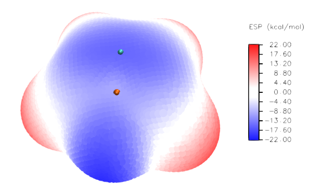

此图还有许多地方值得进一步调整，也就是让分子结构显示出来（现在都被表面顶点掩盖了）、给分子表面极值点标上具体数值、让表面极值点更清楚地显示，特别是藏在分子表面后方的极值点也显示出来。为达到这些目的，需要利用photoshop。由于步骤比较细碎，笔者不把所有具体操作都叙述一遍，否则太罗嗦。只要会基本的photoshop操作的人都应该能理解应该怎么实现。

## 4 通过Photoshop改进作图效果

将分子调整到一个合适的角度，然后在VMD main窗口里把所有条目的F标签都双击成黑色来将它们固定住，以免随后的操作过程中不慎旋转了体系。

在VMD main窗口里面双击与furan.pdb和surfanalysis.pdb对应的条目的D标签使其变红，此时窗口内就只有分子表面和色彩刻度轴显示了出来。然后按Alt+Printscreen键将窗口截图，在photoshop里按Ctrl+N然后按OK，再用Ctrl+V把截的图粘贴进去。此时图像大小正好和VMD窗口大小完全一致。

在VMD main窗口里面只让分子结构显示出来，将背景改为蓝色（只要不是白色就行，否则会和氢原子的白色连在一起），然后将窗口截图并且粘贴进之前的ps窗口里成为新的图层。选择魔棒工具，Tolerance设0，Contiguous的对勾取消，然后点击图中蓝色区域把背景区域选上，之后按delete键去除背景。之后将图层的不透明度(Opacity)改为40%，这样分子结构就会以半透明方式叠加到分子表面图上了，而且叠加的位置完全精确。ps窗口里的图像目前如下所示

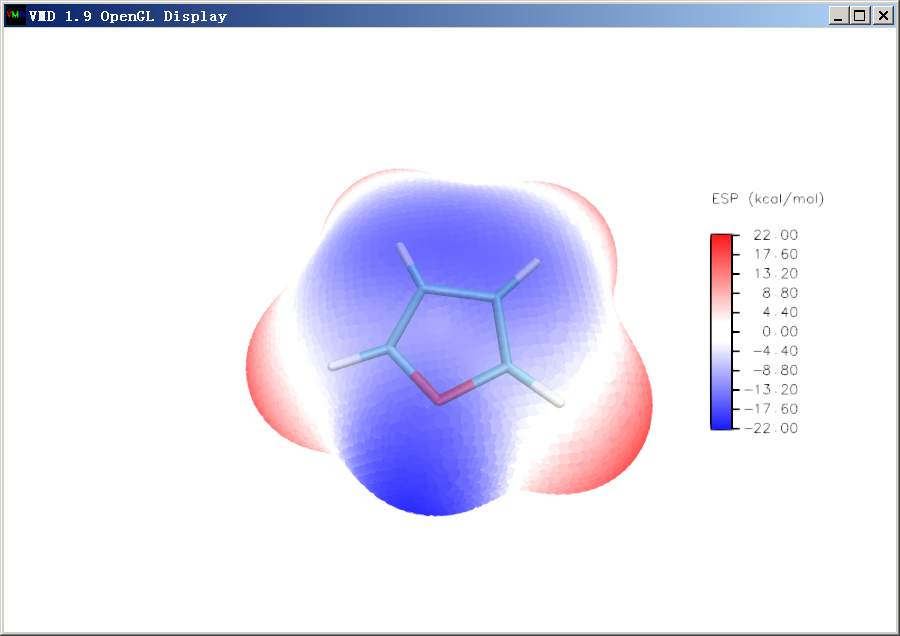

让VMD窗口里只显示出表面极值点，然后将窗口截图也粘贴进ps里成为新图层，同样将蓝色的背景选中并删掉。然后用矩形选框工具恰当地把图像主体和色彩刻度轴圈上，构图满意后点Ctrl+Q将多余的区域裁掉，目前图像如下

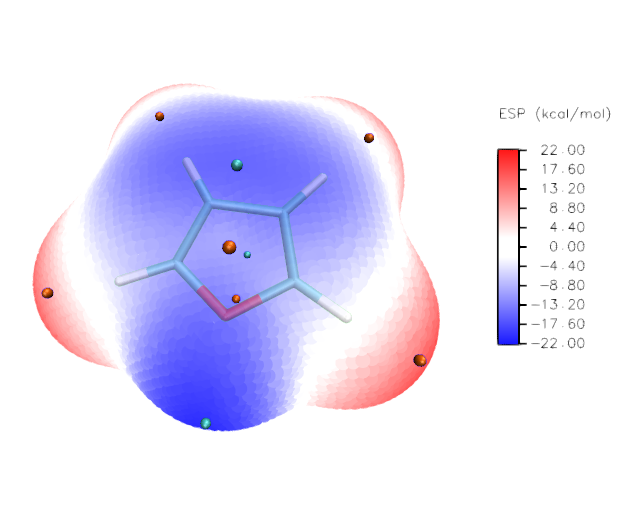

可见目前这些表面极值点无论是正面还是背面的都是以完全不透明方式展现，看不出前后。因此我们把那些明显处在背面的极值点都用矩形选框圈上，注意圈的时候一直按着shift键使选区依次累加。然后在图上点右键选Layer via Cut，这样处在图中正面（或者边缘）的极值点与处在图中背面的极值点就分别用两个图层来储存了。将后者的图层的不透明度设为50%。

最后，在图上用文本工具标上一部分极值点的静电势数值，数值在Multiwfn当中已经输出过了。如果极值点比较密，可以同时绘制箭头避免混乱。如果箭头或者文字叠加在分子表面上，为了让其边缘清楚好看，建议在图层混合选项中设定外发光。最终图像如下所示

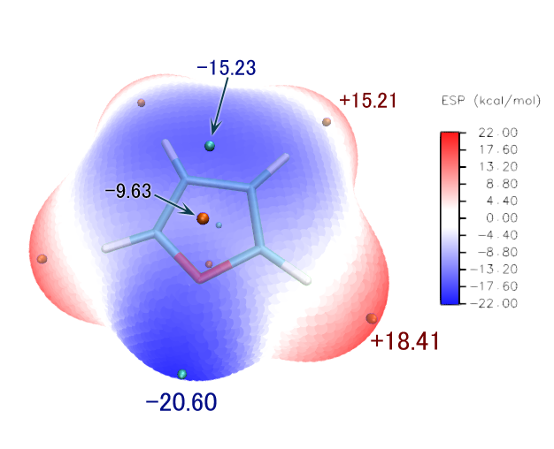

**注**：如果体系太大，不好把VMD里显示的极值点和Multiwfn输出的极值点数值对应上，就在VMD里面按键盘上的0，然后点击一个极值点，此时这个极值点的信息就会输出在VMD的文本窗口里。其中index序号是从0开始计的。对于极大点，index+1就是它在Multiwfn里的极大点序号；而对于极小点，index+1再减去极大点总数目就是它在Multiwfn里的极小点序号。对照一看一下就知道各个极值点的静电势值是多少了。

在笔者的J. Phys. Org. Chem., 26, 473-483 (2013)（<https://onlinelibrary.wiley.com/doi/abs/10.1002/poc.3111>）一文中，马兜铃酸的分子表面静电势图也是通过类似方法绘制的，比此文的例子更复杂，在这里一起贴出

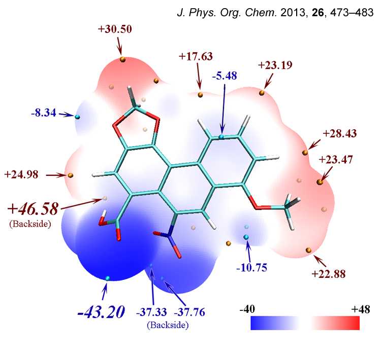

这是马兜铃酸的静电势定量分布图，显然没有呋喃分布得均匀。正值区域、静电势接近0的区域占大部分分子表面，但是也有不小面积静电势非常负，这主要是羧基和硝基的氧的明显负电荷导致的。

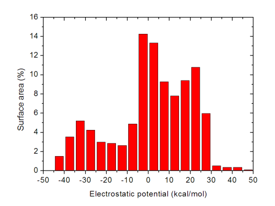

笔者在Struct. Chem., 25, 1521 (2014)（<http://link.springer.com/article/10.1007/s11224-014-0430-6>#）中给出了致癌物苯并[a]芘二醇环氧化物的分子表面静电势图，也是通过类似方法绘制的

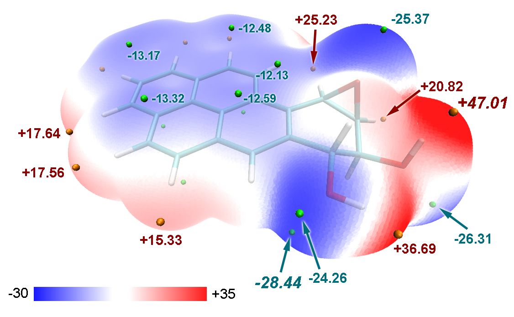

文中利用Multiwfn强大的局部定量分子表面分析功能，分别给出了此体系多环芳烃区域和其它部分分子表面上的静电势定量分布图。可见在多环芳烃部分静电势分布广度比起其它部分要窄，没有静电势特别正也没有静电势特别负的区域。绘制此图很简单，把第2节例子里输入all的地方改为输入多环芳烃区域的原子序号范围，就能得到这部分的静电势分布统计情况，然后再用这个功能对其它部分也统计静电势分布，然后把两部分静电势分布统计值都弄到Origin里一起绘制柱形图即可。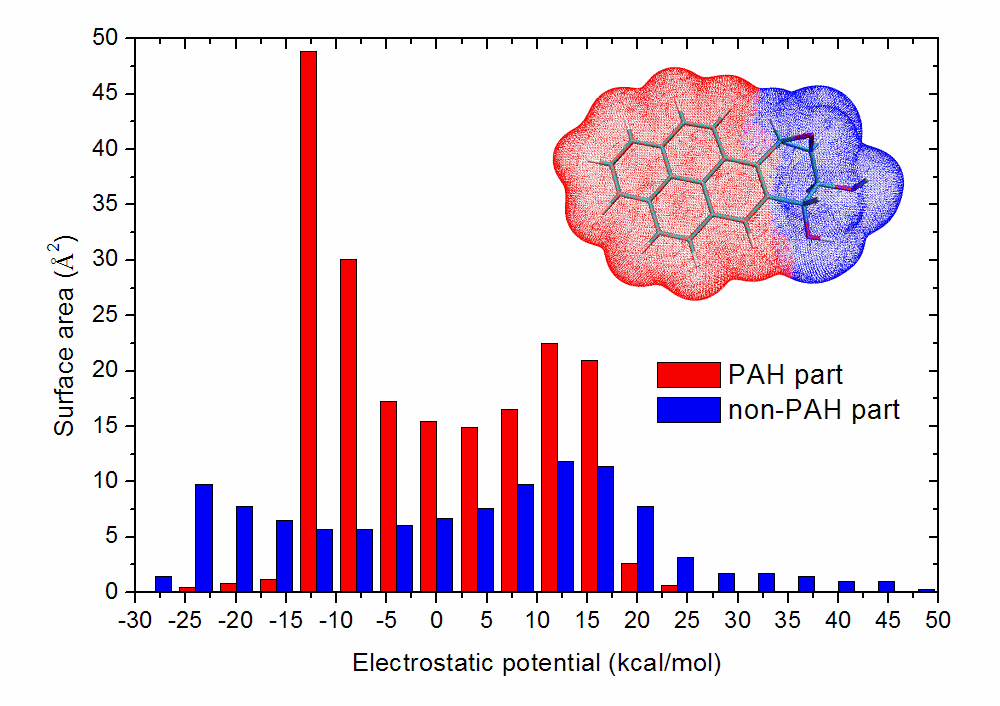

再给两个表面静电势分布统计的实际例子，都可以作为例子引用。下图是《18个氮原子组成的环状分子长什么样？一篇文章全面揭示18氮环的特征！》（<http://sobereva.com/725>）介绍的笔者的ChemPhysChem, 25, e202400377 (2024)文中的图

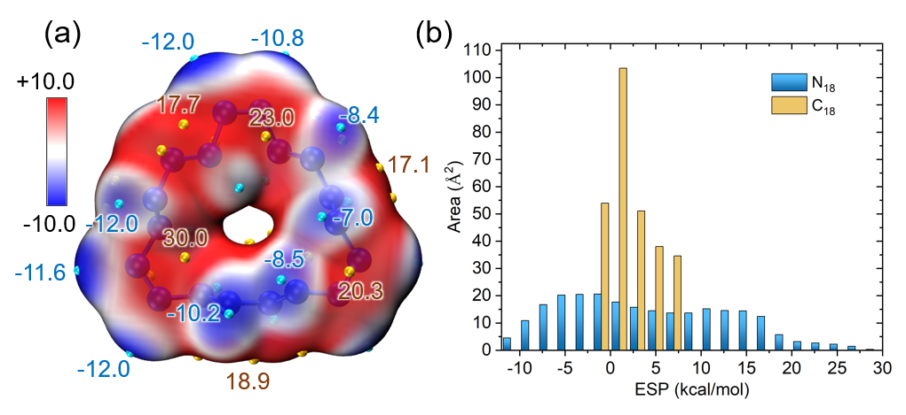

下面的图是《Multiwfn波函数分析程序的最新最全面的介绍文章已在JCP上发表！》（<http://sobereva.com/726>）介绍的2024年发表的Multiwfn原文J. Chem. Phys., 161, 082503 (2024)中的图

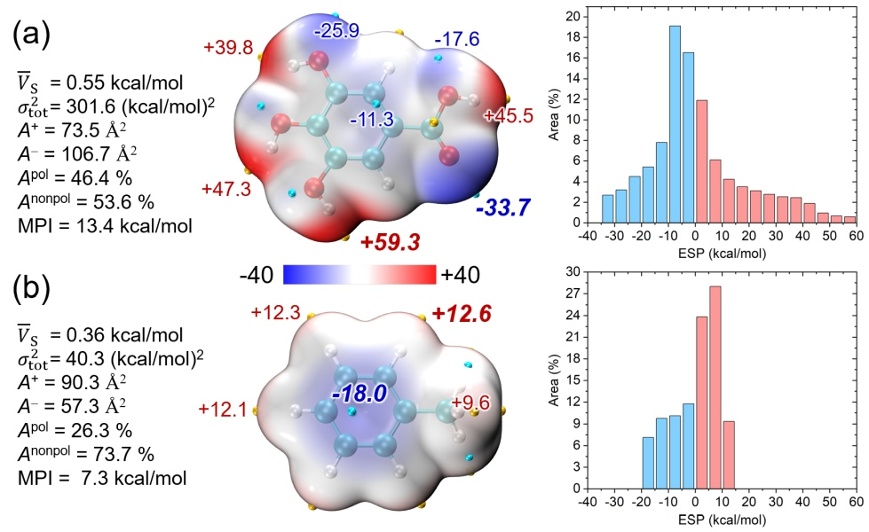

## 5 总结

本文介绍的绘制分子表面静电势图的步骤比较琐碎，需要很多手动操作，但这也是好处，使得我们可以很精细、随意地调节显示方式，而不受制于可视化程序所支持的选项。本文介绍的只是一般过程，建议大家多摸索以使显示效果更好。利用本文相同的步骤，可以绘制各种各样的实空间函数在分子表面的分布。例如绘制平均局部离子化能的图，只要在Multiwfn的定量分子表面分析功能当中选选项2，然后再选2 Average local ionization energy，之后再选0启动分子表面分析，随后的步骤和前文都一样。Fukui函数、双描述符之类实空间函数并没有出现在选项2给出的列表里，但是依然可以通过定量分子表面分析功能对它们在分子表面上的分布进行分析，并且随后结合VMD绘制成填色图，只不过操作过程稍微特殊一些，见手册4.12.4节。

如果对分子表面分析有更多兴趣，可以参看《使用Multiwfn的定量分子表面分析功能预测反应位点、分析分子间相互作用》（<http://sobereva.com/159>）。

## 6 其它1：分析范德华表面穿透程度

将Multiwfn和VMD相结合，充分开动脑筋，还可以做很多有趣、有用的分析。例如，对水的二聚体中两个水分别做定量分子表面分析，将得到的两套表面顶点都放到VMD里同时显示出来，就可以看到如下图像

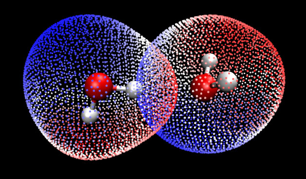

从图中可以看到两个水的范德华表面在形成二聚体后相互有明显穿透，并且是静电势明显为正（红色）区域与静电势明显为负（蓝色）区域相互穿透，这表明水二聚体间的氢键作用本质主要是由于静电吸引所导致的。

我们将视图放大，并且不让左边的水显示出来（因为它遮挡了表面顶点），然后找出两个位置比较能反映穿透程度的表面顶点，按2键，然后分别点击这两个点，这两个表面顶点间的距离就出现在图上了，如下图所示，其距离是1.12埃。这表明形成二聚体后，范德华表面总共被穿透了2*1.12埃，这叫做相互穿透距离（mutual penetration distance），其值越大通常说明弱相互作用越强。

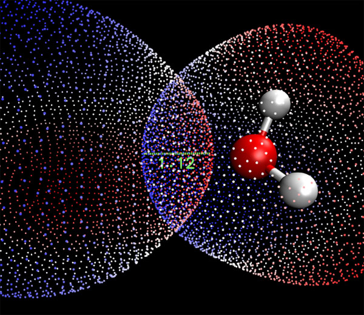

注：Mutual penetration距离其实有不同具体计算方法，最简单粗糙的是直接拿两个原子的范德华半径和减去原子间距。而本文这种计算方法无疑是最准确的，因为精确反映了范德华表面的实际形状。一个简单点的但也比较准确的方法是在Multiwfn中做完定量分子表面分析后选10得到原子的非键原子半径（non-bonded atomic radius），也就是其原子核距离范德华表面最近的距离。将相互作用的两个原子的非键半径相加减去它们的实际距离即是范德华表面相互穿透距离。

## 7 其它2：只绘制指定数值范围的分子表面

得益于VMD极其灵活的范围选择功能，可以在VMD里只显示指定数值范围的分子表面，一些看似麻烦的分析也变得极为简单。例如有的文章对卤键定义了ω角度，如下图所示，其中阴影覆盖的弧面代表卤原子分子表面静电势为正的区域。

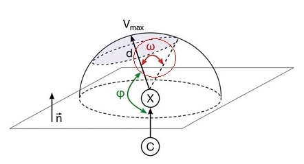

这里我们对Cl2来得到ω。按照前文所示的方法在VMD里绘制出分子表面和静电势极值点后，在对应于分子表面顶点的那个显示方式里把Selected Atoms从默认的all改为beta > 0。如前所述beta值代表相应顶点的函数值，因此这样设就会只显示出分子表面上静电势为正的部分了。然后按数字键3进入角度测量模式，依次点击静电势极大点、Cl原子，以及静电势为正的区域的边缘的任意一个顶点，图中就显示角度了，如下所示（可以在Graphics-Labels里把原子标签关掉并调整字体大小和粗细）。

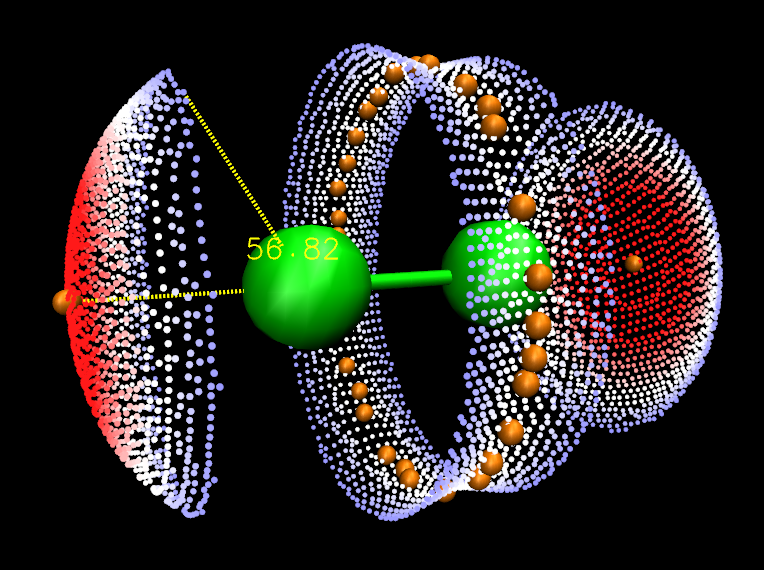

可见，对于与分子表面相关的分析来说，Multiwfn+VMD=むてき！

## 8 其它3：解决VMD绘制表面顶点时的一些显示问题

在VMD绘制表面顶点时可能会看到圆点的边缘透露出背景色，如下所示，圆点边缘是背景色黑色，导致很不美观

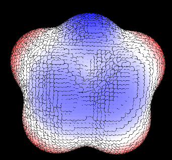

对于nvidia显卡，解决方法是在驱动控制面板里对VMD强制开启抗锯齿，并且别用FXAA方式的抗锯齿，如下所示。这么设过就和上文的图像效果一样了。

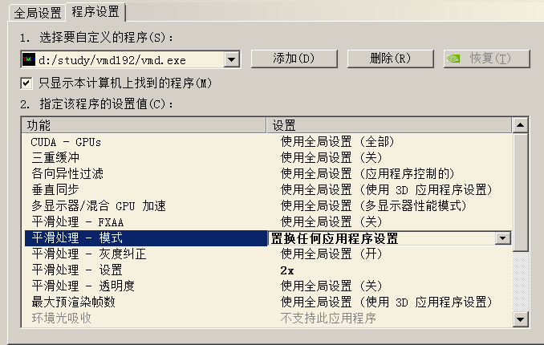

另外，当用point方式绘制表面顶点时，如果显示的是立体的大圆球，这是开了GLSL导致的，应当改用Display-Rendermode-Normal。
