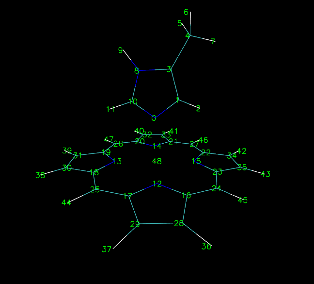

**在VMD中显示原子序号的方法**The way of displaying atomic index in VMD

文/Sobereva@[北京科音](http://www.keinsci.com)

First release: 2013-Jul-30    Last update: 2014-Jul-23

VMD虽然灵活强大，但是却没有提供一般的分子可视化软件的直接显示全部原子序号的功能，比较不方便。但是这也可以手动或者通过脚本来实现。  
  
手动实现的办法就是按数字键1，然后依次点击打算显示原子编号的原子，然后进入Graphics-Labels，选中所有条目，然后点击Properties标签页，在Format框里面输入%i。那些原子的编号就显示在图中了。如果觉得标签位置不合适，可以拖动Properties标签页里Offset里的十字使位置合适。在Global Properties标签页里可以设文字大小和粗细。修改文字颜色的方法是在Graphics-Colors里的Categories里选择Labels，Names里选择Atoms，然后再选择一种颜色。  
  
如果原子很多，则可以将以下脚本拷贝到命令行窗口运行来定义一个命令atmlab，  
proc atmlab {range id} {  
set sel [atomselect $id $range]  
set k 0  
foreach i [$sel list] {  
label add Atoms $id/$i  
label textformat Atoms $k { %i }  
label textoffset Atoms $k { -0.11 -0.0055 }   
incr k  
}  
$sel delete  
label textsize 1.2  
}  
之后，若想让所有ID为3的体系的原子编号都显示，就输入atmlab all 3。如果比如想让只有在34号原子的5埃范围以内的原子的标签显示，就输入atmlab "within 5 of index 34" 3  
运行label delete Atoms all命令可以将所有标签都删掉。  
如果想让元素名和原子编号同时显示，则把%i改为%e%i。如果想让原子编号从1开始而非从0开始，把%i改为%1i。  
  
为了省事，还可以再定义一个命令  
proc lab {} {  
atmlab all [molinfo top]  
}  
运行lab就会把top的体系的原子编号都显示。  
  

比较遗憾的是，虽然用如上方法可以显示出原子编号，但是如果用CPK之类方式显示，就会把原子标签给覆盖掉。而且标签大小没法随视角的远近变化自动缩放。
