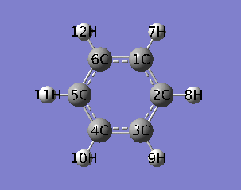
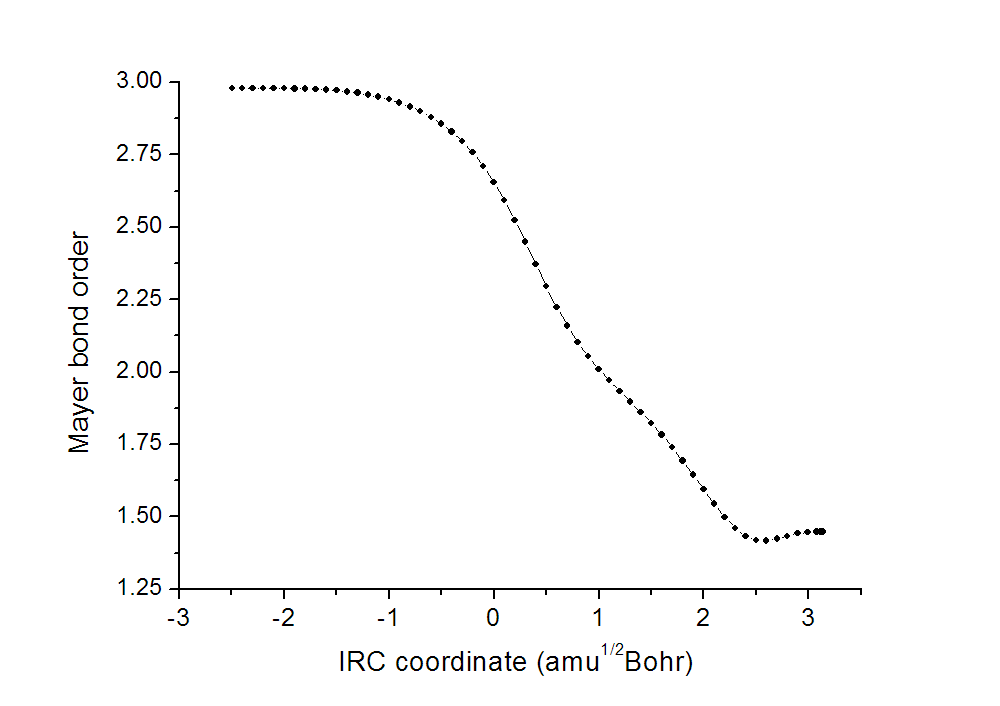
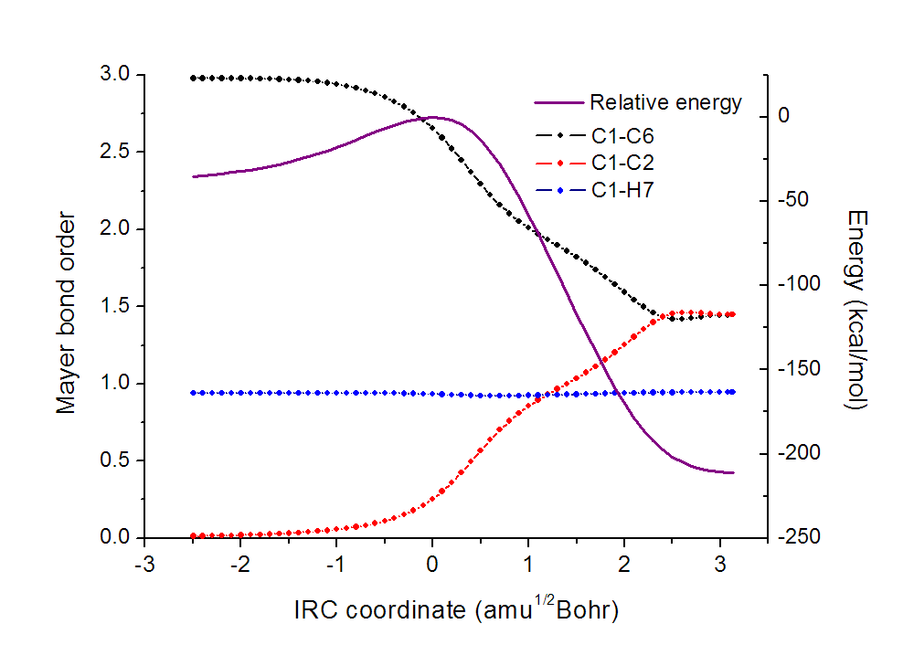
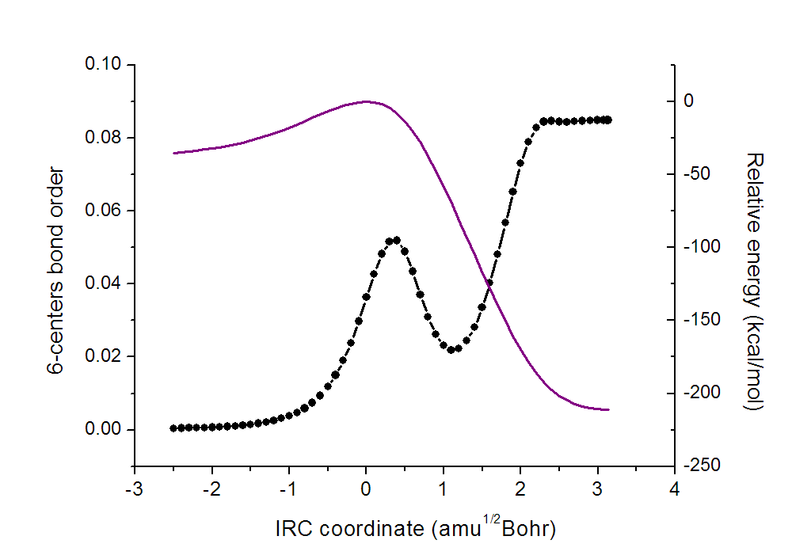
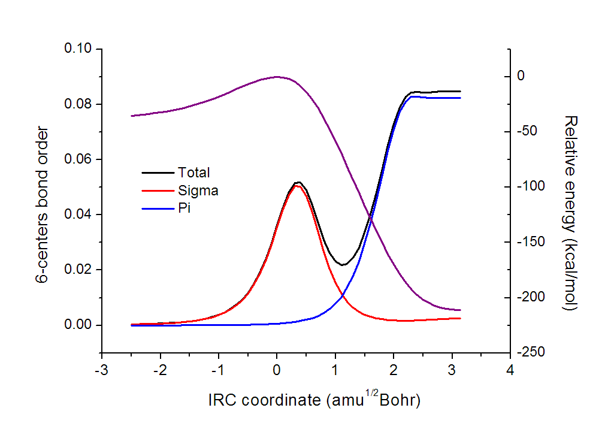
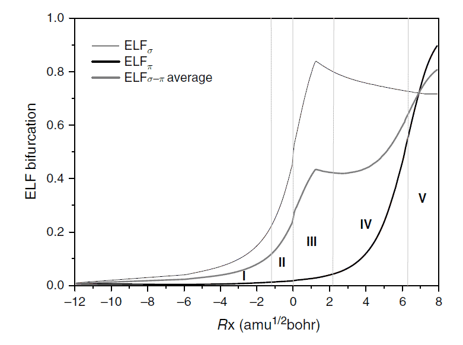
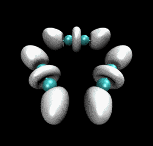
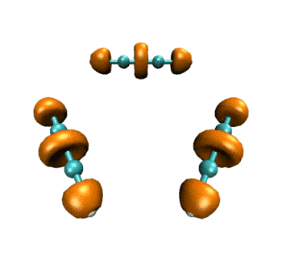
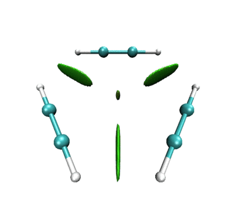
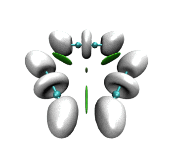

**通过键级曲线和ELF/LOL/RDG等值面动画研究化学反应过程**Studying chemical reaction process via curve map of bond order and anime of ELF/LOL/RDG isosurface

文/Sobereva @[北京科音](http://www.keinsci.com/)  2013-Sep-11

很久很久以前，寡人写过一篇帖子名为《制作动画分析电子结构特征》（<http://sobereva.com/86>）。在此帖中笔者介绍了怎么制作动画研究IRC、SCAN过程中电子结构的变化。本文算是对那篇文章的进一步扩展。这里将介绍怎么利用Multiwfn (<http://sobereva.com/multiwfn>)绘制出IRC过程中键级变化的曲线图，如何做出ELF/LOL/RDG等值面变化的动画。

在《制作动画分析电子结构特征》当中笔者获取IRC/SCAN过程中的波函数文件是通过自写Gaussian的link实现的。那个方法虽然不用每一步重新做一次单点计算，但是对于初学者来说实现起来比较困难。本文中获得IRC/SCAN过程中每个点的.wfn/.fch文件的方法是使用IRCsplit和SCANplit程序实现的，这对于初学者来说明显更容易实现（尽管需要对每个点重新做一次单点任务因而需要额外的耗时），见《产生Gaussian的IRC和SCAN任务每个点的波函数文件的工具》（<http://sobereva.com/199>），操作方法在此帖已有介绍故在本文不再详述。

本文使用Multiwfn 3.2.1(dev)版计算（不要用老版本），VMD1.9生成等值面图，G09生成波函数。Linux系统为RHEL6-U1 64bit。若未注明，操作皆在Win7 64bit下进行。本文用到Multiwfn的silent运行模式，见Multiwfn手册5.2节的介绍。也用到DOS下的批处理脚本，可以参考《从高斯windows下的批量执行谈dos批处理文件》（<http://sobereva.com/6>）一文的对DOS批处理文件的简介。

本文使用乙炔三聚化过程的IRC作为例子，对应的IRC动画如下所示。

 

PS：去过Multiwfn 2013年8月的培训班的人应该记得笔者留了个作业，就是通过各种方法研究这个三聚化过程中电子结构的变化，本文一定程度上也算是对这个作业的部分解答。

## 1 产生三聚化过程IRC路径中每个点的fch文件

IRCsplit程序包中的examples\trimerization.out就是这个三聚化过程的IRC任务的输出文件，计算由G09在B3LYP/6-31G**下完成，IRC向前和向后的路径分别有34和25个点，加上过渡态的点整个路径有60个点。IRC路径两端皆已延伸至反应物和产物极小点，分别对应三个乙炔和苯分子。利用IRCsplit程序结合标准单点任务文件examples\trimerization_SP.gjf，就可以将trimerization.out中每个点的坐标提取并生成一批新的Gaussian单点输入文件，批量运行之并经过formchk批量转换之后就可以得到每个点的.fch文件。假设这些.fch文件都放在了c:\IRC目录下，文件名为IRC0001.fch、IRC0002.fch...IRC0060.fch。

注1：由于计算Mayer键级、多中心键级都需要基函数信息，而.wfn文件不包含这样的信息，所以这里生成.fch文件而不生成.wfn文件  
注2：用IRCsplit处理之前，应当把trimerization_SP.gjf中补上nosymm关键词。这样新生成的Gaussian输入文件也就都带着nosymm关键词了。如果没有nosymm关键词，Gaussian做单点计算时由于会自动调整分子朝向到标准朝向，会导致某些点产生的.chk/.wfn文件中体系的平面和其它点不对应，随后做等值面变化动画的时候体系就会中途发生奇怪的翻转。如果不打算做等值面变化的动画的话则无需nosymm，写了它之后做单点时由于不启用对称性，计算还会多耗时很多。

## 2 绘制Mayer键级变化曲线

我们先绘制Mayer键级变化曲线。由于Multiwfn默认只输出>0.05的Mayer键级，所以需要修改settings.ini文件，将bndordthres参数改为0.0，之后所有键级就都会输出了。Multiwfn中计算Mayer键级的过程是输入9然后输入1，为了批量计算，我们写个文本文件（假设叫batch.txt）放在Multiwfn所在目录下，文件内容只有两行，即为  
9  
1  
然后写个文本文件（假设叫batchrun.bat，即批处理文件）放在Multiwfn目录下，内容为  
for /f %%i in ('dir c:\IRC\*.fch /b') do Multiwfn c:\IRC\%%i < batch.txt > c:\IRC\%%~ni.txt  
之后，双击batchrun.bat图标，Multiwfn就会依次使用那些.fch文件计算Mayer键级，输出信息依次产生在c:\IRC目录下的IRC0001.txt、IRC0002.txt...IRC0060.txt里面。

将这些输出文件拷贝到Linux系统某文件夹下，并在这个文件夹下运行  
 grep "1(C )    6(C )" * > out.txt  
所有IRC点上的C1-C6键级就都存到out.txt了。用Ultraedit的列模式（或者诸如Linux的awk命令）只把out.txt的最后一列提取出来，然后导入到诸如origin之类作图程序里。然后我们从trimerization.out的末尾可以看到这样的信息  
    Summary of reaction path following  
 --------------------------------------------------------------------------  
                        Energy   Rx Coord  
   1                   -0.05598  -2.49599  
   2                   -0.05520  -2.39872  
   3                   -0.05432  -2.29904  
...  
  59                   -0.33639   3.13057  
  60                   -0.33639   3.13555  
其中Energy就是相对于过渡态能量的每个点的能量，单位为a.u.。Rx Coord是反应坐标。用Ultraedit的列模式把Rx Coord那一列的数据也提取出来导入到origin里。之后，在origin里绘制曲线图，X轴就是Rx Coord值，Y轴就是键级数据，就得到了下图

横坐标零点对应于过渡态。可见，随着反应的进行，键级由3.0左右不断降低到1.5左右，体现出乙炔的三重键逐渐变成苯上的C-C间的1.5重键。而且反应过程一开始（乙炔相互接近并略微变形）和最后（氢原子位置调整）过程中键级变化不大，在反应中途明显涉及到新C-C键形成旧C-C键削弱时键级变化才迅速。

通过执行grep "1(C )    2(C )" * > out.txt以及grep "1(C )    7(H )" * > out.txt，我们以类似方法把C1-C2和C1-H7键级变化也提取出来并一起绘制到图上。为了便于分析，能量变化曲线也一起画上去。如下所示

可见原本没成键的C1-C2和原先的三重键C1-C6最后键级都变得一致了，约1.5。由于C-H键在反应过程中没有直接受到影响，所以键级一直基本约为1.0。

我们还可以通过比如grep "Atom     1(C )" * > out.txt将C1的原子价导出并用于作图。对于这样的闭壳层体系，原子价就是相应原子涉及的所有键的键级加和。我们可以看到尽管每个C-C键的键级都变化了很大，但碳的原子价一直接近于4.0，没有明显波动，表现了反应过程中总键级守恒性，也就是键级会此消彼长，一个键的增强伴随着另一个键的等量削弱。

有兴趣的读者建议也自行尝试绘制下拉普拉斯键级(LBO)、离域化指数、各种原子电荷、AIM键临界性质等属性随着反应进行的变化曲线。

## 3 绘制多中心键级变化曲线

我们还可以研究乙炔三聚化过程的碳原子六中心键级的变化。把前述的batch.txt文件内容改为  
9  
2  
1,2,3,4,5,6  
然后还是运行batchrun.bat，并且把生成的.txt文件都弄到Linux某文件夹里，然后进入此文件夹并运行  
 grep "The bond order is" * > out.txt  
提取out.txt中的最后一列六中心键级数据，并结合能量变化一起作图，如下所示

显然乙炔三聚体肯定没有6中心键，所以一开始六中心键级为0。形成苯之后六中心键级达到了最大值，因此苯环上的电子很容易整体离域，这也是为什么苯具有极强的芳香性。在三聚化的过程中六中心键级的变化比较奇特，并不是单调增加的，而是在过渡态稍靠后一些的位置上有个局部极大点，其原因何在？对于平面体系，多中心键级可以精确分离为sigma和pi多中心键级，我们不妨把它们分别绘制出来，看看sigma电子和pi电子在反应过程中是如何影响总多中心键级的。

我们先计算sigma多中心键级。这个过程需要利用Multiwfn主功能100里的子功能22，它会自动将平面体系的pi轨道找出来，选择把pi轨道占据数都设成0，之后再算多中心键级，得到的就是sigma多中心键级了。具体来说还是修改batch.txt文件，将内容改为下面这样  
100  
22  
0  
1  
0  
9  
2  
1,2,3,4,5,6  
然后再次按照如上过程运行batchrun.bat并提取数据，就得到了sigma多中心键级。

接下来算pi多中心键级，操作和上面完全一样，只不过用到的batch.txt文件内容改为下面这样，计算多中心键级前就会把所有pi轨道以外的轨道的占据数都设成0来扣除它们的贡献  
100  
22  
0  
2  
0  
9  
2  
1,2,3,4,5,6

把sigma和pi多中心键级和之前的图作到一起，如下所示

可以看到，之所以在过渡态稍靠后一些的位置六中心键级有个局部极大点，是因为sigma电子造成的。然后随着反应的继续进行，sigma电子的离域性迅速衰退，在形成苯之后sigma离域性几乎可忽略不计，因此苯没有sigma芳香性。pi电子的离域性则是随着反应的进行单调增强的，但是增强基本是在过渡态以后才比较明显，到了苯的基本结构快要形成阶段增强得极快，显示出苯的pi芳香性的迅速形成。

本节研究结论和ELF、ELF-pi、ELF-sigma对此问题的研究结论定性一致，如下所示，有兴趣者可以参看Theoretical Aspects of Chemical Reactivity的第五章。用多中心键级来研究芳香性比起用ELF方便、省时得多，而且比较上图和下图也可以看出多中心键级的结果更为清楚，ELF-sigma的曲线会让不熟悉ELF的人会误以为即便形成了苯之后仍然有很强的sigma芳香性。多中心键级是笔者最为推荐的研究芳香性的方法。

另外，有兴趣的读者也建议通过Multiwfn来计算其它各种芳香性指标在这个三聚化过程中的变化，Multiwfn能算的芳香性指标多达十余种，详见《衡量芳香性的方法以及在Multiwfn中的计算》（<http://sobereva.com/176>）。

## 4 制作ELF等值面图变化的动画

本节将要绘制乙炔三聚化过程中电子定域化函数(ELF)等值面图变化的动画。制作ELF平面图的动画在《制作动画分析电子结构特征》中已经详细介绍了，这里就不再谈怎么做了。制作等值面图的动画很重要，可以让函数在三维空间中的变化看得很清楚。对于当前的例子，既涉及到sigma电子又涉及到pi电子的变化，如果作平面图就得做至少两个平面上的动画才行，既麻烦也不直观。

首先需要生成每个点对应的ELF的cube文件。把前述的batch.txt改为以下内容  
5  
9  
2  
2  
再将前述的batchrun.bat批处理文件改为如下内容，  
for /f %%i in ('dir c:\IRC\*.fch /b') do (  
Multiwfn c:\IRC\%%i < batch.txt  
rename ELF.cub %%~ni.cub  
)  
然后双击运行此文件，将会在当前目录下产生IRC0001.cub、IRC0002.cub...IRC0060.cub。

这里用VMD程序来产生每个cube文件对应的等值面图像文件。把刚得到的cube文件都移动到VMD所在目录下面。在VMD目录下写个文本文件isoall.tcl，内容如下  
set isoval 0.8  
axes location Off  
for {set i 1} {$i<=60} {incr i} {  
set name IRC[format %04d $i]  
puts "Processing $name.cub..."  
mol default style CPK  
mol new $name.cub  
scale to 0.3  
rotate x by -30  
translate by 0.000000 0.20000 0.000000  
mol addrep top  
mol modstyle 1 top Isosurface $isoval 0 0 0 1 1  
mol modcolor 1 top ColorID 8  
render snapshot $name.bmp  
mol delete top  
}  
脚本开头isoval用来设定等值面的数值，这里对应于绘制ELF=0.8的等值面。for {set i 1} {$i<=60} {incr i}代表这里要处理编号为0001到0060的cube文件。脚本中scale to、rotate x by、translate by都是用来调节视角的。对于其它体系应根据实际情况对参数进行适当调整。

启动VMD后在VMD的控制台里面运行source isoall.tcl，在VMD目录下就会输出IRC0001.bmp、IRC0002.bmp...IRC0060.bmp。图像尺寸和当前VMD窗口大小是一致的。

然后随便找个视频制作软件将这些图片合成动画就行了，诸如会声会影。为了便于放在网页上，这里通过Linux下的convert工具制作成.gif动画。也就是把所有生成的bmp文件拷到Linux下某文件夹，然后进入此文件夹并运行  
convert -resize 300 -delay 12 -colors 30 -monitor *.bmp ELF_IRC.gif  
很快就得到了动画文件ELF_IRC.gif，如下所示。convert命令的使用详见《制作动画分析电子结构特征》里的介绍。

从动画中可以看到一开始乙炔上的三重键对应于血小板形状的高定域性区域，随着反应的进行，血小板形状逐渐收缩成哑铃状（体现出sigma键+部分pi键特征），同时相邻的乙炔间的未成键C-C之间也逐渐出现了同样的哑铃状等值面。这个动画清楚地展现出反应过程中化学键是如何形成、变化的。

## 5 制作LOL等值面图变化的动画

制作LOL等值面变化的动画和上一节的过程几乎没有差异，把所用的脚本稍微变一下就行了。  
batch.txt改为以下内容  
5  
10  
2  
2

batchrun.bat批处理文件改为如下内容，  
for /f %%i in ('dir c:\IRC\*.fch /b') do (  
Multiwfn c:\IRC\%%i < batch.txt  
rename LOL.cub %%~ni.cub  
)

isoall.tcl改为如下内容  
color Display Background white  
set isoval 0.6  
axes location Off  
for {set i 1} {$i<=60} {incr i} {  
set name IRC[format %04d $i]  
puts "Processing $name.cub..."  
mol default style CPK  
mol new $name.cub  
scale to 0.4  
rotate x by -30  
translate by 0.000000 0.20000 0.000000  
mol modstyle 0 top CPK 0.500000 0.300000 12.000000 10.000000  
mol addrep top  
mol modstyle 1 top Isosurface $isoval 0 0 0 1 1  
mol modcolor 1 top ColorID 3  
render snapshot $name.bmp  
mol delete top  
}

最终得到的动画如下所示。表现的电子结构的变化和ELF是基本一致的。  

作为练习，建议大家尝试绘制电子密度拉普拉斯函数、ELF-pi、变形密度等实空间函数在此IRC过程中的变化，方法是大同小异的，稍微改下脚本就能实现。只要能作出一个波函数文件对应的图，就肯定能直接作出整个IRC过程的变化图。

## 6 绘制RDG填色等值面变化

约化密度梯度(RDG)填色等值面图对于研究弱相互作用非常有用而且直观，在《使用Multiwfn图形化研究弱相互作用》（<http://sobereva.com/68>）和《使用Multiwfn研究分子动力学中的弱相互作用》（<http://sobereva.com/186>）当中有十分详细的讨论。虽然化学反应主要是强相互作用范畴，但是研究这个过程中的弱相互作用也是有益的。

制作RDG填色等值面变化的动画和前面两节的流程也是完全一致，区别仅在于所用脚本。batch.txt的内容应改为  
100  
1  
15,13  
-10  
2  
2  
3

batchrun.bat批处理文件改为如下内容  
for /f %%i in ('dir c:\IRC\*.fch /b') do (  
Multiwfn c:\IRC\%%i < batch.txt  
rename func1.cub f1_%%~ni.cub  
rename func2.cub f2_%%~ni.cub  
)

isoall.tcl改为如下内容  
color Display Background white  
color scale method BGR  
set isoval 0.5  
axes location Off  
for {set i 1} {$i<=60} {incr i} {  
set name IRC[format %04d $i]  
puts "Processing f1_$name.cub and f2_$name.cub..."  
mol default style CPK  
mol new f1_$name.cub  
mol addfile f2_$name.cub  
scale to 0.4  
rotate x by -30  
translate by 0.000000 0.20000 0.000000  
mol modstyle 0 top CPK 0.500000 0.300000 12.000000 10.000000  
mol addrep top  
mol modstyle 1 top Isosurface $isoval 1 0 0 1 1  
mol modcolor 1 top Volume 0  
mol scaleminmax top 1 -0.04 0.02  
render snapshot $name.bmp  
mol delete top  
}

做出的动画如下  

一开始相邻乙炔之间以及三个乙炔中央有绿色RDG等值面，体现的是它们之间的范德华相互作用。当反应开始，三者相互接近，等值面由绿变蓝，说明分子间开始呈现较强吸引作用。并且中间的小等值面由绿变棕，说明三个乙炔间开始出现了一定位阻，这对反应的进行会有所阻碍。由于默认情况下，Multiwfn计算RDG的时候会屏蔽掉密度较高的区域，所以当相邻的乙炔间开始形成C-C键故而电子密度骤增后，相应的RDG等值面在动画中就消失了。但是在体系中央的那个RDG等值面依然存在，且越变越红，说明形成苯环过程中环的位阻是愈发增大的。

## 7 绘制RDG填色等值面+ELF等值面的变化

一般认为RDG主要用处是表现弱相互作用，而ELF又只能表现强相互作用，在JCTC,8,3993(2012)中作者提出可以将这两种函数的等值面同时绘制在一起，这样图中就把强、弱相互作用一起表现了，就显得更完整了。这里我们也绘制这样的RDG+ELF等值面的动画。

把本文第4节产生的ELF格点数据IRC0001.cub、IRC0002.cub...IRC0060.cub，以及我们刚才产生的名字为f1_xxxx.cub、f2_xxxx.cub这些格点数据一起放到VMD目录下。然后将isoall.tcl改为如下内容  
color Display Background white  
color scale method BGR  
set isovalRDG 0.5  
set isovalELF 0.8  
axes location Off  
for {set i 1} {$i<=60} {incr i} {  
set name IRC[format %04d $i]  
puts "Processing $name.cub, f1_$name.cub and f2_$name.cub..."  
mol default style CPK  
mol new f1_$name.cub  
mol addfile f2_$name.cub  
mol modstyle 0 top CPK 0.500000 0.300000 12.000000 10.000000  
mol addrep top  
mol modstyle 1 top Isosurface $isovalRDG 1 0 0 1 1  
mol modcolor 1 top Volume 0  
mol scaleminmax top 1 -0.04 0.02  
mol new $name.cub  
mol modstyle 0 top Isosurface $isovalELF 0 0 0 1 1  
mol modcolor 0 top ColorID 8  
scale to 0.3  
rotate x by -30  
translate by 0.000000 0.20000 0.000000  
render snapshot $name.bmp  
mol delete top  
mol delete top  
}

做出的动画如下  

可见RDG和ELF等值面有机地融合到了同一个画面上。当描述弱相互作用的RDG等值面消失后，马上ELF等值面就出现了，很好地表现出弱相互作用到强相互作用的无缝转换。这样的动画特别是对于研究化学反应过程明显涉及弱相互作用的情况十分有帮助，比如反应物或产物结构是复合物、反应过程涉及到氢键形成与断裂。

## 8 总结

本文以乙炔三聚化过程为例通过绘制键级变化曲线、制作ELF/LOL/RDG等值面动画展现了怎么研究IRC过程中电子结构变化。SCAN过程、几何优化过程、分子振动过程、从头算动力学过程等等动态过程中电子结构、分子属性或分子间相互作用等方面的变化也都可以对相应的性质绘图来表现。无论是把曲线图放在正文中还是把动画放在补充材料里，都可以使研究内容更充实、细致、深入、直观易懂。对于量子化学的外行、本科生们，通过这样的图形描述，也可以让他们迅速、清楚地了解到究竟化学过程中发生了什么，比起一堆抽象的数据和语言描述也有趣得多。

作这些图其实在技术上都没有什么难度，根据以上例子和《制作动画分析电子结构特征》里的例子，在理解每一步操作的基础上举一反三，多查阅资料即可。如果遇到实在解决不了的技术问题也可以直接写邮件给笔者([sobereva@sina.com](mailto:sobereva@sina.com))。另外需要提醒的是，对于实际研究的体系作图时切勿直接照搬本文提供的VMD脚本，很多作图设定需要自己修改才能达到满意效果，所以应该弄懂脚本的含义。

Multiwfn能计算的性质、绘制的图数不胜数，诸如电荷、原子多极矩、自旋布居、轨道成份、AIM盆或模糊空间的定域/离域化指数、分子表面定量性质、临界点位置和性质、键径、电子密度图、能量密度图、分子/原子体积、片段差值图等等等等，他们在化学过程中的变化都很值得分析，必定能由此得到很有意义的发现并带来新观点。希望本文的例子能给读者带来一些启发。研究化学反应不应局限在算个渡态结构和势垒，然后顶多再算个IRC就了事的程度，实际上还有无数有用的信息有待进一步挖掘、还有丰富多彩的展现化学反应过程的角度。
