**Multiwfn 2013年暑期培训班感想与杂谈**

文/Sobereva   2013-Sep-17

在2013年8月13日至15日，在北京科技大学召开了第一届波函数分析暨Multiwfn培训班，此文就随便、没有条理地谈谈此次培训班的感想以及展望。

此次培训班全部所用的幻灯片，包括现场演示的一些动画可以在此处下载<http://pan.baidu.com/share/link?shareid=759751855&uk=1074012119>。

培训的时候正赶上帝都最热的时候，完全就是桑拿，随便出门走走就浑身湿透，学员从全国各地跑来也真是辛苦。虽然个人喜欢在冬天办活动，不过寒假又短又有春节，也不得已只能在暑假进行。

培训时的一些照片如下

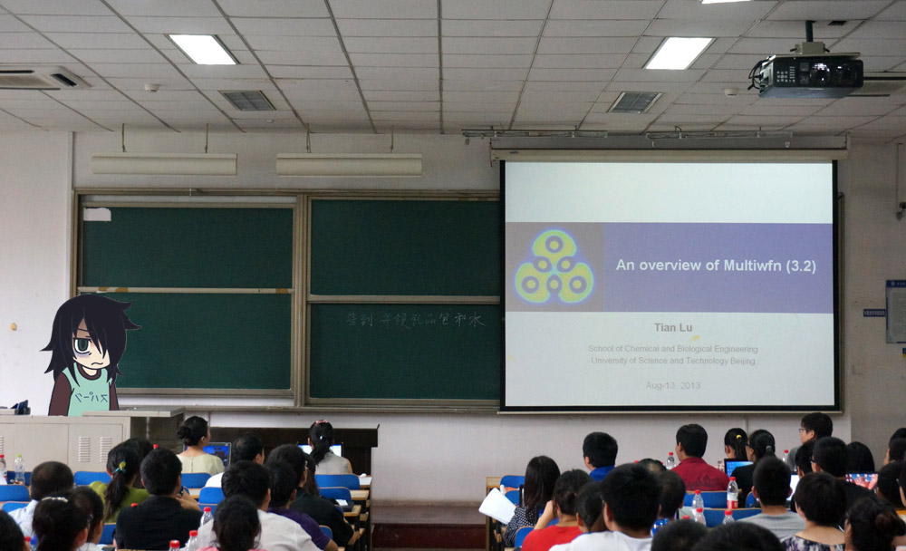  
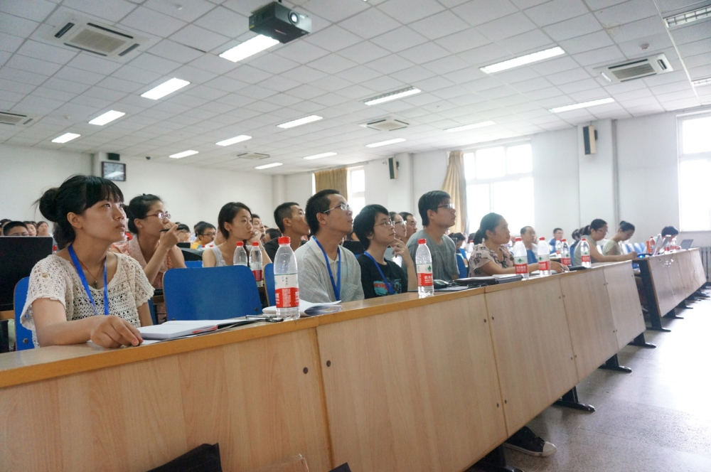  
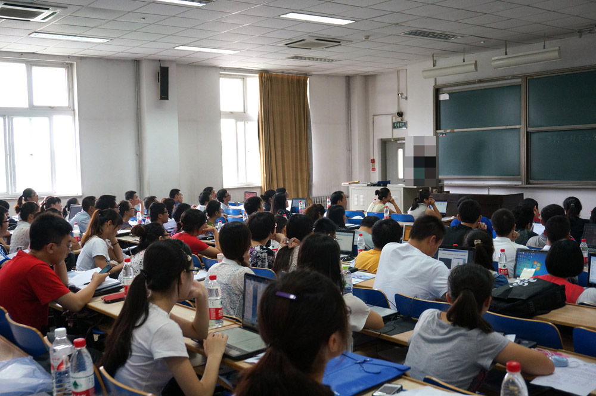  
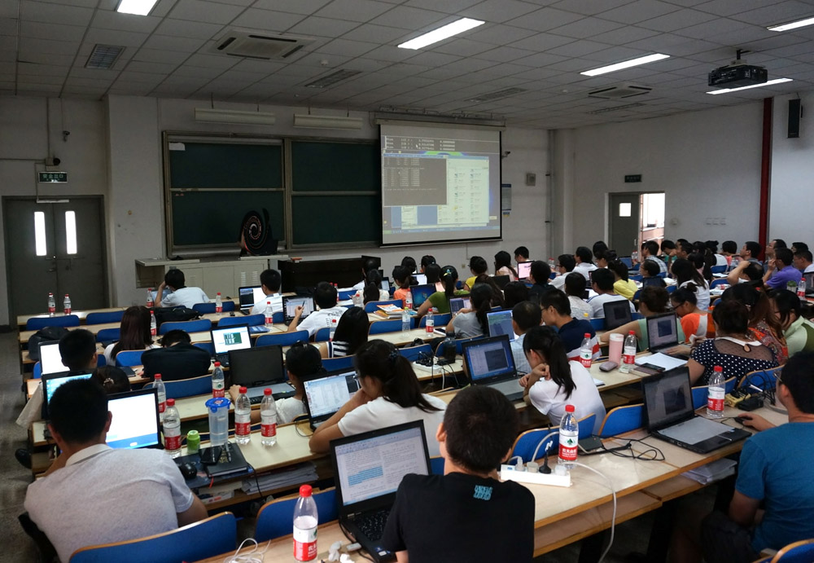

这次培训班实际上已经酝酿已久。在2011年的时候，就打算找个机会开个Multiwfn培训班。起初打算先弄个非正式的第0届培训，也就三四十人的规模，但一直时机不成熟。这次很不容易终于开了培训班，而且从全国各地来了多达120余人，最后比较圆满顺利地结束。对于第一次弄培训班来说，这挺难得。这个波函数分析&Multiwfn培训班不仅仅这一次，肯定会一直办下去。

本次培训完全免费，食宿完全由学员自己负责。不统一安排食物一方面是因为没钱给大家提供，二是也没这个必要（虽然有违国内培训/会议的传统），因为开各种学术会议，与会者往往会吐槽统一供应的食物不佳，经常主动在外面吃。

除了13号到15号白天的讲课外，在每天晚上，以及16号全天也都提供了答疑、讨论时间。参与讨论的人众多，一点空闲都没有，其中一天晚上甚至还畅谈到了夜里11点。和年轻的计算化学工作者讨论感觉相当不错，气氛相当自由愉快。

最初打算办这个培训班的时候本来打算为期两天，本以为内容不多，两天就够了，甚至还富裕。但是到了培训第二天才发现失算了，讲的进度明显落后于预期，稍微在机子上演示一下时间就迅速过去了。结果只好演示得比较快，去掉不少例子，学员自行练习的时间和当场答疑的时间也都迫不得已去掉了，即便如此最后还有不少主题没法讲而只能被迫一带而过，这着实有些遗憾。之所以在时间安排上会失算，其实也正体现了波函数分析内涵之丰富，Multiwfn功能之强大，以至于三天根本介绍不完。

实际讲课的时间按排如下所示。其实这个安排和本人最初的预计有天壤之别，到第二天和第三天，是一边讲一边修改后续的时间安排。

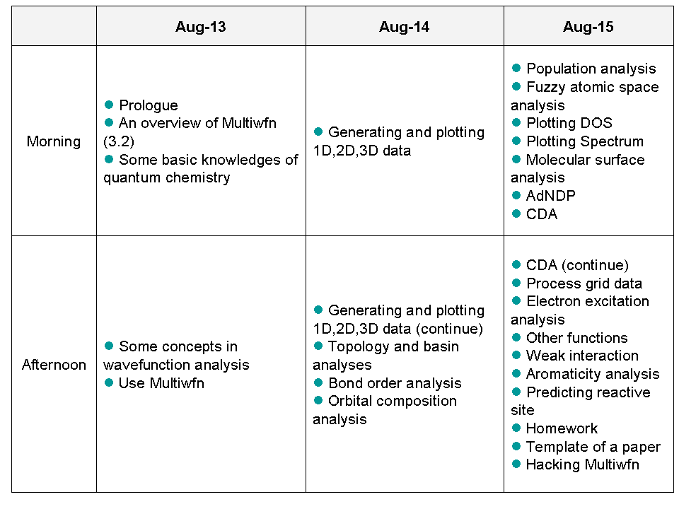

第一天上午先把Multiwfn程序的基本功能非常简略地介绍了一遍，目的是给学员一个对Multiwfn的初步、总体的认识。随后讲了量子化学的基本知识，目的是为了在学习后面的内容的时候不会感到有基础知识上的障碍。第一天下午介绍了波函数分析的许多重要概念，但是有一部分概念是在随后两天结合着Multiwfn的具体的模块一起讲的。第一天最后讲了讲Multiwfn的使用上的基本知识，比如怎么安装、怎么生成波函数文件之类。

第二天和第三天以现场演示，结合少量理论讲解为主。第二天上午一直在讲怎么绘制实空间函数，虽然看起来没有太多好讲的，起初也只留了大概两节课的时间，但讲起来才发现，要演示的例子、要讲解的选项太多，结果讲了一上午还没完全讲完，这也是因为Multiwfn的用处太大、灵活度太高所致。下午接着将之讲完后，就讲拓扑分析和盆分析模块、键级分析、轨道成分分析。

第三天安排得相当紧，讲了布居分析、模糊空间分析、绘制态密度、绘制光谱、分子表面分析、AdNDP（一带而过）、CDA、格点数据处理、电子激发分析、杂项功能、弱相互作用分析、芳香性分析（一带而过）、反应位点预测。然后还给大家留了个作业题，让大家结合本次培训所学的知识研究乙炔三聚化过程中电子结构的变化。本来想好好讲讲怎么修改Multiwfn的代码，幻灯片做了很多，结果最后只能花10分钟时间随便一带而过了。

第三天下午很简略、随意地介绍了一下如何撰写名为A theoretical investigation on XX或XX: A DFT / ab initio study （XX代表某个新颖体系）的文章。当时用的幻灯片做了较大修改，在这里可以下载最新的：<http://pan.baidu.com/share/link?shareid=4238984030&uk=1074012119>。这是个颇有特色的讲授内容，以前肯定从没人这么介绍过。说实话，凡是以这种标题为名的文章，90%以上都是灌水文章。我讲这个绝非想让学员灌水，特别在幻灯片最后一页还用大字写明：“灌水可耻”。之所以讲这个，是希望学员能开阔思路，随便找个分子，脑子里就能想出通过波函数分析手段拿Multiwfn程序能去分析它的哪些方面获得有价值的信息。其实，拿Gaussian一通算，然后用Multiwfn做一通分析，一篇文章的数据量就够了，写写这样的文章作为练习，比如让研究生练练手是很有益的，但是若这样翻来覆去在期刊上灌水，比如换个元素灌一篇、换个基团灌一篇，这样绝对是学术界的祸害。我希望用户通过Multiwfn程序能得到有益的结论、有创新性的观点，而不是将之作为灌水的利器。

开这个培训班最主要的目的就是在中国普及波函数分析方法，让广大计算化学工作者了解到Multiwfn的基本使用，并投入到实际研究中。如果说量子化学计算计算出的波函数相当于合成出的化合物，那么波函数分析就可以形象地比喻成化合物的表征。合成出一个物质，不表征就什么有益的信息也不知道；同样地，计算出个波函数，不进行波函数分析，那么对于体系的电子结构本质特点、各种属性就一无所知，或者只能知道个皮毛。很多人通过量子化学研究问题的手段都显得十分单一、贫乏，比如就是优化个结构，比比能量，算个过渡态，算个光谱，看看分子轨道之类的，实际上更多更本质的信息全都藏在波函数里，结果波函数却被弃之不顾，这显然不应该，研究文章的分析讨论自然也显得肤浅。比较遗憾的是，如此重要的波函数分析在我国普及程度极低，其原因在《杂谈Multiwfn从1.0到3.0版的开发经历》（<http://sobereva.com/180>）中已经详细讨论过。

在和一些研究生学员的讨论中，也包括我个人的一些感受，深感现在中国的量化的大龄圈子里，不仅不重视波函数分析，甚至还带有歧视色彩。大多数中国大龄理论化学研究者，具体来说是指>40岁的人，大多感觉波函数分析是异端，属于非主流，没有前景，市场狭窄。我对此深感失望。之所以有这种局面，可以说很大程度上是因为这些人年轻时没接触过波函数分析，上了年纪之后，看到新的自己不懂的东西又不愿接受，盲目排斥而固执于自己的研究方法。殊不知不与时俱进，不敏锐地捕捉未来的主流，眼界将会愈发狭隘。讨论的时候有一个年轻的学员向笔者诉苦，说自己研究方向是团簇，很喜欢用波函数分析方法研究，认为直观、容易理解、还可以提供更深入的信息，是以后研究团簇的新的方向，但是其老板坚决反对，认为他用波函数分析来研究是在胡搞，偏让他按老套路，摆摆构型，高精度算算能量比较下就完事，他深感，这种老套的研究方式是不行的，毫无新意，根本说明不了什么根本问题。然而他又是个个性鲜明，勇于坚持于自己观点，不愿违心地附和他人的人，结果因为研究思想的不同跟其老板闹翻。听到此事，令寡人对如今的现状很是无奈。我只好建议他，先按老套路出点文章应付他老板，然后坚持按照他自己的想法利用波函数分析去做。波函数分析的推广普及是一件长期、艰难、任重而道远的事情，但是绝对是正确、有益的事情，波函数分析是前途无量的。虽然它普遍不被大龄研究者们所接纳（这些人已经从波函数分析的推广对象中被排除），但是我高兴地看到，我国年轻的量子化学工作者普遍是乐于学习、使用波函数分析的。将波函数分析在如今的年轻人心中播下种子，想必到他们成长为量子化学研究的中坚力量时，波函数分析的价值的认知度、流行的程度已经有了天翻地覆的变化。

我坚持理论和实践一定要结合起来。波函数分析的书在国际上不少，相关文章不断大量发表，愈来愈多，但是没什么好用的程序，导致不少人光是看懂了理论，结果根本没法用起来。Multiwfn的存在彻底扭转了这个局面，让波函数分析理论不再停留在纸面上，而是成为研究理论化学问题强有力的工具。所以这次培训班，在后两天时间内，都是对于每个主题先简要介绍完有关基本理论后，马上通过实际问题进行演示，既了解了程序的操作，也通过实例能够进一步感受波函数分析的实际应用价值。

本以为参加培训的都是搞量化的，至少知道一些最基本的量化知识。但是发现，有不少人只是听说过却从没接触过量化，比如有的人纯粹是做经典力场的分子动力学的。虽然为了降低门槛，在培训的第一天先把量子化学最基本的内容回顾了一遍，但是感觉这样还是不够，把量化的基本内容即便用最浅显的语言、尽量不涉及数学公式来讲，对于零基础的人，想在2两节课内就讲明白，还是不够现实。我也觉得，肯定有很多初学者也想能有个培训班，能把量子化学从零讲起，不在幻灯片上堆砌一大堆量化书本上枯燥的数学公式，而是能尽可能多的通过语言结合最基本的公式把量化的梗概、思想说明白。基于这个考虑，我打算把下一次Multiwfn培训班弄成2+4天的形式。前两天纯粹讲量化入门知识，只要化学系本科毕业就能听懂，听过两天之后，就能把量子化学的基本框架搞明白，了解HF、后HF、DFT、基组、几何优化、振动分析、激发态之类的概念/原理。这样，如果是毫无基础，就从培训班第一天开始听，而对于量化已经入门的人，直接从第3天开始听就行了。同时，讲波函数分析就有4天时间，讲的时候就可以慢条斯理了，大家也能够理解得更细致透彻了。

这次连讲三天个整天，每天再加上答疑，感觉比较辛苦，不过没有想象中的那么严重。不知连讲6天会不会撑得住...辛苦虽然辛苦，不过全都讲完之后，其实感觉挺high的。

由于人力的限制，这次培训没能提供安排住宿，也没有提供住宿拼房的信息平台，等下次培训时尽量把这方面弄好。节省学员住宿成本。

实际上准备这次培训的时间比较紧迫，也就没能提供讲义。下次培训肯定会编写讲义，这样就可以少记很多东西了，预习、复习起来都容易得多。在讲义的基础上，再进行扩充和编纂，笔者就打算写一本名为《量子化学波函数分析》的书，我想这对波函数分析和Multiwfn程序在我国更广泛地普及将有巨大推动作用。肯定先出中文版以降低阅读门槛，若受到好评，等第二或第三版再考虑出英文版。由于考虑到可能有外国人参加培训，并且我也希望能让外国人通过幻灯片了解Multiwfn，这次培训的幻灯片都做成了英文。虽然下次也会用英文的幻灯片，但讲义将会是中文。

演示Multiwfn功能的时候，据说很多人都在使劲记操作指令，诸如4-9-2-enter-3-0，就像密文似的，其实这没必要。Multiwfn的所有选项在屏幕上都清楚地显示着，关键在于理解。只要理解了，该怎么操作自然而然就会知道。这次培训中演示的例子少数直接来自于手册的例子，但是为了避免和手册的例子重复而失去当场演示的必要性，多数例子都是新编的。虽然是新编的，但是内容基本上还是手册里第四章的教程里的范畴。我总是强调读手册，特别是读第四章60多个实例的重要性。把例子看了，稍微举一反三，Multiwfn的大多数功能就都会用了。再次提醒一下，如果想Multiwfn快速入门，务必先认真阅读《Multiwfn入门tips》（<http://sobereva.com/167>）。Multiwfn虽然非常强大，但使用、入门是极其容易的。

下一次培训的时间和地点都是未知数，但是地点应该肯定在北京某地。由于要印刷讲义，并且很可能会租赁教室，都需要开销，所以就没法再免费了，不过培训依然会保持完全非盈利、公益性的目的，就算收费也就100左右，最多不超过200（6天的总费用）。绝对不像某些无良黑心的计算化学软件的培训，动辄上千乃至几千。如果有公司愿意提供赞助，或者有人愿意提供场地也可以联系笔者，以尽量不给学员带来经济上的负担。如果对下次的培训班有什么建议欢迎发邮件我[sobereva@sina.com](mailto:sobereva@sina.com)。

这次培训没有提供影像资料，也没有允许公开传播录音。原因有很多，其中一点是这次培训还只是试水，很多方面考虑不周全也比较仓促。待下次，将会有一个准备更充分、更完整的波函数分析+Multiwfn的培训展现给学员，到时候或许会提供官方录制的培训课程。下一次讲的内容也肯定和这次会有很多不同，Multiwfn是不断在发展的，所以每一期培训都会有很多新东西。

这次由于一些客观因素的限制，有些大胆的想法都没能如愿。以后的培训将摆脱这些束缚，变得更为自由，到时候，我希望Multiwfn培训班的教室中能充满快活的空气，彻底摆脱常规计算化学会议/培训的沉闷死板的气氛，而某种程度上像个Live，令大家心怀愉悦地领会波函数分析的妙处。

本次培训报道时免费发放了笔者设计的Multiwfn的周边。包括以下这些

会议笔记本，表面烫金，每人一个  
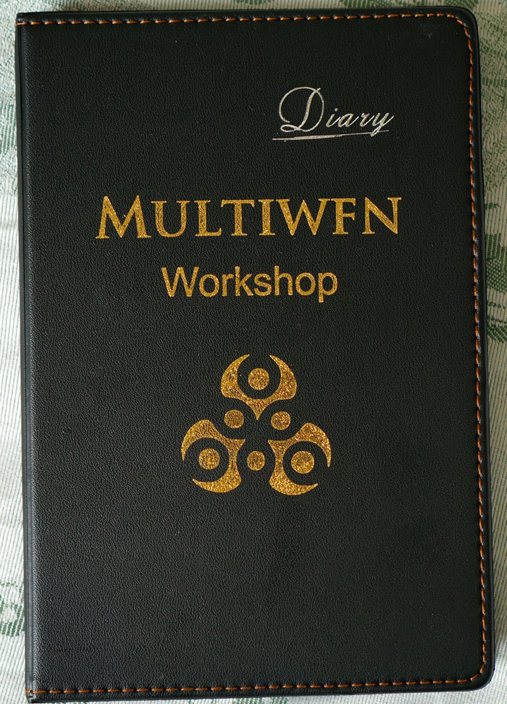

Multiwfn圆珠笔，每人两个  
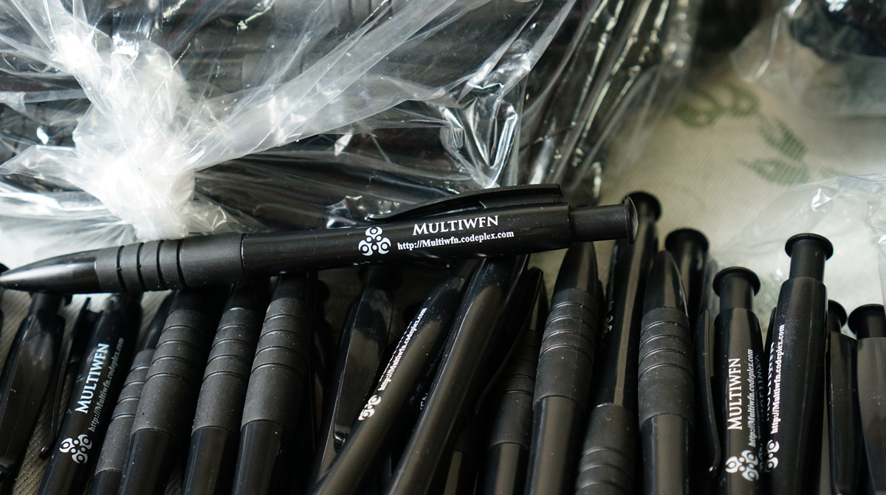

Multiwfn布袋（图中是袋子两面的图案），每人一个  
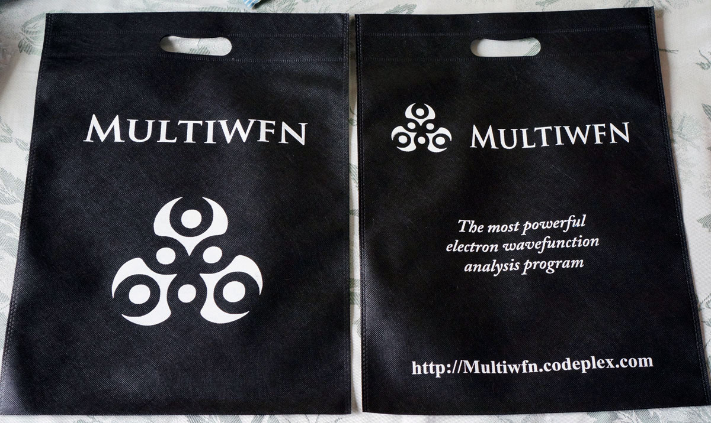

Multiwfn明信片，每人一个，三种图案随机  
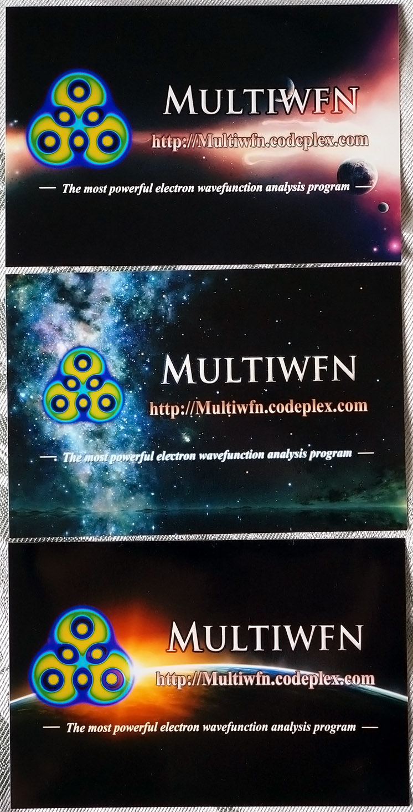

Multiwfn的钥匙链，由于笔者财力所限，只有先到的少数人才赠送了。有几种不同样式的  
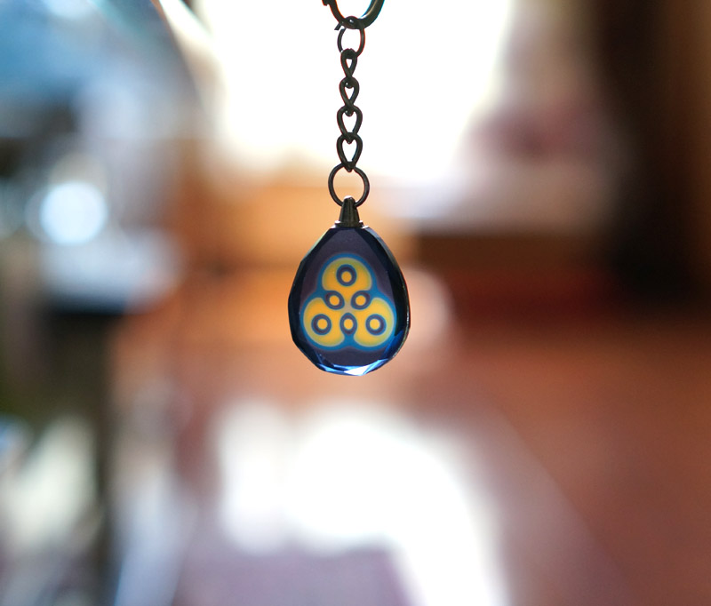  
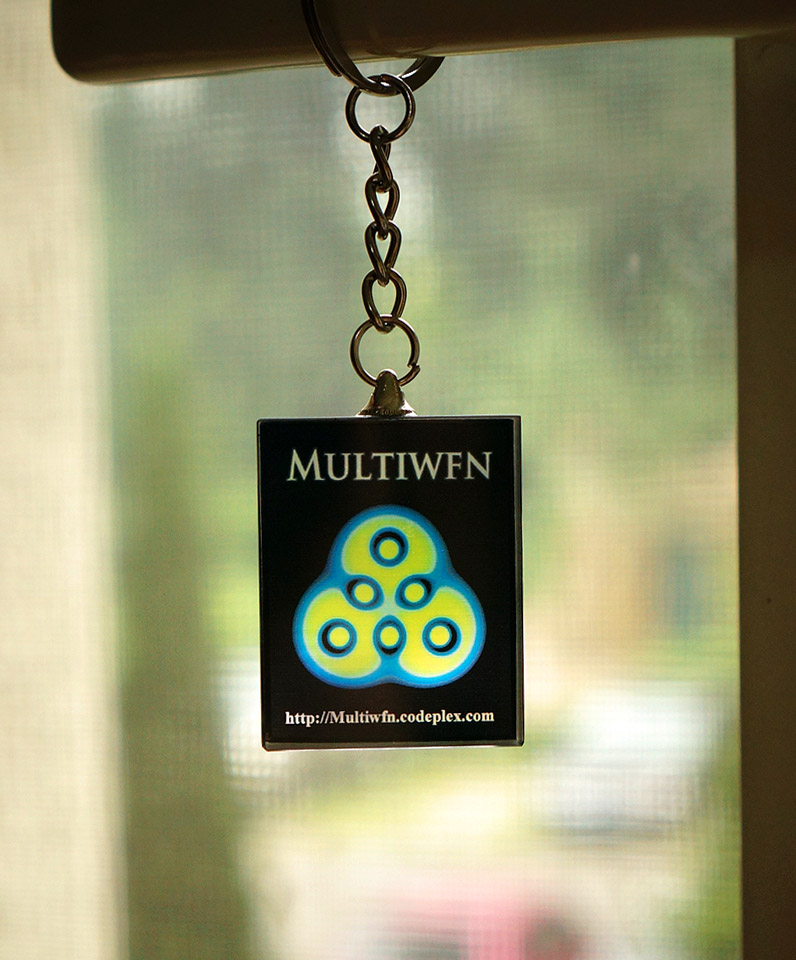

PS1：最后再强调一次，不要把培训的主讲人（笔者）和Sobereva这个ID搞混，主讲人只是共用Sobereva这个ID的团伙当中的一个。

PS2：此次培训得到了场地提供方北京科技大学的化学与生物工程学院的诸位同志的支持，在此表示感谢。
