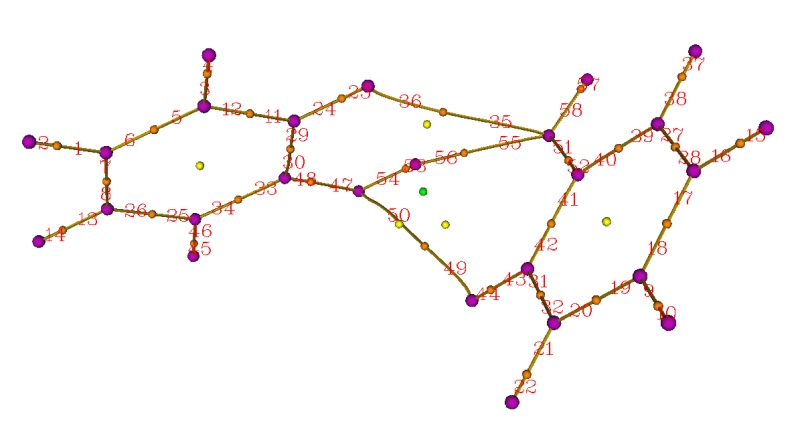
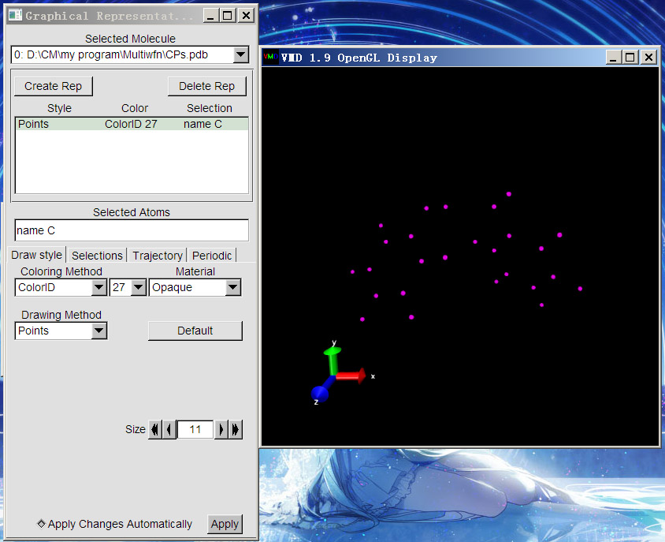
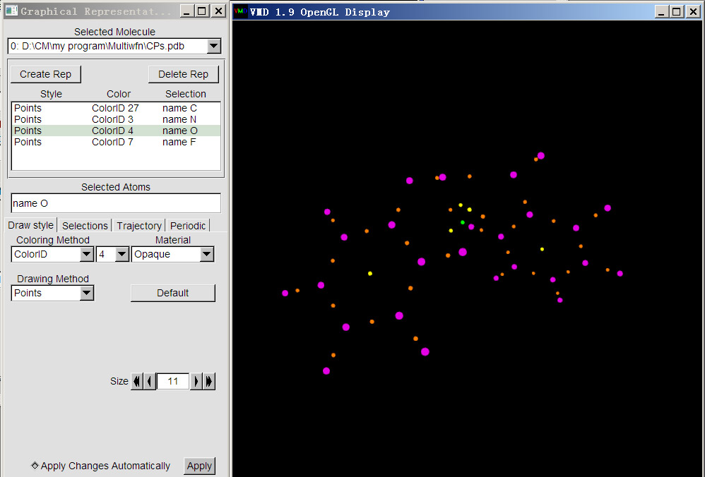
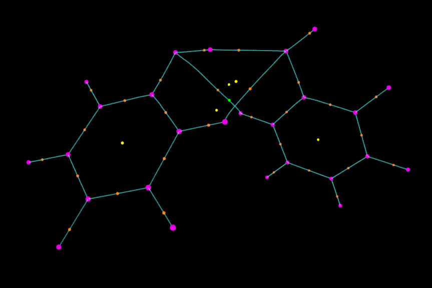
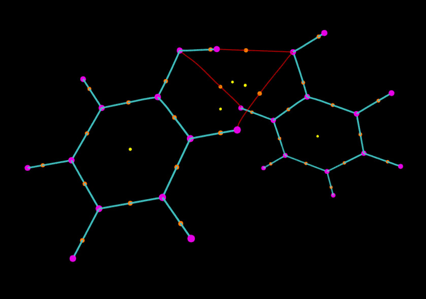
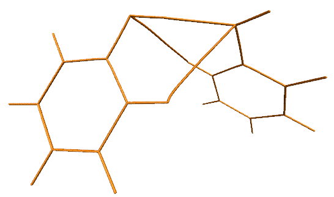
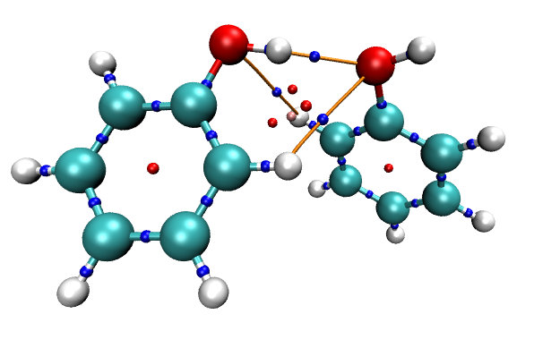
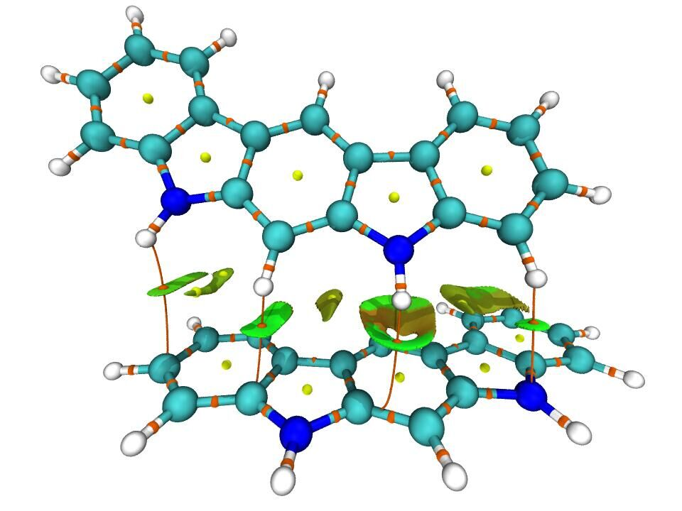

**注**：强烈建议读者先阅读笔者后来写的《使用Multiwfn+VMD快速地绘制高质量AIM拓扑分析图》（<http://sobereva.com/445>），其中将本文的操作过程通过脚本极大地简化，只需要不到1/20的时间就可以绘制出本文相同效果的图像。

**Multiwfn结合VMD绘制AIM拓扑分析图**Drawing AIM topological analysis diagram by combinely using Multiwfn and VMD

文/Sobereva @[北京科音](http://www.keinsci.com)  
First release: 2013-Nov-5  Last update: 2018-Feb-27

实空间函数的拓扑分析是Multiwfn（<http://sobereva.com/multiwfn>）的重要功能之一，电子密度及其拉普拉斯函数的拓扑分析是AIM分析中的核心，而ELF、LOL的拓扑分析在分析成键方式、芳香性等问题上也有重要应用。在Multiwfn中这些都可以通过主功能2来实现。关于实空间函数的拓扑分析的基本概念和在Multiwfn里的操作在此帖都有介绍：《使用Multiwfn做拓扑分析以及计算孤对电子角度》（<http://sobereva.com/108>）。

虽然Multiwfn的拓扑分析功能本身就能绘制出临界点和拓扑路径，也足够满足通常的需要，但是如果想得到更漂亮的效果，或者更自由地控制显示方式，则可以将分析结果从Multiwfn导出并通过VMD程序来绘制。此文就介绍下过程。这里以苯酚的电子密度拓扑分析（或称AIM拓扑分析）为例来说明。

首先我们还是先照常在Multiwfn里找出体系的各种临界点并生成键径。启动Multiwfn，然后依次输入  
examples\PhenolDimer.wfn  
2    //主功能2  
2    //以原子核位置作为搜索临界点的初猜  
3    //以每两个原子的中点作为搜索临界点的初猜  
0    //查看结果  
从命令行界面中可以看到找出了61个临界点，并且Poincare-Hopf关系已经满足了。同时从蹦出来的图形窗口中也可以凭直觉看到该有的临界点也都有了，说明临界点都找全了。于是关闭窗口，然后选8，就把键径都生成了，这即是(3,-3)和(3,-1)临界点之间的拓扑路径。虽然也可以再选9把(3,+1)和(3,+3)之间的拓扑路径生成出来，但没太大价值，这里就不做了。然后选0，可以看到临界点和键径都出现在图中了，紫/橙/黄/绿小球分别代表核临界点/键临界点/环临界点/笼临界点。如果点击窗口右侧"Paths labels"复选框，还可以看到每条键径的序号，如下所示

关闭图形窗口，然后将临界点和拓扑路径都导出为.pdb文件。具体做法是选-4进入临界点修改/导出界面，然后选6 Export CPs as pdb file in current folder，临界点就被导出到当前目录下的CPs.pdb里了，每个临界点对应此文件中的一个原子，并且如屏幕提示所示，不同元素的原子对应不同类型临界点，即碳/氮/氧/氟分别对应(3,-3)/(3,-1)/(3,+1)/(3,+3)。选0退回到拓扑分析主菜单，再进入选项-5，即修改、显示、导出以及计算拓扑路径上的性质的界面。然后选6 Export paths as paths.pdb file in current folder，这样拓扑路径就被导出到当前目录下的path.pdb里了。实际上拓扑路径就是由一连串紧挨着的点来表示的，整体来看就连成了曲线。在path.pdb里，这些构成键径的点对应于一个个碳原子，每个原子所属残基编号就对应于拓扑路径的编号。

下面我们就要在VMD中绘图了。VMD是个十分灵活、效果出色的免费的分子可视化软件，下载地址见<http://www.ks.uiuc.edu/Research/vmd/>。这里用VMD1.9版。

启动VMD，将CPs.pdb拖到主窗口VMD Main中，然后就会看到一副虽然有点艺术感，但是连线乱七八糟的图，这是因为VMD自动判断了原子间连接关系。我们选Graphics-Representation来改变显示方式。这里让(3,-3)临界点都用紫色圆点显示，就改成下图中这样，即Selected Atoms输入name C，Drawing Method用Points，Coloring Method用ColorID并自己指定颜色，大小通过Size来调

然后把(3,-1)也显示。点击Create Rep新建显示方式，输入name N，然后设定好绘制方法、颜色和尺寸。然后再类似地显示出(3,+1)和(3,+3)，它们用name O和name F选择。最后绘制的效果如下。为了凸显(3,-3)临界点，它的size由默认的11改为了20。

上图用的是黑色背景，临界点位置看得很清楚，但是如果用白色背景（命令行窗口输入color Display Background white），临界点的颜色应该用得深一些。

接下来显示键径。我们把paths.pdb拖进VMD Main窗口，进入Graphics-Representation后确认Selected Molecule已经切换到paths.pdb了。将Drawing Method改为Points，Size改为1，颜色改为青色。这时图像看起来效果已经很好了。

我们还可以对图像进行更进一步修改。比如，我们想让两个苯酚之间的键径和分子内的键径区分开以便观察。为此，我们先从本文的第一张图找出分子间键径的编号，可以看出编号是35 36 55 56 49 50。然后我们在把键径对应的selected atoms框的内容由默认的all改为all not resid 35 36 55 56 49 50，这时由图可见只剩下分子内的键径显示在图中了。然后点击Create Rep，将新的显示方式的所选原子设为resid 35 36 55 56 49 50，然后把颜色设为红色。我们再做些调整，比如这里把分子内的键径加粗（即设大size），相应地把(3,-3)和(3,-1)临界点的size也加大一些，并且不让(3,+3)显示出来，最终的图像如下所示

可见显示效果非常不错。依照这种方法，还可以绘制诸如ELF、LOL等实空间函数的拓扑路径，操作过程一样，这里就不累述了。

我们也可以改用VDW球方式显示键径的每个点，这样键径更有质感。具体来说，在显示键径的那个Rep里把Drawing Method改为VDW，然后把界面中Sphere Scale选项修改得很小。但是会发现，最小也只能设为0.1，但此时键径显得还是太粗。为了设得更小，我们需要利用命令行。为了获取对应的命令行指令，我们选File - Log Tcl Commands to Console，然后随便修改一下Sphere Scale，文本窗口会出现比如mol modstyle 0 0 VDW 0.200000 12.000000。其中的0.2对应当前的Sphere Scale，将之改为较小的值，然后把命令粘贴到文本窗口里，比如用mol modstyle 0 0 VDW 0.02 12.000000，则显示键径的那个Rep对应的效果就是这样了：  
  
  
对于考察分子间相互作用的目的，其实显示化学键的键径没什么大用，可以把体系结构以CPK方式显示，这样化学键的键径就会被遮盖住，而只显示出分子间相互作用的键径（体系的pdb结构文件可以通过Multiwfn主功能100的子功能2的相应选项来导出，导出后拖入到VMD里，设定显示方式即可）。同时，我们也把临界点也用VDW方式显示出来，并用上述方法把其Sphere Scale设为0.07，最终得到的图像如下。

Multiwfn虽然内建了很方便的可视化结果的功能，但为了灵活性考虑很多地方都留出了专门的选项用于导出数据，以便通过外部程序诸如VMD、sigmaplot等程序绘图，以满足一些有个性用户的需求。使用Multiwfn时应当多尝试，对照着手册相应章节领会各个选项的含义。Multiwfn的灵活性与VMD的灵活性相结合使得绘制许多需要用户高度自定义的图像成为了可能，这是其它任何程序都无法代替的。其它的Multiwfn与VMD相结合进行绘图的例子见《通过键级曲线和ELF/LOL/RDG等值面动画研究化学反应过程》（<http://sobereva.com/200>）和《使用Multiwfn结合VMD分析和绘制分子表面静电势分布》（<http://sobereva.com/196>）。

值得一提的是，在VMD中还可以把RDG填色等值面图和临界点、键径图显示在一起，使得弱相互作用信息展现得更丰富。RDG填色等值面图的介绍看Multiwfn手册3.22.1节，绘制这种RDG+AIM图的例子看Multiwfn手册4.20.1节。下面是思想家公社QQ群里的群友“叶”绘制的这种图：

